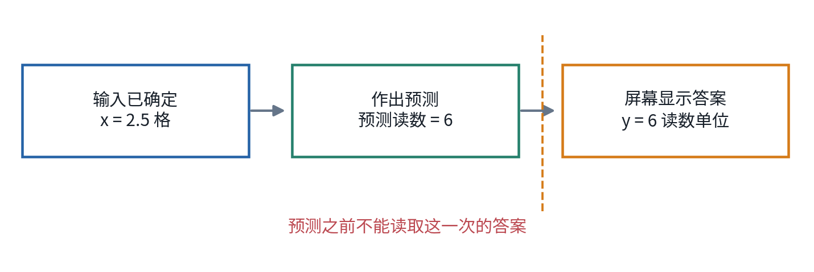
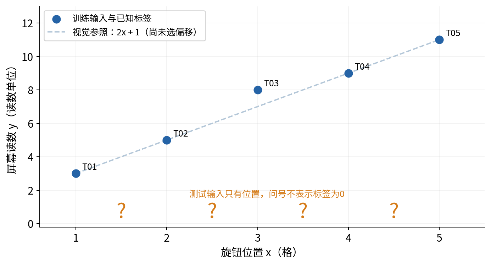
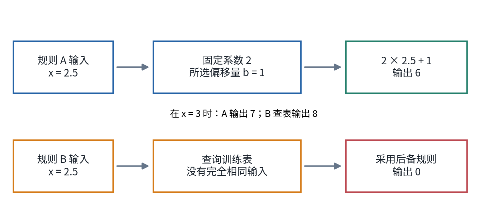
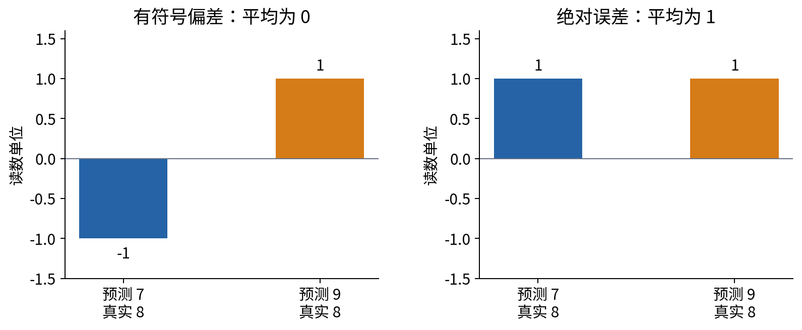
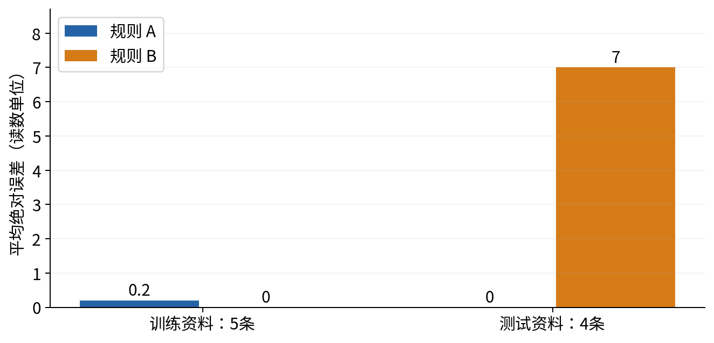
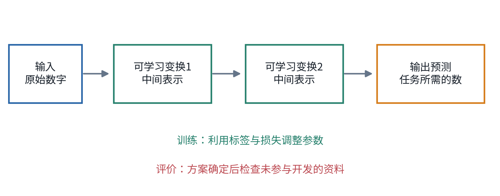

# 深度学习问题与证据

## 第001单元 从一张校准表开始

一个模型可以把看过的答案全部记住，却在下一个输入到来时毫无用处。本讲从这件事出发，建立整门课反复使用的一条判断线：模型在什么信息条件下给出预测，评价又用了哪些没有参与改进模型的资料？我们先把这条线画清楚，再学习更复杂的网络。复杂计算不能替代清楚的问题。

你不需要学过机器学习、代数、微积分或 Python。我们只用加减乘除，并在第一次出现时解释所有符号。配套程序是纸笔计算的核对工具；看不懂代码不妨碍完成本讲。下一单元会逐行重新实现这里的计算。

贯穿本讲的是一台完全虚构的校准装置。研究者拨动输入旋钮，再读取屏幕数字。希望在拨动之后、屏幕结果出现之前，预测将看到多少。所有数值都是为教学原创构造的，没有真实设备、测量对象或商业用途。我们故意留下一条偏离简单规律的训练记录，让“记住记录”和“延伸规律”发生冲突。

学完后，你应能亲手算出两个规则的训练误差和测试误差，指出它们使用了哪些信息，并写一段没有夸大证据的结论。一个正确结论可能是“在这四个合成测试点上规则A误差更小”；它不该自动升级成“深度学习可靠”“简单模型永远更好”或“可以投入真实使用”。

## 一 先写预测发生的时点

假设旋钮刚拨到 2.5，屏幕还没显示新读数。此刻能知道的是旋钮位置，不能知道尚未出现的屏幕读数。我们的任务是在这一刻输出一个数。预测结束后，屏幕读数才成为可以核对的答案。这里的“以后”未必是几天以后，也可能只隔一瞬间；关键是做决定时答案是否已经可用。

一次完整记录称为一个样本。输入旋钮位置是特征，本例只用一个特征。屏幕实际读数是标签，因为我们把它指定为希望预测的答案。标签不是数据自带的身份：如果任务改成根据屏幕值反查旋钮位置，两列角色就改变了。因此，先定义任务，再决定哪列作为输入。

用字母 $x$ 表示旋钮位置，用 $y$ 表示屏幕读数。字母只是数的名字。例如某次记录 $x=2$、$y=5$，表示旋钮为2时看到5。它们都是单个数，称为标量，不是列表或矩阵。旋钮单位写作“格”，屏幕单位写作“读数单位”；二者不是同一种单位，不能直接相加。

预测值写作 $\hat y$，读成“y帽”。帽子提醒我们：这是尚待核对的猜测，不能因为打印出来就当成观测答案。若模型在 $x=2.5$ 时输出6，可以写作 $\hat y=6$。之后观察到 $y=6$，本次猜测恰好正确；若观察到6.2，猜测就低了0.2。

图1把记录、预测和核对放到不同位置。请特别注意：研究者事后整理数据时可能同时拥有所有列，但模拟那次预测时仍只能使用当时可获得的输入。把“屏幕读数的副本”当输入，程序会非常准确；它完成的是抄答案，不是刚才定义的提前预测。这个错误后来叫作信息泄漏。

除了列名，还应说明一次记录对应什么。本讲每行是一次独立安排的合成输入输出，不把同一行复制两次伪装成两次实验。真实装置的连续读数可能互相依赖，不能仅凭行数判断证据多少；相关样本的问题将在概率统计单元展开。

## 二 把已有记录和留待检查的记录分开

我们先交给模型五条训练记录。训练资料可以用于设定规则、选择参数和发现问题。为了让读者能手算，数值如下。

|记录编号|旋钮位置 $x$（格）|屏幕读数 $y$（读数单位）|
|---|---:|---:|
|T01|1|3|
|T02|2|5|
|T03|3|8|
|T04|4|9|
|T05|5|11|

训练表中大部分读数似乎遵循“旋钮位置乘2再加1”。不过第三行给出8，而这条简单规则会给7。我们没有权利仅因为某行不合心意就删除它。可能原因包括测量噪声、记录错误或简单规律本来不完整；在这个人为例子中，作者知道它是刻意设置的扰动，学习者应把它保留在原样的计算里。

另外准备四个新的输入：1.5、2.5、3.5、4.5。它们称为测试输入，稍后才揭示标签。测试资料用于方案确定之后的评价。本例不再用测试结果挑选偏移量、改变规则或修改失败时的处理方法。否则所谓测试资料也在帮助模型改进，不能继续承担原来的独立检查角色。

图2中的坐标图不要求你学过解析几何。横向位置表示旋钮大小，纵向高度表示屏幕读数；一个点的横纵位置就对应表格中的一行。橙色问号放在底部只是标记输入位置，不代表测试标签是零。等标签揭示后，我们才能把它们放到正确高度。

纸面上可以把测试标签折起来，程序里可以放进单独文件。它们都是教学中的纪律提醒，不能构成真正的访问安全：公开资料的答案人人都能打开。若你已经看过答案，仍可练习正确流程，但不能声称自己完成了从未见过的盲测。真实研究应由独立保管、时间隔离或明确的团队权限来支撑封存。

## 三 两种规则把什么带到了新输入上

规则A把输入乘2，再加一个偏移量 $b$：

$$\hat y=2x+b.$$

这里的2带有“每格对应2读数单位”的含义，$b$ 的单位也是读数单位，因此乘积和偏移量可以相加。模型是从输入产生输出的一套计算规则；参数是规则中能根据数据调整的数。本讲把斜率2预先固定，只允许从0、1、2三个候选偏移量中选择 $b$。这是一种极小的学习过程，不是已经证明斜率应为2，也不是一般的最优拟合算法。

例如 $b=1$、$x=4$ 时，先算 $2\times4=8$，再算 $8+1=9$。一旦偏移量选好，规则A面对没有见过的 $x=2.5$ 也能按同样步骤输出6。它之所以能延伸，是因为我们事先限制它必须使用这条计算形式。这个限制可能有帮助，也可能让它错过真实的复杂关系。

规则B则保存五对训练输入和答案。如果新输入与某个训练输入完全相同，就返回那行的标签；找不到时返回0。这是一个完整可执行的规则，因为我们已经说明未命中的处理办法。只说“把训练集背下来”却不说明新输入怎么办，就还没有定义可评价的预测模型。

规则B在 $x=3$ 时返回8，在 $x=2.5$ 时返回0。这里选择0是为了把一种失败机制看清楚，不是说所有记忆型算法都使用0。近邻方法可以在附近找答案，检索系统可以返回相似样本；它们会有不同表现。这个例子只能反驳“训练表完全正确就足够”，不能证明所有查表、所有复杂模型或所有神经网络都无效。

请沿图3各自走一遍 $x=3$ 和 $x=2.5$。前者是见过的输入，后者没有出现过。两条路径都能产生一个数，但理由不同。模型的输出不是说明书；我们必须知道它背后的规则，才能判断哪些输入会暴露薄弱处。

## 四 为什么误差不能直接相加

预测与真实值相减得到带正负号的偏差。预测7、实际8，偏差是 $7-8=-1$；预测9、实际8，偏差是 $9-8=1$。正负号对诊断很有用：负号表示低估，正号表示高估。但把一次低估1和一次高估1相加会得到0，掩盖两次都没猜中的事实。

本讲采用绝对误差。它把偏差的大小留下，负号去掉。记作 $|\hat y-y|$，两条竖线读作绝对值。于是 $|-1|=1$、$|1|=1$、$|0|=0$。这不是唯一的损失函数；“损失”就是把一次预测有多差转换成一个用于比较的数。后来会比较平方误差、分类损失与任务代价，目前只固定这一种。

五次绝对误差加起来再除以5，得到平均绝对误差，英文缩写 MAE。平均的意思是把总误差均分到每条记录上，并不表示每条记录实际都错那么多。若误差为0、0、1、0、0，总和为1，平均为 $1\div5=0.2$ 读数单位。

一般有 $n$ 条记录时，可以写成下面的形式。$n$ 是正整数，表示记录数量；$i$ 是从1数到 $n$ 的编号。$y_i$ 与 $\hat y_i$ 分别指第 $i$ 条的真实值与预测值。符号 $\sum$ 表示把其后表达式按所有编号相加，不是新的乘法。

$$\mathrm{MAE}=\frac{1}{n}\sum_{i=1}^{n}|\hat y_i-y_i|.$$

若集合里一条记录都没有，$n=0$，这个平均没有定义，不能报成0。若标签少一条，也不能悄悄跳过而仍除以原来的数量。程序中的输入检查将明确拒绝空数据和长度不一致，避免把数据错误变成一个看似漂亮的指标。

图4左侧两次偏差相加为0，右侧绝对误差总和为2。以后面对真实任务，还应看最差案例、不同组的误差与失败代价。一个平均数不能回答所有问题。本讲保留逐条预测表，正是为了能够回头检查这个平均来自哪几行。

## 五 用训练表选择规则A的偏移量

现在允许在三个候选 $b$ 中比较训练 MAE。不能看到测试标签后再增加一个“刚好合适”的候选。先算 $b=0$：预测依次是2、4、6、8、10，对应绝对误差1、1、2、1、1，总和6，平均 $6\div5=1.2$。

当 $b=1$ 时，预测是3、5、7、9、11，绝对误差0、0、1、0、0，总和1，平均0.2。当 $b=2$ 时，预测是4、6、8、10、12，绝对误差1、1、0、1、1，总和4，平均0.8。因此，在明确列出的三个候选中，$b=1$ 的训练平均绝对误差最小。

|候选偏移量|五条训练预测|绝对误差总和|训练 MAE|
|---:|---|---:|---:|
|0|2，4，6，8，10|6|1.2|
|1|3，5，7，9，11|1|0.2|
|2|4，6，8，10，12|4|0.8|

选择过程包含三个容易被忽略的决定：候选集合是0、1、2；评分用绝对误差的平均；若多个候选同分，则取数值最小的候选。最后一项在当前数据上用不到，但提前写下它可以让修改实验仍有确定结果。没有写明的选择自由，也会成为重复实验不一致的来源。

规则B对所有训练输入都返回训练答案，训练 MAE 为0。若只看这一列，B好于A。这个结果是真的，不应为了偏爱A而改写。问题在于训练成绩回答的是“已经用于构造规则的五行表现如何”，并没有回答“下一个没有出现过的输入表现如何”。

两种规则此时都冻结。冻结是指这次评价前确定参数、未命中处理、评分方法和待评输入；不是说今后不能改模型。之后可以进行新研究，但新研究必须承认已看过哪些反馈，并安排相应的新评价资料。

## 六 揭示测试答案后的结论

测试标签现在公开：1.5对应4，2.5对应6，3.5对应8，4.5对应10。规则A使用刚才冻结的 $b=1$，四条预测正好相同，测试 MAE 为0。规则B四次都未命中，返回0，绝对误差为4、6、8、10，总和28，测试 MAE 为 $28\div4=7$。

|测试编号|输入|标签|规则A预测|规则A绝对误差|规则B预测|规则B绝对误差|
|---|---:|---:|---:|---:|---:|---:|
|E01|1.5|4|4|0|0|4|
|E02|2.5|6|6|0|0|6|
|E03|3.5|8|8|0|0|8|
|E04|4.5|10|10|0|0|10|

能够对没有直接用于确定规则的新资料作出有效预测，称为泛化。图5提供了一个很小的泛化例子，却不是一个泛化定理。我们只检查四个设计好的输入，而且它们位于训练输入范围内部。没有检查 $x=20$，没有换装置，没有考虑时间漂移，没有估计真实使用中的误差分布。

再做一个明确标为“压力测试”的改变：假想另一批装置遵循 $y=3x+1$。保留A的冻结规则，在相同四个输入上得到真实值5.5、8.5、11.5、14.5；预测仍是4、6、8、10，误差是1.5、2.5、3.5、4.5，平均为3。原来的零测试误差没有保护它免受关系改变的影响。

这个改变在教学中不是新的真实设备数据，也不能冒充独立实证。它是作者设定的反例，用于指出结论依赖输入输出关系。后来我们会用分布漂移等语言系统描述这种变化，现在先记住朴素事实：过去的规律是否继续成立，需要新的证据。

## 七 深度学习在这条线的什么位置

规则A是一层简单计算，规则B是一张查表。它们都不是本课程随后要训练的深层神经网络。本讲把它们放在开头，是为了说明学习任务、输入、参数、预测、损失与评价的含义。这些对象在复杂模型里仍然存在，只是内部计算更多。

深度学习的一条常见思路，是把多步可学习的变换接起来，让中间结果成为下一步的输入。以视觉任务作直观例子，输入可能是图像中各位置的数字，一步变换组合邻近信息，下一步进一步组合，最后输出任务所需的数。这个图景帮助理解“表示层次”；它不保证每一层都自动对应人能命名的概念，也不保证层数越多越好。[1]

图6中的方框目前只表示“按某些参数进行的一步处理”，不用提前理解矩阵或求导。第023至030单元会逐步把这些框拆开，说明怎样计算与调整参数。现在不能从一张结构图直接推断它已经学到了什么，需要用输出、对照实验和失败样本来检查。

大语言模型是深度学习的一类重要应用，深度学习还用于图像、语音、时序、科学计算等任务。识别任务与生成任务的输出和评价不同，不宜用同一个“准确率”概括。我们不靠背模型名称入门，而是追问：输入是什么，目标是什么，反馈如何产生，信息边界在哪里？

## 八 写出一份可以被别人复核的实验说明

本例可以写成一段短报告：“在原创合成校准资料上，于读取屏幕前，使用旋钮位置预测读数。规则A固定系数2，在训练资料上从偏移量0、1、2中按 MAE 选择1；规则B保存训练对，未命中返回0。所有规则在查看测试标签前按课程流程确定。在四个给定新输入上，A的 MAE 为0，B为7。训练 MAE 分别为0.2和0。该结果演示训练拟合不足以证明新输入表现，不支持对真实装置或所有模型的普遍结论。”

公开教材的读者往往已经接触答案，所以报告还应诚实补充“这是公开答案的流程练习，不是未知测试的正式研究”。清楚说明这一限制，不会让练习失去价值；它让练习训练正确的研究习惯。

复核者至少需要原始数据、规则完整定义、候选集合、指标计算方式、逐条预测和汇总结果。本讲配套程序会输出这些记录，不会修改原始CSV。别人能从同一份资料得到相同数字，是可重复计算的一个起点；它仍不同于其他设备、样本或时间上得到同样科学结论。

## 九 练习

1. 不看测试标签，写清本任务的样本、输入、目标、预测时点和不能使用的字段。说明把屏幕读数副本加入输入为什么有问题。
2. 手算偏移量为2时五条绝对误差与 MAE。再算规则B的训练 MAE。哪一个问题被这些数字回答，哪一个还没回答？
3. 若把B的未命中输出改成训练标签平均值，先算这个平均值，再算四条测试误差。说明这是否推翻了本讲结论。
4. 某同学看到测试分数后将候选偏移量改为0、1、1.5、2，又报告同一测试为独立最终评价。指出问题，并给出下一步较诚实的处理。
5. 在改变关系的压力测试中，用逐行加减法核对A的 MAE。解释为什么不能把原测试零误差写成“任何未来输入都可靠”。
6. 给出一组两条预测，带符号误差平均为0但绝对误差平均不为0。说明空数据的平均误差为什么不能随手设为0。
7. 阅读完整实验记录，写出一句“证据支持”的结论和一句“证据尚不支持”的结论。不要使用“显然有效”“已证明最好”等无范围措辞。

## 参考与来源边界

[1] Ian Goodfellow、Yoshua Bengio、Aaron Courville，《Deep Learning》作者公开版，第1章 Introduction，2016。用于核对深度学习、表示学习与函数组合的基本定位。本文的校准数据、手算、图和教学叙事独立编写，未复制原书图文。[作者公开章节](https://www.deeplearningbook.org/contents/intro.html)。

本单元的其余数字均可由随附数据和四则运算核验，不借文献权威替代计算。统计推断、真实任务评价与神经网络训练的更细条件留给各自单元逐步建立。
