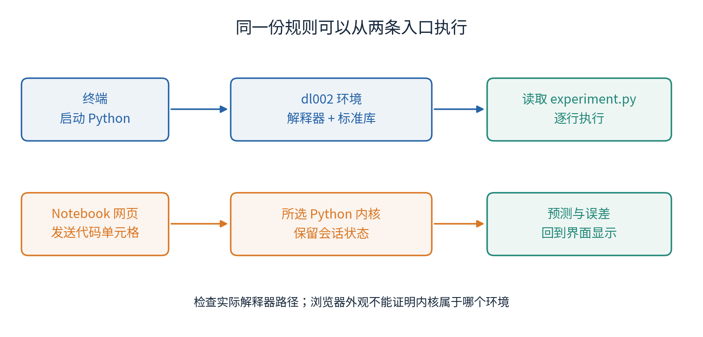
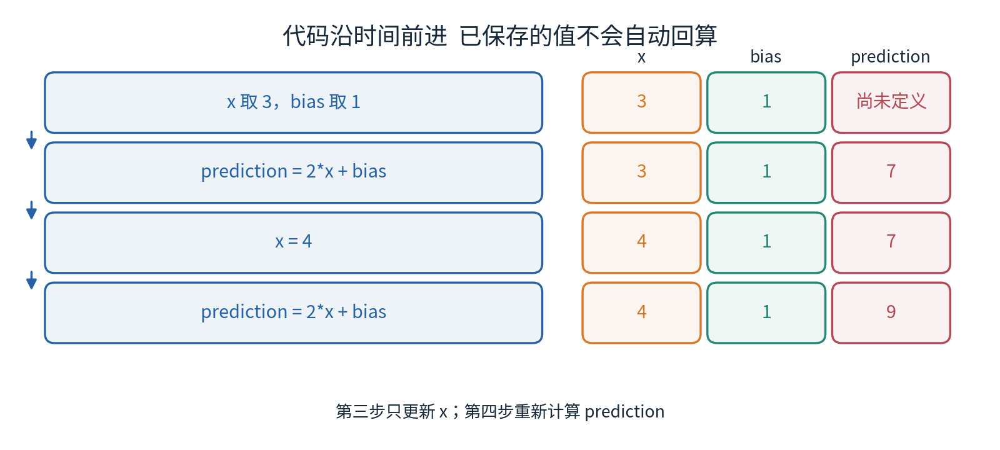
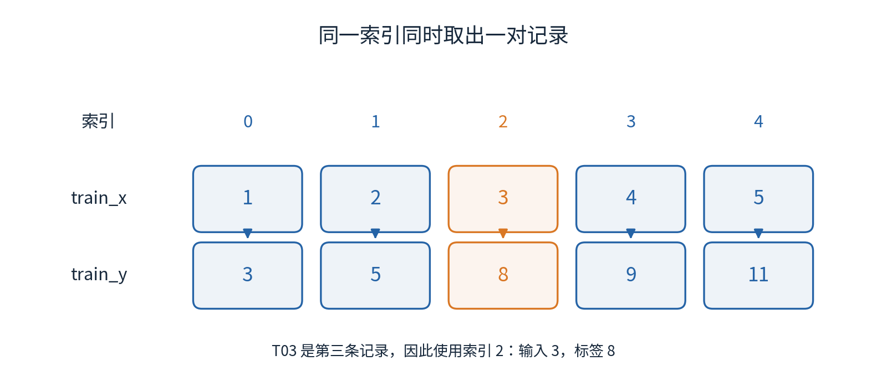
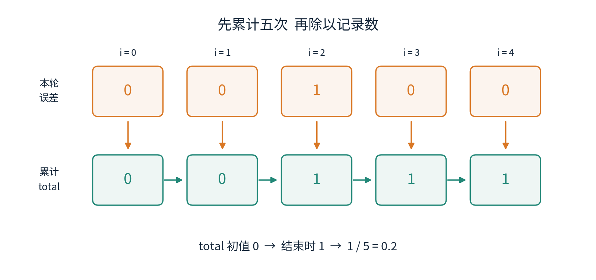
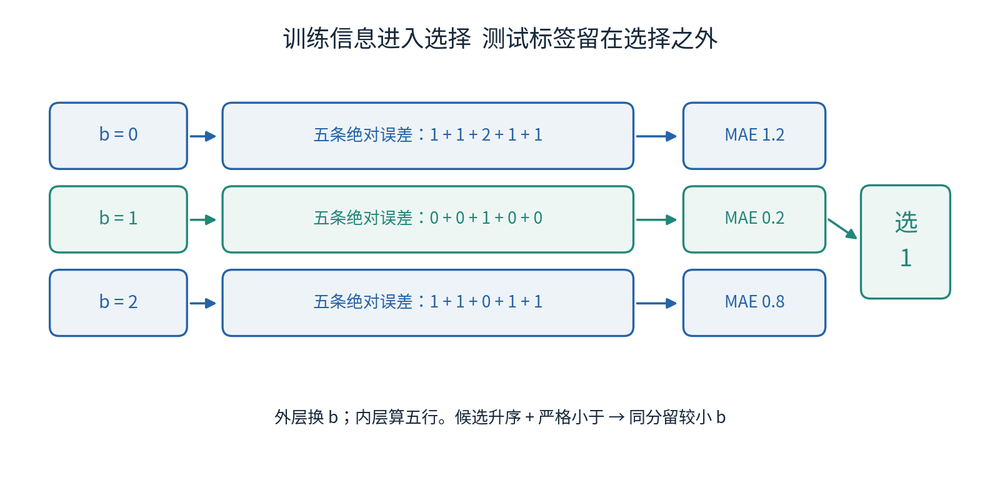
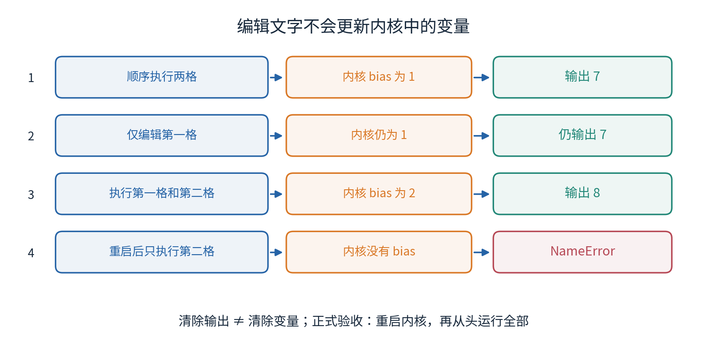

# Anaconda与Python第一份实验

## 第002单元 让同一份计算从头再来

第一单元里，我们用五条训练记录选出偏移量1，再比较计算规则A和查表规则B。本单元的任务没有换：仍然是那台虚构校准装置，仍然是相同的数据和规则。变化在于，你将把纸笔步骤写成一份别人能从第一行运行到最后一行的程序。最后得到熟悉的数字只是第一步；还要知道数字从哪来、用了哪个Python，以及关掉会话后为什么仍能重现。

唯一先修是001，不假定你写过任何代码。我们从“在哪里输入命令”讲起，再引入变量、数字、判断、列表、循环和函数。每个语法都会先解释，再放进校准实验。暂时不用NumPy、PyTorch、自动求导或神经网络，避免把还没有看懂的四则运算交给大型工具。下一单元再系统处理文件、异常和最小测试。

随附experiment.py是纯Python标准库脚本；experiment.ipynb把同样计算拆成有解释的单元格。data目录保存001的原始合成表，本讲为降低起步门槛，把相同数字明确写成列表。审查程序会逐项检查列表与表格相同。文件读取不是本单元的隐藏先修。

## 一 四个名字对应四件事

Python首先是一种表达计算步骤的语言；Python解释器是读取这些步骤、实际执行它们的软件。脚本是以.py结尾的纯文本文件，里面保存Python代码。Anaconda Distribution是一种软件发行版，帮助安装Python及一批常用工具；其中conda负责管理软件包和环境。把这些名字分清，才能理解“装了软件却运行不了某份代码”发生在哪里。

环境可以先理解为一个独立的工具箱：某个版本的Python以及分配给它的软件包放在一起。名为dl002的环境与base环境可以使用不同版本的工具。激活环境，是让当前终端优先使用这个工具箱。它不会把所有程序窗口自动切换过去；已经打开的Notebook内核可能还属于另一个环境。

终端或命令行窗口接收的是启动程序、切换目录之类的系统命令。Python交互窗口接收的是Python语句。Jupyter Notebook则把文字、代码和输出组织成一个网页文档，代码交给内核执行。内核是持续运行的计算进程，关闭一个网页标签未必结束它。



图1中的两条路径最终都需要Python。网页是操作界面，不是运算规则本身。安装完成、界面打开、代码执行、计算正确，是四个不同的检查点。我们会逐个留下证据，而不是把一张成功启动的截图当作整个实验的验收。

## 二 安装之后先认清当前环境

完整的Windows、macOS和Linux步骤放在独立实验指南中。只从Anaconda官方安装入口选择适合操作系统和处理器架构的安装器。安装前读系统要求与条款；单位电脑先遵守本单位软件和网络政策。安装器版本、界面和渠道条款可能变化，本讲不把某个旧安装器文件名写成永久答案。[Anaconda安装入口](https://www.anaconda.com/docs/getting-started/installation)

Windows初学者优先打开Anaconda Prompt；macOS和Linux使用已按官方步骤初始化的终端。在这里输入下面的命令，每一行后按回车。不要把命令放进Python的三个大于号提示符后面。

```text
conda --version
conda create --name dl002 python=3.12
conda activate dl002
python --version
conda info --envs
```

第一行询问conda版本。第二行创建名为dl002的环境并请求Python 3.12系列，下载和安装之前应检查清单与提示。第三行激活环境。第四行查看当前启动的Python版本。第五行列出环境，通常用星号标出当前环境。这里的双短横线和后面的单词是命令选项，不是Python减法。[官方环境说明](https://www.anaconda.com/docs/getting-started/working-with-conda/environments)

命令中的dl002是本课选定的名称，不是必须购买或下载的产品。python=3.12表示版本要求，不保证不同日期、不同平台得到完全相同的补丁版本和底层包。实验记录应保存实际版本。环境已经存在时不要贸然删除它；先激活并检查，或给新的独立环境取另一个名字。

还应核对解释器位置。在终端输入python并回车，看到类似三个大于号的提示符后，依次输入以下Python语句。代码框不包含提示符，复制时只复制代码。

```python
import sys
print(sys.version)
print(sys.executable)
exit()
```

import表示载入一个模块。模块是已经写好的一组工具；sys随Python提供，能告诉我们解释器的情况。点号表示取出模块内的一个名字：sys.version是版本文本，sys.executable是正在使用的解释器文件位置。print把括号里的内容显示出来；exit()退出交互解释器，回到终端。括号意味着调用一个动作，这个动作称为函数。此处不需要自己编写函数。

解释器位置包含你机器上的目录，路径因系统和安装选择而不同。应确认它属于预期环境，不要逐字与教材的机器路径比。分享运行记录前注意路径可能暴露用户名。Notebook里也运行前面三行；如果位置不同，应先更换内核或在正确环境中启动Jupyter，再重算，而不是不断向不确定的地方安装包。

## 三 第一条计算和第一份脚本

先在Python交互窗口试两行。第一行是一条表达式，即能算出一个值的写法。交互窗口会显示结果。第二行使用print明确要求显示，因此同样写法放在脚本里也能看到输出。

```python
2 * 3 + 1
print(2 * 3 + 1)
```

星号是乘法，斜杠是除法，加减仍用+和-。先乘除后加减，圆括号可改变顺序。这里得到7，与001中规则A在输入3、偏移量1时的预测一致。实际训练标签是8，所以预测不是答案。请先手算再运行，保留这个差异。

脚本可用Jupyter文本编辑器或普通代码编辑器创建。新建纯文本，输入print那一行，保存成first.py，编码选UTF-8。不要用会添加富文本格式的文字处理软件，也不要让文件实际变成first.py.txt。终端先进入这个文件所在目录，再运行以下命令。

```text
python first.py
```

这里python是要启动的软件，first.py是交给它的文件。它从文件开头执行，结束后把控制权交回终端。若脚本仅含2 * 3 + 1而没有print，程序可以成功结束却不显示结果。这说明“没有输出”和“没有计算”并不是同一件事。[Python解释器说明](https://docs.python.org/3.12/tutorial/interpreter.html)

在脚本中，井号#后面的同一行文字是注释，用来解释目的，不参与运算。比如把那一行改成下面这样。引号包住的文字叫字符串，print可以同时显示文字和数值，逗号分开要显示的不同内容，输出时通常以空格分隔。

```python
# 固定斜率2 偏移量1 输入3
print("A prediction:", 2 * 3 + 1)
```

注意英文半角符号。中文引号“ ”、中文冒号：或全角括号可能看起来相似，却不能代替Python语法中的普通引号、冒号和括号。注释和字符串内容可以使用中文，代码标点仍要准确。

## 四 变量保存的是当前值

每次修改输入都编辑算式很容易漏改。变量给一个值起名字，后面的表达式可以使用这个名字。先读懂右边，再看赋值操作如何更新左边。

```python
x = 3
bias = 1
prediction = 2 * x + bias
print(prediction)
```

第一行把整数3赋给x，第二行把1赋给bias，第三行先取当时的x和bias算出7，再把7赋给prediction。名字可以用英文字母、数字和下划线，但不以数字开头；区分大小写。train_y和Train_y不是同一个名字。为了读者方便，本讲使用有意义的小写英文名称。

赋值号=不是数学中永远成立的等式，也没有建立电子表格那样自动更新的公式关系。接着运行x = 4，只改变x，不会自动重算已经得到的prediction。此时打印prediction仍是7；再次执行prediction = 2 * x + bias后，才变成9。



图2解释了很多Notebook里的“诡异结果”：屏幕上某个单元格的文字已经被你改过，不代表它重新执行过；重新执行它，也不代表依赖它的所有单元格都跟着更新。代码文件的排列、你实际点击的顺序、内存中的当前值，是三个可以不一致的东西。

下面这行在程序里有明确意义：先取旧值，加1，再赋回去。若旧x是3，新x就是4。它不是在寻找满足数学方程x=x+1的实数。

```python
x = x + 1
```

如果从未给x赋值就执行此句，解释器不知道右边的旧x是什么，会报告NameError。遇到错误时，从最后一行看错误类型和名字，再回到指向的代码行检查；不要因错误信息有英文就把整个环境重装。

## 五 整数 小数 文本与真假不能混成一类

3是整数，Python类型名是int；3.0和1.5是浮点数，类型名是float。类型说明程序如何解释一个值。内置函数type可以查看类型；下面已经认识print和函数调用，不需新增控制语法。

```python
print(type(3))
print(type(3.0))
print(1 / 5)
print(2 * 1.5 + 1)
```

输出中会分别出现int、float、0.2、4.0。整数相除使用/也得到浮点结果。4和4.0在这个比较中数值相等，却有不同类型。我们报告MAE时应关心计算意义与允许误差，不能仅凭末尾有没有“.0”判定实验错误。

浮点数不是所有实数的精确存储。对某些十进制小数，计算结果会出现极小差异，例如0.1 + 0.2不一定与直接写下的0.3完全相同。本讲的实验点包含整数和一半，其预测与误差相减很简单；平均值0.2仍应被理解为机器表示。第014单元会系统研究精度。这里先保留原始数值，不要在候选比较之前把分数粗略四舍五入。

有引号的"3"是文本，不是整数3。表达式2 * "3"得到重复的文本"33"，并不是数值6；"3" + 1不能直接相加，会报告TypeError。对确实表示数值的文本可用int("3")或float("1.5")转换，但转换并不能证明来源可靠、单位正确。我们的原始列表直接使用数值，不在本讲暗中处理复杂文件。

判断两个值是否相等使用两个等号==。它产生布尔值，类型名bool，只有True和False两种，分别表示真和假。其他比较符号有<、>、<=、>=、!=，依次表示小于、大于、小于等于、大于等于、不等于。

```python
print(3 == 3.0)
print(7 == 8)
print(0.2 < 0.8)
```

这三行输出True、False、True。不要把True当作一条读数，尽管Python的布尔值与整数存在语言层面的联系；模型输入是否合理由任务决定。接下来if会读取这种真假判断，选择是否执行一段代码。[Python数值与文本入门](https://docs.python.org/3/tutorial/introduction.html)

## 六 条件语句把判断变成行动

假设我们已经知道当前最好训练误差为1.2，新候选的训练误差为0.2，只有新候选更小时才更新记录。if后面写条件，末尾加英文冒号；下一行缩进四个空格，表示它属于条件成立时执行的代码块。else表示条件不成立时走另一条路径，它与if对齐。

```python
best_score = 1.2
score = 0.2
if score < best_score:
    best_score = score
    print("updated")
else:
    print("kept")
print(best_score)
```

先比较0.2是否小于1.2，得到True，于是缩进块更新并输出updated；else块跳过。最后一行没有缩进，因此无论走哪个分支都打印当前最好分数。请把score改为1.2预测会走哪边：因为使用严格的小于号，相同分数不会更新。

缩进是语义，不是排版美化。同一块保持四个空格，不把Tab与空格混用。漏掉冒号可能出现SyntaxError；该缩进却没有缩进可能出现IndentationError。把一行挪出缩进块，即使语法合法，也可能悄悄改变计算过程。

两个条件可以用or表示“至少一个成立”，用and表示“两个都成立”。例如数量为空或长度不同都不能计算对应的平均误差。not表示否定。本单元主要用比较运算；不要把and、or当成数学的乘法加法。[Python控制流程](https://docs.python.org/3/tutorial/controlflow.html)

## 七 列表让一组记录保持次序

第一单元有五条训练记录。列表用方括号把多个元素放在一起，以逗号分隔。下面两个列表按相同顺序保存输入与标签；第一个位置对应同一行记录，第二个位置也如此。

```python
train_x = [1, 2, 3, 4, 5]
train_y = [3, 5, 8, 9, 11]
print(len(train_x))
print(train_x[0], train_y[0])
print(train_x[2], train_y[2])
```

len给出元素数量，得到5。方括号放在已有列表名后面表示按索引取元素。索引从0开始，所以第一条用0，第三条用2，最后一条用4。输出的两对数应是1与3、3与8。数学记录编号T03与Python索引2对应，不要把同一行错配到相邻行。



图3强调：长度相等只说明两边一样长。如果把train_y重新排序、却不同时处理train_x，代码可能照常运行，但数据已不再是那五条记录。不要为了让程序“更整齐”单独排序某一列。

train_x[5]试图读取第六项，本列表没有它，会出现IndexError。空列表写成[]，长度是0。暂时不要记负索引和切片的全部规则；先把从0到长度减1的合法范围读熟。

生成预测时，从空列表开始逐个添加很清楚。predictions.append(value)表示把value添加到predictions末尾。点号这里是在取列表自带的append动作，它不是小数点；这个动作称为方法，后续再系统学习对象与方法。

```python
predictions = []
predictions.append(3)
predictions.append(5)
print(predictions)
```

结果是[3, 5]。append改变已有列表本身。赋值backup = train_y不会自动产生独立备份；两个名字可能指向同一个列表。本讲不修改原始train_y，变化实验重新写一个新列表。保持原始资料不被意外改写，比暂时掌握复制的全部细节更重要。

## 八 循环把同一个步骤逐次执行

for把列表里的元素按顺序逐个取出。下面每一轮让x得到一个输入，算出预测，再添加到列表。这里的in表示从后面的序列逐个取值。缩进规则与if相同。

```python
predictions = []
for x in train_x:
    prediction = 2 * x + 1
    predictions.append(prediction)
print(predictions)
```

五轮中x依次是1、2、3、4、5，结果是[3, 5, 7, 9, 11]。循环前的[]很重要：这是本次计算的新容器；如果在Notebook里只重跑循环而没有重新初始化列表，旧结果后面会继续追加，数量可能变成10。

误差需要同时取出预测和标签，所以改用索引循环。range(n)提供从0开始到n之前的整数，range(5)让循环依次使用0、1、2、3、4；不包含5。abs给出绝对值，比如abs(-1)等于1。下面先让误差总和为0，再逐行增加。

```python
total = 0
for i in range(len(train_y)):
    error = abs(predictions[i] - train_y[i])
    total = total + error
mae_value = total / len(train_y)
print(mae_value)
```

每轮error依次为0、0、1、0、0，总和依次为0、0、1、1、1，最后1/5得到0.2。注意除法在循环外，先累加完成，再除以数量。把total = 0放进循环，会每轮忘掉之前的结果；最后一条误差是0，于是输出可能假装完美。[内置函数说明](https://docs.python.org/3.12/library/functions.html)



从数学到程序，关系是一一对应的。第一单元的求和符号表示把五项相加；本讲的循环用五次更新实现它。图4记录中间状态，帮助定位“最终分数错了”究竟始于哪一轮。程序只显示最终0.2时，你仍应该能解释其中那个1来自哪一行。

## 九 函数给完整步骤起一个名字

规则A在训练和测试上都要算。与其复制同一段算式，我们定义一个函数。def开始定义，后面是函数名，括号内是输入参数名，末尾有冒号。return把计算结果交回调用处。定义函数本身不计算所有可能输入，只有调用时才执行函数体。

```python
def predict_a(x, bias):
    return 2 * x + bias

print(predict_a(3, 1))
print(predict_a(2.5, 1))
```

调用predict_a(3, 1)时，函数内的x接收3，bias接收1，返回7。两个输入位置有意义，交换可能改变结果。这里Python的参数与模型的参数不是完全相同的概念：x是函数参数、也是样本输入；bias是函数参数、同时是模型中要选择的偏移量。

print和return承担不同工作。print显示给人看；return给后续计算使用。一个函数若只print而没有返回数值，调用结果通常是None，表示这里没有提供那个返回值，不能直接把它当成预测相减。不要因为屏幕上出现7，就以为其他代码已经拿到了7。

现在把误差循环封装。函数mae的两个输入依次是真实标签与预测列表。本例要求它们长度相同、非空、逐行对应，元素都是有限数值。下面先检查前两项；raise ValueError("说明")表示明确停止并报告输入不满足要求。这只是认识主动报错的最小写法，如何捕获和分类异常留到003。它没有替你检查单位、顺序或数据来源。

```python
def mae(actual, predicted):
    n = len(actual)
    if n == 0 or len(predicted) != n:
        raise ValueError("Need nonempty equal-length lists")
    total = 0
    for i in range(n):
        total = total + abs(predicted[i] - actual[i])
    return total / n
```

每次调用都从total = 0开始，不依赖外面曾经累加到多少。return在for外侧，意味着所有记录都处理完才返回；若错误地缩进到循环内，第一轮就结束，后面的错误永远看不到。这一小段完整步骤现在可以在纸上用五项计算核对，也可以用只有两项的例子核对：标签[8, 8]与预测[7, 9]应得到1，而不是0。

## 十 只用训练表选择偏移量

把候选偏移量按升序写成[0, 1, 2]。我们先算第一个候选的分数，作为当前最好结果；再对每个候选重复计算。这里刻意不用一个随手写的“很大数”当最好分数，因为那种哨兵值可能不适合以后更大的误差。

```python
candidates = [0, 1, 2]
best_bias = candidates[0]
initial_predictions = []
for x in train_x:
    initial_predictions.append(predict_a(x, best_bias))
best_score = mae(train_y, initial_predictions)

for bias in candidates:
    predicted = []
    for x in train_x:
        predicted.append(predict_a(x, bias))
    score = mae(train_y, predicted)
    print("candidate", bias, "train MAE", score)
    if score < best_score:
        best_score = score
        best_bias = bias
```

外层循环换候选，内层循环处理五条输入。先完成某个候选的五次预测，再计算一个分数，然后才决定是否更新。内外层使用不同名字bias和x，不会把“第几个候选”误当成“第几条记录”。空预测列表必须在外层每一轮重新创建，否则第二个候选会继承第一组预测。

运行后三个训练MAE应为1.2、0.2、0.8，最后best_bias等于1。候选升序且仅在严格变小时更新，因此同分时保留较小偏移量。这正是001声明的规则。若调换候选顺序，必须重新考虑同分规定，不能把一个偶然顺序当成永久正确的算法。



图5中的训练标签可以进入误差计算，因为我们就是允许用训练资料选择参数。测试标签不能进入这个选择循环。代码层面的“没有报错”不检查信息边界；那条边界要由你读代码和记录过程来确认。

## 十一 用已经学过的语法实现查表规则

第一单元的B保存训练输入与训练标签。现在不用字典，也能用循环检查每一行是否完全匹配。下面函数的三个参数是训练输入列表、训练标签列表和这次要查询的输入。若某行命中，立即返回那一行的标签；所有行都不匹配时，走到循环之后返回0。

```python
def predict_b(known_x, known_y, x):
    for i in range(len(known_x)):
        if x == known_x[i]:
            return known_y[i]
    return 0
```

缩进再次决定含义。return 0与for对齐，它必须等所有行检查完。如果它放在for里面，第一次没命中就提前结束；即便后面存在答案，也查不到。试着查询x=3，正确函数应找到第三条并返回8；查询x=2.5，五条都不相同，才返回0。

本例训练输入唯一，两个列表等长且对齐，这些条件由给定数据保证。函数不是通用数据库查询接口。它使用精确相等，不表示“接近也算相同”；0.1 + 0.2这类浮点现象提醒我们，真实测量的查找规则需要重新设计，不能偷换成未经说明的四舍五入匹配。

为了使文件没有隐藏状态，我们把所有数据、函数定义与调用都按依赖顺序写入experiment.py。脚本末尾的print较长，因此在未闭合的圆括号内换行；这仍是同一次函数调用。基础脚本从第一行到最后一行运行，不需要导入另一个课程单元，也不需要网络下载。没有把尚未学过的字典、类、推导式或复杂文件工具藏在核心计算里。

## 十二 冻结规则之后再评价

训练计算结束后，把best_bias当作这次评价的固定结果。测试输入写成[1.5, 2.5, 3.5, 4.5]，分别产生A和B的预测列表。先打印冻结的偏移量与预测，再写出公开教学标签[4, 6, 8, 10]进行评分。代码中的先后顺序演示实验纪律，但公开脚本不是安全封存，读者已经看过答案后不能声称是真正盲测。

```python
test_x = [1.5, 2.5, 3.5, 4.5]
a_test = []
b_test = []
for x in test_x:
    a_test.append(predict_a(x, best_bias))
    b_test.append(predict_b(train_x, train_y, x))
print("frozen bias", best_bias)
print("A predictions", a_test)
print("B predictions", b_test)
test_y = [4, 6, 8, 10]
print("A test MAE", mae(test_y, a_test))
print("B test MAE", mae(test_y, b_test))
```

A输出[4.0, 6.0, 8.0, 10.0]，测试MAE为0；B输出四个0，测试MAE为7。B的训练MAE仍为0，A的训练MAE仍为0.2。没有必要为了让A看起来更好就把那条训练扰动删掉。

再使用001的压力标签[5.5, 8.5, 11.5, 14.5]，对应另一条人为关系3x+1。仍使用冻结的A预测，绝对误差是1.5、2.5、3.5、4.5，平均3。程序重跑很稳定，只能说明这份算法稳定重现当前实验；它不能阻止现实关系改变，也不保证模型迁移有效。

一份合格的结论应把三层分开：代码层面，指定输入产生了预期输出；实验层面，在这四个合成测试点上A优于指定的B；范围层面，这既不是所有模型的普遍比较，也不是深度网络的真实任务成绩。写得越精确，越容易知道下次该检验什么。

## 十三 Notebook为什么会记住旧答案

Notebook中的代码单元格共享内核状态。执行某个单元格给bias赋值后，其他单元格就能使用这个名字。执行计数通常反映运行次序，不是文档从上到下的位置。一个看起来在上面的单元格，可能比下面的单元格更晚执行。[Jupyter Notebook官方说明](https://jupyter-notebook.readthedocs.io/en/stable/notebook.html)

考虑一个仅有两格的练习。第一格写bias = 1，第二格写print(2 * 3 + bias)。顺序运行输出7。把第一格改成bias = 2却不执行，再只运行第二格，仍输出7。你看见的新代码与内核中的旧值已经分离。再次运行第一格，再运行第二格，输出才是8。



清除输出只是擦掉显示内容，不会清空bias。重启内核才会移除原来的变量和函数。重启后如果直接执行第二格，会出现NameError；这不是环境坏了，而是缺少定义。正确做法是把所有必要定义保留在前面的单元格，然后重启并从上到下全部运行。

配套Notebook提供的是完整顺序运行的成功路径。故意报错的例子放在文字与独立错误示例脚本中，避免一本“正常运行”的Notebook因必然错误在中途停住。你仍要亲自执行失败案例、写下原因和修复；只是不要把失败案例伪装成主实验的正常输出。

## 十四 一份可以交给别人的小实验

最终保留四类材料：不可悄悄改写的输入，包含完整依赖的代码，实际运行的环境记录，足以核对结论的输出。对本讲来说，数据表、脚本或Notebook、Python版本与解释器检查、候选与最终误差表已经构成一个清楚的小证据包。

不要只交截图里的0.2。别人还需要知道它是哪个列表、哪条公式、多少行、什么时候计算出来的。也不要只交一个巨大环境导出文件；能安装很多工具不意味着读者理解了MAE。环境复现与计算解释是互相补充的工作。

本单元至少完成两次独立运行：一次关闭交互会话后重新启动脚本，一次重启Notebook内核后顺序运行全部单元格。对照纸笔结果，再看故意植入的重置累计量、错索引和提前返回为什么会失败。验收依据是行为，而不是你是否熟练背出了语法名称。

练习题和逐步答案分别在lab.pdf与answers.pdf。下一个单元将把已经理解的步骤整理成函数文件，加入数据路径、明确异常与最小测试。你现在不必写出复杂软件；能解释这份小程序每个状态何时产生、每个误差如何组成，已经为后面的张量与训练循环打下了必要基础。

## 资料与使用边界

安装与环境事实核对于2026年10月4日。官方安装路径经过更新，本讲使用当前的windows-gui-install、mac-gui-install和linux-install页面。macOS Intel的支持变化详见实验指南。Python基础语义按官方文档核对，全部校准例子、图、手算和练习由课程独立组织，不复制资料中的长段示例。

- [Windows官方安装说明](https://www.anaconda.com/docs/getting-started/anaconda/install/windows-gui-install)
- [macOS官方安装说明](https://www.anaconda.com/docs/getting-started/anaconda/install/mac-gui-install)
- [Linux官方安装说明](https://www.anaconda.com/docs/getting-started/anaconda/install/linux-install)
- [环境管理说明](https://www.anaconda.com/docs/getting-started/working-with-conda/environments)
- [Python解释器](https://docs.python.org/3.12/tutorial/interpreter.html)、[Python入门](https://docs.python.org/3/tutorial/introduction.html)、[控制流程](https://docs.python.org/3/tutorial/controlflow.html)
- [Python内置函数](https://docs.python.org/3.12/library/functions.html)、[Jupyter Notebook](https://jupyter-notebook.readthedocs.io/en/stable/notebook.html)

课程构建端验证了Linux上的Python脚本和真实内核顺序执行。没有冒称在Windows、macOS上重新安装Anaconda，也没有把进程内内核测试说成浏览器交互测试。个人安装的可用性，需要按实验指南在自己的机器上验证。
