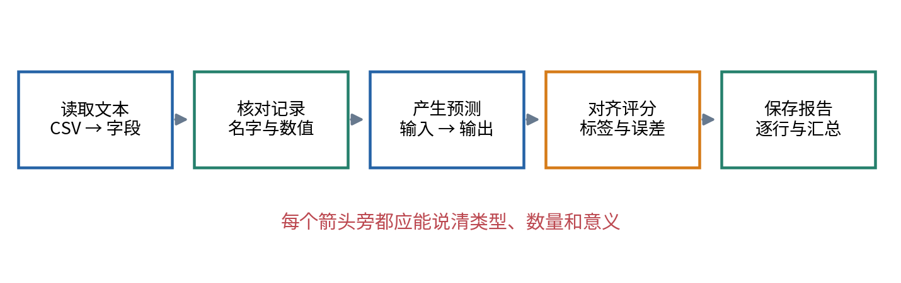
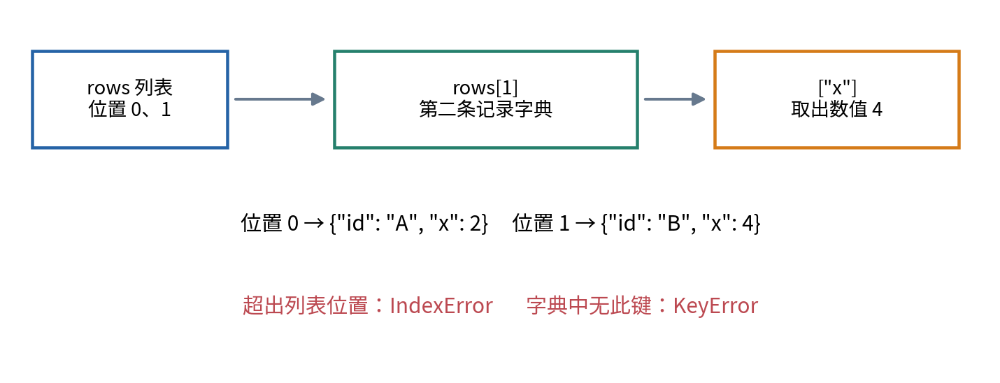
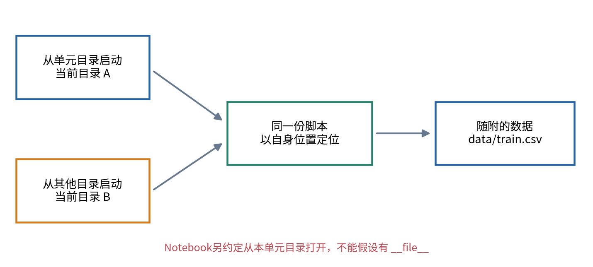
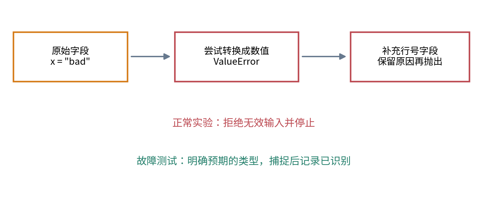
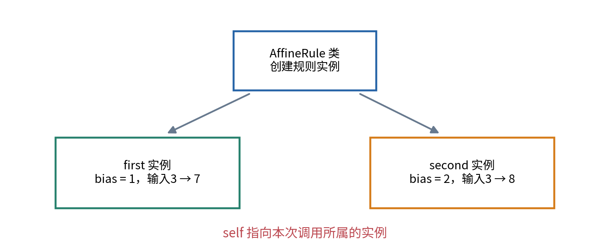

# 函数文件与最小测试

## 第003单元 当实验结果突然变了

你已经能用变量、列表、循环和函数重做校准实验。现在把几段代码粘到一个很长的Notebook单元里，改一次文件位置，或把某列从数字变成文本，原来正确的结果就可能改变。有时程序会报错，有时它会顺利运行并给出错误分数。我们这次不增加新模型，而是把同一个实验整理成可以定位问题、解释输入输出、从不同目录运行的程序。

先修为002。我们沿用001的合成校准数据和绝对误差定义，不需要新的数学。新知识是字典、文件路径、异常、作用域、断言，以及类、实例、方法与最小继承。它们都围绕一个实际问题出现：出错时，能不能知道错误发生在读取、预测、评分还是记录的哪一步？

最终程序依然给出A训练MAE为0.2、测试0，B训练0、测试7。数值没有变，证据的组织方式变了。我们还会主动制造索引、类型和路径错误，并用测试识别一个不会报错的错误除数。学完应当能把“代码跑不了”缩小成一条可验证的输入输出违约，而不是从头重写所有内容。

## 一 先画数据经过哪些步骤

把实验看作一条路径：读取文本，核对记录，把输入交给模型，用对应标签计算误差，最后保存报告。每一步接收的东西和返回的东西都应能说清。例如读取函数返回的是由若干记录组成的列表；预测函数返回的是与输入一一对应的数值列表；评分函数返回一个非负的标量。

这是一份“输入输出约定”。约定至少说明类型、数量、意义与失败时的行为。本讲的评分函数接收两个等长、非空的数值列表，一份实际值、一份预测值。不能只写“接收两个列表”：两个空列表、长度不等的列表、包含文字的列表，都不满足同一任务的要求。



如果最终MAE从0变成2，图1给了调查顺序。先看读入的四个输入是否仍为1.5、2.5、3.5、4.5；再看冻结偏移量是否为1；再看预测是否为4、6、8、10；随后核对标签编号；最后检查绝对值和除数。这样做不保证立刻找到所有错误，但每次检查都排除一种具体可能。

函数数量并非越多越好。一个只把数字原样返回的函数未必让程序更清楚。值得拆开的通常是具有独立含义、可独立核对的步骤。先以“读数据”“预测”“评分”为边界，比把每一行机械包成函数更有帮助。

## 二 用字典让字段拥有名字

002中可以把一条记录写成列表 `["T01", 1, 3]`。但位置0、1、2各自代表什么，需要靠记忆。若有人改了列序，`row[1]`可能不再是输入。字典为值配上明确的键，写作：

```python
row = {"id": "T01", "x": 1.0, "y": 3.0}
print(row["x"])
```

花括号表示创建字典；每一对“键:值”用冒号连接，多对之间用逗号分开。这里的键是字符串 `"id"`、`"x"` 和 `"y"`。方括号不再按第几个位置取值，而是按键找值，所以上面打印1.0。字典中某个键只能对应一个当前值；再次赋值 `row["x"] = 2.0` 会替换这个键对应的值，不是增加第二个同名字段。[1]

先保留原始记录，不在阅读过程中随便替换输入。`raw = {"x": "1.5"}`中的值是字符串；`clean = {"x": float(raw["x"])}`中的值才是浮点数。我们建立新的记录来表示清理后的数据，原始文本仍可查。读到 `"bad"` 时，`float`无法按数字解释，会引发异常，不能悄悄当0。

多行资料仍用列表组织，只是每个元素由一个字典表示。`rows[0]["x"]`分两步读：先从列表取第一条字典，再从字典取键x的值。这两个方括号的任务不同。若列表只有五条，合法非负位置为0到4，`rows[5]`超出范围；若字典没有 `"temperature"` 这个键，取它会出现另一种错误。



缺少字段不一定都应补默认值。例如 `row.get("y", 0)`会在没有标签时得到0，看起来很方便，却把“缺答案”变成“答案为0”。本讲对必需字段使用明确检查，不自动补标签。默认值只适用于任务真正允许的后备行为，例如001中事先约定的查表未命中返回0。

## 三 文件路径不等于当前工作目录

文件名 `train.csv`只能告诉程序要找什么名字，还没说明去哪里找。相对路径 `data/train.csv`表示从一个起点进入data文件夹再找文件；如果起点是当前工作目录，换一个启动位置就可能找不到。当前工作目录可以理解为终端此刻“站着”的文件夹，未必是程序文件所在处。

Python标准库的Path帮助我们组合路径，而不用手动猜不同系统的斜杠规则。先导入工具，再把一条路径对象命名为base：

```python
from pathlib import Path
base = Path(__file__).resolve().parent
training_path = base / "data" / "train.csv"
```

`from pathlib import Path`表示从标准库模块pathlib取出Path这个名称。模块是一份可导入的程序组织单位。`__file__`是脚本运行时提供的文件位置；`Path(...)`把它转换成路径对象；`.resolve()`得到解析后的绝对路径；`.parent`得到上一级文件夹。这里的 `/`被Path定义为连接路径部分，不是数值除法。[2]

你不必立刻掌握这些工具的内部实现，但要能解释代码的意图：从脚本自身所在目录出发寻找随附数据。实验会从单元目录和另一个临时工作目录分别运行，结果应一致。绝对路径用于内部定位，不应把个人用户名、电脑目录或隐私信息写进公开结果。

Notebook通常没有可用的 `__file__`。本课程Notebook明确从本单元目录打开，用 `Path.cwd()`获取当前目录，再检查能否看到 data 文件夹。不要把脚本行原封不动粘进Notebook，然后通过手动设一个残留变量掩盖问题。不同执行入口的定位约定应分别写清。



相对路径仍有用途，例如报告中用 `data/train.csv`说明数据文件在课程包内的位置，便于别人搬动整包资料。我们区分“程序实际访问时如何定位”和“公开报告如何记录来源”，两者可以采用不同形式。

## 四 从CSV文本到数值记录

CSV每一行用分隔符组织字段，但真实文件还可能包含引号、带逗号的文字或空字段。不要先假定每行都能用一次简单字符串切分正确处理。标准库csv负责读取这种格式；DictReader使用表头作为字典的键。[3]

```python
import csv
with training_path.open(encoding="utf-8", newline="") as handle:
    reader = csv.DictReader(handle)
    for raw in reader:
        print(raw["id"], raw["x"])
```

`with`建立一个使用文件的代码块。缩进部分结束时会关闭文件，即使中途发生异常也会按这个管理方式处理。`handle`是已打开文件的对象；`encoding="utf-8"`说明怎样把字节解释为文字；`newline=""`把CSV换行处理交给csv模块。`reader`可以被for逐条读取，每轮得到一个字典。

普通DictReader读出的数值字段仍是字符串。屏幕打印 `1`不能证明它已经是数值，因为字符串 `"1"`与整数1打印出来可能相似。我们用 `float(raw["x"])`显式转换，再检查数值是否有限。`math.isfinite`返回True表示不是无穷大或特殊的“非数”标记NaN；这是一种数据边界检查，浮点机制在014深入学习。

本讲要求表头精确为id、x、y，编号非空且不重复，记录至少一条。为什么不只检查预测是否能完成？因为错误可能在很早的时候被悄悄带下去。同一个编号重复两次会让按编号对应答案的逻辑含糊；缺标签不能成为零误差；多出一列也可能表示拿错文件。

这些约定属于本实验，不是对所有CSV的通用清洗政策。有些研究允许重复实体、多次测量、缺失输入或附加字段，需要依据任务另外规定。本例选择较严格的输入边界，是为了让第一次函数化实验容易检查。

## 五 异常应带着线索停下来

异常表示程序遇到不能按当前步骤继续的情况。找不到文件常见FileNotFoundError，超出列表位置常见IndexError，对不支持的类型进行运算常见TypeError，文字转数失败常见ValueError。异常末尾通常给出类型和说明，之前的调用栈告诉你经过哪些函数到达错误位置。[4]

排查时先读最后一行，再往上找自己写的函数和对应行，而不是把所有红色文字当成同一个“Python坏了”。例如本应是数字的x仍为字符串，`2 * x + 1`可能先重复字符串，再在与整数1相加时触发TypeError。发生错误的位置是相加处，真正的修正却可能在读取函数的类型转换处。

需要主动拒绝无效输入时使用 `raise`：

```python
if len(actual) == 0:
    raise ValueError("Cannot average empty data")
```

这不是制造麻烦，而是避免假结果。平均式需要非零除数；尽早给出明确说明，比让下游出现难懂的除零错误更容易定位。`raise`后当前调用不能像正常情况继续，错误会向调用它的地方传递，直到被处理或导致程序终止。

可以用try和except处理预期会出现的错误：

```python
try:
    value = float("not-a-number")
except ValueError:
    print("已识别无法转换的输入")
```

这段代码仅捕捉ValueError，不会把所有其他问题藏起来。本讲测试故意触发错误，再确认它被识别。正常读数据时，程序会补充“哪行哪个字段”的上下文并再次抛出错误，不会把坏数据替换为0继续训练。



尤其避免 `except Exception: pass`包住整个实验。它可能同时吞掉路径错误、程序缺陷和数据不合规，最后仍打印“完成”。只有确实知道如何恢复、且保留清楚记录时，才应该继续。测试中的“按预期拒绝输入”与生产实验中的“假装坏输入不存在”是两回事。

## 六 作用域与不知不觉改变的列表

函数里的参数和新建变量通常属于该次函数调用的局部作用域。外面恰好有一个同名变量，并不意味着函数会自动更新它。例子如下：

```python
bias = 10
def add_offset(x, bias):
    result = 2 * x + bias
    return result

print(add_offset(3, 1))
print(bias)
```

第一行输出7，第二行输出10。调用时传入的1成为函数内部参数bias的值，外面的bias仍为10。函数把结果通过return交还，而不是依靠外部同名变量碰巧存在。这样更容易测试，因为给定输入就知道应核对什么输出。[5]

但“局部名字”不等于“所有对象都自动复制”。列表可修改，两个名字可能指向同一个列表。执行 `a = [1, 2]`、`b = a`、`b.append(3)`之后，a也成为 `[1, 2, 3]`。赋值复制的是引用关系，不是把列表内容重新制造一份。

因此预测函数不应为了省事把输入列表原地改成预测值，再让后续步骤继续把它当原始输入。本讲每次创建新的结果列表，逐个append预测，返回它。测试还会保留输入副本，确认调用预测函数后输入未被意外修改。

列表的浅复制 `a.copy()`创建新的外层列表，但若列表里装的是字典，内部字典仍可能共享。我们不把“调用copy”当作解决所有共享状态的魔法。当前程序只读取输入记录，创建全新的输出数字列表，这种清楚的只读约定比盲目到处复制更可靠。

## 七 断言检查已知结果

断言写作 `assert 条件, "失败说明"`。条件为True时继续，为False时抛出AssertionError。例如：

```python
assert mean_absolute_error([3, 5], [2, 6]) == 1
```

这条测试来自独立手算：两次误差都是1，平均仍为1。若函数错误地把总误差除以3，程序会返回约0.667，并没有发生类型或索引错误；断言却能发现结果不符合预期。这说明“无异常结束”和“计算正确”不是一回事。

预期数字不能只由待测函数自己计算出来。例如先令 `expected = mean_absolute_error(...)`，再比较同一个调用是否等于expected，只能检验两次是否一致，不能有效发现同一实现里的稳定错误。小例子的预期应来自手算、独立推导或不同实现。

浮点小数未必精确表示所有十进制数。对于0.2这样的输出，本讲用 `abs(actual - expected) < 1e-12`，意思是差值大小小于很小的容许量。符号 `1e-12`表示十的负十二次方，即0.000000000001。容许量应按任务尺度设定；不能为了让测试通过任意放大。014会解释数值误差的来源。

断言适合教学测试，但不能代替必要的运行输入检查。Python在某些优化运行方式中可移除assert语句；本讲对空数据、重复编号和非有限值始终用明确的if与raise拒绝。测试文件建议用普通 `python test_experiment.py`执行，不使用关闭断言的优化选项。[6]


最小测试包至少包含一条手算正常例子、空输入、长度不一致、错误类型和一个集成结果。本讲还检查标签顺序被打乱时按编号正确对齐，以及从其他目录启动时结果不变。以后新增一个被发现的缺陷，应把它缩成一个可重复测试，避免修完之后再次引入。

## 八 为什么把规则写成类

函数已经可以预测，为何还要类？现在A需要保存偏移量，B需要保存查表记忆。如果每次调用都把所有内部配置重新传一遍，调用者容易漏传或串用。类提供一种把相关状态和操作组织在一起的方式；它不自动让预测更准确，也不是小实验必须使用的唯一写法。

类像一份创建这种对象的说明，实例是依据这份说明创建的具体对象。先看一个最小版本：

```python
class AffineRule:
    def __init__(self, bias):
        self.bias = bias

    def predict_one(self, x):
        return 2 * x + self.bias

rule = AffineRule(1)
print(rule.predict_one(3))
```

`class AffineRule:`定义类。`AffineRule(1)`创建一个实例并调用初始化方法 `__init__`，将1交给bias。双下划线是名称的一部分，不应写漏。`self`按照Python约定代表当前实例，`self.bias`把偏移量存为这个实例的属性。方法是放在类里、通过实例调用的函数。

调用 `rule.predict_one(3)`时，当前实例会作为self传入，3作为x传入，所以输出7。再建 `other = AffineRule(2)`，它保存另一个偏移量；两个实例应分别输出7与8。属性属于各自实例时，修改一个的bias不应莫名改变另一个。



在这个例子里，`rule.bias`是人为选好后存入对象的数字。仅仅写一个类不会发生学习；学习仍需要明确的数据与参数选择过程。我们先用训练资料选出1，再创建对应实例，保持原实验含义。

## 九 用最小继承统一调用接口

若A和B都提供 `predict_one`，外部评分步骤就不必在每一行反复判断模型是哪一类。我们用一个基类表示共同接口，再让两种规则继承它。继承表示一个类可以沿用另一个类的方法，也可以提供自己的版本来覆盖某个方法。[5]

```python
class PredictionRule:
    def predict_one(self, x):
        raise NotImplementedError("Provide a prediction rule")

    def predict(self, inputs):
        result = []
        for x in inputs:
            result.append(self.predict_one(x))
        return result

class AffineRule(PredictionRule):
    def __init__(self, bias):
        self.bias = bias

    def predict_one(self, x):
        return 2 * x + self.bias
```

`AffineRule(PredictionRule)`中的括号说明它继承PredictionRule。子类没有重新写predict，因此使用基类逐项预测的方法；它重新写了predict_one，因此基类循环里调用的就是这个实例自己的版本。若直接创建没有具体单点规则的基类并预测，会抛出NotImplementedError，明确告诉我们实现不完整。

LookupRule同样继承基类，不过初始化时保存训练输入与标签形成的字典，单点预测先检查输入是否在字典中，命中则返回对应值，否则返回事先设定的0。两者内部存储不同，但外面都能调用 `rule.predict(inputs)`。这就是“相同接口”在本例里的具体意思。

本单元不讲多重继承、装饰器或复杂对象系统。后续自动微分节点与PyTorch的nn.Module也使用类和方法，但它们还需要计算图、参数注册、状态管理等机制。理解这个小类只是阅读那些代码的准备，不能把它当成nn.Module的完整替代品。

## 十 让脚本可执行也可导入

Notebook可能想使用脚本里的函数，而不想每次导入都立刻运行完整实验。我们将主要流程写进run函数，再在文件末尾写：

```python
if __name__ == "__main__":
    run()
```

直接执行脚本时，Python给 `__name__` 的值是 `"__main__"`，于是运行这一段。把文件作为模块导入时，名字通常是模块名，这一条件不成立，函数和类仍被定义，但不会自动写报告。双下划线必须完整保留，不能把这里理解成两个普通英文单词。[7]

这提供了两种入口：终端完整运行，Notebook分步骤调用。所有重要输入仍通过参数或明确文件来源进入函数；不会依赖你昨天在Notebook里创建过的某个变量。检查导入是否意外产生输出文件，也是本单元测试的一部分。

## 十一 一份可定位的故障报告

故障报告应包含最小输入、执行方式、预期、实际、定位与修正，而不是只有“又不对了”。例如：“五条训练记录，故障函数从位置1循环到位置5；预期访问五条记录，实际在位置5触发IndexError；Python列表合法位置为0至4；改为直接遍历记录，测试正常且未漏掉首行。”

若修正后分数变了，还要核对是否只是让程序不报错，还是确实恢复任务定义。把循环上限缩小可能避开异常，却少算一条记录；把错误类型强转为0可能继续运行，却损坏数据。这就是我们同时保留边界测试和手算断言的原因。

交付时应保留原始数据、脚本、Notebook、测试文件和可读报告。完整实验可以从空会话重跑；单个步骤可以用小输入独立检查；已知故障可以再次被测试识别。这些能力将支撑后面的张量、反向传播和训练调试。

## 十二 练习

1. 对列表 `[ {"id":"A", "x":2}, {"id":"B", "x":4} ]`，说明 `rows[1]["x"]`的两次查找分别做什么。再说明缺少键与超出位置的错误不同在哪里。
2. 写出MAE函数的输入输出约定。给出一个没有异常但结果错误的实现思路，以及能抓住它的两条手算测试。
3. 解释为什么从另一个文件夹启动脚本可能找不到相对路径。分别写出脚本和Notebook采用的定位约定。
4. 在实验副本运行索引、类型、路径三种故障。每种都写最小输入、错误类型、位置和修正，不能只写“重启”。
5. 外部bias为10，调用 `add_offset(3, 1)`后分别打印结果和外部bias。解释若函数改写列表参数时为何情况不同。
6. 建立两个AffineRule实例，偏移量分别为1和2，对输入3预测。写出方法中self指谁，以及为什么类本身不是训练算法。
7. 如果基类predict逐个调用predict_one，子类只覆盖predict_one，为什么子类的predict能使用新规则？调用未实现单点预测的基类会怎样？
8. 同学把所有输入检查都改成assert，再用优化选项运行。说明风险，给出必要输入检查和测试断言各自适合的位置。

## 参考资料

[1] Python 3.12官方教程，[Data Structures](https://docs.python.org/3.12/tutorial/datastructures.html)，字典与列表的语义。

[2] Python 3.12官方文档，[pathlib](https://docs.python.org/3.12/library/pathlib.html)，Path、当前目录与路径连接。

[3] Python 3.12官方文档，[csv](https://docs.python.org/3.12/library/csv.html)，DictReader、字符串字段与换行处理。

[4] Python 3.12官方教程，[Errors and Exceptions](https://docs.python.org/3.12/tutorial/errors.html)，异常传播、try和except。

[5] Python 3.12官方教程，[Classes](https://docs.python.org/3.12/tutorial/classes.html)，命名空间、类、实例、方法和继承。

[6] Python 3.12语言参考，[The assert statement](https://docs.python.org/3.12/reference/simple_stmts.html#the-assert-statement)。[7] Python 3.12官方文档，[Top level code environment](https://docs.python.org/3.12/library/__main__.html)。代码、数据故事与图均为课程独立编写。
