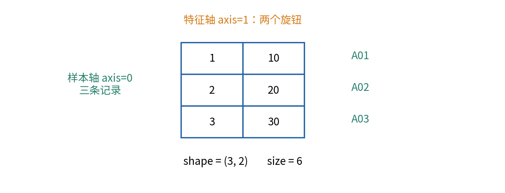
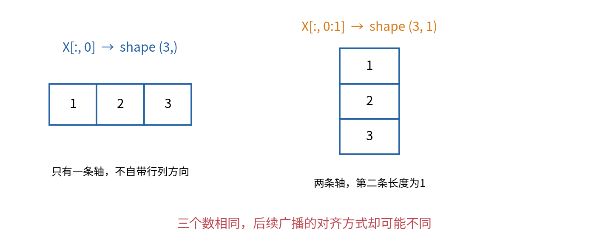
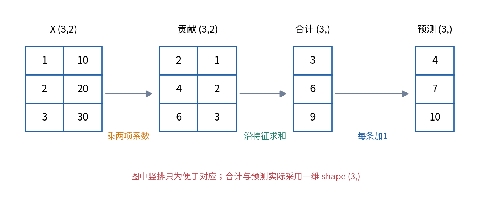
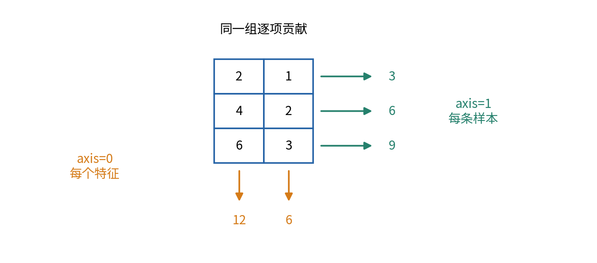
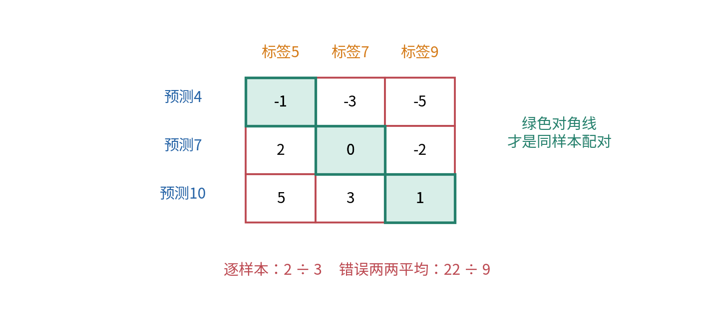
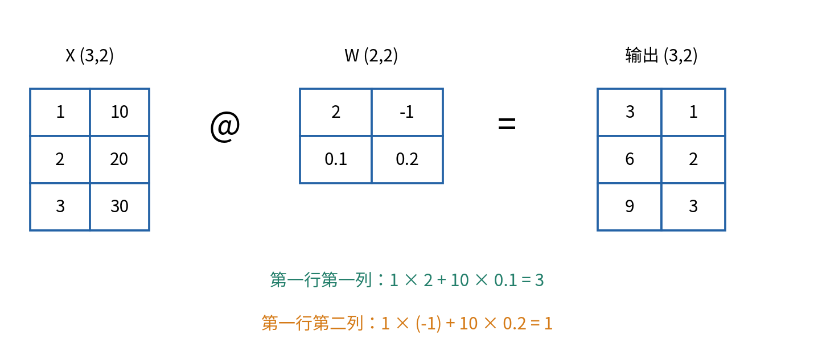
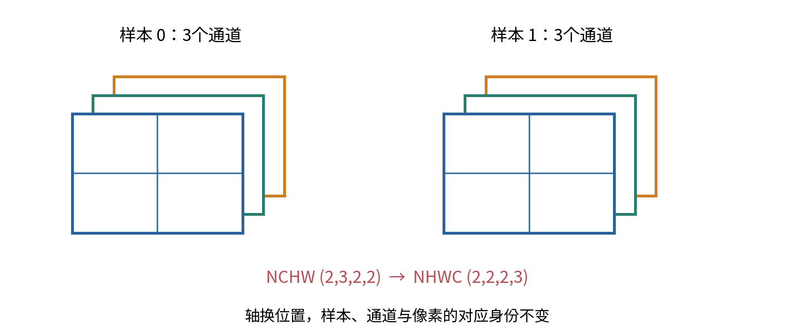

# 数组张量与形状思维

## 第004单元 一个没有报错的错误分数

上一单元学会把实验拆成可以测试的步骤。现在希望同时处理一批样本，而不是手写一行行循环。NumPy让这件事很方便，但它也能把两个本来应该一一对应的列表，悄悄组合成所有两两配对。程序照常运行，分数却不再回答原来的问题。

本讲围绕三次双旋钮校准展开。每次有两个输入，一次输出一个预测读数。我们先用普通Python循环手算，再把相同步骤搬到数组上。每个中间量都标注形状和轴的含义，最后故意把三条预测与三条标签变成九个配对，检查错误怎样发生。

先修是003，不要求先学线性代数。行、列、矩阵乘法的操作会在本讲用具体数字解释，008和009再讨论它们的几何与代数结构。这里的“张量”采用深度学习编程中常见的多维数组用法，不预先等同于微分几何中的严格张量概念。

## 一 为每一条轴指定含义

新数据仍为原创合成资料，没有真实装置。每行是一条校准记录，两列分别是第一旋钮和第二旋钮的位置，单位均为格。屏幕目标值单位为读数单位。三条输入与标签如下。

|记录|第一旋钮|第二旋钮|标签|
|---|---:|---:|---:|
|A01|1|10|5|
|A02|2|20|7|
|A03|3|30|9|

先把输入单独写成一个三行两列的表，命名为X。X的形状写作(3, 2)，意思是第0条轴长度3、第1条轴长度2。我们规定第0条轴是样本轴，也叫批次轴；第1条轴是特征轴。数字3和2不自带这些含义，含义来自我们与数据的约定。



“批次”就是这次一起处理的若干样本，不一定等于整个训练集。现在三条都放在一个批次里，后来训练可能一次只取几十条。批量计算不应把不同样本混成一条；它应对每条样本执行相同规则，并保留对应关系。

一个只有一个数的数组可以是零维数组，形状为()；一排三个数可以是一维数组，形状为(3,)；三行两列是二维数组，形状为(3,2)。括号里的逗号提醒我们(3,)是只有一个元素的元组。shape中的维度数量与每条样本有多少特征不是一回事：三条各有两个特征的数据只有两条数组轴。

## 二 从列表创建数值数组

安装并导入NumPy后，使用它的array函数。`as np`只是把模块取一个短名字，避免每次写numpy；不会改变运算意义。

```python
import numpy as np
X = np.array([[1, 10], [2, 20], [3, 30]], dtype=np.float64)
print(X.shape)
print(X.ndim)
print(X.size)
```

依次得到(3,2)、2、6。shape描述各轴长度，ndim是轴的条数，size是元素总数，这里为3乘2等于6。dtype描述元素怎样存储；float64是64位浮点数。大多数常见数值数组内部使用统一dtype，不能想当然地把一个字符串字段混进数值输入。[1]

显式指定float64，是为了避免后面除法、缩放等运算意外沿用不合适的整数类型，不代表浮点数能精确存下所有小数。0.1等十进制数可能只有近似的二进制表示。我们用容差核对数值，不通过截图中显示几位小数推断精度。014会系统讨论数值稳定性。

Python列表和NumPy数组对同一个符号可能有不同解释。`[1,2] * 2`得到 `[1,2,1,2]`，表示列表重复；`np.array([1,2]) * 2`得到 `[2,4]`，表示每个数乘2。不能只看语法短小就认为两种对象的操作相同。先核对对象类型，再判断运算。

## 三 索引切片和保留轴

二维数组可以在同一对方括号内写行与列：`X[1,0]`取第1行第0列，得到2。编号仍从0开始。`X[1]`取整条第二行，得到 `[2,20]`，形状为(2,)；原来的样本轴被这个整数索引选定，不再保留在结果中。

冒号表示切片。`X[:,0]`取所有行的第0列，得到 `[1,2,3]`，形状为(3,)；`X[:,0:1]`取所有行以及从第0列开始、到第1列之前的列，得到三行一列，形状为(3,1)。两者包含相同三个数，轴的结构却不同。切片右端不包含在内，这与Python列表的切片约定一致。



零基础读者容易把(3,)称为“列向量”。在NumPy里，它实际只有一条轴，未注明行或列方向；对它使用`.T`也不会自动变成三行一列。若确实需要列形状，应明确写 `a.reshape(3,1)`或 `a[:,None]`。这里None用作增加一个长度为1的新轴，和003中“尚无数值”的标记用法不同，意义由索引语法规定。

本讲优先选定统一约定：每条样本只输出一个数时，预测与标签都用形状(N,)，其中N表示样本数量这个正整数。不是说(N,1)错误，而是同一评分步骤不能无说明地混用两种约定。支持别的形状时，必须把规则写清并测试。

## 四 把循环分解成相同的数组步骤

对每条样本，规定两个旋钮的系数分别为2和0.1，再加偏移量1。系数单位是每格对应多少读数单位。第一行的手算为：第一项 $1\times2=2$，第二项 $10\times0.1=1$，两项相加为3，再加1得到4。第二行得到7，第三行得到10。

这次不从数据学习系数，只把一条固定规则改写为批量计算。普通Python写法如下：

```python
predictions = []
for row in [[1, 10], [2, 20], [3, 30]]:
    value = row[0] * 2 + row[1] * 0.1 + 1
    predictions.append(value)
```

NumPy写法先创建形状(2,)的系数w，再逐元素相乘，沿特征轴求和，最后加偏移量：

```python
w = np.array([2, 0.1], dtype=np.float64)
weighted = X * w
combined = weighted.sum(axis=1)
predictions = combined + 1
```

weighted形状为(3,2)，具体数值为 `[[2,1],[4,2],[6,3]]`。combined形状为(3,)，数值为 `[3,6,9]`。predictions仍为(3,)，数值为 `[4,7,10]`。数组写法省去显式逐行循环，但没有省去逻辑步骤。必须先知道每步在算什么，才能判断它与循环是否等价。



检查不仅比较最终平均分。一个中间步骤把两行交换，平均有时仍可能相同，但预测与样本对应关系已经错了。本实验逐项对照weighted、combined和predictions，并保存每条记录的编号。最终标量相同是必要检查之一，不是全部证据。

## 五 沿哪条轴求和

归约表示把某条轴上的多个数合成更少的数，例如求和或求平均。`weighted.sum(axis=1)`沿第1轴，即同一行内两个特征的贡献求和，得到每条样本的总贡献 `[3,6,9]`。被归约的特征轴消失，样本轴仍在。

若改成 `weighted.sum(axis=0)`，则把三条样本在每个特征位置上的贡献相加，得到 `[12,6]`，形状为(2,)。它也完全合法，但回答的是“每个特征在全批次贡献多少”，不是“每条样本预测多少”。代码能运行不表示它对应任务。



`keepdims=True`保留被归约轴的位置，但长度变为1。例如 `weighted.sum(axis=1, keepdims=True)`得到(3,1)。这对后续有意广播很有用，却不能默认加上就更正确。若标签仍为(3,)，恰好会触发我们稍后要追踪的错误配对。

不指定axis的 `weighted.mean()`会对全部六个数取平均。本例总和18，除以6得到3；这既不是三个预测值，也不是带标签的误差。看见mean就把结果叫作损失，是把运算名称和任务意义混在了一起。[4]

## 六 广播怎样让系数用于每条样本

X形状为(3,2)，w形状为(2,)，为何可以相乘？广播是一组对齐规则，让较少轴或长度为1的轴按需要用于更大的数组，而不要求我们先手工复制多份系数。NumPy从最右边的轴开始比较：两边长度相同，或其中一边长度为1，就兼容；左边缺少的轴按长度1理解。[2]

把w的形状(2,)在左侧补一个1，得到逻辑形状(1,2)。最右侧2与2匹配；左侧3与1兼容，因此结果为(3,2)。这表示相同两项系数用于每一条样本，不表示把不同样本的输入互相相乘。

若想给三个样本分别加1、2、3，应让偏移量形状为(3,1)，使每个样本自己的偏移量用于该行两列。直接用形状(3,)去加(3,2)会从最右边比较3与2，二者不相同且都不是1，因此报错。这时“转置一下试试”不是可靠方案；先决定偏移量属于哪个轴，再写形状。

把(3,2)与(1,2)相加，与把它和(3,1)相加，分别代表按特征共享、按样本共享。广播只检查长度兼容，不知道第一条轴是样本还是特征。即使两个轴恰好长度都为3，它也不会理解你原本的意思，错误更可能静默发生。

## 七 九个误差来自错误的两两配对

正确标签y为 `[5,7,9]`，形状(3,)。正确预测p为 `[4,7,10]`，形状(3,)。逐项相减得到 `[-1,0,1]`，绝对值 `[1,0,1]`，MAE是 $2\div3$，约0.667。每条预测只和自己的标签比较一次。

现在把预测改成(3,1)，标签仍为(3,)。广播会把后者理解为(1,3)，最终产生(3,3)。第0行将预测4同时减去标签5、7、9，得到-1、-3、-5；第1行用7得到2、0、-2；第2行用10得到5、3、1。



九个绝对误差之和为22，再除以9得到约2.444。这个数不是程序随机错误，而是精确回答了另一个问题：“所有预测与所有标签的两两距离平均是多少？”它不适合作为当前逐样本预测任务的MAE。理解错误算式在做什么，通常比只贴一个“维度错了”的标签更有用。

本讲评分函数要求预测与标签都为一维、形状严格相等、非空且有限，否则明确抛出ValueError。不要先随意flatten把所有输入拉平再评分；那可能隐藏上游把样本轴和特征轴混淆的问题。若任务约定允许(N,1)，应在知道轴含义的边界明确转换，而不是在所有错误发生之后统一压平。

## 八 逐元素乘法与矩阵乘法不是同一件事

逐元素乘法 `X * w`保留每项贡献，得到(3,2)。矩阵乘法使用 `@`，在这里 `X @ w`把每行与w对应项相乘再相加，直接得到(3,)的 `[3,6,9]`。因此 `X @ w + 1`与刚才的逐项贡献再sum操作相同。矩阵乘法一般不等于逐元素乘法。[3]

先只记二维情形的操作：左边每一行与右边每一列对应相乘后求和。若左边为(N,D)，右边为(D,K)，输出为(N,K)。D是匹配并求和掉的共同长度；N是样本数，K是输出数。这里N、D、K都表示非负整数轴长度，实际预测实验要求N和D为正。

例如右边两行两列的系数表W为 `[[2,-1],[0.1,0.2]]`。第一列系数是2和0.1，第二列是-1和0.2。第一条样本 `[1,10]`与第一列计算3，与第二列计算 $1\times(-1)+10\times0.2=1$。三条样本得到 `[[3,1],[6,2],[9,3]]`，形状(3,2)。

再加形状(2,)的偏移量 `[1,-1]`，按输出特征广播，得到 `[[4,0],[7,1],[10,2]]`。这已经是后面全连接层运算的雏形，但本讲只训练操作与形状判断，不提前要求你理解线性映射、梯度或可学习性。



在二维规则中，中间长度不相同就不能进行这次矩阵乘法。矩阵乘法还可以扩展到更高维批次，并有一维参数的特殊规则；暂时不要从本例推断所有高维情况。009与后续注意力单元会按明确轴约定继续展开。

## 九 reshape不等于转置

`reshape`在元素总数不变时改变形状。对X按默认顺序拉成一串是1、10、2、20、3、30；`X.reshape(2,3)`再排成两行，得到 `[[1,10,2],[20,3,30]]`。`X.T`则交换二维数组的两条轴，得到 `[[1,2,3],[10,20,30]]`。形状都是(2,3)，内容排列和轴意义不同。

因此，看到矩阵乘法报错后用reshape凑出兼容形状，可能让错误更难发现。转置也不是万能修复：若原来每行是一条样本，转置后样本轴移到另一处，后续所有运算都应随之改变。不能只调到“能跑”为止。

NumPy基本切片通常返回共享底层数据的视图。先取 `part = X[:,0]`，再改part的第一项，X也会变化。需要独立副本时明确 `.copy()`。reshape也可能共享存储，不能依据一个新变量名认定数据被复制。实验在单独副本上演示，避免改变正式输入。

## 十 从二维到批次通道轴

图像等数据可能有更多轴。例如形状(2,3,2,2)可以约定为两张图像、三个颜色通道、每张高2宽2。这里有四条数组轴，共24个数。通道不是样本：一张图的三个颜色值通常应作为同一输入共同处理。



NCHW是按样本数、通道数、高度、宽度排列轴的记法；NHWC则把通道放到最后。若每条轴都恰好长度2，单看shape可能不能发现轴被交换。可以在每个位置放入有规律的编号，再检查移动后的样本和通道是否仍对应原位置。本讲提供一个小型标记数组，用来验证交换轴，而不训练图像模型。

这些约定没有哪一种凭名字天然正确，正确性取决于后续操作是否期待它。进入神经网络之前先做一条样本的手工核对，往往比在训练失败后猜测维度要省时间。

## 十一 把形状写进实验记录

本实验记录X(3,2)、w(2,)、weighted(3,2)、combined(3,)、predictions(3,)、labels(3,)、errors(3,)，以及错误示范的pairwise_errors(3,3)。每个形状旁边写轴意义，比只在出错时打印shape更有帮助。

数组化不自动保证更快，也不保证更省内存。例如不必要的两两广播会创建远大于预期的结果；真实规模下可能耗尽内存。本例仅验证运算含义，不用三个样本的运行时间宣称速度优势。性能比较应固定数据规模、实现与计时方式，后续资源单元再详细讨论。

学完应保留一种习惯：在写运算前先写输入轴与目标输出轴，再用小到能手算的例子核对。如果某个transpose或reshape的理由只是“这样不会报错”，还没有完成检查。

## 十二 练习

1. 对X写出shape、ndim、size，以及每条轴的意义。解释两条轴与两个输入特征为何不是同一个概念。
2. 写出 `X[1]`、`X[:,0]`、`X[:,0:1]`的具体数值和形状。对形状(3,)的一维数组使用`.T`会怎样？
3. 手算weighted、沿axis=0和axis=1的和，再给axis=1增加keepdims，写出每一步保留了什么。
4. 判断(3,2)与(2,)、(3,)、(3,1)、(1,2)的逐元素加法能否广播，并说明合法情况的语义。
5. 完整列出错误广播的九项误差，算其绝对平均；再算正确的三项MAE。指出两个数分别回答什么问题。
6. 手算X与W的矩阵乘法以及加偏移量后的结果，说明 `*`和`@`的区别。
7. 写出X.reshape(2,3)与X.T，指出为何形状相同不能证明内容含义相同。设计一条能抓住误用reshape的断言。
8. 形状(2,3,2,2)采用NCHW，转换成NHWC后形状是什么？用某个唯一编号元素说明需要保留什么对应关系。

## 参考资料

[1] NumPy 2.3官方手册，[Absolute basics for beginners](https://numpy.org/doc/2.3/user/absolute_beginners.html)，数组属性、索引与视图。

[2] NumPy 2.3官方手册，[Broadcasting](https://numpy.org/doc/2.3/user/basics.broadcasting.html)，从末轴对齐的兼容规则。

[3] NumPy 2.3官方参考，[matmul](https://numpy.org/doc/2.3/reference/generated/numpy.matmul.html)，矩阵乘法语义。[4] [mean](https://numpy.org/doc/2.3/reference/generated/numpy.mean.html)，axis与keepdims。教材叙事、数字、图与测试均为独立编写。
