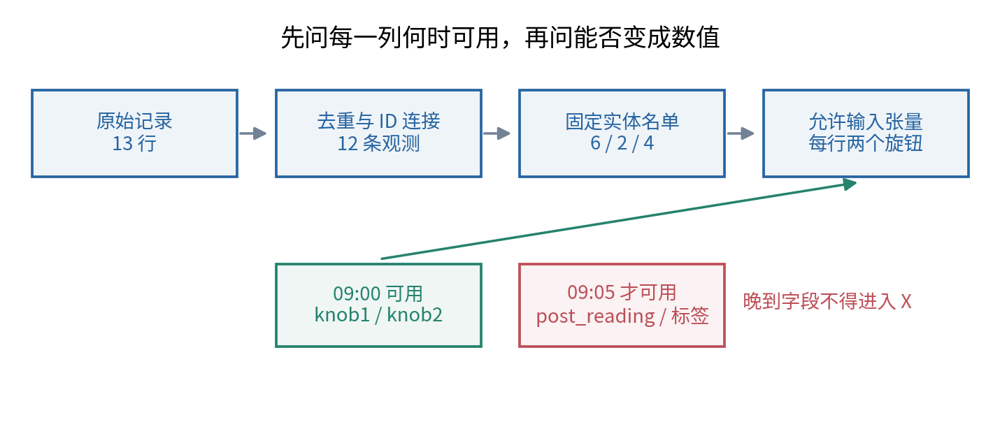
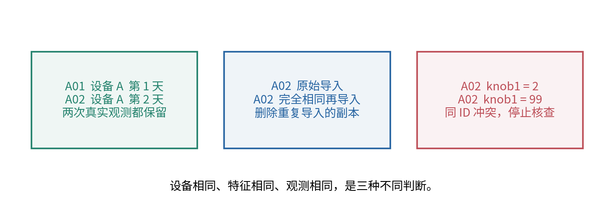
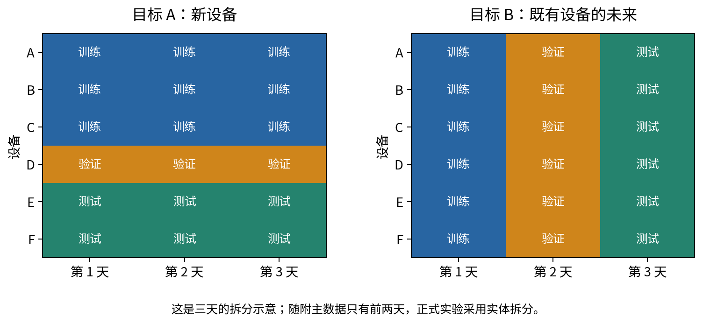
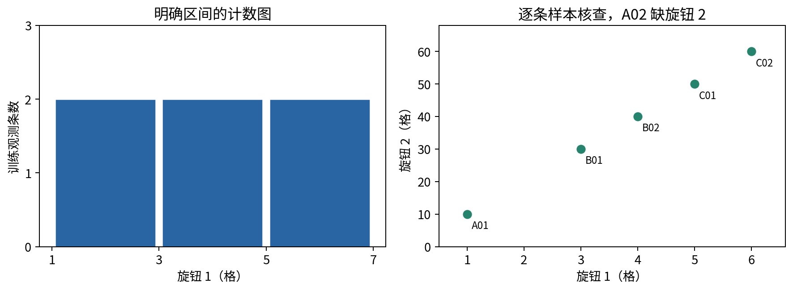
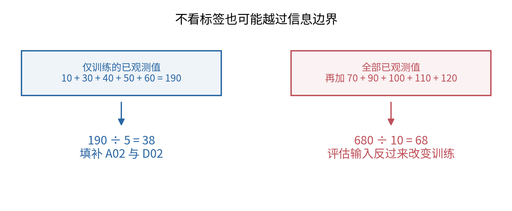
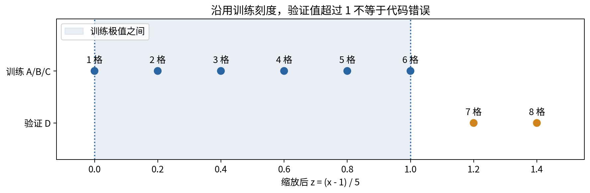
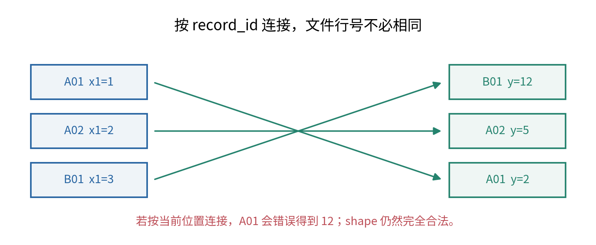

# 数据管线与可视化检查

<style>table { break-inside: avoid; }</style>

## 第005单元 模型看见的输入是否真是任务允许使用的信息

在004中，数组的形状和运算已经能够逐项核对。但两个形状完全正确的数组，仍可能来自错误的记录；一个数值极漂亮的预测，仍可能偷看了五分钟以后才出现的答案。数据管线的任务，是让每条原始记录经过可追踪的步骤成为模型输入，并且在每一步保住身份、时间和使用权限。

本讲继续使用原创合成的双旋钮校准情境。这次有六台设备，每台有两次观测，另外故意加入一条重复导入、两个空值、一份倒序标签文件，以及一个预测后才知道的字段。所有数字都足够小，可以用四则运算检查。我们不训练神经网络，也不借这十二条观测宣称现实表现；当前只学习怎样把实验入口守住。

先修为004，需要读懂函数、字典、异常，以及形状为(N,2)的数组。这里的“描述统计”只是把已经拿到的数做计数、求和、平均和比较，不需要概率、方差、标准差、显著性或统计推断。这些内容将在016及后续单元建立。

## 一 先写清一个预测发生在什么时候

主任务是：用旋钮1和旋钮2的当前设置，预测这次校准最终的读数；我们关心此前没有用于训练的新设备。每次预测发生在当天09:00，最终读数与标签在09:05才写入。字段存在于今天导出的文件中，不代表它在历史预测时点已经存在。

`knob1`与`knob2`是09:00能够读取的输入，空白表示当时没有读到。`post_reading`是09:05的最终读数，恰好等于标签。把它放进输入就能“预测”得一模一样，因为已经把答案送给模型。这种零误差没有完成09:00的任务。把名称改成`feature_3`不会改变它的到达时间。



“可用”也不只表示计算机上能找到。还要问它是否在实际部署中稳定取得、单位是否一致、取得它是否本就需要知道目标。某个手工填写的“是否需维修”字段即使带着较早时间戳，也可能在事后回填。时间戳检查能抓住本实验的明确反例，不能替代对生成流程的了解。

本讲只允许两个旋钮列进入X，顺序固定为旋钮1、旋钮2。设备编号和观测编号用于连接、拆分和审计，不送进主任务模型。编号不是天然非法特征：对于已知设备未来预测，身份可能是允许信息；是否使用，应由目标和部署条件决定。这里保留它们主要是为了避免无意混合设备。

## 二 数据字典必须解释空白和一行的含义

一行表示“一台设备在某天09:00的一次校准观测”。`record_id`唯一标识这一次观测，`device_id`标识设备。A01和A02都属于A，但不是同一次观测。主数据共有A至F六台设备，前两天各一次。两个旋钮单位都为格，目标单位为读数单位，没有真实测量或人员资料。

|字段|类型与单位|出现时点|本讲用途|
|---|---|---|---|
|record_id|非空字符串|观测登记时|稳定连接键与名单项|
|device_id|非空字符串|预测前|实体分组，不进入X|
|predict_time|无时区ISO时间，合成场景统一同一时区|预测时|说明输入截点|
|knob1|有限数值，格|09:00|X第0列，不允许空白|
|knob2|有限数值或空白，格|09:00|X第1列，空白表示缺失|
|post_reading|有限数值，读数单位|09:05|禁止用作输入的反例|
|target|有限数值，读数单位|09:05|另一个文件中的标签|

`post_available_time`和`label_available_time`另行记录晚到字段的可用时间。时间字符串在本合成案例中没有时区歧义；现实跨地区数据必须明确时区和夏令时规则，不能直接把两个本地时间字符串当成同一时刻。完整字段定义在data/README.md。

CSV里的值首先是文本。`"10"`要显式转成数值10；空字符串不能直接当成0。读取器使用Python标准库的`csv.DictReader`，每行变成以列名为键的字典。[1] 列名变更、非法数字、无穷值或重复身份应给出清楚错误，而不是静默跳过。否则行数减少后，预测与标签可能从某一行起全部错位。

## 三 删除重复导入 不是删除重复出现的设备

原始文件有13行，最后一行是A02的完全相同副本。根据已声明的观测键，它只是第二次导入同一条观测，可以保留一份并记录“删除A02的一份重复副本”。去掉副本后有12条观测，不能把这句话缩写成“删除设备A”。

若A02的两个版本分别写着`knob1=2`和`knob1=99`，它们属于冲突版本。自动保留第一条会让文件顺序决定实验结论。本实验选择停止并要求核查。真实项目可以有版本优先级或更新时间规则，但规则应来自数据流程，不能根据哪个版本让分数更好来决定。



同一设备在另一天的观测是合法重复测量，应保留。不同设备的两个旋钮恰好一样，也不说明它们是同一观测。相反，两个不同文件名可能复制了同一张图或同一次采样，这时仅检查记录ID又不够。需要追溯原始来源、内容指纹或采集事件，并让同源副本留在同一侧。

本案例还约定每台设备每个预测时点只有一次观测，因此相同“设备+预测时点”却出现两个ID时要求人工核查。这个业务键只对本案例成立。若同一毫秒确实允许多个独立传感器读数，就应把传感器或事件序号写进键，而不是照抄这里的规则。

确定性的身份清理规则应在拆分之前定义，并保留移除名单，避免副本跨集合。这样的完整性核查与“读完测试分布再决定怎样填补”不同。前者执行预先确定的记录身份规则；后者把留出样本的数值用于塑造训练过程。涉及封存数据时，应由独立审计流程执行必要的重合检查并记录权限。

## 四 三份名单各自承担什么角色

训练集用于确定模型参数，以及任何需要从数据算出的预处理参数。验证集用于比较开发中的选择，例如是否采用某种输入处理方式。测试集用于对已经定下来的流程做最终检查。若反复看测试结果再改方法，它就在事实上参与了开发，名字仍叫test也不能恢复其独立角色。

本讲固定实体拆分，不通过重新抽名单寻找漂亮结果。训练使用A、B、C共6条，验证使用D共2条，测试使用E、F共4条。名单保存为record_id，读取文件时按名单取记录；这比保存“前六行”更能抵抗文件重排。

|集合|设备|固定观测名单|
|---|---|---|
|训练|A、B、C|A01、A02、B01、B02、C01、C02|
|验证|D|D01、D02|
|测试|E、F|E01、E02、F01、F02|

三份记录名单不能重叠，不能遗漏观测，不能重复同一ID。针对“新设备”这一目标，还要求三份设备集合互不重叠。仅有记录不重叠不够：A01在训练、A02在测试，记录不同，但设备身份仍然相同。

这里全部数据由教材作者构造并公开，读者也会查看故意出错的全量计算。因此这是学习封存规则的透明练习，不是一个从未被看过的真实盲测。正式管线不计算主数据的测试标签误差，也不依据测试值选择规则。若把这套数据当成真实研究的独立测试，证据强度就被夸大了。

## 五 实体拆分和时间拆分回答不同问题

如果部署要面对从未见过的设备，留出整台设备才能模拟这种身份缺口。如果部署要在已经服务的设备上预测明天，同一设备的历史记录本来就可用；把它们一概禁止，反而会改成另一个问题。此时更重要的是保持过去在训练侧、未来在评价侧，并禁止任何未来窗口中的信息流回去。



例如时间任务可设：第一天09:05以后完成训练，第二天09:00做验证预测；第二天标签到齐以后完成开发，第三天09:00再做封存测试。每次实际使用的输入和标签都应已在相应训练截止时点到达。只有“训练记录的预测时间早于测试记录”仍可能不够：若标签要七天后才完成，训练时就不能使用那些尚未出现的标签。

主数据的实体留出来自同一个两天采集窗口，展示的是跨设备边界。它不能额外证明模型能够应对半年后的环境变化。反过来，仅做时间留出也不能证明能服务新设备。若真实目标同时要求新设备和未来时间，就需要同时满足两项约束，并保留足够评价对象；没有一个拆分函数能代替目标描述。

随机拆行为什么危险？假设每台设备都有两条相似记录，把行打乱再分，很可能把同一设备的两条记录分到两侧。模型可以凭设备编号，或外观、基线偏差等身份线索，认出已经见过的设备。在“新设备”任务下，这样的留出混入了不应出现的身份帮助。[2] 随机拆行并非在所有任务里都错误；错误在于拆分不能模拟你声称的使用场景。

### 一个可以完全手算的记忆反例

额外小表memorization.csv有六台设备，每台两次，标签对同一设备保持不变：A为2、B为5、C为11、D为17、E为29、F为43。规则把训练中见过的设备与读数存进字典；遇到没有见过的设备，就输出训练标签的平均数。这个规则有意只记身份，不理解旋钮。

若每台设备第一次进入训练、第二次进入留出，六台都已被记住，每次误差都是0。这是一种按行分配可能得到的名单；为使手算固定，这里不再随机抽它。这样的行级留出无法证明新设备能力。在另一种拆分中，只用A、B、C训练，D、E、F全部留出。训练平均为 $(2+5+11)/3=6$，对三个新设备的绝对误差依次为11、23、37，平均为 $71/3$，约23.667。

两次分数测量的目标不同，不能把差值称作某个普遍的“泄漏惩罚”。它只是一个反例：身份记忆足以让行级留出看起来完美，而对新身份没有相应能力。如果任务真的只是预测这些已知设备的下一次恒定读数，历史身份信息可能是合理输入，仍须遵守时间顺序。

## 六 用训练数据做最朴素的描述

正式训练矩阵有6行、2列。旋钮1为1、2、3、4、5、6；旋钮2为10、空白、30、40、50、60。先保留缺失位置，不急着填补。计数、最小值、最大值、求和与平均都应注明“在哪些行、哪一列、是否排除缺失”上进行。

旋钮1六个值的和是21，平均为21除以6等于3.5，最小为1，最大为6。旋钮2只有5个已观测数，总和190，平均为190除以5等于38。若把缺失也算进分母，就成了190除以6，暗中接近“缺失贡献0”的假设，已经不是已观测数的平均。

用符号压缩这一步：设一列已观测的数依次为 $v_1,\ldots,v_m$，其中m是正整数个数，则

$$\bar v=\frac{v_1+v_2+\cdots+v_m}{m}.$$

横线只是平均数的记号，不代表新学过的统计推断。平均与原数单位相同，旋钮的平均仍为格。缺失比例则是“缺失个数÷总行数”，本例为 $1/6$，约16.7%；它没有单位。这个比例只描述这六行，不能直接宣称真实设备有16.7%的缺失概率。



直方图先选区间，再数有多少数落进去。图4使用[1,3)、[3,5)、[5,7]，各有2条。圆括号表示不包含右端，例如3进入第二格；最后一个区间包括最右端，这是NumPy histogram的约定。[3] 纵轴为条数，没有做概率密度换算。选择不同区间会改变图形外观；所以区间也应记录，不能只给一幅没有刻度的“分布图”。

散点图每个点对应一条观测，横纵轴是两个旋钮，点旁保留ID。它能发现数量级突变、单位混用、重复坐标和漏画记录，但图形整齐不证明数据真实。本合成数据原本就是按规则排列，直线形状是生成方式带来的；缺失A02也不应该被插补后冒充原始观测。

## 七 填补值也属于从训练数据学到的东西

为了让数值计算继续，本讲选择一个简单且明确的规则：每列的缺失值，用该列训练已观测数的平均填补。这里“拟合预处理”指计算并保存这些固定数；“应用预处理”指在另一批输入上使用已保存的数。fit与transform是这两个阶段常用的名称。

于是A02的旋钮2用38填补，D02也用38填补。D属于验证集，但它不重新决定自己的填补数。如果验证数据只有一条且该列缺失，仍然可以使用训练保存的38；不需要等待更多验证记录，也不需要看它的标签。

```python
X_train = feature_matrix(parts["train"])
state = fit_preprocessor(X_train)
X_validation = feature_matrix(parts["validation"])
filled, scaled = transform(X_validation, state)
```

变量`state`保存每列平均、最小值、最大值、跨度和已观测个数。函数名叫fit并不能证明来源正确：调用者若把全部数据传给它，仍会得到一个合法结果。因此程序还保存`fit_record_ids`，并做“修改留出数值后训练参数必须不变”的测试。



全量已观测旋钮2再加入70、90、100、110、120，总和变为680，共10个数，平均68。把A02填成68后，训练输入已被验证和测试输入改变。也就是说，之后即使模型训练只传入6行，数据处理环节已经越过边界。[4] 官方预处理工具中的均值填补、缩放、特征选择也有相同的来源约束；本讲用手写实现让它可见。

均值填补不会恢复真实丢失的数。生成器中A02本来对应20，但实际输入文件没有20；填成38是处理选择，不是发现事实。这里解释原始生成机制只是为了教学。真实任务不得以“合成数据里我知道答案”为理由，把部署拿不到的值补回去。还可以保留缺失标记，但是否有帮助必须用合适验证流程检查，不能在本讲先做保证。

## 八 用训练极值建立同一把刻度尺

两个旋钮取值大约相差十倍，数量级不同会影响很多后续数值计算。本讲只引入一种容易手算的缩放：减去训练最小值，再除以训练最大值与最小值之差。这是换刻度，不是删除信息或证明模型已经更好。

设a是填补后训练列的最小值，b是最大值，跨度为 $b-a$。当 $b>a$ 时，对这一列任意一个填补后数x，定义

$$z=\frac{x-a}{b-a}.$$

分子和分母单位相同，因此z没有单位。x等于a时z等于0；x等于b时z等于1；两者中间的数映到0与1之间。旋钮1的a=1、b=6，所以x=2变为 $(2-1)/5=0.2$。旋钮2的a=10、b=60，填补值38变为 $(38-10)/50=0.56$。

整个训练缩放结果的六行依次为(0,0)、(0.2,0.56)、(0.4,0.4)、(0.6,0.6)、(0.8,0.8)、(1,1)。输入与输出仍是(6,2)，行顺序和列意义没有变化。与004一样，改变数值不应改变身份对应关系。



验证D01的输入(7,70)变为(1.2,1.2)，D02的(8,缺失)先变为(8,38)，再变为(1.4,0.56)。不能为验证集单独重算最小最大值，否则同一个原始输入会随所在批次而改变含义。真实预测常常一次只有一条记录，那时也应该使用保存的训练刻度。

验证值可能小于0或大于1。若没有预先声明裁剪规则，就保留这样的值并记录超界情况。把所有超过1的数强行变成1，会让7和8失去区别；这属于另一种变换，需要明确理由和验证。也不能从这张图推断新设备一定比旧设备旋钮更大，这是本教材人为选定的小样本排列。

## 九 不能默默处理的边界输入

如果训练一整列都缺失，平均的分母是0，没有可用填补值。如果训练一列所有值相同，缩放跨度是0，不能直接相除。本实验分别抛出异常，要求在任务层明确决策。这不是说所有项目都必须报错；也可预先规定删除常量列或用固定刻度，但那是需要记录的策略，不能让除零产生无穷值后再忽略。

数组中的NaN用来标记已认可的缺失位置；正负无穷值不被当成缺失。CSV文本`NaN`也不在本实验允许的缺失编码之内，只有空白旋钮2才允许转成数组NaN。这样可以区分原始缺测与某个计算步骤异常产生的非有限数。

输入形状必须是非空(N,2)，两个特征顺序必须一致。程序拒绝多出来的`post_reading`列，也拒绝交换两个旋钮列。对已拟合的状态，验证一整列缺失不必报“无法求平均”，因为这里不再求平均；用训练值填补即可。但缺失过多是否仍适合做预测，是另一个应用质量问题，应记录而不是假装没有发生。

管线中的异常应带有阶段信息。文件读错、键冲突、拆分交叉、缺失策略无定义、形状不符，分别应定位到不同函数。把它们全部包在一个`try`里再返回空数组，会使真正的错误藏到后面，甚至产生一个“零条样本平均误差”的假结果。

## 十 形状正确也会发生标签错位

labels.csv故意把12条标签倒序保存。如果把特征第一行和标签第一行直接配对，A01会得到F02的47，而不是自己的2。两个数组仍都是12条，004的形状检查完全通过。这说明shape检查必要，但还要检查观测身份。



正确方法先把标签做成“ID→标签”字典，再按输入记录的ID提取目标。建立字典前检查重复标签键；连接前核对两个ID集合相等。否则同一键后出现的值可能悄悄覆盖旧值，或者有些输入找不到标签。

```python
label_by_id = {r["record_id"]: float(r["target"])
               for r in label_rows}
y = [label_by_id[r["record_id"]] for r in input_rows]
```

这段展示连接思想；正式`join_labels`函数还会拒绝重复、缺项、多项和非有限标签。连接后输出逐行审计账本，保留ID、原始值、填补值和缩放值。若后面打乱样本顺序，必须让ID、X和y使用同一个重排索引，而不是分别打乱。

ID正确也不能证明标注内容正确：有人把A01的错误读数写在正确ID下，字典会忠实地连接这个错误。仍需抽查原始记录、标签生成过程和单位。本案例知道生成公式，可以核对具体数字；真实资料通常需要领域人员及独立标注复核。不要把一个连接测试称作“标签完全正确”。

## 十一 一次能被复查的运行留下什么

脚本先读取13行，记录去掉的一条完全重复；按ID连接12个标签；检查6/2/4名单及设备隔离；只把训练的6×2输入交给拟合函数；用同一状态转换三份输入；最后保存参数、名单、张量账本和输入文件摘要。正式主流程没有测试标签评分，也没有根据验证图形自动改变规则。

输出`preprocessor.json`保存mean=[3.5,38]、low=[1,10]、high=[6,60]、span=[5,50]。`tensor_ledger.json`记录每条ID及变换前后数值。`audit.json`记录行数、缺失比例、拟合名单、禁用字段的到达时间检查，以及单独标明的错误演示。数据摘要用于判断两次运行是不是读了同一份文件，006会继续解释复现配置与随机性。

检查图不是装饰。先检查训练样本，确认空白、刻度与ID；必要的验证诊断可以用于开发，但应记录据此修改了什么；封存测试不能变成日常挑模型的画廊。本单元公开的全量错误演示属于教材讲解，不是对真实封存流程的替代。

## 十二 练习与下一步

1. 为09:00预测列出允许输入、禁止输入、仅用于审计的字段。解释今天可下载为何不等于预测时可用。
2. 原始13行应变为多少条观测？若按device_id去重，会错误删掉什么？若A02两个版本内容不同，应怎样处理？
3. 写出本讲三份ID名单，检查行级与设备级是否重合。若改为预测同一设备下一天，哪些限制与时间检查需要改变？
4. 手算两个训练列的已观测个数、和、平均、最小最大值，以及旋钮2缺失比例。说明分母5与6的差别。
5. 手算A02、D01、D02的填补后输入与缩放输入。若验证旋钮1为0，缩放值是多少？是否必须裁到0？
6. 全量旋钮2平均为什么是68？说明即使不用测试标签，这个拟合仍违反了本讲信息边界。
7. 列出同一标签文件重排后仍应成立的检查，以及键检查无法发现的一种标签内容错误。
8. 手算身份记忆反例的两个MAE。说明它反驳的主张是什么，以及它没有证明什么。
9. 为全缺失训练列、常量训练列、无穷输入和新加入的未来字段分别设计失败测试。怎样证明验证值的改动不会改变训练参数？

完成后，你应能说明每个输入数从哪里来、何时可用、怎样变换、属于哪个观测。下一单元将把这条管线与配置、版本和固定随机过程结合，使别人在空会话里也能复现同一份最小实验。

## 参考资料

[1] Python 3.12官方文档，[csv](https://docs.python.org/3.12/library/csv.html)，字典式读取与CSV文本处理。

[2] scikit-learn官方文档，[Cross-validation](https://scikit-learn.org/stable/modules/cross_validation.html)，分组与按时间评价的用途。本讲不提前要求掌握交叉验证、独立同分布或统计估计理论，只借其任务边界说明来源。

[3] NumPy 2.3官方参考，[histogram](https://numpy.org/doc/2.3/reference/generated/numpy.histogram.html)，计数与区间端点规则。

[4] scikit-learn官方文档，[Common pitfalls](https://scikit-learn.org/stable/common_pitfalls.html)，训练侧拟合与评价侧复用转换，及预处理泄漏。实验没有依赖scikit-learn。情境、数据、图示、算式展开与测试均为独立编写。
