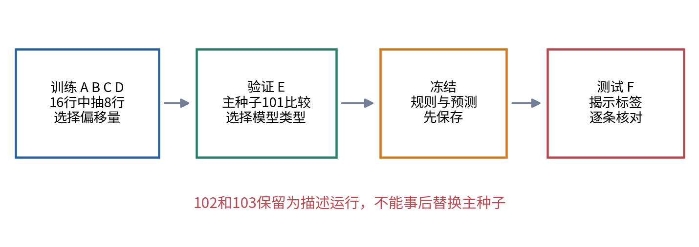
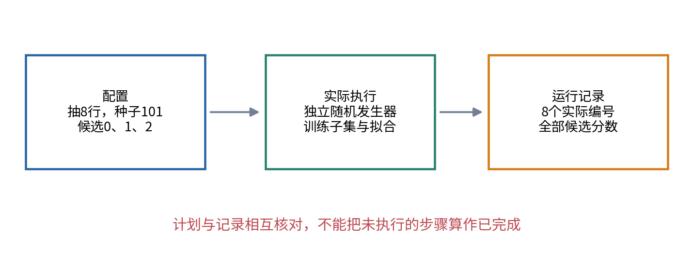
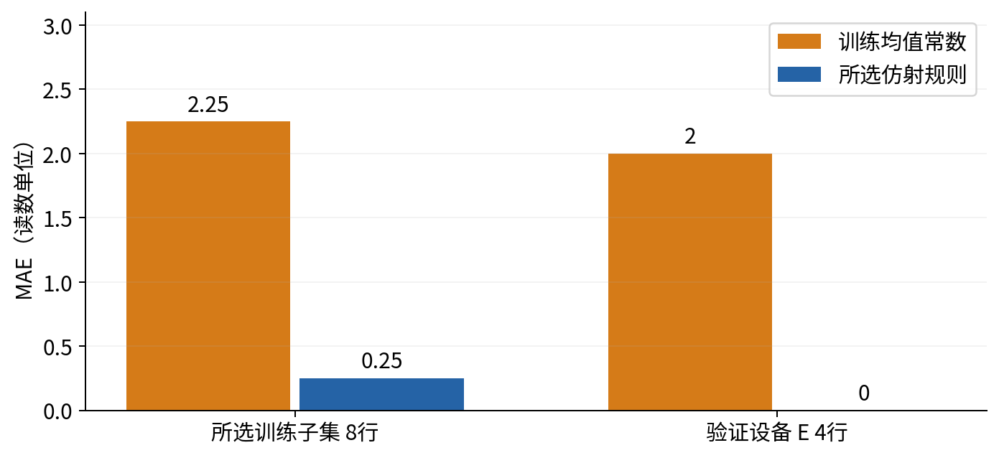
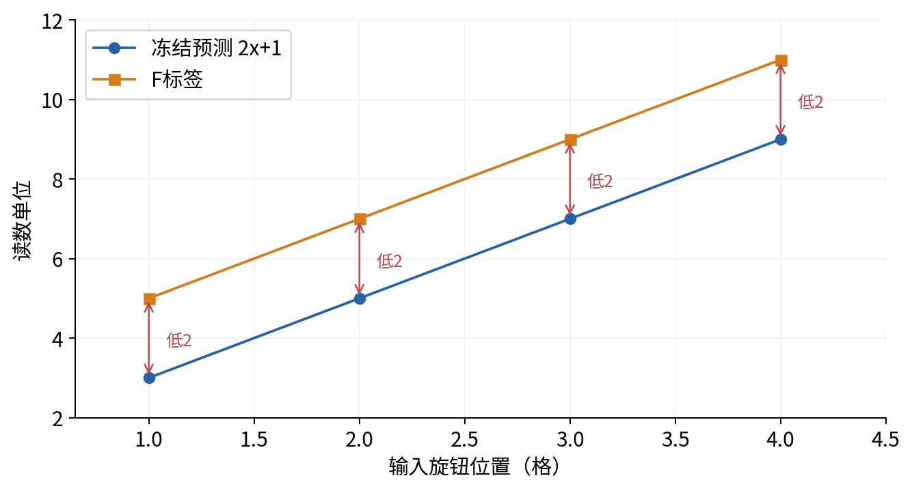
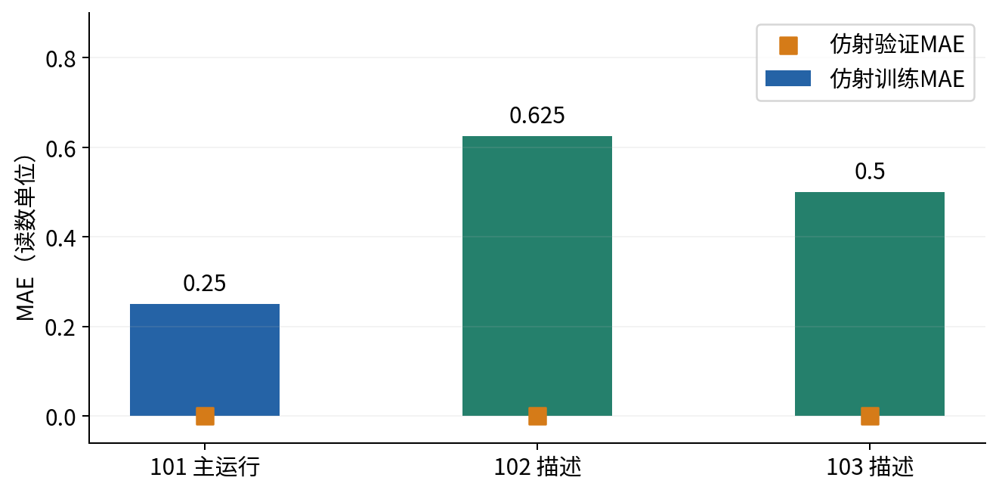
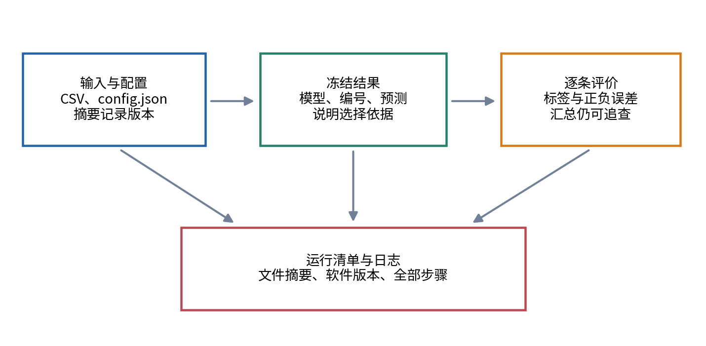

# 第一次可重跑的研究练习

## 第006单元 让一个结果带着来路留下来

屏幕上出现“测试误差2”，还不是一份研究记录。别人不知道用了哪些数据、随机选中了哪些样本、比较过哪些规则，也不知道这是不是你试过很多次后留下的最好截图。即使你明天亲自重跑，也可能忘了刚才改过哪个变量。本讲把这些隐含条件写成文件，让一个结果连同产生它的过程一起保留下来。

先修005。你已经认识函数、文件、数组、拆分单位和训练期预处理。这次不引入神经网络或统计推断，只完成一份极小、可复查的研究练习。我们使用六台虚构设备的校准记录，预先规定训练、验证、测试设备，保存三次训练子集抽样的全部结果，最后写三条待解释现象。

本讲中的“可重跑”首先指：在注明的软件环境、相同文件和配置下，重新执行同一过程得到相同产物。它不等于换一批真实设备还能得到相同结论，更不等于已经发现可靠机制。把过程保存完整，目的是让后续检验有据可循。

## 一 一次实验有比模型更多的决定

仍然在旋钮位置确定后、屏幕读数出现前预测读数。每行是一次合成校准；每台设备有四个输入位置1、2、3、4。设备A、B、C、D只用于训练，E用于验证，F用于最后的教学测试。我们关心的是新设备，因此不把同一设备的行随意分到不同部分。

训练池共16行，这次只从其中不放回地抽8行来选择参数。这里不放回表示同一条记录不会在这个子集中被抽到两次；不表示抽到的行彼此统计独立。同一设备仍可能贡献多行，16行也不等于16台独立设备。概率与依赖性将在后面的统计单元正式学习。



候选模型有两种：常数基线始终输出所选训练子集的标签平均；仿射规则固定系数2，只在偏移量0、1、2中按训练MAE选一个。常数均值是容易核对的基线，未声称它是绝对误差下的最佳常数。候选的意义要写完整，不能在看到测试后补一条刚好匹配答案的规则。

模型类型由主运行的验证MAE选择，相同则选择仿射规则。主运行的种子预先规定为101；另外两个种子102与103用于描述训练子集变化，不能事后把其中成绩最合心意的一次改称主运行。这个小约定能够阻止一种常见选择偏差：先试很多次，再把最好的一次说成普通的一次。

## 二 配置把本次决定写到文件里

config.json是一份带字段名的文本配置。它写明协议版本、主种子、全部描述性种子、训练子集大小、候选偏移量、固定系数、指标和文件名。JSON与Python字典有相近的外观，但它是独立的数据格式，字符串要用双引号，文件中不能随意插入Python注释。[3]

```json
{
  "primary_seed": 101,
  "descriptive_seeds": [101, 102, 103],
  "train_sample_count": 8,
  "candidate_biases": [0, 1, 2],
  "fixed_coefficient": 2,
  "metric": "mean_absolute_error"
}
```

上面是完整配置的一部分，不能替代随附文件中的其他字段。`train_sample_count`决定本次抽几条训练记录；它不是批次轴的新名字，也不是测试样本数。`candidate_biases`决定允许比较的参数范围；换候选集合意味着进行了另一个实验。

把配置写到文件并不自动保证代码遵守它。程序会核对样本数不超过训练池大小、种子不重复、指标是当前实现支持的MAE、文件名在单元数据目录内，以及设备拆分没有重叠。配置、实现和实际记录需要互相对照。



还应区分预先设定与事后发现。配置记录这次准备怎么做，输出记录实际上发生什么。若某次运行失败，保留错误说明；不要只保存成功的一次配置，然后让别人猜不到中间改过哪些条件。

## 三 随机种子控制的是一段过程

电脑通常通过确定的计算过程产生伪随机数。种子为这段过程设定一个起点；在相同实现、相同输入顺序和相同调用序列下，可以重现抽样。本实验用 `random.Random(seed)`创建独立发生器，然后调用sample从训练记录列表中选8条。[1]

```python
rng = random.Random(101)
subset = rng.sample(training_records, 8)
```

这里需要先 `import random`，模块属于Python标准库。我们不让别处一次随手调用random改变本实验使用的全局状态，而是给本次抽样单独的对象。003关于实例保存状态的知识在这里有了具体用途。

仅记“种子101”仍然不够。若训练文件行序改变，抽到的列表位置对应的记录也可能改变；若之前多调用一次抽样，发生器状态就不同；不同版本的辅助算法也不应假定逐项完全不变。因此还保存Python版本、完整配置、数据文件摘要和实际选中的记录编号。

固定种子让过程容易检查，不会让样本更有代表性，也不会消除不确定性。我们保留三个预先写明的种子，是为了观察这个微型流程对训练子集的变化；不能由三次相同验证分数推断所有数据、设备和种子都稳定。

## 四 手工重做主运行

Python3.12下，种子101选中B3、D3、C1、B2、B4、A1、D2、A4，顺序也保存在记录里。字母表示设备，后面的数表示该设备这条输入位置。下面完整展开偏移量1的预测，避免只相信汇总数字。

|编号|输入x|训练标签y|2x+1|绝对误差|
|---|---:|---:|---:|---:|
|B3|3|7|7|0|
|D3|3|7|7|0|
|C1|1|3|3|0|
|B2|2|5|5|0|
|B4|4|10|9|1|
|A1|1|3|3|0|
|D2|2|4|5|1|
|A4|4|9|9|0|

八项绝对误差总和2，平均为2除以8等于0.25。偏移量0时总误差8，平均1；偏移量2时总误差同样8，平均1。因此在指定三个候选中，偏移量1获选。

标签总和为48，常数基线输出48除以8等于6。它在八条训练记录上的绝对误差为1、1、3、1、4、3、2、3，总和18，平均2.25。我们保留基线，是为了让后续“更低误差”有一个具体参照，不靠模型名称营造进步感。

设备E的验证输入1、2、3、4，对应标签3、5、7、9。仿射模型恰好全部正确，验证MAE为0；常数6的四条误差为3、1、1、3，平均为2。按照提前写明的规则，主运行选择仿射模型，并保持偏移量1。



此时冻结的对象不只是偏移量。还包括模型类型、固定系数、指标、测试输入编号和预测值。面对设备F输入1、2、3、4，冻结预测为3、5、7、9。先保存这四个值，再揭示标签，才能从文件顺序检查这次评价是否忠于既定方案。

## 五 测试揭示后保留每条误差

设备F的教学测试标签为5、7、9、11。冻结预测分别低2，所以四条带符号误差均为-2，绝对误差均为2，测试MAE为2。标签仍然公开可见，文件隔离只演示工作流程，不构成未知盲测。



若报告只写“测试误差2”，读者无法知道是四条都错2，还是一条错8、其余正确。这两种情形平均相同，后续调查方向却可能不同。本例同时保存actual、prediction、signed_error和absolute_error，保留编号与设备。

作者特意把F的标签关系设为2x+3，训练多数记录围绕2x+1构造，用来制造需要追查的变化。学习者可以知道这一设计，却不能因此把真实任务里的类似图形一律解释为同一种原因。真实一致低估可能来自设备偏移、单位变化、标签处理或模型错误，需要各自检验。

测试集只有一台设备、四个位置。四行误差不能冒充四台独立设备的证据；本讲不计算置信区间、不作显著性判断，不把这次结果称为稳定的研究结论。

## 六 保存全部预定运行

种子102与103改变抽中的训练记录，仍然使用同一候选集合、同一验证设备与同一算法。下面保留全部三次描述性结果，不删除训练误差较大的那一次。

|种子|所选偏移量|仿射训练MAE|常数均值|仿射验证MAE|常数验证MAE|
|---:|---:|---:|---:|---:|---:|
|101|1|0.25|6.000|0|2|
|102|1|0.625|5.375|0|2|
|103|1|0.500|6.500|0|2|

这些数没有被平均成一个宣称普遍有效的“最终分数”。它们是三个具体子集下的观察记录。主运行仍为101；最终测试只评价这次主运行选中的模型。其他种子的结果不用于事后挑选要展示哪一个测试。



常数分别为6、5.375、6.5，验证MAE却都为2，值得亲手检查。以5.375为例，四条绝对误差为2.375、0.375、1.625、3.625，总和8，再除以4仍为2。这里不需要高级统计，就能发现“同一平均分”不意味着“同一组预测”。

## 七 给文件留下可核对的指纹

文件名相同不代表内容相同。明天的train.csv可能多了一行，或有个标签被改过。我们对文件原始字节计算SHA-256摘要：它将内容转换成固定长度的十六进制字符串。摘要不同，说明字节不相同；摘要一致是检查是否持有同一版本文件的实用办法。[2]

摘要不是对数据正确性的证明，也不说明来源可信。错误数据同样可以有稳定摘要；只修改空格或换行也可能改变摘要，而数值含义未变。本讲使用字节级摘要，是为了明确记录实际输入版本，不把它包装成科学验证或防篡改认证系统。

```python
import hashlib
data_hash = hashlib.sha256(path.read_bytes()).hexdigest()
```

read_bytes读取原始字节；sha256计算摘要；hexdigest将它表示成可保存的文字。程序给训练、验证、测试输入与最终测试标签都保存摘要，也记录config.json与experiment.py的摘要。测试标签摘要在揭示标签的阶段才计算，不参与模型选择。



每次运行都写入独立编号目录，例如outputs/run-0001、outputs/run-0002，旧目录不会被覆盖。目录内的run_status.json先写running，全部完成后才改成complete；捕捉到失败时改成failed并记异常类型。若进程突然中断，仍为running的目录也不能当作成功结果。

每次目录内的run_manifest.json保存输入、配置和源码摘要，记录Python与平台版本，并列出四个核心结果文件的摘要。运行日志用普通文字记录实际完成的步骤。摘要帮助核对文件身份，状态防止把失败当成功，逐条数据帮助核对数字，各自解决不同问题。

## 八 重跑时先比较什么

先在未改动任何文件的情况下运行两次，进入两个不同编号目录，比较各自的冻结方案、全部运行记录、最终结果与逐条预测。目录编号不同，但当前脚本没有把运行时间、私人路径或编号混入这些确定性文件，因此同一环境下核心文件字节应相同。

特别检查先成功、后失败的情况。若第二次改了候选参数，却在读取测试标签时失败，它的新冻结方案只能留在第二次目录中，不能与第一次的旧成绩混在一起。检查函数默认查看最新一次尝试，发现failed便拒绝，不会悄悄退回较早的成功成绩；要核对旧运行，必须明确选择旧目录。

若不同，先检查输入摘要与配置摘要；再检查所选记录编号与软件版本；最后逐项比较预测和指标。不要立刻把“不一样”归咎于深度学习本来随机，也不要把误差容差调到足够大来掩盖变化。本讲完全是很小的确定性计算，差异应有可追踪的来源。

源码摘要变化时，即使结果暂时相同，也说明运行的实现版本不同。例如只改注释就能改变源码摘要，却不改变运算。版本记录应诚实保留这种差异，而不是为了看起来“完全一致”手动改回摘要。

以后训练神经网络还会受到框架、设备、并行运算和具体算子影响，固定一个种子不保证跨平台位级一致。当前练习先建立记录习惯，后续复现与资源单元再扩展到这些情形。

## 九 三条现象与三项下一步

现象一：三个种子的仿射训练MAE分别为0.25、0.625、0.5，偏移量都为1。下一步可以比较实际入选记录中偏离2x+1的行，或在只用训练与验证资料的诊断中把子集大小改为16，检查是不是子集组成驱动了训练误差变化。这里提出可检验的问题，不用三条数字直接断言一般机制。

现象二：常数预测值不同，验证MAE相同。下一步先列出各模型对四个验证点的逐项误差，看平均如何相互补偿。这个检查不需要再训练，也不需要用测试反馈改规则，是从现有记录里找被汇总数字隐藏的信息。

现象三：主运行验证MAE为0，测试MAE为2，测试四条都低估2。下一步应区分数据来源、单位、设备差异与模型形式，设计新的独立检查。不能直接在已经揭示的测试上把偏移量改成3，然后仍报告同一测试为从未参与改进的最终评价。

一份诚实的小报告把观察、解释候选与下一步分开。观察应能指向具体记录；解释候选应说明还有其他可能；下一步应能证伪或缩小其中一种可能。这里只完成描述性起点，正式比较的不确定性与因果归因留给后续单元。

## 十 练习与交付

1. 列出本次实验至少六项必须保存的决定，说明只保存模型偏移量为什么不够。
2. 根据八条主运行记录手算三个候选的训练MAE，以及均值常数的训练MAE。
3. 用设备E的四个标签核对常数5.375和6.5的验证MAE，解释相同分数不意味着相同预测。
4. 同一个种子下，把训练CSV行序打乱后重新抽样。你预计哪些记录可能改变？应保存哪些信息定位这种变化？
5. 向数据文件添加一个换行，数值未变而摘要改变，是否说明模型结论必然改变？再讨论直接修改标签的情况。
6. 某同学从三个种子中挑训练误差最小的一次，删除另外两次记录。解释这与本协议哪里不同。
7. 测试四行均低估2，写一条具体观察、两种真实任务中可能的解释和一项需要新证据的检查。
8. 交付配置、输入版本、全部种子记录、冻结预测、逐条测试误差、运行日志与一页现象报告。另附一次从空会话重跑的核对结果。

## 参考资料

[1] Python3.12官方文档，[random](https://docs.python.org/3.12/library/random.html)，独立发生器、sample与可重复性边界。[2] [hashlib](https://docs.python.org/3.12/library/hashlib.html)，SHA-256与摘要接口。[3] [json](https://docs.python.org/3.12/library/json.html)，配置及记录的序列化。数据、模型比较、手算和图均为本课程独立编写。
