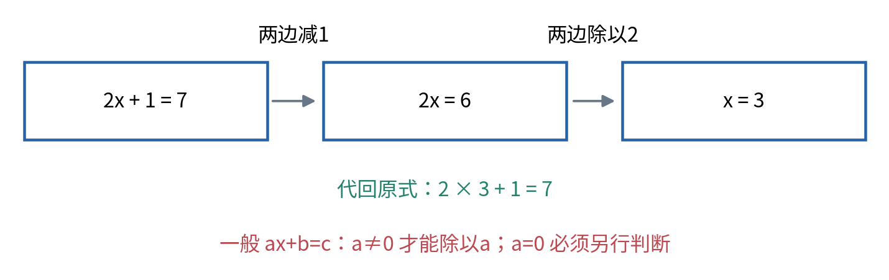
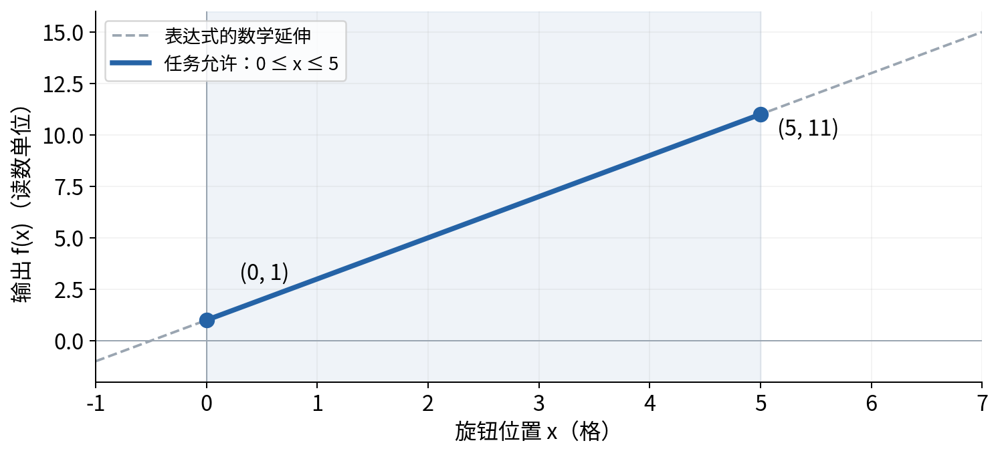
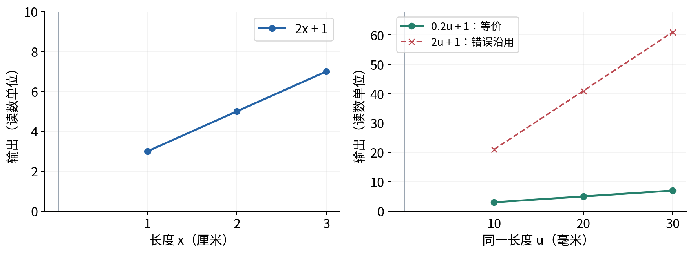
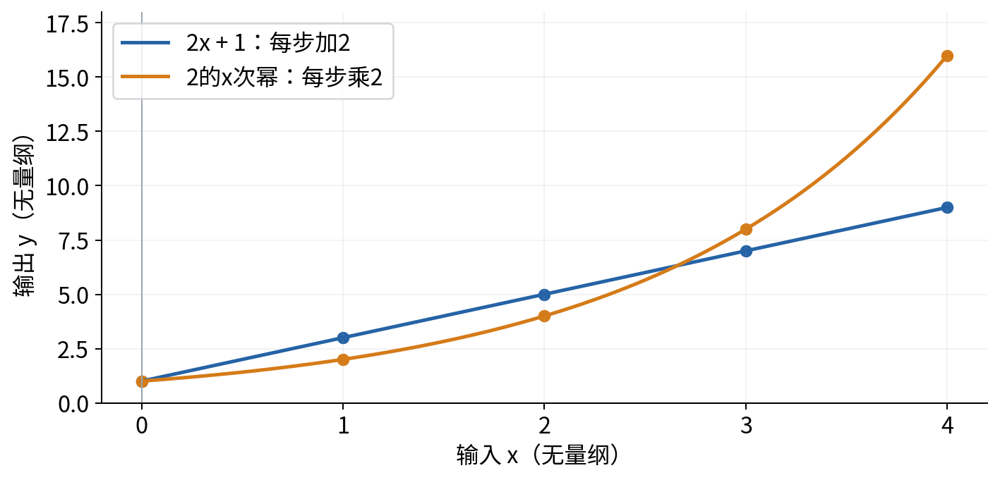
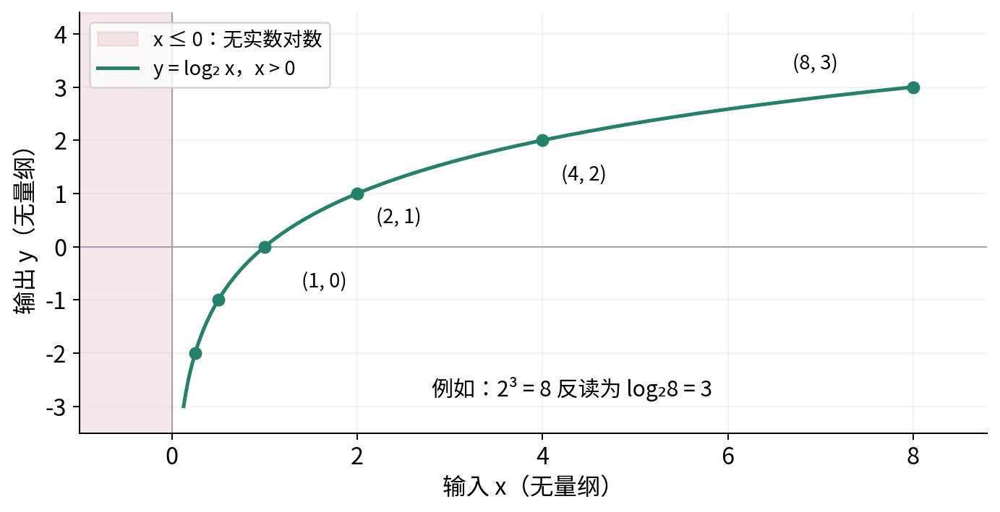
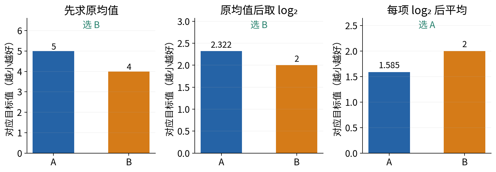
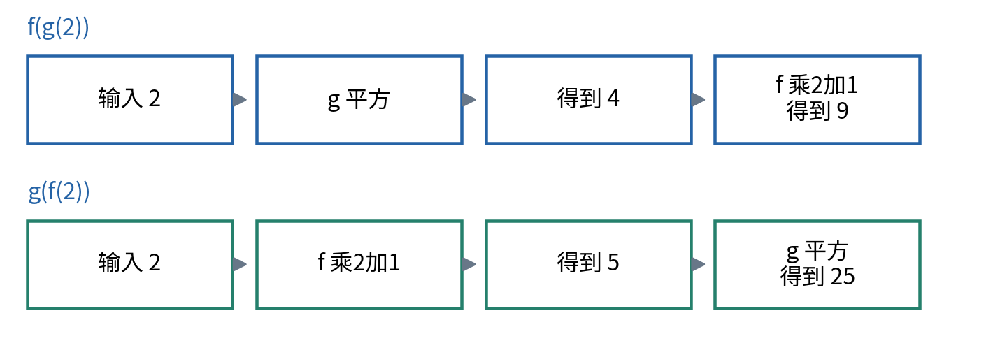
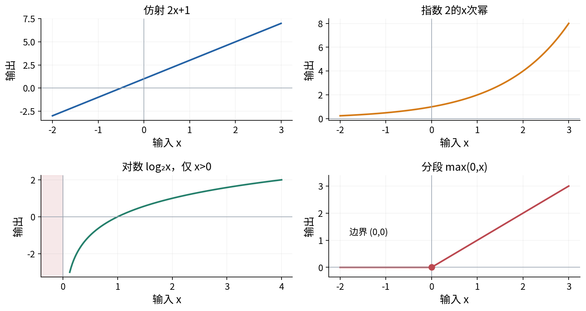

# 代数函数与图像语言

## 第007单元 把一个公式说成可以检查的过程

看到公式 $y=2x+1$，你能把某个输入代进去计算；但如果把x换成别的单位，或给输出取对数，再把多条结果平均，原来的解释还成立吗？本讲把公式当成输入、计算和输出之间的一份明确约定。我们从一元方程、函数和坐标图开始，再建立指数、对数、求和与复合的语言。

先修001与003。只要求理解四则运算、预测误差和基本Python函数，不借用后面的向量、矩阵或微积分。所有图都是标量函数的示意；学完应能写出输入允许的范围、单位和逐步计算，并说明图形支持哪些判断、不能证明哪些判断。

核心例子仍然是一个合成校准关系。简单直线帮助我们认识参数与输入；重复乘2帮助认识指数；反过来问“乘了几次2”得到对数；最后用两个损失列表说明：对每个数取对数再平均，可能改变模型排名。

## 一 字母代表哪个数

一个表达式由数、字母和运算组成，例如2x+1表示把x乘2再加1。数学里紧挨的2x表示乘法；Python必须写成 `2 * x`。x是本次可以变化的输入，2与1在这条规则里固定。把规则一般化为ax+b时，a和b是我们选择或估计的参数。

本讲的x、a、b、y都是单个实数。实数包括整数、分数、小数和其他可以落在连续数轴上的数；暂不讨论复数。字母不是新的物理量，也不自动规定单位。若x是旋钮格数，y是读数单位，a的单位应为“读数单位/格”，b的单位应与y相同。

等式表达两边相等的关系。写2x+1=7，就是要求找到让两边相等的x。两边同时减1，得到2x=6；再同时除以2，得到x=3。每一步都对两边做同样且合法的操作，所以保持了原来允许的解。



把x=3代回原式，左边2×3+1=7，与右边一致，这叫验算。若某一步除以可能为0的量，就必须先处理零的情况。一般方程ax+b=c在a不为0时有解x=(c-b)/a；a=0且b=c时，每个允许的x都满足；a=0且b不等于c时没有解。

这三个情况说明，公式不能脱离条件使用。程序也应区分唯一解、无解和多解，不应该遇到a=0就随意输出0。我们将在实验中给这三种情况分别写测试。

Python中的 `x = x + 1`是赋值：先用旧x计算右侧，再把结果命名为新的x。它不是声称某个实数等于自己加1。数学等式与程序状态更新相似的外观，不能代替各自语义。

## 二 函数给每个允许输入一个确定输出

函数由允许的输入集合和一条明确对应规则组成。在定义域内，每个输入应对应一个确定输出。把校准规则命名为f，写成 $f(x)=2x+1$，意思是f接收x，输出2x+1。括号不是乘法，f(3)表示“把3交给函数f”，计算结果是7。

定义域是允许交给函数的输入范围。数学表达式2x+1对任意实数都能计算，但合成装置也许只允许旋钮在0到5格。后者是任务额外限制。能算出f(100)=201，不证明设备真的支持100格或这条模型在那里准确。

输出实际可能取到的值称为值域；我们先不把它与另行指定的输出集合混为一谈。若输入限定为0到5，f(x)=2x+1的输出从1到11。输入不能超出范围时，输出也不应被解释为任意实数。



Python函数的参数和返回值可以实现数学函数的一部分，但任意程序函数未必是这里的数学函数。例如程序读取当前时间或修改全局状态，同一显式输入可能得到不同结果。若希望它表达一个确定的数学关系，应把有关状态也作为约定的一部分。

## 三 坐标图把对应关系放到位置上

横轴表示输入，纵轴表示输出。一个点(2,5)表示x=2时y=5，先读横向位置，再读纵向高度。作图从表格开始：x为0、1、2、3时，f(x)分别为1、3、5、7。标出这四个点，再结合明确的函数形式画出直线。

这里把图像为直线的关系统称为直线关系。严格地说，ax+b在b不为0时叫仿射函数；保持原点的ax才是后续线性代数语境下的线性函数。本讲的2x+1是仿射关系，不需要先懂线性代数。

本例输入每增加1，输出都增加2。这个固定变化率使点落在一条直线上。a决定输入增加一个单位时输出改变多少，b是输入0时的输出。a为正时向右看上升，a为负时下降，a=0时是水平线。此处用有限差值解释，不预先要求导数。

实际数据点不一定都落在模型曲线上。把数据点画成实心圆、模型画成线，有助于区分观测和拟合。仅靠少量点连出的折线也不能证明点与点之间遵循同样规律；图中的连续线来自我们采用的函数假设。

坐标轴比例会改变视觉倾斜程度。把横轴拉宽，同一关系看起来更平；把纵轴缩短，也会改变视觉印象。因此比较变化率应读数值和单位，不凭线在页面上“陡不陡”下结论。

## 四 换单位时参数也要换

假设输入是以厘米记录的长度，规则为y=2x+1。把同一长度改成毫米，数值变为原来的10倍。若原来x=3厘米，对应30毫米；直接把30放进旧式会得到61，而原预测是7。这不是设备突然变了，而是输入表示与系数不匹配。

令新的毫米数值为u，则原厘米数值为u/10。代回原式得到y=2(u/10)+1=0.2u+1。用u=30计算，结果仍是7。单位转换既改变输入数值，也改变与它相乘的系数。



加法两项需要可比较的单位，例如长度加长度。指数与对数的输入通常使用无量纲数或相对于明确参考值的比值。对“3厘米”直接取对数却不说明参考单位，会使结果随着你写厘米还是毫米改变；改写为长度除以1厘米的比值，才明确了所用基准。

## 五 从重复乘法认识指数

平方 $x^2$表示x乘自己一次，例如3²=9。一般正整数n次幂 $a^n$是n个a相乘。这里幂的底数是a，指数是n。Python用 `a ** n`，符号 `^`在Python不是幂运算。

以底数2为例，2¹=2、2²=4、2³=8。为了保持 $2^{m+n}=2^m2^n$的关系，零次幂定义为1，负一次幂为1/2，负二次幂为1/4。这个解释采用非零底数；不能把关于负指数的规则直接套到0上。

底数2的指数函数写作 $g(x)=2^x$，变量出现在指数位置，而不是2x的乘法位置。整数输入每增加1，输出乘2。x从0到4时输出为1、2、4、8、16，和直线1、3、5、7、9的变化方式明显不同。



在正底数下可以把指数扩展到分数与实数。例如 $2^{1/2}$是平方后等于2的正数，约1.414；这让两个半步的乘法因子组合成完整一步的2。实数指数的严格构造需要更深入的数学，本讲使用它的标准定义与运算规律，并用有限例子检查，不声称画图完成了证明。

当底数a大于1时，a的x次幂随x增大而增大；0<a<1时则减小。我们把一般实指数函数的底数限定为正数，避免负底数与非整数指数的实数定义问题。自然指数使用特殊底数e，约2.718281828；程序用math.exp(x)计算e的x次幂。为什么这个底数在微积分中特别方便，会在010与后续单元解释。

还要注意负号与括号。数学里的 $(-2)^2=4$，而 $-2^2=-4$通常表示先算2²再取负。Python也将 `-2 ** 2`解释为-(2**2)，所以希望负数作为底数时应写括号。[2]

## 六 对数是在问指数是多少

已知2³=8，反过来问“2的几次幂等于8”，答案是3。写作 $\log_2 8=3$。一般地，$\log_a x=u$与$a^u=x$表达同一个关系，条件是a>0、a不等于1、x>0。a称为对数底数，x是被取对数的正数。

底数不能为1，因为1的不同幂都等于1，不能唯一反推出指数。x不能是0或负数，因为正底数的实指数结果始终为正。在实数范围内log(0)没有有限值，log(-1)也不是一个实数；程序应明确拒绝，不能顺手填成0。

底数2时，x为1/4、1/2、1、2、4、8，对数分别是-2、-1、0、1、2、3。对数为负不表示输入为负：1/2是正数，只因它小于1，所以需要负指数才能由2得到它。



底数大于1时，对数随输入增大而增大；底数在0与1之间时方向相反。常用的以e为底的对数写作ln，Python的math.log(x)默认计算这一种；math.log2(x)以2为底，math.log10(x)以10为底。只写log却不约定底数，可能导致数值和单位解释不一致。[1][3]

换底公式为 $\log_a x=\ln x/\ln a$。它使我们可以从自然对数得到别的底数。下一节先解释对数的幂律，再推导此式，避免把它当成另一个没有来由的计算按钮。

## 七 为什么乘积变成对数的和

令u=$\log_a x$、v=$\log_a y$，那么x=a的u次幂、y=a的v次幂。两者相乘得到a的u+v次幂，因此$\log_a(xy)$=u+v，也就是$\log_a x$+$\log_a y$。这里x和y都必须为正，底数满足上一节条件。

用具体数字验证：log₂(4×8)=log₂32=5，而log₂4+log₂8=2+3=5。除法同理给出$\log_a(x/y)$=$\log_a x$-$\log_a y$。对数把乘法结构转换成加法结构，有时方便整理多个正因子的乘积。

它不把加法直接变成对数相加。log₂(4+4)=log₂8=3，而log₂4+log₂4=4。把正确的乘积公式误用到和上，是一种看起来整齐却立即可被小例子推翻的符号错误。

再看幂律。令u=$\log_a x$，所以x=a的u次幂。对任意实数r，正底数指数的运算规律给出 $(a^u)^r=a^{ur}$。于是x的r次幂所对应的指数就是ur，得到：

$$\log_a(x^r)=r\log_a x,\qquad x>0,\ a>0,\ a\ne1.$$

例如log₂(4³)=log₂64=6，右侧3log₂4=3×2=6。限定x>0很重要：虽然(-2)²=4可取对数，log₂(-2)却没有实数值，不能用幂律把它变成2log₂(-2)。

现在推导换底。令u=$\log_a x$，依定义有x=aᵘ。两边取自然对数，利用刚才的幂律得到ln x=u ln a。由于a不为1，ln a不为0，可以除以它，得到：

$$u=\frac{\ln x}{\ln a},\qquad\text{即}\quad \log_a x=\frac{\ln x}{\ln a}.$$

这段推导中的每一步都要求x和a为正，且a不为1。换成任何另一个合法对数底数，也能用同样过程推导。[4] 这些是实数数学的恒等式；在程序中先算x的r次幂或xy可能溢出，对公式两边分别计算得到的浮点数也不必逐位相同。实验用小数值与明确误差容限核验。

## 八 对整体取对数与逐项取对数

若比较两个正数A和B，底数大于1的对数保持大小顺序：A<B时log A<log B。因此对同一个正的整体目标应用这种单调变换，最优选择的顺序不会因这一步改变。但先变换各项、再把它们加起来，通常已经构造了另一个目标。

设两个方案的两条正损失分别为A=[1,9]，B=[4,4]，损失越小越好。原平均损失A为5，B为4，所以原目标选B。若先取以2为底的对数再平均，A为(0+log₂9)/2，约1.585；B为(2+2)/2=2，于是新目标选A。



若先算原均值再取对数，A是log₂5约2.322，B是log₂4=2，仍然选B。问题不在对数“有没有用”，而在你到底对哪个对象做了什么运算。改变目标有时有明确建模理由，但需要说明新目标强调什么，不能因为式子更好算就说所有评价等价。

这个反例也能直接从乘积解释。对两条正损失p、q，逐项取log₂再平均等于 $\tfrac12\log_2(pq)=\log_2\sqrt{pq}$。其中正平方根 $\sqrt{pq}$ 叫这两个数的几何平均值。A的几何平均为3，B为4，所以第三种目标选A。它比较的是另一种汇总方式，不是原算术平均的换个写法。这里不需要先学习概率或不等式理论。

上述保序结论只适用于同一正整体以及大于1的底数。若改用底数1/2，对数递减，大小方向就反转；若仍把分数最小当作最好，就不能声称选择不变。

后续概率模型常出现对数似然，那里会先写清概率乘积、样本假设与优化目标，再讨论对数变换。现在先掌握这个反例，避免在没有定义对象时机械套公式。

## 九 求和符号把循环写短

001已经用平均误差接触过求和。现在把它展开：$\sum_{i=1}^{3} a_i$就是a₁+a₂+a₃。i是逐个变化的编号，1和3指定从哪里开始、到哪里结束；$a_i$是编号对应的数，不是a乘i。换一个不冲突的编号字母，不会改变总和。

若a₁=2、a₂=4、a₃=6，和为12，平均为12/3=4。Python列表从位置0开始，因此同样三个数通常用 `values[0]`、`values[1]`、`values[2]`。数学编号从1开始只是本课程的记号约定，不能直接照抄成Python索引1到3。

常数也需要逐项累加。$\sum_{i=1}^{3}(a_i+1)$等于(a₁+1)+(a₂+1)+(a₃+1)，所以是在原和12上加3，得到15，而不是只加一次1得到13。将求和号外的操作移进或移出时，应先展开一个小例子。

## 十 复合函数的顺序

令f(x)=2x+1，g(x)=x²。f(g(x))表示先把x交给g，再把g的输出交给f。x=2时，g(2)=4，f(4)=9。反过来g(f(x))先得到f(2)=5，再平方得25。两种复合都定义良好，结果不同。



复合还要求内层输出落在外层的定义域。若外层是log₂，内层是x-1，则log₂(x-1)要求x-1>0，也就是x>1。先前“x本身为正”不够，例如x=0.5虽然正，内层结果却是-0.5，不允许取实数对数。

本讲只追踪数值与允许范围，不提前求导。以后计算一串变换怎样随输入变化时，会沿着同样的计算顺序建立链式法则。

## 十一 分段规则把条件也写进函数

一个函数可以在不同输入范围采用不同表达式。例如x小于0时输出0，x大于或等于0时输出x。这给所有实数输入一个确定的非负输出，常写成max(0,x)，也是后续会用到的ReLU函数。

```python
def rectifier(x):
    if x < 0:
        return 0
    return x
```

在x=-2、0、3时，输出依次是0、0、3。边界0必须写清；若两个分支都不包含0，函数在这个位置就缺少定义；若分支重叠且给不同答案，又会产生歧义。本例在边界上两种表达式都给0，但程序仍保持明确的分支规则。

用分段记号写出来是：

$$r(x)=\begin{cases}0,&x<0,\\x,&x\ge0.\end{cases}$$



图形在0处转折，不代表函数值没有定义。函数是否可求导是另一个问题，将在010讨论。不要把“看起来有尖角”“数值不连续”“没有定义”当成同一种情况。

## 十二 从数学约定到程序检查

数学上的2的x次幂对每个实数x都有正值，但计算机的浮点表示有范围限制。非常大的正指数可能溢出，非常大的负指数可能被舍入成0。它们与log₂(-1)在实数中没有定义是两类不同问题，不能都填成“函数值为0”。本实验把前者报告为ArithmeticError，把非法对数输入报告为ValueError；不把这些异常当作数学反例。[1]

配套程序只用于有限、适度大小的标量。它拒绝NaN、无穷大、字符串与布尔值，检查非有限输出以及指数下溢为0的情况；并不声称解决全部舍入、消去误差或极端规模问题。特别是比较a是否为0，是检查传入的数是否恰为0，不是在判断带测量误差的斜率“足够接近0”。用容差把小a当作0会改变问题，需要另外给出应用理由。

实验中的CSV保留对数未定义位置的空白，并额外记录outside_real_domain。这样读者能区分“没有定义”“真的等于0”和“没有运行”。图形只显示有限窗口；证明公式仍要回到对象、假设与合法操作。

## 十三 练习

1. 分别求解2x+1=7、0x+3=3、0x+3=4，说明每步操作的条件。
2. 对输入限制在0到5的f(x)=2x+1，写出定义域与值域。计算f(100)是否证明装置在100格可用？
3. 把厘米输入改成毫米，推导等价系数，并对同一物理长度验算。
4. 列出2的-2、-1、0、1、2、3次幂；核对(-2)²与-2²在Python中的写法和结果。
5. 算log₂(1/4)、log₂1、log₂8，写出实数对数对输入与底数的限制。
6. 用4和8推导并核对乘积对数公式，再给出“和的对数等于对数的和”的反例。
7. 完整比较损失列表A=[1,9]与B=[4,4]的三种目标：原均值、均值后取log₂、逐项log₂后平均。解释排名为何可能变化。
8. 对f(x)=2x+1与g(x)=x²计算两种复合在x=2时的值，再写log₂(x-1)的定义域。
9. 展开三项求和($a_i$+1)，核对与“求和后只加1”的区别。给分段rectifier在负数、0与正数上各写一个测试。

## 参考资料

[1] Python3.12官方文档，[math](https://docs.python.org/3.12/library/math.html)，指数、对数与定义域错误。[2] Python3.12语言参考，[Operator precedence](https://docs.python.org/3.12/reference/expressions.html#operator-precedence)，幂与负号的解析。[3] OpenStax作者教材，[College Algebra 2e 第6.3节](https://openstax.org/books/college-algebra-2e/pages/6-3-logarithmic-functions)，对数函数定义与条件。[4] OpenStax作者教材，[College Algebra 2e 第6.5节](https://openstax.org/books/college-algebra-2e/pages/6-5-logarithmic-properties)，乘积、商、幂与换底公式。例子、图、程序与目标变换反例独立编写。
