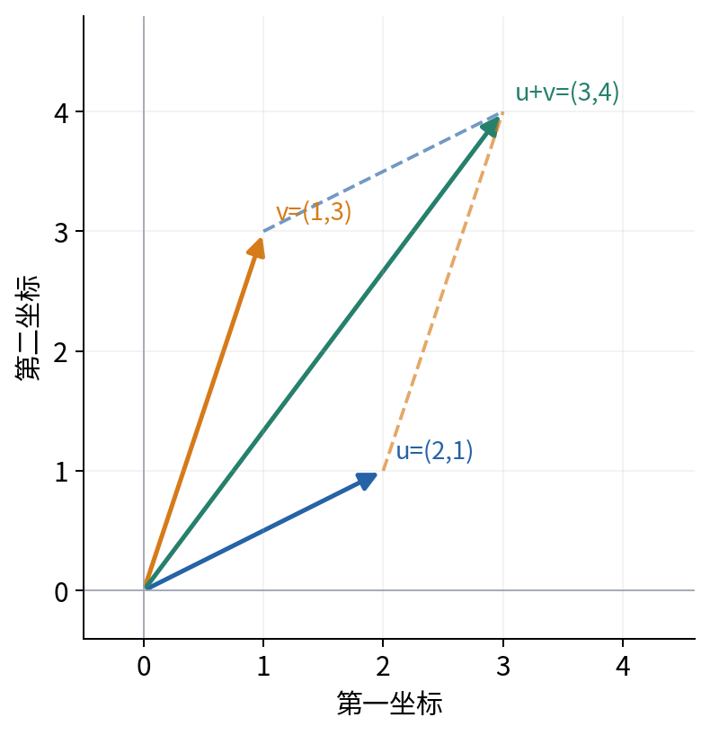
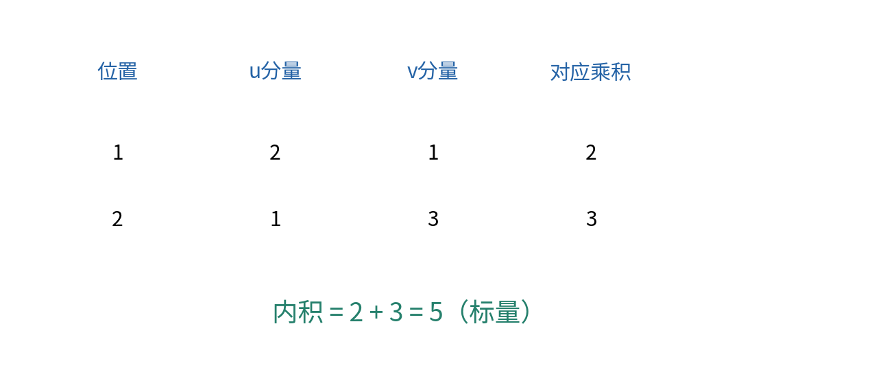
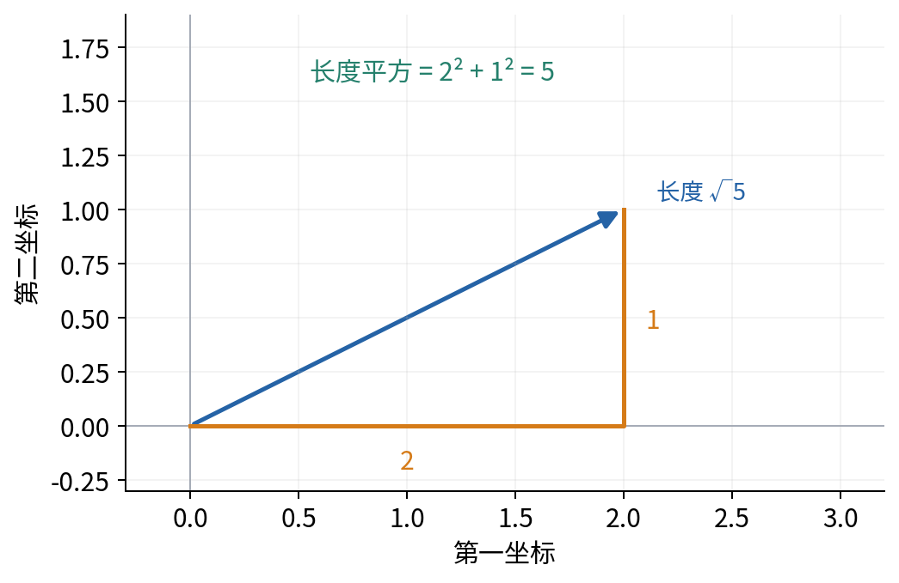
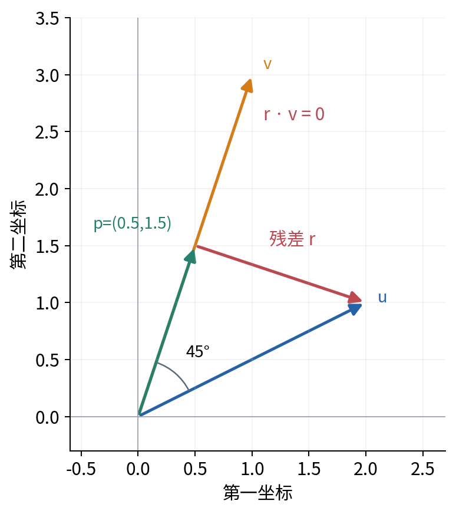
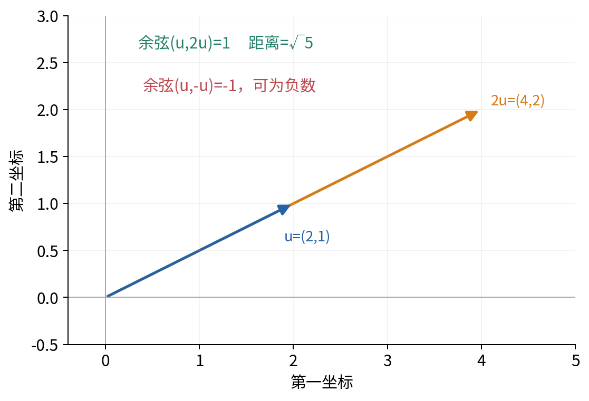
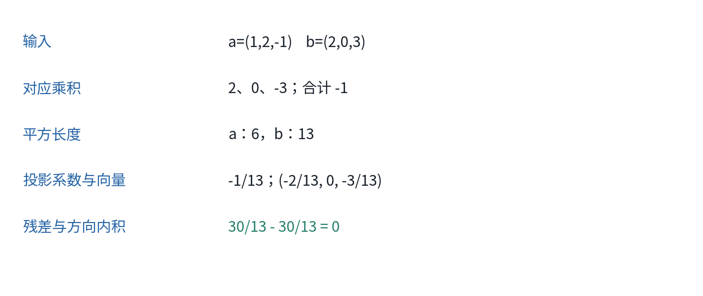
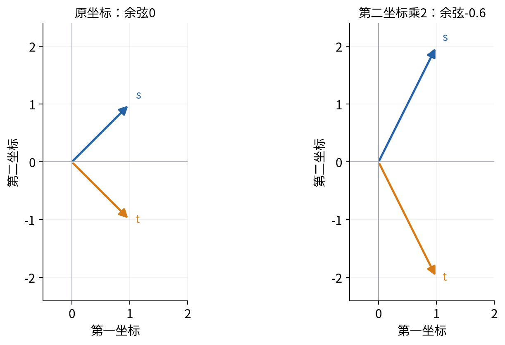
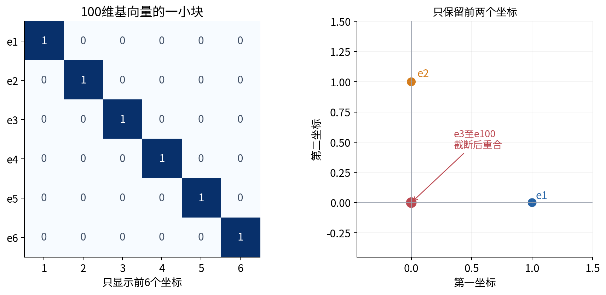

# 向量内积与几何

## 第008单元 同一组数字可以回答几种不同问题

两条样本都用一串数字表示，怎样比较它们？可以问相差多远，可以问方向是否接近，也可以问其中一个沿另一个方向保留多少。这些问题有关联，却不是同一个问题。把余弦相似度当成概率，或把长度变化误当方向变化，都会使后面的模型解释偏离计算本身。

先修007与004。我们从分量相加相乘和二维图开始，不要求提前学过三角函数、投影或矩阵理论。贯穿正文的两条无量纲向量是u=(2,1)、v=(1,3)。配套实验还会手算一个三维例子，用NumPy核验，并展示改变一条坐标的尺度如何改变相似度。

本讲的所有几何例子都是原创数值，没有真实用户、文本嵌入或科学测量。二维图只帮助理解有限机制；到了高维，我们用明确坐标和代数关系检验，不把画不出来的对象当作不存在。

## 一 从有顺序的分量开始

向量可以先理解为具有固定顺序的若干实数。写u=(2,1)，表示第一分量2、第二分量1。交换成(1,2)通常就是另一个向量，因为两个位置代表的坐标或特征不同。维数D表示分量个数；本讲D是正整数。

在NumPy中，一条向量使用形状(D,)的一维数组，不把一批样本(N,D)直接交给单向量函数。数学中的行列写法后面会明确规定；本讲凡是两条向量相加、相减或求内积，都要求分量个数相等且对应位置意义相同。

逐分量相加得到u+v=(3,4)；相减得到u-v=(1,-2)。用一个标量c乘向量，表示每个分量乘同一个c。例如2u=(4,2)，-u=(-2,-1)。标量是单个数，向量有D个分量，输出类型不应混淆。

几何图将向量画成从原点指向坐标位置的箭头。u=(2,1)表示向右2、向上1。数据特征向量不一定真是空间位置，例如两个旋钮读数也可以排成向量；是否适合用空间距离解释，取决于特征单位与任务，而不是“已经装进数组”这一事实。

## 二 内积是对应相乘再相加

两条D维实向量u和v的欧氏内积定义为：

$$u\cdot v=\sum_{j=1}^{D}u_jv_j.$$

j逐个编号分量，u_j和v_j是对应位置的数。内积输出一个标量。二维例子得到2×1+1×3=5。与004的逐元素乘法不同，逐元素结果是(2,3)，还要把两个贡献相加才得到内积5。

当一条样本x=(1,10)，参数w=(2,0.1)时，内积x·w=1×2+10×0.1=3，再加偏移1得到4。这与004中的单样本预测一致。参数的单位应让每项乘积具有同一种输出单位；不能因为符号都叫向量，就认为任何分量组合都有合适的应用意义。

实数乘法可以交换顺序，因此u·v=v·u。乘法对加法分配，所以u·(v+w)=u·v+u·w。常数也可以移到整体外面：(cu)·v=c(u·v)。这些性质直接来自逐项展开，并不是额外的神秘运算规则。

内积可以为负、零或正。例如(1,0)与(-2,0)内积为-2，(1,0)与(0,3)内积为0。仅看符号不能判断两个对象在实际任务上“好”或“坏”，它先是一个坐标运算。后面将用长度与角度解释这些情况。

## 三 范数给向量一个长度

二维直角三角形的两条直角边长为a和b时，斜边长的平方为a²+b²。由此得到二维向量的欧氏长度，并扩展到D维：

$$\|u\|_2=\sqrt{\sum_{j=1}^{D}u_j^2}.$$

平方根符号表示平方后得到其内部数的非负数。例如√9=3，不取-3作为这个符号的值。u=(2,1)的平方和为4+1=5，长度为√5，约2.236。v=(1,3)长度为√10，约3.162。

所有平方项非负，所以长度非负；只有所有分量都为0时长度才为0。零向量记为0，但它包含D个零，不是随意换成一个标量0就忽略形状。长度平方满足 $\|u\|_2^2=u\cdot u$。

缩放向量后，$\|cu\|_2=|c|\|u\|_2$。因为每个分量平方后多出c²，开平方留下|c|。负号会改变箭头方向，但不使长度变成负数。长度平方随c²变化，因此它不是与长度相同的量；后续看到平方范数惩罚时要保留这个区别。

还有其他范数。例如L1范数把分量绝对值相加，L∞范数取最大绝对分量。对a=(1,2,-1)，L1为4，L2为√6，L∞为2。它们衡量大小的方式不同，不存在脱离任务就永远最合适的一个。本讲的距离、投影和角度默认使用L2欧氏几何。[2]

## 四 距离先相减再量长度

u与v的欧氏距离定义为它们差向量的L2长度：

$$d(u,v)=\|u-v\|_2.$$

u-v=(1,-2)，平方和1+4=5，所以距离√5。距离回答两点的位置差多少；内积回答对应乘积之和；两者都是数，但定义不同。不能把内积5直接称为这两点的距离。

把两个向量都平移同一个向量t，差值为(u+t)-(v+t)=u-v，所以欧氏距离不变。内积或相对于原点的方向不一定保持。例如同时减去(1,1)，u变成(1,0)，v变成(0,2)，两者仍相距√5，却变成互相垂直的轴向箭头。

这意味着中心化等表示改变可能保留某些距离，却改变相对于原点的角度。比较向量时必须知道原点和坐标代表什么，不能只记一个相似度函数名。

## 五 沿一个方向保留多少

我们想把u沿v方向保留一部分。所有沿v所在直线的向量都可以写成cv，其中c是任意实数。目标是找到一个p=cv，使剩余部分r=u-p与v垂直。这里“垂直”在欧氏坐标里对应内积为0，稍后也会从角度解释。[1]

把条件展开：r·v=(u-cv)·v=u·v-c(v·v)=0。只要v不是零向量，v·v为正，可以解出：

$$c=\frac{u\cdot v}{v\cdot v},\qquad p=\frac{u\cdot v}{v\cdot v}v.$$

分母必须来自目标方向v的平方长度，不能因为公式里也有u就随意交换。u=(2,1)、v=(1,3)时，u·v=5，v·v=10，所以c=1/2，p=(0.5,1.5)。剩余r=(1.5,-0.5)，与v内积1.5×1+(-0.5)×3=0。

为什么这个p也是直线上距离u最近的点？任取另一个系数a，将u-av写成r+(c-a)v。它的平方长度展开为r的平方长度，加上(c-a)²乘v的平方长度；交叉项因r·v=0而消失。后加的一项非负，且v非零时只有a=c才为0。因此p是唯一最近点。

这个推导只用内积展开与非负平方，不依赖微积分。它也提醒我们“投影到v方向”与“把u强行缩成v的长度”不同：c可能为负，p也可能与v箭头方向相反。目标是v张成的整条直线，而不只是从原点出发的正向射线。

## 六 为什么归一化内积不会超过1

为了单独比较方向，考虑把内积除以两个非零向量的长度。先证明结果范围，而不是只相信软件返回一个看似合理的数。

由上一节的残差平方非负，得到 $\|u\|_2^2-(u\cdot v)^2/\|v\|_2^2\ge0$。乘以正的分母，再开非负平方根，得到：

$$|u\cdot v|\le \|u\|_2\|v\|_2.$$

这叫Cauchy-Schwarz不等式。本例的5小于或等于√5乘√10，约7.071，符合该界。若v为零，内积和右侧都为0，不等式仍成立；只有前面用除法的推导需要把零情况单独处理。

因此，对两个非零向量，归一化内积落在-1到1之间。正比例同向时为1，负比例反向时为-1，垂直时为0。这个量称为余弦相似度：

$$\operatorname{cosine}(u,v)=\frac{u\cdot v}{\|u\|_2\|v\|_2}.$$

零向量没有确定方向，分母也为0，所以这里的余弦没有定义。给分母加一个小数让程序不报错，已经引入另一种数值约定，不能继续当作原定义完全不变。本实验明确拒绝零向量的余弦计算，零向量的内积、长度和距离仍可正常定义。

## 七 从余弦认识夹角

角度衡量两条非零箭头在相同起点的方向差，完整一圈是360度，直角90度。二维直角三角形中，一个锐角的余弦是邻边与斜边的长度比；把向量沿另一方向投影，就能得到这种比例。欧氏内积与几何角度满足u·v=两长度之积再乘夹角余弦。[1]

程序常用弧度表示角度：整圈为2π弧度，π约3.14159；π弧度对应180度。arccos或acos是反向操作，接收-1到1之间的余弦，返回0到π之间的夹角，再用degrees转换为度。它不是对任意数都能使用的函数。

本例余弦为5/√50，约0.7071，对应45度。这不是从图的像素斜率估计出来的，而是由坐标和公式确定。图必须使用横纵相同的尺度，才能让视觉上的角度与计算角度一致。

将u乘正数2后方向不变，与v的余弦不变，但u与v的距离一般改变。u与2u余弦为1，两者却相距√5。若把u乘负数-1，与v的余弦变号。这些都是精确代数结论，不需要对大量样本进行实验才能成立。

有限精度可能使理论上等于1的结果略超过1。实验对非常小的舍入越界作截断后再调用acos，但先检查越界大小；不能把严重错误的值也强行截到1，掩盖实现缺陷。更系统的数值误差会在014讨论。

## 八 三维手算与程序交叉核对

取a=(1,2,-1)、b=(2,0,3)。内积为1×2+2×0+(-1)×3=-1。a的平方长度为1+4+1=6，b为4+0+9=13，余弦为-1/√78，约-0.1132。距离来自a-b=(-1,2,-4)，所以为√21。

a沿b的投影系数是-1/13，投影向量为(-2/13,0,-3/13)。剩余向量为(15/13,2,-10/13)。与b求内积得到30/13-30/13=0，明确核对了垂直条件。

程序使用NumPy一维数组，用dot或一维@求内积，使用linalg.norm求欧氏范数。linalg是NumPy线性代数工具子模块的名称；本讲只用到一维向量范数，不把它对矩阵输入的其他默认行为混进来。[2][3]

手算分数与程序小数可能显示形式不同，应按已说明的容差核对，同时严格比较shape。测试不能仅验证两个调用同一个公式的函数相等；本例使用独立分数算术、已知坐标与残差条件交叉检查。

## 九 改变一条坐标的尺度

取s=(1,1)、t=(1,-1)，内积为0，二者余弦为0、夹角90度。把两者第二分量都乘2，得到s'=(1,2)、t'=(1,-2)。新的内积是1-4=-3，两条长度都为√5，所以余弦变成-3/5=-0.6。

这可以发生在只改变某一特征单位时。数值表示变化后，仍然用原来的等权内积，就相当于改变了比较各坐标的权重。不能把这种角度变化立即解释为对象真实关系改变。特征缩放与相似度选择属于建模决定，应给出理由并保持训练与使用时一致。

若所有坐标都乘相同正数，方向比较保持不变；若只缩放一条轴，一般不保持。这个反例也说明：数据向量的“几何”部分来自表示方法，并不是与单位无关的天然事实。

## 十 高维对象不能全部画进二维

在100维空间，可以定义100个标准基向量。第i个只在第i个位置为1，其余99个位置为0。每条长度为1，不同两条的内积为0，距离为√2。这个结论直接从逐项计算得到，不需要把100根箭头画在同一张纸上。

如果为了可视化只保留前两个分量，后面许多基向量都会变成二维零向量，在图上重合。这不是它们原来相同，而是投影展示丢失了信息。二维图中靠近、重合或看似垂直的现象，不能未经核对就当作高维原对象的全部关系。

同样，计算得到两个表示向量余弦很高，只说明所用坐标下方向相近；是否意味着语义、类别或任务行为相似，需要额外任务证据。本讲还没有训练表示，也不把余弦变成某种隐含的正确概率。

## 十一 练习

1. 对u=(2,1)、v=(1,3)手算加、减、内积、逐元素乘积、两个长度和距离，写出哪些结果是标量、哪些是向量。
2. 逐项推导长度缩放公式，说明长度平方为什么不能与长度混用。对(1,2,-1)计算L1、L2、L∞。
3. 推导u在v直线上的投影，检查残差内积为0，再用平方展开说明它是最近点。
4. 沿残差非负路径推导Cauchy-Schwarz，并解释为何余弦位于-1到1。零向量出现时哪些量仍有定义？
5. 计算u与2u的余弦和距离，反驳“余弦1就代表完全相同”。说明余弦为何不是概率。
6. 完整重算三维a、b例子的内积、范数、距离、投影及正交残差。
7. 核对s、t第二坐标乘2前后的余弦，区分统一缩放、单轴缩放与共同平移的不同影响。
8. 对100个标准基向量说明内积与距离；只看前两个坐标会丢失什么？写一条二维图不能单独支持的高维结论。

**参考资料** [1] OpenStax作者教材，[Calculus Volume 3 第2.3节 The Dot Product](https://openstax.org/books/calculus-volume-3/pages/2-3-the-dot-product)，内积、角度与向量投影。[2] NumPy2.3官方参考，[linalg.norm](https://numpy.org/doc/2.3/reference/generated/numpy.linalg.norm.html)。[3] [dot](https://numpy.org/doc/2.3/reference/generated/numpy.dot.html)。本讲具体坐标、推导组织、图、程序与反例独立编写。
