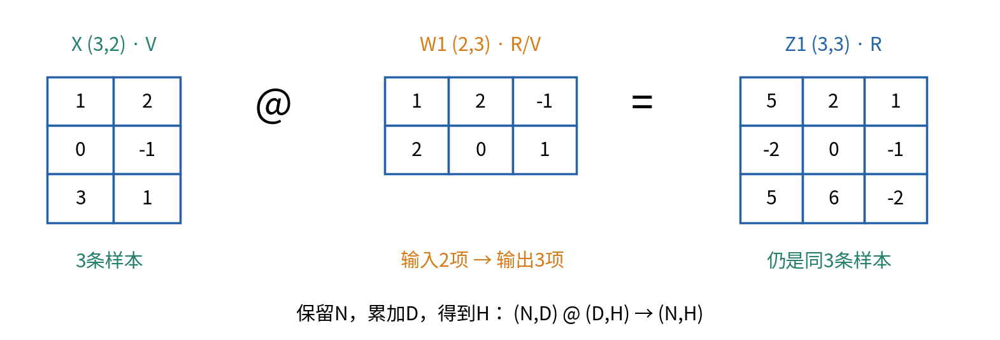
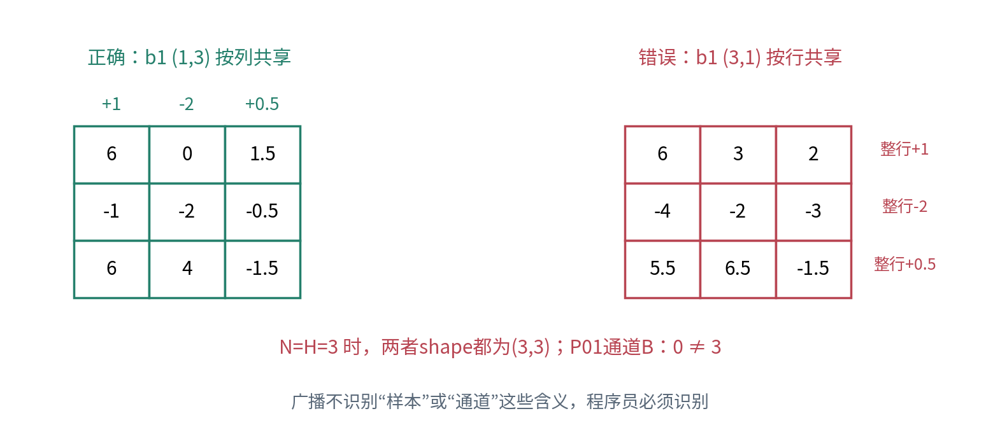

# 实验009：两层绘图台的形状与数值审计

## 任务与完成证据

本实验可独立按本指南完成，先修是Python函数、NumPy形状与广播、内积。目标是用纸笔、循环、NumPy和独立分数算术核验同一个两层仿射系统，并找出“能运行却算错含义”的例子。建议留出90到120分钟；先手算，再执行，最后对照详解。

固定行样本约定：X为(N,D)，W为(D,H)，b为(H,)或(1,H)，输出为(N,H)。数学下标从1开始，代码从0开始；单条样本也用(1,D)。请不要因为一个错误表达式报错，就盲目添加`.T`或`reshape`。

本实验的所有输入和参数是合成教学数，不需要API、网络、GPU或外部数据。没有模型训练，不要报告“测试准确率”或把矩阵结果解读成设备精度。需要提交的证据包括：手算表、输出文件、错误定位、测试日志和一段有边界的结论。

## 一 准备与首次复跑

完整文件夹需包含`experiment.py`、`test_experiment.py`、`experiment.ipynb`与`data/plotter.json`。在终端进入本单元目录。若已有兼容环境，先检查版本；也可以用随附的`environment.yml`创建独立环境。

```bash
conda env create -f environment.yml
conda activate dl-unit-009
python experiment.py --output outputs
python test_experiment.py
jupyter lab experiment.ipynb
```

第一次创建环境需要联网下载包，此后实验读取本地数据即可运行。使用Notebook时重启内核，清除输出，再从上到下运行全部单元格。不要只运行最后一格，或依赖先前手动定义的数组。发布版Notebook保留了一次真实执行输出，自己复跑时应生成新证据。

脚本输出坐标、合成参数、环境记录到`outputs/`。测试应返回7组检查通过、64组有理数shape测试通过。遇到错误先记录异常，不要删除断言；已验证环境与制作限制见README。

## 二 数据与单位，不查正文也能开始

每条输入是两个旋钮的电压，单位V；第一层得到三个内部响应，使用自定义单位R；第二层得到水平、竖直两个坐标，单位mm。样本顺序为P01、P02、P03。参数固定给定：

$$X=\begin{bmatrix}1&2\\0&-1\\3&1\end{bmatrix},\qquad
W_1=\begin{bmatrix}1&2&-1\\2&0&1\end{bmatrix},\qquad
b_1=\begin{bmatrix}1&-2&1/2\end{bmatrix}.$$

$$W_2=\begin{bmatrix}1&0\\1/2&2\\-2&1\end{bmatrix},\qquad
b_2=\begin{bmatrix}-1&3\end{bmatrix}.$$

W1单位R/V，b1单位R，W2单位mm/R，b2单位mm。定义Z1=XW1，U=Z1+b1，Y=UW2+b2；每个偏置共享到所有样本。数学上的严格批次式是XW+全1列向量乘偏置行。代码广播省去显式复制。



### 任务A：先完成一张计算账本

不运行Notebook前，记录X、W1、b1、Z1、U、W2、b2、UW2、Y的shape和单位；为每个矩阵给出第一行的每一项展开式。然后算出另外两条样本的结果。至少在P02保留负号和分数，不要只给最终小数。

检查点：P01的第一层无偏置响应为(5,2,1)R；如果不是，先对照W1的列。P02最终水平坐标应为-2mm。详解给出完整矩阵，但请先保留自己最初的计算及修正记录。

### 任务B：用三层循环独立计算矩阵乘法

从本地加载数据，在新的`Z_loop`数组中按样本n、输出k、输入j三层循环累加乘积。不要在循环实现里调用`@`或`np.dot`。然后先断言shape一致，再用`np.testing.assert_allclose`比较`Z_loop`与`X @ W1`，容差设为`rtol=1e-12, atol=1e-12`。

写下一个循环变量的含义：为什么j最终消失而n没有消失？将X样本顺序改为P03、P01、P02后检查输出是否只发生同行重排。对单样本必须用`X[0:1]`，再检查批次轴有没有保留。

### 任务C：合并两层，保留第一层偏置的去向

分别计算逐层路径Y和合成路径。纸上先写Wc的每个元素，bc的两个元素；再执行：

```python
Wc, bc = compose_affine(W1, b1, W2, b2)
Y_fused = affine(X, Wc, bc)
assert Y_fused.shape == Y.shape
np.testing.assert_allclose(Y_fused, Y,
                           rtol=1e-12, atol=1e-12)
```

验证无偏置的结合律`(X @ W1) @ W2`与`X @ (W1 @ W2)`。再解释为什么`W2 @ W1`并不是交换括号，以及为什么不能直接加b1与b2。检查点：Wc应为(2,2)，bc的第二项应为-0.5mm；若是3或-3.5，检查你是否漏掉某层偏置。

### 任务D：基向量与转置，形状之外还有位置含义

创建2×2单位矩阵`np.eye(2)`，每一行是一条标准基输入。比较`np.eye(2) @ W1`与W1。用P03=(3,1)验证“3倍第一行加1倍第二行”，再将单样本转成列，验证`(x @ W1).T == W1.T @ x.T`。

另取S=diag(2,1)，输入x=(1,1)。比较先乘S再乘S.T的结果与原x；手写哪个对角变换可以撤销S。记录`np.array([1,2]).T.shape`。不要调用一般求逆程序，本任务只需识别转置与撤销的区别。

### 任务E：制造一个shape正确的错误

执行`wrong = X @ W1 + b1[:, None]`。在本例N=H=3时它不报错；比较它与U，记录第一行B、第二行A各差多少。再调用严格函数`affine(X,W1,b1[:,None])`，应得到ValueError。说明“NumPy允许”和“任务接口允许”为什么不同。

再将样本改为前两条，重做原始错误广播。预期它无法把(2,3)与(3,1)广播到一起。请捕获并显示异常类型，不让这个教学失败终止后面的正确实验。



### 任务F：广播视图与显式复制

比较`np.broadcast_to(b1,(3,3))`和`np.tile(b1,(3,1))`的数值、shape、`np.shares_memory`、`flags.writeable`及`nbytes`。实验函数`broadcast_evidence`会汇总这些量。

不要写入广播视图。解释为什么其逻辑元素数为9而原始偏置只有3个数，以及为什么加法输出仍需要存储。区分数学“每行相同”和实现“真的复制N份”；不要从一项`nbytes`直接推断峰值内存，也不要宣称进行了性能基准测试。

### 任务G：顺序与受控参数改动

取无量纲S=[[2,0],[0,1]]、T=[[1,1],[0,1]]，用x=[[1,1]]分别计算`x @ S @ T`与`x @ T @ S`。手写中间坐标，解释为什么同shape也不意味着可交换。

另从原W1复制出`W_changed`，仅将`W_changed[0,1]`增加0.25R/V。记录三条样本通道B的变化；再只将b1第二项增加0.25R并记录变化。必须用`.copy()`避免改坏后续实验使用的原参数。

### 任务H：独立分数检查和边界输入

运行`test_experiment.py`，找到`exact_product`与`exact_affine`，指出哪些运算与主实现独立。它们使用Fraction及显式循环，主实现使用float64与`@`。64组测试覆盖N=1、2、3、7，四组不同的D/H/K与分母1、3、5、7。

逐项说明以下输入应如何处理：一维样本、错误W转置、长度错误偏置、标量偏置、样本专属(N,H)偏置、空批次、NaN、无穷、复数、字符串、溢出。实验接口明确拒绝这些输入。捕获异常应针对预期异常类型，不能用不区分原因的空`except`掩盖问题。

### 任务I：新指令与结论

先手算x=(2,-1)V的两层输出，再用程序和合成参数核对。再取P01、P02输入中点，检查它的输出是否等于两输出中点。最后写120到200字结论，至少说明：一个正确数值、一个形状契约、一个静默错误、一个本实验不能证明的结论。

## 三 提交与排错

提交计算账本、已从头执行的Notebook、`report.json`、`positions_mm.csv`、环境版本、测试输出及任务E/G/I说明。不要提交环境目录或缓存；数据文件应保持原始版本。自己改变数据时，应另存文件并说明改动，不覆盖原始证据。

- 导入失败：检查当前目录、活动Python与包版本，确认`experiment.py`和Notebook在同一目录。
- 乘法报错：先读两操作数shape，再读轴含义；不要先试转置。
- 合层只有部分点正确：查看bc是否为b1W2+b2，是否把单个样本误当偏置。
- 数值看似相同但shape不同：检查是否丢掉N=1的批次轴。
- 浮点极小差异：先比较shape、单位、独立答案，再按给定容差判断；不要把很大误差也放宽到通过。

合格标准是计算、解释与证据互相一致。7组测试通过是一份可复跑证据，不能替代你对行约定、偏置和映射顺序的解释。所有任务参考答案见`answers.pdf`，它也包含正文12题详解。
