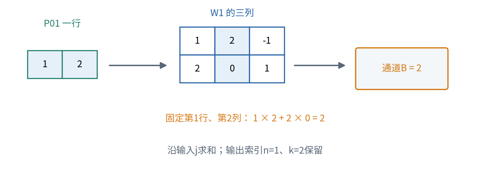
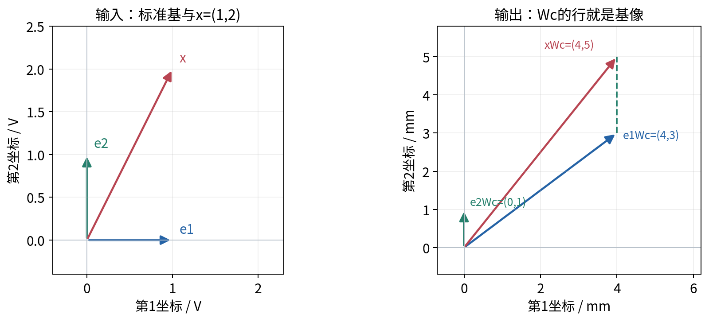
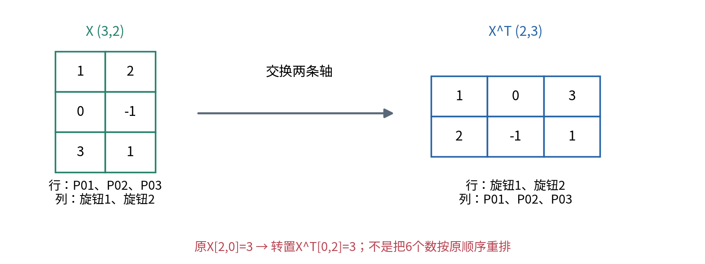
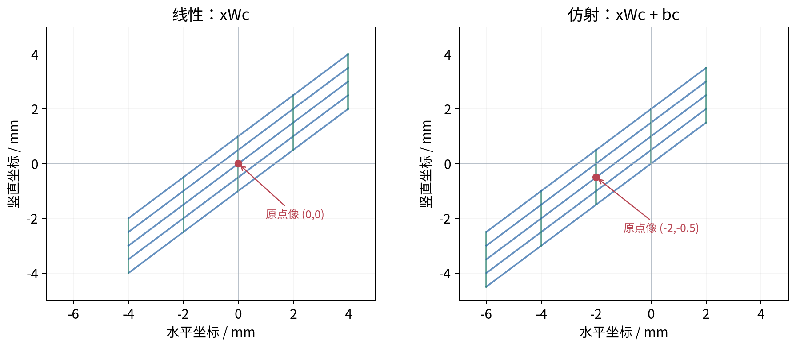
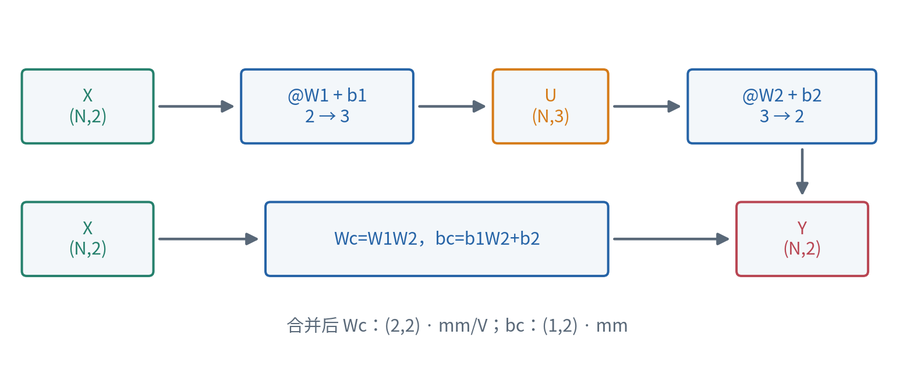
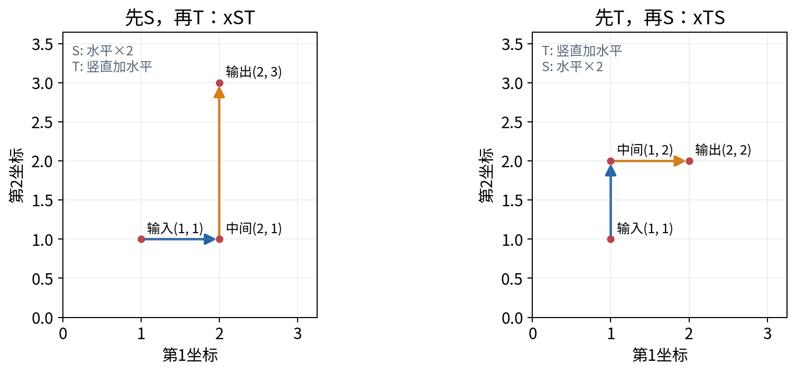
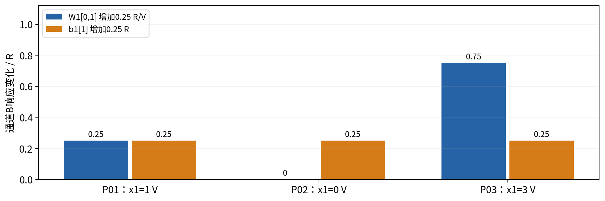

# 矩阵线性映射与仿射变换

## 第009单元 一批旋钮指令怎样变成一批坐标

一个全连接层怎样同时变换许多样本？本讲把这个问题放进一台合成绘图台：输入是两个旋钮的电压，经过三个内部响应通道，输出笔尖的水平、竖直坐标。我们先为一条指令计算，再把同样规则用于整批指令，最后检查两层是否能合成一层。

先修008与004。008已经定义内积与标准基向量；004已经会读取shape、区分逐元素运算和矩阵乘法，并能追踪广播。本讲从这些操作继续，解释矩阵为什么表示一个映射。只用实数运算、有限求和与代数，不预设微积分、矩阵求逆、秩或分解知识。

读完后，你应能按位置计算矩阵乘积；解释同一输出的“列内积”和整条输出的“行线性组合”；在行向量约定下定位基向量的像；判断一个映射是否线性；保留偏置地组合两层；同时检查shape、单位和样本身份。会按一个按钮得到答案，不等于已经做到这些事。

## 一 先把约定写在纸上

本讲固定采用批次优先、样本为行的约定。数学中的一条输入x写成1行D列；一批N条输入叠成N行D列。D是输入特征个数，H是输出通道个数，N是样本个数，均为正整数。参数矩阵W的行对应输入特征，列对应输出通道。

$$X\in\mathbb R^{N\times D},\quad W\in\mathbb R^{D\times H},\quad Z=XW\in\mathbb R^{N\times H}.$$

这里实数集合符号表示每个元素都取实数，乘号只在shape中表示“行数乘列数”。矩阵是有行列位置的数表，不是只看元素总数的一袋数字。数学记号省略运算符写XW；NumPy代码写`X @ W`。

| 对象 | 本讲形状 | 每条轴的意义 |
|---|---|---|
| 单样本x | (1,D) | 一条样本、D个输入特征 |
| 批次X | (N,D) | N条样本、D个输入特征 |
| 参数W | (D,H) | 输入特征、输出通道 |
| 输出Z或Y | (N,H) | 原来的N条样本、H个输出通道 |
| 共享偏置b | (H,)或(1,H) | 每个输出通道一个数 |

008的单向量使用NumPy形状(D,)，它只有一条轴，不自带行列方向。此处为了逐步教学和严格接口，单条样本也保留批次轴：用`X[0:1, :]`得到(1,D)。`X[0, :]`得到(D,)，NumPy本身允许它参与某些`@`，但本讲的批次函数会拒绝它。接口约定比软件允许的全部行为更窄，是为了减少歧义。[1]

数学下标从1计数，代码索引从0计数。例如数学的W第1行第2列写作W₁₂，代码是`W[0, 1]`。下标是位置，单位是含义；两者要一起记。后文不会为使程序“刚好能算”而临时改成列样本。


## 二 把绘图台变成清楚的数据

我们人为给定三条输入，电压单位V；内部响应使用自定义单位R；最后两个坐标单位mm。三条输入是P01=(1,2)、P02=(0,-1)、P03=(3,1)。负电压与负坐标是本模拟器允许的数，不代表某台真实设备的工作范围。

$$X=\begin{bmatrix}1&2\\0&-1\\3&1\end{bmatrix},\quad
W_1=\begin{bmatrix}1&2&-1\\2&0&1\end{bmatrix},\quad
b_1=\begin{bmatrix}1&-2&1/2\end{bmatrix}.$$

X为(3,2)，W₁为(2,3)，b₁在数学式中作为(1,3)行。W₁每个数的单位是R/V，b₁单位R。因此电压乘系数得到响应，响应之间才能相加。三个内部通道叫A、B、C，只是固定计算出的三个数，还不是概率、类别或学习到的“语义”。

第二层参数为：

$$W_2=\begin{bmatrix}1&0\\1/2&2\\-2&1\end{bmatrix},\quad
b_2=\begin{bmatrix}-1&3\end{bmatrix}.$$

W₂为(3,2)，单位mm/R；b₂为(1,2)，单位mm。规则是先算U=XW₁+b₁，再算Y=UW₂+b₂。U的两条轴分别是样本和内部通道；Y两列依次是水平坐标和竖直坐标。这里的加偏置约定是每一行加同一个行向量，第八节会把这一简写展开。

所有数都在配套`data/plotter.json`中。数据为原创合成例子，参数固定给定。没有训练、损失函数或现实性能评估；本讲要验证计算含义，不把三个点的结果当成真实设备精度。

## 三 从一个内积推出矩阵乘法

先不加偏置，取P01的x=(1,2)。内部通道A收到旋钮1的1倍、旋钮2的2倍响应，所以是1×1+2×2=5。通道B的系数是2和0，得到1×2+2×0=2。通道C的系数是-1和1，得到1×(-1)+2×1=1。

这三个内积分别使用W₁的三列，而不是三行。一个输出通道需要所有输入特征的系数，所以参数的每一列必须有D个数。单个元素的定义是：

$$z_{nk}=\sum_{j=1}^{D}x_{nj}w_{jk}.$$

n固定一条样本，k固定一个输出通道；j逐个遍历输入特征。求和后不再保留j轴，但n与k仍留下。每个乘积的单位均为输出单位，才可以累加。若输入特征有不同单位，W同一列的不同行需要各自补偿相应输入单位，不能机械地让所有系数具有同一种单位。



矩阵乘法要求左矩阵的列数等于右矩阵的行数。对一般A为(m,p)、B为(p,q)，乘积为(m,q)。相同的p是求和轴；m与q是输出索引。只有“中间数字相同”还不够，那两条轴在任务上也必须都表示相同输入空间。

例如X为(3,2)，W₁为(2,3)，所以XW₁为(3,3)。这次恰巧是方形输出，不说明样本与通道可以互换。`X * W1`不表示这三个内积；它是逐元素乘法，这里的shape还会直接不兼容。对同shape方阵，`*`虽然能运行，计算含义仍不同。

## 四 三条样本逐行算，批次没有魔法

P01的结果已经是(5,2,1)。P02=(0,-1)得到(0×1-1×2, 0×2-1×0, 0×(-1)-1×1)=(-2,0,-1)。P03=(3,1)得到(3+2,6+0,-3+1)=(5,6,-2)。因此：

$$Z_1=XW_1=\begin{bmatrix}5&2&1\\-2&0&-1\\5&6&-2\end{bmatrix}.$$

每一行仍属于原来那条指令。把P03提前，输出中P03那一行也提前；其他行的数不会因此改变。本讲的全连接计算在特征之间混合信息，不在样本之间混合信息。后面的某些模型操作可能依赖其他样本或位置，但不能擅自把这种含义放进当前公式。

一个直接核对程序是三层循环。外层遍历样本n，中层遍历输出k，内层遍历输入j；每个输出先从0开始，累加`X[n,j] * W[j,k]`。这与公式逐项对应。NumPy`@`能更集中地表达同一计算；是否更快取决于规模与环境，本讲不做速度结论。[1]

```python
Z = np.zeros((X.shape[0], W1.shape[1]))
for n in range(X.shape[0]):
    for k in range(W1.shape[1]):
        for j in range(X.shape[1]):
            Z[n, k] += X[n, j] * W1[j, k]
np.testing.assert_allclose(Z, X @ W1)
```

检查结果时先检查shape，再比较元素。相同的数字若排在不同样本或不同输出位置，就不是同一个答案。小例子的三层循环也不能代替通用证明，但适合当独立检查器，尤其当主实现使用一次`@`时。

## 五 同一计算的另一面：行的线性组合

线性组合指把若干同维向量各乘一个实数，再相加。比如把a乘2、b乘-1后相加，就得到2a-b；系数可以为负，不要求加起来是1。这里相加向量必须位于同一个输出坐标空间。

记W第j行为rⱼ，它是H维行向量。将xW按输出分量展开，可以把求和项重新按输入j分组，得到：

$$xW=x_1r_1+x_2r_2+\cdots+x_Dr_D.$$

在P01中，W₁两行是(1,2,-1)和(2,0,1)。因此xW₁=1×(1,2,-1)+2×(2,0,1)=(5,2,1)。上一节按列得到各个输出数，这一节按行得到整个输出向量。两种解释相容，因为它们展开后逐元素相同。

现在引入标准基行向量eⱼ：第j个位置为1，其余位置为0。任意x可写成所有xⱼeⱼ之和。把eⱼ代入xW，上式只留下rⱼ。所以本讲约定下，eⱼ映到W的第j行。不是第j列。



图3先展示最终线性部分Wc的二维几何，Wc的数将在第十一节推出。输入e₁=(1,0)表示旋钮1增加1V，线性部分输出(4,3)mm；e₂=(0,1)输出(0,1)mm。因此输入(1,2)的线性输出为(4,5)mm。这里图上的“1”带有约定的坐标单位，不能把1V和1mm混为同一个物理长度。

一些教材把单样本写成列向量，映射写作Ax。在那个约定中，基向量的像确实在A的列里。两种说法的差别来自乘法左右位置与转置，不能同时套在同一个W上。第七节会给出准确转换关系。

## 六 什么才叫线性映射

一个映射是从输入向量得到输出向量的规则。线性映射L要求对任意同维输入u、v和任意实数α、β，有L(αu+βv)=αL(u)+βL(v)。这同时要求相加与缩放可以穿过映射，不能只在某几个测试点碰巧成立。[4]

对L(x)=xW，逐项展开即可证明：

$$L(\alpha u+\beta v)=(\alpha u+\beta v)W
=\alpha(uW)+\beta(vW).$$

等式来自实数乘法对加法的分配律和有限求和的分组，不需要先相信矩阵有“神奇性质”。输入坐标可以表示不同物理单位，但α、β是无量纲数；对应坐标相加时单位仍必须一致。

将输入设为全零，各乘积都为0，得到L(0)=0。这是线性的必要条件：若某规则把原点送到非零位置，它一定不线性。但反过来不成立。例如g(x₁,x₂)=(x₁²,x₂)把原点送回原点，却有g(2,0)=(4,0)，不等于2g(1,0)=(2,0)。

线性也不等于“不改变形状”。它可能放大、压缩、反向、混合坐标，甚至把不同输入映到同一输出。比如(x₁,x₂)映到(x₁,0)，会丢掉第二个输入分量；不能从输出恢复它。无需先学更高级矩阵理论，就能从两条不同输入得到同一输出来识别这种信息丢失。

在二维中，可以用方格和基箭头检查效果；在输入2维、输出3维时，不必强行把两端画在同一个平面。代数中的每个坐标仍有定义，维数改变也不妨碍讨论线性。

## 七 转置只交换位置，不替你撤销映射

矩阵转置记作Wᵀ，把原第j行第k列的元素放到新第k行第j列。W为(D,H)时，Wᵀ为(H,D)。W₁的转置为：

$$W_1^{\mathsf T}=\begin{bmatrix}1&2\\2&0\\-1&1\end{bmatrix}.$$

数值未改变，只是行列身份对调。NumPy二维数组的`W1.T`完成这种轴交换；一维数组`x.shape==(D,)`的`x.T`仍是(D,)，不会自动出现列轴。要把一维数表写成一行用`x[None, :]`，写成一列用`x[:, None]`，之后仍要明确它参与哪一种约定。[2]

为什么整个乘积转置会反转书写顺序？左侧(XW)ᵀ的第k行第n列，就是原乘积第n行第k列，即Σⱼxₙⱼwⱼₖ。右侧WᵀXᵀ同位置是Σⱼwⱼₖxₙⱼ。实数乘法交换后两者相同：

$$(XW)^{\mathsf T}=W^{\mathsf T}X^{\mathsf T}.$$

左侧shape是(H,N)，右侧是(H,D)乘(D,N)，也为(H,N)。这里交换顺序伴随两个矩阵都转置；它绝不推出XW=WX。若将行样本x转为列样本xᵀ，则yᵀ=Wᵀxᵀ。列约定教材的A正好对应本讲Wᵀ，不能只搬符号不搬轴意义。



“逆”若存在，含义是另一个映射能撤销原映射。本讲不学习一般求逆算法，但可用反例区分它与转置：S把第一个坐标乘2、第二个保持，即S=diag(2,1)。Sᵀ仍是S；x=(1,1)先乘S再乘Sᵀ得到(4,1)，没有回到(1,1)。真正撤销它可把第一坐标乘1/2，即diag(1/2,1)。

形状能对上也不能保证含义对。例如XᵀX可以算，结果为(2,2)，第一个元素是三条样本第一特征的平方和10。它聚合了样本，是特征之间的汇总；不是三条样本的新坐标。随意转置“修好报错”，可能刚好把任务换掉。

## 八 偏置把线性变成仿射

偏置是与输入数值无关的固定输出偏移。对一条输入，f(x)=xW+b称为仿射映射。它先做线性变换，再平移输出。b为零时也属于仿射映射，同时还是线性映射；b非零时，f(0)=b，因此不满足线性的必要条件。

对批次，要更严格地写出全1列向量1ₙ，其shape为(N,1)。b为(1,H)，则1ₙb是(N,H)，每一行都等于b：

$$Y=XW+\mathbf 1_N b.$$

这是一条数学等式，不是在要求代码真的创建N份偏置。NumPy通常写`Y = X @ W + b`，其中b为(H,)或(1,H)，用广播把同一输出通道的偏置加给所有样本。[3]

绘图台第一层的b₁=(1,-2,0.5)R，逐行加到Z₁，得到：

$$U=\begin{bmatrix}6&0&3/2\\-1&-2&-1/2\\6&4&-3/2\end{bmatrix}.$$

例如P01通道A从5变6，通道B从2变0，通道C从1变1.5。P02也按A加1、B减2、C加0.5。共享的含义是按输出通道共享，不是每条样本随意给一个偏移。



非零偏置一般破坏缩放关系：f(2x)=2xW+b，而2f(x)=2xW+2b，两者相差一个b。它也一般不满足加法保持，因为f(u)+f(v)比f(u+v)多一个b。

但两条输出之差会消掉相同偏置：f(u)-f(v)=(u-v)W。因此偏置改变绝对坐标，不改变在同一个W下两输出之间的差向量。不能再扩大成“仿射一定保持距离”：W本身可能拉伸坐标，只有共同平移这一步保持两点的欧氏距离。

## 九 广播是共享规则，复制是存储动作

广播比较从右侧开始的维度：相等或有一边为1才可兼容。Z₁为(3,3)，b₁为(3,)，补齐为(1,3)，最后的3对应三个内部通道；前面的1在样本轴上共享。将偏置显式写成(1,3)也得到同一个正确结果。[3]

一个危险错误是写`Z1 + b1[:, None]`，把偏置变为(3,1)。因为本例N恰好等于H=3，程序仍能运行，也仍输出(3,3)，但它让P01整行加1、P02整行减2、P03整行加0.5。输出为：

$$U_{\rm wrong}=\begin{bmatrix}6&3&2\\-4&-2&-3\\5.5&6.5&-1.5\end{bmatrix}.$$

第一行B本应为0却变成3；第二行A本应为-1却变成-4。shape检查是必要的，却不是充分的。要检查偏置轴代表通道还是样本，还要保留至少一项独立手算。测试另使用N=1、2、7与不同通道数，减少维数巧合隐藏错误的机会。


`np.broadcast_to(b1,(3,3))`可得到逻辑上有9个元素的只读视图，与原b₁共享存储；`np.tile(b1,(3,1))`则显式生成复制数据。两者数值相同，不代表内存行为相同。本环境中的float64偏置实际有3×8=24字节，复制后的9项为72字节。广播视图的`nbytes`也显示72，因为它计的是逻辑元素字节数，不能据此说新分配了72字节。[5][6]

普通`Z1 + b1`仍然需要存放输出数组，广播并不使整个计算“零内存”。也不要尝试修改广播视图来给不同样本设置不同偏置；若任务真需要逐样本偏移，应另行定义输入和接口，而非伪装成共享b。

## 十 第二层逐项手算

第一层U为(3,3)，W₂为(3,2)，相乘后为(3,2)，再加两项b₂。对P01，U的行是(6,0,1.5)R。水平坐标是6×1+0×0.5+1.5×(-2)-1=2mm；竖直坐标是6×0+0×2+1.5×1+3=4.5mm。

对P02，U的行是(-1,-2,-0.5)。水平为-1-1+1-1=-2mm；竖直为0-4-0.5+3=-1.5mm。对P03，U的行是(6,4,-1.5)。水平为6+2+3-1=10mm；竖直为0+8-1.5+3=9.5mm。

$$UW_2=\begin{bmatrix}3&1.5\\-1&-4.5\\11&6.5\end{bmatrix},\qquad
Y=\begin{bmatrix}2&4.5\\-2&-1.5\\10&9.5\end{bmatrix}.$$

| 步骤 | shape | 单位 | 第一行 |
|---|---|---|---|
| X | (3,2) | V | (1,2) |
| Z₁=XW₁ | (3,3) | R | (5,2,1) |
| U=Z₁+b₁ | (3,3) | R | (6,0,1.5) |
| UW₂ | (3,2) | mm | (3,1.5) |
| Y=UW₂+b₂ | (3,2) | mm | (2,4.5) |

所谓全连接，是这里每一个输出通道都有一个与所有输入特征相连的系数位置，并不要求每个系数数值都非零。W₁中的0仍占据一个明确位置。计算图中画了连接，只表示允许参与计算，不自动表示学到了重要关系。

本任务参数个数为2×3+3+3×2+2=17个标量，与N无关。把批次从3条换成30条，不应增加新的W或b。输出数的个数随N改变，参数个数不变，这是批次计算中“同一规则作用许多样本”的具体含义。

## 十一 结合律允许合层，但不能丢偏置

先看没有偏置的两层。对X为(N,D)、W₁为(D,H)、W₂为(H,K)，两种括号都合法：(XW₁)W₂为(N,K)，X(W₁W₂)也为(N,K)。K是最终输出个数，不能把它与样本数混淆。

为什么它们数值相同？固定输出第n行第k列，左侧展开为先对H个通道求和，再代入每个通道对D个输入的求和。把有限求和重新分组得到：

$$\sum_{h=1}^{H}\left(\sum_{j=1}^{D}x_{nj}w^{(1)}_{jh}\right)w^{(2)}_{hk}
=\sum_{j=1}^{D}x_{nj}\left(\sum_{h=1}^{H}w^{(1)}_{jh}w^{(2)}_{hk}\right).$$

右边就是X(W₁W₂)的同一元素。这是矩阵乘法结合律，来源是分配律、实数乘法结合律和有限求和重排。中间次序X、W₁、W₂没有被交换。实数精确算术中相等，浮点执行时两种累加顺序可能有小舍入差；本讲用明确容差比较，不要求所有随机例子逐位一致。

把偏置完整展开，b₁必须先经过第二层的线性部分：

$$(XW_1+\mathbf1_Nb_1)W_2+\mathbf1_Nb_2
=X(W_1W_2)+\mathbf1_N(b_1W_2+b_2).$$

所以合成参数是Wc=W₁W₂，bc=b₁W₂+b₂。不能把bc写成b₁+b₂：本例两者形状分别(1,3)与(1,2)，连直接相加都无意义。即使两个宽度碰巧一样，漏掉W₂仍然错，除非具体参数存在特殊巧合。

逐项计算Wc：第一行为(1+1+2, 0+4-1)=(4,3)，第二行为(2+0-2, 0+0+1)=(0,1)。再算b₁W₂=(1-1-1, 0-4+0.5)=(-1,-3.5)，加b₂=(-1,3)得到bc=(-2,-0.5)。

$$W_c=\begin{bmatrix}4&3\\0&1\end{bmatrix},\qquad
b_c=\begin{bmatrix}-2&-1/2\end{bmatrix}.$$

Wc单位为(R/V)×(mm/R)=mm/V；bc单位mm。它们给出y水平=4x₁-2，y竖直=3x₁+x₂-0.5。对三条输入分别代入，重获(2,4.5)、(-2,-1.5)、(10,9.5)。单位检查还说明不能把电压偏移随便加到最终毫米输出上。



只要中间没有额外非线性操作，一串仿射层仍能按这种方式合为仿射层。更多层数本身并没有自动增加这类映射所能表达的函数集合。如果中间把负数截成0等，以上代数替换一般不再成立；后续再研究那类函数。本讲不训练网络，也不由此断言深层模型全部等价于浅层模型。

## 十二 能换括号，不等于能换顺序

先做一个shape判断：W₁W₂为(2,2)，W₂W₁为(3,3)。两者都能算，但属于不同输入输出空间，连“两个结果是否相等”都不能不看形状地问。一般的非方阵交换后可能根本不能相乘。

为了排除“只因为shape不同”的借口，再取两个2×2矩阵，作为独立的无量纲坐标反例：S先把水平坐标乘2，T把水平分量加到竖直分量。行约定下：

$$S=\begin{bmatrix}2&0\\0&1\end{bmatrix},\quad
T=\begin{bmatrix}1&1\\0&1\end{bmatrix},\quad
ST=\begin{bmatrix}2&2\\0&1\end{bmatrix},\quad
TS=\begin{bmatrix}2&1\\0&1\end{bmatrix}.$$

对x=(1,1)，先S再T：先得到(2,1)，再把2加到竖直坐标，结果(2,3)。先T再S：先得到(1,2)，再把水平翻倍，结果(2,2)。ST与TS有相同shape但不同值。只需一个反例，就足以反驳“所有矩阵都能交换”；这不表示不存在偶然可交换的特例。



参数矩阵存储布局与数学顺序也要分开：本讲W为(输入,输出)，别的库可能存成(输出,输入)，再在内部转置。对照接口文档后改写才可靠，不能因为变量都叫weight就认定轴相同。

## 十三 参数究竟改变什么

固定某个Wⱼₖ，只增加δ，其他参数保持不变。每条样本的第k个输出增加xₙⱼδ，其他输出通道不变。这直接从单项求和看出，不需要导数。例如W₁第1行第2列从2改成2.25，三条样本通道B的变化分别是0.25、0、0.75R。

将b₁第二项增加0.25R则不同：每条样本通道B都增加0.25R，无论第一特征是1、0还是3。权重改变的效果依赖输入对应特征；偏置改变的效果对所有样本一样。负输入还可能让正权重增量带来负的输出变化。



再看合成后的Wc：水平输出只由x₁决定，是因为两层路径中x₂的贡献2与-2恰好抵消，不是因为原始计算图根本没有第二特征。对P01将x₂从2改为3，水平仍是2mm，竖直从4.5升为5.5mm。查看一个层的单个系数，未必能完整描述多层组合效果。

如果只改变偏置，任意两条输出的差保持不变；如果改变W，输出差一般也变。若要比较哪个参数“更重要”，必须先定义输入范围、单位和比较标准，本讲只计算受控小改动的精确结果，不把系数绝对值直接当作普遍重要性。

## 十四 仿射映射保留哪些关系

考虑两点u、v之间按比例取点x=(1-t)u+tv，其中t在0到1时表示连线上的点，t=1/2是中点。把它送入f(x)=xW+b，有：

$$f((1-t)u+tv)=(1-t)f(u)+tf(v).$$

原因是两侧线性部分相同，右侧偏置的总系数为(1-t)+t=1。这解释了仿射为什么保持中点和同一条直线上的比例；如果整条输入直线的方向被W映为零，它也可能缩成一点。不能把“直线变直线”说得忽略这一退化情况。

对本例P01与P02，输入中点为(0.5,0.5)V，合成公式得到(0,1.5)mm。两输出的中点同样为((2-2)/2,(4.5-1.5)/2)=(0,1.5)mm。这个等式验证了一个例子；上一段的展开才说明任意t都成立。

但角度、长度、面积一般不会保持。例如e₁与e₂输入箭头垂直，Wc把它们映为(4,3)与(0,1)，内积为3，不再垂直。共同加bc后，如果仍从原点画位置箭头，它们的夹角还可能再次改变。要讨论方向关系，应先明确用的是位置向量还是两点之差。

这也连接008：几何结论依赖使用的坐标、内积与单位。一个矩阵产生合理shape，只证明计算形式可行；它是否适合特定物理任务，仍需任务证据。

## 十五 让代码的契约与纸笔一致

配套`linear(X,W)`只接收非空二维实数数组；`affine(X,W,b)`只接受(H,)或(1,H)共享偏置，拒绝接口外形状，例如本例的(3,1)与(3,3)。即使某个输入能够被NumPy广播，也不代表它符合本讲函数的含义。

```python
Z1 = linear(X, W1)          # (N,D) @ (D,H) -> (N,H)
U = affine(X, W1, b1)       # (N,H), unit R
Y = affine(U, W2, b2)       # (N,K), unit mm
Wc, bc = compose_affine(W1, b1, W2, b2)
Y_collapsed = affine(X, Wc, bc)
assert Y.shape == Y_collapsed.shape
np.testing.assert_allclose(Y, Y_collapsed,
                           rtol=1e-12, atol=1e-12)
```

NaN、无穷、复数、字符串与空特征轴会被拒绝；本例不需要它们，也不默默把它们转成一个好像合理的输出。计算溢出也报错。严格接口并不是说这些类型在所有数学问题里无意义，而是说当前实验只承诺处理有限实数和明确非空维度。

测试包含三类证据：固定手算答案；用Python的Fraction与独立三层循环做精确有理数计算；用代数不变量检查基向量、行重排、输出差、两层合成。64组不同shape和分母的测试都能通过，说明这些已测例子一致，不能声称覆盖所有浮点规模或证明程序绝无错误。

Notebook按顺序展示输入、循环、两层、组合、失败案例、广播和测试，脚本则可在新进程重复输出JSON与CSV。环境与验证说明放在README里。这里的`__name__`和`__main__`是Python原有标识符，拼写需原样保留，不能改成排版中的下标。

## 十六 练习与离开本讲前的检查

1. 对N=4、D=2、H=5写出X、W、b、Y的shape。说明为什么N变化不改变参数个数，并算出一层参数总数。
2. 不调用NumPy，逐项算出本例Z₁；圈出P02通道C使用的两个乘积，并解释求和轴是谁。
3. 用W₁两行的线性组合重算P03。写出e₁W₁、e₂W₁，说明为什么列约定教材会出现“基像是列”。
4. 根据定义证明L(x)=xW线性；用g(x₁,x₂)=(x₁²,x₂)反驳“原点不动就线性”。
5. 写出W₁ᵀ，给出(XW₁)ᵀ的shape及另一种写法；说明一维数组转置与撤销映射为何都不是这件事。
6. 完整算出U、UW₂、Y，记录各自shape和单位。写出两层总参数数目。
7. 逐项推出Wc、bc；验证P02输出。指出直接相加两个偏置在形状、单位、运算路径上各有什么问题。
8. 用S、T核算ST、TS和x=(1,1)的两个结果。为什么结合律不会被这个反例推翻？
9. 写出错误`Z1 + b1[:,None]`的第一行。解释shape检查为什么不够，广播视图的nbytes又为什么不等于新分配量。
10. 将W₁第1行第2列增加0.25，再将b₁第二项单独增加0.25，分别列出三条样本通道B的变化。
11. 验证P01与P02的中点关系，并举一个本讲仿射映射不保持角度的明确坐标反例。
12. 新指令x=(2,-1)V经过本例两层会得到什么？先逐层算，再用Wc、bc算；列出一种可被shape检查发现的错误和一种不能只靠shape发现的错误。

独立实验指南给出可离线执行的完整步骤与检查点。做完后再对照详解。自检标准不是“所有命令都没有红字”，而是你能指出每个输出格属于哪条样本、哪个通道、哪些乘积以及哪一种单位。

<div style="break-before:page"></div>

## 参考资料与使用范围

[1] NumPy 2.3官方文档，[matmul](https://numpy.org/doc/2.3/reference/generated/numpy.matmul.html)，核对二维乘法、形状契约与一维输入规则。

[2] NumPy 2.3官方文档，[transpose](https://numpy.org/doc/2.3/reference/generated/numpy.transpose.html)，核对轴置换及一维转置不增加轴。

[3] NumPy 2.3官方文档，[Broadcasting](https://numpy.org/doc/2.3/user/basics.broadcasting.html)，核对从末轴对齐规则与逻辑扩展。

[4] Georgia Tech，Margalit与Rabinoff作者教材，[Interactive Linear Algebra: Linear Transformations](https://textbooks.math.gatech.edu/ila/linear-transformations.html)，核对线性映射定义。该教材采用列向量表述，本讲已明确换为行样本约定。

[5] NumPy 2.3官方文档，[broadcast_to](https://numpy.org/doc/2.3/reference/generated/numpy.broadcast_to.html)。[6] [ndarray.nbytes](https://numpy.org/doc/2.3/reference/generated/numpy.ndarray.nbytes.html)。来源核验记录见`source_checks.md`。绘图台数值、手算、图示、实验与教学组织为独立创作；所有性能和几何结论均限定在文中给定假设内。
