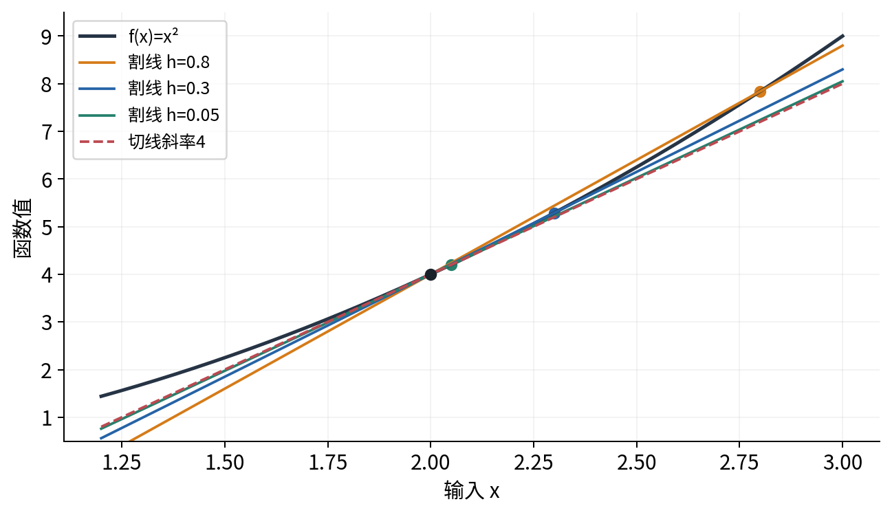
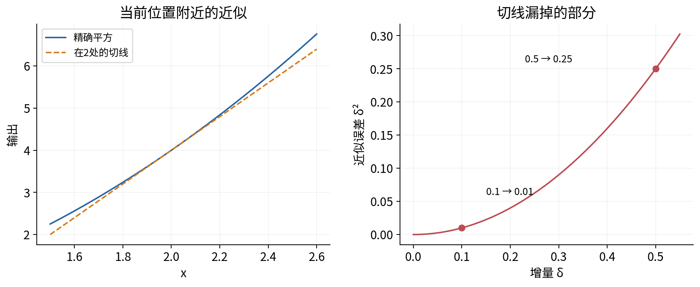
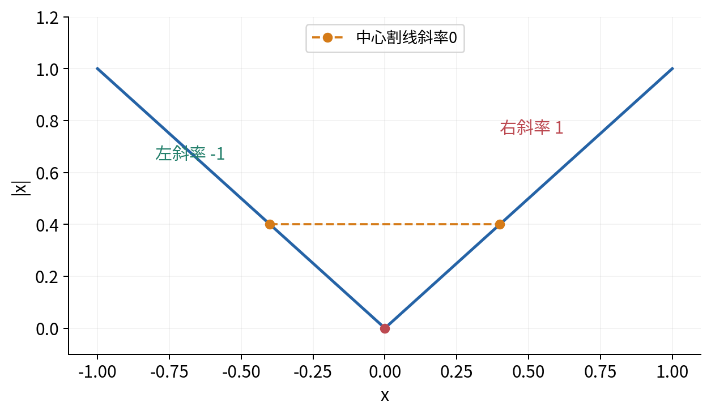
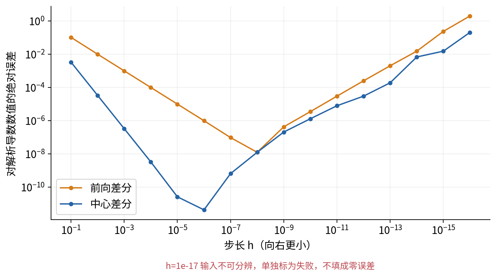
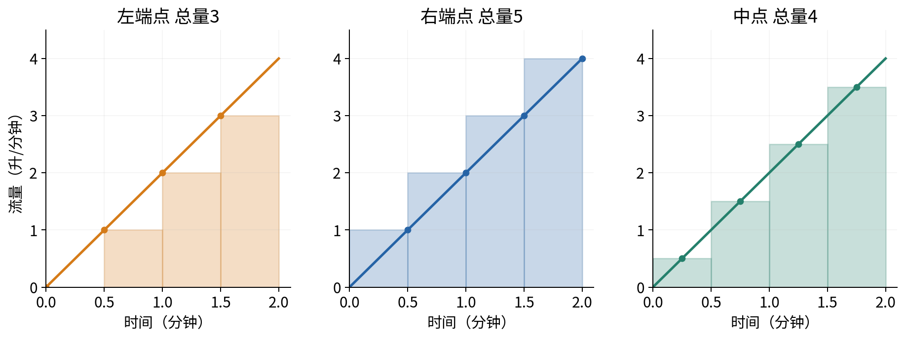
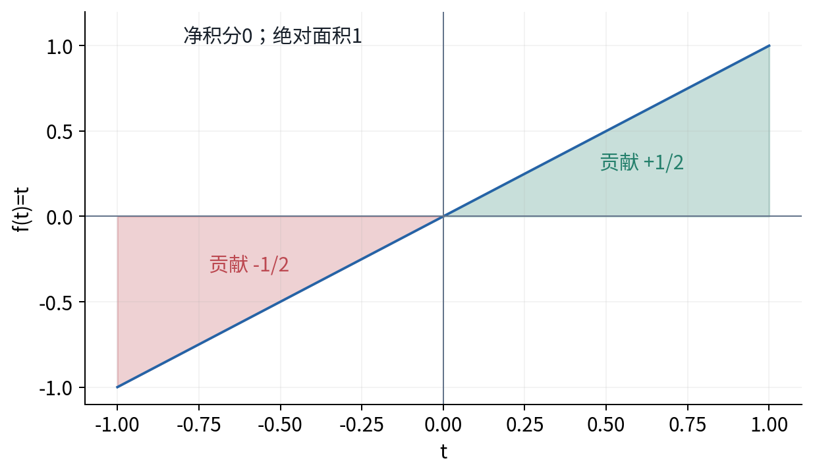
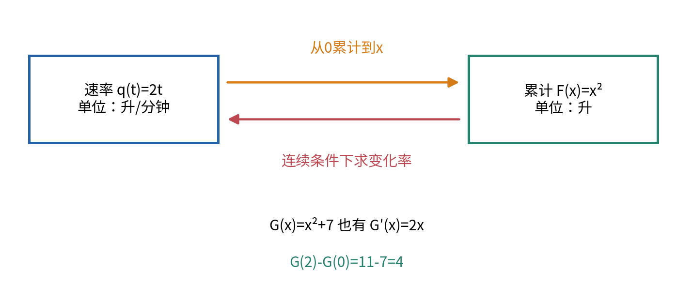
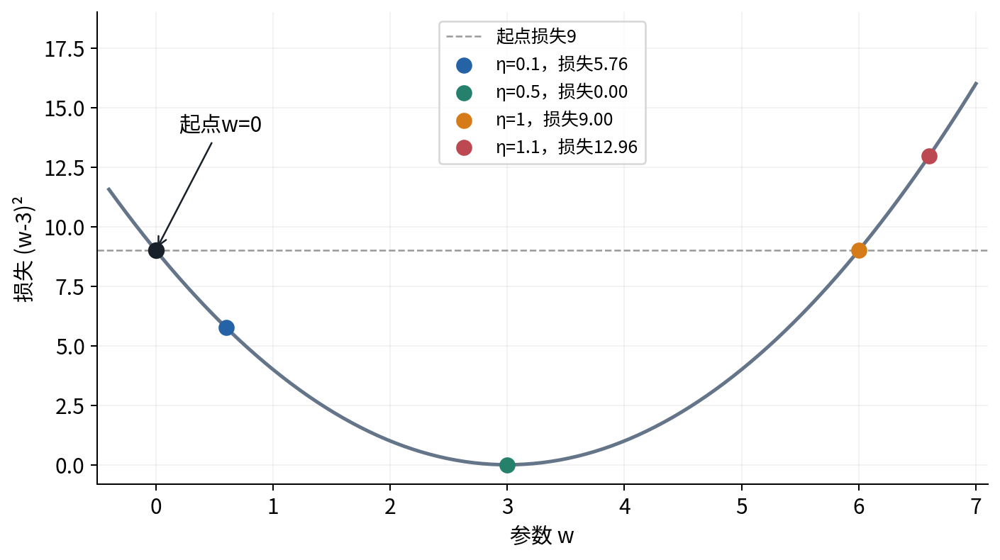

# 导数积分与局部变化

## 第010单元 既问眼前变化也问累计多少

一条合成记录给出累计量F(t)=t²。若t从2变到2.1，累计量增加多少？能不能只用当前位置的一条斜率近似？反过来，如果只知道变化速率q(t)=2t，怎样恢复一段时间里的总变化？这两类问题分别引出导数和积分，最终由微积分基本定理联系起来。

先修007。本讲从差值、除法、求和和函数图像开始，不要求向量、矩阵或已有微积分知识。我们明确区分数学极限、有限步长近似和计算机浮点结果；最后用一个一维损失说明，斜率提示的下降方向不保证任意大的步长都能降低损失。

主例是一条原创的合成累计曲线，没有真实设备操作。可以把t在0到2之间理解为分钟，F为升数，此时式子t²隐含系数1升/分钟²。做数学推导时也会把f(x)=x²作为定义在全部实数上的无量纲函数，二者的解释范围不要混淆。

## 一 两个时点之间先算平均变化

f(2)=4，f(2.5)=6.25。输入增加0.5，输出增加2.25，平均变化率为2.25除以0.5等于4.5。图上把这两个点连接成割线，割线斜率就是输出变化量除以输入变化量。

用h表示输入增量，h不为0。当前位置是x，另一个位置为x+h，平均变化率写成：

$$\frac{f(x+h)-f(x)}{h}.$$

这个比值叫差商。分子是函数值的差，分母是输入的差；它不是f(x)除以x。若输入单位为分钟、输出为升，差商单位为升/分钟，与原累计量的单位不同。

h可以为正也可以为负。正h从当前位置向右看，负h向左看。讨论通常的两侧导数时，两边都要接近同一个结果。若任务只在t≥0有定义，端点0只能从允许的一侧观察；不能在物理解释里无声地使用负时间数据。

## 二 趋近零不等于把分母设成零

对f(x)=x²，先展开再化简：

$$\frac{(x+h)^2-x^2}{h}=\frac{2xh+h^2}{h}=2x+h,\qquad h\ne0.$$

x=2时，h为0.5、0.1、0.01，差商为4.5、4.1、4.01；h为-0.1、-0.01时，差商为3.9、3.99。只要h越来越接近0，这些值都可以越来越接近4。

“极限为4”的意思是，我们能让差商与4的差小到任何预先指定的正误差以内。这个例子尤其清楚，因为误差恰好是|h|。若想让差商误差小于0.001，选择0<|h|<0.001即可。这是一个可以说明原因的界，不只是观察几行小数后猜测。

原来的差商在h=0时没有定义，因为分母为0。化简后的2x+h在0处有值，并不把原来的0/0变成合法运算；它帮助我们研究h不为0但靠近0时的行为。这就是极限思想的重要区别。

若差商在h趋向0时有同一个有限极限，就称f在x处可导，导数记为f′(x)或df/dx：

$$f'(x)=\lim_{h\to0}\frac{f(x+h)-f(x)}{h}.$$

因此平方函数的导数为f′(x)=2x，在x=2处为4。符号′读作撇，不表示乘法。d/dx表示对输入x求导的操作；本单元所有导数都是单变量标量导数，多变量将在011建立。[1]

## 三 一条切线能预测多远

在x=2附近，用当前位置函数值4加上斜率4乘输入小变化δ，得到近似f(2+δ)≈4+4δ。δ表示实际要移动的量，与前面用于定义极限的h一样都是输入增量，但这里并不把它送到0。

平方函数的精确展开为(2+δ)²=4+4δ+δ²，所以切线近似漏掉δ²。δ=0.1时精确值4.41、近似4.4，误差0.01；δ=0.5时精确6.25、近似6，误差0.25。离当前位置更远，局部直线可能越来越不准确。

可导意味着附近变化可以写成一个主导的线性部分，加上相对于输入增量更小的剩余。完整的极限与连续性理论需要实分析；本讲在具体例子中追踪误差，并在使用一般定理时说明条件，不把数值图表当作证明所有函数性质的工具。

## 四 从定义得到几条求导规则

下面使用极限运算的基础事实：若各部分都有有限极限，有限个数的和、差、积可以分别取极限；商还要求分母的极限不为0。这些规则允许我们在写清条件后组合已知极限，本讲不展开其一般证明。

常数函数f(x)=c的差商为(c-c)/h=0，所以导数为0。一次函数f(x)=ax+b的差商为ah/h=a，因此斜率就是a。常数偏移b改变函数值，不改变它随x增加的速率。

若f与g在x处可导，则和的差商可以拆成两份差商，所以(f+g)′=f′+g′。同样，将函数乘固定常数a时，差商也乘a，所以(af)′=af′。这里a必须作为固定参数，不能在同一步又让它随x变化而漏掉其贡献。

平方函数已经推导出2x。立方差商为3x²+3xh+h²，极限为3x²。更一般的正整数n次幂，可以使用有限代数恒等式：

$$\frac{(x+h)^n-x^n}{h}=\sum_{k=0}^{n-1}(x+h)^{n-1-k}x^k,\qquad h\ne0.$$

验证时先把右侧的和乘以h=(x+h)-x。每个第k项变成下面两个乘积之差：

$$h(x+h)^{n-1-k}x^k=(x+h)^{n-k}x^k-(x+h)^{n-1-k}x^{k+1}.$$

从k=0加到n-1时，后一项的正乘积恰好抵消前一项的负乘积，只留下(x+h)的n次幂减去x的n次幂。再除以非零h，才得到上面的差商恒等式。零次幂的多项式项按常数1理解，n=1也可直接用一次函数结果。

h趋向0时，右侧每一项趋向x的n-1次幂，共有n项，所以导数是n乘x的n-1次幂。这个推导采用正整数n；其他指数需要另看定义域和分析条件。

### 乘积不能只把两边导数相乘

所谓f在x处连续，是指输入趋近x时，函数值趋近f(x)；函数变化不会在该点突然跳到另一值。

对f(x)g(x)，在差的分子里加减同一个中间项f(x+h)g(x)，再分组，可得到差商等于f(x+h)乘g的差商，加上g(x)乘f的差商。可导函数在该点连续，因此极限给出：

$$(fg)'=f'g+fg'.$$

例如f=x²、g=2x+1，乘积展开为2x³+x²，导数6x²+2x。用乘积规则计算也得到2x(2x+1)+x²×2=6x²+2x。若错写成f′g′=4x，就丢掉了另一项变化。

可导为什么带来连续？把函数变化写成h乘差商；h趋向0，而差商趋向一个有限值，函数变化就趋向0。这一小步解释了刚才为何可以把极限中的f(x+h)替换成f(x)，不靠符号外观随意替换。

当g(x)不为0，商函数的差商也可通过通分展开，分子出现f的变化乘g减去g的变化乘f，分母趋向g²，因此：

$$\left(\frac{f}{g}\right)'=\frac{f'g-fg'}{g^2}.$$

例如1/x在x不为0时的导数为-1/x²。x=0不在原函数定义域，不能因为导数公式也在这里出问题才临时决定是否排除。复合函数的变化如何沿多个节点传递，会在011仔细推导。[2]

## 五 指数与对数为什么常出现在导数中

007介绍了自然底数e。本节使用一个标准分析事实：当h趋向0时，$(e^h-1)/h$趋向1。它说明自然指数在0附近的相对增长率为1；这个极限及实数指数的严格构造属于更完整的分析课程，我们不拿有限步长表格替代其证明。

利用指数乘法规律，$e^x$的差商为$e^x$乘$(e^h-1)/h$，取极限后得到导数仍为$e^x$。这也解释了自然底数在求导中方便的一面。

对自然对数，令$y=\ln x$，x>0，并把输出变化记为$k=\ln(x+h)-\ln x$。由逆关系，$h=x(e^k-1)$，所以对数差商为$k/[x(e^k-1)]$。利用同一个指数极限以及对数连续性，得到$(\ln x)'=1/x$。这里x保持为正，h足够小使x+h也为正。

一般底数a>0且a不等于1时，$\log_a x=\ln x/\ln a$，分母是常数，因此导数为$1/(x\ln a)$。底数不同会改变比例，不能只背“对数导数是1/x”而忽略到底使用哪一种对数。[5]

程序用math.exp与math.log计算相应函数；math.log默认自然对数。这些数值函数有浮点范围限制，与数学函数本身的定义域不同。极大指数可能溢出，极小差值可能发生消减，014会继续分析。

## 六 函数有值不意味着每处都有导数

考虑f(x)=|x|。正数一侧等于x，斜率1；负数一侧等于-x，斜率-1。x=0时函数值明确为0，但从右侧接近的差商为1，从左侧为-1，二者不一致，因此通常的两侧导数不存在。

若计算对称的中心差分，[f(h)-f(-h)]/(2h)，两端函数值相同，结果为0。这不是“导数为0”的证据，而是这个数值公式在尖点处掩盖了左右差异。梯度核验时必须先知道函数在被检查位置是否可导。

007的rectifier在0处也有不同的左右斜率。后续框架可能为不可微点选择某个计算约定，那是实现约定，不能改写原来的数学两侧导数定义。

## 七 有限差分为何不能无限减小步长

前向差分只取当前位置与右侧点；中心差分取左右两侧：

$$D_h^{\mathrm{forward}}f(x)=\frac{f(x+h)-f(x)}{h},\qquad D_h^{\mathrm{central}}f(x)=\frac{f(x+h)-f(x-h)}{2h}.$$

本实验约定h>0，且采样点都在函数定义域内。对立方函数，前向差分为3x²+3xh+h²，中心差分为3x²+h²；后者消去了一项与h成正比的误差。在精确算术、小步长与足够光滑条件下，中心公式常有更小的截断误差。

计算机并不进行无限精确算术。h很小时，两个接近的函数值相减，保留下来的有效信息可能很少，再除以小h会放大舍入影响。如果x+h在当前精度中已经等于x，程序甚至没有取到不同的输入点。本实验对此明确报“步长无法分辨”，不把返回0伪装成真实导数。

因此，数值差分是一种交叉核验工具，不是数学导数的定义，也不是自动微分的工作方式。后续遇到梯度不一致时，要分别检查公式、形状、不可微点、尺度与步长，不直接认定某个库错误。

## 八 从一小段速率恢复累计量

现在反过来，只给合成流量q(t)=2t升/分钟，t在0到2分钟。把时间分成四段，每段0.5分钟。每段内先用一个代表速率乘时间宽度，得到这段的近似升数，再把各段加起来。

采用左端点，速率依次0、1、2、3，乘0.5后总量为3升；采用右端点，速率1、2、3、4，总量5升；采用中点，速率0.5、1.5、2.5、3.5，总量4升。三种方法的采样位置不同，不能在记录中只写“做了积分”。

若分成n个等宽区间，宽度Δt=2/n。左端点和为2Δt²乘从0到n-1的整数和。这个整数和与它的倒序相加，每一对都是n-1，共n对，所以原和为n(n-1)/2。代入得到4-4/n；右端点同理得到4+4/n。n增大时，两者都趋向4，这就是这条连续曲线在0到2上的定积分。

记号 $\int_0^2 q(t)\,dt$表示沿t从0到2累计q(t)乘小时间宽度的极限。上下的0与2是边界，dt提示累计变量和宽度，不是一个单独待代数求解的参数。函数在闭区间连续是保证这里可积的一种充分条件；并不是说只有连续函数才能讨论积分。[3]

## 九 面积与带符号累计

当函数非负时，定积分可以看作曲线下的面积。函数有负值时，积分按符号累计；它与全部几何面积的和不一定相同。例如f(t)=t在-1到1之间，左侧负三角形贡献-1/2，右侧正三角形贡献1/2，积分为0，而两块无符号面积总和为1。

交换积分上下界会改变符号，区间长度为0时定积分为0。这些规则表达累计方向，不能从“面积不会负”这句口号推出所有定积分都非负。

中点法对刚才的线性流量恰好精确，不代表对任何函数都精确。对f(t)=t²在0到2积分，四段中点结果为2.625，梯形法为2.75；真正积分为8/3，约2.667。梯形法用每段两端函数值的平均乘宽度，只有在合适条件下缩小划分，近似才逐步可靠。

## 十 微积分基本定理连接两种问题

记号[a,b]包含两个端点，(a,b)不包含端点。设f在整个闭区间[a,b]连续，取内部点x，即a<x<b。连续性保证从a到x的定积分存在，定义累计函数F(x)=从a到x的f(t)定积分。h足够小，使x+h仍在区间内；输入增加h时，F的增量就是这段小区间里的累计；增量除以h，是该小段上的平均速率。由于f连续，区间足够小时，其中各处速率都接近f(x)，平均也接近f(x)，所以F′(x)=f(x)。

这给出了微积分基本定理一部分的直观理由：对连续速率累计，再求变化率，会回到原速率。它不是“任何函数、任何积分、任何边界都可直接互换”的许可；连续性、定义范围与求导位置都属于条件。[4]

本讲引用微积分基本定理的另一个标准结论，完整证明见来源[4]：当f在[a,b]连续，且G′=f时，G称为f的一个原函数，定积分可用G(b)-G(a)计算。q(t)=2t的原函数可取G(t)=t²，所以0到2的积分为4-0=4。t²+7也有同样导数，端点差仍是11-7=4。

不定积分写的是一族原函数，通常加上任意常数C；定积分在固定边界下给出一个数。两者不是同一种输出。对t²，原函数可取t³/3，所以0到2积分为8/3。这里每个原函数都可通过重新求导核对。

## 十一 斜率给方向却不替你选择任意步长

取一维损失L(w)=(w-3)²。w是可调参数，损失越小越好。导数L′(w)=2(w-3)，在w=0处为-6。局部看来，增大w会降低损失，所以沿负导数方向更新：新w=旧w-ηL′(旧w)，η为正步长。

这个纯数学例子将w与损失都视为无量纲量。若实际参数和目标有单位，步长的单位也应使η乘导数后能够与w相减，不能只因它叫“学习率”就忽略量纲。

从0出发，η=0.1给新w=0.6，损失从9降到5.76；η=0.5给w=3，损失0；η=1给w=6，损失仍为9；η=1.1给w=6.6，损失12.96，比原来更大。相同方向配不同步长，可以得到不同结局。

本例可以精确分析。更新后与3的差是(1-2η)乘旧差，因此损失变成(1-2η)²乘旧损失。旧损失非零时，要严格减小，需要|1-2η|<1，即0<η<1。这个范围是当前特定二次函数的结果，不是所有网络统一适用的学习率。

## 十二 练习与验收 {style="break-before:page"}

1. 对平方函数在x=2处展开差商，分别算h=0.1与-0.1。说明极限4为何不等于把原式h直接设成0。
2. 用切线近似f(2+δ)，计算δ=0.1和0.5时的真实值、近似值与误差。
3. 从乘积规则与直接展开两条路径求x²(2x+1)的导数，说明只乘两导数会漏掉什么。
4. 推导1/x和ln x的导数，写出定义域以及用到的分析条件。
5. 核对|x|在0处左右差商与中心差分。为什么中心差分0不能证明可导？
6. 展开立方函数前向与中心差分，比较误差项；说明浮点计算为何不能无限减小h。
7. 对q(t)=2t在0到2的四段左、右、中点和手算累计量，再说明n增大时的极限。
8. 计算t²在0到2的定积分，核对中点2.625与梯形2.75；解释带符号积分和无符号面积。
9. 用微积分基本定理解释累计与速率，并说明为何原函数加常数不改变定积分。
10. 核对四个步长的损失变化，推导当前二次函数0<η<1的严格下降范围。不要把它写成任意模型的保证。

## 参考资料

[1] OpenStax作者教材，[Calculus Volume 1 第3.1节](https://openstax.org/books/calculus-volume-1/pages/3-1-defining-the-derivative)，导数定义与差商。[2] [第3.3节](https://openstax.org/books/calculus-volume-1/pages/3-3-differentiation-rules)，求导规则。[3] [第5.2节](https://openstax.org/books/calculus-volume-1/pages/5-2-the-definite-integral)，定积分。[4] [第5.3节](https://openstax.org/books/calculus-volume-1/pages/5-3-the-fundamental-theorem-of-calculus)，微积分基本定理。[5] [第3.9节](https://openstax.org/books/calculus-volume-1/pages/3-9-derivatives-of-exponential-and-logarithmic-functions)，指数与对数求导。例子、推导组织、图、代码与核验数据独立编写。
