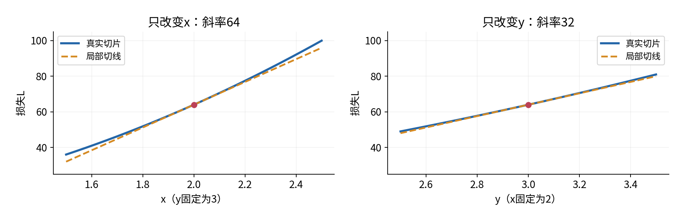
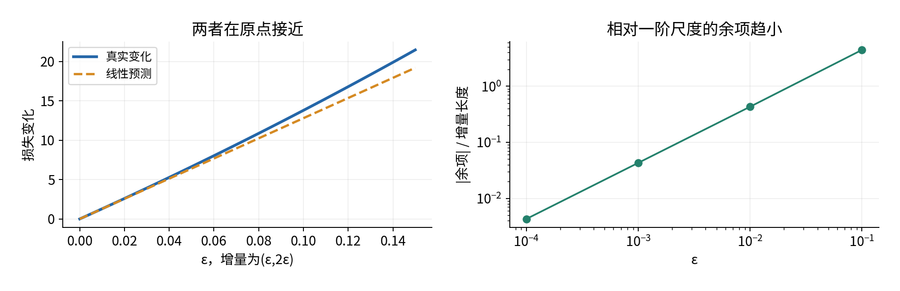
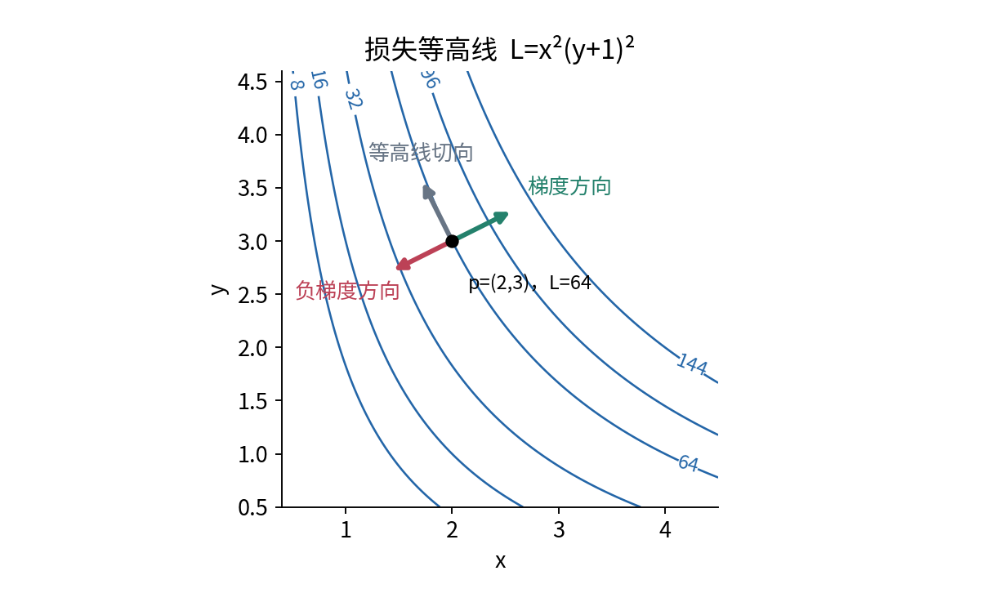
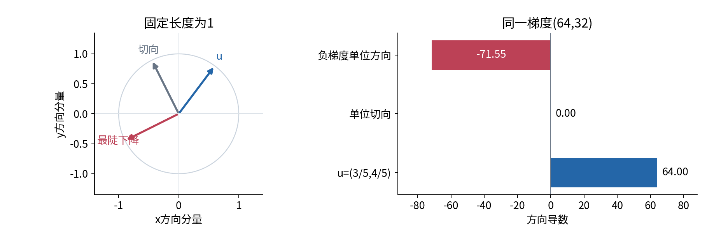
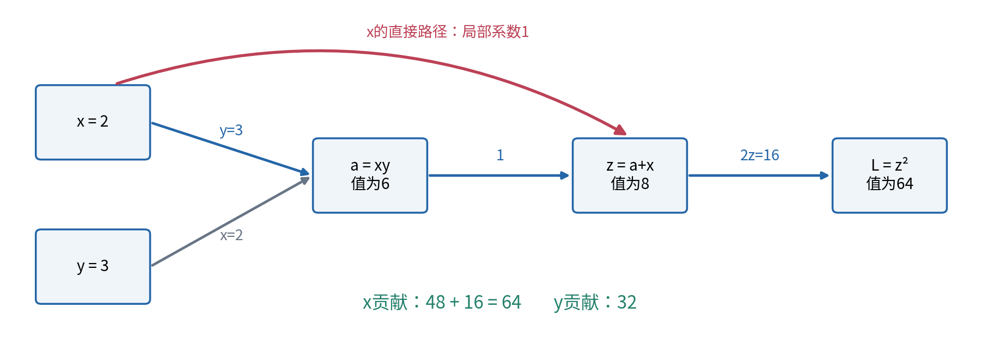
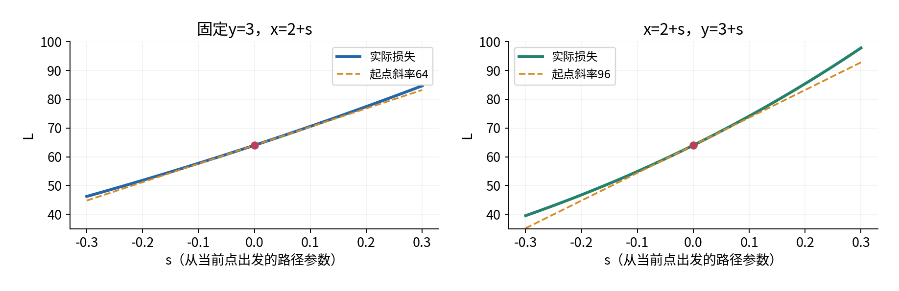
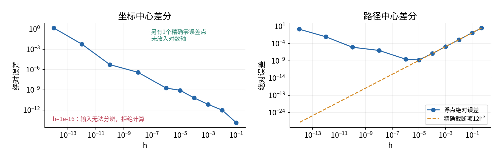
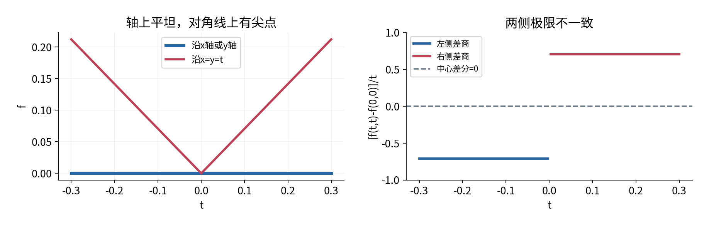
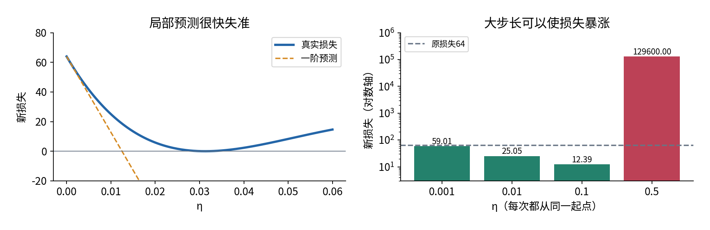

# 偏导梯度与链式法则

## 第011单元 多个参数怎样共同改变损失

一个损失同时由许多参数决定时，只问“导数是多少”已经不完整。我们必须先问：哪个参数在变，其余参数是否固定？如果两个参数沿一条路线一起变，损失的变化率又怎样计算？如果同一个参数通过两条计算路径影响输出，能否只保留其中一条？

本讲用一个原创的双旋钮计算器贯穿这些问题。两个无量纲参数x、y先相乘得到a，再把x额外加一次得到z，最后把z平方作为损失L。所有变量取实数，损失定义在整个二维平面。这个例子没有真实设备、训练数据或模型效果结论；它刻意让x出现两次，以暴露漏算共享变量的错误。

$$a=xy,\qquad z=a+x,\qquad L=z^2=(xy+x)^2.$$

先修009与010。009采用批次优先的行向量约定，并解释矩阵乘法与转置；010从差商建立单变量导数、局部近似与有限差分。通过009的先修链，我们还会使用008的内积、长度、正交和柯西施瓦茨不等式。本讲不会预设雅可比矩阵、二阶导数或优化定理。

学习目标是把同一问题从定义、手算、几何和程序四个角度讲清楚：偏导是固定其余独立坐标后的变化率；全微分是一个局部线性规则；梯度把这些系数放在同一个有序向量里；链式法则把局部变化沿计算关系传递。最后，我们用有限差分找错，也解释有限差分不能证明什么。

## 一 一个点和两种切片

先在点p=(2,3)处算出所有中间值。a=2×3=6，z=6+2=8，L=8²=64。a、z、L都是标量；p包含两个坐标。把这三个中间量与两项参数混在同一个“向量”里，会掩盖谁是独立输入、谁由计算得到。

如果只改变x，让y一直等于3，那么损失成为L(x,3)=(3x+x)²=16x²。现在又回到010的一元函数，x=2处斜率为32x=64。若只改变y，让x固定为2，则L(2,y)=(2y+2)²=4(y+1)²，在y=3处斜率为8(y+1)=32。

这两个数字没有冲突。它们回答两个不同实验：“横着走时每单位x造成多少一阶变化”和“竖着走时每单位y造成多少一阶变化”。它们都在同一个起点测量，但切片方向不同。图1画出两条实际切片以及起点处的切线。



“固定y”不意味着把y设为0，也不意味着把所有含y的项删掉。它意味着y在这次变化实验中维持当前数值3。对xy求x的偏导，y是乘在x前面的固定系数，贡献为y；它仍然影响结果。

## 二 从一元差商定义偏导数

设标量函数f在点(x,y)附近有定义。对x的偏导，记为fₓ或∂f/∂x，是只沿x坐标轴取差商的极限：

$$f_x(x,y)=\lim_{h\to0}\frac{f(x+h,y)-f(x,y)}{h}.$$

相应地，只沿y坐标轴的极限为：

$$f_y(x,y)=\lim_{h\to0}\frac{f(x,y+h)-f(x,y)}{h}.$$

两式都要求h不为0，且采样点在定义域内。符号∂读作偏导符号，提醒我们没有让所有坐标都跟着一起变化。偏导仍是一个极限，不是把很小的h代入后所得的某个有限小数。[1]

为了暂时不依赖尚未建立的复合函数规则，先把主例改写成L=x²(y+1)²。求x偏导时(y+1)²固定，因此Lₓ=2x(y+1)²。求y偏导时x²固定，展开(y+1)²=y²+2y+1，再逐项求导，得到Lᵧ=2x²(y+1)。在(2,3)处分别为64、32。

也可以直接展开差商。固定y时，L(x+h,y)-L(x,y)=(2xh+h²)(y+1)²，除以h得到(2x+h)(y+1)²，极限是2x(y+1)²。固定x时，同样得到2x²(y+1)。这些代数过程说明偏导来自定义，而不只是一个背下来的符号操作。

若输入坐标有物理单位，fₓ的单位是输出单位除以x单位，fᵧ则除以y单位。若两个坐标单位不同，两个偏导数值的大小不能直接作为“哪一个因素更重要”的普遍排名。本讲的主例已经声明坐标均无量纲；后面讨论最陡方向也在这个坐标尺度下进行。

## 三 同时移动时需要全微分

真实更新常让x和y一起变化。记增量为δ=(δx,δy)。在主例起点附近，如果只保留两个切片提供的一阶贡献，可以预测：

$$L(2+\delta x,3+\delta y)\approx64+64\delta x+32\delta y.$$

但两个偏导存在就足以保证这条近似在所有小方向上有效吗？答案是否定的。这里需要更强的条件：函数在p处可微。多变量可微的具体含义是存在一个线性规则，能对任意足够小的联合增量给出一阶近似，余项相对增量长度趋向0。[2]

令r(δ)表示近似遗漏的量，用008定义的欧氏长度衡量δ。若函数在p附近有定义，并且满足：

$$f(p+\delta)=f(p)+f_x(p)\delta x+f_y(p)\delta y+r(\delta),\qquad
\frac{r(\delta)}{\|\delta\|_2}\longrightarrow0,$$

这里的极限是δ沿任意方式趋向零向量，而不只沿坐标轴。我们称f在p处可微。记号“余项比长度更小”只描述相对阶数，不表示每一个有限增量下余项都小于某个固定百分比。

线性部分称为全微分，记作df=fₓdx+fᵧdy。dx、dy在这里是输入给线性规则的增量符号；df是该规则预测的输出变化。实际有限变化Δf还包括余项。因而df与Δf通常不相等，不能把全微分记号当作删去所有误差的许可。

一个常用的充分条件是：偏导在该点的某个邻域存在，并在该点连续，则函数在该点可微。这里强调“充分”：它帮助判断许多常见平滑函数；我们不把它反过来宣称为可微的必要条件。主例是多项式，满足这一条件；下一节还会直接算出余项，独立验证它的局部性质。

## 四 主例的余项可以全部写出来

从(2,3)移到(2+δx,3+δy)，中间值z变成：

$$z_{\rm new}=8+4\delta x+2\delta y+\delta x\delta y.$$

记s=4δx+2δy+δxδy，则新损失为(8+s)²=64+16s+s²。把线性项64δx+32δy单独取出，剩下：

$$r(\delta)=16\delta x\delta y+
(4\delta x+2\delta y+\delta x\delta y)^2.$$

这个余项的每一项至少包含两个小增量因子。为了把“看起来很小”变成理由，令ρ=‖δ‖₂，则|δx|、|δy|都不超过ρ。于是|r|≤16ρ²+(6ρ+ρ²)²。除以ρ后，右侧为16ρ+ρ(6+ρ)²，随着ρ趋向0也趋向0。这直接证明主例在这个点有前面声称的线性近似，不靠有限样本猜测。

取δ=(0.01,0.02)，线性预测损失为64+0.64+0.64=65.28。真实z=8.0802，真实损失65.28963204，差为0.00963204。把增量放大十倍到(0.1,0.2)，真实损失77.7924，线性预测76.8，误差已经变为0.9924。



在这条特定增量线上，线性变化为128ε，余项恰好是96ε²+32ε³+4ε⁴。这里的“二次量级”是当前多项式展开的结果。一般可微只保证余项除以长度趋向0，不能在没有更多条件时统一宣称所有余项都恰好正比于长度平方。

## 五 梯度是带有顺序和坐标约定的系数向量

把偏导按参数顺序排在一起，得到梯度。本讲沿用009的行向量数学约定，明确写成一行：

$$\theta=\begin{bmatrix}x&y\end{bmatrix},\qquad
\nabla L(\theta)=\begin{bmatrix}L_x(\theta)&L_y(\theta)\end{bmatrix}.$$

θ与梯度的shape都为(1,2)。δ也写成(1,2)，那么全微分是一个行与列的内积：

$$dL=\nabla L(\theta)\,\delta^{\mathsf T}
=L_x\delta x+L_y\delta y.$$

乘积shape为(1,1)，取其中一个元素得到标量变化。这里的转置服务于乘法方向，不改变各偏导数值。某些教材把梯度写成列；那时内积的转置位置需要相应调整。我们不会在一页里将行、列约定来回切换。

NumPy的一维shape(2,)本身不携带行列方向。为了延续009的严格接口，核心代码只接受(1,2)的点、增量与梯度，并拒绝把(2,)或(2,1)悄悄当成同一输入。这个1是单条参数向量的行轴，不表示我们在这里处理一批不同损失。多样本共享参数的损失求和将在后续单元展开。

```python
import numpy as np
from experiment import gradient, rate_along
p = np.array([[2.0, 3.0]])
g = gradient(p)
delta = np.array([[0.01, 0.02]])
assert g.shape == (1, 2)
assert abs(float((g @ delta.T)[0, 0]) - 1.28) < 1e-12
assert abs(rate_along(p, delta) - 1.28) < 1e-12
```

将x与y顺序调换却不调换梯度分量，会把敏感度贴在错误参数上。shape相同仍可能算错，因此应同时记录每个位置的变量名。此处第1列永远是x，第2列永远是y。

## 六 等高线怎样连接梯度与几何

把满足L(x,y)=c的所有点画在参数平面上，得到损失为c的等高线。图3的每一条曲线连接同样损失的参数组合。图中选取靠近(2,3)的正坐标区域，避免把多条零损失直线与当前局部几何混在一起。



设一条可微曲线q(t)始终留在同一条等高线上，并通过p。沿曲线，L(q(t))恒定，因此变化率为0。下一节建立的方向导数和后面的链式法则将给出，这个变化率等于∇L(p)与曲线速度的内积。于是非零切向量与梯度正交。

在p处梯度是(64,32)。向量v=(-1,2)满足64×(-1)+32×2=0，所以它是这里的一个切向方向。写成局部直线，δy=-2δx消去一阶变化。它描述等高线在当前点的切线，不表示沿这条直线走任意远都留在原等高线上。

例如δ=(-0.01,0.02)，内积为0，但z新值为7.9998，损失为63.99680004，仍然发生了约-0.00319996的变化。只是这个变化来自一阶之外的余项。方向导数为0、短段精确变化为0、沿整条路线函数恒定，是三个不同结论。

## 七 方向导数要说明是否按单位距离

偏导只看两条坐标轴。若我们想朝任意方向走，取单位行向量u=(uₓ,uᵧ)，满足‖u‖₂=1，定义：

$$D_u f(p)=\lim_{h\to0}\frac{f(p+hu)-f(p)}{h}.$$

由于u长度为1，|h|就是这次直线移动的欧氏距离。这个方向导数表示每单位距离的有符号变化率。如果f在p处可微，将δ=hu代入全微分，再除以h，余项趋向0，因此：

$$D_u f(p)=\nabla f(p)u^{\mathsf T}.$$

这条公式依赖可微条件。仅算出两个偏导，然后机械地与任意方向做内积，可能给出根本不存在的方向导数。第十三节会给出具体反例。[4]

在主例中，u=(3/5,4/5)是单位向量。方向导数为64×3/5+32×4/5=64。如果把(3,4)直接代入内积，会得到320；那是沿q(t)=p+t(3,4)时每单位t的变化率。这条路线每单位t走5单位距离，因此两个结果恰好差5倍，并非两种算法互相矛盾。



程序把这两种问题分成两个接口：directional_derivative要求输入已经是单位方向；rate_along接受任意速度。程序不会悄悄归一化，把用户本来想问的时间变化率改成距离变化率。零向量没有方向，不能归一化；它作为静止速度时，内积变化率可以为0。

## 八 负梯度为什么只是局部的最陡下降方向

回忆008的柯西施瓦茨不等式：两个向量内积的绝对值不超过长度乘积。对单位u，有-‖∇L‖₂≤∇L·u≤‖∇L‖₂。若梯度非零，选择u=-∇L/‖∇L‖₂时取得下界。因此，在当前欧氏坐标尺度下、比较同样单位长度的一阶变化率时，负梯度是最陡下降方向。

主例梯度长度为√(64²+32²)=32√5，约71.554。最陡单位下降方向是(-2/√5,-1/√5)，方向导数为-32√5。直接用-∇L作为速度时，路径导数则为-‖∇L‖₂²=-5120，因为该速度的长度不是1。

“最陡”没有承诺三个更强的事情：任意有限步长都下降，走一步达到最优，或者多次更新必然找到全局最小值。它只是对当前点附近的一阶信息作比较。若梯度非零且函数在该点可微，沿这个固定方向存在足够小的正步长使损失下降；具体多小仍须分析函数或实际核验。

若参数坐标缩放了，比如把x的单位改成原来的100倍，梯度分量与单位长度的含义也会改变。因而“最陡”总是相对于给定坐标尺度和长度度量。不能不说明尺度，就把偏导绝对值直接称为模型特征的重要性。

## 九 从局部展开推出一条链上的乘法

先考虑一元复合函数w=φ(s)，s=g(t)。假设g在t₀可导，φ在s₀=g(t₀)可导。t增加k时，g的增量为g′(t₀)k加上相对于|k|更小的余项。φ的增量又是φ′(s₀)乘这个s增量，加上相对于|Δs|更小的余项。

因为g可导，足够小k下|Δs|/|k|保持有界。把第二层的余项除以|k|，可看作“相对于|Δs|趋零的量”乘“有界的|Δs|/|k|”，仍趋向0。若某些k使Δs=0，那些点的输出变化也为0，可以直接处理，不需要除以0。因此复合导数是：

$$\frac{dw}{dt}=\frac{d\varphi}{ds}\bigg|_{s=g(t)}\frac{dg}{dt}.$$

这个论证解释为什么一条依赖路径上要乘局部导数，也说明所有导数必须在相互对应的当前值处求。它不是将符号d当成普通数字约分的规则。[3]

若w=φ(g(x,y))，g在当前二维点可微，φ在当前g值可导，同样的局部展开分别给出wₓ=φ′(g)gₓ，wᵧ=φ′(g)gᵧ。这里尚未引入新的矩阵对象，只使用标量变化的传递。

主例的最后一层L=z²在z=8处导数为2z=16。中间z=xy+x对x偏导为y+1=4，对y偏导为x=2。沿两层相乘，得到Lₓ=16×4=64，Lᵧ=16×2=32，与直接展开结果一致。

## 十 分支汇合时必须把所有路径相加

把主例保持为三个节点，比直接写成x²(y+1)²更能看见错误来源。局部关系是a=xy、z=a+x、L=z²。求z对x的总依赖时，x既改变a，又直接进入z。

在z=a+x这个局部节点，如果把a和x暂时作为两个独立槽位，则∂z/∂a=1，直接槽位的∂z/∂x=1。重新代入a=xy后，z作为原始参数x、y的函数，对x的偏导是1×y+1=y+1。局部“固定a”的1，和完整函数“固定y”的y+1，不能因为都写了∂z/∂x就混为同一个量。



在(2,3)处，从损失端开始整理局部乘积：L对z的变化系数为16；z把相同系数16传给a槽位，也把16传给直接x槽位；a=xy再把16×y=48传给x，把16×x=32传给y。原始x收到48与16两份贡献，必须累加成64。

这一做法只是手工组织链式法则，尚不是自动微分框架。它揭示了后续反向传播中很重要的累加原则：一个变量被多个下游计算使用时，它对最终标量的影响需要汇总所有相关路径。把第二份贡献覆盖第一份，与完全漏掉一条路径一样会出错。

一般地，若F=F(a,b)，而a、b都是x、y的可微函数，F也在当前(a,b)可微，则对固定y的变化：

$$\frac{\partial F}{\partial x}
=\frac{\partial F}{\partial a}\frac{\partial a}{\partial x}
+\frac{\partial F}{\partial b}\frac{\partial b}{\partial x}.$$

理由来自全微分dF=Fₐda+F_bdb；只变x时，da与db分别贡献aₓdx、bₓdx，收集dx系数便得到上式。所有变量的依赖关系必须先说明，否则很容易错误地将本来相关的中间变量当作独立常数。

## 十一 两个参数沿同一条路径一起变化

现在有一个新实验：用一个旋钮t同时控制x=t、y=t+1。经过t=2时仍到达p=(2,3)，但此刻两个原始参数都在变。令ℓ(t)=L(t,t+1)，我们要的是dℓ/dt，不是固定y求Lₓ。

假设L在p处可微，x(t)、y(t)在当前t可导。由全微分与一元增量展开，可得到路径链式法则：

$$\frac{d\ell}{dt}=L_x(x(t),y(t))\frac{dx}{dt}
+L_y(x(t),y(t))\frac{dy}{dt}.$$

本例两项速度都为1，故t=2处变化率为64×1+32×1=96。直接代入也能独立核对：ℓ(t)=t²(t+2)²=t⁴+4t³+4t²，导数为4t³+12t²+8t，在2处正好96。



还可以把当前速度写成行向量q′(2)=(1,1)，于是dℓ/dt=∇L(p)q′(2)ᵀ。速度长度为√2，沿相同方向的单位距离变化率是96/√2=48√2。通过同一点，并不足以决定一个唯一的变化率；还需要知道如何离开这个点以及变化参数的尺度。

全微分、方向导数、路径导数因此连成一条清晰关系：全微分接受任意小增量；方向导数输入单位方向；路径导数输入当前路径速度。它们共享同一组局部线性系数，但询问的对象不同。

## 十二 用有限差分发现公式错误

在可微点检查偏导时，每次只扰动一个坐标，并重新计算完整损失。中心差分为：

$$\widehat g_j=\frac{L(p+he_j)-L(p-he_j)}{2h},\qquad j=1,2.$$

e₁=(1,0)、e₂=(0,1)。每次扰动后都要重算a、z、L；不能让中间a停留在旧值，否则检查的是另一个函数。主例对每个独立坐标都是二次函数，所以精确算术的中心差分恰好等于该偏导，任意非零h都没有这条坐标切片上的截断误差。这是特殊结构，不能推广到一般函数。

为了在同一个例子里看到真正的截断误差，我们再对路径ℓ(t)=t⁴+4t³+4t²做中心差分。在t=2处展开后，差分恰好为96+12h²。大h会产生明确误差；h缩小时，浮点相消与舍入又可能放大。这与010的有限差分讨论相衔接。



程序记录绝对误差，并将非有限输入、错误shape、无法分辨的h、越出数值范围等情况明确拒绝。对梯度很大的问题，比较时也应考虑相对误差；接近零的真实分量则不能只除以真实值。本单元只用小规模固定数值，测试中的容差都与具体检查相匹配，不给出放之四海皆准的阈值。

若把x的解析梯度错误地写成48，中心差分仍接近64，二者相差16。沿图回查，就能定位漏掉了直接路径。若数值结果不一致，依次检查函数依赖、变量顺序、点是否可微、采样点是否有效、步长能否分辨与容差；不要只把h缩到更小。

## 十三 偏导全都有也不保证可微

考虑一个单独的反例，不把它混进主损失的平滑假设：

$$f(x,y)=\begin{cases}
\dfrac{xy}{\sqrt{x^2+y^2}},&(x,y)\ne(0,0),\\
0,&(x,y)=(0,0).
\end{cases}$$

沿x轴或y轴，分子总为0，所以原点两个偏导都为0。它在原点甚至连续：利用2|xy|≤x²+y²，可得|f(x,y)|≤√(x²+y²)/2，距离趋0时函数值也趋0。

然而，沿x=y=t，函数变成|t|/√2。对t的右侧差商为1/√2，左侧差商为-1/√2，两者不一致。若真能用零梯度作全方向的线性近似，这条路线的一阶变化应为0，实际却不是。因此它在原点不可微。



也可直接用可微定义检查：沿δ=(t,t)，f(δ)/‖δ‖₂=1/2，始终不趋0。这个精确比值足以否定零线性规则的余项条件。两个坐标偏导既已都是0，若存在任何全微分，其坐标系数必须为0，因此不存在其他线性规则可以挽救它。

这个反例说明一种实际危险：坐标差分稳定地给出两个0，甚至对称的对角差分也给出0，都不能单凭数值宣称函数可微。数学条件和程序诊断承担不同职责。后续遇到分段函数或人为选定的尖点梯度约定，要明确区分定义与实现选择。

## 十四 有限更新和零梯度的边界

沿负梯度做一次更新，记θ新=θ旧-η∇L(θ旧)，η>0。主例从(2,3)出发，新点为(2-64η,3-32η)。下表全部来自同一个原始梯度，而不是每行从上一行继续更新。

| η | 新点 | 新损失 | 与原损失64比较 |
|---|---|---|---|
| 0.001 | (1.936,2.968) | 59.013861474304 | 降低 |
| 0.01 | (1.36,2.68) | 25.04802304 | 降低 |
| 0.1 | (-4.4,-0.2) | 12.3904 | 降低 |
| 0.5 | (-30,-13) | 129600 | 大幅增加 |



η=0.1时，一阶预测的损失变化是-512，甚至会把预测损失写成负数。真实平方损失不可能为负，它实际为12.3904。这不是平方性质失效，而是线性近似走得太远。一个步长恰好仍然下降，也不说明该步长下的一阶预测很准确。

若梯度为0，所有方向的一阶变化率在可微假设下都为0，但仍不能判定最小值。例如q(x,y)=x²-y²在原点梯度为0；沿x轴函数变正，沿y轴变负，任意小邻域里都有比原点大和小的值，所以原点不是局部最小值，更不是全局最小值。全局最小要求与定义域内所有点比较，而不是只检查一个导数。

主例本身有特别简单的全局结论：L=x²(y+1)²≥0；当x=0或y=-1时等于0，所以这些点都是全局最小点。此结论来自非负性与显式取到0，不能被缩写成“因为梯度是0，所以是全局最小”。梯度提供局部变化，函数结构才给出了这里的全局证据。

## 十五 练习与验收

1. 在(2,3)完成a、z、L前向表。分别固定y与固定x，写出两条一元切片及其斜率。
2. 从差商而不是链式法则推导Lₓ、Lᵧ，说明“固定另一个变量”为什么不等于把它删掉。
3. 写出主例在(2,3)的全微分。求δ=(0.01,0.02)的真实损失、线性预测与余项，并解释ΔL和dL。
4. 展开一般δ的精确余项，给出它除以‖δ‖₂趋0的界。为什么有限几个数值点不能替代这个理由？
5. 按行约定写θ、∇L、δ及内积的shape。若代码把梯度变成(2,1)，原来的乘法还表示同一个操作吗？
6. 求u=(3/5,4/5)的方向导数、v=(3,4)的路径变化率，以及(-1,2)对应的单位切向量。解释三者差异。
7. 用柯西施瓦茨不等式说明负梯度何时是单位长度意义下最陡的方向，并算出主例的最小方向导数。
8. 画出x通向L的两条路径，逐条计算贡献。错误梯度(48,32)遗漏了哪条路径？
9. 沿x=t、y=t+1，在t=2用链式法则和直接展开分别求变化率。为什么答案不是64？
10. 推导主例坐标中心差分精确算术下没有截断误差，并推导路径中心差分在t=2处多出的12h²。解释浮点结果仍可能不精确。
11. 证明第十三节反例在原点连续、两个偏导存在但不可微。指出坐标与对角中心差分的盲点。
12. 核算η=0.5的有限更新；用x²-y²解释零梯度为何不推出最小；再说明主例零损失点的全局结论来自什么证据。

验收时，需要能在纸上解释64、32、96、48+16以及单位方向64之间的关系，并且能从空状态运行实验。只提交一个正确数组，不足以证明理解了变量的依赖、尺度和可微条件。

## 参考资料

[1] OpenStax作者教材，[Calculus Volume 3 第4.3节 Partial Derivatives](https://openstax.org/books/calculus-volume-3/pages/4-3-partial-derivatives)，核对固定其他坐标的偏导定义。

[2] [第4.4节 Tangent Planes and Linear Approximations](https://openstax.org/books/calculus-volume-3/pages/4-4-tangent-planes-and-linear-approximations)，核对可微的余项条件、全微分与连续偏导充分条件。

[3] [第4.5节 The Chain Rule](https://openstax.org/books/calculus-volume-3/pages/4-5-the-chain-rule)，核对可微条件下的复合路径求导规则。

[4] [第4.6节 Directional Derivatives and the Gradient](https://openstax.org/books/calculus-volume-3/pages/4-6-directional-derivatives-and-the-gradient)，核对单位方向与梯度几何。使用其定理明确要求的可微假设，不采用页面中将偏导存在直接等同于可微的简略语句。

[5] NumPy官方文档，[asarray](https://numpy.org/doc/stable/reference/generated/numpy.asarray.html)与[isfinite](https://numpy.org/doc/stable/reference/generated/numpy.isfinite.html)，核对数组转换与有限值检查。本文的参数故事、推导组织、数值表、图和程序为独立编写。
