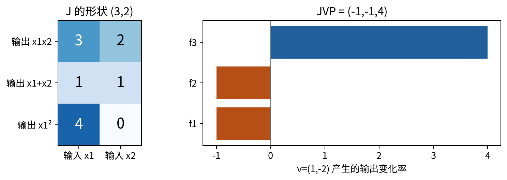
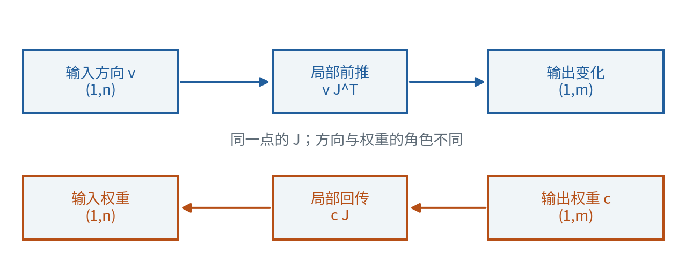
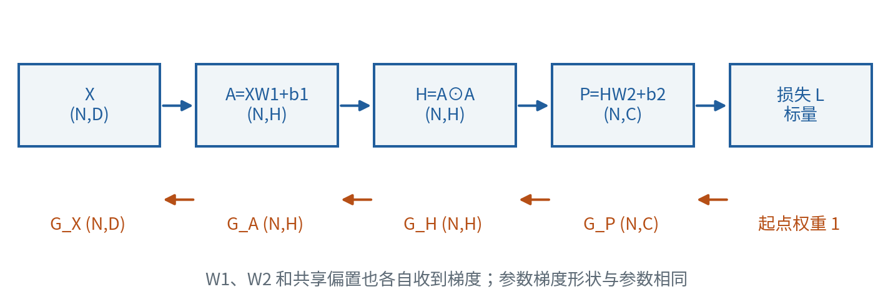
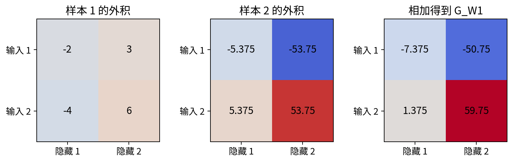
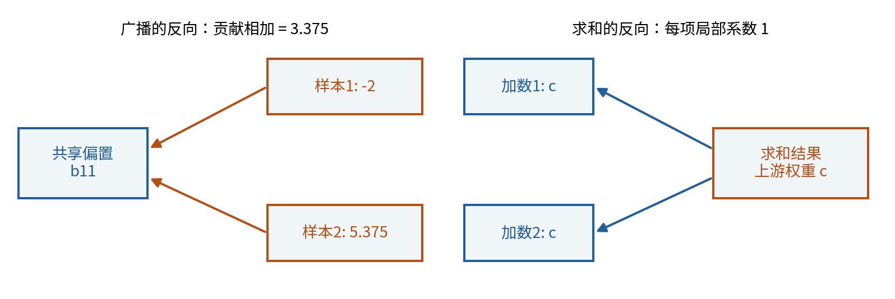
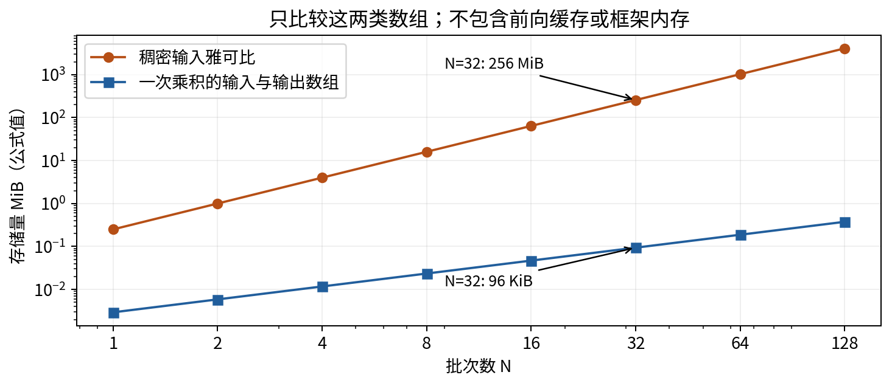
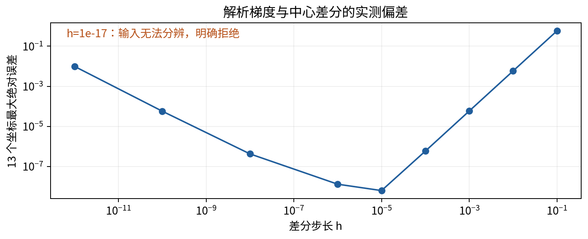

# 雅可比与矩阵求导

## 第012单元 用乘积传递变化

假设一个模型接收一批样本，经过两次矩阵乘法，再把全部预测压缩成一个损失。我们想知道每个参数怎样改变这个损失。最直接的想法是列出“每个输出对每个输入”的全部偏导，再按链式法则相乘。这个想法在纸上成立，但中间表格可能比数据大得多。本讲要回答：反向传播为什么通常计算向量雅可比积，而不显式存整个雅可比？

先修011。它已经沿先修链建立了数组轴、矩阵乘法、偏导、可微、全微分和链式法则。本讲会重新声明求导布局，并从单个元素的导数推导批次公式。我们不预设自动微分框架、激活函数库或任何训练技巧。网络只是若干可微函数的组合；“层”表示一个中间计算步骤。

贯穿实验是一台原创的两层平方计算器：每行是一份输入，两层仿射变换之间对每个元素平方。数据、参数、目标和损失均无量纲，全部人为设计。平方的目的是让非线性导数容易手算，不是在推荐实际任务的网络结构。我们只算一次前向和梯度，不声称已经训练出有效模型。

## 一 先把雅可比的行和列说清楚

设f把n个实数输入变成m个实数输出。把输入坐标记为x₁到xₙ，输出坐标记为f₁到fₘ。在一点x处，定义雅可比矩阵J的第i行第j列为输出fᵢ对输入xⱼ的偏导：

$$J_f(x)_{ij}=\frac{\partial f_i}{\partial x_j}(x),\qquad J_f(x)\in\mathbb R^{m\times n}.$$

这是“输出作行，输入作列”的布局。本课程数据样本仍按行存储，单个输入行的shape为(1,n)。两者不冲突：雅可比的布局描述一张导数表，不是要求所有数据改成列。若增量δx为行，局部变化写作：

$$f(x+\delta x)-f(x)=\delta x J_f(x)^T+r(\delta x).$$

这里f的输出也写成行，r为(1,m)余项。可微要求‖r(δx)‖₂/‖δx‖₂趋向0。只存在各个偏导不能保证这个式子成立，011的反例仍然适用。下面所有导数传播都在相关函数可微的点进行；主例是多项式，处处满足条件。[1]

用一个2输入3输出的小函数检查布局：f(x₁,x₂)=(x₁x₂,x₁+x₂,x₁²)。在(2,3)处，输出为(6,5,4)，雅可比为：

$$J=\begin{pmatrix}3&2\\1&1\\4&0\end{pmatrix}.$$

第一行(3,2)来自乘法，第二行(1,1)来自加法，第三行(4,0)来自平方。列1收集同一个输入x₁怎样影响三个输出。把这个矩阵直接与shape(1,2)的行相乘会维度不合；正确的行式是δxJᵀ。不要依赖NumPy的一维数组自动省略轴来掩盖约定。

## 二 JVP把一种输入变化往前推

现在只关心一种输入变化v=(1,-2)。把它当作随实数t变化的速度，研究f(x+tv)在t=0的导数。按011的链式法则，第i个输出的变化率等于各偏导乘各坐标速度后相加。所有输出同时写出就是Jvᵀ，shape为(m,1)；转回行得到vJᵀ，shape为(1,m)。

名称JVP来自Jacobian-vector product，即雅可比与向量的乘积。名字沿用列式Jv；本讲程序返回与输出同shape的数组，不把名称当成省略转置的理由。在小函数中：

$$J\begin{pmatrix}1\\-2\end{pmatrix}=\begin{pmatrix}-1\\-1\\4\end{pmatrix}.$$

第一项还可以直接核对：(2+t)(3-2t)=6-t-2t²，因此导数为-1。第三项(2+t)²=4+4t+t²，因此导数为4。这是局部变化率；t=1时的实际变化不等于整个JVP，因为仍有二次余项。

关键在于不必先建立J。乘法节点把变化算成x₂δx₁+x₁δx₂，加法节点相加，平方节点把输入变化乘2x₁。沿函数图执行这些局部规则，就得到同一个JVP。若只需要这一个方向，建立全部列是额外工作。

## 三 VJP把输出的重要程度往回传

换一个问题：我们只关心三个输出的加权和s=2f₁-f₂+0.5f₃。权重行c=(2,-1,0.5)的shape为(1,3)，每个权重说明对应输出变化一单位时，s的一阶变化是多少。它不是输入速度。由链式法则：

$$\frac{\partial s}{\partial x}=cJ=(7,3).$$

例如x₁对应2×3-1×1+0.5×4=7。名称VJP来自vector-Jacobian product，即左侧的输出权重行乘雅可比。结果是输入侧的权重行，shape(1,2)。JVP输入一个“往哪变”的方向，VJP输入一个“如何组合输出变化”的线性权重，二者回答不同问题。[2]

权重也可能来自更后面的非线性标量损失L。此时在当前输出点取c=∂L/∂f，再用cJ。传播时c是本次线性化的系数；不用再对c求导，否则已换成另一个高阶求导问题。若要求完整雅可比，可以让c依次等于每个输出的单位基行；那会逐行恢复J，仍须支付完整结果的存储代价。

两种乘积有一个实用交叉检查。对任意输入方向v和输出权重c，先前推再加权，与先回传再作用于方向，结果必须相同：

$$c(Jv^T)=(cJ)v^T.$$

这只是矩阵乘法结合律，左右都是标量。小例子左边2×(-1)-1×(-1)+0.5×4=1；右边7×1+3×(-2)=1。这个等式常称伴随一致性检查。它可以抓住转置或索引错误，但若两条程序恰好共享同一种错误，也可能一起通过，因此实验还加入独立手算和有限差分。

## 四 多层链式法则为什么允许只算乘积

若y=f(x)，z=g(y)，其中f有n个输入、m个输出，g有m个输入、q个输出，则J_f为(m,n)，J_g为(q,m)。复合函数的雅可比为J_gJ_f。可以逐元素证明：第a个最终输出对第b个原始输入的偏导，等于对每个中间坐标i的路径贡献求和。[1]

$$\frac{\partial z_a}{\partial x_b}=\sum_{i=1}^{m}\frac{\partial z_a}{\partial y_i}\frac{\partial y_i}{\partial x_b},\qquad J_{g\circ f}(x)=J_g(f(x))J_f(x).$$

注意两个雅可比分别在x和f(x)取值。把不同样本、不同参数版本或更新后的中间量混进同一次传播，不再对应原函数在同一点的导数。

若最终只要标量损失的梯度，给最末端权重1，按顺序计算cJ_g，再乘J_f，就不必先形成J_gJ_f。进一步，每个局部VJP也可能只用小矩阵运算完成。反向传播是这种链式法则组织方式；自动微分框架会记录计算关系并调度局部规则，本单元用手写公式看清它们，尚未实现通用自动微分引擎。[3]

## 五 把整个批次的形状列出来

设N为样本数，D为输入维数，H为中间特征数，C为输出维数，四者都是正整数。为避免与中间矩阵H混淆，正文在谈“维数H”时明确指数量，矩阵H则是平方后的数值表。本单元使用以下关系：

$$A=XW_1+b_1,\qquad H=A\odot A,\qquad P=HW_2+b_2.$$

符号⊙表示逐元素乘法，同shape的对应元素相乘，不沿共享维度求和。X为(N,D)，W₁为(D,H)，b₁为(1,H)，A和H为(N,H)；W₂为(H,C)，b₂为(1,C)，P为(N,C)。偏置在批次轴广播，每一行使用同一个参数，不是给每行一个独立偏置。程序主动要求偏置保留长度1的行轴。

目标Y必须与P同shape，不允许误广播。损失定义为：

$$L=\frac{1}{2N}\sum_{i=1}^{N}\sum_{c=1}^{C}(P_{ic}-Y_{ic})^2.$$

这里除以N，没有再除以C；当C=1时与“平方误差均值再乘一半”一致，C>1时要对每个样本的各输出先求和。系数1/2只是让平方的导数2抵消。由独立坐标求导，上游权重矩阵为G_P=(P-Y)/N，shape(N,C)。以后每个G_Q表示标量L对矩阵Q各元素的偏导，排列成与Q相同的shape，满足dL=ΣG_Q,ij dQ_ij。

## 六 从单个元素推导仿射层的三个梯度

先只看一般层Z=UW+b。设U为(N,D)，W为(D,H)，b为(1,H)，Z和已知上游G_Z都为(N,H)。元素形式是Zᵢₖ=ΣⱼUᵢⱼWⱼₖ+b₁ₖ。

固定一个权重Wⱼₖ。它影响每个样本的第k个输出，每条路径的局部导数是Uᵢⱼ。因此所有样本贡献相加：

$$\frac{\partial L}{\partial W_{jk}}=\sum_i (G_Z)_{ik}U_{ij},\qquad G_W=U^T G_Z.$$

shape核对：(D,N)乘(N,H)等于(D,H)，与W一致。若只取某一行Uᵢ与G_Z,i的外积UᵢᵀG_Z,i，就得到该样本贡献；全批次梯度是这些外积的和。外积会产生一个二维表，不能用只产生对应元素乘积的*代替。

固定一个输入Uᵢⱼ。它通过该行的所有输出k影响L，局部系数为Wⱼₖ，于是：

$$\frac{\partial L}{\partial U_{ij}}=\sum_k (G_Z)_{ik}W_{jk},\qquad G_U=G_ZW^T.$$

最后，一个偏置b₁ₖ复制给所有样本。每条局部导数为1：

$$G_b=\sum_i (G_Z)_{i,:},\qquad \operatorname{shape}(G_b)=(1,H).$$

NumPy对应G_Z.sum(axis=0,keepdims=True)。axis=0消去样本轴；keepdims保留那一维为1，使结果与原偏置一致。[4] 如果损失前面已经除过N，这里不能再擅自取mean，否则多除一次N。广播的反向不是复制梯度，而是把同一个参数使用过的各处贡献收回来。

## 七 用全微分再核对一次

上述求和推导也能从局部增量得到。让U、W、b同时发生小变化，精确展开后有：

$$\Delta Z=\Delta U W+U\Delta W+\Delta b+\Delta U\Delta W.$$

最后一项含两个小增量，一阶微分中不保留；其余三项给出dZ=dU W+U dW+db。将它代入dL=Σᵢₖ(G_Z)ᵢₖ dZᵢₖ，按dU、dW、db各元素重新收集系数，就分别得到前一节的三个梯度。这里省去的是一阶近似的二阶余项，不是宣称有限变化的乘积项恒等于零。

对逐元素平方H=A⊙A，每个Hᵢₖ只依赖相同位置的Aᵢₖ，导数为2Aᵢₖ；不同位置的偏导为0。完整雅可比是一个大对角矩阵，但乘积可以直接写为G_A=G_H⊙(2A)。这种结构正是无需物化雅可比的原因之一。

归纳到两层网络，按以下顺序计算：

$$\begin{aligned}
G_P&=(P-Y)/N,\\
G_{W_2}&=H^TG_P,&G_{b_2}&=\sum_i(G_P)_{i,:},\\
G_H&=G_PW_2^T,&G_A&=G_H\odot(2A),\\
G_{W_1}&=X^TG_A,&G_{b_1}&=\sum_i(G_A)_{i,:},\\
G_X&=G_AW_1^T.
\end{aligned}$$

这不是一串需要死记的转置。每个式子都能回到上一节的“固定一个元素，列出依赖路径，再求和”。程序的矩阵接口更窄：只接受非空二维有限float64实数，原始容器的布尔值会在类型提升前拒绝，所有中间结果检查有限性。

## 八 把两层网络全部手算

使用N=2、D=2、H=2、C=1，输入和目标如下：

$$X=\begin{pmatrix}1&2\\-1&1\end{pmatrix},\quad Y=\begin{pmatrix}1\\-1\end{pmatrix},\quad
W_1=\begin{pmatrix}1&-1\\0.5&1\end{pmatrix},\quad b_1=\begin{pmatrix}0&0.5\end{pmatrix}.$$

第二层W₂=(1,-2)ᵀ，b₂=(0.5)。第一行乘W₁得到(2,1)，加偏置得到(2,1.5)；第二行乘W₁得到(-0.5,2)，加偏置得到(-0.5,2.5)。接着：

$$A=\begin{pmatrix}2&1.5\\-0.5&2.5\end{pmatrix},\quad H=\begin{pmatrix}4&2.25\\0.25&6.25\end{pmatrix},\quad
P=\begin{pmatrix}0\\-11.75\end{pmatrix}.$$

残差E=P-Y为(-1,-10.75)ᵀ，平方和为116.5625，除以2N=4得L=29.140625。上游权重G_P=(-0.5,-5.375)ᵀ。请先保留这个系数，再向前面各层传播；不能在每层都重新除N。

第二层权重梯度第一项为4×(-0.5)+0.25×(-5.375)=-3.34375；第二项为2.25×(-0.5)+6.25×(-5.375)=-34.71875。偏置梯度为-0.5-5.375=-5.875。

$$G_H=\begin{pmatrix}-0.5&1\\-5.375&10.75\end{pmatrix},\qquad
G_A=\begin{pmatrix}-2&3\\5.375&53.75\end{pmatrix}.$$

例如第二行第一项是(-5.375)×2×(-0.5)=5.375，平方前的负数会让这一处局部导数为负。若错把平方导数写成2H，符号和大小都会错。

$$G_{W_1}=\begin{pmatrix}-7.375&-50.75\\1.375&59.75\end{pmatrix},\quad
G_{b_1}=\begin{pmatrix}3.375&56.75\end{pmatrix},\quad
G_X=\begin{pmatrix}-5&2\\-48.375&56.4375\end{pmatrix}.$$

W₁左上角来自1×(-2)+(-1)×5.375=-7.375；右下角来自2×3+1×53.75=59.75。偏置各项是同列两行相加。G_X用于理解模型对输入的局部敏感性，本实验没有把输入当作需要训练的参数。

## 九 广播与归约是一对反向规则

前向把一行b加到N行，相当于同一个变量被使用N次。反向求和是011共享变量路径累积在数组上的版本。以G_A两行为例，第一列偏置贡献为-2和5.375，合为3.375；第二列为3和53.75，合为56.75。若错误地沿axis=1求和，会把不同参数的贡献混在一起，产生每个样本一个数字。

更一般地，若某个轴原来长度1、前向广播到多个位置，反向要沿该扩展轴求和；若前向临时补了轴，归约后还要恢复原shape。没有扩展的轴不能随意求和。NumPy的广播兼容性从最右轴比较，两个长度相等或其中之一为1才兼容；兼容不表示语义正确，所以目标Y仍要求与P完全同shape。[5]

反过来，前向sum把多个元素加成一个，反向把这个标量的上游权重分给每个加数；前向mean还要除以元素个数。两条规则的证明都只需对一项求偏导：sum的系数1，mean的系数1/N。它们不是互为数值逆运算，而是各自线性映射的转置作用。

## 十 显式雅可比只能作为小规模核验

把参数按W₁、b₁、W₂、b₂的顺序、各矩阵内部按行展开为长度9的行θ。输出P按行展开为长度2。此时J_P对θ的shape是(2,9)。第一行是第一个预测对九个参数的偏导，第二行是第二个预测的对应偏导：

$$J_P=\begin{pmatrix}
4&-6&8&-12&4&-6&4&2.25&1\\
1&10&-1&-10&-1&-10&0.25&6.25&1
\end{pmatrix}.$$

例如第二行第1列为X₂₁×2A₂₁×W₂₁=(-1)×(-1)×1=1。该项容易漏掉输入本身的负号。损失梯度就是(-0.5,-5.375)J_P，得到按上述顺序展开的9项参数梯度，与逐层传播一致。

本课代码parameter_jacobian用逐索引的解析导数填表；vjp不调用这张表，直接使用矩阵规则。jvp则从参数方向开始：dA=X dW₁+db₁，dH=2A⊙dA，dP=dH W₂+H dW₂+db₂。这里X固定；若输入也变化，还应在dA中加入dX W₁。程序函数明确只接受四组参数方向，避免暗中遗漏用户以为被纳入的输入方向。

当九个方向分量全为0.1时，dA第一行为(0.4,0.4)，第二行为(0.1,0.1)；dH分别为(1.6,1.2)与(-0.1,0.5)。最终dP为(-0.075,-0.35)ᵀ。用输出权重(1,2)加权，得到-0.775；先VJP再与参数方向相乘也得到-0.775。这个例子同时检查多参数路径相加，以及一个参数变化如何通过多个节点影响输出。

## 十一 内存比较必须比较同一种对象

若有n个输入坐标和m个输出坐标，稠密雅可比包含mn个数字。以float64的每元素8字节计，单是这张表需要8mn字节。一次JVP的输入方向与输出结果共n+m个数字，一次VJP的输出权重与输入侧结果也共m+n个数字。它们都不表示整个程序的总内存。

例如N=32、D=128、H=256的一个仿射层，展开输入有4096个坐标，展开输出有8192个坐标。它的输入雅可比若以稠密表存储，有33554432个数字，恰为256 MiB。输入侧和输出侧两份乘积向量合计12288个数字，即96 KiB。MiB=2²⁰字节，KiB=2¹⁰字节。这张输入雅可比实际上有批次块结构，稠密存储浪费零元素；这更说明应利用结构，不能把本例数字当成所有实现的内存实测。

对于参数很多、最终输出只是一个标量损失的情形，反向方式用一个末端权重就能得到整个参数梯度。若输入方向很少而输出很多，JVP可能更自然。若任务真正需要完整雅可比，不能假装一次乘积包含了全部信息。反向还通常需要保留或重新计算前向中间量；本网络平方的VJP需要A。避免完整雅可比不等于反向传播没有存储成本。[2][3]

## 十二 有限差分怎样查错

对每一个参数元素θⱼ，保持其他独立参数与输入不变，计算[L(θ+h eⱼ)-L(θ-h eⱼ)]/(2h)，与解析梯度比较。每次扰动都必须重新计算整个前向网络，不能只改缓存H而遗漏A的依赖。对G_X也可用同样办法逐个扰动输入；这是另一组检查，不应混入参数顺序。

主例损失对于W₁或b₁的单个元素是四次多项式，中心差分可能有h²截断误差；对于W₂和b₂则是二次，精确实数算术中的中心差分截断误差为0。浮点中两者仍有表示与相消误差。h过小会使θⱼ+h与θⱼ不可区分，这时应报“无法分辨”，不能把未采样到的变化写成零梯度。

还应主动制造三种错误：偏置梯度再取平均会多除N；平方的反向漏乘2A会改变数值；用*代替矩阵乘法可能报shape错，也可能在方阵时悄悄计算错误。每次实验只改一个因素，记录出错位置、错误值和独立的正确值。仅检查shape不够，因为错误矩阵也可能恰好拥有相同shape。

## 来源与适用范围

[1] OpenStax, Calculus Volume 3, 4.5 The Chain Rule。核对多变量链式法则的路径求和；本课的数组推导与算例为原创。https://openstax.org/books/calculus-volume-3/pages/4-5-the-chain-rule

[2] JAX官方文档，Forward- and reverse-mode autodiff in JAX。核对JVP、VJP和完整雅可比的关系；本课不依赖JAX运行。https://docs.jax.dev/en/latest/jacobian-vector-products.html

[3] PyTorch官方教程，A Gentle Introduction to torch.autograd。核对反向传播、上游权重和计算图的关系；本课不依赖PyTorch。https://docs.pytorch.org/tutorials/beginner/blitz/autograd_tutorial.html

[4] NumPy 2.3官方文档，sum。核对axis与keepdims；本课实际环境版本另存实验记录。https://numpy.org/doc/2.3/reference/generated/numpy.sum.html

[5] NumPy官方文档，Broadcasting与matmul。核对广播轴规则及矩阵乘法语义。https://numpy.org/doc/stable/user/basics.broadcasting.html 和 https://numpy.org/doc/stable/reference/generated/numpy.matmul.html

## 练习与下一步

1. 对开头的2输入3输出函数，重新从偏导定义计算J，并用v=(2,1)、c=(1,0,-1)计算JVP、VJP和两边的标量配对。
2. 把行式δxJᵀ转成列式。指出为什么把J改成Jᵀ却不改其余公式会出错。
3. 从元素求和推导Z=UW+b的三个VJP公式，写出每个shape。
4. 对主例算出全部前向值、损失、四组参数梯度和G_X，至少展开两个矩阵元素的求和。
5. 把G_A的偏置梯度错误地取mean，写出错误结果和与正确值的比例。
6. 解释逐元素平方为什么不必建立(NH)×(NH)对角雅可比。
7. 按指定参数顺序检查显式雅可比第二行第1列及第3列，说明负号来源。
8. 对所有参数方向0.1手算dP，并核对权重(1,2)下的配对恒等式。
9. 把数据与目标整批复制一次，保持共享参数和按N平均的损失；预测损失、参数梯度及每份G_X如何变化。
10. 若把损失改为所有NC个误差的均值再乘一半，当前公式应在哪里额外除C？若C=1能否发现漏除错误？
11. 计算N=64时图6两类数组的字节数，解释为什么这不是程序峰值内存。
12. 设计能区分错误bias轴、丢失平方局部导数和缺少损失归一化的三项检查，说明单一有限差分步长的局限。

本讲把011的局部路径贡献组织成了批次矩阵运算。学习后应能从一个元素的依赖关系重新推导公式，并在任何新层先问输入输出shape、共享变量和归约轴，再决定需要JVP、VJP还是完整雅可比。更复杂的框架与训练机制会在后续单元建立。

