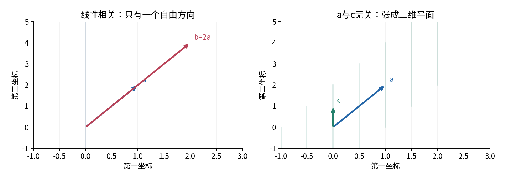
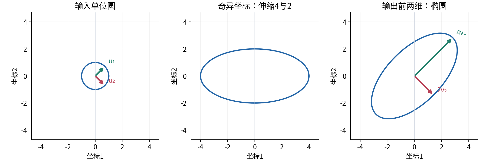
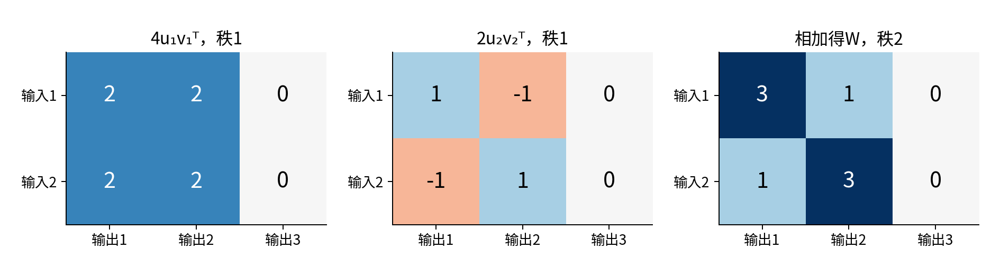
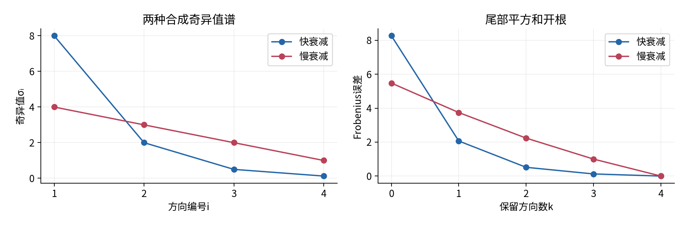
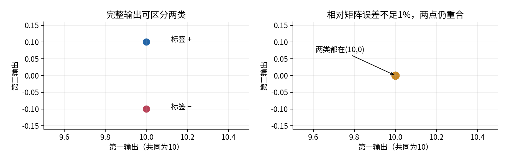
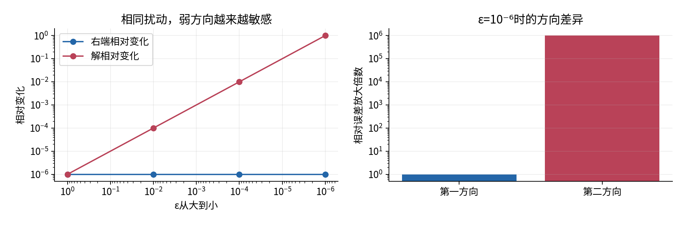
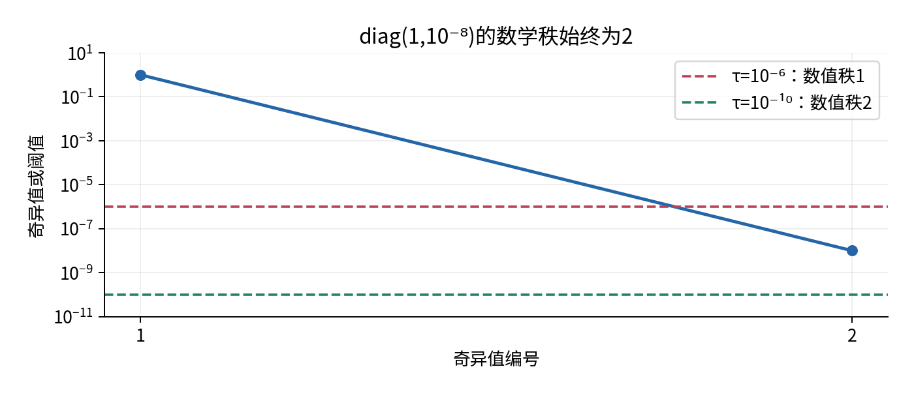
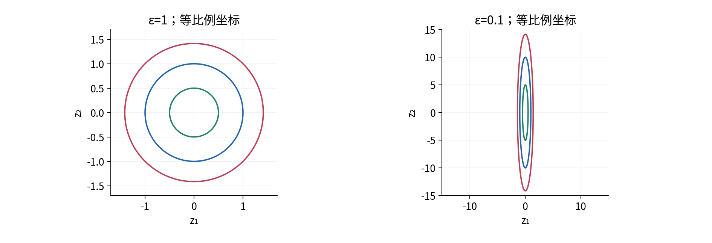
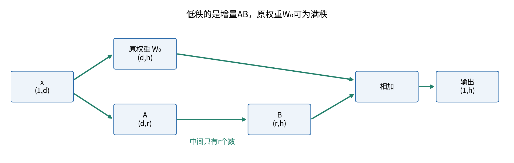

# 秩奇异值与条件数

## 第013单元 一个矩阵保留了哪些方向

表示压缩、病态优化和低秩适配在数学上有什么共同点？它们都迫使我们观察矩阵对不同方向的作用，但三个问题的目标并不相同：压缩问可以舍弃多少，逆问题问哪些误差会被放大，适配问允许改变哪些方向。本讲用同一套方向与伸缩语言连接它们，同时保留这种区别。

先修009。通过先修链，你已经见过实数向量、内积、欧氏长度、正交、矩阵乘法、转置与线性映射。这里不要求010的导数或011的梯度，也不要求知道特征值、行列式或最小二乘。后面提到“优化”时，只分析一个平方误差的几何形状，不预先使用求导规则或收敛定理。

沿用009的行样本约定：输入x形状(1,d)，权重W形状(d,h)，输出y=xW形状(1,h)。批次X形状(N,d)时，Y=XW形状(N,h)。本讲所有教学坐标无量纲；若真实特征使用不同单位，必须先声明尺度，不能把单位改变造成的谱变化当作模型本质改变。

贯穿手算的矩阵是下面的2×3映射。第三输出恒为零，这让“输出通道数”和“独立信息方向数”的区别直接可见。

$$W=\begin{pmatrix}3&1&0\\1&3&0\end{pmatrix},\qquad
(x_1,x_2)W=(3x_1+x_2,\;x_1+3x_2,\;0).$$

完成本讲后，你应能从定义解释秩，手工拆出W的两个正交方向，用SVD重构与截断，分别计算总平方误差和最坏方向误差，并展示“小右端误差、大解误差”的具体例子。最后还要能解释为什么这些数学结论不等于任务准确率保证。

## 一 相关不是数值接近

向量v₁到vₘ的线性组合，是把它们分别乘实数c₁到cₘ后相加。所有这种组合形成它们的张成空间，记span。若存在一组不全为零的系数，使c₁v₁+…+cₘvₘ=0，这组向量线性相关；若只有全零系数能使和为零，它们线性无关。

例如a=(1,2,0)、b=(2,4,0)，有2a−b=0，所以相关。这里不是说它们的长度接近，恰恰相反，长度相差两倍。向量c=(0,1,0)与a无关：若αa+βc=0，看第一坐标便得α=0，再看第二坐标得β=0。一个零向量与任何集合放在一起都会使集合相关，因为可以只给零向量系数1。

一组既线性无关、又能张成该空间的向量称为基；基中向量的个数称为维数。直线是一维，平面是二维。这个“维数”衡量自由方向数，不是向量写了多少个坐标。三维坐标中的平面仍只有两个自由方向。



把定义用于矩阵：W的行空间由所有行向量张成，列空间由所有列向量张成。行空间维数与列空间维数相等，这个共同值是矩阵的秩rank(W)。这项相等性是线性代数的基本定理；后面会利用SVD给出本讲范围内的解释，而不是仅凭一个例子推出它。

对行输入y=xW，输出就是W各行以x坐标为系数的线性组合，因此所有可能输出构成W的行空间。秩正好是输出能够独立变化的方向数。主例两行(3,1,0)、(1,3,0)线性无关：若3α+β=0且α+3β=0，代入β=−3α得到−8α=0，因而α=β=0。秩为2，虽然输出有3个坐标。

## 二 秩与能否恢复输入

若存在非零行向量z满足zW=0，那么x和x+z给出同一输出。所有这样的z构成输入零空间。它揭示不可恢复的信息：被消掉的方向，无论用什么后处理，都不能仅靠相同的输出区分。

对R=diag(1,0)，(2,7)R=(2,0)，(2,−9)R也为(2,0)，第二输入完全丢失。对主例W，zW=0会给出上一节相同的两个方程，只有z=0；虽然输出最后一维无用，输入仍然可由前两维唯一确定。矩形不是不可恢复的同义词。

对d×h矩阵，秩至多min(d,h)。秩等于d称为满行秩，此时行输入没有非零零空间；秩等于h称为满列秩，此时输出能够覆盖整个h维空间。方阵只有满秩时才有双侧逆W⁻¹，满足WW⁻¹=W⁻¹W=I。主例不是方阵，所以不能写一个同时满足这两式的逆；本讲逆问题的条件数推导会明确限制为方阵。

数值程序还有另一个问题：精确的零和很小的正数应怎样区分？diag(1,10⁻¹²)在实数数学里秩为2；如果测量只可靠到10⁻⁶，把第二方向当作不可辨认可能合理。这个决定包含误差尺度，不是数学秩本身发生了变化。第十一节再建立明确阈值。

## 三 特征值回答同一空间中的方向问题

先只考虑n×n实方阵A。采用常见的列向量定义：非零q形状(n,1)若满足Aq=λq，则q是右特征向量，实数λ是对应特征值。它描述一条作用后仍留在同一条直线上的方向；λ为负时方向翻转，λ为零时该方向被消去。零向量被排除，否则任意λ都满足等式，没有信息。

这里临时写列向量，是为了明确标准定义。行映射xA中的不变方向满足qᵀA=λqᵀ，称左特征向量；一般方阵的左右特征向量不同，不能看到q就随意转置。对于对称矩阵A=Aᵀ，两者可对应。

主例的左上2×2块S=[[3,1],[1,3]]满足S(1,1)ᵀ=4(1,1)ᵀ、S(1,−1)ᵀ=2(1,−1)ᵀ。将两个向量除以√2后，它们长度为1且内积为0。于是该对称矩阵沿对角线方向拉伸4倍，沿反对角线方向拉伸2倍。

但是W是2×3，Wq和q的坐标空间不同，不能写Wq=λq。即使方阵也未必有完整的实特征方向：90度旋转矩阵[[0,−1],[1,0]]没有非零实向量保持在原直线上。我们不会用尚未学习的复数特征理论解决它；下一节使用对任意实矩阵都适用的SVD。[1]

## 四 正交坐标让伸缩可以分开看

单位向量彼此正交，就像一组相互垂直的刻度轴。实方阵Q满足QᵀQ=QQᵀ=I时称正交矩阵，其列和行都是正交单位基。对行x，‖xQ‖₂²=xQQᵀxᵀ=xxᵀ，所以正交变换保持长度；它可以旋转或反射，未必只有旋转。

奇异值分解，简称SVD，把任意实d×h矩阵写成：

$$W=U\Sigma V^T.$$

完整形式中U为d×d正交矩阵，V为h×h正交矩阵，Σ为d×h矩形对角矩阵。令p=min(d,h)，Σ对角上的p个非负数按σ₁≥σ₂≥…≥σₚ≥0排列，称为奇异值。除这些位置外Σ的元素均为0。[2]

在行约定下，xW=(xU)ΣVᵀ：先用U变换输入坐标，再由Σ逐方向伸缩或消去，最后用Vᵀ把结果放到输出空间。左奇异向量uᵢ是U的第i列，长度d；右奇异向量vᵢ是V的第i列，长度h。注意“左/右”由分解中位置命名，不是由本课程行输入的先后顺序命名。

$$u_i^T W=\sigma_i v_i^T,\qquad Wv_i=\sigma_i u_i.$$

第一式最直接描述行输入：沿uᵢᵀ输入一个单位长度，得到沿vᵢᵀ、长度σᵢ的输出。如果σᵢ=0，这个方向消失。奇异值是长度伸缩率，因此不会为负；符号或反射由U、V承担。



一般SVD存在性依赖“实对称矩阵有正交特征基”的谱定理，本讲引用该标准定理，不宣称已证明其全部内容。其构造动机可以核对：WWᵀ对称，而且对任意列q，qᵀWWᵀq=‖Wᵀq‖₂²≥0，所以其特征值非负。若WWᵀuᵢ=σᵢ²uᵢ且σᵢ>0，定义vᵢ=Wᵀuᵢ/σᵢ；便得到Wvᵢ=σᵢuᵢ，且这些vᵢ也是正交单位向量。零特征值对应的剩余方向通过补齐正交基处理。[1,2]

这也说明“平方根”来自哪里：奇异值平方等于WWᵀ的非零特征值，也等于WᵀW的非零特征值。两者零特征值的数量可以不同，因为尺寸可能不同。它不是说W自身的特征值总等于奇异值。

## 五 完整手算一个矩形SVD

对W逐项相乘，得到WWᵀ=[[10,6],[6,10]]。让u₁=(1,1)ᵀ/√2，有WWᵀu₁=16u₁；让u₂=(1,−1)ᵀ/√2，有WWᵀu₂=4u₂。因此σ₁=4、σ₂=2，而不是16和4。

按上一节的构造，v₁=Wᵀu₁/4=(1,1,0)ᵀ/√2，v₂=Wᵀu₂/2=(1,−1,0)ᵀ/√2。取v₃=(0,0,1)ᵀ补齐输出基。完整形式可写成：

$$U=\frac1{\sqrt2}\begin{pmatrix}1&1\\1&-1\end{pmatrix},\quad
\Sigma=\begin{pmatrix}4&0&0\\0&2&0\end{pmatrix},\quad
V^T=\begin{pmatrix}1/\sqrt2&1/\sqrt2&0\\1/\sqrt2&-1/\sqrt2&0\\0&0&1\end{pmatrix}.$$

检验不应止于“调用库后有三个数组”。先检查UᵀU=I₂、VᵀV=I₃；然后检查乘积：UΣ的两行分别是(4/√2,2/√2,0)、(4/√2,−2/√2,0)。右乘Vᵀ后第一行变成(3,1,0)，第二行变成(1,3,0)，正好返回W。

只保留前p列的U与V，得到经济形式，也称约简形式：Uₚ(d,p)、s(p,)、Vₚᵀ(p,h)。此时对角矩阵diag(s)形状(p,p)，乘积仍为(d,h)。约简并不意味着丢掉非零奇异值，p只是min(d,h)；它可能仍包含零奇异值。不要把full_matrices=False误读成“自动做低秩近似”。

程序对本例返回U(2,2)、s(2,)、Vt(2,3)。变量Vt已是Vᵀ，重构应写U @ np.diag(s) @ Vt，不是再对Vt转置。不同库可能同时把某一对uᵢ与vᵢ取反，乘积不变。奇异值重复时，重复子空间中的正交基也不唯一；因此测试重构、正交性和子空间，不逐元素硬比奇异向量。

## 六 秩一部件和方向能量

外积uᵢvᵢᵀ的形状是(d,1)(1,h)=(d,h)。它的每一行都只是vᵢᵀ的倍数，所以非零外积的秩为1。SVD因此可以展开为一串秩一部件之和：

$$W=\sum_{i=1}^{p}\sigma_i u_i v_i^T.$$

主例第一部件4u₁v₁ᵀ=[[2,2,0],[2,2,0]]，第二部件2u₂v₂ᵀ=[[1,−1,0],[−1,1,0]]。相加后得到原矩阵。第一部分只看输入的和，第二部分只看输入的差。输入(1,1)只使用第一部分，输入(1,−1)只使用第二部分。



正交坐标变换不会创造或消灭线性独立方向，Σ则每有一个非零对角元就保留一个独立方向。因此rank(W)恰好是非零奇异值的个数。Σ的行空间和列空间都具有这个维数，左右乘可逆正交矩阵不改变维数，所以也解释了第一节使用的行秩等于列秩。

把矩阵所有元素平方相加后开根，定义Frobenius范数：‖W‖F=√(ΣᵢⱼWᵢⱼ²)。它把整个矩阵的元素误差当作一个长向量衡量。由于正交变换保持长度，‖W‖F²=Σᵢσᵢ²。主例左边为9+1+1+9=20，右边为16+4=20，吻合。

这里“能量”只是一种对平方大小的简称，不自动表示物理能量或任务价值。若矩阵的各列使用不兼容的单位，平方相加在应用上可能没有意义；必须先确定比较尺度。

## 七 截断怎样产生可计算的误差

选整数k，0≤k≤p，只保留最大的k个奇异值及对应向量，定义Wₖ=Σᵢ₌₁ᵏσᵢuᵢvᵢᵀ。空和W₀为全零矩阵。Wₖ的秩至多k；当第k个奇异值为正且k>0时秩恰为k。余下部分E=W−Wₖ就是被丢掉的尾部。

为了算误差，先把矩阵内积定义为逐元素乘积再求和。两个不同外积部件的内积为(uᵢᵀuⱼ)(vᵢᵀvⱼ)=0，而每个uᵢvᵢᵀ的Frobenius范数为1。将E展开后平方，所有交叉项都消失，于是：

$$\|W-W_k\|_F^2=\sum_{i=k+1}^{p}\sigma_i^2.$$

这一步是本讲完整推导，不是用实验曲线替代证明。主例k=0、1、2对应Frobenius误差√20、2、0。保留第一项的平方能量占比16/20=80%，但相对Frobenius误差是2/√20≈44.72%，不是20%。能量比例与长度比例之间差一个平方和开根，报告时必须写清。

另一种量是算子2范数，或谱范数：‖W‖₂=max₍‖x‖₂₌₁₎‖xW‖₂。它关注一个单位输入可能产生的最大输出长度。将x展开到U的正交基，输出长度平方是Σᵢσᵢ²cᵢ²，而Σᵢcᵢ²=1，因此上界为σ₁²；取x=u₁ᵀ时达到，故‖W‖₂=σ₁。同理，截断余项的谱范数为σₖ₊₁；k=p时定义其值为0。



对任何行输入x，都有‖x(W−Wₖ)‖₂≤‖x‖₂σₖ₊₁。这是绝对输出误差界；若真实输出本来接近0，相对输出误差仍可能很大。只有同时说明输入范围、误差度量与可容忍误差，才能据此选k。

## 八 什么意义下它是最好的低秩近似

Eckart–Young定理说：在所有实的、秩至多k的同形矩阵B中，Wₖ同时达到最小Frobenius误差与最小谱范数误差，最小值分别为尾部平方和开根与σₖ₊₁。[3] 这是无额外约束的矩阵近似定理，不要求B元素非负、稀疏、整数，也不规定其任务准确率。

上一节只证明了截断自身的误差公式，还不足以证明没有其他低秩矩阵更好。这里补上Frobenius情形的理由。设B的行空间维数r≤k，P是到该空间的正交投影，意味着把一个行向量保留在该空间内的分量。因为B=BP，误差可以分成垂直的两部分：W−B=W(I−P)+(WP−B)。逐行用勾股定理，便有‖W−B‖F²≥‖W(I−P)‖F²。

对W的每个单位右奇异方向vᵢ，令aᵢ=‖Pvᵢ‖₂²。投影不增长度，所以0≤aᵢ≤1。把vᵢ补成整个输出空间的正交基后，全部aᵢ之和为r：若把投影空间的r个正交单位基记为eⱼ，aᵢ=Σⱼ(eⱼᵀvᵢ)²；交换求和顺序，每个eⱼ在完整正交基中的坐标平方和等于1。

对i>p令σᵢ=0，以下涉及完整输出基的求和都到h为止。因此保留下来的平方量至多Σᵢ₌₁ᵏσᵢ²。理由很直观也可逐步交换证明：把总量最多k、每项至多1的“权重”aᵢ分配给降序的σᵢ²，最优是先把最大的k项填满；若较小项有权重而较大项未满，移过去只会增加或保持总和。于是：

$$\|W-B\|_F^2\geq\sum_i\sigma_i^2(1-a_i)
\geq\sum_{i>k}\sigma_i^2=\|W-W_k\|_F^2.$$

这就把Frobenius最优性接到了投影、正交和排序上。谱范数最优性的完整一般证明留作后续线性代数阅读，本讲准确引用定理，不把上述Frobenius证明冒充它。若σₖ=σₖ₊₁，可能有多个同样好的截断方向，例如I₂保留任意一个单位方向都给出Frobenius误差1，不能要求唯一的分解。

## 九 重构误差小仍可能丢失全部标签信息

考虑H=diag(10,0.1)，它的奇异值为10与0.1。截成秩1只留下第一个坐标，相对Frobenius误差0.1/√100.01≈0.0099995，不到1%。现在定义两类输入：x₊=(1,1)、x₋=(1,−1)，标签由第二输入的正负决定。完整输出分别为(10,0.1)、(10,−0.1)，仍然可区分；截断输出却都成为(10,0)。

这不是统计推测。两个输出完全相同，任何只接收这个输出的确定性规则都无法同时给它们不同的正确标签。对于这两个等量样本，强制给相同预测时至多对一个。小能量方向恰好承载所有区分信息，所以“保留99%以上能量”不能保证保留分类信息。



权重压缩与数据表示压缩也不完全相同。用‖W−Wₖ‖F选权重近似时，默认平等看待权重元素；真实数据X上的误差是‖X(W−Wₖ)‖F，取决于输入经常出现哪些方向。对数据矩阵X本身做SVD，则近似的是这批数据，不能直接等同于权重压缩。中心化、训练验证拆分以及更完整的任务实验将在后续单元展开。

## 十 条件数衡量逆问题对扰动的敏感度

现在限制W为可逆n×n实矩阵，求行向量x使xW=b。若只改变已知右端，得到(x+δx)W=b+δb，两式相减便得δxW=δb，即δx=δbW⁻¹。这是精确有限差分关系，不使用微积分。

由谱范数的定义，‖δx‖₂≤‖δb‖₂‖W⁻¹‖₂；另一方面b=xW给出‖b‖₂≤‖x‖₂‖W‖₂。当b非零时x也非零，将两式组合：

$$\frac{\|\delta x\|_2}{\|x\|_2}\leq
\underbrace{\|W\|_2\|W^{-1}\|_2}_{\kappa_2(W)}
\frac{\|\delta b\|_2}{\|b\|_2}.$$

κ₂称为2范数条件数。SVD的逆把每个非零伸缩率σᵢ变成1/σᵢ，因此‖W⁻¹‖₂=1/σₙ，得到κ₂(W)=σ₁/σₙ≥1。它是给定尺度和范数下的最坏情况相对放大上界；不是说每一次扰动都恰好放大κ倍。奇异方阵没有唯一逆，本讲将其逆问题条件数记为无穷大，不能继续使用上述可逆推导。[4]

选Wε=diag(1,ε)，0<ε≤1，b=(1,0)，则x=(1,0)。令δb=(0,δ)，解变为x+δx=(1,δ/ε)。右端相对变化为|δ|，解相对变化为|δ|/ε，放大倍数恰为1/ε=κ₂，达到了上界。

ε=10⁻⁶、δ=10⁻⁶时，右端只变百万分之一，解却由(1,0)变为(1,1)，相对变化100%。如果同样大小的扰动改沿第一坐标δb=(δ,0)，解只变(δ,0)，放大倍数1。这两种实验共同说明：条件数大表示存在危险方向，不表示所有方向都同样危险。



残差与解误差也不能混为一谈。对ε=10⁻⁶，候选x̂=(1,1)相对真实x=(1,0)误差为1，但代回原方程残差x̂W−b=(0,10⁻⁶)很小；它恰好精确满足轻微改变的右端。算法能做到小残差，仍不能消除问题本身的敏感性。实际求解优先使用线性求解器，不为了套公式而先显式求逆。[5]

## 十一 数值秩和病态不是一个开关

精确秩只判断σ是否等于0，数值秩则在声明阈值τ≥0后计算超过τ的奇异值个数。本实验明确使用σ>τ，恰等于τ的值不计入。NumPy的matrix_rank默认阈值还会考虑最大奇异值、矩阵尺寸与浮点机器精度（1附近相邻可表示数的间隔）；那是舍入误差启发式，不是测量噪声的通用模型。[6]

对diag(1,10⁻⁸)，τ=10⁻¹⁰时数值秩为2，τ=10⁻⁶时为1，但精确数学秩始终为2。若把整个矩阵乘10⁶而τ保持不变，数值秩可能变化；若问题要求尺度不变，应说明相对阈值怎样随尺度变化。代码不把数值秩阈值偷偷用于条件数，避免无声地把一个有限病态问题改成奇异问题。



浮点SVD通常把某些精确零算成极小数，因此在一般矩阵上，不能用计算出的最小奇异值恰好非零证明数学可逆。我们的condition2函数报告数值SVD的比值；只有算出的最小值为0才返回无穷大；极端动态范围下，下溢也可能把非零值算成0，不能据此认定数学奇异。数学奇异性的独立判定需利用结构或精确代数。测试用精确的零对角矩阵核验这一边界。

计算WWᵀ是帮助理解SVD的数学桥梁，却不推荐作为一般数值实现。若W非奇异，其WWᵀ条件数是κ₂(W)²，因为奇异值已平方。例如κ=10⁶时平方矩阵条件数达到10¹²，还可能在相乘时丢失有效数字。实验直接调用SVD，不通过先构造平方矩阵再开根计算。[2]

## 十二 病态优化能从哪里看见

不用求导，也能研究平方误差Q(z)=½‖zW‖₂²。z是一行待选择的参数偏差，目标是让Q小。当W=diag(1,ε)时，Q(z)=½(z₁²+ε²z₂²)。固定Q=c>0的点满足z₁²+ε²z₂²=2c，因此形成半轴√(2c)与√(2c)/ε的椭圆。

同样长度的参数移动，在两个方向产生的平方误差尺度相差1/ε²。对一般W，改用SVD坐标a=zU即可得到Q=½Σᵢσᵢ²aᵢ²。于是奇异值解释了这类平方目标为何可能狭长，为什么某些方向变化明显、另一些方向很不明显。对于可逆方阵，其最大与最小平方系数之比为κ₂(W)²。



这只是特定线性残差平方目标的几何。真实神经网络还存在非线性、数据尺度、随机性、不可辨识、损失设计和算法实现等问题；权重矩阵条件数并不能单独解释所有训练困难。尤其不能把某层的κ当成整网损失的条件数，也不能从一个椭圆直接得出“换某优化器一定更好”。后续学习导数、二阶几何和优化器时，再讨论算法如何使用这些结构。

## 十三 低秩适配约束的是增量

如果已得到某个权重W₀(d,h)，为新任务允许增加ΔW，可以把增量写为AB，其中A(d,r)、B(r,h)。行输入的新增输出为(xA)B：先压到r个中间数，再组合到h个输出。因为AB的每一行都是B各行的线性组合，rank(AB)≤r。这一结论不需要学习优化或反向传播。

完整权重变成W₀+AB。若r很小，可调整参数从dh个变成r(d+h)个；只有r(d+h)<dh时，存储这两个因子才比一个稠密增量省参数。例d=h=1024、r=8，因子共有16384个数，对比1048576个稠密增量数。这个64倍只是可训练增量参数数量比，不代表训练速度或总内存也提升64倍。



例如W₀=I₂，A=(1,0)ᵀ、B=(1,0)，AB=diag(1,0)秩1，而W₀+AB=diag(2,1)秩2。低秩增量不等于把预训练权重截成低秩。LoRA原论文采用冻结原权重并学习低秩增量的思想；这里借用的是这种参数化结构，不是在小矩阵上复现大语言模型效果，也不要求LoRA的因子等于W₀的SVD因子。[7]

若已知一个理想增量ΔW★，对它做截断SVD，可以找到矩阵误差意义下的最佳低秩近似；但实际适配时理想增量未知，通常直接从任务数据学习因子。任务损失与Frobenius距离未必一致。把“存在好低秩近似”与“训练一定找到它”分开，才能避免从代数结构跳到未经验证的性能结论。

## 十四 从手算到可核查程序

实验核心代码只依赖NumPy与标准库。读取一个普通二维数组后，先核对shape，再执行SVD。示例中的np.diag把一维奇异值列表放到方阵对角线上；冒号切片表示取选定列或行；@是矩阵乘法。广播形式(U*s)会把s中第i个数乘到U第i列，但先写完整对角矩阵更容易检查。

```python
import numpy as np
W = np.array([[3., 1., 0.], [1., 3., 0.]])
U, s, Vt = np.linalg.svd(W, full_matrices=False)
reconstructed = U @ np.diag(s) @ Vt
assert np.allclose(reconstructed, W)
print(U.shape, s.shape, Vt.shape)
```

allclose比较的是容差内近似相等，不是实数精确恒等式。np.linalg.svd的返回s是一维数组，按非增顺序排列；Vt已经转置。下面用第一个方向构造秩一矩阵，同时用元素平方和检查误差。

```python
W1 = (U[:, :1] * s[:1]) @ Vt[:1, :]
error = np.linalg.norm(W - W1, ord="fro")
assert np.allclose(W1, [[2., 2., 0.], [2., 2., 0.]])
assert np.isclose(error, 2.0)
print(W1, error)
```

np.linalg.solve默认解决列方程Aq=b；为了保持行约定xW=b，要转置成Wᵀxᵀ=bᵀ，求解后再转回来。不能省略转置而恰好依赖对称例子蒙混过关，测试还包括非对称矩阵。

```python
from experiment import solve_row, perturbation_case
print(solve_row([[2., 1.], [0., 3.]], [[4., 8.]]))
print(perturbation_case(1e-6, 1e-6)["perturbed_x"])
```

第一行应为[[2,2]]，因为(2,2)[[2,1],[0,3]]=(4,8)。第二行为[[1,1]]。脚本先检查非空二维、实数dtype、转成float64后仍有限；拒绝布尔、复数、文本、NaN和无穷。已有数值数组可能在调用前把布尔提升成数字，无法恢复历史；原始列表中的布尔则会提前拒绝。超出数值范围的结果明确报错，不让inf或NaN假装成功。

## 十五 自检练习

1. 判断(1,2,0)、(2,4,0)、(0,1,0)整体是否线性无关，给出一组非零相关系数，并求它们张成空间的维数。
2. 对R=[[1,2],[2,4]]给出一个非零行零空间向量；解释为什么两个不同输入可以有相同输出。
3. 写出主例W的完整与约简SVD各因子shape。为什么s不是一个2×3矩阵？
4. 不调用库，验证主例的两个秩一部件、奇异值和秩。
5. 推导主例k=0、1、2的Frobenius误差与谱误差。保留80%平方能量时，相对Frobenius误差是多少？
6. I₂的最佳秩一近似是否唯一？给出两个不同答案并核验误差。
7. H=diag(10,0.1)的截断为何能在矩阵误差很小时完全丢掉两类标签？改变后续分类器能恢复吗？
8. 对ε=10⁻⁴、δ=10⁻⁶，计算κ₂、相对右端误差、相对解误差和放大倍数。若扰动沿第一坐标呢？
9. 构造小残差但大解误差的候选解，并说清残差是相对于哪个右端。
10. 对diag(1,10⁻⁸)，比较τ=10⁻¹⁰与10⁻⁶下的数值秩。把矩阵乘10⁶后使用原绝对阈值会怎样？
11. 对N=[[0,1],[0,0]]，求实特征值、秩与奇异值。它为什么否定“特征值为零便是零矩阵”？
12. 用W₀=I₂与秩一增量证明低秩适配不要求完整权重低秩。另算d=4、h=3、r=2时因子参数是否更省。

## 来源与学习边界

[1] MIT OpenCourseWare，Strang，18.06 Lecture 29，SVD与特征分解的关系。[课程页](https://ocw.mit.edu/courses/18-06-linear-algebra-spring-2010/resources/lecture-29-singular-value-decomposition/)。本讲引用存在性与谱定理，手算和图形独立构造。

[2] LAPACK Users' Guide，[Singular Value Decomposition](https://netlib.org/lapack/lug/node53.html)；NumPy 2.3，[svd](https://numpy.org/doc/2.3/reference/generated/numpy.linalg.svd.html)。用于核对形状、返回值与官方算法接口，没有把平方矩阵构造当作推荐实现。

[3] MIT 18.065，[Lecture 7 Eckart Young](https://ocw.mit.edu/courses/18-065-matrix-methods-in-data-analysis-signal-processing-and-machine-learning-spring-2018/resources/lecture-7-eckart-young-the-closest-rank-k-matrix-to-a/)。最优性定理适用于声明的矩阵范数，不含任务保证。

[4] NumPy，[cond](https://numpy.org/doc/stable/reference/generated/numpy.linalg.cond.html)。[5] NumPy 2.3，[solve](https://numpy.org/doc/2.3/reference/generated/numpy.linalg.solve.html)。[6] NumPy 2.3，[matrix_rank](https://numpy.org/doc/2.3/reference/generated/numpy.linalg.matrix_rank.html)。[7] Hu等，2021，[LoRA原论文](https://arxiv.org/abs/2106.09685)。只引用低秩增量结构，不把原论文特定模型实验结果推广到本讲。

所有实验是离线CPU合成机制检验，不能作为真实任务压缩率、模型质量或优化器优劣的证据。一般SVD存在性与谱范数最优性明确引用；截断误差、Frobenius最优性和右端条件数界在正文给出推导。数学精确结论与浮点观察分别报告。
