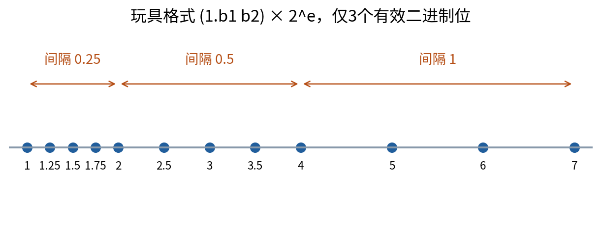
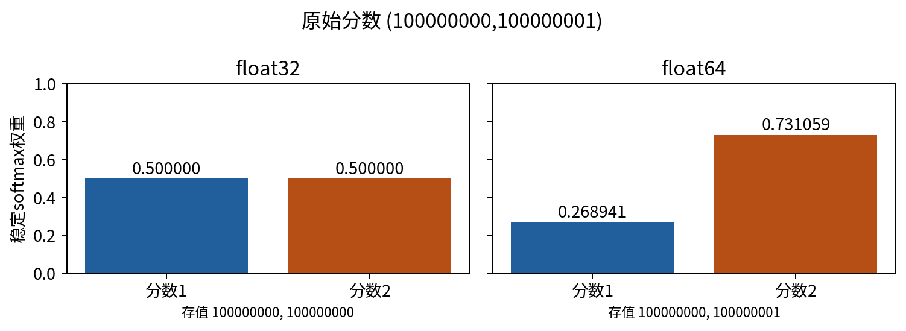
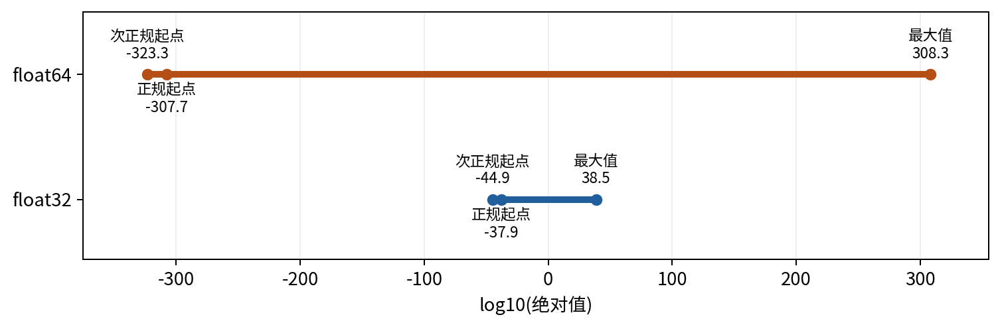
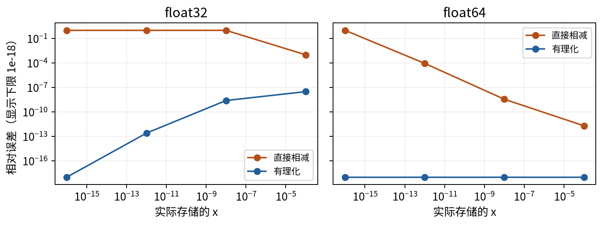
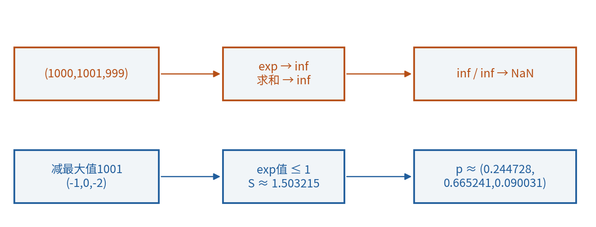
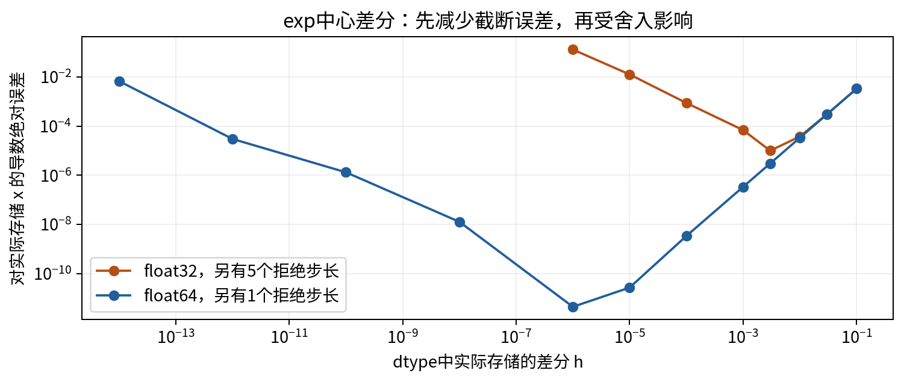

# 浮点数与稳定数值计算

## 第014单元 等价公式为何算出不同结果

纸上算出两个公式相等，并不能保证它们在计算机里产生同样的数值。本讲从一个具体故障出发：三个有限分数(1000,1001,999)经过指数和归一化，结果竟然全是NaN。分数之间仅相差1和2，直觉上完全可以比较；为什么程序先把它们变成了无穷大？又为什么换一种等价写法便能得到正常结果？

先修004、007、010。我们会使用数组dtype、指数对数、导数和中心差分；本讲会补上二进制表示、舍入、误差类型及有限精度的必要概念，不预设数值分析或概率论。这里把softmax定义为一种把实数分数转换成非负、和为1权重的规则，其统计含义留待后续单元。

所有实验是原创无量纲合成数值，CPU即可，用float32和float64比较结果。实验不测GPU速度、内存吞吐或训练精度，也不从小例子断言低精度训练的实际表现。学习目标是遇到异常结果时，能分辨输入信息已经丢失、计算过程不稳定、数学条件不满足，还是近似方法本身有误差。

## 一 有限位怎样表示一个实数

十进制0.625可以写成6/10+2/100+5/1000，也可以约分成5/8。二进制的小数位依次表示1/2、1/4、1/8，因此0.101₂=1/2+0/4+1/8=0.625。下标2声明底数，不是平方。

像1/3无法用有限十进制小数精确写出一样，1/10无法用有限二进制小数精确写出。把约分后的有理数写成有限二进制小数，分母必须只含2的因子；10还含因子5，所以0.1需要无限重复的二进制位。存储位数有限，只能选择附近的可表示数。[1]

为了理解浮点，先想象一套只有3个有效二进制位的玩具系统。正正规数写成(1.b₁b₂)₂×2ᵉ，b₁、b₂各为0或1，e是整数。在[1,2)内可表示1、1.25、1.5、1.75；到[2,4)间隔变为0.5。有效位决定相对细致程度，指数决定能覆盖多大和多小的数量级。

真实的IEEE常用binary32有24个有效二进制位，binary64有53个；这包含正规数的隐含首位1。NumPy的float32与float64在本实验环境对应它们。不要把“32位”误读成32个十进制有效数字；位数还要用于符号和指数。[2]

## 二 epsilon描述1附近的间隔

NumPy的finfo给出某个dtype的数值范围参数。eps定义为1之后下一个更大可表示数与1的差：float32为2⁻²³≈1.19209×10⁻⁷，float64为2⁻⁵²≈2.22045×10⁻¹⁶。它们不是所有数之间固定的绝对距离。在2附近，向上间隔变成原来的两倍；在非常大的数附近，小整数也可能小于间隔。[2]

本讲采用常见的“舍入到最近值，恰好居中时取末位为偶数”的规则解释例子。于是1+eps/2恰好位于1和1+eps中点，舍入回1。我们在实际运行中也记录这个等式是否成立，而不只根据格式名称假设。

对正常范围内、没有上溢或下溢影响、按最近规则正确舍入的基本运算，常用误差模型是fl(a∘b)=(a∘b)(1+δ)，|δ|≤u，其中u=eps/2，∘代表这次基本运算。fl表示浮点计算结果。这个模型有条件，不能机械套给所有输入、所有函数库的exp实现，或把绝对误差都界成eps。接近零的次正规数区域尤其需要另行考虑。[5]

将100000000与100000001转成float32，本实验中两个数都变成100000000，差1的信息在任何softmax运行前就已经消失。float64能在这里保留差1。稳定算法能改进计算过程，但无法从两个完全相同的已存值推回被舍去的输入差别。

## 三 范围与精度是两件事

float32最大有限值约3.40282×10³⁸，float64约1.79769×10³⁰⁸。超过范围的运算可能产生inf。最小正正规值分别约1.17549×10⁻³⁸和2.22507×10⁻³⁰⁸；更靠近零还有次正规数，它们使用不同的有效首位安排，逐步降低相对精度。最小正次正规数约为1.40130×10⁻⁴⁵和4.94066×10⁻³²⁴。[2]

“tiny”通常表示最小正正规数，不是最小正数。进一步变小可能舍入为0；因此underflow不能一概等同于“函数一定返回零”，也可能先得到次正规结果。某些硬件或执行设置可能清零次正规数，本课只报告当前CPU结果，不把它推给所有设备。

NaN表示not a number，是无效运算等路径产生的特殊值，如0/0或inf/inf。inf与NaN都不是一个很大但普通的有限实数。np.isfinite可以检出它们，却检不出前一节完全有限的输入信息丢失。

## 四 同样的加法项会因顺序改变结果

在float64中，考虑a=10¹⁶、b=-10¹⁶、c=1。先算(a+b)+c，a+b为0，再加1得到1；先算a+(b+c)，b+c中的1不足以改变该尺度的存值，结果仍为-10¹⁶，再与a相加得到0。实数加法结合律没有失效，失效的是把每一步已舍入的结果当作精确实数中间量。

不要因为结果都有限就认为它们准确，也不要简单把误差归咎于显示小数位。增加打印精度能帮助看见问题，不能把已丢失的位恢复。math.fsum会跟踪加法中丢失的小量，在本例得到1；它并非让所有运算都变成无限精度。[1]

另一个常见机制是消减：两个近似相等的数相减，原来的绝对舍入误差在很小的结果中占很大比例。并非每次减法都会灾难性失真，关键是输入近似误差与真实差值的尺度关系。

## 五 从消减推导一种更稳定的公式

考察q(x)=√(1+x)-1，实数定义域x≥-1。当x很小时，两个相减的数都接近1，真实结果约x/2。乘以共轭式可精确改写：

$$q(x)=\frac{(\sqrt{1+x}-1)(\sqrt{1+x}+1)}{\sqrt{1+x}+1}=\frac{x}{\sqrt{1+x}+1}.$$

分母至少为1，因此在整个x≥-1定义域不会为0。这个改写避开了两个接近1的数直接相减。比如float64的x=10⁻¹⁶，1+x可能先舍入回1，直接公式得到0；改写公式保留分子x，约得5×10⁻¹⁷。

这不是凭空提高精度，而是让要保留的小量不要先淹没在大数中。它仍受输入转换、平方根实现和其他舍入影响。代码以转换后实际存储的x计算90位Decimal参考，并记录直接式与有理化式；参考也有有限精度，不应称为绝对真值。

绝对误差为|近似值-参考值|；当参考值非零时，相对误差再除|参考值|。参考为0时不能用这条相对误差定义，要改报绝对误差或明确另定尺度。选误差指标本身也需要条件。

## 六 朴素softmax为什么失败

设z有K个有限实数分数，K为正整数。定义：

$$p_i=\frac{e^{z_i}}{\sum_{j=1}^{K}e^{z_j}}.$$

精确实数里，指数均为正，分母也为正，因此每项pᵢ>0，且Σpᵢ=1。本讲称p为归一化权重，不预设概率解释。程序逐项做exp再求和，却可能在这个中间步骤超出dtype范围。

以z=(1000,1001,999)为例，e¹⁰⁰⁰已远超float64范围，分子、分母都变成inf，inf/inf产生NaN。换成(-1000,-999,-1001)时，三个指数可能都舍入为0，分母为0，0/0同样NaN。两个例子都来自合法有限的输入；前向入口isfinite通过，并不能证明中间计算安全。

代码故意保留naive_softmax作为失败基线，它允许产生非有限结果。报告把这些数值写成JSON的null，并另写naive_all_finite=false，避免将非标准NaN字面量作为普通证据。它不是推荐用于后续任务的接口。

## 七 平移不改变权重

取任意实数m，把分子分母同时除以eᵐ，得到精确恒等式：

$$p_i=\frac{e^{z_i-m}}{\sum_j e^{z_j-m}}.$$

选择m=maxⱼzⱼ，使所有zᵢ-m≤0，且至少一项为0。于是指数不超过1、至少一项为1，分母S满足1≤S≤K。计算中不会因为全部指数都极小而让分母变成0，也不会产生指数的正向爆炸。在当前小向量规模，分母求和也远离上溢。

主例m=1001，平移后(-1,0,-2)，指数约(0.367879,1,0.135335)，分母约1.503215。得到p≈(0.244728,0.665241,0.090031)。与原分数相比，改变的是计算路径；精确实数中的定义相同。[3]

极小尾项仍可能下溢。例如(0,-200)的float32指数第二项为0，stable softmax可能返回(1,0)。这满足非负与和为1，却不保持“每项严格大于0”的精确实数性质。float64在本例还能表示e⁻²⁰⁰≈1.38390×10⁻⁸⁷。稳定写法降低特定风险，不会取消有限表示的限制。

本课稳定接口还要求平移差z-m本身有限。对于(-最大有限值,最大有限值)，做差可能先溢出负向范围；程序明确拒绝。更专门的算法可以处理某些这类情况，但本课没有把“接受有限输入”夸大成“覆盖所有有限输入组合”。原始数组和返回值的dtype都必须记录。

## 八 log-sum-exp和log权重不要绕远路

定义LSE(z)=log(Σeᶻⁱ)。照原式先求巨大指数再取log，往往会先失败。用上一节m和S得到：

$$\operatorname{LSE}(z)=m+\log S,\qquad S=\sum_j e^{z_j-m}.$$

因为1≤S≤K，得到m≤LSE(z)≤m+logK。这是精确实数中的界，可以作为常识检查。主例LSE≈1001.4076059644444；稳定权重只需要平移后的指数除S，没必要再用巨大的eᴸˢᴱ作分母。[3]

若想要log pᵢ，直接使用：

$$\log p_i=(z_i-m)-\log S.$$

对(0,-200)的float32例子，先计算p会让尾项成为0，再取log得到-inf；直接上式仍能给出有限的约-200。一个在概率尺度上太小而不能表示的值，其对数仍可能处在正常范围。注意数学上log p不是0，也不能因为p下溢便擅自删除这项的意义。

这一步保留了指数和对数的结构。后续损失函数中如果需要log权重，应优先考虑直接稳定表达式；本单元不提前讲交叉熵，只建立数值计算上的理由。

## 九 差分步长不是越小越好

010用中心差分近似导数：D_h f(x)=[f(x+h)-f(x-h)]/(2h)。本讲把两个误差来源分开。第一种是即使无限精确计算仍存在的截断误差；第二种是输入、函数值和算术的浮点舍入。

对f(x)=x³，代数展开给出D_h f(x)=3x²+h²。真实导数为3x²，截断误差恰好为h²，不用引入无穷级数就能证明这一点。缩小h可以减少这项误差，但不能保证浮点总误差也一直下降。

对更一般的平滑函数，可引用带余项的Taylor定理：若在[x-h,x+h]邻域三阶导数存在、连续且绝对值有上界M，那么中心差分的截断误差不超过Mh²/6。三阶导数是连续求导三次，本讲只使用这一标准结果，不把图上的趋势当作定理证明。[4]

$$\left|D_h f(x)-f'(x)\right|\leq\frac{M h^2}{6}\quad\text{在上述光滑性条件下，精确算术中成立。}$$

直观地，f(x+h)与f(x-h)各自可能带有小的绝对误差；差分相减后仍保留这些误差，再除以2h会将它们放大。当函数值误差约在u|f(x)|尺度、且采样点仍可分辨时，总误差常呈Ah²+B u/h的权衡。A、B与函数、坐标尺度及实现有关；这不是所有函数、所有输入都有相同常数的严格通用界。

## 十 误差参考点也必须一致

float32存储的0.7与float64存储的0.7并不是相同有理数。若把两者都与“十进制精确0.7处导数”比较，就把输入转换误差与差分算法误差混在了一起。本实验先用Decimal.from_float读取各dtype实际存值，再高精度计算exp，专门比较这些点上的差分误差。原始十进制任务误差是另一个问题，应另行记录。

浮点x+h和x-h也未必与x精确相差请求的h。CSV同时记录requested_h、stored_h、actual_plus_step和actual_minus_step。中心差分仍按公式除2乘存储h，步长非对称的影响包含在观察到的误差里；程序没有悄悄换成另一个不等距差分公式。

若两边任意一侧与原x完全相同，程序报Unresolvable input step，不输出伪造梯度。若2h或exp中间结果非有限，则报数值范围失败。零误差、可计算但有误差、无法得到有效比较，是三种不同证据状态。

## 十一 dtype选择需要任务证据

float32占用的单个数值字节数通常是float64的一半，但由此不能推出整套程序内存恰好减半，更不能推出耗时减半。算法可能被数据搬运、控制流程或其他数据类型主导；硬件对各dtype的支持也不同。本课只比较数值结果，不做性能推荐。

选择低精度前，应检查分数范围、是否丢失关键差异、归一化是否稳定、中间结果是否有限、输出误差相对任务容忍度多大。float64也不是稳定公式的替代品：e¹⁰⁰⁰在两种格式中都溢出；反过来，对本例安全范围里的计算，float32也能给出足够准确的权重。

验证不能只写“没有报错”。至少记录输入dtype、实际存值、参考的定义、绝对或相对误差、失败状态和环境版本。若误差指标使用相对尺度，说明参考接近零时的处理。原始布尔值、复数、文本、非有限数和不支持的shape应在入口拒绝，避免无声变换成另一类问题。

## 练习

1. 把0.625写成二进制有限小数；说明为什么0.1不能用有限二进制位精确表示。
2. 在3有效位玩具格式中，列出[4,8)内的四个可表示数及间隔。解释指数与有效位的不同作用。
3. 解释eps、unit roundoff、最小正规数、最小次正规数与最大有限数，指出不能互换的两个概念。
4. 手算两种加法括号顺序怎样产生1和0，并解释为什么isfinite无法发现该误差。
5. 完整推导√(1+x)-1的有理化式，检查x=-1和x=0的定义域及结果。
6. 对(1000,1001,999)手算平移后的指数、归一化权重和LSE，给出LSE的上下界。
7. 为什么把所有分数都减去同一常数不改变精确softmax？是否任何两个分数差都会在float32中保持不变？
8. 解释(0,-200)在float32里尾概率可为0而log权重仍有限的原因。
9. 对x³证明中心差分误差恰为h²；如果只看一个h的零误差，能否断言一般算法精确？
10. 从Ah²+B u/h模型推导最小点的h与u的三次方根成比例，列出这个推断的前提与局限。
11. 解释为什么必须区分请求步长、存储步长与实际扰动，以及为什么本实验两种dtype使用各自的参考点。
12. 设计一份dtype改动的验收记录，使它能区分有限但错误、尾项下溢、输入信息丢失和真正通过的数值检查。

## 来源与下一步

[1] Python官方文档，[Floating-Point Arithmetic](https://docs.python.org/3/tutorial/floatingpoint.html)，用于核对二进制表示、显示与存值、加法误差和高精度检查方式。

[2] NumPy 2.3官方文档，[finfo](https://numpy.org/doc/2.3/reference/generated/numpy.finfo.html)，用于核对eps、位数、正规/次正规范围；本课具体数值由当前运行版本另行导出。

[3] SciPy官方文档，[logsumexp](https://docs.scipy.org/doc/scipy/reference/generated/scipy.special.logsumexp.html)，用于核对稳定计算的目标；本课平移推导、向量、代码和图均为原创，不依赖SciPy执行。

[4] OpenStax Calculus Volume 2，[Taylor and Maclaurin Series](https://openstax.org/books/calculus-volume-2/pages/6-3-taylor-and-maclaurin-series)，用于核对带余项的Taylor定理；本课中心差分的三次多项式证明单独展开。

[5] David Goldberg，[What Every Computer Scientist Should Know About Floating-Point Arithmetic](https://docs.oracle.com/cd/E19957-01/806-3568/ncg_goldberg.html)，Oracle官方保存的授权论文重印，用于核对最近舍入、相对误差和消减条件。注意文献对machine epsilon的命名不完全一致，本讲以NumPy eps及u=eps/2的明确定义为准。

接下来遇到训练或推理中的NaN、巨大误差或低精度变化，应先回到输入范围、实际dtype和中间计算路径。本讲的稳定公式解决具体数值风险，并没有替代模型、数据与任务本身的检查。
