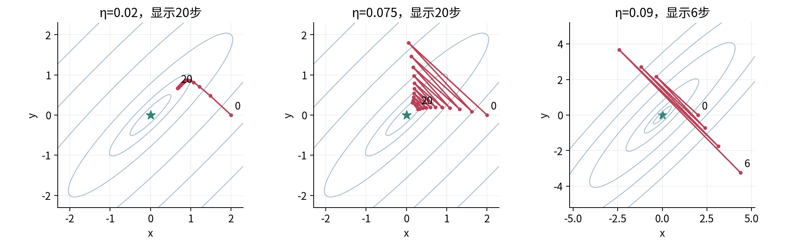

# 局部近似与优化几何实验

## 目标与运行边界

本实验用同一个解析二维二次函数，把纸笔推导、实际递推和独立核验连起来。你要解释稳定步长的严格上界0.08、边界处的损失平台25、改变坐标尺度为何会改变迭代，并用另一个非二次函数检查Taylor余项。仅看程序不报错不算完成。

先修011和013；保留行向量shape(1,2)，H为(2,2)。实验无量纲、无训练数据、无随机抽样、无需网络、无需GPU。数据文件是原创函数参数，seed字段只作保留元数据，当前计算没有任何随机性。

在单元目录打开终端。若尚未创建环境，可使用已有Anaconda或兼容conda客户端执行下列步骤。environment.yml固定核心Python和NumPy版本；本机验证不等于已在所有操作系统完成全新安装。

```bash
conda env create -f environment.yml
conda activate dl-unit-015
python experiment.py
python test_experiment.py
jupyter lab experiment.ipynb
```

Notebook应从本单元目录打开，选择Python环境，然后Restart Kernel and Run All。发布Notebook保留了真实内核顺序执行结果，便于对照。作者使用新的Python进程和真实IPython InProcessKernel执行全部代码单元，未测试浏览器Jupyter界面、独立内核的socket传输，也未在本轮新安装Anaconda。正常本地Jupyter仍建议按上述方式自行验收。

## 一 先写出不可更改的数学问题

打开data/config.json，核对H=[[13,−12],[−12,13]]，初值θ₀=(2,0)，步长列表0.02、0.04、0.075、0.08、0.09，每次60步。目标为q(θ)=θHθᵀ/2。全局最小点是0，因为H正定且q≥‖θ‖²/2；这个结论先由函数结构给出，不由实验末行推断。

先在纸上完成三行：q₀=26，g₀=(26,−24)，H的特征值为1与25。不要先读outputs中的答案来反向凑计算。取单位特征方向q₁=(1,1)ᵀ/√2、q₂=(1,−1)ᵀ/√2，z=θQ，则z₀=(√2,√2)。

程序对称性检查要求H精确等于转置，不自动修复不对称输入。它不会把读入的(2,)猜成一行，也不会把负特征值当作“小误差”抹成0。这里的严格接口是为了避免问题定义悄悄改变，不是通用数值线性代数阈值政策。

```python
import numpy as np
from experiment import quadratic, gradient, spectrum
H = np.array([[13.0, -12.0], [-12.0, 13.0]])
p = np.array([[2.0, 0.0]])
print(quadratic(p, H), gradient(p, H))
values, Q = spectrum(H)
print(values, Q.shape)
```

预期为26、[[26,−24]]、[1,25]和(2,2)。eigh返回的特征向量按列排列；每列符号可能与手写Q相反，这不影响重构与方向。检查HQ=Qdiag(values)和QᵀQ=I，不逐元素硬比特征向量符号。[1]

## 二 预测首步再运行

使用θ₁=θ₀−ηg₀，对每个步长手算第一步。η=0.075时应得(0.05,1.8)，损失19.99625；η=0.04时得(0.96,0.96)，损失0.9216。问自己：第二个首步更好，是否足以断言60步后也更好？

```python
from experiment import trajectory
for eta in [0.02, 0.04, 0.075, 0.08, 0.09]:
    rows = trajectory(p, H, eta, 60)
    print(eta, rows[1], rows[-1]['loss'])
```

60步后的损失依次约为0.0885379、0.00745672、0.0000892457、25.0000451、1.06449×10¹³。需要解释这些数量级，不要把它们写成通用优化器排行榜。初值、H、固定步数和步长都已人为指定。



## 三 推导而不是试出稳定区间

在纸上先解|1−ηλ|<1，然后取λ=1与25两个条件的交集，写出严格区间0<η<0.08。再检查0、0.08与0.09三个边界或越界情况。条件中的“对所有初值”不能省略。

对η=0.08，z₂每步乘−1，z₁每步乘0.92，因此qₖ=25+0.92²ᵏ。这个序列严格下降，却不趋近最小值0。检查outputs/trajectories.csv时，应同时看x、y与loss三列；只看最后几行loss接近不变，会遗漏参数交替。

再把初值改成[[1.0,1.0]]，用η=0.09运行30步。此时陡峭分量本来为0，只剩乘数0.91的温和方向，所以仍收敛。把“我的某次运行成功”与“所有初值都有保证”区别开，是实验的重要验收点。

还有更隐蔽的反例：从原初值用η=0.08005运行500步。首步损失降低，但陡峭方向乘数为−1.00125，最终增长。它没有违反首步精确下降上界约0.0801229，却违反所有方向的稳定界0.08。

## 四 检查真正的局部近似

设F=x⁴+y²/2，p=(1,1)，δ=(h,2h)。先手写真实值1.5+6h+8h²+4h³+h⁴、一阶模型1.5+6h与二阶模型1.5+6h+8h²。程序调用如下。

```python
from experiment import polynomial, polynomial_gradient
from experiment import polynomial_hessian, local_models
base = np.array([[1.0, 1.0]])
h = 0.1
first, second = local_models(
    polynomial(base), polynomial_gradient(base),
    polynomial_hessian(base), [[h, 2*h]])
actual = polynomial(base + [[h, 2*h]])
print(actual, first, second, actual-first, actual-second)
```

输出接近2.1841、2.1、2.18、0.0841、0.0041。对h=0.2、0.1、0.05、0.025重复计算；脚本已保存到outputs/taylor.csv。用精确公式比较误差，避免相减得到的小误差被舍入掩盖后误认成“误差严格为0”。

有限差分Hessian从梯度出发，不直接调用解析H。对q，精确算术中没有截断误差；对F，x方向估计为12+4h²，h越大偏差越明显。差分一致只是诊断，不证明函数处处C²。

```python
from experiment import finite_difference_hessian
estimate = finite_difference_hessian(
    polynomial_gradient, [[1.0, 1.0]], 0.1)
print(estimate)  # [[12.04, 0], [0, 1]]，允许舍入误差
```

## 五 亲手改变坐标尺度

手写Q=[[1,1],[1,−1]]/√2，S=diag(1,5)，w=θQS。用w中的目标‖w‖²/2、梯度w与η=1做一步，得到w新=0，再映回θ=wS⁻¹Qᵀ。

不要说这是“原算法换了一个显示单位”。在w中使用欧氏梯度更新后，映回θ的更新是θ−ηgθQS⁻²Qᵀ，和θ−ηgθ不同。实验需要解释为什么这次改变了实际路径，也需要指出已知固定H的精确缩放不是一般神经网络中的免费信息。

对照R=x+x²/2+10x⁴+y²/2：原点g=(1,0)、H=I，η=1的更新后R=9.5。即使一点的H看起来圆，也不能保证远处曲率仍然相同。

## 六 故意制造失败并核对异常

以下调用分别测试错误shape、原始布尔输入、不对称矩阵和数值范围。每次只改一个因素；若程序拒绝，这是预期的输入保护，不应把异常删掉让它继续。

```python
from experiment import gradient, step
# 分别执行并记录异常类型
# gradient([2.0, 0.0], H)
# gradient([[np.array(True), 0.0]], H)
# gradient([[2.0, 0.0]], [[13, -12], [-11, 13]])
# step([[2.0, 0.0]], H, 1e308)
```

前三类是TypeError或ValueError，最后是ArithmeticError。输入先递归检查布尔叶子，再转float64，并在转换后检查有限性。若你在调用前已自行创建np.array([[True,2.0]])，NumPy已把True变成1.0，函数无法追溯其原始类型；不要声称任何接口都能恢复被丢掉的历史。

差分h=10⁻²⁰在坐标1附近可能根本不能改变输入，h=10³⁰⁸又会使2h溢出。两者都应该抛出ArithmeticError；失败结果不应记成0误差。极大有限参数也可能在乘法中溢出，输入有限不等于输出有限。有限性检查也不能消除所有下溢：例如q(10⁻²⁰⁰,0)数学上为正，在float64中可能显示0；这不构成精确到达最优的证据。

## 七 文件证据和提交要求

experiment.py是核心函数与完整脚本入口；experiment.ipynb把相同函数分步教学，独立生成notebook_outputs。正式包只保留outputs作为脚本示例输出，Notebook中保留实际单元输出；重复文件夹由运行产生，不重复发布。

outputs/trajectories.csv有5×61=305条数据行，iteration从0到60；taylor.csv有4条数据行；results.json汇总步长因子与首末损失；environment.json记录实际版本。所有计算先完成再写文件，数值失败不会被写成成功记录。若你曾在同一路径成功运行，后来改配置失败，旧成功文件仍可能存在；失败后不可把旧文件当成新结果，应使用新输出目录并检查进程退出码。

独立测试包含99组Fraction标量核验、287个Fraction轨迹状态、Taylor余项、谱重构、边界初值、缩放、有限差分、失效输入、极端数值与两个新进程的输出字节比较。其期望值不由待测矩阵更新函数生成。

提交一段简短解释、手算纸或可读计算过程、成功运行日志以及你修改后的一个受控实验。解释必须回答：0.08从何而来；25的平台是什么；0.08005首步为什么会迷惑人；缩放为何改变更新；哪些结论只在本例成立。

[1] NumPy官方[eigh文档](https://numpy.org/doc/2.3/reference/generated/numpy.linalg.eigh.html)。数学条件与完整证明见lecture；12题详解见answers。这里只验证有限合成计算，不报告真实训练性能或非凸网络全局收敛。
