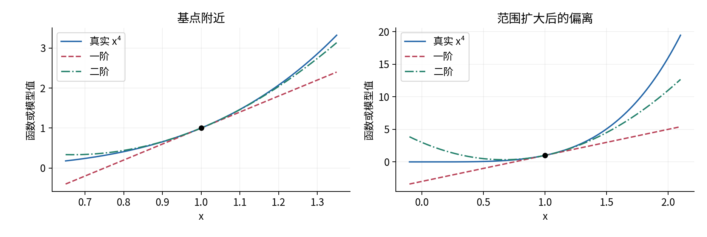
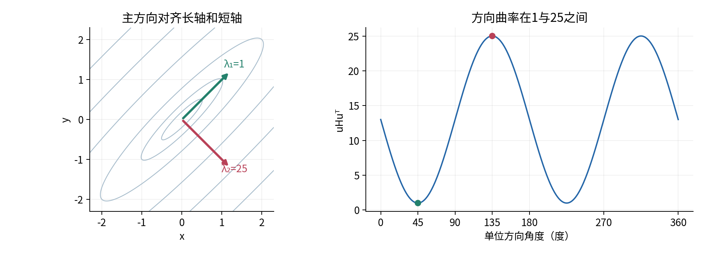
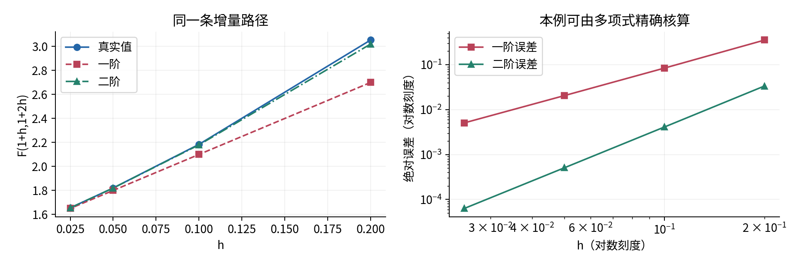
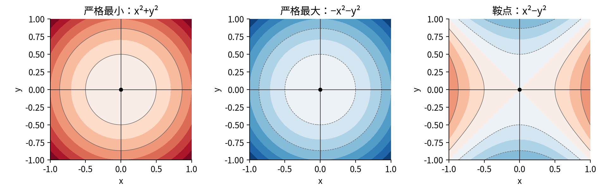
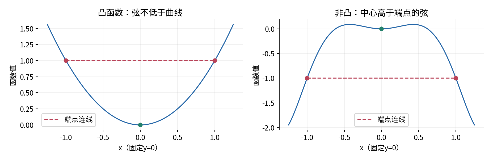
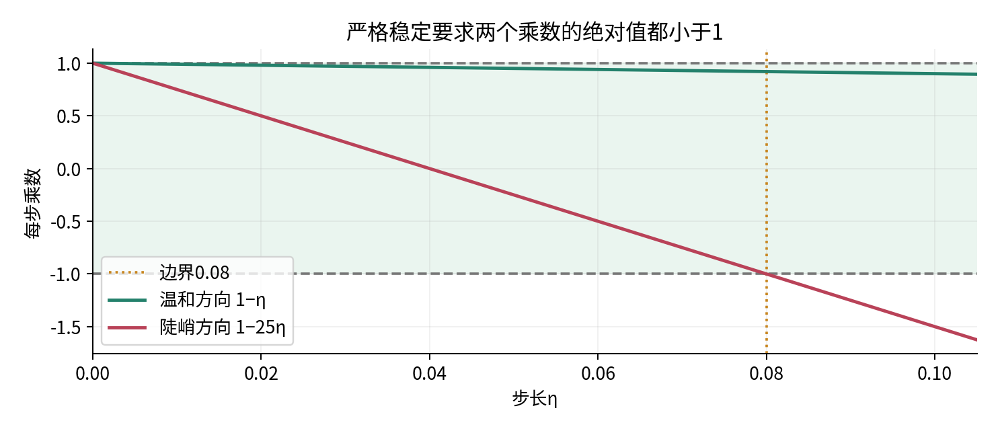
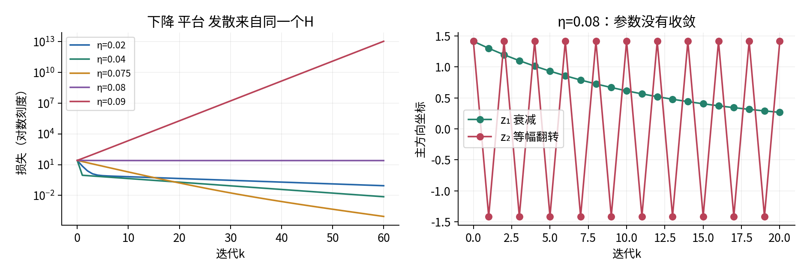
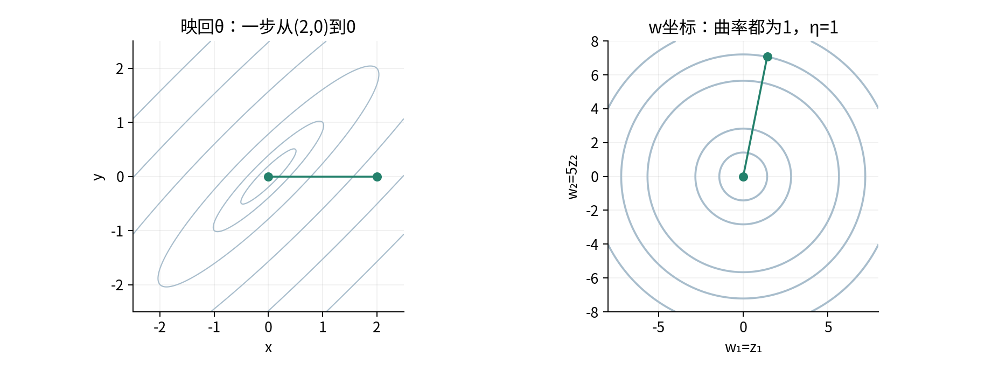
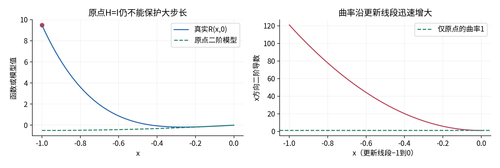

# 局部近似与优化几何

## 第015单元 曲率怎样限制步长

曲率、步长和参数尺度怎样共同影响优化？本讲的答案可以在一个二维碗形函数里完整算出：梯度说明此刻朝哪里下降，Hessian说明不同方向的斜率改变得多快；固定步长要照顾最陡的方向，温和方向却可能因此前进缓慢。改变坐标尺度还会改变“相同步长”的实际含义。只有把这些条件写清，观察到的下降曲线才有可解释的数学含义。

先修011和013。我们使用011的偏导、全微分、行梯度、链式法则，以及013的正交基、对称矩阵特征方向和条件数。011的先修链已提供一元导数与积分。本讲不依赖014，也不使用尚未学习的随机梯度、自动微分或优化器。实验只包含明确给出的合成函数，没有样本抽取，更没有真实神经网络。

参数θ、增量δ、梯度g都采用shape(1,2)的行向量。Hessian H是shape(2,2)的矩阵；gδᵀ和δHδᵀ都是shape(1,1)的乘积，取唯一元素得到标量。推广到d维时分别为(1,d)、(d,d)。本讲坐标和目标值均无量纲。如果真实参数带不同单位，梯度第j项的单位是目标单位除以参数j单位，H的ij项是目标单位除以两种参数单位的乘积；比较曲率大小前必须声明尺度。

读完后，你应能解释三个不同层次的结论：一点附近的近似；沿一次更新线段的下降保证；某类函数上对所有初值的收敛保证。它们的前提越来越强，不能互相替代。

## 一 一阶模型为什么会漏掉回弹

011告诉我们，在可微点p附近，函数有线性模型：

$$f(p+\delta)=f(p)+g\delta^T+r_1(\delta),\qquad
\frac{r_1(\delta)}{\|\delta\|_2}\longrightarrow0.$$

这里g=∇f(p)，极限要求δ从任何方向趋于0。线性部分适合描述很小的移动，但它的斜率不会随δ改变。若一直沿负梯度走，线性模型便一直预测下降；真实函数的坡可能逐渐变平、越过谷底再变陡。因此我们需要一个能表示“斜率也在变化”的下一层模型。

对一阶导数再求导，得到二阶导数f″，它描述斜率的变化率。先看一元f(x)=x⁴，在p=1处f=1、f′=4、f″=12。把x=1+h代入并逐项展开：

$$(1+h)^4=1+4h+6h^2+4h^3+h^4.$$

一阶模型是1+4h；二阶模型是1+4h+6h²。为什么h²的系数是f″/2，而不是f″？因为6h²求两次导数后为12。对小h，二阶模型多记住了斜率的变化；对远处的h，三次与四次项仍可能重要。

这里的“曲率”指沿直线方向的二阶导数，是优化中的用法。它不是微分几何中还要按曲线弧长归一化的曲率。负二阶导数表示向下弯曲，并不直接表示当前函数正在下降：下降还取决于一阶导数。

## 二 沿一条线推导Taylor二阶式

Taylor近似是一种在基点匹配导数的局部多项式近似。本节不是假设函数有无限级数，而是只要求二阶连续可微，记作C²：直到二阶的偏导都存在且连续。

把多维增量固定下来，定义一元函数φ(t)=f(p+tδ)，其中0≤t≤1。假设这条线段及其附近都在f的定义域中，且f在那里为C²。由011的路径链式法则，φ′(0)=gδᵀ。先不展开φ″，利用010的积分基本定理：

$$\varphi(1)-\varphi(0)=\int_0^1\varphi'(t)\,dt,\qquad
\varphi'(t)=\varphi'(0)+\int_0^t\varphi''(s)\,ds.$$

把第二式代入第一式。连续函数在三角形0≤s≤t≤1上交换积分顺序，内层关于t的长度是1−s，得到：

$$\varphi(1)=\varphi(0)+\varphi'(0)
+\int_0^1(1-s)\varphi''(s)\,ds.$$

也可不使用二重积分语言：对(1−s)φ′(s)求导并积分，整理后得到同一个式子。前面只是解释权重1−s从哪里来。若φ″恰好不变，最后一项就是φ″/2，因为从0到1积分1−s得到1/2。

第二次使用链式法则时，δ是固定的速度，不随t变化。因此只须再求各个梯度分量的变化：

$$\varphi''(t)=\sum_{i,j}\delta_i
\frac{\partial^2 f}{\partial\theta_i\partial\theta_j}(p+t\delta)\delta_j
=\delta H(p+t\delta)\delta^T.$$

由此得到精确的积分余项表达式，以及常用的局部二阶模型：

$$f(p+\delta)=f(p)+g\delta^T+\frac12\delta H(p)\delta^T+r_2(\delta),$$

$$r_2(\delta)=\int_0^1(1-s)\delta\bigl[H(p+s\delta)-H(p)\bigr]\delta^T\,ds.$$

定义矩阵算子范数为它对单位向量长度的最大放大倍数，与013一致。内积不等式给出：

$$|r_2(\delta)|\leq\frac12\|\delta\|_2^2
\max_{0\leq s\leq1}\|H(p+s\delta)-H(p)\|_2.$$

H在p连续，足够短的整条线段都落在p附近，最大差趋向0。因此r₂/‖δ‖²趋向0，记为r₂=o(‖δ‖²)。符号o表达一个极限性质，不表示余项严格等于0。C²条件本身也没有承诺统一的三次误差界；若另外知道H在邻域满足‖H(a)−H(b)‖₂≤K‖a−b‖₂，才可把积分继续界成K‖δ‖³/6。符号O(‖δ‖³)表示足够小时被某个固定常数乘‖δ‖³控制，与表示比值趋零的o不同。[1]

## 三 Hessian把二阶偏导放到同一张表

Hessian是由二阶偏导组成的矩阵。本讲采用Hᵢⱼ=∂gᵢ/∂θⱼ，其中gᵢ=∂f/∂θᵢ。二维写成：

$$H=\begin{pmatrix}f_{xx}&f_{xy}\\f_{yx}&f_{yy}\end{pmatrix}.$$

fₓₓ衡量沿x移动时x方向斜率怎样变，fₓᵧ衡量沿y移动时x方向斜率怎样变。在C²假设下，混合偏导相等，H=Hᵀ。这是标准的混合偏导交换定理；本讲引用它，不声称仅凭排成矩阵就能证明对称性。[1,3]

例如f(x,y)=x²+3xy+2y²。先求行梯度g=(2x+3y,3x+4y)，再对每个分量逐坐标求导，得到H=[[2,3],[3,4]]。二阶变化是：

$$\frac12\delta H\delta^T
=\delta_x^2+3\delta_x\delta_y+2\delta_y^2.$$

两个非对角元素共同贡献6δₓδᵧ，再乘1/2得到3δₓδᵧ。只保留H的对角线会漏掉联合变化。更重要的是，这个H的两个对角数都是正数，却沿δ=(3,−2)给出δHδᵀ=−2。只看坐标轴二阶导数，不能判断所有方向的弯曲。

“求两次导数”还要求当前位置确实存在这些导数。|x|在0不可导，不能随意填一个0作为它的经典Hessian。程序可能有自己的约定，但那必须与数学定义分开描述。有限差分也不能消除不可微点。

## 四 二次型和主方向怎样画出谷地

固定对称矩阵H后，δHδᵀ称为二次型：每一项都是两个坐标增量的乘积。对单位行方向u，沿p+tu的二阶导数为uHuᵀ，所以它测量每单位距离的方向曲率。

013已经介绍实对称矩阵有正交特征基。写H=QΛQᵀ，Q的第i列是单位特征向量qᵢ，Λ对角上是实数λᵢ。采用行坐标z=δQ，则δ=zQᵀ，且长度不变。于是：

$$\delta H\delta^T=z\Lambda z^T=\sum_i\lambda_i z_i^2.$$

这一步将混合项变成互不耦合的方向贡献。λᵢ是沿qᵢᵀ的二阶导数；正负号能保留下来。奇异值总是非负，若H不定，用奇异值代替特征值会丢掉上弯与下弯的信息。

全讲的优化主例是：

$$q(\theta)=\frac12\theta H\theta^T,\qquad
H=\begin{pmatrix}13&-12\\-12&13\end{pmatrix},\quad\theta=(x,y).$$

直接相乘，H(1,1)ᵀ=(1,1)ᵀ，H(1,−1)ᵀ=25(1,−1)ᵀ。两个归一化方向为q₁=(1,1)ᵀ/√2、q₂=(1,−1)ᵀ/√2。因此λ₁=1、λ₂=25，z₁=(x+y)/√2、z₂=(x−y)/√2，并且q=(z₁²+25z₂²)/2。

所有λᵢ>0称H正定；所有λᵢ≥0称半正定；既有正值又有负值称不定。负定与半负定类似地用负号定义。等价地，正定要求任意非零δ的二次型都>0，半正定允许某些非零方向为0。主例H正定，条件数κ=λ最大/λ最小=25；这里与013的算子2范数条件数一致，因为正定矩阵的奇异值就是正特征值。

## 五 把近似误差也算出来

为了验证二阶近似，而不是只测试它在二次函数上的恒等式，选另一个函数F(x,y)=x⁴+y²/2，在p=(1,1)取δ=(h,2h)。基点F=1.5，g=(4,1)，H=diag(12,1)。

内积gδᵀ=6h；二次项δHδᵀ/2=(12h²+4h²)/2=8h²。直接展开原函数得到：

$$F(1+h,1+2h)=1.5+6h+8h^2+4h^3+h^4.$$

所以一阶误差为8h²+4h³+h⁴，二阶误差为4h³+h⁴。h=0.1时，真实值2.1841，一阶预测2.1，二阶预测2.18，误差分别0.0841和0.0041。h减半到0.05时，误差分别0.02050625和0.00050625。它们没有严格按4与8倍变化，因为更高项仍在；趋向0时比率才分别趋向4与8。

在真正的二次函数q上，H处处不变，积分余项恰为0，二阶模型在整个定义域都精确。这是主例能够得到全局更新公式的特殊原因。不能从这个特例推出神经网络损失在远处仍是同一个碗。

## 六 驻点和极值先按定义区分

若可微函数在定义域内部某点p满足g=0，称p为驻点。若存在r>0，使所有距离p小于r的定义域内点满足f(θ)≥f(p)，称p是局部最小点；去掉θ=p后全都严格大于时是严格局部最小。全局最小则要求定义域内所有点都满足不等式。局部最大把不等号反向。

可微的内部局部最小点必为驻点：若g≠0，沿−g移动足够短会降低函数，与局部最小矛盾。注意“内部”和“可微”都不能省略。比如在区间[0,1]最小化f(x)=x，最小在边界0，但导数是1；|x|在0最小，却不可导。

若p是驻点且f在其邻域C²，可以利用二阶模型。设H(p)的最小特征值m>0，则δHδᵀ≥m‖δ‖²。因为余项除以‖δ‖²趋0，足够小时|r₂|≤m‖δ‖²/4，于是f(p+δ)−f(p)≥m‖δ‖²/4>0。这样证明了H正定推出严格局部最小，而不只是凭“碗形”的图猜测。

同理，H负定推出严格局部最大。若H不定，取正、负特征方向，二阶主项一正一负，足够短时余项改变不了这两个符号；每个邻域里都有更高与更低值，p是鞍点。这里“鞍点”专指这种既不是局部最大也不是局部最小的驻点。

若H半正定但有零特征值，结论不充分。例如x⁴+y²在原点严格最小，−x⁴+y²在原点是鞍点；两者梯度均为0，H却同为diag(0,2)。更高阶项决定平坦方向的行为。反过来，C²内部局部最小的H必须半正定，因为局部最小时f(p+tu)+f(p−tu)−2f(p)≥0，除以t²并令t趋0便得uH(p)uᵀ≥0；但不必正定。[3]

即使H正定，也只得到局部结论。G(x,y)=x²−3x⁴+x⁶+y²在原点g=0、H=2I，因此原点是严格局部最小，值为0；然而G(1,0)=−1更小。一个明确的远处点就足以否定原点的全局最优性。

## 七 凸性为什么能够连接局部和全局

集合D称为凸集，如果任意a、b∈D及0≤t≤1都有(1−t)a+tb∈D。函数f在凸集D上称为凸函数，如果：

$$f((1-t)a+tb)\leq(1-t)f(a)+tf(b).$$

右边是端点函数值的线性插值，即连线高度。凸函数的图形不超过这条弦。定义不是“只有一个谷底”；常数函数凸，却每一点都最优。严格凸把不同端点与0<t<1时的不等式改为严格，若最小值存在，则最小点至多一个。

对于凸集内部的可微凸函数，由定义取靠近a的线段点，整理为[f(a+t(b−a))−f(a)]/t≤f(b)−f(a)。令t从正侧趋向0，得到一阶支撑不等式：

$$f(b)\geq f(a)+\nabla f(a)(b-a)^T.$$

所以若∇f(a)=0，便有所有b的f(b)≥f(a)，a是全局最小。这里真正跨越局部与全局的是“在整个凸定义域上凸”，而不是单点梯度为0。

开放表示每个域内点周围都有一个仍在域内的小球。在开放凸定义域上，C²函数凸，当且仅当H在每一点半正定。这是可沿线段理解的：φ″(t)=δHδᵀ≥0意味着一维切片的斜率不减，积分后弦总在函数上方；反过来，一维凸切片的二阶导数若存在便不能为负，否则在足够短的对称区间会违反中点不等式。[2] 这项判据量化的是整个定义域，不是只抽查一个点。

主例q的H处处为同一个正定矩阵，q≥‖θ‖²/2，且只在θ=0取到0。因此0是唯一全局最小点。一般凸性不保证最小点存在，例如eˣ在实数轴上趋近0却不能取到0；更不自动保证某个固定步长算法会收敛。目标性质与更新规则仍需分别分析。

## 八 二次主例的一次更新可以精确展开

对q=θHθᵀ/2，因H对称，求偏导得到行梯度g=θH。梯度下降用正步长η更新：

$$\theta_{k+1}=\theta_k-\eta g_k=\theta_k(I-\eta H).$$

k是从0开始的迭代编号，每一步都在当前点重算梯度。η并不是移动的实际距离，实际距离为η‖gₖ‖。固定η不意味着每次走同样远。

将δ=−ηg代入精确的二阶式：

$$q(\theta-\eta g)-q(\theta)
=-\eta\|g\|_2^2+\frac{\eta^2}{2}gHg^T.$$

第一项是沿负梯度的线性收益，第二项是正曲率带来的回弹。当g≠0且H正定时，一次严格下降等价于0<η<2‖g‖²/(gHgᵀ)。这是当前点、当前梯度方向的精确区间，其上界可以大于2/λ最大。

若希望同一个步长对任意非最优点都严格下降，利用gHgᵀ≤λ最大‖g‖²，便得到统一充分条件0<η<2/λ最大。对正定二次函数，这也是保证所有初值收敛所需要的精确范围，下一节证明必要性。一个初值走得好，不能代替“任意初值”的量词。

从θ₀=(2,0)出发，g₀=(26,−24)，q₀=26，‖g₀‖²=1252，g₀Hg₀ᵀ=31252。因此首步的下降上界为2504/31252≈0.0801229。比如η=0.08005首步仍下降，但已超过统一稳定上界0.08，非零陡峭分量最终会增长。这也说明首步下降不足以判定长期稳定。

## 九 从特征方向推导稳定区间

令zₖ=θₖQ。把上一节更新式右乘Q，使用HQ=QΛ，得到每个坐标独立的递推：

$$z_{i,k+1}=(1-\eta\lambda_i)z_{i,k},\qquad
z_{i,k}=(1-\eta\lambda_i)^kz_{i,0}.$$

每轮只是乘同一个数aᵢ=1−ηλᵢ。若|aᵢ|<1，反复相乘趋向0；若aᵢ为负，符号每步翻转但绝对值仍可缩小。若aᵢ=−1则等幅交替，若|aᵢ|>1则非零分量增长。把|1−ηλᵢ|<1两边解开，在λᵢ>0时得到0<η<2/λᵢ。

要让所有方向都收敛，就取这些区间的交集：

$$\boxed{0<\eta<\frac{2}{\lambda_{\max}}}.$$

本例λ最大=25，所以范围是0<η<0.08。证明的条件是：无约束全空间、固定对称正定H、精确全梯度、固定η，以及实数精确算术。浮点计算还需检查数值范围，真实神经网络也通常没有全局不变的H。

必要性也要说清：当η≥2/λ最大，选择初值恰在最大特征方向上且非零，它的乘数绝对值≥1，因此不能趋向0。η=0完全不动，η<0使所有正曲率方向的乘数>1。个别初值若没有不稳定方向分量，可能仍收敛；这不反驳“不能保证所有初值”。

如果H只有半正定，零特征方向的乘数恒为1，参数会保留初始零空间分量。对q=θHθᵀ/2，这些方向不影响损失；适当步长下可以达到某个全局最小点，但不保证参数趋向0，更没有唯一最小点。如果H不定，则负特征方向的乘数1−ηλ>1，本讲正定收敛定理不能套用。

## 十 狭长谷地为何出现折返

主例用同一个θ₀=(2,0)，比较五个步长。表中每行都是独立运行的第一步。

| η | 两方向乘数 | 第一步参数 | 第一步损失 |
|---|---|---|---|
| 0.02 | 0.98，0.5 | (1.48,0.48) | 7.2104 |
| 0.04 | 0.96，0 | (0.96,0.96) | 0.9216 |
| 0.075 | 0.925，−0.875 | (0.05,1.8) | 19.99625 |
| 0.08 | 0.92，−1 | (−0.08,1.92) | 25.8464 |
| 0.09 | 0.91，−1.25 | (−0.34,2.16) | 39.8906 |

η=0.04把陡峭方向一步消为0，之后只沿温和方向以0.96的比例收缩。η=0.075首步改善较小，但两个方向都收缩得较快；在60步时，损失约8.9246×10⁻⁵，小于η=0.04的0.00745672。首步最好的步长不一定在指定迭代次数后最好。

η=0.08更值得警惕。初始z₁=z₂=√2，所以第k步的损失精确为0.92²ᵏ+25。它每一步仍降低，却趋向25而不是最小值0；陡峭方向一直交替。损失单调下降，甚至越来越“平稳”，也不能证明参数收敛或全局最优。

对任意正定二次函数，设最小曲率m、最大曲率M。每步参数误差的最坏方向收缩因子ρ(η)=maxᵢ|1−ηλᵢ|。所有特征值在[m,M]内，绝对值线性函数在区间端点达到最大，所以ρ=max(|1−ηm|,|1−ηM|)。令两端大小平衡，1−ηm=−(1−ηM)，得到η最优=2/(m+M)与ρ最优=(M−m)/(M+m)=(κ−1)/(κ+1)。

本例η最优=1/13≈0.0769231、ρ最优=12/13≈0.923077。误差长度至多每步乘ρ最优，损失至多每步乘ρ最优²。这里“最优”专指固定步长下、对所有初始方向的最坏收缩因子最小；它不是说对某一个初值、某一个步数或非二次函数都最好。

## 十一 改变参数尺度会改变更新路径

正交旋转只改变观察方向，保持长度，不会改变H的特征值。本例θ转成z=θQ后，谷地仍有曲率1和25。进一步令w=(z₁,5z₂)，即w=zS，S=diag(1,5)，则z=wS⁻¹，θ=wS⁻¹Qᵀ，目标变为q=(w₁²+w₂²)/2。

这个变换让等高线变圆，但也改变了坐标中的欧氏距离。用分量链式法则可得行梯度g_w=g_θQS⁻¹；在w中做w新=w−ηg_w，再变回θ，得到：

$$\theta_{\rm new}=\theta-\eta g_\theta Q S^{-2}Q^T.$$

其中S⁻²=diag(1,1/25)。温和方向仍按原比例移动，陡峭方向缩小到原来的1/25。本例QS⁻²Qᵀ=H⁻¹，所以η=1可一步到0。我们没有改变函数在对应点的值，但改变了算法对“单位距离”的解释。

这解释了为什么参数尺度会影响梯度法，也说明为什么不能简单比较两个坐标系里同一数字的η。真实问题可能没有可廉价获取的全局H，H可能随位置变化或不定，数据特征缩放也不等同于精确的参数曲率变换。本例只证明已知二次函数上的机制，不承诺某种归一化总能消除深度网络的优化困难。

## 十二 单点Hessian不能当成整段上界

对于一般C²函数，沿更新δ=−ηg的线段，假设每一点都满足uH(θ)uᵀ≤M‖u‖²，M>0。这里是对所有方向u的统一上界，等价于沿整段的最大特征值不超过M。积分余项式便给出：

$$f(p-\eta g)\leq f(p)-\eta\left(1-\frac{M\eta}{2}\right)\|g\|_2^2.$$

因而当g≠0、0<η<2/M且整条更新线段都在满足条件的区域内时，这一步严格下降。这个论证不要求H正定；它控制上弯速度。但它也没有证明后续迭代留在区域内、参数序列收敛、或达到全局最小。

为何不能直接把M设为H(p)的最大特征值？考虑R(x,y)=x+x²/2+10x⁴+y²/2。在p=(0,0)，g=(1,0)、H=I，单点最大特征值为1。η=1满足1<2/1，更新到(−1,0)，却有R新=−1+0.5+10=9.5，大于旧值0。

在该线段可用M=121，于是统一下降充分范围仅为0<η<2/121，但这仍需注意：如果换η，线段也随之改变。实践中检查一次实际损失变化可以发现错误步长，却不能替代无限时间的收敛证明。后续学习具体优化器时，要继续追问它使用哪些信息、检查哪些条件、声称哪一层保证。

## 十三 实验如何成为证据

实验脚本先验证输入shape和有限值，再生成逐步轨迹、Taylor误差表与结果摘要。核心梯度用θ@H；独立测试用手写标量公式(13x−12y,−12x+13y)和有理数递推核对，避免拿同一段实现验证自己。非二次例子还用精确多项式展开验证余项。

Hessian数值检查对梯度做逐坐标中心差分：Hᵢⱼ≈[gᵢ(p+heⱼ)−gᵢ(p−heⱼ)]/(2h)。先修011已讨论有限差分的截断与舍入。本例的二次函数梯度为线性，精确算术下差分没有截断误差；F的H₁₁差分多出4h²，因此不能要求所有h都完全相等。

程序拒绝把(2,)或(2,1)猜成行向量，也拒绝布尔值、字符串、复数、非有限数、不对称H与越出float64范围的结果。过小h若不能改变输入，或2h溢出，就明确失败。已经被外部程序提升为数值数组的布尔来源无法事后恢复，这项限制在实验指南中说明。有限性检查不能消除舍入、相消和所有下溢；极小非零损失可能显示为0，不能据此宣称数学上已到最优。

同一目标下降、达到该目标的全局最小、在未见数据泛化、在真实场景有用，是不同问题。本单元只证明和检验前两者在声明条件下的关系；没有测试集，也没有任何证据能支持泛化或非凸网络全局收敛的结论。

## 十四 练习与验收

1. 从x⁴在1处的展开求一阶和二阶模型，解释1/2来自哪里，并比较h=0.1时的误差。
2. 以φ(t)=f(p+tδ)推导积分余项式，逐项写出shape。C²为何只直接保证o(‖δ‖²)，不能直接声称O(‖δ‖³)？
3. 对f=x²+3xy+2y²求梯度与H，计算δ=(3,−2)的二次型，说明正对角不够。
4. 手算主例两个特征方向、曲率、q=1等高线半轴与条件数。为什么半轴比是5？
5. 完成F在p=(1,1)、δ=(h,2h)的精确余项，计算h=0.1和0.05的误差比。
6. 用定义和二阶条件判断x²+y²、−x²−y²、x²−y²、x⁴+y²、−x⁴+y²在原点的类型。哪些结论不能只看H？
7. 证明G=x²−3x⁴+x⁶+y²的原点严格局部最小但不是全局最小；用凸性定义找出一个反例线段。
8. 推导二次目标的一次下降区间与所有初值稳定区间，核算首步θ₀=(2,0)、η=0.075，并说明η=0.08005的陷阱。
9. 从递推式解释η=0.08的损失平台25。给出η=0.09仍收敛的特殊非零初值，并解释为何不违背统一界。
10. 推导η最优=2/(m+M)和ρ最优，说明最优所针对的量词。分别取κ=1、25、100解释病态的影响。
11. 用w=zS推导映回θ的更新，说明坐标尺度为何改变梯度路径；核算w初值和η=1的结果。
12. 核算R的错误局部步长规则与正确线段曲率上界。最后列出“二阶模型准确”“损失下降”“参数收敛”“全局最优”“泛化良好”各需要什么额外证据。

验收要求不是记住0.08，而是能从H、步长与初始方向重新推导这个数，能解释边界步长的反例，并从清空状态顺序运行实验。全部详解另见answers，操作步骤另见lab。

## 来源与边界

[1] Goodfellow、Bengio、Courville，作者公开的[Deep Learning 第4章 Numerical Computation](https://www.deeplearningbook.org/contents/numerical.html)，核对Hessian、二阶近似、条件数与局部优化边界。本讲二次主例、余项推导、图形与实验独立编写，未复制原图。

[2] Boyd、Vandenberghe，作者公开的[Convex Optimization 课程讲义](https://web.stanford.edu/~boyd/cvxbook/bv_cvxslides.pdf)，Convex functions与Unconstrained minimization部分，核对凸性、一阶二阶条件及下降分析。一般定理的条件在正文写明；二维固定二次目标的收敛区间在本讲完整推导。

[3] OpenStax作者教材，[Calculus Volume 3 第4.7节 Maxima/Minima Problems](https://openstax.org/books/calculus-volume-3/pages/4-7-maxima-minima-problems)，核对驻点、局部极值与二阶判别的边界。[4] NumPy 2.3官方文档，[eigh](https://numpy.org/doc/2.3/reference/generated/numpy.linalg.eigh.html)，核对对称矩阵特征值按升序返回、特征向量按列返回。数据和图均为原创合成机制演示。
