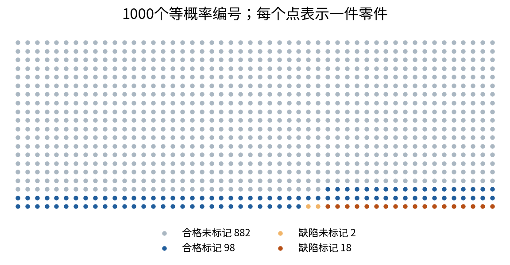
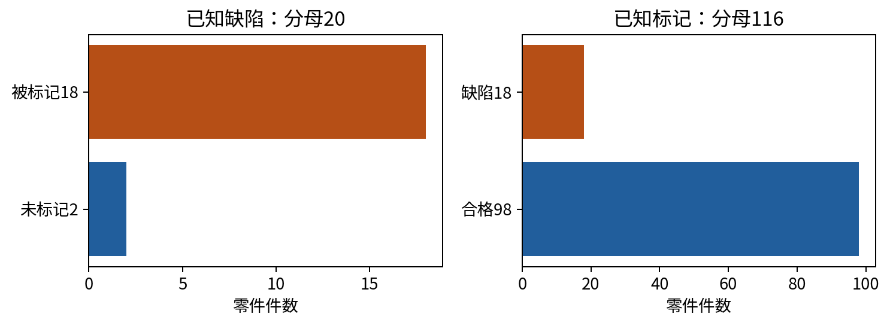
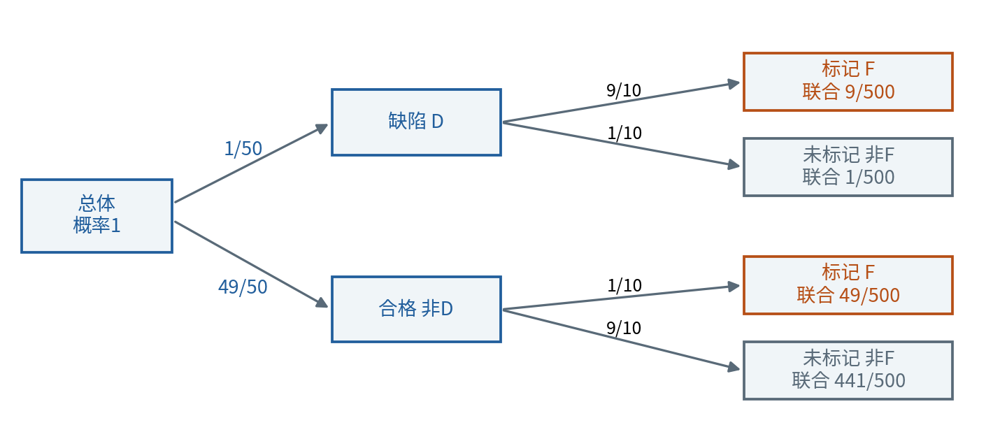
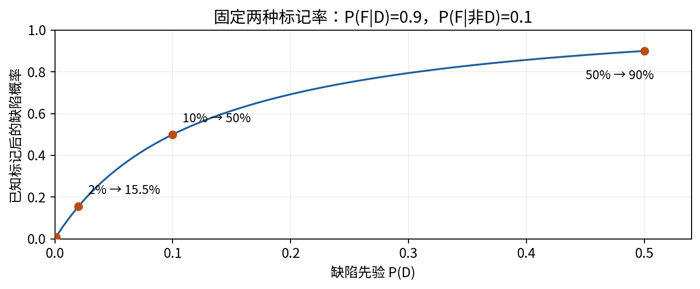
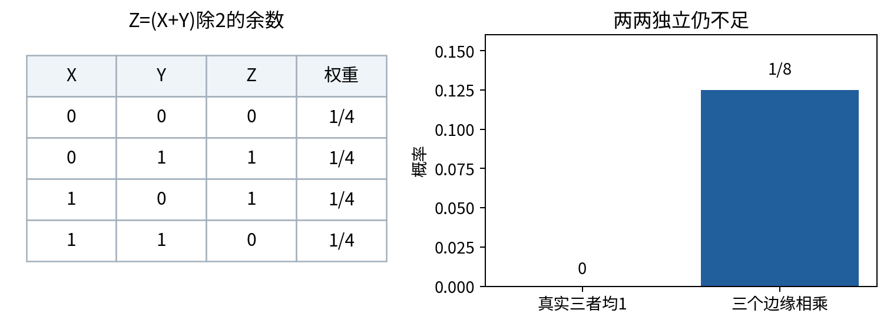
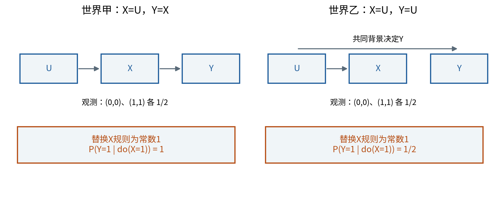

# 随机变量与条件概率

## 第016单元 先说清楚抽什么和已知什么

某个零件检查器能标记90%的缺陷件。现在看到一个被标记的零件，它有90%的概率是缺陷件吗？这个看似只需读出一个百分比的问题，实际缺少另一个方向的分母。我们必须知道缺陷本来有多常见，以及合格件有多少也被标记。本讲从这个原创分类小例子建立概率语言，再解释训练数据中的随机性、条件信息和独立假设。

先修007。只需要集合的直观、比例、加乘除、求和及基础Python函数；集合符号、随机变量、条件概率都会在这里定义。暂不使用连续密度、积分、期望、方差或相关系数。全部数据为人为设计的有限总体，不代表某种真实检查器。我们的确定结论限定在给定模型和抽样方式中。

贯穿例子有1000个编号不同的零件。每件有两个固定属性：是否存在缺陷，是否被检查器标记。随机性来自按规定方式选择其中一件，而不是表格里的数字自己变化。先把这个实验说清楚，概率才有明确对象。

## 一 样本空间和事件

一次实验的基本结果叫样本点，记ω；所有可能样本点组成样本空间Ω。本例抽取一个零件，所以Ω由1000个不同编号组成。假定每个编号被抽到的机会相同，单个编号概率为1/1000。这个“均匀抽取”是模型假设；若实际按尺寸、位置或供应商偏向抽取，不能继续不加说明地使用它。

事件是Ω中的一组样本点。例如D为“抽到的零件有缺陷”，F为“被标记”。发生D，表示抽中的编号属于D。D∩F表示同时属于两组，即既有缺陷又被标记；D∪F表示至少满足其中一项；Dᶜ为D的补集，即全部没有缺陷的编号。∅为空事件，没有编号；Ω为必然事件。[1]

本例的四格计数如下。行是实际属性，列是标记属性；同一个零件只能落在一格，四格合起来包含全部总体。

|实际属性|未标记 Fᶜ|标记 F|行合计|
|---|---:|---:|---:|
|合格 Dᶜ|882|98|980|
|缺陷 D|2|18|20|
|列合计|884|116|1000|

因此D有20个编号，F有116个编号，D∩F有18个编号。注意四种“属性组合”并不是四个等可能结果：它们代表的零件数量不同。把四格各赋1/4，会把实验从“均匀抽零件”换成“均匀抽一种类别”，得到另一个模型。

## 二 从有限权重建立概率规则

一般的有限样本空间可以给每个样本点一个非负权重w(ω)，并要求全部权重和为1。事件概率定义为其中权重的和：

$$P(A)=\sum_{\omega\in A}w(\omega),\qquad w(\omega)\geq0,\qquad\sum_{\omega\in\Omega}w(\omega)=1.$$

均匀抽取只是w都相等的特例。此时P(A)=事件中的编号数/总体编号数。本例P(D)=20/1000=1/50，P(F)=116/1000=29/250，P(D∩F)=18/1000=9/500。零件数量有“件”的单位，比例没有单位。

由定义可知P(Ω)=1、P(∅)=0，且任何事件概率介于0与1。互不重叠的两事件A、B所含样本点没有重复，因此P(A∪B)=P(A)+P(B)。一般有重叠时，相加会把交集算两次，所以：

$$P(A\cup B)=P(A)+P(B)-P(A\cap B),\qquad P(A^c)=1-P(A).$$

本例P(D∪F)=(20+116-18)/1000=118/1000。不能把P(D)+P(F)直接解释成“至少一个成立”，除非先确认二者不重叠。[2]

本讲的有限模型允许某些属性组合权重为0。对有限模型，零概率事件可以包含仅被分配零权重的形式结果；它不一定作为一个集合完全为空。因此我们用“条件事件概率为正”来检查除法，而不是只检查集合里有没有元素。连续空间里的概率零还有别的现象，留待017再扩展。

## 三 随机变量是对样本点的数值记录

随机变量不是“一会儿取这个、一会儿取那个”的Python变量，而是一个预先定义的函数：对每个样本点ω，给出一个数X(ω)。抽样前不知道落在哪个ω，因而不知道这次观察到的X；函数规则本身不必随机变化。[3]

本例可定义X(ω)=1表示零件有缺陷，否则0；Y(ω)=1表示被标记，否则0。事件{X=1}就是D，{Y=1}就是F。X与Y是两个随机变量，同一次抽样产生一对观测(x,y)。大写用于函数，某次得到的小写数用于观察值；这是约定，不是说Python必须使用大写名字。

联合概率P(X=x,Y=y)同时说明一对取值的权重，即四格计数除1000。边缘概率只关心其中一个变量，要沿另一变量的全部可能值求和。例如P(X=1)=P(X=1,Y=0)+P(X=1,Y=1)=2/1000+18/1000。这里“边缘”得名于把联合表加到边缘的行列合计。

如果我们给缺陷状态编码为10、合格为0，概率事件的权重不会变，但变量的数值尺度改变。概率首先描述事件和抽样规则，不是由标签数字的大小决定。018会进一步研究数值变量的均值等摘要，本讲不提前把它们当作已知。

## 四 条件概率重新选择分母

已知这次抽中的零件被标记，意味着只在F里的116个编号中考虑相对比例。缺陷且被标记的有18个，因此：

$$P(D\mid F)=\frac{P(D\cap F)}{P(F)}=\frac{18}{116}=\frac9{58}\approx0.15517.$$

竖线“|”读作“在……条件下”。右侧分母是已知条件F，不是我们希望预测的D。这条定义要求P(F)>0；若条件没有任何正概率质量，就不能从这个有限模型中用比例定义条件概率。[1]

反过来，已知零件有缺陷时，分母是20，标记率为P(F|D)=18/20=0.9。两个式子的分子都与“既有缺陷又标记”有关，但条件分母不同，所以一般不相等。90%的缺陷件会被标记，与15.5%的被标记件有缺陷，是可以同时成立的两个事实。

条件不必是时间上先发生的原因，也不表示主动改变了世界。知道某个检查结果，只是改变当前筛选的样本集合；它没有把合格件改成缺陷件，也没有使检查器的工作机制变成相反方向。

## 五 乘法法则来自定义

把条件概率定义两边乘以P(B)，在P(B)>0时得到P(A∩B)=P(A|B)P(B)。若P(A)>0，同一个交集也可写成P(B|A)P(A)。两式只是用不同顺序描述同一联合事件，不需要A、B独立。[2]

本例可先选缺陷状态，再考虑标记：P(D∩F)=P(D)P(F|D)=(1/50)×(9/10)=9/500。同样P(Dᶜ∩F)=(49/50)×(1/10)=49/500。概率树中，一条路径的边系数依次相乘，互不重叠的终点路径再相加。

不要把“相乘”作为独立的同义词。这里相乘的是边缘P(D)和条件P(F|D)。只有独立时，才能把条件换成无条件P(F)，得到P(D)P(F)。省略竖线可能删掉最重要的依赖信息。

## 六 全概率公式如何把分母补齐

若B₁到Bₖ把Ω分成互不重叠且覆盖全部的若干部分，称它们构成一个划分。事件A也被拆成A∩B₁到A∩Bₖ；这些部分仍互不重叠。因此先从加法得到P(A)=ΣP(A∩Bⱼ)，再对每个正概率分支使用乘法法则：

$$P(A)=\sum_j P(A\mid B_j)P(B_j).$$

写这一条件形式时，每个参与条件概率的Bⱼ需有正概率。若某分支权重为0，可直接在联合形式里贡献0，或明确将其省略，不能先算一个未定义的0/0再说乘0无所谓。

主例D和Dᶜ构成两部分划分，P(F)=0.9×0.02+0.1×0.98=0.116。第一项0.018来自缺陷件正确标记，第二项0.098来自合格件被误标记。误标率只有10%，但合格件数量远多，因此它们在标记群体中占多数。这个分母解释了开头问题，而不是靠某种语言上的反直觉技巧。

## 七 Bayes公式把方向翻过来但保留全部信息

对P(A)>0、P(B)>0的情况，将联合概率的两种表达式相等，解出：

$$P(A\mid B)=\frac{P(B\mid A)P(A)}{P(B)}.$$

这就是Bayes公式。右边P(A)常称先验，P(A|B)称后验；这里表示知道B之前与之后的概率信息，不要求A发生在B之前。P(B|A)描述在A条件下出现B的程度；分母P(B)使所有可能A类别的后验重新归一化。

对二元缺陷模型，记π=P(D)、r=P(F|D)、q=P(F|Dᶜ)，在分母为正时：

$$P(D\mid F)=\frac{r\pi}{r\pi+q(1-\pi)}.$$

代π=1/50、r=9/10、q=1/10，得到(9/500)/(58/500)=9/58。这个后验不能只靠r确定。保持两种标记率不变，把缺陷占比改成1/2，则后验变为0.9；改成1/1000，则后验为9/1008，约0.00893。

本课bayes_flag接口要求先验严格介于0与1，让两个类别都有正质量且两种观察条件率都有定义；标记事件的总质量还必须为正。若某类别完全不存在，应回到联合权重模型，不能硬算该类别上的观察条件率。

在脚本中，输入比例用Fraction或分数字符串保存精确有理数，例如'1/50'。二进制float不作为该接口的比例输入，以避免把显示为0.1的存值误说成精确1/10。最终十进制只用于阅读展示，不反过来作为精确计算基准。[4]

## 八 独立需要检查联合结构

两个事件A、B独立的定义是P(A∩B)=P(A)P(B)。当P(B)>0时，它等价于P(A|B)=P(A)，即知道B不改变A的概率。这个定义即使有零概率事件也有意义，因此代码以乘积式检查，而不一律做条件除法。

主例P(D∩F)=0.018，而P(D)P(F)=0.02×0.116=0.00232，明显不等；所以D与F不独立。相应地P(D|F)≈0.15517与P(D)=0.02不同。这里说两个二元变量存在关联，具体是条件分布改变；不提前借用018才定义的数值相关系数。

独立不是互斥。互斥表示不能同时发生，即交集为空；如果A、B概率都正，互斥使P(A∩B)=0，而P(A)P(B)>0，所以它们反而不独立。独立也不由变量名字、不同列或不同函数调用自动保证。[5]

随机变量X、Y独立，需要对它们所有取值组合都满足P(X=x,Y=y)=P(X=x)P(Y=y)。只检查某一格相等不够，除非另有适用于该特殊结构的完整论证。一个有限样本中看见近似相等，也只是数据证据，不能自动证明未知总体严格独立。

## 九 两两独立不等于共同独立

取两个公平且独立的二元变量X、Y，各为0或1，四种组合各占1/4。再定义Z为X、Y是否不同：不同取1，相同取0，也就是(X+Y)除2的余数。所有可能三元组只有(0,0,0)、(0,1,1)、(1,0,1)、(1,1,0)。

任取两个变量，它们的四种0/1组合各出现一次，所以每对联合权重为1/4，等于边缘1/2乘1/2；三对都两两独立。但三者同时为1的概率为0，而三个边缘概率相乘为1/8，不相等。因此三者不共同独立。

这个例子不是说无关联等于独立，也不是用相关系数替代概率定义；它直接列出有限联合结构并逐项验证。后续对许多训练样本作独立假设时，同样不能只观察两列看起来没关系就结束检查。

## 十 抽样单位决定重复数据意味着什么

现在把总体缩成5个不同零件，其中2个有缺陷。若抽一件后放回，第二次独立地重新均匀抽取，两个位置可由25个等权有序编号对表示。有缺陷的第一件2种选择，第二件也2种，两个都缺陷概率4/25；给定第一件缺陷，第二件仍为2/5。

若不放回，有序编号对只有5×4=20种。两个都缺陷只有2×1=2种，概率1/10；给定第一件缺陷后，只剩4件其中1件缺陷，第二次缺陷概率1/4，不再等于原边缘2/5。抽样机制改变了联合结构，不能用同一独立乘法替代。

同一物体的多张图片、多次传感器读数或重复日志行，往往共享未写在单行里的因素。行数增加不等于同量独立信息增加。这里不计算估计误差大小，那要等018；现在应先记录抽样单位、是否重复同一实体、是否放回以及目标总体。

## 十一 条件筛选和干预改变的对象不同

为精确说明“关联不自动推出因果”，构造两个完全明确的小世界。背景变量U公平取0或1。世界甲先令X=U，再令Y=X；世界乙令X=U、Y=U。无论哪一个世界，观察到的(X,Y)都是(0,0)与(1,1)各1/2，因此P(Y=1|X=1)=1。

现在主动把X固定为1，保留U的原有分布，并按各世界自己的规则重新计算Y。世界甲的Y跟随X，所以Y=1概率为1；世界乙的Y仍跟随U，所以Y=1概率为1/2。我们用do(X=1)简记这种“替换X的生成规则”的干预；它不是从原数据里筛出X=1的样本。[6]

这个反例证明：相同观测联合分布可以对应不同干预结果，因此仅靠观测关联不能唯一决定干预效果。它没有证明现实中永远无法研究因果；随机实验或额外可信机制假设可能提供新信息。模型、假设与数据各自承担什么，必须明确分开。

## 来源与下一步

[1] OpenStax，[Probability terminology](https://openstax.org/books/introductory-statistics-2e/pages/3-1-terminology)，核对样本空间、事件和条件定义。本讲有限权重表独立构造，并显式区分零质量和空集合。

[2] OpenStax，[Two basic rules of probability](https://openstax.org/books/introductory-statistics-2e/pages/3-3-two-basic-rules-of-probability)，核对加法、条件乘法；全概率与Bayes在正文从定义推导。

[3] OpenStax，[Discrete random variables](https://openstax.org/books/introductory-statistics-2e/pages/4-1-probability-distribution-function-pdf-for-a-discrete-random-variable)，核对随机变量与离散权重的基本概念，不在本课引入连续密度。

[4] Python官方[fractions](https://docs.python.org/3/library/fractions.html)，核对精确分数及字符串输入。

[5] OpenStax，[Independent and mutually exclusive events](https://openstax.org/books/introductory-statistics-2e/pages/3-2-independent-and-mutually-exclusive-events)，核对独立、互斥及抽样机制。

[6] Judea Pearl，2009，[Causal inference in statistics An overview](https://ftp.cs.ucla.edu/pub/stat_ser/r350.pdf)，核对条件与机制替换干预的区别。本课两世界及图为原创有限例子，不复制论文图。

下一讲会研究分布与似然如何把这些概率假设放进一个模型。本讲的核心习惯是每写一个概率，先补全它针对哪个抽样实验、哪个事件以及哪个已知条件；数字正确不能替代问题定义正确。

## 练习与应用检查

1. 写出主例Ω的抽样单位及D、F、D∩F、D∪F和Dᶜ的含义，核对四格合计。
2. 从非负权重和为1的定义，推导补集和一般加法公式，手算P(D∪F)。
3. 定义缺陷与标记的0/1随机变量，写出四格联合概率及两个边缘。
4. 分别计算P(F|D)、P(D|F)、P(D|Fᶜ)，逐一说明分母。
5. 从条件概率定义推导乘法法则，再从划分推导全概率公式；写出零概率分支的处理。
6. 不背公式，利用联合概率两种表达式推导Bayes，核对主例后验9/58。
7. 保持两种标记率不变，先验占比改为1/10和1/2，计算后验并解释变化。
8. 用联合乘积式说明主例不独立，再说明两个正概率互斥事件为何不独立。
9. 枚举异或四行，核对三对两两独立及三者不共同独立。
10. 枚举5件中2件缺陷的放回和不放回有序对，计算给定第一次缺陷后第二次的概率。
11. 两个因果小世界为什么具有相同观测分布但不同do结果？具体是哪一条规则被替换？
12. 设计一份训练数据的概率说明，至少声明抽样单位、目标总体、可见条件、未知假设与不能推出的因果结论。

