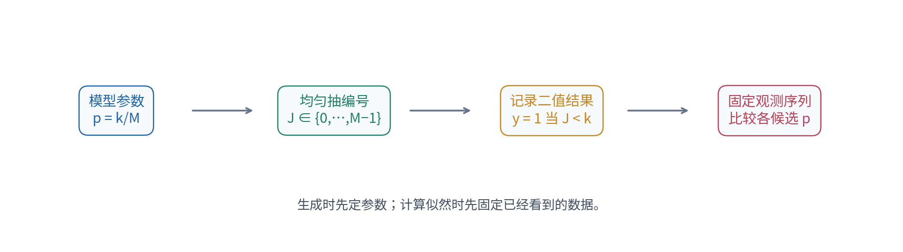
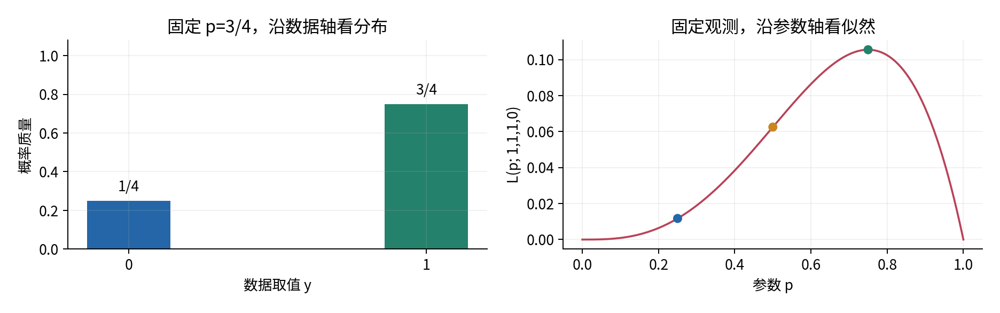
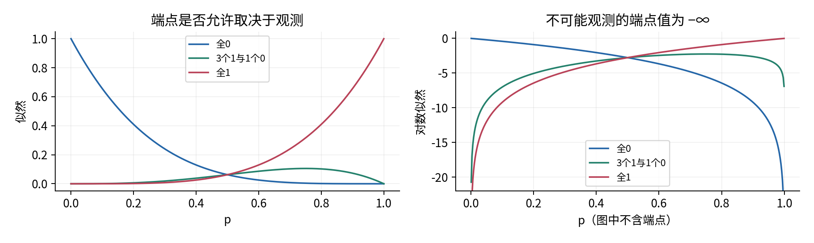
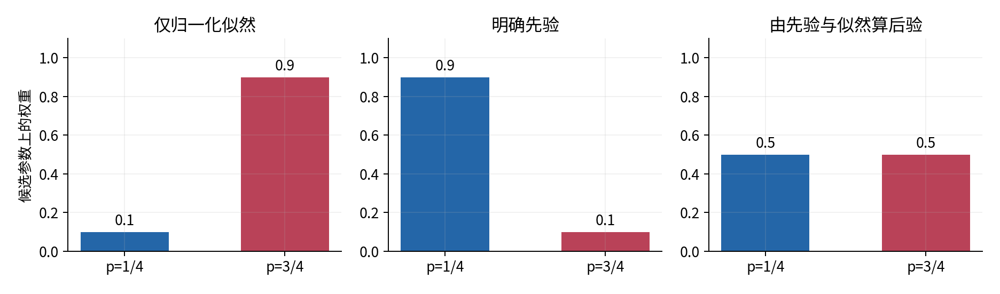
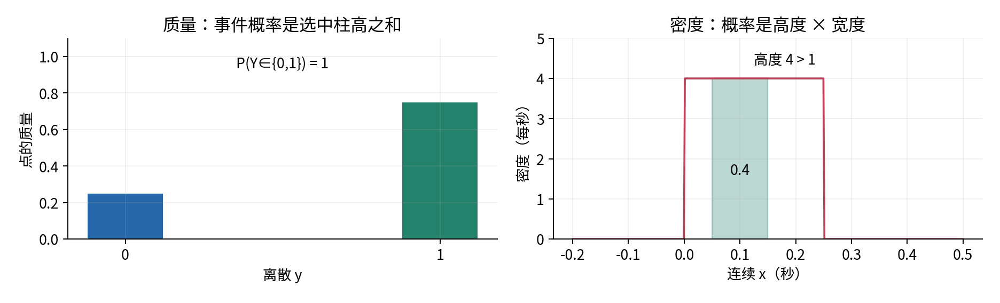
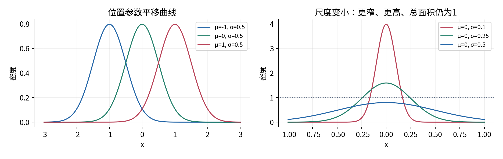
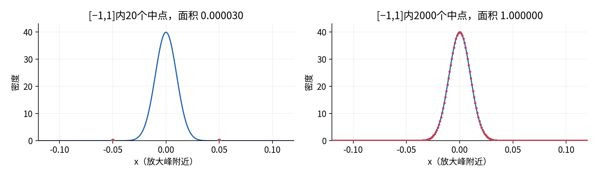
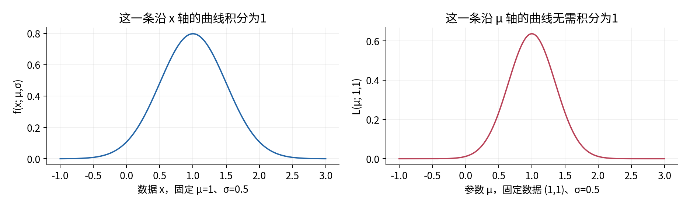

# 分布密度与似然

## 第017单元 模型给出的数究竟是什么

一个二分类器输出0.75，一个连续测量模型输出3.99。前者可能表示某个事件的概率；后者也可能完全合法，却不能读成399%的概率。再把同一公式画成参数的函数，曲线又成了似然。数字相似，不代表它们回答相同的问题。本讲的中心问题是：**模型输出概率或密度时，它究竟在假设什么？**

本讲分成两个有明确入口的部分。第一部分只以016为直接先修，从有限样本空间建立Bernoulli分布、生成器、有限和、似然及对数似然；不需要导数和积分。第二部分开始前必须补完010《导数积分与局部变化》，再学习密度的面积与Gaussian归一化。018才正式学习期望、方差等摘要，本讲不把它们当作已知。正文、实验和练习都有相同的分段标记，可以先完成第一部分再返回连续段。

所有例子和图都是原创合成教学实验。四次二值观测固定为(1,1,1,0)，连续测量的单位先约定为秒。它们不证明真实检查器、分类器或传感器满足本讲模型。

## 第一部分 离散分布 仅需016

### 一 先分清生成机制和观测记录

016中随机变量是从样本点到数值的函数。现在把它用于一个只有两种结果的记录：Y=1表示我们定义的“成功”，Y=0表示相反事件。“成功”可以指检查器触发，也可以指某个按钮被点击，不表示事情一定有益。一个概率模型必须先确定一次观测是什么、0和1对应什么事件、什么条件已知。

用一个标量p表示P(Y=1)。标量就是单个数，不是列表；p的定义域为闭区间[0,1]，没有单位。定义域指允许输入的集合。参数是用于指定模型的量：固定p就选定一种分布，换一个p就得到另一种。参数p不是本次抽到的Y，也不是伪随机种子。种子只决定程序从哪段可复现序列开始。

先看纯有限的生成方法。有M个等可能编号0到M−1，其中k个被标记，规定抽中编号小于k时记1。k和M是整数，M>0，0≤k≤M，于是p=k/M。给定p=3/4，可以令M=4、k=3。抽到0、1、2都记1，抽到3记0。产生观测的顺序是“确定机制，抽编号，记录结果”。

程序的`randrange(M)`返回一个0到M−1的伪随机整数。我们用独立抽取来模拟“每次重新从同一编号盒抽一个”的模型，不把编号拿走；固定seed可复现演示。[1] 真正的物理随机性、跨样本独立性，以及概率是否长期不变，都不是一段代码自动保证的。本讲生成器只接受明确的有理数k/M，不悄悄把任意实数p四舍五入成有限网格。

### 二 分布是各个可能值上的概率安排

一个有限随机变量的概率质量函数给每个可能值分配概率。记qₚ(y)=Pₚ(Y=y)，下标p提醒我们它依赖参数。Bernoulli模型把全部质量放在0和1：[2]

$$q_p(y)=\begin{cases}1-p,&y=0,\\p,&y=1,\\0,&y\notin\{0,1\}.\end{cases}$$

非负性由0≤p≤1保证，总和是(1−p)+p=1。这里的归一化是对**数据所有可能取值**求和，参数p固定。事件A若包含若干可能值，Pₚ(Y∈A)=Σᵧ∈A qₚ(y)。例如p=3/4时，P(Y=1)=3/4，P(Y=0)=1/4，P(Y∈{0,1})=1。每个点已经有完整质量，不需要再乘柱子的绘图宽度。

在0<p<1、y∈{0,1}时，可把两种情况合成qₚ(y)=pʸ(1−p)¹⁻ʸ。将y=1代入，指数分别为1和0；将y=0代入，指数交换。这个写法方便相乘，但端点p=0或1会出现形式上的0⁰。分段定义始终清楚，程序也应依照分段规则，不靠某个语言对0⁰的特殊约定理解模型。

p=0是“永远记录0”的退化分布，p=1是“永远记录1”。它们合法，只是把质量全部放在一个值上。常见混淆是把数学定义域[0,1]误缩成(0,1)，或反过来在对数函数里无条件代入端点。分布可以允许端点，某个计算公式却可能需要单独处理端点。

### 三 多次观测的联合模型不是自动得到的

设我们记录n次，Y₁到Yₙ是抽样前的随机变量，y=(y₁,…,yₙ)是抽样后固定下来的观测。y是长度n的一维序列，可记shape为(n,)；这里仅用这个记号说明长度，不要求NumPy。n是正整数，所有yᵢ必须为0或1。一次返回的联合概率是一个标量。

若假定各次观测互相独立，并且共享同一个p，联合概率才可写成：

$$P_p(Y_1=y_1,\ldots,Y_n=y_n)=\prod_{i=1}^{n}q_p(y_i).$$

大写Π表示把指定范围内的项相乘；Σ则表示相加。独立负责把联合概率拆成单次概率的乘积；共享p负责让各项使用同一个参数。两种假设缺一不可。独立但每次概率不同，需要p₁到pₙ；每次边缘概率相同但有依赖，也不能直接相乘。

检查归一化可以从n=2看起。可能序列为00、01、10、11，权重分别为(1−p)²、(1−p)p、p(1−p)、p²。相加等于[(1−p)+p]²=1。n次时，展开[(1−p)+p]ⁿ，就是对所有2ⁿ个序列的概率求有限和，因此仍为1。这解释了为什么“联合概率乘积”与“所有结果概率之和为1”相容。

一个失败反例很重要：先只抽一次公平的B，再把它复制到四个位置，令Y₁=Y₂=Y₃=Y₄=B。每个Yᵢ单看仍有P(Yᵢ=1)=1/2，但只有0000与1111各有概率1/2，1110概率为0。若错误地使用独立模型，就会给1110概率1/16。只核对单点分布无法验证联合假设，重复样本也不能当作四份独立证据。

### 四 同一公式换一个固定对象就成为似然

现在真正看到y=(1,1,1,0)。我们不再沿着所有可能数据求和，而是问：**若候选参数为p，这个固定观测在模型中得到多大支持？** 把观测固定、把参数作为自变量，得到似然函数：

$$L(p;y)=\prod_{i=1}^{n}q_p(y_i).$$

若k=Σᵢyᵢ是成功次数，则内部参数0<p<1时有L(p;y)=pᵏ(1−p)ⁿ⁻ᵏ。成功的每一项贡献p，失败的每一项贡献1−p；将相同因子合并即可，不需要导数。本例n=4、k=3，所以L(p;y)=p³(1−p)。符号“;”提醒我们y是当前固定输入，p是被比较的量。

手算三个候选值：L(1/4)=3/256=0.01171875；L(1/2)=1/16=0.0625；L(3/4)=27/256=0.10546875。因而对同一数据和同一独立模型，p=3/4的似然是p=1/4的9倍。在这三个候选值里它最高。这不是“p=3/4正确的概率为0.10546875”，也不意味着它在所有可能现实机制中最好。

如果只知道“四次中成功三次”，没有记录顺序，那么观测事件包含1110、1101、1011、0111四个互斥序列。事件概率是四项有限和，即4p³(1−p)。对p=3/4，它等于27/64，而不是27/256。因为乘上的4不依赖p，这两个观测方式给候选参数相同的似然排序；它们的事件概率却不同。必须先说明究竟观察了一个序列，还是一个计数事件。

似然的绝对数值也依赖数据规模。多看很多合理观测后，联合概率通常很小；不能拿十条数据的似然与一千条数据的似然直接比“哪个模型更好”。比较必须固定观测对象、样本和记录单位，还要清楚是否忽略了与参数无关的常数。

### 五 对数似然把长乘积变成有限和

对数是007学过的自然对数，记ln或log。对正数乘积有ln(ab)=ln a+ln b，且ln严格递增。因此似然为正时，对数不会改变候选参数的排序。定义ℓ(p;y)=ln L(p;y)，便有：

$$\ell(p;y)=\sum_{i=1}^{n}\ln q_p(y_i)
=k\ln p+(n-k)\ln(1-p),\qquad 0<p<1.$$

这里没有使用求导。对本例p=3/4，ℓ=3ln(3/4)+ln(1/4)≈−2.2493405785；p=1/2时ℓ=4ln(1/2)≈−2.7725887222。较大的−2.249仍对应较大的似然。负数更接近0才更大，不应只比较绝对值。

2000次都记录1且p=1/2时，数学上的似然为2⁻²⁰⁰⁰>0。普通浮点数的最小可表示正数有限，直接相乘最终得到0，这叫下溢。先算log得到−2000ln2≈−1386.2943611199，仍是正常有限数。`log(product)`已经来不及：一旦product变成0，之前的信息已丢失。应逐项取log再相加。

若把ℓ取相反数，得到负对数似然。最大化ℓ等价于最小化−ℓ；这是后续训练目标的一条来源。本讲还不讨论优化算法，也不把“某种误差函数”自动解释成某种真实概率模型。离散概率质量≤1，所以这里ℓ≤0；连续密度不受这个高度限制，连续段的对数密度可以为正。

### 六 边界必须按事件支持处理

p=0时，若所有观测都是0，L=1、ℓ=0；只要出现一个1，L=0，扩展记号ℓ=−∞。p=1时情况反过来。−∞在此是“模型给这个观测零概率”的计算记号，并不是某个很大的负有限数；也不是普通实数ln0已经有定义。

正确程序先检查端点，再在内部使用对数。它不先计算`k * log(p)`，因此不会在k=0、p=0时产生“0乘未定义”。`math.log1p(-p)`专门计算ln(1−p)，当p很小时通常比先做1−p再取log保留更多有效数字。[3] 但浮点数仍有范围与舍入限制，这不把机器计算变成精确实数运算。

一种常见修补是把p夹到[ε,1−ε]。它可能是某个明确设计的近似，却改变了模型：p=0时本不可能的1会得到ε>0的概率。本讲不做隐藏裁剪。非法p=1.01、NaN、布尔标签、嵌套列表、空观测会显式报错。数学上可定义空乘积为1，但空样本没有证据，本讲API选择拒绝它；生成器允许n=0，用于检查返回空列表这一边界。

### 七 似然不自动给出参数后验

参数可以只是一个未知但固定的数。在这种表述下，L(p;y)不是参数的概率分布。若想对参数本身赋概率，需要增加一个模型：参数随机变量Θ可能取哪些值，以及观察前给各值多大权重。这些观察前的权重叫先验；观察后的条件概率叫后验。016的Bayes公式足以处理有限候选集。

令Θ只取1/4和3/4。若先验分别为9/10和1/10，固定观测仍是1110，则两条“先验×似然”路径分别为：

$$\frac9{10}\frac3{256}=\frac{27}{2560},\qquad
\frac1{10}\frac{27}{256}=\frac{27}{2560}.$$

分母是两项和54/2560，所以两个后验概率都为1/2。虽然似然比支持3/4达到9:1，先验却给1/4以9:1的权重，二者抵消。如果先验改为各1/2，后验才变成1/10与9/10。仅把两个似然除以它们的和，已经偷偷选择了这个有限集合上的等权先验。

一般的有限式为P(Θ=pⱼ|y)=L(pⱼ;y)πⱼ/ΣᵣL(pᵣ;y)πᵣ，要求πⱼ非负、和为1，分母为正。若所有有正先验的候选都给观测零概率，分母为0，不能再归一化。本讲程序会报错。它用共同的对数平移防止很小的乘积同时下溢；这一数值技巧不会消除先验，也不改变Bayes公式。

到这里可以暂停。应能不用积分解释：生成时固定什么、似然时固定什么、为什么要有独立假设、如何计算离散事件的有限和、为什么log端点要分支。完成实验A和练习1至6，再补010进入下一部分。

## 第二部分 连续密度 进入前补完010

### 八 区间概率需要面积

现在记录一个连续测量X，例如偏差的秒数。我们采用具有密度的连续模型：用非负函数f(x)分配小区间的概率，满足全实线面积为1。严格说，这里研究的是具有密度的一类连续分布，不声称所有数学上的分布都能用一条普通密度曲线表示。

回想010：把区间[a,b]分成小段，每段宽Δx，在代表位置xⱼ取函数高度。小矩形面积是f(xⱼ)Δx；细分后面积和的极限为积分。在具有密度的模型中，我们定义：

$$P(a\leq X\leq b)=\int_a^b f(x)\,dx,\qquad
f(x)\geq0,\qquad \int_{-\infty}^{\infty}f(x)\,dx=1.$$

最后一个无穷区间积分表示逐步向左右扩大有限区间所得到的极限，不是让计算机在一个“无穷长数组”上相加。对非负密度，区间扩大时积累的质量不会减少。某个单点区间宽为0，积分为0，所以P(X=x)=0；这不表示X不能取得一个值，而是每个指定单点不承载正概率质量。

一个完全能手算的密度是f(x)=4，当0≤x≤1/4；区间外为0。总面积4×1/4=1，合法。事件0.05≤X≤0.15的概率是4×0.10=0.4，而f(0.10)=4。高度大于1没有矛盾，因为概率是面积。若X单位为秒，f的单位为每秒，f(x)dx才没有单位。

仪器显示“0.10秒”通常还意味着某个舍入区间，例如[0.095,0.105)。若模型为上面的均匀密度，这个显示事件概率是4×0.01=0.04。把显示小数当成精确实数点会忽视记录精度；把密度4直接当成该显示值的概率则忽视了整个区间宽度。端点是否包含在具有密度的模型中不改变区间概率，但在离散模型中可能改变。

### 九 从一个形状建立Gaussian密度

Gaussian也叫正态分布。先看一个非负钟形函数g(z)=exp(−z²/2)。z是无单位实数，z=0时高度为1，离0越远越低。但非负还不够：若总面积不是1，就不是归一化密度。

令C为g在全实线的积分，再定义φ(z)=g(z)/C，面积自然变为1。这里C确实正且有限：在[−1,1]上g≤1，外侧|z|≥1时有z²≥|z|，因而g(z)≤exp(−|z|/2)，后者两边尾部的面积有限。利用010的指数积分可给出上界C≤2+4exp(−1/2)，足以说明除数存在；这个上界不是C的准确值。

经典Gaussian积分定理给出C=√(2π)，因此标准形状为：

$$\phi(z)=\frac1{\sqrt{2\pi}}\exp\left(-\frac{z^2}{2}\right).$$

**这里明确引用Gaussian积分的标准结果，不把数值积分当作它的证明。** 常数闭式的完整证明通常引入额外的分析工具，本讲不要求先修这些工具。NIST给出标准Gaussian密度；DLMF的误差函数积分定义及无穷远极限也可核对这个常数。[4][5] 学习本讲的关键是知道为什么必须除以总面积，能够检查这种归一化在位置尺度变化后仍成立。

引入位置参数μ∈实数和尺度参数σ>0，令z=(x−μ)/σ，得到：

$$f(x;\mu,\sigma)=\frac1{\sigma\sqrt{2\pi}}
\exp\left[-\frac12\left(\frac{x-\mu}{\sigma}\right)^2\right].$$

x、μ、σ都是标量，x和两个参数使用相同测量单位；因此z和指数无单位，f的单位是测量单位的倒数。μ把曲线中心平移，σ控制横向伸缩。此处只用位置和尺度这两个定义；018学习期望方差后，才解释为什么Gaussian的μ与σ²又可分别作为那些摘要。不要借这些尚未定义的术语替代对公式的理解。[6]

### 十 为什么缩放横轴还要改变高度

若只把x换成(x−μ)/σ，横轴拉宽σ倍，面积也拉宽σ倍。为了保留总面积1，纵轴必须除以σ。可以用中点矩形理解：z方向小宽度Δz对应x方向宽度Δx=σΔz；f的高度为φ(z)/σ，二者相乘仍是φ(z)Δz。让网格细化即得到积分中的换元：

$$\int_{-\infty}^{\infty}f(x;\mu,\sigma)\,dx
=\int_{-\infty}^{\infty}\frac{\phi(z)}{\sigma}\sigma\,dz=1.$$

σ必须为正；σ=0不能放入公式，负尺度也不符合本讲参数约定。当σ趋近0时曲线越来越尖，不意味着把0代入仍得到普通Gaussian密度。

峰位在x=μ，因为指数中的非负平方此时为0。峰高1/(σ√(2π))，当σ<1/√(2π)时数值大于1。例如以秒计量，σ=0.1秒，峰高约3.9894每秒；区间[−0.1,0.1]在μ=0时的概率约0.6826895，并非3.9894，也不是精确等于峰高乘0.2得到的0.7978846，因为区间内曲线有弯曲。

换单位也会改变高度。把秒换成毫秒，x、μ、σ都乘1000，密度数值除1000；同一个物理区间的宽度乘1000，所以面积不变。因此跨单位比较密度绝对大小没有意义。似然比较也要固定数据的记录单位，不能给一个候选用秒，另一个候选用毫秒。

### 十一 数值积分检查的两种误差

实验使用中点矩形法。把[a,b]等分m段，h=(b−a)/m，第j段中点xⱼ=a+(j+1/2)h，其中j从0到m−1。近似积分是hΣf(xⱼ)。m越大通常更细，但有限网格的结果始终是近似数。

标准Gaussian在[−2,2]上，4个中点为−1.5、−0.5、0.5、1.5，h=1。利用对称性，只需算两种高度：φ(0.5)≈0.3520653268，φ(1.5)≈0.1295175957。四矩形面积为2×(0.3520653268+0.1295175957)≈0.9631658450。独立高精度积分参考约为0.9544997361，说明粗网格在这里略高估面积。

![图7 同一有限区间上的中点矩形。增加面板主要减少离散化误差，但不会把[−2,2]外的尾部面积补回来。](figures/07_quadrature.png)

要验证归一化，应分开两项误差。**截断误差**来自只积分有限区间，漏掉尾部；**离散化误差**来自把有限区间曲线替换成矩形。把m从200改为2000只能处理后者；把区间从[−2,2]扩大到[−6,6]主要处理前者，却也可能在面板数不变时使网格变粗。

对标准Gaussian，参考面积分别约为：对称界限1时0.6826894921；界限2时0.9544997361；界限4时0.9999366575；界限6时0.9999999980。脚本对每个界限计算20、200、2000个面板，与测试中的独立高精度参考比对。它并不把一个接近1的浮点结果宣布为数学证明。

一个更危险的失败例是μ=0、σ=0.01，在[−1,1]使用20个中点。最近的中点是±0.05，已经离峰中心5个尺度，整条尖峰几乎落在两个采样位置之间，所得面积约0.0000297344。若改为2000个面板，结果约为1。区间看起来“够宽”也不能弥补网格错过峰的问题。

### 十二 连续似然用密度 不是精确点事件的概率

给定独立连续观测x=(x₁,…,xₙ)，长度n、shape为(n,)，并假定它们共享μ、σ，定义密度似然：

$$L(\mu,\sigma;x)=\prod_{i=1}^{n}f(x_i;\mu,\sigma),$$

$$\ell(\mu,\sigma;x)=-n\ln\sigma-\frac n2\ln(2\pi)
-\frac12\sum_{i=1}^{n}\left(\frac{x_i-\mu}{\sigma}\right)^2.$$

公式来自对每一项密度取log再相加。固定测量单位后可以计算这些数值；若x有单位，密度似然的单位是该单位的−n次方，因此log数值也依赖所采用的单位约定。将所有观测统一由秒换成毫秒，并相应改变μ、σ，ℓ减少n ln1000；候选参数的排序在这种共同转换下不变。

既然连续模型中精确点概率为0，为什么密度还能用来比较参数？想象每个记录实际代表相同的很窄区间，宽δ。密度连续时，区间概率约为f(xᵢ;μ,σ)δ；独立记录联合概率约为L(μ,σ;x)δⁿ。如果所有候选使用同一记录精度，δⁿ是共同因子，不改变比较。当区间不够窄、精度随模型改变、或区间跨过快速变化部分时，应直接积分求区间概率，不能随意丢掉观测过程。

手算数据x=(−0.1,0.1)、σ=0.1，比较μ=0与μ=0.1。前者标准化残差为−1、1，平方和2；后者为−2、0，平方和4。共同的两项对数尺度常数相同，因此ℓ(0,0.1;x)−ℓ(0.1,0.1;x)=1，似然比为e≈2.7183。它只说明在这个独立Gaussian家族和固定尺度下的相对支持，不给出μ的后验概率。

若只有一条观测x₁，而让μ=x₁、σ不断减小，峰高随1/σ不断增大，似然没有有限最大值。它提醒我们“尽量使训练数据密度大”需要合适的模型限制、数据量和问题定义。更复杂模型还可能对少数样本制造尖峰；高训练似然本身没有完成现实有效性的验证。

### 十三 模型假设和程序合同一起检查

二分类输出p时，至少约定了标签事件、条件信息和两种质量p与1−p。如果把n条记录的概率相乘，还增加了给定模型下的独立假设。现实中每条样本可由其特征得到不同pᵢ；只有明确每个pᵢ对应哪条观测，才能逐项求和得到对数似然，不能错把长度n的标签与另一排列的概率配对。

Gaussian输出μ、σ时，约定了连续值域、对称钟形、位置尺度、记录单位，以及若干观测之间的联合关系。并非看到小数就必须使用Gaussian；非负且偏斜的测量、离散计数、带尖峰或饱和截断的读数，都需要重新检查这种选择。输出合法参数只是数学可用，不是现实假设已经成立。

本讲程序要求标量为内置int或float，拒绝bool和非有限值；序列必须平坦，不做隐含广播。Gaussian使用log公式，避免先构造σ√(2π)导致不必要的溢出。但x−μ、标准化残差及平方若仍超出有限浮点范围，会显式报ArithmeticError。返回有限log密度再取exp仍可能下溢为0，例如标准Gaussian在x=40处的密度；数学上该密度严格为正，log密度约−800.91894。代码中的0必须结合计算路径解释。

本讲结束时，应先问“横轴是谁，固定了谁，在哪个空间归一化”，再解释模型输出。概率质量对数据点求和，连续密度对数据区间积分，似然固定数据比较参数；参数后验还需先验和Bayes归一化。这些区别为后续损失函数和概率模型奠定基础，也给018的分布摘要留下清楚的前提。

## 资料与阅读范围

1. [Python random 官方文档](https://docs.python.org/3.12/library/random.html)：独立Random实例、randrange及可复现说明。程序示例自行编写。
2. [Marco Taboga 的 Bernoulli distribution](https://www.statlect.com/probability-distributions/Bernoulli-distribution)：作者公开材料，用于核查二值分布的定义；[NIST二项质量公式](https://www.itl.nist.gov/div898/handbook/eda/section3/eda366i.htm)的n=1情形也给出同一结果。本讲不预用期望方差章节。
3. [Python math 官方文档](https://docs.python.org/3.12/library/math.html)：log1p、fsum、exp及有限数判断的接口。
4. [NIST Normal Distribution](https://www.itl.nist.gov/div898/handbook/eda/section3/eda3661.htm)：核查Gaussian密度的常数和定义域。
5. [NIST DLMF 7.2](https://dlmf.nist.gov/7.2)：7.2.1、7.2.2与7.2.4核查Gaussian积分对应的标准常数；不要求学习复数部分。
6. [NIST Location and Scale Parameters](https://www.itl.nist.gov/div898/handbook/eda/section3/eda364.htm)：核查平移、缩放以及密度中的倒尺度系数。
7. [NIST Maximum likelihood estimation](https://www.itl.nist.gov/div898/handbook/apr/section4/apr412.htm)：核对固定样本后的参数函数，以及完整连续观测的密度乘积；不采用其中渐近性质作为本讲结论。

数学示例、图、失败案例与练习解答均为本课程独立推导，不复制来源中的题目或图片。数值核验只覆盖公开列明的教学范围；没有做真实数据拟合、跨平台安装、浏览器Notebook交互或性能基准测试。
