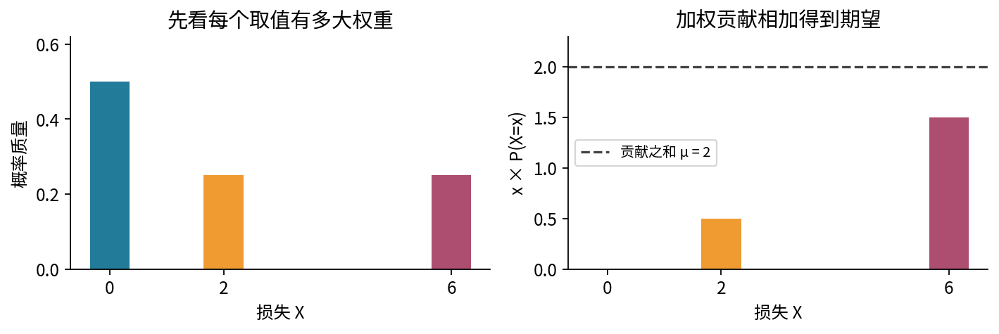
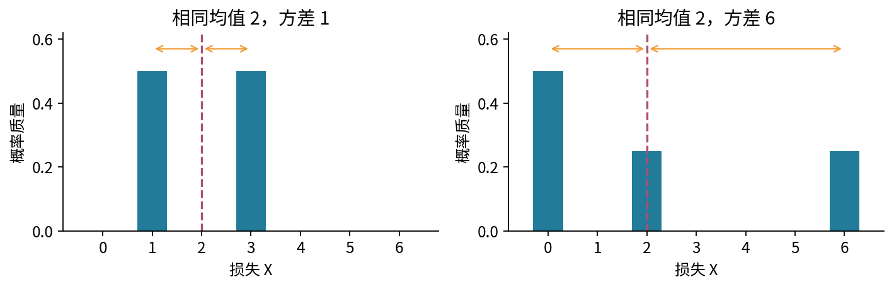
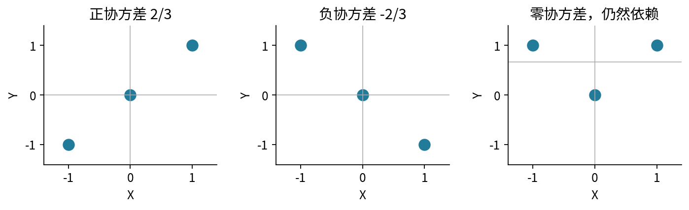
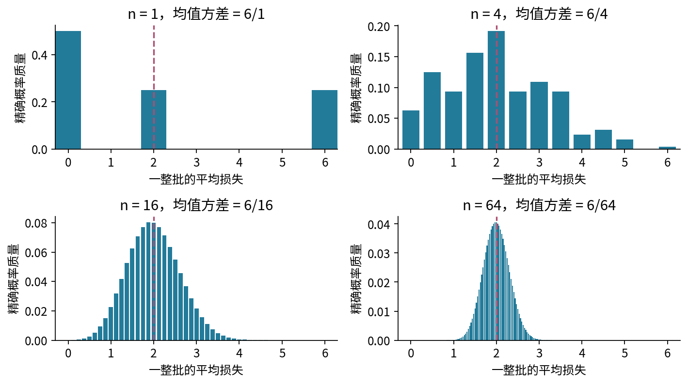
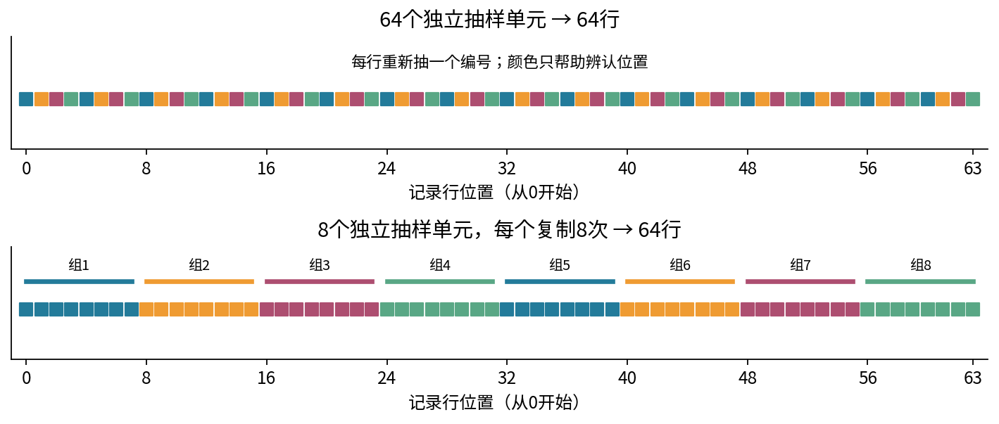
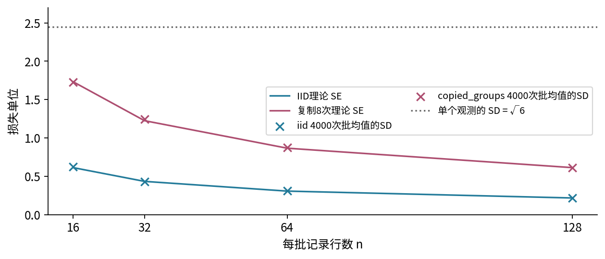
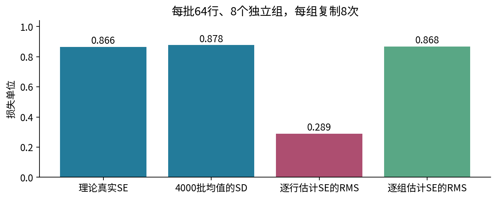
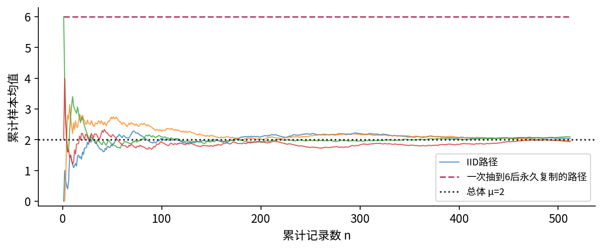
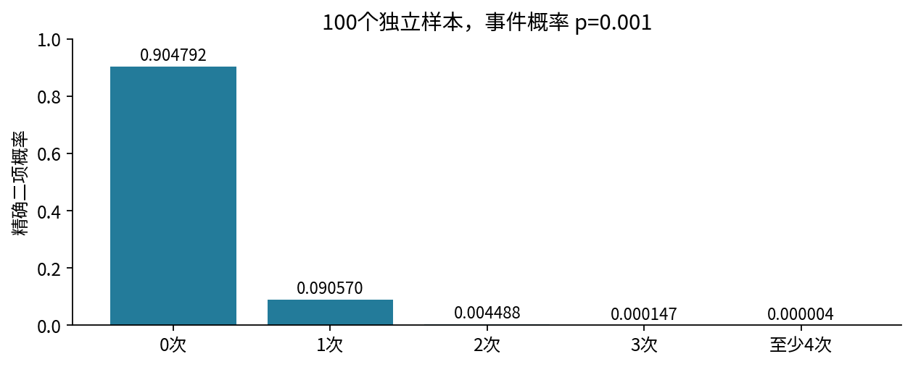

# 期望方差与抽样误差

## 第018单元 一批记录究竟提供了多少证据

同一个模型评估两次，一次平均损失1.7，一次2.3。它的表现真的变化了吗？另一个人把8条记录各复制8次，得到64行数据，再说“标准误缩小了”。行数相同的小批次为什么可能有完全不同的不确定性？本讲始终围绕这个问题：为什么一个小批次或一次运行不能代表全部情况。

先修017的离散部分，包括概率质量、独立抽样和有限概率求和。先修链中的007提供求和、平方与平方根，003提供函数、循环和测试。本文先完全使用有限模型，不要求提前掌握积分。第十三节连续补充需先学010与017连续部分，可以在离散主线完成后再读。本讲不预设统计检验、置信区间或深度网络训练知识。

我们冻结一个假想预测规则，再给每个新样本记录一个非负损失X。它只有0、2、6三个可能值，概率分别为1/2、1/4、1/4。单位暂称“损失单位”；它不是某个真实模型的评估。计算机生成方法是均匀抽4个编号之一，对应数值0、0、2、6。两个编号的值同为0，不能去重后对三个数均匀抽样。

## 一 期望是用概率加权的总体摘要

对有限取值x₁到xₖ，记pⱼ=P(X=xⱼ)，要求pⱼ非负、总和为1。期望或总体均值记μ=E[X]，定义为：

$$\mu=E[X]=\sum_{j=1}^{k}x_jp_j.$$

权重不是“这一次实际出现的次数”。总体均值由假定分布确定，即使尚未抽到任何数据也可计算。本例μ=0×1/2+2×1/4+6×1/4=2。若重复抽样频率接近这些权重，实际平均就可能接近2；为什么以及在什么条件下会接近，要在后面证明，不能把定义直接当作有限样本保证。[1]

期望不一定是最常见值，也不一定是可能取值。这里最常见值是0，期望却是2。若B只取0与1且P(B=1)=1/4，则E[B]=1/4，但任何一次B都不会是1/4。E[B]描述事件发生比例的目标，不是“预测下次出现一个四分之一”。

如果变换数值Y=g(X)，仍可沿原分布计算E[g(X)]=Σg(xⱼ)pⱼ，不必重新列出Y的分布。但必须先作用g再加权。本例E[X²]=0+4/4+36/4=10，而(E[X])²=4。把平均值送入非线性函数，与把每个样本送入后再平均，通常不同；均值损失也不能随意换成均值预测的损失。

## 二 线性期望不要求独立

设同一次随机实验还产生Y，联合权重记p(x,y)。常数a、b、c不是随机量。把有限联合求和拆开：

$$\begin{aligned}
E[aX+bY+c]&=\sum_{x,y}(ax+by+c)p(x,y)\\
&=a\sum_x x\sum_y p(x,y)+b\sum_y y\sum_x p(x,y)+c\\
&=aE[X]+bE[Y]+c.
\end{aligned}$$

第二行只用加法分配和边缘化，没有把联合概率写成乘积，因此不需要独立。即使Y=X，也有E[X+Y]=2E[X]。相反，E[XY]=E[X]E[Y]在一般情况下不成立；本例取Y=X时，左侧10，右侧4。混淆“求和可以拆”与“乘积可以拆”，会在均值方差里漏掉依赖项。

期望保留原量单位。若X由损失单位换成其100倍单位，E[100X]=100E[X]。不能把一个量纲未知的“平均分2”与另一个指标直接比较；先说明记录的随机变量是什么，比先套公式更重要。

## 三 方差量化围绕均值的分散

如果只报告均值，无法看出单次结果波动多大。方差定义为偏离均值的平方的期望，标准差是方差的非负平方根：

$$\sigma^2=\operatorname{Var}(X)=E[(X-\mu)^2],\qquad \sigma=\sqrt{\sigma^2}.$$

平方避免正负偏离相互抵消。直接对偏离求期望总是E[X-μ]=0，不能表示分散。主例的三个平方偏离为4、0、16，带概率加权后方差为4×1/2+0×1/4+16×1/4=6，标准差√6≈2.44949。方差单位是损失单位的平方，标准差回到损失单位。[2]

把平方展开，再用E[X]=μ，可以得到另一写法：

$$\operatorname{Var}(X)=E[X^2]-2\mu E[X]+\mu^2=E[X^2]-\mu^2.$$

本例10−4=6，与定义一致。它是代数等式，不代表任何浮点实现同样稳定：两项巨大且接近时直接相减会消减，有关数值限制见014。本课精确手算使用Fraction；模拟仅使用范围在−100到100的整数，输入和计算预算也有明确上限。

平移不改变偏离，缩放会平方地改变方差。令Y=aX+b，则Y−E[Y]=a(X−μ)，所以Var(Y)=a²Var(X)，SD(Y)=|a|SD(X)。例如Y=3X+5的均值11、方差54、标准差3√6。方差为0意味着在正概率支持上取常数，不意味着这个常数一定是我们希望估计的真值。

## 四 协方差记录共同偏离

两个变量的协方差定义为它们各自中心化后的乘积期望：

$$\operatorname{Cov}(X,Y)=E[(X-E[X])(Y-E[Y])]=E[XY]-E[X]E[Y].$$

同一次实验中两个偏离常同号，会产生正贡献；常异号，会产生负贡献。协方差带有X单位乘Y单位，因此换单位会改变数值。若二者方差均为正，可定义相关系数ρ=Cov(X,Y)/(σₓσᵧ)，它位于−1到1；方差为0时这个除法没有定义。本讲主要用协方差，因为均值误差直接由它相加得到。[3]

独立且二阶矩有限时，联合权重可以分解，E[XY]=E[X]E[Y]，所以协方差为0。反向不成立。让X均匀取−1、0、1，令Y=X²。E[X]=0、E[Y]=2/3、E[XY]=E[X³]=0，故Cov=0。可是知道X=0就能确定Y=0；无条件P(Y=0)=1/3，条件概率为1，明显不独立。

现将X+Y的中心化平方展开。交叉项出现两次，因此：

$$\operatorname{Var}(X+Y)=\operatorname{Var}(X)+\operatorname{Var}(Y)+2\operatorname{Cov}(X,Y).$$

若Y=X，左侧是Var(2X)=4σ²；右侧是σ²+σ²+2σ²，吻合。若错误地只加两个方差，就会低估一半。更多变量的协方差项也不能因为记录在不同数组位置就删除。

## 五 样本均值也有自己的分布

开始抽样前，X₁到Xₙ表示n个随机位置；抽样后得到具体数x₁到xₙ。样本均值这个统计量记作X̄ₙ=(X₁+…+Xₙ)/n，其实际值是x̄。它既不是总体均值μ的另一个写法，也不是某一个Xᵢ。重新生成整批样本时，X̄ₙ会变化，所以也有分布、期望和方差。

只要每个位置的期望都是μ，线性期望给出E[X̄ₙ]=μ，不要求独立。此时称样本均值是μ的无偏估计，意思是重复抽整批后的平均等于μ；不是每一批都恰好等于μ，也不是没有抽样误差。

对n=2的独立主例，可以列出4×4=16个等权编号对。和为0有4对、和为2有4对、和为4有1对、和为6有4对、和为8有2对、和为12有1对。除以2后，均值分布如下。

|样本均值|0|1|2|3|4|6|
|---|---:|---:|---:|---:|---:|---:|
|概率|4/16|4/16|1/16|4/16|2/16|1/16|

这些概率加起来为1。加权平均仍为2；加权平方偏离为(16+4+0+4+8+16)/16=3。单个X的方差是6，而两次独立观察平均后的方差降为3。

## 六 从协方差推导均值标准误

令μᵢ=E[Xᵢ]。先对中心化和平方展开，再除以n²：

$$\operatorname{Var}(\bar X_n)=\frac{1}{n^2}\left[\sum_{i=1}^{n}\operatorname{Var}(X_i)+2\sum_{i<j}\operatorname{Cov}(X_i,X_j)\right].$$

对独立同分布样本，英文常缩写为IID，每个方差为σ²，不同位置协方差为0，得到Var(X̄ₙ)=nσ²/n²=σ²/n。独立是充分条件；这里仅求方差时，两两不相关且同方差也足够。但后面的经典IID中心极限定理还要更强假设，不能混用结论。

均值的标准误SE定义为这个统计量抽样分布的标准差：

$$\operatorname{SE}(\bar X_n)=\sqrt{\operatorname{Var}(\bar X_n)}=\frac{\sigma}{\sqrt n}\quad\text{在IID条件下}.$$

单个样本标准差σ与均值标准误σ/√n是两个不同对象。主例σ≈2.449；n=64时SE=√(6/64)≈0.30619。把标准误减半需要独立样本量乘4，而不是乘2。SE是典型随机波动尺度，不是某一批实际误差的上界；一次误差可以小于、也可以大于它。

若我们要估计μ，定义估计量T的偏差b=E[T]−μ。再写T−μ=(T−E[T])+b并展开平方，交叉项期望为0，得到均方误差E[(T−μ)²]=Var(T)+b²。因此方差很小并不足以说明估计准确。永远输出100的T方差为0，但对主例μ=2，均方误差是9604。

## 七 同样64行也可能只有8个独立组

机制甲每行独立抽一个主例值，共64行。机制乙先独立抽G=8个组值Z₁到Z₈，再把每个值复制m=8次，也得到n=Gm=64行。两个机制中每行都服从同一个损失分布，因此只画单行直方图看不出关键差异。

对复制机制，均值直接化简为ΣmZg/(Gm)=ΣZg/G，因此方差为σ²/G=mσ²/n。主例真实方差是6/8=3/4，SE≈0.86603，是独立64行SE的√8倍。复制没有改变均值，却无法产生新的独立信息。

也可以用协方差公式交叉核对。同组的两行完全相同，协方差σ²；不同组协方差0。G组各有m(m−1)/2对同组行，于是括号内是nσ²+Gm(m−1)σ²=Gm²σ²，除以G²m²后仍为σ²/G。公式里的“2”与配对计数中的“除2”正好抵消。

对等方差且任意两行有相同相关系数ρ的另一个模型，Var(X̄)=σ²[1+(n−1)ρ]/n，当分母1+(n−1)ρ为正时，方差等价的有效样本量为n_eff=n/[1+(n−1)ρ]；分母为0时均值方差为0，不能普通除法。这只是给定协方差结构下对均值方差的比较；不能拿一个未经验证的ρ把所有真实相关数据统一换算成独立样本。本课复制模型有组内与组间两种相关性，用组数G即可精确计算。

相关也不总增加方差。均匀不放回地抽有限总体的不同编号，会出现负协方差。对N个固定数、总体方差σ_N²=(1/N)Σ(xᵢ−μ)²，不同位置的Cov=−σ_N²/(N−1)，所以n次不放回均值方差为σ_N²(N−n)/[n(N−1)]。这一式在n=N时为0，因为看遍总体后均值完全确定；它不包含对未知新总体的泛化保证。详解将用4个编号逐项验证。

## 八 用一批数据估计未知标准误

真实问题通常不知道σ²。给定n≥2个IID样本，定义样本方差s²=Σ(xᵢ−x̄)²/(n−1)，再以s/√n估计均值SE。分母n−1不是随意修正。对抽样前的随机量，有恒等式：

$$\sum_i(X_i-\bar X)^2=\sum_i(X_i-\mu)^2-n(\bar X-\mu)^2.$$

取期望，右侧第一项是nσ²，第二项是n×(σ²/n)=σ²，所以E[s²]=σ²。若用n作分母，期望会是(n−1)σ²/n。无偏针对s²成立；开平方是非线性，不能据此声称s或s/√n也恰好无偏。[4]

现在手算8个独立组值[0,0,2,6,0,2,0,6]。和16，均值2；平方偏离总和为48，所以组样本方差48/7，估计的均值方差(48/7)/8=6/7，估计SE≈0.92582。它不必等于已知模型真实SE√(6/8)≈0.86603；前者来自这一批有限数据，后者来自总体与抽样设计。

把这8个组各复制8次，64行平方偏离和变为384。若误当IID，则s_row²=384/63=128/21，错误估计的均值方差为(128/21)/64=2/21，SE≈0.30861。按真实独立组计算仍是√(6/7)≈0.92582。组ID一旦被丢掉，常规逐行函数不会自动恢复抽样设计。

更进一步，设复制组数G固定，每组m行，总行数n=Gm。逐行样本方差的期望为m(G−1)σ²/(Gm−1)，不再恰等于σ²。按组计算s_Z²/G是均值方差的无偏估计。组大小不等、组内非完全复制或跨组相关时，需要重新推导；不能原样套本课公式。

## 九 模拟核对必须区分两层样本量

实验对n=16、32、64、128各重新生成R=4000批数据，分别使用IID和每组复制8次的机制。n是一批内的记录行数，G是一批内独立组数，R是整个实验的独立重复次数。一次真实研究往往只有一批，模拟能重复4000批，是因为我们自己知道生成器。

在n=64时，IID的4000个批均值的样本标准差为0.30820，接近理论0.30619；复制机制为0.87756，接近理论0.86603。这里“接近”有Monte Carlo误差，并非程序应强行把它们调成完全相等。所有理论值独立来自推导，模拟用于检查行为而不是证明公式。

4000个批均值本身还可再平均。因为外层批次独立，其平均的Monte Carlo标准误可估为SD(批均值)/√R。n=64时两模式分别约0.00487和0.01388。这衡量“我们用4000次模拟估出的平均值”有多不稳定，不是把实际一批64行的SE再额外缩小4000倍的理由。

Monte Carlo方法是按一个明确分布模拟样本，用平均近似该分布下的期望。若样本相关，标准误不能随意写成s/√n；若只抽到了分布的一角、忽略罕见事件或模型根本不匹配目标，增加重复次数也不会自动修复。代码中不同seed只是不同伪随机序列，不是新增真实研究对象。

## 十 大数定律保证什么

对主例这种IID、有限方差序列，均值越来越集中可以直接证明。令A为|X̄ₙ−μ|≥ε，其中ε>0。A发生时平方偏差至少ε²，故：

$$E[(\bar X_n-\mu)^2]\geq\varepsilon^2P(A),\qquad
P(|\bar X_n-\mu|\geq\varepsilon)\leq\frac{\sigma^2}{n\varepsilon^2}.$$

右侧随n趋于无穷而趋于0，所以任意固定精度ε之外的概率趋于0，这叫依概率收敛，是一个弱大数定律。这里的界来自非负平方量，不需要先学正态分布。有限n时界也可能大于1，只能再取它与1的较小者，不能把大于1称作概率。[5]

主例ε=0.5、n=64时，界为6/(64×0.25)=0.375；n=256时为0.09375。这是保守上界，不是恰有37.5%的批次出错。要看精确概率，可以对本课有限分布做计数；其他未知总体未必能这样精确计算。

令所有Xᵢ=Z，且Z仍服从主例分布，则X̄ₙ=Z，Var(X̄ₙ)=6永不缩小；例如|X̄ₙ−2|≥1的概率恒为3/4。这给出了“每行边缘分布一样但平均不集中”的反例。某些弱依赖序列仍有大数定律，但需要相应条件；不是一发现相关就断言所有平均都失效。

本节证明的是有限方差版本。更一般的IID大数定律只需E|X|有限，完整证明超出当前先修；不能从我们证明用了方差，就声称没有方差时任何大数定律都不存在。

## 十一 中心极限定理讨论缩放后的形状

大数定律回答“均值集中到哪里”；经典IID中心极限定理回答“按正确尺度放大剩余误差后，分布形状趋向什么”。若Xᵢ独立同分布，均值μ有限，方差满足0<σ²<∞，则：

$$Z_n=\frac{\sqrt n(\bar X_n-\mu)}{\sigma}
\quad\text{的分布随 }n\to\infty\text{ 趋近标准正态分布 }N(0,1).$$

“分布趋近”指对任意实数z，P(Zₙ≤z)趋近标准正态累积分布在z处的值；不是说某条Zₙ路径会趋向0。乘√n使其方差保持1，而未放大的X̄ₙ方差趋于0，因此它与大数定律没有矛盾。本讲准确陈述前提与意义，不用未学的特征函数假装完成一般证明。[6]

中心极限定理不要求每个X本来正态；主例完全离散。它也不把原始数据变成正态，不保证任意n≥30就足够，不保证极端尾部近似准确。用正态近似进一步构造区间，要处理未知σ、覆盖率和设计假设，留待022系统学习。这里的SE计算在IID有限方差下本来就精确成立，不依赖“已经近似正态”。

## 十二 小概率事件让经验标准误过分乐观

取独立Bᵢ服从Bernoulli(p)，p=0.001，n=100。由B²=B可得Var(B)=p(1−p)，所以真实均值SE=√[0.001×0.999/100]≈0.003161。可是100次全为0的概率是(0.999)¹⁰⁰≈0.90479。只看到这批全零数据时，样本方差和估计SE都为0。

这不否定s²的无偏性：约90%的全零批次给0，少数出现事件的批次会给较大的估计，重复平均才能补回来。无偏不保证每批可靠。我们有意选择一个有限方差分布，表明即使定理条件最终满足，有限样本的近似与估计仍可能很差。

另一个失效来源是抽样偏差。若目标分布是主例，但实际只抽到X=0或2的子群，估计再稳定也只描述这个子群。还有训练随机性与数据抽样随机性的区别：固定同一测试集只换训练seed，不能声称测到了目标人群重新抽样的全部误差。本讲先分清随机机制，正式实验比较留到022。

## 十三 连续扩展 需补010与017连续部分

若X有密度f，先要求$\int |x|f(x)\,dx$有限，才能定义$\mu=\int xf(x)\,dx$。若二阶矩也有限，方差就是$\int (x-\mu)^2f(x)\,dx$。密度仍不是点概率，积分将有限加权和推广到连续分布。对区间[0,2]上的均匀密度$f(x)=1/2$：

$$E[X]=\frac12\int_0^2x\,dx=1,\qquad E[X^2]=\frac12\int_0^2x^2\,dx=\frac43,\qquad\operatorname{Var}(X)=\frac13.$$

有限均值不自动带来有限方差。例如$x\geq1$时$f(x)=\frac32x^{-5/2}$，其他地方为0。密度积分为1，而前两阶矩具有不同性质：

$$E[X]=\frac32\int_1^\infty x^{-3/2}\,dx=3,\qquad E[X^2]=\frac32\int_1^\infty x^{-1/2}\,dx=\infty.$$

经典有限方差CLT和$\sigma/\sqrt n$标准误不可直接使用；IID可积的大数定律仍适用。有限模拟总会产出某个有限样本方差，不能据此证明总体二阶矩有限。

## 来源与方法边界

[1] Marco Taboga，[Expected value](https://www.statlect.com/fundamentals-of-probability/expected-value)，核对加权期望与可积条件；本文4原子例子、手算与图为独立设计。

[2] Marco Taboga，[Variance](https://www.statlect.com/fundamentals-of-probability/variance)，核对方差定义与缩放。

[3] Marco Taboga，[Covariance](https://www.statlect.com/fundamentals-of-probability/covariance)，核对中心化乘积与和的方差。

[4] Python官方[statistics](https://docs.python.org/3/library/statistics.html)，核对样本与总体方差接口。我们的精确计算另行实现，并以枚举和标准库函数交叉检查。

[5] Marco Taboga，[Law of Large Numbers](https://www.statlect.com/asymptotic-theory/law-of-large-numbers)，核对有限方差弱定律及IID可积版本的不同前提。

[6] Marco Taboga，[Central Limit Theorem](https://www.statlect.com/asymptotic-theory/central-limit-theorem)，核对标准化、IID有限正方差条件与分布收敛。引用用于定义核验，不复制原文证明或图。

[7] Python官方[random](https://docs.python.org/3/library/random.html)，核对局部Random实例、伪随机性与复现边界。所有数据本地合成，不使用付费API。

## 练习

1. 计算主例E[3X+5]、Var(3X+5)，说明二者单位与缩放。
2. 用主例反驳E[X²]=(E[X])²，并说明什么时候相等。
3. 对X均匀取−1、0、1且Y=X²，完整计算协方差并给一个不独立的概率证据。
4. 核对n=2的均值分布表的归一化、均值和方差。
5. 将IID样本量从64改到256，求SE变化；解释不能保证某条累计路径每一步更接近μ。
6. 对8个组各复制8次，从化简均值与计数协方差两条路线推导真实SE。
7. 手算8组练习的s²与SE，再比较复制64行后的错误逐行SE。
8. 推导复制模型逐行s²的期望，说明分母n−1何时不再具有原先无偏含义。
9. 对4个不同编号值0、0、2、6，不放回抽2个，枚举12个有序对，求均值方差。
10. 解释4000批模拟中的n、G、R；写出模拟平均的MCSE与单批SE的区别。
11. n=100、p=0.001时全零意味着什么？为什么不与样本方差无偏性矛盾？
12. 对永久复制机制，给出弱大数定律不成立的直接概率证据，并区别一般弱依赖情形。
13. 解释中心极限定理标准化分子分母，并列出三个它没有保证的事情。
14. 连续选做：计算[0,2]均匀分布的均值方差，判断第十三节长尾分布可否使用经典CLT。
