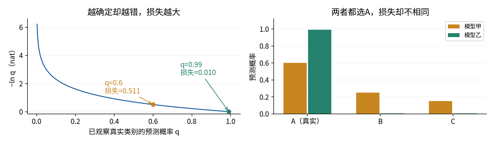
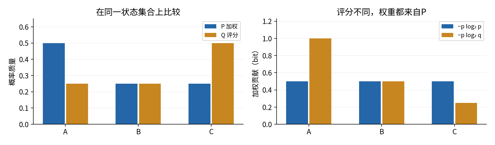
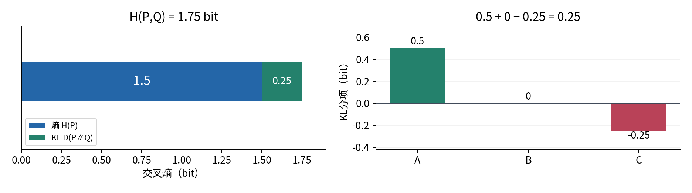
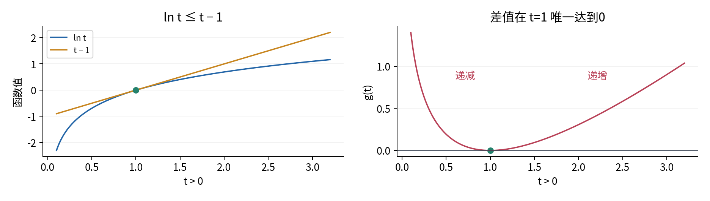
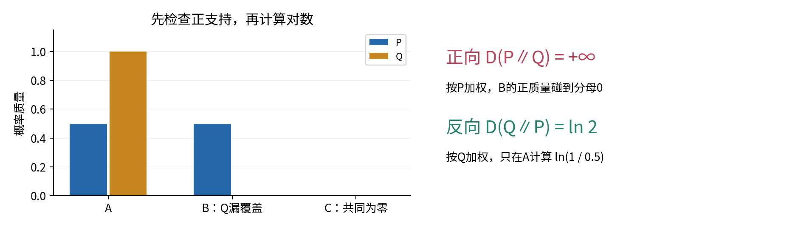
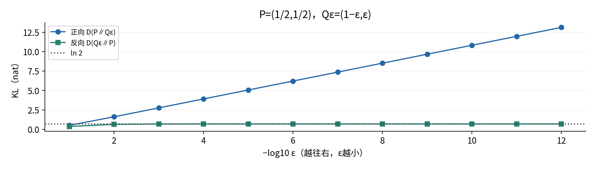
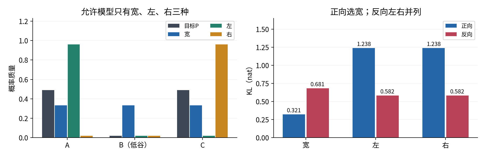
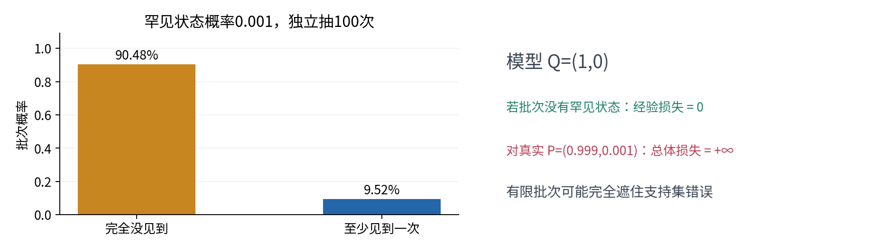

# 熵交叉熵与KL散度

## 第019单元 对数损失究竟在比较什么

分类器把正确类别的概率从0.6提高到0.99，分类准确率可能完全不变，交叉熵却明显下降。另一台生成器只生成某一种很逼真的样本，是否就等于学会了整个数据分布？这两个问题看起来不同，却都要求分清：由谁提供概率权重，由谁接受评价，以及模型把哪些可能事件说成了不可能。

本讲围绕“分类损失、分布匹配和生成目标为何常出现对数”。先修为017与018的离散主线：概率质量、独立似然、对数乘积规则、有限期望与抽样误差。所有主要结论都在同一个有限状态空间上建立，不要求连续密度或神经网络。证明非负性前会显式补充所需的最小导数工具；不把Jensen不等式当作已学知识。

学习后应能从定义逐项计算熵、交叉熵和两个方向的KL；证明交叉熵分解和KL非负；在动手取对数前发现支持集问题；解释有限候选实验能说明什么、不能说明什么。数据、图和代码均为原创合成教学材料，不评价真实模型性能。

## 一 从一条预测的分数开始

设一次观察的正确类别为y，模型给它的概率是$q_y$。定义这条观察的负对数损失为−ln $q_y$。当$q_y$=1时损失为0；当$q_y$很小时损失很大；若$q_y$=0而这条观察确实发生，损失定义为正无穷。这里“正确类别”是已观测标签，不表示标签生成过程必然无噪声。

为什么用对数？017中独立观察的联合似然是概率相乘。对n个标签，模型在第i条输入上给出q($y_i$|$x_i$)，则负对数把乘积改写成求和：

$$-\ln\prod_{i=1}^n q(y_i\mid x_i)=\sum_{i=1}^n-\ln q(y_i\mid x_i).$$

这是使用对数的一个直接原因：最大化同一个似然等价于最小化它的负对数，单个样本贡献可以相加。若数据模型不独立，则必须使用正确的联合概率或条件分解，不能靠取对数把依赖关系删掉。对数不是所有学习目标唯一合法的选择；选择它意味着采用一种明确的概率评价方式。

−ln0.6≈0.510826，−ln0.99≈0.010050。若模型自信地错了，给真实类别0.01，则损失−ln0.01≈4.605170。准确率只记录最高概率类别是否正确，而这个分数记录给真实结果留了多少概率。单条损失小，不足以证明概率校准或泛化好，仍要在符合目标分布的数据上评估。

## 二 先约定状态空间与对数单位

令状态集合为S={A,B,C}，更一般地有K个状态。P与Q是同一个有序集合上的概率分布，$p_j$=P(Y=j)，$q_j$=Q(Y=j)。每个数非负，两组数各自求和为1。下标j代表状态，不是训练样本编号。若两个文件的类别顺序不同，即使数组同形状，也不能直接做逐项比较。

P暂称评价分布，Q暂称待评价分布。很多任务里P是目标总体分布、Q是模型；在实际训练里P也可能是经验分布或人为设计的软标签。名称不改变数学定义，必须先说清楚当前到底是哪一种。

自然对数ln的底是e，所得单位称nat。若使用log₂，单位称bit。换底关系是log₂t=ln t/ln2，因此所有熵、交叉熵与KL的bit值都是nat值除以ln2。统一换底只乘同一个正常数，不改变候选排序。把不同底数的损失放在同一表里直接比较，会制造虚假的差异。

本讲固定的手算分布为：

|状态|A|B|C|总和|
|---|---:|---:|---:|---:|
|P|1/2|1/4|1/4|1|
|Q|1/4|1/4|1/2|1|

## 三 熵是分布自身的平均不确定性

单个结果在P下的自信息是−ln $p_j$。按P发生概率加权，得到熵：

$$H(P)=E_{Y\sim P}[-\ln p_Y]=-\sum_{j:p_j>0}p_j\ln p_j.$$

求和只包含正概率状态，因此无需真的计算ln0。常用简写是规定0ln0=0；这是带权项的边界约定，不是说ln0=0。对有限分布，熵总是有限且非负：每个正概率$p_j$≤1，故−ln $p_j$≥0。熵为0当且仅当所有质量都在一个状态上，因为任何0<$p_j$<1的项都严格为正。[1]

主例用bit特别容易手算。A的信息量为1，B和C均为2，故H₂(P)=(1/2)×1+(1/4)×2+(1/4)×2=1.5 bit，换成nat为1.5ln2≈1.039721。熵描述分布，不是某条样本的信息量；A的一条观察为1 bit，不能把它写成“总体熵1 bit”。

编码提供一个具体解释：给A码字0，B码字10，C码字11，就能无歧义地拼接读出，平均长度恰为1.5 bit。这里概率恰好是2的负整数次幂，理想长度与整数码长一致。一般的−log₂$p_j$并非整数，不能直接当成某个逐符号码字长度；一般编码定理及其条件不在本讲证明范围内。

均匀分布U在K个状态上各有1/K，直接代入得到H(U)=ln K。为什么任何P都不超过它？先记下这个问题，等证明KL非负后，只需一行就能回答；现在不提前使用尚未证明的结论。

## 四 交叉熵把权重与评分规则分开

当结果仍由P产生，但用Q的概率评分，平均损失叫交叉熵：

$$H(P,Q)=E_{Y\sim P}[-\ln q_Y]=-\sum_{j:p_j>0}p_j\ln q_j.$$

若有$p_j$>0而$q_j$=0，这个量为正无穷；否则有限。H(P)是“P加权、P评分”，H(P,Q)是“P加权、Q评分”。因此H(P,Q)并不等于H(Q)，也一般不等于H(Q,P)。只报一个交叉熵数值而没有说明权重分布，会丢掉它最重要的含义。

对主例，Q给A、B的负log₂概率均为2，给C为1。按P加权，H₂(P,Q)=(1/2)×2+(1/4)×2+(1/4)×1=1.75 bit。相对于用P本身评分，平均多0.25 bit，但C这一状态反而少付了1 bit；全局差异不能理解为每个状态都变坏。

如果固定P，只能在某个模型集合内选择Q，交叉熵就是对这个集合的比较标准。更换任务总体P或更换标签处理方式，会同时改变比较基线，原来的数值不一定可横向比较。例如几乎确定的二分类任务和标签本来模糊的任务，即便都达到各自最优，最优损失也可能不同。

## 五 KL是平均对数概率比

Kullback–Leibler散度简记D(P∥Q)，本讲采用方向约定：竖线左边的分布提供求和权重。

$$D(P\Vert Q)=\sum_{j:p_j>0}p_j\ln\frac{p_j}{q_j}.$$

定义仍须先判断分母：若某个$p_j$>0但$q_j$=0，则D(P∥Q)=+∞。若$p_j$=0，则该状态项定义为0，包括$p_j$=$q_j$=0的情形。不能先在电脑里做0/0再盼望乘0把NaN消掉。有限情形可把比值的对数写成ln $p_j$−ln $q_j$，避免中间比值溢出。[2]

主例的bit贡献分别是(1/2)log₂2=1/2，(1/4)log₂1=0，(1/4)log₂(1/2)=−1/4，因此D₂(P∥Q)=1/4 bit。第三项为负完全正常；非负性是对总和的结论。逐项取绝对值或把每个负贡献裁成0，会定义另一个量。

把有限交叉熵中加入并减去同一项，得到核心分解：

$$\begin{aligned}
H(P,Q)&=-\sum_{p_j>0}p_j\ln q_j\\
&=-\sum_{p_j>0}p_j\ln p_j+\sum_{p_j>0}p_j(\ln p_j-\ln q_j)\\
&=H(P)+D(P\Vert Q).
\end{aligned}$$

若支持集不匹配，有限H(P)加上+∞仍是+∞，上述等式可按扩展实数解释；不要倒过来计算∞−∞。在本讲有限状态下H(P)必有限，所以D=H(P,Q)−H(P)没有∞−∞问题；进入无限或连续情形时不能自动沿用这个保证。

## 六 证明前补齐一个对数不等式

下面需要ln t≤t−1，且仅在t=1时取等号。为避免把它当作黑箱，这里给出最小导数工具后证明它。导数f′(t)表示在t附近变化量Δt趋于0时，比值[f(t+Δt)−f(t)]/Δt的极限，即局部变化率。这里仅使用三个基本事实：常数导数为0，t的导数为1；ln t在t>0上导数为1/t；某段上导数严格为正则函数严格递增，严格为负则严格递减。最后一个事实是单变量微积分的单调性判别。

这些事实是本节明确补充的证明工具，不假定017或018已经教过导数。ln的导数也可由几何理解：把ln t视为曲线1/u从1到t的有向面积；在t附近增加一个宽度Δt的窄条，其平均高度夹在两端的1/u之间，Δt趋于0时两端都趋于1/t。无需计算任何连续概率积分。需要系统学习这些基础时可回看010，但后续有限求和推导不再使用导数。

令g(t)=t−1−ln t，定义域为t>0。逐项求导有g′(t)=1−1/t=(t−1)/t。于是0<t<1时g递减，t>1时g递增，最低点为t=1；又g(1)=0，所以g(t)≥0，等号仅在t=1成立。这就完整建立了所需不等式，而不是用Jensen的名字代替证明。

也可直接用刚才的面积解释检查方向：t>1时，1/u≤1，面积不超过宽t−1的矩形；0<t<1时，ln t等于从t到1的面积加负号，而该区间1/u≥1，故仍有ln t≤t−1。t≠1时都有一段严格不等，因而不等式严格。这个几何检查尤其能防止把负号方向弄反。

## 七 带着零概率证明KL非负

令A={j:$p_j$>0}，称为P的支持集。分两种情形。若存在j∈A使$q_j$=0，D=+∞，非负性已经成立且不可能等于0。否则所有j∈A的比值$q_j$/$p_j$都为正，才可以代入上一节不等式：

$$-\ln\frac{q_j}{p_j}\geq1-\frac{q_j}{p_j}.$$

乘以正数$p_j$并在A上求和，保留每一步的求和范围：

$$D(P\Vert Q)\geq\sum_{j\in A}(p_j-q_j)=1-\sum_{j\in A}q_j=\sum_{j\notin A}q_j\geq0.$$

容易漏掉的地方是$\sum_{j\in A}$ $q_j$不一定为1：Q可能把质量放在P支持集外。这个剩余质量恰好构成非负的下界。如果直接把两组受限求和都写成1，证明就缺了一步。

等号也要检查两层。若D=0，则Q在A外的总质量必须为0；每个正权重的对数不等式也必须取等号，所以$q_j$/$p_j$=1，即A内逐项相等。合起来得到整个S上P=Q。反过来P=Q时，每个正支持项都是$p_j$ln1=0，共同零项也按定义为0。因此D(P∥Q)≥0，且等号当且仅当P=Q。

于是固定P时，H(P,Q)≥H(P)，在允许选择全部概率分布时唯一最优Q=P。若模型集合不含P，只能在集合内比较，不能声称一定达到H(P)。把Q取为K状态均匀分布U，还得到D(P∥U)=ln K−H(P)≥0，即0≤H(P)≤ln K；上界等号要求P=U。这个推导同时解释了熵的最大值，而无需另外求一个多变量极值。

## 八 支持集比数值大小更早决定结果

D(P∥Q)有限的充要条件是在本讲有限状态中supp(P)⊆supp(Q)。反方向有限则要求supp(Q)⊆supp(P)。想要两个方向都有限，支持集必须相同。两个分布只要同在S上并不意味着支持集相同：S包含可列举的状态，支持集只保留正质量状态。

|某一状态的概率|交叉熵该项|D(P∥Q)该项|处理顺序|
|---|---:|---:|---|
|p>0，q>0|−p ln q|p(ln p−ln q)|正常计算|
|p>0，q=0|+∞|+∞|返回无穷|
|p=0，q>0|0|0|跳过该项|
|p=0，q=0|0|0|跳过，勿求0/0|

对图5手算，D(P∥Q)有(1/2)ln[(1/2)/0]，所以为无穷。D(Q∥P)=1×ln[1/(1/2)]=ln2≈0.693147。这里两方向差异不是微小数值误差，而是一个有限、一个无限。Q没有在B放质量，反向求和不会在那里直接付分；但这不意味着它已匹配P，反向总值仍大于0。

把Q改为$Q_\varepsilon$=(1−ε,ε)，让P=(1/2,1/2)，0<ε<1。逐项得到H(P,$Q_\varepsilon$)=−(1/2)ln[ε(1−ε)]，D(P∥$Q_\varepsilon$)=H(P,$Q_\varepsilon$)−ln2；ε趋于0时二者发散。反方向为(1−ε)ln[2(1−ε)]+εln(2ε)，却趋向ln2。极限方向差异来自加权分布变化，而非画图尺度的选择。

## 九 KL不是对称距离

主例P=(1/2,1/4,1/4)、Q=(1/4,1/4,1/2)恰好在互换状态后对称，所以两个方向都为0.25 bit。这只是特殊相等，不能从一组实验概括出对称性。换成P=(3/4,1/4)、Q=(1/2,1/2)，有：

$$D(P\Vert Q)=\tfrac34\ln(3/2)+\tfrac14\ln(1/2)\approx0.130812,$$

$$D(Q\Vert P)=\tfrac12\ln(2/3)+\tfrac12\ln2\approx0.143841.$$

二者不同，足以反驳“KL是对称距离”。KL也不满足一般距离需要的三角不等式；详解用三个二分类分布给出数值反例。非负、相同分布时为0，只是距离所需的一部分性质。把它称作散度能提醒我们，每次必须写清方向，不能像普通长度那样任意交换端点。

术语“正向”“反向”也要附带约定。本讲以目标P和模型Q为固定角色，称D(P∥Q)为正向、D(Q∥P)为反向。另一篇文章若交换p、q的命名，单凭词语可能误读；先看谁在期望符号下面、谁在对数分母里。

## 十 有限受限模型怎样展示方向选择

为避免把复杂生成模型讲成口号，我们只设计一个可枚举的模型集合。状态A、B、C沿一条轴排列，目标P=(0.49,0.02,0.49)在两端有高质量，中间是低谷。模型只允许下面三个固定候选，不能任意移动或改变概率：宽候选$Q_B$=(1/3,1/3,1/3)，左候选$Q_L$=(0.96,0.02,0.02)，右候选$Q_R$=(0.02,0.02,0.96)。

以左候选为例，正向是0.49ln(0.49/0.96)+0.02ln1+0.49ln(0.49/0.02)≈1.237811；反向是0.96ln(0.96/0.49)+0.02ln1+0.02ln(0.02/0.49)≈0.581653。宽候选对应正向0.321289、反向0.680962。因此正向宁可把更多质量放到中间，也不愿明显低估另一端；反向在这个集合内宁可选一端，也不愿把1/3质量放在目标只有0.02的低谷。

这说明“覆盖多处目标质量”与“避免在低目标质量处放模型质量”可能出现不同取舍。它没有证明反向KL总会寻峰、总会丢模式或总会低估方差。结论依赖目标、允许模型集合和优化是否找到最小值。如果把P本身加入候选集合，两方向立刻都选P且最小值0；如果允许所有分布，两方向的全局唯一最优本来就是P。不要拿无约束最优的一条简单曲线冒充模式行为的证据。

## 十一 从总体交叉熵走到训练损失

先考虑模型不区分输入、只给同一个类别分布Q的情形。n条已观察标签中，类别j出现$n_j$次，定义经验概率$\widehat p_j$=$n_j$/n。把相同标签的项合并，就有一个纯代数恒等式：

$$\frac1n\sum_{i=1}^n-\ln q_{y_i}=-\sum_j\frac{n_j}{n}\ln q_j=H(\widehat P,Q).$$

不论标签是否独立，这个重排求和都成立。但要把经验平均当作总体H(P,Q)的估计，就需要018的抽样条件。固定Q、IID抽样且Q在P支持上为正时，因为状态有限，所有损失有限，样本均值可由大数定律趋近H(P,Q)。若Q是看过同一批训练标签才拟合出的，不能把这个固定Q论证直接当作训练误差的泛化保证。

主例标签序列[A,A,B,C]，计数为[2,1,1]，恰好得到p̂=P。四条bit损失是[2,2,2,1]，平均7/4=1.75。一次样本频率刚好等于总体是我们为手算设计的条件，不能期望真实小批次也精确相等。

对普通分类器，Q依赖输入x。对P(X=x)>0的输入，目标条件分布是P(Y|x)，模型是Q(Y|x)，我们在每个x上使用同一个分解，再对输入分布加权：

$$E_X[H(P(\cdot\mid X),Q(\cdot\mid X))]=E_X[H(P(\cdot\mid X))]+E_X[D(P(\cdot\mid X)\Vert Q(\cdot\mid X))].$$

本讲把X也限于有限取值，以上只是两重有限求和。真实总体的条件熵项不随Q改变，但每个输入只观察一个标签时，并不知道其真实条件分布。训练中用one-hot向量$e_y$，只有真实标签位置为1，其熵0且H($e_y$,Q)=−ln $q_y$。one-hot目标熵0，不意味着总体标签条件熵一定0。

若提供软标签$t_j$≥0、Σ$t_j$=1，损失为−Σ$t_j$ln $q_j$，仍是交叉熵。软标签来自教师预测、标注比例还是人为平滑，会改变评价对象。这里不假设它自动更真实，也不提前讨论具体训练框架接口。

## 十二 有限样本会遮住无限总体损失

令真实P=(0.999,0.001)，模型Q=(1,0)。真实交叉熵为无穷，因为罕见事件在P下有正概率，在Q下却完全不可能。独立抽100次，完全没见罕见事件的概率是0.999¹⁰⁰≈0.904792。遇到这样的批次，经验交叉熵是0，看起来“完美”。

这不违反大数定律：上一节要求固定Q在P支持上为正，从而有限损失，而这里恰好违反。一次小测试集没有报错，也无法排除漏覆盖。实际评价应保留对异常大损失、未覆盖状态与分组抽样机制的检查；只有一个总平均不足以诊断原因。

把Q平滑为Q′=(1−α)Q+αU，其中0<α≤1且U在每个状态上均匀，能令所有$q'_j$≥α/K>0。它确实使有限状态交叉熵变为有限，但改变了模型。对三状态Q=(1,0,0)、α=0.02，有Q′=(74/75,1/150,1/150)，对P=(1/2,1/2,0)的交叉熵约2.512029 nat。这个数不是原来无限损失的“更准确计算”。

单纯把$q_j$替换成max($q_j$,ε)却不重新归一化，得到的向量一般总和超过1，不再是概率分布。即使归一化了，也应把修改后的Q写明。把0改成一个极小正数有时是实际建模决策，有时是数值防护，不能用同一句“防止报错”掩盖二者区别。

## 十三 计算实现必须忠实于数学边界

核心脚本先验证同序状态、概率范围与总和，再处理p=0和q=0，最后才取对数。正常正值使用ln p−ln q，不直接形成p/q；例如p=1、q=10⁻³⁰⁰时对数比有限，而其他更极端中间比值可能溢出。只要正数可在浮点中表示，极小概率不等于数学上的零；数据在进入函数前已经下溢为0时，函数无法猜出原来的值。

输入允许最多64个状态；总和误差不超过10⁻¹²时进行明确的舍入级归一化，超过则拒绝。布尔值、负概率、NaN、无穷和空向量都拒绝。正α的均匀混合份额若下溢到0，平滑接口会拒绝，避免丢失应有的正支持。代码不是通用概率库，尤其不承诺超出浮点精度的任意高精度区分。某些接近相等的分布可能因舍入得到数量级约10⁻¹⁶的负KL，测试采用明确容差，不把所有负数静默裁成0。[3]

输出JSON用字符串“Infinity”表示正无穷，以保持标准JSON；它不是一个有限数，也不是缺失值。Notebook与脚本读同样的CSV并生成同名结果，再逐字节比较。独立测试另用80位Decimal对数与有理数分布核算，而非只把同一个函数运行两遍。

## 十四 回答开头的问题并划清外推边界

分类损失中出现对数，是因为对模型赋予已观察标签的概率进行评分，并把联合似然乘积改为可加贡献。分布匹配里出现对数概率比，是因为交叉熵相对目标自身熵的额外部分恰好是KL。生成任务若采用似然或KL目标，也会继承这些结构；具体生成算法、隐藏变量和其他散度要在后续课程中另行建立，不能把所有生成目标都统称为交叉熵。

本文所有熵结论限定为有限离散分布。连续密度可以大于1，所以−ln密度可能为负，微分熵也可为负，并随坐标单位变化。连续KL需要积分、支持与可积条件，不能直接把概率质量的表格换成密度值后求和。有限分布的0≤H(P)≤ln K以及经验计数解释，不应原样搬到连续模型。

最重要的检查顺序是：先确认状态与权重，再确认支持集，接着写清对数单位与KL方向，最后讨论模型集合和有限样本。若这些都明确，交叉熵分解只是几行代数；若其中一个含糊，再多小数位也不能挽救结论。

## 练习

1. 用bit与nat手算主例的H(P)、H(P,Q)与D(P∥Q)，列出每个状态贡献。
2. 对P=(1/8,1/8,1/4,1/2)，计算熵；为它写一个平均长度等于熵的前缀码。
3. 不引用Jensen，写出ln t≤t−1的证明，并指出等号条件。
4. 补齐KL非负证明中的支持集求和和两个等号条件；再推出H(P)≤ln K。
5. 对P=(1/2,1/2,0)、Q=(1,0,0)，分别求两方向KL、H(P,Q)及共同零状态的贡献。
6. 解释主例为何两方向恰好相等；用二分类反例推翻一般对称性。
7. 验证P=(0.1,0.9)、Q=(0.5,0.5)、R=(0.9,0.1)违反KL的三角不等式。
8. 手算三个受限候选的正反KL并选最优；把P加入后会怎样？这是否证明一般的模式寻求定律？
9. 对标签[A,A,B,C]写出均值负对数似然与经验交叉熵的等式，说明哪些步骤不需要独立、哪些解释需要。
10. 对单条标签B、预测Q=(1/4,1/4,1/2)，写出one-hot交叉熵；解释它的熵为0为什么不证明真实条件熵为0。
11. 计算罕见事件实验中100次完全没观察到事件的概率，解释经验0与总体无穷为何可以同时出现。
12. 推导$Q_\varepsilon$的两个方向KL的端点行为；说明把极小值改成0会造成什么变化。
13. 对三状态零模型做α=0.02均匀混合平滑，核对归一化和交叉熵；说明直接截断不归一化的问题。
14. 写出一个能检测状态顺序错误的测试设计；说明单看数组长度为何不够。

## 来源与方法边界

[1] Claude E. Shannon，1948，[A Mathematical Theory of Communication](https://people.math.harvard.edu/~ctm/home/text/others/shannon/entropy/entropy.pdf)，第6节核对离散熵、对数底与不确定性性质。本文概率、码字与图独立设计，不转载原图。

[2] Ian Goodfellow、Yoshua Bengio、Aaron Courville，[作者公开的第3章](https://www.deeplearningbook.org/contents/prob.html)，第3.13节核对KL方向、交叉熵分解、零项约定，以及受限近似族的重要性。本文有限三候选比较自行逐项计算，不复制其连续Gaussian示意图。

[3] Python官方[math文档](https://docs.python.org/3/library/math.html)，核对log、fsum与无穷接口；Python官方[decimal文档](https://docs.python.org/3/library/decimal.html)，核对独立高精度ln接口。接口核对不等于已验证任意平台的安装或数值表现。

所有引用均只用于核对定义和工具语义；推导、手算、代码、图与练习为本讲独立撰写。来源访问状态和具体核对范围另记于source_checks.md。
