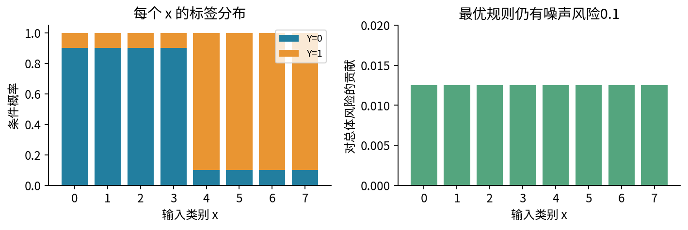
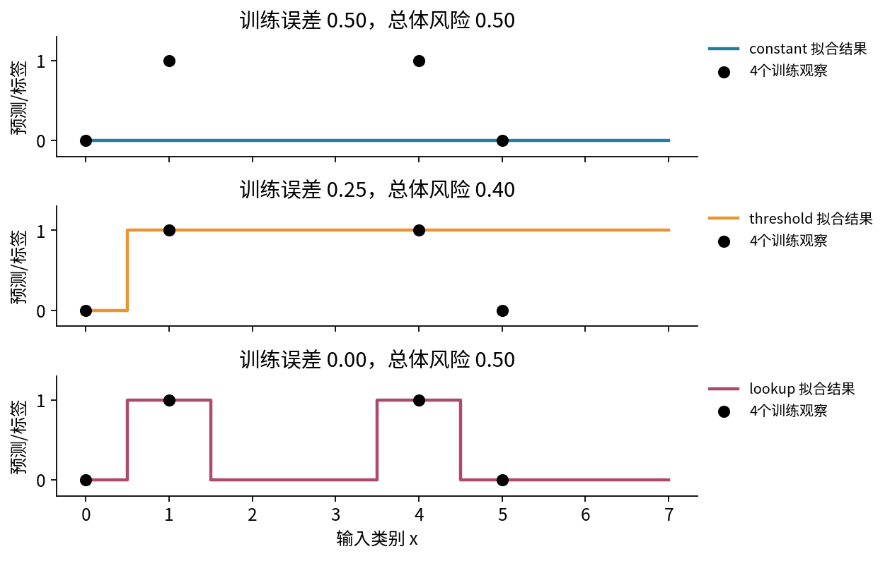
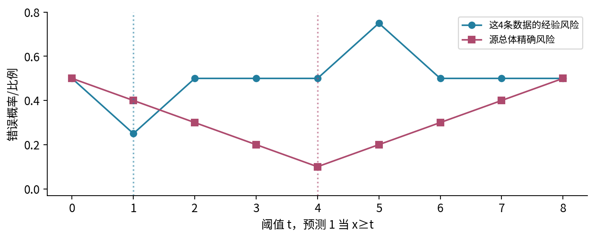
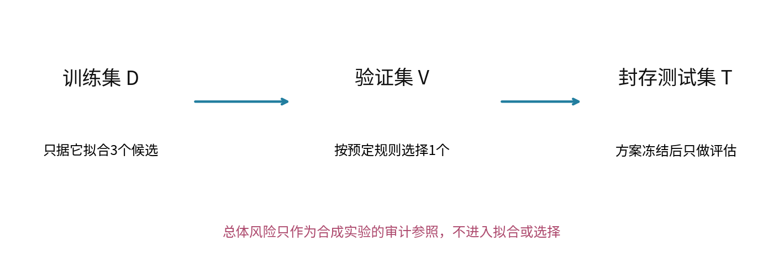
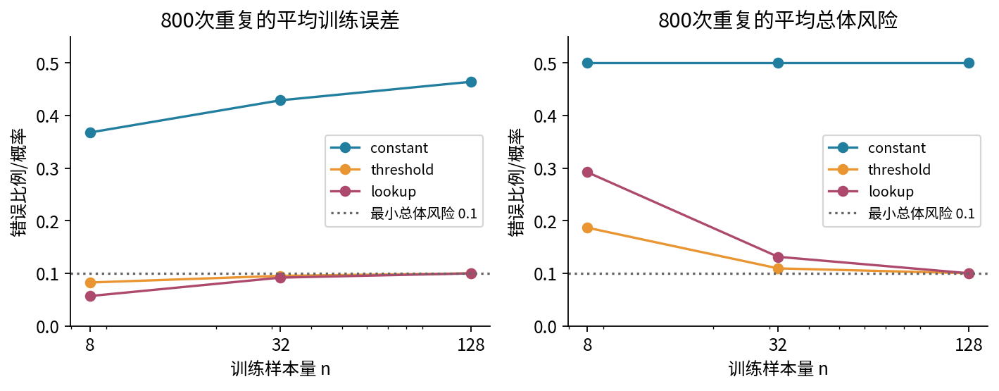
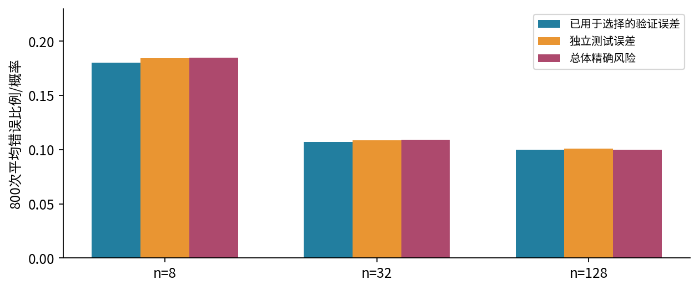
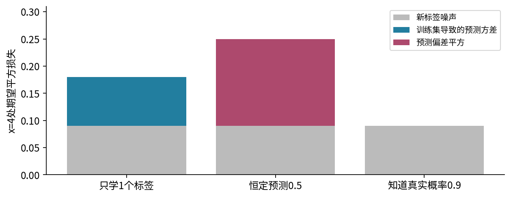
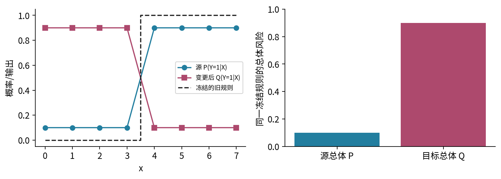

# 经验风险与泛化

## 第020单元 训练平均为什么只是一个替代目标

一个规则把训练中的每条标签都答对，另一个只答对四分之三。应该选哪一个？答案不能仅从这两个训练比例读出：训练数据既参与了选择，又被拿来评分；而真正想知道的是规则对目标总体的新样本会怎样。本讲用一个能精确算出全部总体风险的小世界，逐步分开拟合、模型选择、抽样、优化和分布变化。

先修018，沿先修链已学事件、离散分布、条件概率、期望、方差与抽样误差。这里不要求梯度、矩阵、深度网络或连续积分；“最小化”先通过枚举有限候选完成。数据、候选、图和程序均原创。本讲的合成总体故意对我们完全已知，目的是核对推理；真实任务通常没有这样的总体答案表。

## 一 先把预测任务和总体写出来

输入X是0到7中的一个类别，八种输入各占1/8。标签Y只能为0或1。对x=0、1、2、3，P(Y=1|X=x)=1/10；对x=4、5、6、7，这个条件概率是9/10。记η(x)=P(Y=1|X=x)。同一个x可以产生不同标签，因此输入并没有完全决定输出。

模型h是一条确定规则，对每个输入x输出0或1。我们用8个数构成的元组记录它：第x个位置就是h(x)。例如h=(0,0,0,0,1,1,1,1)在前四类预测0，后四类预测1。参数的具体写法不是本讲重点，规则在每个可能输入上做什么才是对象。

损失函数ℓ把预测与真实标签转换成一个数。本讲主线使用0–1损失：预测相同为0，不同为1，记ℓ(h(x),y)=1{h(x)≠y}。花括号里的命题成立时指示函数取1，否则取0。它衡量分类错误，没有为某一类别赋更高代价；若现实代价不对称，需先改目标再谈“好模型”。

## 二 总体风险是新样本损失的期望

给定总体联合分布P和冻结的规则h，总体风险定义为：

$$R_P(h)=E_{(X,Y)\sim P}[\ell(h(X),Y)]=\sum_x\sum_y P(X=x,Y=y)\ell(h(x),y).$$

记号“∼P”说明新样本按哪个分布抽取。对本课0–1损失，风险就是预测错误的概率，介于0与1。若换成平方损失，风险就有目标量单位的平方，数值范围也不再限于1。[1]

由于联合质量等于P(X=x)P(Y=y|X=x)，在某个x预测0时条件错误率为η(x)，预测1时为1−η(x)。于是主例的风险可直接写成：

$$R_P(h)=\frac18\sum_{x=0}^7\left[\eta(x)\,1\{h(x)=0\}+(1-\eta(x))\,1\{h(x)=1\}\right].$$

八个位置可以分别选较小条件错误率。η小于1/2时选0，大于1/2时选1；等于1/2时两个选择风险相同。所得总体最优规则$h^*$=(0,0,0,0,1,1,1,1)，风险$R^*$=1/10。这种给定损失和分布的最优规则常称Bayes规则；它不意味着我们已经知道真实世界的η。

主例中，任何规则只要与$h^*$在k个输入类别上不同，风险就是0.1+0.8k/8=0.1+0.1k。每错一个“总体多数类方向”，该位置的条件错误率从0.1升到0.9，再乘输入权重1/8。这条手算式使我们无需大型测试集，也能精确审计全部256条规则。

## 三 经验风险用观测到的频率代替总体权重

训练集D含n个观察(xᵢ,yᵢ)。经验风险定义为该批数据的平均损失：

$$\widehat R_D(h)=\frac1n\sum_{i=1}^n\ell(h(x_i),y_i).$$

帽子提醒它是基于有限样本的量，下标D提醒它取决于具体哪批数据。它用观察到的频率代替未知P的权重：同一个输入出现多次就贡献多次，未出现的输入在训练平均里不直接贡献损失。经验风险最小化，简称ERM，是在允许的候选集合H中找训练平均最小的规则。[1]

$$\widehat h_D\in\operatorname*{arg\,min}_{h\in H}\widehat R_D(h).$$

arg min表示使目标达到最小的“规则”，而min表示“最小数值”。多个规则并列时需规定如何选；本课按8位预测元组的字典序取最小，优先0而非1。未说明并列规则，重跑结果就可能不同；这也是学习算法的一部分。

如果h在看训练集之前已经固定，D的样本IID来自P，则每项损失均值是R_P(h)，018的线性期望给出E_D[ $\widehat R_D$(h) ]=R_P(h)。0–1损失下，方差是R_P(h)(1−R_P(h))/n。这一无偏性质的关键是固定h；训练完成后挑出的$\widehat h_D$依赖D，不能直接把同一句话里的h换成$\widehat h_D$。

## 四 一个完整手算反例

取四个训练观察D={(0,0),(1,1),(4,1),(5,0)}。其中(1,1)与(5,0)是主例总体中各自较少见的标签，但都是允许发生的结果。我们比较三个嵌套候选集合：

- 常数类只有全0与全1两条规则，完全忽略输入
- 阈值类有9条规则h_t(x)=1{x≥t}，t取0到8；包含两个常数端点
- 查表类允许8个位置分别取0或1，共2⁸=256条规则，包含全部阈值规则

它们的容量不同：这里容量先指能选择多少种输入输出映射。参数个数并不是普适容量度量；更一般概念在后续学习理论中展开。当前有限域使三类都可精确枚举，不存在尚未找到训练最优解的借口。

常数类两条规则都错2/4，按并列规则选全0，总体风险0.5。阈值类t=1在四条训练数据上只错x=5一条，训练风险0.25；总体上却把x=1、2、3三个类别的多数方向预测错，所以总体风险0.1+0.1×3=0.4。

查表类可在每个已见输入上照抄标签，未见输入依并列规则取0，得到(0,1,0,0,1,0,0,0)。训练风险为0，然而与$h^*$不同的位置有1、5、6、7共四个，总体风险0.5。零训练误差并不意味着这个规则已经学到总体结构。

特别注意，t=4的总体最优阈值在这批训练数据上错2/4，比ERM的训练表现差。若把“优化得更好”简单当作“总体风险必然更低”，此处就会得到错误结论。这个例子同样不说明故意优化差总是更好；它只证明两个目标不相同。

## 五 拟合后再评分为什么会乐观

更小的例子能看清选择效应。仍从本课总体抽一个训练样本；无条件Y=1概率1/2。只允许全0与全1两条常数规则，ERM选择这一次观察到的标签。训练风险无论抽到什么都为0，而选出的常数规则在新样本上的风险始终为1/2。

每条预先固定的常数规则，其训练风险都是总体风险的无偏估计；但“在同一份数据上选择最小者后，报告它的训练风险”不再无偏。这不是程序错误，也不需要梯度；它来自使用同一随机观察做选择与评价。候选越多，可能利用的偶然波动也越多，但不能据此断言所有大模型都一定泛化差。

泛化差距通常指R_P($\widehat h_D$)−$\widehat R_D$($\widehat h_D$)，描述同一已学规则的总体与训练差异。它与总体风险本身不同：常数模型训练与总体都为0.5时差距为0，仍然远差于0.1的最优规则。只追求“训练测试差距小”，可能得到稳定但没学会任务的模型。

## 六 近似误差与估计误差

设H是预先规定的有限候选集合，$h_H^*$是其中总体风险最低的规则，$h^*$是所有8位规则中的总体最优者。先假定ERM被精确求解，则有纯代数分解：

$$R_P(\widehat h_D)-R^*=
\underbrace{R_P(h_H^*)-R^*}_{\text{近似误差}}
+\underbrace{R_P(\widehat h_D)-R_P(h_H^*)}_{\text{估计误差}}.$$

两项均非负。近似误差来自H根本不能表达总体最优选择；给常数类无限多数据，也无法把输入左右两半分开。估计误差来自用有限D选规则，与“若知道总体时H内该选谁”的差异。它会随训练集变化；这里并未声称它对样本量逐点单调下降。[2]

对固定四条数据，常数类近似误差0.5−0.1=0.4，估计误差0；阈值类近似误差0，估计误差0.4−0.1=0.3；查表类近似误差0，估计误差0.5−0.1=0.4。容量增大降低或保持类内最优总体风险，但对实际学到的规则，有限样本选择的不稳定性可以抵消这种表达优势。

这些定义需以目标P为参照。现实中未知R_P与$h_H^*$，不能看见一条训练曲线就准确给它贴上某个误差来源。诊断要用有控制的比较，例如固定数据改变优化预算、固定算法增加独立样本、或明确扩大候选集合，并保留评价边界。

## 七 优化误差应在哪个目标上定义

实际算法可能只得到近似训练解$\widetilde h$。经验优化误差定义为$\delta_{\rm opt}$=$\widehat R_D$($\widetilde h$)−min_{h∈H}$\widehat R_D$(h)，它非负。我们的枚举解$\delta_{\rm opt}$=0；神经网络中求解不充分可能使这一项正，但我们此时还没有训练神经网络。

不要把R_P($\widetilde h$)−R_P($\widehat h_D$)直接称为一个必定非负的“总体优化误差”。在主例取$\widetilde h$=h₄，则经验优化差为0.5−0.25=0.25，总体差却是0.1−0.4=−0.3。它能为负，不能和近似、估计误差硬拼成三个都非负的精确等式。

更安全的关系是一个上界。定义$\varepsilon_D$=max_{h∈H}|$\widehat R_D$(h)−R_P(h)|，它要求对整个候选集合同时控制偏差。依次加入与减去经验目标：

$$\begin{aligned}
R_P(\widetilde h)&\leq\widehat R_D(\widetilde h)+\varepsilon_D\\
&\leq\widehat R_D(h_H^*)+\delta_{\rm opt}+\varepsilon_D\\
&\leq R_P(h_H^*)+\delta_{\rm opt}+2\varepsilon_D.
\end{aligned}$$

第二步因为经验最优不比$h_H^*$的经验风险更大。因此超额风险至多为近似误差+$\delta_{\rm opt}$+2$\varepsilon_D$。这是给定D上的代数界，本身不需要宣称样本独立；但想证明$\varepsilon_D$在某种采样下很小，就需要统计假设与进一步论证。固定四条数据的阈值$\varepsilon_D$=11/20，所得上界很松，不能拿形式正确的式子假装获得强保证。

为什么要“同时控制”？对固定h，由018可用Chebyshev给P(|$\widehat R$−R|≥ε)≤1/(4nε²)。对有限H，至少一条规则偏差大的概率，不超过各条失败概率之和，所以至多|H|/(4nε²)，必要时与1取较小值。这个简单界可能很保守，但明确显示：固定一条规则的误差结论不能自动保护看完数据再选择的所有候选。更强界和复杂假设类留待后续；本课不假装这个界解释了所有深度网络现象。

## 八 训练验证测试承担不同职责

训练集用于拟合候选；验证集用于比较这些候选或选定配置；测试集在方案冻结后提供一次独立评估。三者是否真正独立，取决于采样单位和生成过程。给同一人的重复记录换不同文件名，或让未来信息进入特征，都不会因为叫“测试集”就安全。005已讲数据边界，021将具体实现实体与时间拆分。

本实验先用训练集分别拟合三个模型，再只根据32条验证样本选择其中一个，并列时按常数、阈值、查表的预定顺序选。确定规则后才计算256条独立测试样本上的错误率。源总体精确风险只出现在审计函数，不进入拟合或选择。不要把一个合成实验里能看见真值的特权带到真实研究流程。[3]

若模型已冻结，独立测试样本IID来自同一个P，则条件于该模型，测试平均是R_P(h)的无偏估计；但它仍有抽样误差。测试错得比训练多并不说明测试程序坏了；测试恰好更低也不证明没有过拟合。若反复用测试反馈改模型，模型便依赖测试数据，原来的独立评价论证失效。

验证分数同样在被用于选择后可能乐观。将选中模型的验证分数当最终无偏成绩，会重复训练集上发生的选择问题。更多细节如嵌套验证、配对比较、多次尝试与不确定性区间，在021、022展开；本讲先保留职责。

## 九 改样本量和容量时实际发生了什么

实验对训练样本量8、32、128各做800次独立重复。每次用同一训练批拟合三类模型，按固定规则选择，再评估独立测试集与精确总体。共同训练批保证容量比较不是在不同偶然数据上碰巧取胜；仍不能把这800次模拟当真实人群的证据。

n=8时，阈值平均训练误差0.08250、总体风险0.18675；查表分别0.05672与0.29225。n=128时，两者在这800次中平均总体风险都约0.100125，接近不可消除噪声0.1。这是本有限问题下的观察；不能据此指定所有任务的最佳模型规模或所需样本量。

常数类训练误差随n从约0.36781升到0.46435，总体始终0.5。训练误差变大不一定是学习变坏：小样本中选择多数标签容易利用偶然失衡，更多数据反而减少这种表面优势。查表训练最优不差于阈值，是H的集合包含关系保证；总体排序没有相同保证。

每个汇总数字本身有Monte Carlo误差。比如n=8阈值的800次总体风险平均，其MCSE约0.00384。它描述我们重复模拟所得平均的波动，不是现实某一个训练模型的保证区间。代码记录全部9600条“重复×候选/选中”结果，便于复核定义和计算。

## 十 偏差方差语言需要注明损失

“简单模型偏差大，复杂模型方差大”是一种常见诊断语言，但若要得到精确加法式，必须注明统计对象和损失。本节只对平方损失作推导，不把它直接套到前面的0–1损失。[4]

固定一个输入x，令η(x)=E[Y|X=x]，新标签写Y=η(x)+ε，满足条件均值E[ε|x]=0。不同训练集D产生数值预测f_D(x)，并与这次新标签独立；它可以是0到1的概率估计，暂不阈值化。记平均预测m(x)=E_D[f_D(x)]。把误差拆成：

$$f_D(x)-Y=[f_D(x)-m(x)]+[m(x)-\eta(x)]-\varepsilon.$$

对训练集和新标签一起取平方期望。第一个中心化项均值为0，新标签噪声均值为0，独立性使交叉项消失，得到：

$$E_{D,Y\mid x}[(f_D(x)-Y)^2]=
\operatorname{Var}_D(f_D(x))+
(m(x)-\eta(x))^2+
\operatorname{Var}(Y\mid x).$$

依次是预测随训练集的方差、预测偏差平方、新标签不可消除噪声。不是目标人群中输入的方差，也不是训练损失曲线的方差。若要全局风险，还需按P(X=x)对输入加权。若新标签和训练集不独立，交叉项的删除可能无效。

在x=4处，η=0.9，新标签噪声方差0.09。若只观察该输入的一个独立训练标签并用它预测，平均预测0.9，所以偏差为0，预测方差0.09，期望平方损失0.18。恒定预测0.5没有训练方差，却有偏差平方0.16，总损失0.25。知道真实η时预测0.9，总损失仍0.09。

“偏差”也要说明参照：这里是预测的平均与η的差，不是第018单元某个均值估计量的同名符号自动套用，更不等于第六节类内最优与全局最优的风险差。这些概念有联系，却不是同一个数。

## 十一 分布变化不是训练目标没优化好

现在冻结源总体最优规则h₄不动。把目标分布改为Q：输入仍均匀，但前四类η变为0.9，后四类变为0.1。相同规则的目标风险R_Q(h₄)=0.9，而源风险R_P(h₄)=0.1。我们已精确求得源总体最优，因此这个失败不能靠“把原训练目标再下降一点”解释。

另一种变化只改输入比例，保留η不动：令八类输入的相对质量为(1,3,3,3,1,1,1,1)。固定四条数据学出的阈值t=1，在源P上风险0.4，在这个目标Q上变为43/70≈0.61429，因为它错误的三个输入更常见。改变P(X)与改变P(Y|X)是不同机制，都要求我们先问目标总体是什么。

真实情形可能同时涉及测量、标签定义、选择偏差或时间变化，不能只看一次测试分数就断言是哪一种。这个单元帮助排列诊断问题：目标是否清楚？样本能否代表它？候选类是否有表达能力？经验目标是否求解充分？选择和评价是否隔离？下一讲将把这些职责落到具体指标与拆分代码。

## 来源与阅读范围

[1] Andrew Ng，[CS229 Learning Theory](https://cs229.stanford.edu/notes_archive/cs229-notes4.pdf)，第3–5页核对经验风险、总体风险、ERM与有限候选集合。正文8类总体与手算例子独立构造。

[2] Percy Liang，[CS229T author lecture source](https://github.com/percyliang/cs229t/blob/master/lectures/notes.otl)，Error decomposition与Uniform convergence部分，核对近似、估计及看完数据再选择的区别。本课只证明有限集合的基本界。

[3] scikit-learn官方[Common pitfalls](https://scikit-learn.org/stable/common_pitfalls.html)，核对测试信息不得参与模型选择或训练期预处理。本课不依赖scikit-learn运行。

[4] scikit-learn官方[Bias variance decomposition example](https://scikit-learn.org/stable/auto_examples/ensemble/plot_bias_variance.html)，核对平方损失下训练集波动、偏差与噪声的对象；本课用原创二元标签算例，不复制其数据或图。

## 练习

1. 写出主例16个(x,y)组合的联合质量，验证归一化，并推导总体风险公式。
2. 为什么在主例与$h^*$不同k个位置的规则风险为0.1+0.1k？常数规则是多少？
3. 手算固定四条数据上三个ERM规则与训练、总体风险。
4. 举出一个经验优化更差、总体风险反而更好的规则，并解释为什么不能据此建议总是优化更差。
5. 用单样本常数选择例子说明固定模型无偏评价不能直接推广到数据依赖模型。
6. 计算三类的近似误差与估计误差，说明常数模型泛化差距为0仍可能很差。
7. 逐步证明近似误差+$\delta_{\rm opt}$+2$\varepsilon_D$上界；为什么$\varepsilon_D$要覆盖整个H？
8. 推导有限H的Chebyshev与事件并集上界，并说明什么时候没有实用信息。
9. 为什么模型选中后的验证误差不是最终独立测试误差？写出每份数据可影响哪个步骤。
10. 根据800次模拟解释训练误差上升却不意味着泛化恶化的例子；不得把模拟MCSE当单模型保证。
11. 完成固定x的平方损失分解，并手算单标签估计与常数0.5两种规则。
12. 分别核算条件机制反转后的0.9与输入质量变化后的43/70，指出它们改变了什么。
