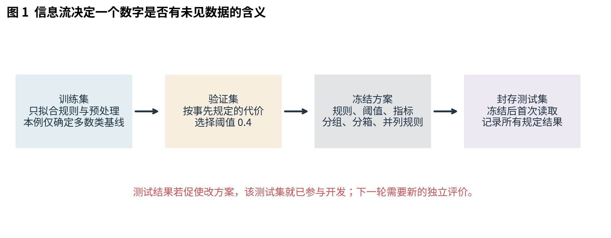
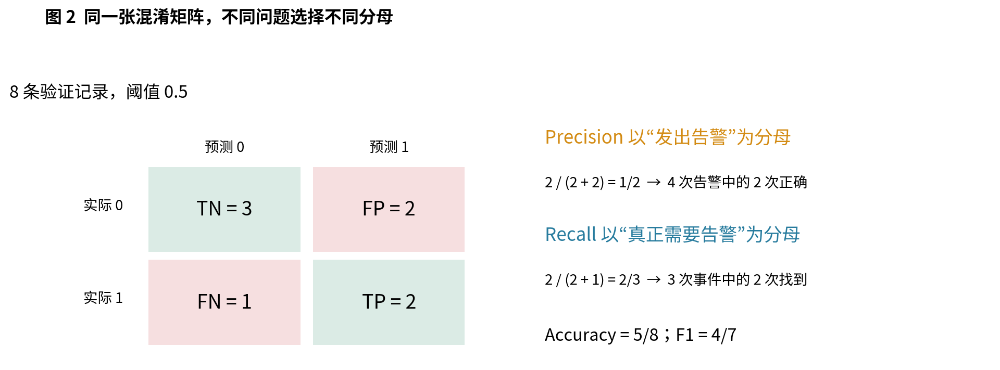
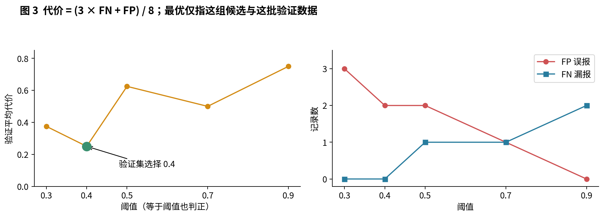
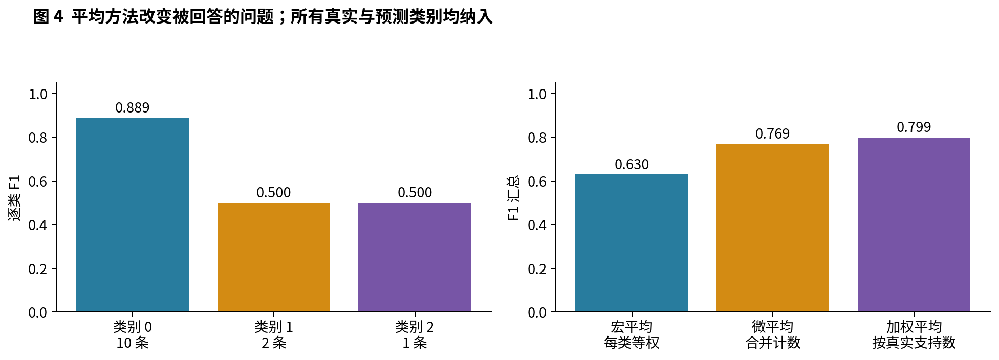
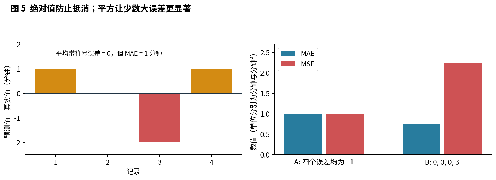
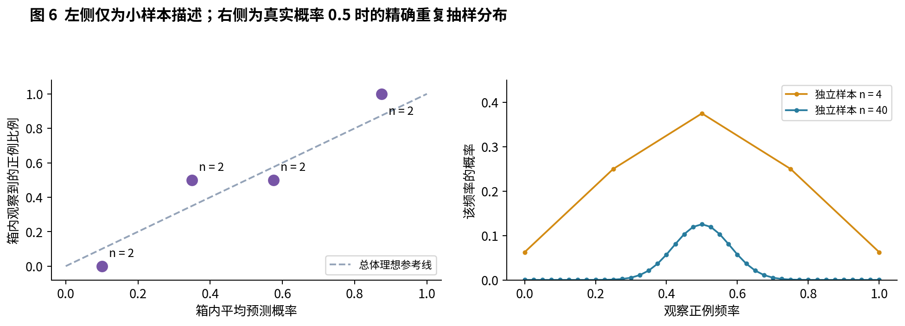
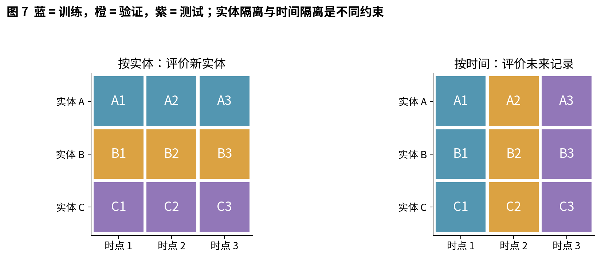
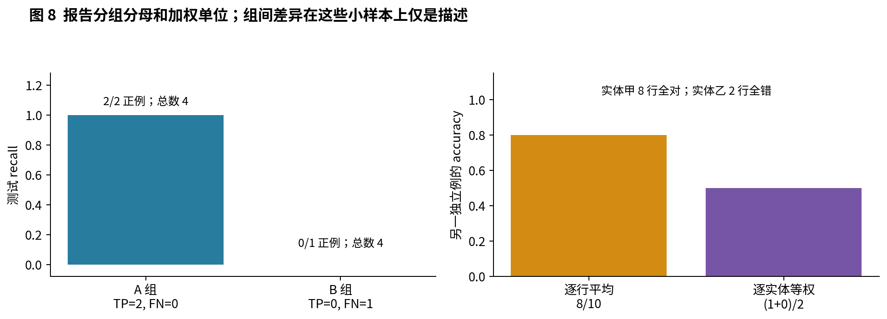

# 021 指标拆分与可信评价

一个数字怎样成为与任务目标相关的证据？

“准确率是 95%”还没有说明模型能否帮助人做事。若 100 次机器检查里只有 5 次真的需要检修，永远回答“不需要”就有 95% 准确率，却一次也没有找到需要检修的机器。数字可以算对，所回答的问题仍然可能选错。本讲从告警任务出发，逐步确定计数方式、错误代价、选择过程和适用人群。

读完后，你应能把“效果不错”改写为一条可核查的陈述：在什么时间、哪些实体、多少真实正例上，用何种冻结规则得到什么结果；哪些是观察值，哪些还不能推及目标总体。

## 1 先把评价对象说清楚

先修为 005 数据管线与可视化检查、018 期望方差与抽样误差、020 经验风险与泛化。这里只用列表、有限和、比例、平方和平方根。我们把模型当成输出分数的已固定规则，不假定已学习神经网络、梯度或优化算法。

**贯穿任务。** 合成机器记录在检查时提供传感器整数值，之后才得到是否需要检修的标签。正类 1 表示需要检修，负类 0 表示不需要；告警是预测 1。漏报和误报都会付出代价。本讲的 3∶1 代价仅是教学设定，不代表真实检修成本。

| 符号 | 含义与形状 | 本讲约束 |
|---|---|---|
| $n$ | 当前评价集合的记录数，标量 | 正整数，不以空集算平均 |
| $y_i$ | 第 $i$ 条真实标签 | 二分类时为 0 或 1 |
| $s_i$ | 冻结规则给出的分数 | 本例 $s_i=\mathrm{sensor}_i/10$，在 $[0,1]$ |
| $\tau$ | 决策阈值，标量 | 事先列出的候选之一 |
| $\hat y_i$ | 预测标签 | $\hat y_i=\mathbf 1\{s_i\geq\tau\}$ |
| $C$ | 混淆矩阵 | 二分类 $2\times2$，多分类 $K\times K$ |
| $g_i$ | 记录所属分组或实体标识 | 不作为本例预测输入 |

$\mathbf 1\{A\}$ 是指示函数：条件 $A$ 成立时取 1，否则取 0。标签、分数、预测都是长度为 $n$ 的一维序列；每个位置必须指向同一记录。不能分别排序后再配对。分数位于 $[0,1]$ 并不自动使它成为可信概率。

评价还需要一句“适用范围”。本例最终测试的是较晚时段、开发阶段未见的机器实体。若真实目标是同一批机器的下一天，拆分设计便可能不同。评价协议应先于“哪个分数最高”的搜索。

## 2 训练验证测试各承担什么工作

训练集可用于选择参数、拟合预处理和建立基线；验证集可用于挑选候选规则、阈值和报告方案；测试集负责在选择结束后评价冻结方案。三个名称的意义来自信息用途，而非文件名。

本例故意不用训练算法，固定分数为 sensor/10，只从训练标签确定多数类基线。即使模型分数没有拟合，阈值也是需要选择的方案组成部分。因此验证集和测试集仍须区分。

冻结清单包括：任务、正类含义、数据名单、分数规则、阈值候选、错误代价、并列时如何选择、最终指标、分组字段、分箱边界以及空分母约定。脚本先在隔离的本次尝试目录写入 frozen_plan.json，然后才首次打开 sealed_test.csv；全部计算成功后才替换正式结果，输入失败保留旧结果。开发数据摘要同时写入，方便发现版本变化。

如果看过测试集后把阈值从 0.4 调到 0.3，即使没有训练任何权重，也已经让测试数据影响方案。此时原测试结果仍可作为开发记录，但不能继续充当同一方案的独立最终证据。需要另留未参与选择的数据，或明确记录后续结果只用于探索。

“只读一次”不是数学魔法：无论读了几次，只要所有选择都已冻结，重新运行同一确定性脚本是在核验复现；即使只看一次，若据此选了模型，仍然发生选择偏差。文件日志也不是安全封存，不能阻止人直接打开 CSV。现实工作还需要团队流程和适当的数据权限。

## 3 从四个计数推导分类指标

规定混淆矩阵的行是真实类、列是预测类，顺序均为 0、1：

$$C=\begin{pmatrix}TN&FP\\FN&TP\end{pmatrix}.$$

TP 是真实为正且预测为正的个数；FP 是真实为负却预测为正的误报；FN 是真实为正却预测为负的漏报；TN 是真实为负且预测为负的个数。四格互不相交并覆盖所有记录，所以它们的和必须等于 $n$。矩阵若换了坐标约定，必须重新标注，不能凭位置猜含义。

验证集给出 $y=(1,0,1,0,1,0,0,0)$，对应分数 $s=(0.9,0.8,0.7,0.6,0.4,0.3,0.2,0.1)$。阈值 0.5 把前四项判正，其余判负。逐条检查可得 TP=2、FP=2、FN=1、TN=3。

准确率把每条记录等权，问“标签答对了多少”：

$$\mathrm{Accuracy}=\frac{TP+TN}{n}=\frac58.$$

精确率 precision 问“已发出的告警中，多少确实需要检修”；召回率 recall 问“所有真正需要检修的记录中，多少被告警覆盖”：

$$P=\frac{TP}{TP+FP}=\frac12,\qquad R=\frac{TP}{TP+FN}=\frac23.$$

两者分别是“预测为正”条件下与“真实为正”条件下的经验比例，条件不同。precision 高不保证漏报少；recall 高不保证告警节省人力。报告分子分母让读者看见代价发生在哪里。

## 4 F1 是怎样的折中

当 $P,R$ 都为正时，调和平均把倒数先平均再取倒数：

$$F_1=\frac{2}{1/P+1/R}=\frac{2PR}{P+R}.$$

将前面的计数代入，而不是把两个百分数直接相加：

$$\frac1P+\frac1R=\frac{TP+FP}{TP}+\frac{TP+FN}{TP}=\frac{2TP+FP+FN}{TP}.$$

于是得到适合直接实现的计数式：

$$F_1=\frac{2TP}{2TP+FP+FN}=\frac47\approx0.5714.$$

当 TP=0 而 FP+FN>0 时，计数式仍有定义且等于 0；倒数推导中的中间式不能直接用于这个边界。F1 没有 TN，因此即使负例规模变化，四格中的 TP、FP、FN 不变时 F1 也不变。它不是完整的成本函数。F1 的形式对 precision 和 recall 对称，也不表示一条漏报与一条误报在业务中具有相同损失。

**分母为零时不能伪装成测到了零。** 若没有正预测，precision 未定义；若没有真实正例，recall 未定义；若真实和预测都没有正例，F1 未定义。本讲程序用 zero_division=0 填充需要汇总的数值，同时保留 undefined 列表、support（真实正例数）和 predicted_positive（正预测数）。这是一项计算约定。

例如 $y=(0,0),\hat y=(0,0)$，准确率为 1，precision、recall、F1 都未定义。填充后的三个 0 不表示证实模型“完全没有召回能力”；这两条记录根本没有检验找正例的能力。改用 zero_division=1 可以测试另一种约定，不能借此美化报告。[S1] 给出常见实现的空分母语义，本实验始终显式记录选择。

**失衡检查。** 95 个负例与 5 个正例全部预测为负时，准确率 0.95，recall=0，F1=0，precision 未定义。这是全负基线而非成功的告警器。比较模型时应列出正例数、基线、至少一项与漏报或误报相关的指标。

## 5 阈值把分数变成行动

增大阈值使正预测集合缩小，TP 和 FP 都不会增加，FN 不会减少；只要真实正例数固定且非零，recall 不会上升。precision 没有这种必然单调性：删掉的低分样本可能恰好多数是真正例。例如三条按分数递减的标签为 $(0,1,1)$，只保留第一条反而使 precision 从 $2/3$ 降到 0。

本讲在打开数据前约定每次 FN 代价为 3，每次 FP 代价为 1，正确决策代价为 0。平均代价为：

$$\widehat L(\tau)=\frac{3FN(\tau)+FP(\tau)}n.$$

| 候选阈值 | TP | FP | FN | TN | 总代价 | 验证 F1 |
|---|---:|---:|---:|---:|---:|---:|
| 0.3 | 3 | 3 | 0 | 2 | 3 | 2/3 |
| 0.4 | 3 | 2 | 0 | 3 | 2 | 3/4 |
| 0.5 | 2 | 2 | 1 | 3 | 5 | 4/7 |
| 0.7 | 2 | 1 | 1 | 4 | 4 | 2/3 |
| 0.9 | 1 | 0 | 2 | 5 | 6 | 1/2 |

最低总成本选择 0.4；若并列，事先规定选较大的阈值。相等分数按 $s_i\geq\tau$ 判正，不能把同分记录任意拆开。这个“最优”只指五个候选在八条验证记录上的最优，不是总体或所有阈值的最优。增加候选虽可能降低验证最小值，也增加了适应验证噪声的机会。[S2] 区分分数估计和阈值决策，并强调阈值选择的数据边界。

若已知某条记录的真实条件正例概率 $p$，告警的期望代价是 $1-p$，不告警是 $3p$。比较 $1-p\leq3p$ 可得理论阈值 $p\geq1/4$。这只在概率可信、代价恒定且无额外容量约束时成立。本例的传感器分数没有被证明是概率，所以不能将 0.25 当作无条件正确答案。

## 6 多分类时平均谁

单标签多分类指每条记录恰有一个真实类和一个预测类。令类别全集 $\mathcal K$ 在评价前固定，大小为 $K$。对每类 $k$ 做一次“该类为正，其余类为负”的计数，就得到 $TP_k,FP_k,FN_k$。混淆矩阵中 $C_{ab}$ 表示真实类为 $a$、预测类为 $b$ 的个数。

使用这个原创小例：

$$C=\begin{pmatrix}8&1&1\\0&1&1\\0&0&1\end{pmatrix},\qquad n=13.$$

逐类真实支持数为 $(10,2,1)$，逐类预测数为 $(8,2,3)$。因此 F1 为 $(8/9,1/2,1/2)$。宏平均先算各类指标，再让每类等权；微平均先合并计数，再作一次比例：

$$F_{\mathrm{macro}}=\frac1K\sum_{k\in\mathcal K}F_{1,k}=\frac{17}{27},$$

$$F_{\mathrm{micro}}=\frac{2\sum_kTP_k}{2\sum_kTP_k+\sum_kFP_k+\sum_kFN_k}=\frac{10}{13}.$$

每条分类错误恰好给某类贡献一个 FP，给另一类贡献一个 FN；正确数为 $c=\sum_kTP_k$，所以两种错误总数都为 $n-c$。代入上式可得微平均 F1 为 $c/n$，等于准确率。这个结论要求单标签且涵盖所有真实与预测类别；多标签或只统计某些类时不能照搬。

支持数加权 F1 为 $\sum_kn_kF_{1,k}/n=187/234\approx0.7991$，此例并不等于微平均。宏 F1 也不是先平均 P 和 R 再取调和平均，后者是另一个数。

若协议还包括从未出现、也从未预测的类 3，本讲 labels=[0,1,2,3] 与 zero_division=0 会让其 F1 填 0，宏平均变成 $17/36$。它表达的是“固定四类且采用该缺失约定”的汇总，不能当作有该类评价样本。必须同时报告缺失类。事后删掉难类或缺失类，都会改变所回答的问题。

## 7 回归指标先看单位和代价形状

回归预测实数。例如 $y=(2,4,6,8)$ 分钟，预测为 $(3,4,4,9)$ 分钟。定义误差 $e_i=\hat y_i-y_i$，本例为 $(1,0,-2,1)$。平均带符号误差为 0，正负抵消却不表示每条都对。

$$\mathrm{MAE}=\frac1n\sum_i|e_i|=1\ \text{分钟},$$

$$\mathrm{MSE}=\frac1n\sum_ie_i^2=\frac64=1.5\ \text{分钟}^2,\qquad\mathrm{RMSE}=\sqrt{\mathrm{MSE}}\approx1.2247\ \text{分钟}.$$

MAE 中误差从 1 增到 3，单项代价变为三倍；MSE 中变为九倍。因此少量大偏差可以改变模型排序。误差 A 为 $(-1,-1,-1,-1)$，B 为 $(0,0,0,3)$，MAE 更喜欢 B（0.75 对 1），MSE 更喜欢 A（1 对 2.25）。哪一个适合任务取决于大误差的后果。

把单位从分钟换为秒，MAE 和 RMSE 都乘 60，MSE 乘 $60^2$。不可跨单位直接比较数值。对同一评价集合，平方根单调递增，所以 MSE 与 RMSE 的模型排序相同；它们只是表达单位不同。

$R^2$ 将模型平方误差与当前评价集合均值基线比较。令 $\bar y=\sum_i y_i/n$，则：

$$R^2=1-\frac{\sum_i(y_i-\hat y_i)^2}{\sum_i(y_i-\bar y)^2}=1-\frac6{20}=0.7.$$

分子大于分母时 $R^2<0$，不是程序必然出错。分母为零时公式无定义；本讲返回 null 并说明原因，单记录也不报 $R^2$。[S3] 的官方实现对常数目标另有默认替代约定，因此对照软件时必须先对齐约定。公式里的评价集均值仅是定义比较基准，不是可以拿测试标签拟合并部署的预测器。真正可部署的均值基线应只从训练集拟合。

## 8 概率校准与分类精确率不同

precision 衡量被阈值选中那批记录的正例比例；概率校准询问“报出某种概率时，长期发生频率是否相称”。在有限分数取值情形，理想正类校准可写为：

$$\Pr(Y=1\mid S=p)=p\quad\text{对有正概率出现的 }p.$$

连续分数时不能指望很多记录完全同分，实际常按预先固定的分箱作近似观察。对第 $b$ 个非空箱，设索引集合为 $B_b$，数量为 $m_b$：

$$\bar p_b=\frac1{m_b}\sum_{i\in B_b}p_i,\qquad\hat q_b=\frac1{m_b}\sum_{i\in B_b}y_i.$$

可靠性图横轴为 $\bar p_b$，纵轴为 $\hat q_b$。每个点同时标注 $m_b$，空箱不画成 $(0,0)$。本讲固定边界 0、0.25、0.5、0.75、1；前三箱左闭右开，最后一箱两端闭合。因此 0.25 进入第二箱，0.5 进入第三箱，1 进入末箱，每条记录恰好入一箱。

另例的八个概率为 $(0,0.2,0.25,0.45,0.5,0.65,0.75,1)$，标签为 $(0,0,1,0,1,0,1,1)$。各箱均有两条，平均概率为 $(0.1,0.35,0.575,0.875)$，正例频率为 $(0,0.5,0.5,1)$。

本讲定义正类分箱误差 ECE 为 $\sum_b(m_b/n)|\hat q_b-\bar p_b|$，空箱贡献 0，得到 0.1125。它依赖分箱边界和样本量。粗箱中的正负误差可能抵消，改变分箱也可能改变 ECE；不要拿不同分箱协议的 ECE 直接排榜。这里是“正类概率”的分箱定义，不能不加区分地与多分类“最高置信类别”的 ECE 混用。

[S4] 用频率解释校准图，并提醒概率综合评分与纯校准诊断不同；[S5] 是神经网络校准的研究背景。本讲只使用小型计数，不声称验证了任何神经网络的校准方法。

## 9 小样本图上的偏离有多少证据

若固定一个箱，箱中样本相互独立且来自同一目标抽样机制，令真实箱内正例率为 $q_b$。条件于箱内样本数 $m_b$，正例频率的方差为：

$$\operatorname{Var}(\hat q_b)=\frac{q_b(1-q_b)}{m_b}\leq\frac1{4m_b}.$$

等式来自 018 的独立均值方差公式：每个 0/1 标签的方差为 $q_b(1-q_b)$，独立求和后除以 $m_b^2$。上界来自 $q(1-q)=1/4-(q-1/2)^2\leq1/4$。样本数为 2 时，标准误最大可达 $1/(2\sqrt2)\approx0.354$。这是在假设成立时关于频率估计的尺度上界，不是 ECE 的误差条，也不是某个置信水平的区间。

若真实正例率是 0.1，四个独立样本都为负的概率为 $0.9^4=0.6561$。观察频率 0 并不能证明总体率 0，更不能用插入估计得到的“标准误 0”宣布确定无误。频率图贴近对角线，也可能只是分箱粗、小样本碰巧抵消，或某些组的误差被总体平均掩盖。

**同一分类结果可以有不同概率质量。** 对标签 $(1,0,1,0)$，把四个概率都报成 0.6 或都报成 0.9，阈值 0.5 下都全部判正，precision 都为 0.5。两者对概率的承诺却明显不同。二分类 Brier 分数是概率与标签的平均平方误差：

$$\mathrm{BS}=\frac1n\sum_i(p_i-y_i)^2.$$

报 0.6 得 $(2\times0.4^2+2\times0.6^2)/4=0.26$；报 0.9 得 $(2\times0.1^2+2\times0.9^2)/4=0.41$。它同时受概率分辨能力、校准和标签分布影响，不能把分数差全归因于校准。本例仅说明硬标签指标无法区分这些概率输出。

若同一实体贡献多条相似记录，独立假设失效，协方差项不能删除。把一条记录复制一百次可以让图更密，不会凭空增加一百份独立证据。本讲对实体重复的告警实验只报计数和描述结果，不给出假精确的置信区间。

## 10 拆分应当模拟哪一种未见情况

实体是会重复产生记录的对象，如机器、门店或用户。按行随机拆分，可能让同一实体的近重复记录同时出现在训练与测试。模型若记住实体特有模式，会在这样的测试中受益，却未必能处理新实体。

图中的九条记录来自 A、B、C 三个实体，各有时点 1、2、3。按实体分成 A/B/C 三组可检验新实体，但各组都有三个时点，不能据此称为未来预测。按时间分成 1/2/3 则模拟以后时点，但每组都含三个实体，不能据此称为全新实体测试。

主实验的三份数据同时满足：训练实体 E01 至 E04，验证 E05 至 E08，测试 E09 至 E12；时间分别为 1 至 8、9 至 16、17 至 24。脚本在冻结后检查测试实体是否与开发集交叉、记录 ID 是否重叠，以及时间是否严格递增。发现违规就停止评价，不把不合格数据的指标照常当作可信结果。

时间隔离还要考虑标签何时可获得。例如用某日之后七天内是否故障作为标签，在该日立即部署时训练集末端七天的标签可能尚不可得。此时需要按“可用信息时点”截断或留间隔，不能只检查记录时间。本例没有预测窗口与标签延迟，不能用它替现实任务省去这项检查。

[S6] 的分组与时间拆分文档支持这些信息边界。拆分并不保证总体代表性：未来可能换机器型号，未见实体可能与现有测试实体不同。隔离解决某些泄漏路径，不能消除所有分布变化。

## 11 汇总数字背后是哪种人群

冻结阈值 0.4 后，测试集得到 TP=2、FP=2、FN=1、TN=3，平均代价为 $5/8=0.625$，F1 为 $4/7$。验证时的最低平均代价为 $2/8=0.25$。这个差距来自两批固定合成记录的不同；仅凭八条对八条，不能断言发生了某种已被统计证明的分布漂移。

测试 A 组四条记录中有两个正例，全部找到；B 组四条中有一个正例，却未找到。总体 recall 为 $2/3$，组内分别为 1 和 0。B 组没有正预测，所以其 precision 未定义，不能把填充值 0 写成已经精确测得的性能。

分组表至少给出总数、正例数、TP、FP、FN 和目标指标。小组并不因为数值差距大就自动构成显著差异；也不因为样本少就该从报告删去。合理行动是标注证据不足，检查标签与任务条件，收集相关组的更多独立数据。

另一个例子中，实体甲有八行且全对，实体乙有两行且全错。逐行准确率为 8/10；先算每实体准确率再等权平均为 $(1+0)/2=0.5$。前者估计“随机抽一条记录”的表现，后者关注“随机抽一个实体”的平均表现。它们都能计算，但权重必须匹配目标。不要把类别宏平均、实体平均和人群组平均混为一谈。

分组变量也应事先规定。看过测试结果后从上百种切法挑出最好的子组并称其为主结果，仍是选择问题；探索性切分可以帮助发现问题，但必须标成探索，不应获得独立确认的措辞。

## 12 把评价写成可审查的结论

本例可以这样报告：固定 sensor/10 分数，验证集按漏报代价 3、误报代价 1 在五个候选阈值中选择 0.4；方案冻结后，在八条较晚且实体互斥的合成测试记录中，得到 TP=2、FP=2、FN=1、TN=3，F1=4/7，平均代价=5/8。A、B 组分别包含两个和一个正例，recall 为 1 和 0；这只是小型机制演示，没有为真实部署提供性能保证。

这一陈述保留了目标、分母、选择过程、范围和限制。相比只写“F1 达到 57.1%”，读者更容易判断结果是否与自己的任务有关。

实际检查顺序也应如此：先审任务和信息边界，再审实现；先看计数和基线，再看聚合指标；先区分观察与推广，再决定是否继续收集证据。不能靠多报几位小数修复标签错位、泄漏、缺失人群或事后调参。

### 练习

1. 手算阈值 0.5 的四格计数、precision、recall 和 F1，说明各自分母。
2. 95 个负例和 5 个正例全部判负时，哪些指标有定义？
3. 证明计数形式的 F1，并单独处理 TP=0 的边界。
4. 将漏报代价改成 1、误报代价改成 3，重新选验证阈值。为什么不能根据测试结果临时修改这项成本？
5. 证明完整单标签多分类的微 F1 等于准确率，指出两种结论不适用的情形。
6. 计算三类主例的宏 P、宏 R，再取调和平均，与宏 F1 比较。
7. 添加缺失类别后，zero_division=0 与 1 分别怎样改变宏 F1？
8. 手算回归主例各指标；将全部目标和预测加 100，结果怎样改变？
9. 给出一个 $R^2<0$ 的例子，并解释常数目标的处理。
10. 手算四箱的均值、频率、ECE 和 Brier，检查边界 0.25、0.5、1。
11. 为什么 precision 相同不等于概率校准相同？用四条概率例子计算。
12. 分别解释实体拆分和时间拆分的适用目标；构造同时不合格的按行拆法。
13. 把 B 组四条复制十遍，会怎样影响逐行总体 recall 和独立证据量？
14. 冻结测试结果不理想，研究者改了阈值并重报该测试集最好结果，应如何标记并推进下一步？

完整推导与实验核验见 answers.md / answers.pdf。实验的可执行步骤见 lab.md / lab.pdf。

### 一手来源与阅读定位

S1. scikit-learn，precision_recall_fscore_support 官方文档：逐类统计、平均方法、zero_division。<https://scikit-learn.org/stable/modules/generated/sklearn.metrics.precision_recall_fscore_support.html>

S2. scikit-learn，Tuning the decision threshold for class prediction：评分与行动、选择集隔离。<https://scikit-learn.org/stable/modules/classification_threshold.html>

S3. scikit-learn，r2_score：负值、常数目标与 force_finite。<https://scikit-learn.org/stable/modules/generated/sklearn.metrics.r2_score.html>

S4. scikit-learn，Probability calibration：可靠性图及 Brier 的解释限制。<https://scikit-learn.org/stable/modules/calibration.html>

S5. Guo、Pleiss、Sun、Weinberger，2017，On Calibration of Modern Neural Networks，PMLR 70，1321–1330：研究背景，本文不复现实验。<https://proceedings.mlr.press/v70/guo17a.html>

S6. scikit-learn，Cross-validation：分组数据和时间序列数据的拆分。<https://scikit-learn.org/stable/modules/cross_validation.html>

