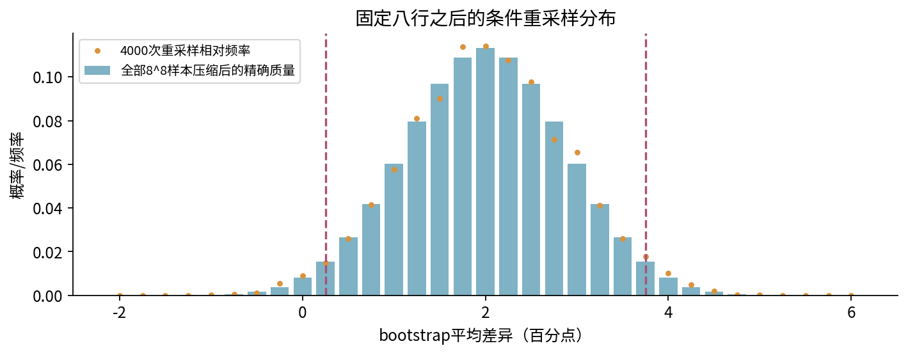

# 022 实验：把比较计划变成可核对的证据

目标是完整报告八组配对结果，复现区间与重采样，主动发现一种会失败的区间方法。实验全部离线、CPU、标准库；不训练真实模型，不调用网络或付费API。先读正文1至6节并手算，之后再运行。

## 1 输入、协议与运行环境

在本单元目录有三份输入：data/seed_scores.csv 给出八个人工设定的配对；data/plan.json 固定 A−B、错误率百分点、全部八种子和两种主要区间；data/config.json 给出随机种子20261004、4000次bootstrap及每种候选数2000次选择模拟。计划文件在脚本运行前已给定，但不等于真实研究的外部预注册。

先写在纸上：重复单位是“固定数据上的一个训练随机状态对”，不是一个新测试实体。正效果表示 B 降低错误率；实际重要性门槛设为3个百分点，是教学假设。若更改问题，应另存新计划、数据和分析，而不是在结果出现后把原计划的方向翻转。

核心只需 Python 3.12 标准库。运行：

```bash
python experiment.py --output outputs
python test_experiment.py
```

建议的可选Notebook环境：

```bash
conda env create -f environment.yml
conda activate dl-unit-022
jupyter lab
```

环境安装可能联网；实验计算不联网。作者在新的Python进程和真实InProcessKernel中顺序执行Notebook，未测试全新Anaconda安装、浏览器Jupyter界面、socket内核传输或跨平台安装。不要把建议环境文件当成实测跨平台锁文件。

五个输出是 results.json、bootstrap.csv、selection.csv、rare_coverage.csv、environment.json。重跑覆盖指定目录的同名文件；保留自定义结果请另给 --output。所有输入检查、计算及序列化先完成，随后才写输出；输入错误不能留下新结果目录或破坏旧结果。此约束不保证操作系统I/O故障时多文件写入原子性。

## 2 手算与接口逐项对齐

先读八行CSV，不重新排序。算出 $d=(2,4,0,6,-2,4,2,0)$、均值2、离差平方和48、样本方差48/7、标准误 $\sqrt{6/7}$。再执行：

```python
from experiment import paired_summary, DEFAULT_ROWS
from fractions import Fraction as F
a = [row[1] for row in DEFAULT_ROWS]
b = [row[2] for row in DEFAULT_ROWS]
summary = paired_summary(a, b)
assert summary['exact_mean'] == '2'
assert F(summary['exact_variance']) == F(48, 7)
print(summary)
```

记录 paired_se≈0.92582 与 unpaired_formula_se≈4.60590。后者只展示独立两组公式误用于这里时的数值，不是第二个同样适合本设计的标准误。

实验A：构造两列始终同步增加的结果，使每行 A−B 恒为2。解释两列各自分数可以波动很大而配对差异不波动。再构造负协方差例子，检查“配对总能缩窄区间”为什么不成立。不要把人为恒差造成的零SE外推成真实方法完全无不确定性。

## 3 保留配对的bootstrap

函数 bootstrap_means 只重采样差异列，局部 Random 实例避免其他单元格改变全局随机状态。每次抽八个索引，记录均值；抽中同一行两次是有放回抽样的正常结果。

```python
from experiment import exact_bootstrap
result = exact_bootstrap([2, 4, 0, 6, -2, 4, 2, 0])
assert result['ordered_samples'] == 8**8
assert result['variance'] == '3/4'
assert result['percentile_95'] == ['1/4', '15/4']
```

exact_bootstrap 用整数计数卷积，不保存1677万行。打开bootstrap.csv，应有4000个统计量；results.json同时记录精确经验分布端点和Monte Carlo端点。两个都必须标成“固定原八行后的重采样计算”，不将其误称为真实总体后验分布。



实验B：复制config.json为custom_config.json，将bootstrap_repeats改为200，再改为12000，每次另设输出目录。比较分位数和经验频率；不要期待端点每次都改变，也不要把重复数增加当成增加了训练种子或测试数据。

```bash
python experiment.py --config custom_config.json --output custom_run
```

允许bootstrap_repeats为20到20000，selection_repeats为20到5000；seed为0到4294967295的整数。CSV必须严格为原三列、顺序不变、八个seed_id恰为0到7、错误率为0到100的整数。函数paired_t7只收八个差异，避免把自由度7临界值错误用于其他样本量。

## 4 区间不一致时先解释条件

主表的舍入t区间约 $[-0.18956,4.18956]$，percentile区间为 $[0.25,3.75]$；额外展示的正态近似区间约 $[0.18539,3.81461]$。不得以“哪个不含0”决定主要结论。t精确覆盖依赖独立正态差异、非零方差及精确临界值；本例只提供舍入临界值和合成表。bootstrap也没有小样本普遍保证。

实验C：运行rare_coverage，核对九种K的概率之和为1。真实均值0.2，却有约92.27%概率观察到全零；全零时无论抽多少次，区间都是[0,0]。从rare_coverage.csv中筛选covers_true_mean=1的行，应只剩K=1和2；按原始抽样概率加总，得到约0.07720137。

```python
from experiment import rare_coverage
coverage, rows = rare_coverage()
assert [r['positive_count'] for r in rows
        if r['covers_true_mean']] == [1, 2]
print(float(coverage))
```

这是完整有限情况的有理数计算，不是4000次模拟得到的覆盖估计。原数据没看到稀有现象，是这里的主要困难；精确穷举bootstrap只能消除Monte Carlo误差。

## 5 选择偏差与依赖单位

selection.csv有3种候选数乘2000次，即6000行。每行包含候选数、重复编号、获胜候选、被挑选的验证噪声与独立复测噪声。候选真实效果都为0，比较的是噪声机制。验证噪声的理论均值分别为0、15/16、524287/524288；独立复测期望始终为0。本次复测均值不必恰好为0。

实验D：独立枚举 $m=3$ 的全部8个±1验证向量，逐个选最大值，求平均。再把每个向量分别配−1和+1两种独立复测，检查复测平均为0。解释此处不是一个“显著性检验模拟”。

将四实体均值[-2,0,2,4]各复制八次，核对两种均值方差估计5/3和5/31。不要把32行重采样的较窄区间解释成更多独立证据。真实研究应先确认实体、时间和数据集层次。

## 6 Notebook、图形与故障检查

Notebook先检查默认输入与已保存结果的配置/主表是否匹配，再从头逐格计算；实验结果另写notebook_outputs并和五份随附输出比对。固定图文不是自定义参数的自动报告。make_figures.py同样在导入绘图库和写图前检查教学输入；若默认输入或结果被自定义运行覆盖，应恢复默认输入并重跑默认脚本后再看固定图。自定义实验请另存，不用旧图解释新设置。

重建图需要NumPy、matplotlib及Noto Sans CJK字体。重建PDF从课程根运行 shared/build_pdf_mathjax.py，分别输入 units/022/lecture.md、lab.md、answers.md。重建后仍须逐页核验。

尝试缺失CSV字段、重复表头、bool配置、超预算重复数；程序必须明确拒绝，并保留旧输出。检查test_experiment.py：它包含独立有理数方差、短样本的全部有序重采样、稀有例的二进制枚举、选择向量枚举和新进程输出对比，不只检查“没有异常”。

最终提交：原八行与计划、五份输出、A至D的推导及一段限制明确的报告。报告要包含效果方向/单位、重复单位、配对数、区间及假设、实际门槛、搜索范围、数据层不确定性尚未覆盖的部分。完整解答见answers.pdf。
