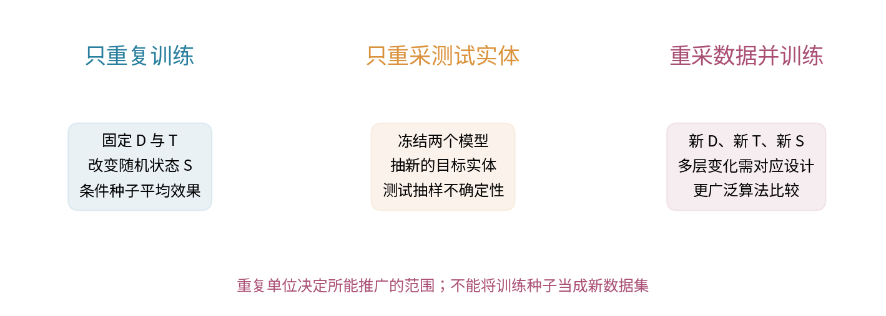
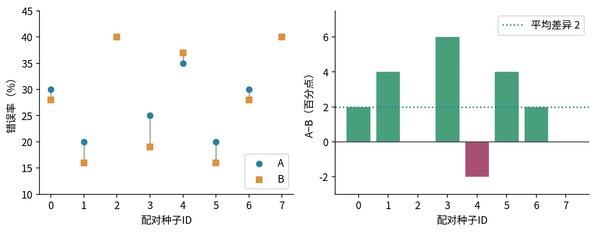
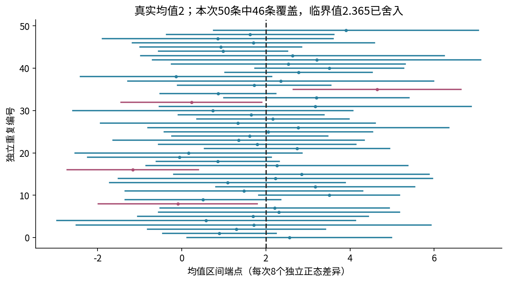
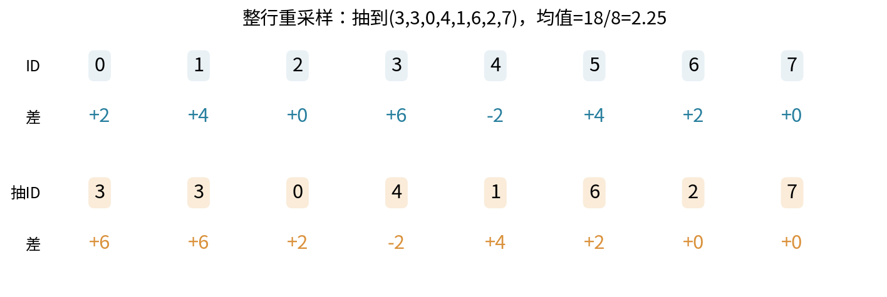
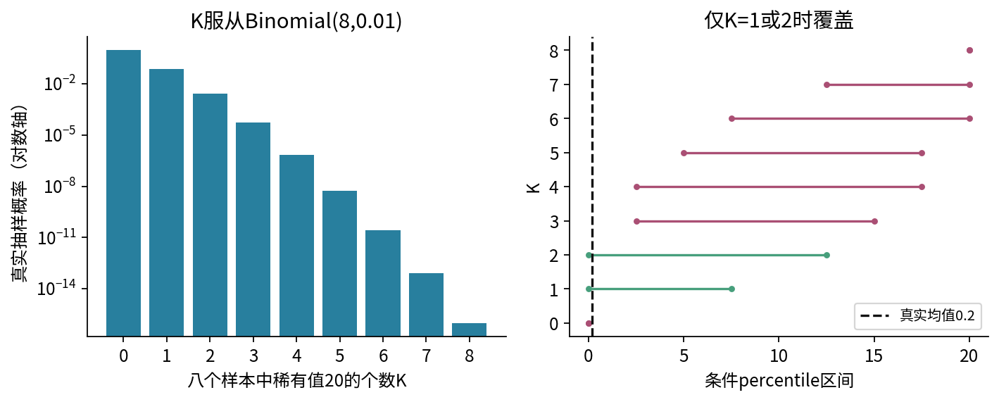
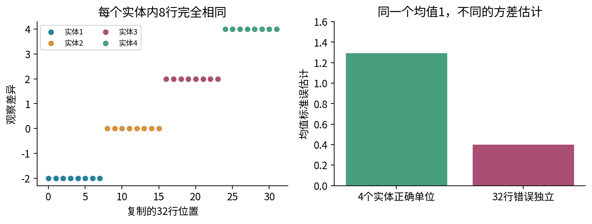
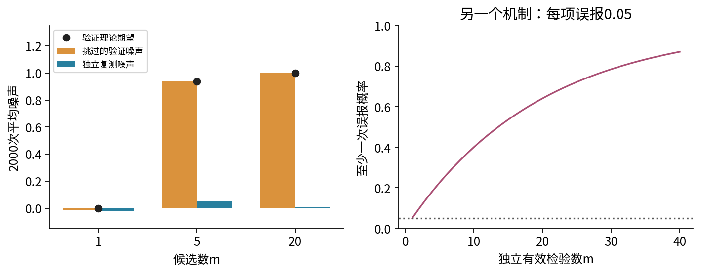
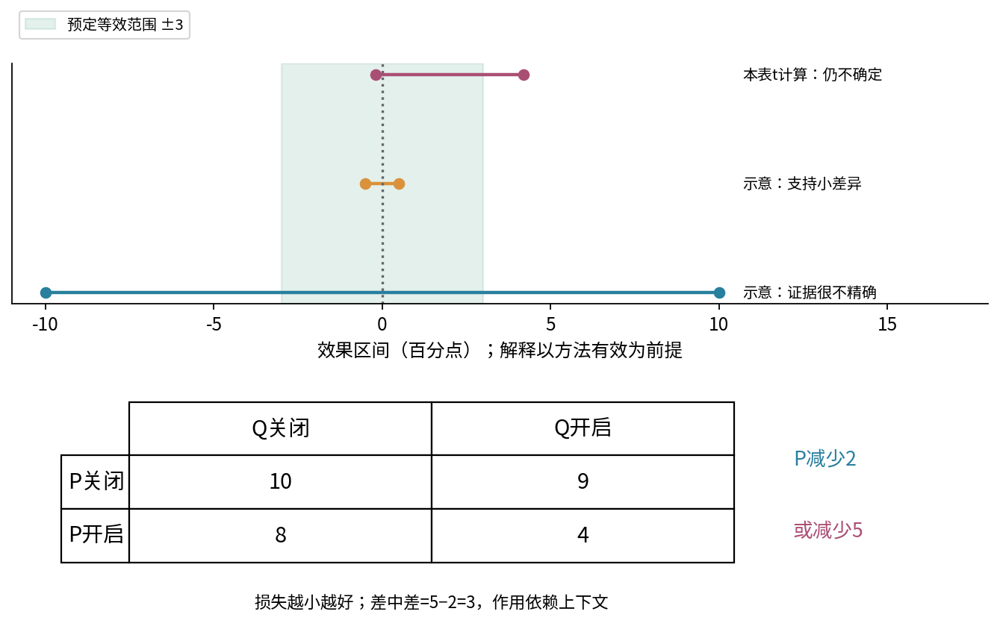

# 022 比较实验与统计不确定性

怎样判断改进来自方法，而不是随机性、调参或选择偏差？

两张排行榜相差两个百分点，可能意味着稳定的改进，也可能只是本次训练、这批测试对象或一轮挑选中的好运。更精细的统计公式不能补救错误的比较对象。本讲从“同一条件下 A 与 B 到底差多少”出发，依次建立配对、区间、重采样、依赖结构与选择过程。

先修 018 的均值、方差、独立性和抽样误差，以及 021 的指标、拆分、冻结方案。模型在这里是产生结果的黑箱，不需要梯度、神经网络或训练框架。所有表和图都是原创合成教学例；主表是人工设定的八组训练种子结果，不是运行八次真实训练得到的性能证据。

## 1 先写出你想推广到哪里

设训练数据为 $D$，评价数据为 $T$，训练随机状态为 $S$。算法 A 的评价结果记作 $L_A(D,T,S)$。字母 $L$ 表示事先确定的损失或错误率，越小越好。比较效果定义为

$$d(D,T,S)=L_A(D,T,S)-L_B(D,T,S).$$

正值表示 B 更好。若指标是准确率，就应重新规定符号，不能在看结果后切换方向。一个期望必须同时说明哪些量随机：

- 固定这份 $D,T$，只改变训练随机状态：目标是 $\mu_{D,T}=E_S[d(D,T,S)\mid D,T]$。
- 固定训练好的两个模型，重新抽目标实体作为测试集：目标涉及测试实体抽样，不涉及重新训练。
- 希望比较重新收集数据、重新训练后的算法：必须把数据生成与训练过程都纳入目标，如 $E_{D,T,S}[d]$。

三个目标都合理，但不能互相替代。增加一百个训练种子仍是在同一批目标实体上评价，不能自动获得一百份新数据。论文中的“平均±误差”若不说明这一点，读者甚至不知道误差描述的对象。

实验计划至少写清主指标及方向、比较 A/B 的确切实现、训练与调参预算、数据名单、配对方式、重复数、失败运行处理、区间方法、主要比较和实际重要性门槛。学习计划可用 data/plan.json；它是随练习提供的固定协议，不是有时间戳的外部预注册，也不能证明人没有先看结果。

## 2 为什么先相减，再平均

在第 $i$ 个共同条件下得到 $a_i,b_i$，两列都长为 $n$，且同一行指向同一个比较单位。令 $d_i=a_i-b_i$，则

$$\bar d=\frac1n\sum_{i=1}^{n}d_i=\bar a-\bar b.$$

点估计相同不意味着不确定性相同。若行与行独立同分布，行内 A/B 允许相关，018 的方差规则给出

$$\operatorname{Var}(\bar d)=\frac{\sigma_A^2+\sigma_B^2-2\operatorname{Cov}(A,B)}{n}.$$

推导是逐步的：先对一行展开 $E[((A-EA)-(B-EB))^2]$，得到两个平方项及负的二倍交叉项；再对 $n$ 个独立差异求平均，行间协方差为零，留下 $n/n^2$。如果把 A/B 当成独立两组，会丢掉行内协方差。协方差为正时，配对通常更精确；为负时不保证更窄。

样本版定义为

$$s_d^2=\frac{\sum_i(d_i-\bar d)^2}{n-1},\qquad \widehat{\operatorname{SE}}(\bar d)=\frac{s_d}{\sqrt n}.$$

SE 是均值的标准误，不是各次训练分数的标准差。前者回答平均效果的不确定性，后者描述单次效果的波动。$n\ge2$，且将其解释为标准误需要独立同分布的比较单位。不能把复制的行当作新单位。

配对不是分别排序两列再相减，也不是把最好的 A 与最好的 B 对齐。“相同种子编号”只说明配置标签相同；不同程序可能以不同顺序消耗随机数。应明确共同数据、划分、预算及随机机制怎样匹配，不能声称它们经历了完全相同的随机扰动。所有预定配对应保留，崩溃或数值失败也要按事先规则记录，不能只删掉不利的一边。

## 3 一次完整手算

单位为错误率百分数，例如 30 表示错误率 30%，差异的单位是百分点。

| 种子ID | A | B | A−B |
|---|---:|---:|---:|
| 0 | 30 | 28 | 2 |
| 1 | 20 | 16 | 4 |
| 2 | 40 | 40 | 0 |
| 3 | 25 | 19 | 6 |
| 4 | 35 | 37 | −2 |
| 5 | 20 | 16 | 4 |
| 6 | 30 | 28 | 2 |
| 7 | 40 | 40 | 0 |

所以 $d=(2,4,0,6,-2,4,2,0)$，和为16，$\bar d=2$。离差是 $(0,2,-2,4,-4,2,0,-2)$，平方和为48：

$$s_d^2=\frac{48}{7},\quad s_d\approx2.6186,\quad \widehat{\operatorname{SE}}=\sqrt{\frac67}\approx0.92582.$$

A 的均值是30，B是28，绝对下降2个百分点；相对 A 的平均错误率下降为 $2/30\approx6.67\%$。这两个数字不能都叫“提升2%”。本讲优先报告原单位效果，以免标准化隐藏实际代价。

逐项计算还得到 $s_A^2=450/7$、$s_B^2=738/7$、样本协方差 $570/7$。因此

$$s_A^2+s_B^2-2s_{AB}=\frac{450+738-1140}{7}=\frac{48}{7}.$$

若错按独立两组公式，标准误是 $\sqrt{(s_A^2+s_B^2)/8}\approx4.60590$。这个较大值不是“更保守就一定更正确”，而是对应了不同的依赖模型。点估计2没有变，问题的统计结构却变了。

## 4 置信区间究竟在对什么做概率陈述

总体均值 $\mu$ 在频率学派解释中固定；区间 $C(D)$ 随重新采到的数据变化。一个覆盖率为 $1-\alpha$ 的方法满足

$$P_D\{\mu\in C(D)\}=1-\alpha,$$

或者在保守方法中至少达到这一比例。得到某一个已经固定的区间后，它覆盖或不覆盖 $\mu$；不能仅由这条定义说“参数有95%概率在这个具体区间”。也不是说95%的单次差异落在区间内。均值区间和未来单次结果的预测区间是不同对象。[1]

从018的中心极限定理出发，独立同分布、有限且非零方差以及足够好的近似允许

$$\frac{\bar d-\mu}{s_d/\sqrt n}\approx N(0,1).$$

这里 $N(0,1)$ 表示均值0、方差1的标准正态分布，其中央约95%概率位于 −1.96 与1.96之间。把不等式对 $\mu$ 移项，得到近似区间 $\bar d\pm1.96s_d/\sqrt n$。有限方差本身不保证八个样本时近似准确，严重偏斜或稀有事件尤其危险。

### 小样本的 t 路径：先声明更强条件

若差异本身确实独立同分布于 $N(\mu,\sigma^2)$，$\sigma>0$，可写为 $d_i=\mu+\sigma Z_i$，其中 $Z_i$ 独立标准正态。代入均值与样本方差：

$$\frac{\bar d-\mu}{s_d/\sqrt n}=\frac{\sqrt n\bar Z}{\sqrt{\sum_i(Z_i-\bar Z)^2/(n-1)}}.$$

右侧不再含未知 $\mu,\sigma$。这个标准正态样本生成的比值分布称为自由度 $n-1$ 的 Student t 分布；离差和为0解释了“扣去一个自由度”。本讲通过这个生成定义使用它，不要求推导其密度或证明更一般的正态平方和定理。它比标准正态尾部更厚，反映估计未知尺度的额外不确定性。[2]

设 $t_{1-\alpha/2,n-1}$ 是累计概率 $1-\alpha/2$ 对应的分位数，则从这个比值分布得到 $\bar d\pm t_{1-\alpha/2,n-1}s_d/\sqrt n$。在上述正态条件和未舍入临界值下，它有精确的名义覆盖；非正态小样本不能借用这个保证。

本表 $n=8$，NIST 表中 $t_{0.975,7}$ 四舍五入为2.365。[3] 代入可得约 $[-0.18956,4.18956]$ 个百分点。正态近似却给 $[0.18539,3.81461]$。本例不是已证明来自正态的真实随机样本，因此这只是两种假设路径的透明计算对照；不能挑那个不含0的区间宣称成功。临界值舍入也使数值覆盖不再严格等于95%。

## 5 bootstrap 怎样保留配对

未知总体分布时，可以先把观察到的 $n$ 行看成一个经验分布：每行质量为 $1/n$。一次 bootstrap 从这些行中有放回抽 $n$ 次，计算重采样均值。重复后得到的分布是在“把经验分布当总体”这一条件下的统计量分布，不是凭空产生新实体或新训练。

对配对比较，应抽共同的行索引 $I_1,\ldots,I_n$，计算

$$\bar d^*=\frac1n\sum_j(a_{I_j}-b_{I_j}).$$

等价做法是先生成差异列，再重采样整条差异。分别抽 A 与 B 的索引会破坏原配对。[4] 星号表示 bootstrap 样本，不是模型最优解。若主指标是 F1 或AUC等非线性统计量，应重采样完整独立单位并重新计算指标差，不能未经推导就将它拆成逐行 F1 后平均。

本例这次抽样的差异为 $(6,6,2,-2,4,2,0,0)$，平均 $18/8=2.25$。有放回的意思是每次放回后各行概率恢复相同，重复行是重采样机制的一部分，不是新观察。

### 条件均值与方差可以精确算

以 $E_*$ 表示固定原表后只对重采样取期望。一个抽到的差异 $d_I$ 满足

$$E_*d_I=\bar d,\qquad \operatorname{Var}_*(d_I)=\frac1n\sum_i(d_i-\bar d)^2=\frac{n-1}{n}s_d^2.$$

$n$ 次抽取条件独立，所以

$$E_*\bar d^*=\bar d,\qquad \operatorname{Var}_*(\bar d^*)=\frac{n-1}{n^2}s_d^2.$$

八行数据的条件方差为 $3/4$，而常见无偏样本方差估计给均值方差 $6/7$。两者不完全相等，因为经验分布用 $1/n$ 权重，而 $s_d^2$ 用 $1/(n-1)$。差别随样本量增大而缩小，不应偷偷抹去。

## 6 从重采样分布到区间，有两种误差

最直观的 percentile 方法取重采样统计量的2.5%和97.5%分位数。本讲对离散分布规定分位数为“累计概率首次达到或超过目标概率的最小取值”，不使用插值。这一约定必须记录，不同软件的分位数插值会造成轻微差异。

八行可产生 $8^8=16\,777\,216$ 个等概率的有序重采样。没有必要真正保存这么多行：以整数和为状态，将一轮计数卷积八次即可。初始计数 $c_0(0)=1$，若数值 $v$ 在原表出现 $m(v)$ 次，则

$$c_{k+1}(s)=\sum_v c_k(s-v)m(v).$$

每个状态计数都是整数，最后总和为 $8^8$；将和除8得到均值。程序精确算出 percentile 区间 $[1/4,15/4]=[0.25,3.75]$。4000次伪随机重采样在给定种子下恰好得到相同两个端点；这不是每个重采样随机种子都应相同的保证。

第一层误差是 Monte Carlo 误差：有限重复次数没有完全再现经验重采样分布。增大重采样次数或本例的整数卷积能控制它。第二层误差是统计近似：经验分布是否足以近似真实抽样分布。即使穷举全部重采样，第二层误差仍然存在。

percentile 只是入门方法。偏差、偏斜、边界和不光滑统计量会使覆盖很差；实际软件还提供 basic、BCa 等方法，但换方法也不能修复错误的抽样单位。[4] 本例同时显示 t 区间含0而 percentile 不含0，应按预定方法报告差异与局限，不能事后挑一种得出想要的结论。

## 7 一个“精确bootstrap仍失效”的反例

令真实差异 $X$ 以0.99概率取0，以0.01概率取20，其均值为0.2。取八个真正独立样本。全零事件的概率为

$$P(X_1=\cdots=X_8=0)=0.99^8\approx0.92274469.$$

若观察到全零，不论重采样多少次，经验bootstrap均值都为0，percentile区间恒为 $[0,0]$，完全漏掉真实均值0.2。因此名义95%区间的真实覆盖率最多约7.73%。

还能把全部情况算完。令 $K$ 为八行中20的个数，则 $P(K=k)=\binom8k0.01^k0.99^{8-k}$。条件于 $K=k$，bootstrap 中20的个数服从参数 $(8,k/8)$ 的二项分布。逐个 $k=0,\ldots,8$ 求端点并加权，只有 $k=1,2$ 时区间覆盖0.2，精确覆盖率约0.07720137。这里不是模拟噪声，也不是程序故障，而是少量数据根本没有看到稀有部分。

所以“区间很窄”既可能来自信息充分，也可能来自数据贫乏造成的退化。任何报告都应同时展示原始重复结果、样本量、重采样单位和已知稀有机制，不能只展示一个漂亮的误差棒。

## 8 依赖单位与种子不确定性

假设四个独立实体的差异为 $(-2,0,2,4)$，每个实体被复制成八行。实体均值为1，样本方差为 $20/3$。将实体作为独立单位，均值方差估计是 $(20/3)/4=5/3$。若误把32行独立，平方离差和变成160，得到 $(160/31)/32=5/31$，小了 $31/3$ 倍。

这两个是基于固定表的方差估计，不能与真实抽样方差混为一谈。若四类等概率的实体总体方差为5，抽四实体后各复制八次的真实均值方差仍为 $5/4$；真的抽32独立实体才是 $5/32$，比值为8。估计量中的 $n-1$ 修正解释了为何前面的比值不是8。

实体独立、实体内允许相关时，可按实体整组重采样。但先确定目标：按实体等权的指标可以重采样实体均值；按行等权且实体大小不同的指标应在每次抽到整组后重新计算总损失除总行数，不能偷偷换成实体均值的平均。时间序列需要保留时间依赖的设计，普通逐行bootstrap不能修复它。

再看一个简单嵌套模型：$d_{rs}=\mu+U_r+\varepsilon_{rs}$，$r=1,\ldots,R$ 表示独立重采数据集，$s=1,\ldots,S$ 表示在该数据上重复训练。各 $U_r$ 独立、均值0、方差 $\sigma_U^2$；各 $\varepsilon_{rs}$ 独立、均值0、方差 $\sigma_\varepsilon^2$，且与所有 $U_r$ 独立。平均后

$$\bar d=\mu+\frac1R\sum_rU_r+\frac1{RS}\sum_{r,s}\varepsilon_{rs},\quad \operatorname{Var}(\bar d)=\frac{\sigma_U^2}{R}+\frac{\sigma_\varepsilon^2}{RS}.$$

增加 $S$ 只缩小第二项；固定 $R=1$ 的多种子结果不能估计数据层面的方差。这个加性模型是说明机制的特殊情形，真实实验可能有交互、异方差和训练/测试数据相关性。文献确实将数据抽样、初始化、超参数选择列为不同波动来源，但本讲不把任何论文的倍数结论移植到当前玩具例。[5]

## 9 多重比较与“最好结果”的偏差

若每个固定检验在真实无差异时误报概率为 $\alpha=0.05$，并额外假设 $m$ 个误报事件独立，则至少一次误报的概率为

$$1-(1-\alpha)^m.$$

$m=20$ 时约0.6415。相关检验通常不能用这个乘积式，但并集界总能给出 $P(\text{至少一次误报})\le\sum_j\alpha_j$。将每项水平设为 $\alpha/m$ 的 Bonferroni 思路，因此把总体误报上界控制在 $\alpha$，不要求这些事件独立；前提是每个检验自身有效，并且比较家族定义清楚。它不自动补救无效检验、未记录的搜索或反复偷看。

本实验不用黑箱 p 值，而构造更容易穷举的选择例：$m$ 个方法真实效果都为0，验证噪声各自独立等概率为 −1或+1。挑验证值最大的候选，并列选最小编号。只有全部为−1时最大值才是−1，所以

$$E[\max_j V_j]=1-2\cdot2^{-m}=1-2^{1-m}.$$

$m=5$ 时是15/16，尽管没有真实改进。若独立复测的噪声均值为0且独立于整个选择过程，$E[T_J\mid J,V]=0$，因此最终复测均值也为0。脚本每次按此机制产生选择与独立复测记录。这里的 ±1噪声不是显著性检验，不能把“最大值为正”误写成“p小于0.05”。

防线是冻结主比较、报告所有预定种子、记录搜索范围、将调参放在开发数据内，并保留未参与选择的评价。交叉验证折的训练集大量重叠，折间分数通常不独立；不能仅把折数塞入独立样本标准误公式。更完整的跨数据集比较属于后续统计设计，不能用“重复很多次”四个字替代。[6]

## 10 效果量、等效与消融的边界

主表的2个百分点是效果量，区间反映在声明假设下的不确定性。若部署前约定至少3个百分点才值得额外成本，观察均值2不直接达到门槛，t区间又跨过0和3，证据仍不确定。统计显著、实际重要和成本可接受是三个不同问题。

区间含0意味着当前方法不能排除零差异，不意味着两者等效。例如 $[-10,10]$ 包含0，也容许巨大正负差异。等效应先给出可接受差异范围 $[-\delta,\delta]$，再使用相应有效的设计与区间/检验判断。若一个具有声明覆盖率的整个区间都落在等效范围内，才是有条件的支持；正式双单侧等效检验的显著性水平与区间置信水平需要配套，不能把任何95%区间套作同一个检验。

消融例以损失越小越好。两个组件 P、Q 都关闭时为10；只开P为8；只开Q为9；都开为4。P在Q关闭时减少2，在Q开启时减少5，差中差为 $5-2=3$。因此“P贡献恰好2”不是不依赖上下文的结论。

有效消融应匹配数据、预算、训练流程，说明移除组件是否同时改变参数量、正则、优化难度或计算量；有时要分别报告固定训练配方与重新公平调参后的比较。一个受控干预可支持该具体协议下的效果归因，但不能仅凭这四格把相关现象写成普遍机制或其他任务上的因果定律。本表无随机重复，不能给交互强度配上凭空的显著性结论。

## 11 练习：先解释，再运行

1. 分别写出固定数据多种子、固定模型新测试实体、重新收集数据再训练的目标。为什么三者不能共享同一种误差棒解释？
2. 展开单行 $\operatorname{Var}(A-B)$，再说明何时均值方差除以n；负协方差会怎样影响配对收益？
3. 从八个差异手算均值、平方离差和、样本方差与标准误；将2个百分点改写为相对平均错误率下降。
4. 用样本协方差核对配对方差恒等式；分别排序两列为何不合法？
5. 推导区间移项。解释为什么 t临界值为2.365而不是1.96，及“精确”保证所需的条件。
6. 对图4的索引逐个写出抽样差异和均值，解释重复索引是否代表新证据。
7. 推导 bootstrap均值的条件期望和方差，并核对3/4与6/7的差异。
8. 说明整数卷积计数为何总和为 $8^8$；精确重采样是否消除了统计近似误差？
9. 计算稀有例全零概率，给出覆盖率上界；进一步用K分布求精确覆盖。
10. 推导四实体各复制八次时 $5/3$ 与 $5/31$ 两种方差估计。实体大小不同又会发生什么？
11. 对嵌套随机效应模型推导总均值方差；若只增加种子，哪个不确定性来源不会消失？
12. 计算20项独立0.05检验的误报家族概率；写出不需独立性的并集界控制。
13. 推导±1选择例的期望最大噪声及独立复测期望；为什么它不是一个p值实验？
14. 给出“不显著却不能说等效”的区间例子，并分析P/Q消融的交互及能支持的结论。

## 12 来源与可推广范围

[1] [NIST：均值置信区间](https://www.itl.nist.gov/div898/handbook/eda/section3/eda352.htm)，核查覆盖率解释与区间结构。

[2] [NIST：t分布](https://www.itl.nist.gov/div898/handbook/eda/section3/eda3664.htm)，核查分布与尾部概念；本文使用生成定义，不复制密度推导。

[3] [NIST：t临界值表](https://www.itl.nist.gov/div898/handbook/eda/section3/eda3672.htm)，核查自由度7、0.975分位对应2.365。

[4] [SciPy官方bootstrap文档](https://docs.scipy.org/doc/scipy/reference/generated/scipy.stats.bootstrap.html)，核查共同索引、方法名与退化注意事项。实验独立用标准库实现离散分位数，不声称数值等同所有软件默认方法。

[5] [Bouthillier等：Accounting for Variance in Machine Learning Benchmarks](https://arxiv.org/abs/2103.03098)，仅核查作者摘要关于波动来源的范围，不复现论文实验。

[6] [Demšar：Statistical Comparisons of Classifiers over Multiple Data Sets](https://www.jmlr.org/papers/v7/demsar06a.html)，仅核查期刊摘要中的跨数据集比较问题，不把其推荐检验直接用于本例种子表。

本讲所有数值推导、合成反例及图形独立制作。真实任务需要额外判断抽样机制、外部有效性、资源约束与评价权限。Anaconda环境文件是建议；实际验证范围与未测试的浏览器Jupyter、socket内核及跨平台限制见实验和验证记录。
