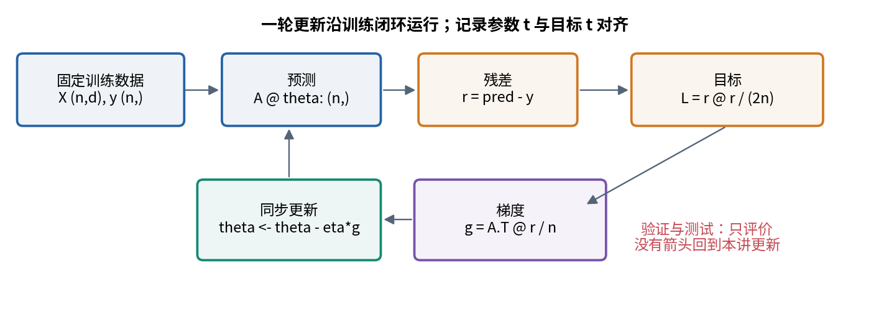
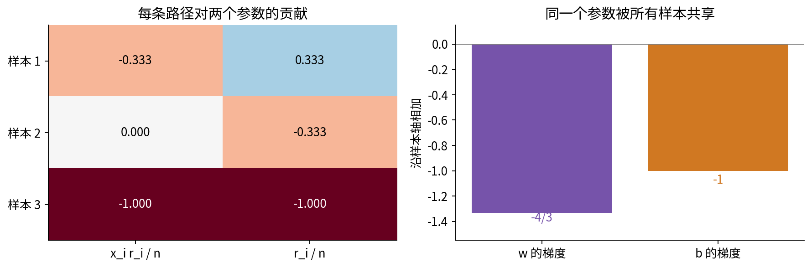
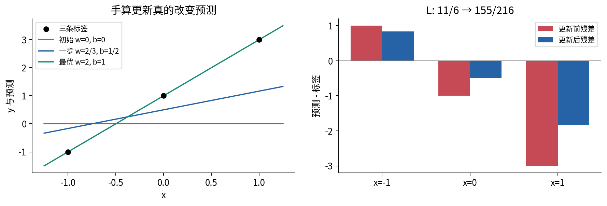
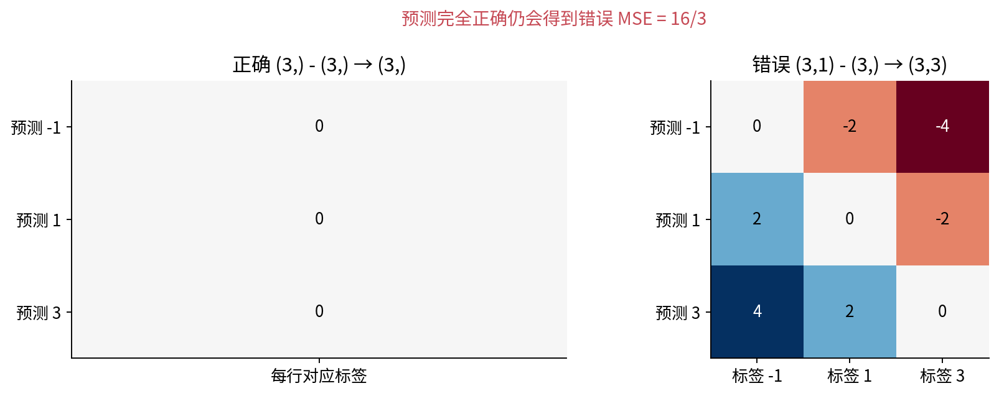
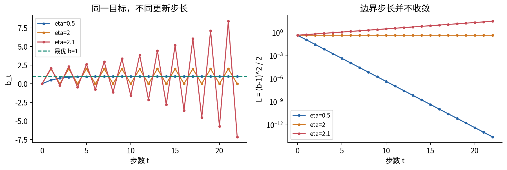
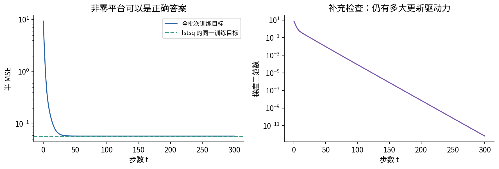
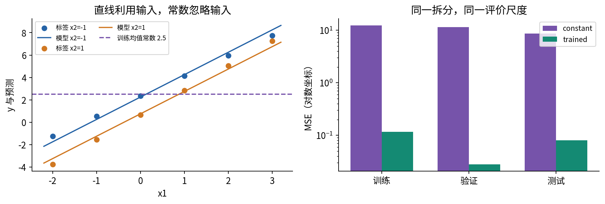
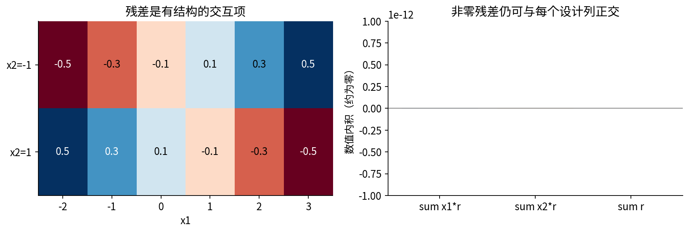
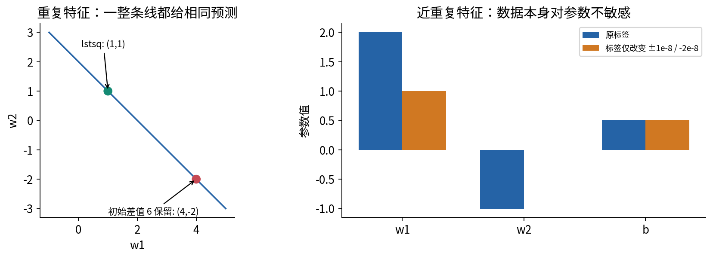

# 线性模型与最小训练闭环

<style>table { break-inside: avoid; }</style>

## 第023单元 神经网络之前先接通一次学习

本讲回答：神经网络之前，怎样把模型、目标、梯度和更新接在一起？我们要做的不是记住一条回归公式，而是建立一条可追查的链：一份固定数据怎样产生预测，预测怎样变成一个标量目标，目标怎样对每个参数提出修改方向，修改后又怎样检查是否真的更好。最后还要回答两个不同的问题：程序是否找到了本模型的训练最优解，以及这个模型在未用于拟合的数据上是否优于一个合理基线。

先修009提供矩阵乘法、转置和偏置；011提供偏导、全微分与链式法则；014提供浮点范围和有限差分的局限；020提供经验风险与泛化的区别。这里逐项把它们接起来，不要求先学特征分解、最优化专门算法、自动微分或深度学习框架。本讲继续使用NumPy，独立实验会复习数组形状与基本操作。

阅读完应能从零写出单输出线性回归的全批次训练，解释每一个数组形状，用手算与独立数值参照检查实现，并定位“损失下降但任务仍没有解决”的原因。全部数据与图均为原创合成教学材料；小型确定性实验不证明真实任务表现。

## 一 模型与训练算法是不同对象

设第$i$条样本有$d$个数值特征，记为列向量$x_i\in\mathbb R^d$；真实目标$y_i\in\mathbb R$。样本下标$i$从1到$n$，特征下标$j$从1到$d$。我们选一个单输出模型：

$$\widehat y_i=f_{w,b}(x_i)=\sum_{j=1}^{d}x_{ij}w_j+b=x_i^\top w+b.$$

$w\in\mathbb R^d$是权重，$w_j$控制第$j$个特征的贡献；$b\in\mathbb R$是偏置或截距。帽子表示预测值。参数由训练决定，输入与标签在一次训练中当作已知常量。截距使输入全为零时预测仍可非零，因此这个映射对$x$严格说是仿射；“线性模型”的名字强调它对待学习参数是线性的。固定加入$x_1^2$作为一个特征，仍能对参数线性，但本讲主例只用两个原始特征。

同一个模型可以由梯度下降、稳定的最小二乘数值求解器，甚至小例子的手算得到参数。模型规定允许怎样预测，目标规定什么算好，算法规定怎样找到参数，三者不能混用。若模型无法表示数据中的交互项，换一个更努力的优化算法不一定降低最佳可达损失。

当目标有单位U、某个特征有单位V时，该权重有U/V的单位，偏置有U的单位。平方误差具有U的平方单位。主例特征都是预先定义的无量纲合成数值，目标也用合成单位；更换特征数值尺度会改变梯度及合适步长，不能把某个学习率当成脱离坐标的常数。



## 二 先写形状再写矩阵公式

把每个$x_i^\top$按行堆叠，得到$X\in\mathbb R^{n\times d}$。第$i$行是一条样本，第$j$列是一个特征。把所有目标堆成$y\in\mathbb R^{n\times1}$，权重写为$w\in\mathbb R^{d\times1}$，全1列记为$\mathbf1_n\in\mathbb R^{n\times1}$，则：

$$\widehat y=Xw+b\mathbf1_n\in\mathbb R^{n\times1}.$$

矩阵乘法内侧$d$消去，留下$n\times1$。偏置不是给每条样本单独学习一个值，而是同一个$b$影响所有$n$条预测。为了用一套公式同时更新权重与偏置，在最后添加一列1：

$$A=[\,X\ \mathbf1_n\,]\in\mathbb R^{n\times p},\qquad
\theta=\begin{bmatrix}w\\ b\end{bmatrix}\in\mathbb R^{p\times1},\qquad p=d+1.$$

$A$叫设计矩阵，$p$是参数总数。现在$\widehat y=A\theta$。本讲始终把偏置放在最后，故两特征时参数顺序是$(w_1,w_2,b)$。其他材料把偏置放在最前也可以，但数据列与参数必须一起改变，不能只改其中一个。

为少一层括号，程序选择一维NumPy数组储存向量。`X.shape == (n,d)`，`A.shape == (n,p)`，`theta.shape == (p,)`，`y.shape == (n,)`。一维数组在NumPy里既不是一行矩阵也不是一列矩阵；`A @ theta`按矩阵乘向量规则返回`(n,)`。数学推导中的列向量与代码的一维向量代表同一组坐标，不能拿一维数组的`.T`去构造列向量。[2]

| 对象 | 数学形状 | 本讲代码形状 | 作用 |
|---|---|---|---|
| $X$ | $n\times d$ | `(n,d)` | 不含偏置列的特征 |
| $A$ | $n\times p$ | `(n,p)` | 附加全1列后的设计矩阵 |
| $\theta$ | $p\times1$ | `(p,)` | 所有待更新参数 |
| $y,\widehat y,r$ | $n\times1$ | `(n,)` | 标签、预测、残差 |
| $g$ | $p\times1$ | `(p,)` | 与参数一一对应的梯度 |

## 三 平方损失为什么有一个平均和一个二分之一

定义残差$r_i=\widehat y_i-y_i$，故预测偏高时$r_i$为正。残差向量$r=A\theta-y$。采用标量训练目标，代码中返回Python `float`：

$$L(\theta)=\frac{1}{2n}\sum_{i=1}^{n}r_i^2=\frac{1}{2n}r^\top r.$$

这里$n$是非零训练样本数。除以$n$使目标成为样本平均；复制同一批数据若干次，平均目标与平均梯度不变。因子$1/2$让平方求导产生的2消掉，便于推导。它不是概率，也没有改变使目标最小的参数。通常报告的均方误差为$\operatorname{MSE}=n^{-1}\sum r_i^2=2L$。输出表报告MSE，训练曲线画半MSE，比较时必须看标签。

平方避免正负残差抵消，并对大偏差施加更大惩罚。例如残差1和−1的平均为0，平方平均仍为1。但平方损失也会对离群目标敏感：残差放大10倍，贡献放大100倍。本讲不需要假定高斯噪声才能定义或优化这个目标；若把它解释成某种统计似然，才需另加概率模型。此处只讨论一个明确的经验目标。[1]

## 四 从一条样本到全部参数的梯度

对某个权重$w_j$，链式法则给出：

$$\frac{\partial L}{\partial w_j}
=\frac1{2n}\sum_i 2r_i\frac{\partial r_i}{\partial w_j}
=\frac1n\sum_i r_i x_{ij},\qquad
\frac{\partial L}{\partial b}=\frac1n\sum_i r_i.$$

原因是$r_i=\sum_kx_{ik}w_k+b-y_i$，其中$X$和$y$固定，所以$\partial r_i/\partial w_j=x_{ij}$，$\partial r_i/\partial b=1$。一个参数同时影响所有样本，每条路径都必须加上；只用“最后一条样本”的贡献，会得到另一个算法。偏置梯度是沿样本轴求和后除以$n$，不是保留$n$个独立偏置。

把各个$j$的结果堆叠：

$$\nabla_w L=\frac1nX^\top r\in\mathbb R^{d\times1},\qquad
\nabla_\theta L=g=\frac1n A^\top r\in\mathbb R^{p\times1}.$$

形状核对：$A^\top$是$p\times n$，$r$是$n\times1$，乘积为$p\times1$。梯度与参数同形。转置出现的理由不是“习惯这样写”，而是它把每个样本的残差按该特征值加权，再沿样本方向汇总。

也可从011的全微分看同一个结果。参数有微小变化$d\theta\in\mathbb R^{p\times1}$，预测与残差的变化为$dr=A\,d\theta$。因为$r^\top dr$与$(dr)^\top r$是同一个标量，

$$dL=\frac1{2n}\big((dr)^\top r+r^\top dr\big)
=\frac1n r^\top A\,d\theta
=\left(\frac1n A^\top r\right)^\top d\theta.$$

与$dL=g^\top d\theta$对照，就读出同一梯度。此推导只用矩阵乘法和标量微分，没有自动微分黑箱。计算时无须显式建立每条预测对所有参数的巨大导数张量；设计矩阵已经携带这些系数。



## 五 完整手算一轮更新

先用只有一个特征的三条样本：$x=(-1,0,1)^\top$，$y=(-1,1,3)^\top$。设计矩阵、初始参数为：

$$A=\begin{bmatrix}-1&1\\0&1\\1&1\end{bmatrix},\qquad
\theta_0=\begin{bmatrix}0\\0\end{bmatrix}.$$

下标$t$表示已完成的更新次数，不是样本编号。初始预测全为0，残差为$(1,-1,-3)^\top$，故$L(\theta_0)=(1+1+9)/6=11/6$。梯度为：

$$g_0=\frac13\begin{bmatrix}-1&0&1\\1&1&1\end{bmatrix}
\begin{bmatrix}1\\-1\\-3\end{bmatrix}
=\begin{bmatrix}-4/3\\-1\end{bmatrix}.$$

选择学习率$\eta=1/2$。学习率是控制这一步沿梯度走多远的正数。全批次梯度下降一次同时改写所有参数：

$$\theta_{t+1}=\theta_t-\eta g_t,\qquad
\theta_1=\begin{bmatrix}2/3\\1/2\end{bmatrix}.$$

新预测依次为$-1/6,1/2,7/6$；新残差为$5/6,-1/2,-11/6$。因此$L(\theta_1)=(25+9+121)/216=155/216$，约0.717593，小于初始约1.833333。此处的最优直线是$\widehat y=2x+1$，损失为零，但一轮更新不必就到最优。

“同时”非常重要：先用同一旧参数算完整梯度，再一起更新。若先更新$w_1$，用新$w_1$重算残差来更新$b$，就变成顺序坐标更新，通常不再是这条公式。更新后的损失应重新计算；不能把旧损失配在新参数行上，让日志错开一拍。



## 六 用 NumPy 接通闭环

下面是教学核心，不含文件读写和防御检查。`@`是矩阵乘法，`*`是逐元素乘法；`.shape[0]`读取行数。`np.ones(n)`生成$n$个1，`column_stack`把它接到特征的右侧。

```python
import numpy as np
X = np.array([[-1.0], [0.0], [1.0]])
y = np.array([-1.0, 1.0, 3.0])
A = np.column_stack((X, np.ones(len(y))))
theta = np.zeros(A.shape[1])
r = A @ theta - y
loss = (r @ r) / (2 * len(y))
gradient = A.T @ r / len(y)
theta = theta - 0.5 * gradient
print(loss, theta)
```

打印的是旧参数的损失与新参数，不是同一状态的配对；这段故意把一轮计算顺序展开。实际脚本每行记录$t,\theta_t,L(\theta_t),\|g_t\|_2$，再更新，所以300次更新保存301行，包含初始行与最后一行。`np.zeros`给出全零初值；在线性平方问题中它是合理起点，本讲不据此推广到所有神经网络。

完整程序先检查`X`二维、`y`与参数一维、长度一致、数值有限；每次计算也检查非有限结果。`float64`并不自动防止上溢、精度丢失或错误广播。数值接口拒绝布尔、复数、对象/字符串数组，浮点值绝对值大于$10^{100}$的输入，以及明确资源上限外的数据。该界限是教学软件契约，不是线性回归的数学定义域。

一个危险错误是把预测变成`(n,1)`，标签仍为`(n,)`。NumPy从末尾维度对齐，会将两者广播成`(n,n)`，每条预测与每条标签都相减。[3] 对恰好正确的预测$(-1,1,3)$，本应MSE为0，错误广播却给$16/3$，而且程序不会自动报错。因而“能运行”和“有下降曲线”都不能替代形状契约。



## 七 负梯度方向不保证任意步长都下降

令$\Delta\in\mathbb R^{p\times1}$表示任意参数变化。因为残差变为$r+A\Delta$，把平方展开可得一个精确等式：

$$L(\theta+\Delta)=L(\theta)+g^\top\Delta+
\frac1{2n}\|A\Delta\|_2^2.$$

$\|v\|_2^2=\sum_jv_j^2$是向量平方长度。第一项变化$g^\top\Delta$是011中的一阶信息，最后一项非负且随步子平方增大。代入$\Delta=-\eta g$：

$$L(\theta-\eta g)-L(\theta)
=-\eta\|g\|_2^2+\frac{\eta^2}{2n}\|Ag\|_2^2.$$

只盯着前面的负号，就漏掉了可能压过它的二次项。为得到不要求特征分解的安全界，把设计矩阵第$i$行记为$a_i^\top$。由Cauchy–Schwarz不等式$(a_i^\top g)^2\leq\|a_i\|_2^2\|g\|_2^2$，逐行相加：

$$\frac1n\|Ag\|_2^2\leq B\|g\|_2^2,\qquad
B=\frac1n\sum_{i=1}^n\sum_{j=1}^{p}a_{ij}^2.$$

若不熟悉该不等式，可把$\|a-tg\|_2^2\geq0$视为关于实数$t$的二次式；取$t=(a^\top g)/\|g\|_2^2$，整理即得，$g=0$时结论显然成立。于是当$0<\eta<2/B$且$g\ne0$时，精确算术下目标严格下降。偏置列包含1，故这里$B\geq1$，不会除以零。这个界是充分条件，通常保守；超过它不等于一定发散。浮点末期微小波动也不应被解释成理论推翻。

用最简单的$L(b)=(b-1)^2/2$可看清边界。梯度为$b-1$，误差$e_t=b_t-1$满足$e_{t+1}=(1-\eta)e_t$。对任意非零初误差，要趋于零就要求$|1-\eta|<1$，即$0<\eta<2$。取$\eta=2$，误差正负翻转、损失不降；取2.1，误差绝对值每步乘1.1。初始已在最优时当然保持不动，这不是大步长稳定性的证明。



## 八 最小二乘参照能回答什么

梯度为零意味着$A^\top(A\theta-y)=0$，也就是正规方程：

$$A^\top A\theta=A^\top y.$$

它说明最优残差与每一个设计矩阵列的内积为零。用前节展开式，若$g=0$，任何$\Delta$都只增加$\|A\Delta\|_2^2/(2n)\geq0$，所以该驻点一定是全局最小值。这里不需要“看起来像碗”的直觉代替证明。

何时参数唯一？若只有$\Delta=0$能满足$A\Delta=0$，则每个非零变化都严格增加目标，这等价于$A$的列线性独立，又叫列满秩。若存在非零$\Delta$使$A\Delta=0$，则$\theta$与$\theta+\Delta$对训练行产生完全相同的预测，参数不唯一。只检查样本数不少于参数数还不够：复制两列就能让它们相关。

正规方程用于推理，不应当作“显式求逆就是稳定实现”的建议。即使形式上可逆，先计算$A^\top A$也会让某些数值困难加重。最清楚的例子是$A=\operatorname{diag}(1,\varepsilon)$：两个坐标的缩放比为$1/\varepsilon$，而$A^\top A=\operatorname{diag}(1,\varepsilon^2)$把这个比变成$1/\varepsilon^2$。当$\varepsilon$很小时，舍入影响更容易被放大；列相关时还根本不可逆。

本讲直接调用`np.linalg.lstsq(A, y, rcond=None)`，不构造逆矩阵。官方接口允许超定、欠定及秩不足问题；多个最优解时返回参数二范数最小的一组。[4] 稳定求解器使用正交分解等方法处理最小二乘，LAPACK说明分别提供QR/LQ与基于奇异值分解的驱动。[5] 理解这些分解的全部细节不是本讲门槛，也不把数值库当作每一种病态输入都可靠的魔法。

返回的`rank`是按浮点阈值判断的数值秩；`rcond=None`采用与机器精度和矩阵尺寸相关的默认阈值。返回的`singular_values`记录矩阵沿特殊方向的缩放大小，本讲只保存它们，不要求用它们选学习率。官方的`residuals`数组在秩不足或行数不多于列数时可能为空；空数组不代表拟合误差为零。因此脚本总是重新计算`A @ theta - y`及目标。

对列满秩且尺度适中的主例，可比较参数、训练预测、目标与梯度。对秩不足例，应优先比较预测与目标，不要求两个算法选相同参数。零初值梯度下降会有自己的解选择性质；非零初值中不改变训练预测的分量可能一直保留。

## 九 固定拆分与合理常数基线

主实验使用两个数值输入$x_1,x_2$，标签由事先规定的机制生成：

$$y=1.5+2x_1-0.75x_2+0.2x_2(x_1-0.5).$$

最后一项是两个输入相乘的交互效应；我们故意只拟合$w_1x_1+w_2x_2+b$。没有随机噪声，也没有“发现未知真实系数”的实际业务任务。固定训练网格为$x_1\in\{-2,-1,0,1,2,3\}$与$x_2\in\{-1,1\}$的12种组合。验证集是4个不同$x_1$与$\pm0.5$的8种组合；测试集是5个半整数$x_1$与$\pm1$的10种组合。完整数值、样本ID与拆分保存在`data/samples.csv`，不靠每次重新随机划分。[数据为本讲原创]

为什么保留验证集却不按它挑步数？这是最小闭环：模型、0.1学习率、300次更新、零初值都已在配置中固定，验证与测试仅作结束后的检查；没有早停、网格搜索或据测试调参。如果后来用验证结果选超参数，应先规定流程，重新冻结后再用未参与选择的测试评价。当前确定性网格不是从未知总体独立随机抽样，不能由10个测试数值构造未经论证的总体保证。

常数基线不应随手取0。限制预测为常数$c$时：

$$L_{\rm const}(c)=\frac1{2n}\sum_i(c-y_i)^2,\qquad
\frac{dL_{\rm const}}{dc}=c-\overline y_{\rm train}.$$

故训练集上的最佳常数为$c=\overline y_{\rm train}$。它只读取训练标签，再把同一个数用于验证与测试。若各拆分分别重新求均值，就在评价数据上拟合了新的基线，比较不公平。主例的训练均值为2.5；简单的零预测会故意弱化对手，使提升显得更大。

主例用训练数据计算$B=31/6$，所以充分下降条件为$0<\eta<12/31$，0.1在范围内。300轮后参数约为$(2,-0.75,1.5)$，与最小二乘参照的训练预测最大差小于$2\times10^{-12}$，梯度范数小于$10^{-10}$。数值误差应结合数据尺度理解，这些阈值不应直接搬到所有任务。



| 固定拆分 | 行数 | 最佳训练常数的MSE | 训练线性模型的MSE |
|---|---|---|---|
| 训练 | 12 | 12.3458333333 | $7/60\approx0.1166666667$ |
| 验证 | 8 | 11.41875 | $9/320=0.028125$ |
| 测试 | 10 | 8.6425 | $2/25=0.08$ |

这些值可以说明该模型在这些已规定网格上有效利用了输入；不能说明对任意未来分布可靠。验证误差比训练误差低也不矛盾：两者的输入位置和$x_2$幅度不同，未建模交互项的大小因此不同。这个结果不是关于“验证通常更容易”的普遍规律。



## 十 收敛与梯度检查如何互相补充

梯度检查在预先规定的非最优参数$(0.4,-0.2,0.7)$进行。对第$j$个参数，单位坐标向量$e_j$只有第$j$个位置为1，其余为0；用中心差分：

$$g_j^{\rm FD}=\frac{L(\theta+h e_j)-L(\theta-h e_j)}{2h},\qquad h=10^{-5}.$$

对精确二次函数，关于$h$的对称三次及更高项根本不存在，因此精确算术下该中心差分就是导数；浮点减法、参数扰动和除法仍会带来误差。步长过小会被舍入吞掉，本程序检测扰动前后参数不变并拒绝继续。一般非二次函数还会有截断误差，不能把这里的特殊性质推广过去。

脚本保存每个坐标的解析值、差分值、绝对误差，以及$|g_j-g_j^{\rm FD}|/\max(1,|g_j|,|g_j^{\rm FD}|)$。分母包含1避免接近零时相对误差失控，但也意味着这是带绝对尺度底限的误差度量，不能掩盖小量问题。默认最大缩放误差约$3.25\times10^{-11}$。仅在最优点检查容易让错误梯度也恰好接近零，故另用多组独立小整数数据核验。

梯度通过差分，只说明实现与这个损失局部一致；损失本身可能写错，例如广播错误。收敛到数值最小二乘参照，进一步检查了目标和更新。常数基线检验输入是否带来提升。固定拆分评价则检验这个训练结果在另一组输入上的行为。四者各查不同问题，不能互相替代。

## 十一 非零残差与不唯一参数的两个反例

### 交互残差不是少训练了几轮

在训练网格上，记$q=0.2x_2(x_1-0.5)$。对两个$x_2$求和使$\sum q=0$与$\sum x_1q=0$；又因为$\sum_{x_1}(x_1-0.5)=0$，所以$\sum x_2q=0$。于是参数$(2,-0.75,1.5)$的残差$r=-q$与$A$的全部三列正交，确实满足梯度为零。

每个$x_1$对应两个相同的$q^2$，而$\sum_{x_1}(x_1-0.5)^2=35/2$，所以$\sum q^2=2\times(1/25)\times(35/2)=7/5$。训练MSE等于$(7/5)/12=7/60$。再多更新不能消除当前模型没有表示的交互项。残差正负平衡不等于残差不存在，也不自动意味着它是独立噪声。



### 稳定算法不能替数据创造可辨识性

令两个特征完全相同，$x_1=x_2=x$，样本仍为$x=-1,0,1$、$y=-1,1,3$。预测只依赖$w_1+w_2$和$b$；全部$(w_1,w_2,b)=(1+c,1-c,1)$都有零误差。`lstsq`取$(1,1,1)$，其参数平方长度最小；从$(4,-2,0)$开始梯度下降，每次两个权重收到相同梯度，差值6不会改变，最终到$(4,-2,1)$。参数不同而训练预测相同，并非其中一个算法出错。

再把第二列改成$x+10^{-8}q$，其中$q=(1,-2,1)^\top$。用参数$(2,-1,0.5)$生成标签。如果标签只增加$10^{-8}q$，新标签恰好可用$(1,0,0.5)$表示。标签变化很小，两个权重却各改变1。这是近重复输入提供的区分信息极弱；稳定求解只能避免无谓的额外数值损害，无法消除问题自身的敏感性。真实数据还需重新考虑特征设计、数据精度与适当约束，后续单元再展开。



## 十二 保存什么才能称为可重现

一份模型权重不足以复现训练。至少还需要固定数据及拆分、列顺序、目标归一化、初值、学习率、更新次数、计算精度、代码与依赖版本。本讲结果包括参数及环境摘要、301行轨迹、逐样本预测和三坐标梯度检查；原始CSV同时保存拆分与唯一ID。各输出都可从脚本重建，无网络或付费API。

训练函数不读取验证或测试；流程测试会替换这两部分的标签和输入，确认参数、基线及训练轨迹完全不变。这个检查证明本程序的有限执行路径，不是通用防泄漏证明。用户若在看到测试分数后手动挑学习率，仍会改变统计评价的含义。

坏输入不应把一套旧结果写到一半。本程序先检查全部CSV与配置，再完成训练、参照、梯度检查、评价与全部JSON/CSV序列化，最后才检查目标路径并写文件。拒绝缺列、重复列、额外列、重复ID、非有限数字、计算溢出，以及输出符号链接或与输入文件冲突的目标。每个文件通过临时文件替换；这保护输入、计算或序列化失败之前的旧结果，但不声称多个文件跨崩溃是一个完整事务，磁盘或并发故障仍需额外工程设计。

固定图和Notebook有更严格边界：先核对原始配置、数据摘要与重算结果，任何不匹配都在输出前拒绝，避免把默认图题贴到另一次实验上。自定义实验可用脚本另存，不能沿用这套图文结论。

## 十三 自检与练习

先写推理，再运行实验。完整解答在独立详解中。

1. 有7条样本、3个特征时，写出$X,A,\theta,y,r,g$的数学与NumPy形状。为什么$p$不是3？
2. 不引用矩阵求导口诀，从单个$r_i^2$逐项推出$\partial L/\partial w_j$和$\partial L/\partial b$，解释转置与平均来自哪里。
3. 复现三条手算样本的初始损失、梯度、步长1/2后参数、预测、残差和新损失。
4. 把同一训练集完整复制5次，正确平均目标与梯度如何变化？漏掉除以$n$时呢？
5. 证明训练均值是平方损失下最佳常数。主例若用0当基线，训练MSE是多少？为什么更弱？
6. 若目标由半MSE改成MSE而希望每次参数更新相同，学习率怎样改？
7. 为什么在一个非最优点做梯度检查？对二次目标，中心差分的截断误差与浮点误差分别怎样？
8. 仅一条样本$x=1,y=1$，初始$(w,b)=(0,0)$，步长0.1。比较同时更新与先更新$w$再重算$b$的结果。
9. 对$L(b)=(b-1)^2/2$、$b_0=0$，分别分析步长0.5、2、2.1。说明“负梯度必下降”缺少什么条件。
10. 证明$A^\top r=0$是最小二乘的全局最优条件。为何不意味着$r=0$？何时参数唯一？
11. 用训练网格对称性证明主例最优参数与训练MSE为$7/60$，解释其残差结构。
12. 重复特征例中，从$(4,-2,0)$出发为何不去$(1,1,1)$？应比较参数还是预测？
13. 假设验证集MSE低于训练集，列出本实验的具体解释；能否据此认定没有过拟合或没有泄漏？
14. 写一个检查清单：训练目标不降、损失为非数、参数不同但预测相同、程序运行却MSE离奇，分别先查什么证据？

## 来源与继续学习

[1] Andrew Ng、Tengyu Ma，Stanford CS229官方讲义，Chapter 1、1.1节，PDF印刷页8至11。用于核对线性回归目标与批量同步更新；本讲自定义数据、平均归一化与推导。https://cs229.stanford.edu/notes2022fall/main_notes.pdf

[2] NumPy官方文档，matmul，二维矩阵与一维向量的乘法规则。https://numpy.org/doc/stable/reference/generated/numpy.matmul.html

[3] NumPy 2.3官方文档，Broadcasting，尾部维度匹配规则。https://numpy.org/doc/2.3/user/basics.broadcasting.html

[4] NumPy 2.3官方文档，numpy.linalg.lstsq，最小范数、数值秩、rcond与空residuals语义。https://numpy.org/doc/2.3/reference/generated/numpy.linalg.lstsq.html

[5] LAPACK Users' Guide，Linear Least Squares Problems，列满秩、秩不足与QR/LQ/SVD求解器分类。https://netlib.org/lapack/lug/node27.html

来源核查日期为2026-10-04。它们用于核对公式与接口，不提供本讲数据或图。后续将逐渐改变模型、损失、批次和更新器；先保留本讲这套形状契约、基线与独立核验习惯。安装与真实执行边界见实验指南和verification.json。
