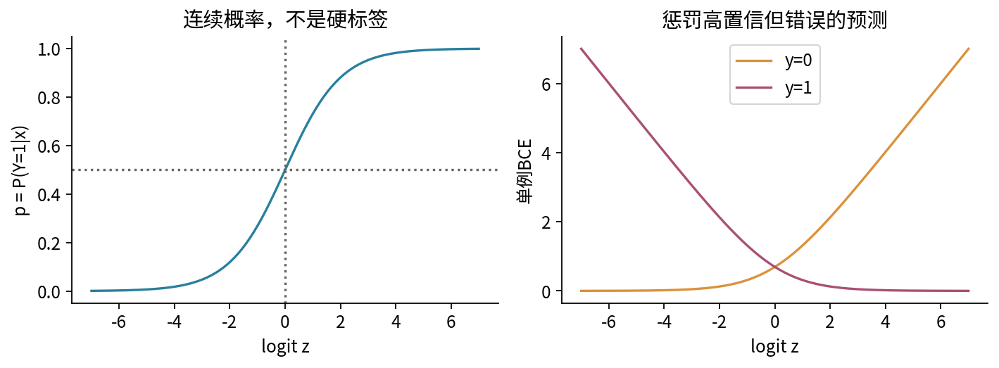
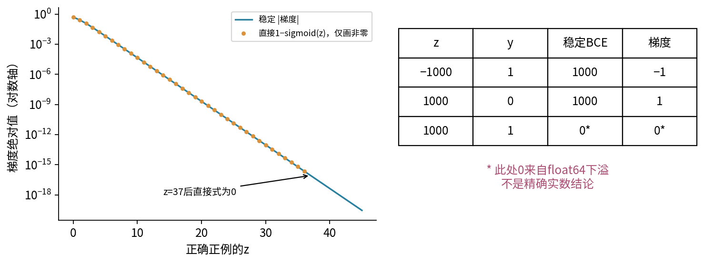
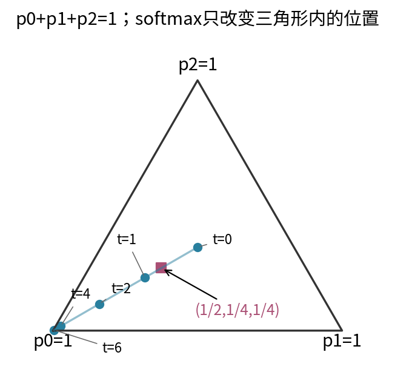
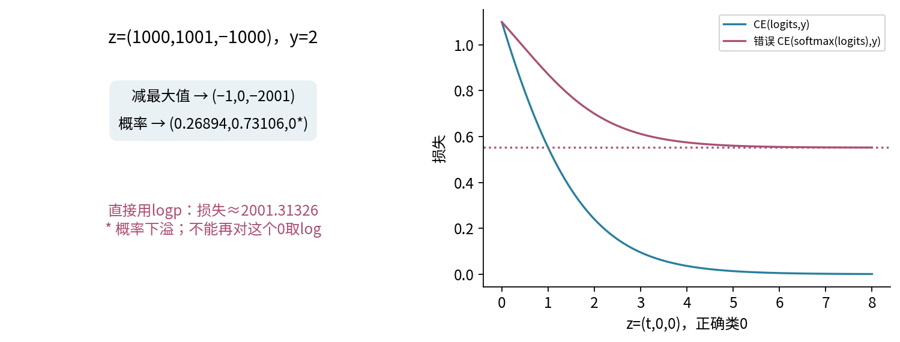
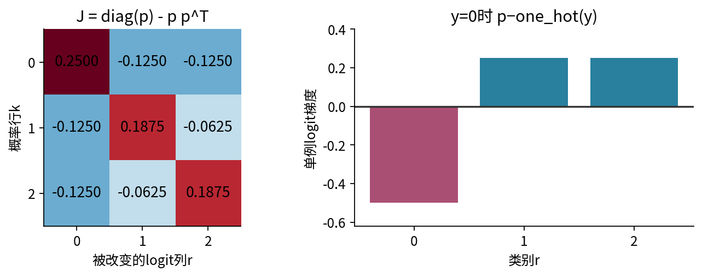
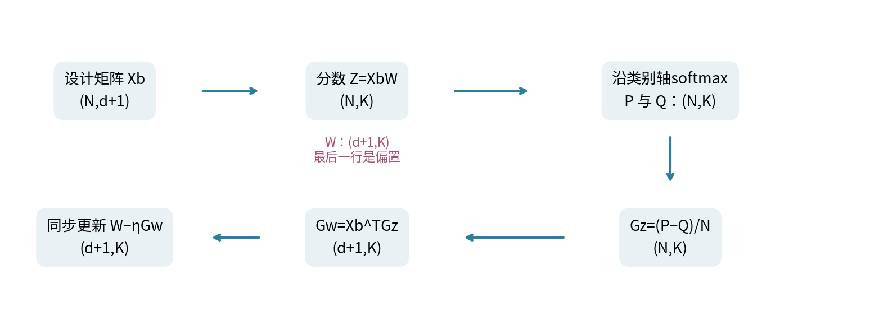
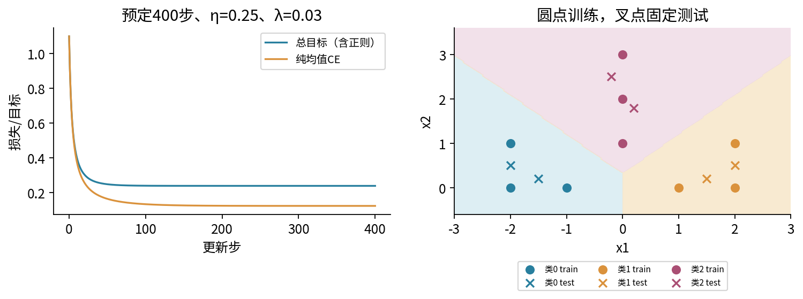
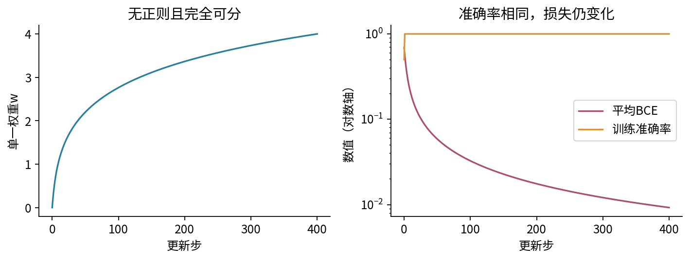
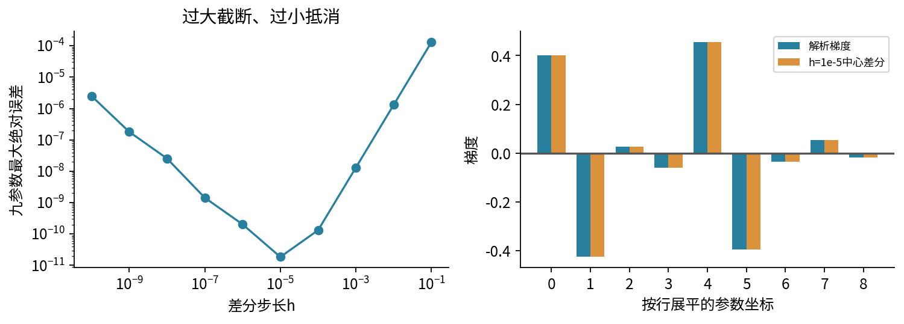

# 024 逻辑回归与softmax分类

从分数到概率再到损失的每一步是怎样来的？

023已把线性预测、平方损失、梯度和更新接起来。但分类标签0、1、2不是三个有等距关系的测量值：把“类别2”预测成1，不能仅凭编号差1就说比预测成0更合理。本讲保留线性分数，重新建立分类的概率模型与训练目标，再用可核对的梯度连接程序。

先修023的矩阵训练闭环、017的似然、019的交叉熵和021的指标解释。通过023已用到稳定数值计算与向量链式法则。我们从二分类开始，再推广为互斥的K类。实验是原创、固定小型合成数据，不把训练准确率或六个测试点的全对当成真实泛化证据。

## 1 分数不是概率

一条输入 $x\in\mathbb R^d$ 经线性分数得到 $z=w^Tx+b$，其中 $w\in\mathbb R^d$、$b\in\mathbb R$、$z\in\mathbb R$。z可以是−100或100，不满足概率的范围。二分类令 $p=P_\theta(Y=1\mid x)$，其中$\theta$统称参数$(w,b)$，并定义概率优势 odds 为 $p/(1-p)$。若希望对数优势等于线性分数：

$$\log\frac p{1-p}=z,$$

先指数化为 $p/(1-p)=e^z$，再解方程，得到

$$p=\sigma(z)=\frac{e^z}{1+e^z}=\frac1{1+e^{-z}}.$$

这个函数叫sigmoid或logistic函数。它把有限实数映到(0,1)，且单调递增；$z=0$时p=1/2，$z=\log3$时p=3/4。logit也可指概率的对数优势变换；神经网络里通常把尚未归一化的分类分数统称logits，阅读接口时必须分清输入对象。[1]

概率形式是模型假设，不等于概率已经校准。默认以p≥1/2判正，相当于z≥0；若漏报和误报成本不同，评价协议可以使用其他阈值，不能把0.5说成普遍最优。

## 2 由Bernoulli似然推导二分类损失

标签 $y\in\{0,1\}$。条件概率可统一写为 $P(y\mid x)=p^y(1-p)^{1-y}$：y=1时只取p，y=0时只取1−p。单例负对数似然为

$$\ell(z,y)=-y\log p-(1-y)\log(1-p).$$

这是二分类交叉熵，记作BCE。$\log p=z-\log(1+e^z)$，$\log(1-p)=-\log(1+e^z)$，代回后两个对数系数相加为1：

$$\ell(z,y)=\log(1+e^z)-yz.$$

这是数学等价式，不能直接据它写出对任何z都稳定的程序。若样本在给定参数与输入后条件独立，联合似然是各项乘积，联合负对数似然就是各项之和。N表示本批样本数，训练常取平均 $L=\frac1N\sum_i\ell_i$，它和求和有相同的无正则最优解，但梯度尺度相差N。

### 梯度为什么简化成p−y

对sigmoid使用商法则：$\sigma'(z)=e^z/(1+e^z)^2=p(1-p)$。再从BCE对p求导：

$$\frac{\partial\ell}{\partial p}=-\frac yp+\frac{1-y}{1-p}.$$

乘上 $dp/dz=p(1-p)$，分母消去，得到 $-y(1-p)+(1-y)p=p-y$。也可直接对 $\log(1+e^z)-yz$ 求导核对。于是

$$\nabla_w L=\frac1N\sum_i x_i(p_i-y_i),\qquad \frac{\partial L}{\partial b}=\frac1N\sum_i(p_i-y_i).$$

当模型给正例的p偏低，p−y为负；沿负梯度更新会提高该样本分数。这里没有再额外乘一次sigmoid导数，它已经在链式推导中相消。若改用平方损失拟合概率，导数则是另一个表达式，不能把两个目标的梯度混用。

手算 $x=(2,-1)$、$w=(0,0)$、$b=0$、y=1：z=0，p=1/2，损失log2；权重梯度(−1,1/2)，偏置梯度−1/2。学习率0.2更新后 $w=(0.2,-0.1),b=0.1$，同一点的新z=0.6、p≈0.645656、损失≈0.437488，低于原log2。每个符号都对应一次具体计算，而不是只记“p减y”。

## 3 二分类也需要稳定实现

直接exp(1000)会溢出；直接log(sigmoid(−1000))可能取到log0。对 $a=(1-2y)z$，单例损失可改写为

$$\ell=\max(a,0)+\log(1+e^{-|a|}).$$

计算时用log1p，即专门计算小u下的log(1+u)，避免先把1+u舍入成1。这个式子也避免先算巨大softplus再减巨大yz。sigmoid本身按z正负分支：z非负时算 $1/(1+e^{-z})$，负时算 $e^z/(1+e^z)$，所有指数自变量均不为正。

二分类梯度也要注意舍入：当y=1时，使用 $-\sigma(-z)$ 与数学上的 $\sigma(z)-1$ 相同，却避免“接近1再减1”的抵消。例如z=37，float64的sigmoid可能已舍入为1，直接减1变成0；本实现保留约 $-8.5330\times10^{-17}$。当z=1000时，这个真实极小量仍可能下溢为0；稳定不意味着无限精度。[2]

实现只接受有限且绝对值不超过一百万的logit，拒绝NaN、无穷、bool和错误shape。它是一套有边界的教学接口，不声称支持任意dtype、无限大的浮点输入或所有硬件行为。

## 4 多分类：一行K个分数

互斥K类中，$y\in\{0,\ldots,K-1\}$，每例分数 $z\in\mathbb R^K$。softmax定义为

$$p_k=\frac{e^{z_k}}{\sum_{j=0}^{K-1}e^{z_j}}.$$

每个p非负，和为1；在精确实数算术、有限分数下严格为正。softmax给出的是一个概率向量，不是“只保留最大类别”的硬分类。argmax才返回一个类别编号。

K=3时，概率向量位于 $p_0+p_1+p_2=1$ 的二维三角面，称为概率单纯形。图用三角形的重心坐标展示这三个权重，不是把类别当成三个连续数值目标。

所有分数同时加常数c，分子分母都乘 $e^c$，概率不变。故softmax只关心分数差，没有唯一的绝对分数原点。K=2时

$$p_1=\frac1{1+e^{-(z_1-z_0)}}=\sigma(z_1-z_0).$$

所以单logit二分类等价于两个logit的差。不能把K个互斥类别各自sigmoid后当成自动和为1的概率；多标签任务允许多个标签同时成立，常用多个独立Bernoulli输出，是另一种任务模型。

## 5 稳定log-softmax与交叉熵

令 $m=\max_jz_j$，$s_j=z_j-m\le0$。从分数差计算

$$\log p_k=s_k-\log\sum_j e^{s_j},\qquad \ell(z,y)=-\log p_y.$$

每个指数不大于1，且至少一个为1，避免指数上溢以及分母全零。[3] 若希望保留正确类特别小的损失，可把一个最大分数位置a的指数1单独拿出：

$$\log\sum_j e^{s_j}=\log\left(1+\sum_{j\ne a}e^{s_j}\right).$$

程序用log1p计算右侧；最大值有并列时只移除其中一个1，其他1仍在求和中。不能把所有最大位置都删去。随后直接从logp取损失，不先把logp指数化再取log。

手算 $z=(\log2,0,0)$，指数比为2∶1∶1，因此p=(1/2,1/4,1/4)。若标签0，损失log2；标签1则损失log4。相同分数产生同一概率，标签决定哪一个概率进入损失。

极端例 $z=(1000,1001,-1000)$、y=2。减最大值得(−1,0,−2001)，稳定损失为 $2001+\log(1+e^{-1}+e^{-2001})\approx2001.31326169$。float64的第三类概率下溢为0，但这个对数损失仍可计算。这正是“先softmax再log”会丢掉的信息。

## 6 softmax梯度的逐项推导

令分母 $S=\sum_je^{z_j}$。对第r个分数求导，商法则给出

$$\frac{\partial p_k}{\partial z_r}=p_k(\delta_{kr}-p_r),$$

其中 $\delta_{kr}$ 在k=r时为1，否则为0。于是雅可比矩阵为 $J=\operatorname{diag}(p)-pp^T$，shape是K×K。对角项 $p_k(1-p_k)$ 为正，非对角项 $-p_kp_r$ 为负：提高一个分数会增加该类概率、减少其他类概率。

对硬标签损失 $-\log p_y$，只要代入k=y：

$$\frac{\partial\ell}{\partial z_r}=-\frac1{p_y}p_y(\delta_{yr}-p_r)=p_r-\mathbf1\{r=y\}.$$

令one-hot向量 $q\in\mathbb R^K$ 在标签位置为1、其他为0，则梯度是p−q。每行梯度之和为0，与“所有分数共同平移不改变损失”一致。

在手算p=(1/2,1/4,1/4)、y=0时，梯度为(−1/2,1/4,1/4)。一步负梯度更新提高正确分数，降低两个错误分数；不是只改一个类别。$J$ 本例为

$$J=\begin{pmatrix}1/4&-1/8&-1/8\\-1/8&3/16&-1/16\\-1/8&-1/16&3/16\end{pmatrix}.$$

若q是事先给定、非负且和为1的软目标，同样推导得到p−q。若目标总质量为c而不是1，则梯度是cp−q，不能忽略归一化条件。本实验只接受硬标签整数向量，软目标推导用于理解公式边界。

数值实现中，标签位置的 $p_y-1$ 可等价写为 $-\sum_{j\ne y}p_j$，保留p接近1时的小梯度。本代码使用这个补和形式，不改变数学目标。其他类梯度保持p；极小概率仍受浮点范围限制。

## 7 批次形状与参数梯度

将偏置并入最后一列全1的设计矩阵 $\widetilde X\in\mathbb R^{N\times(d+1)}$，参数 $W\in\mathbb R^{(d+1)\times K}$。每行样本，每列类别：

$$Z=\widetilde XW\in\mathbb R^{N\times K},\quad P=\operatorname{softmax}(Z,\text{类别轴}),\quad G_Z=\frac{P-Q}{N}.$$

Q为N×K的one-hot矩阵；公开接口接收的是长度N的类别编号y，程序内部等效构造相应项。不能让(N,1)标签依赖广播悄悄变成N×N比较。

每个参数 $W_{jk}$ 通过 $z_{ik}=\sum_j\widetilde X_{ij}W_{jk}$ 影响该类分数，故

$$\frac{\partial L}{\partial W_{jk}}=\sum_i\widetilde X_{ij}(G_Z)_{ik},\qquad G_W=\widetilde X^TG_Z.$$

矩阵shape为 $(d+1,N)(N,K)=(d+1,K)$，恰与W相同。softmax沿每行的类别轴归一化，即axis=1；沿批次axis=0归一化会把不同样本放进同一分母。[3]

没有类别权重、忽略标签等额外规则时，sum损失与mean损失的梯度相差N；在无正则情形，用sum梯度并将学习率除以N，可得到相同一步更新。如果额外正则项没有同时按N缩放，这个等价不再直接成立。真实库对权重和忽略标签的mean分母有具体规定，必须看接口，不能只猜一个batch size。[4]

## 8 完整的三类手算第一步

训练集九点，每类三点：类别0为(−2,0)、(−1,0)、(−2,1)；类别1为(2,0)、(1,0)、(2,1)；类别2为(0,2)、(0,1)、(0,3)。最后再补常数1。六个测试点另列于CSV，不参与参数更新、学习率或迭代数选择。

W从3×3零矩阵开始，因此每行p=(1/3,1/3,1/3)，均值交叉熵log3。x1总和0，各类x1和分别−5、5、0；x2总和8，各类和为1、1、6。按上一节公式得到

$$G_W=\begin{pmatrix}5/9&-5/9&0\\5/27&5/27&-10/27\\0&0&0\end{pmatrix}.$$

取示范学习率0.3且暂不加正则，第一步 $W_1=-0.3G_W$：

$$W_1=\begin{pmatrix}-1/6&1/6&0\\-1/18&-1/18&1/9\\0&0&0\end{pmatrix}.$$

对输入(−2,0)，分数为(1/3,−1/3,0)。无须等完整训练后才能核对：第一步的方向已经让它更偏向正确类别0。主实验使用预定学习率0.25，这个0.3手算仅是可单独验证的一步演示，不能混写成主运行配置。

## 9 训练、决策边界与实际结果

主实验优化平均交叉熵加上 $\lambda\|W_{\mathrm{feature}}\|_F^2/2$，其中 $\lambda=0.03$，只惩罚前两行特征权重，不惩罚最后一行偏置。Frobenius范数平方就是这些元素的平方和；它的梯度是在特征行加λW、偏置行加0。该项抑制分数差无限增长，改变了训练目标，不是数值上“没有影响的修补”。

预定400步、学习率0.25，得到约

$$W=\begin{pmatrix}-1.641729&1.641729&0\\-0.617695&-0.617695&1.235390\\0.198420&0.198420&-0.396841\end{pmatrix}.$$

训练均值CE约0.123658，测试均值CE约0.068982；九个训练点、六个测试点都分类正确。总目标约0.238855，含正则，所以不等于纯交叉熵。最终梯度范数约0.000309，只是本次停止点的数值，不是已证明到达精确最优或任何真实任务性能保证。

类别a与b的分数相等时，$(w_a-w_b)^Tx+(b_a-b_b)=0$，因此线性softmax的两类边界仍是直线（高维为超平面）。softmax非线性归一化不等于输入空间有了任意弯曲的分类边界；它保持分数排序。将同一向量加到全部权重列、同一常数加到全部偏置，概率不变；未正则化的softmax参数表示因而有冗余。当前不惩罚偏置，仍有共同偏置平移冗余，不能宣称参数唯一。

### 为什么这个步长有可核对的依据

沿任一参数方向V走标量t，一条样本的分数方向记 $v_k=\widetilde x^TV_{:k}$。交叉熵二阶方向导数为 $\sum_kp_kv_k^2-(\sum_kp_kv_k)^2$，是以p为权重的方差，非负且不超过 $\sum_kv_k^2$。由Cauchy不等式，又不超过 $\|\widetilde x\|^2\|V\|_F^2$。

全批平均再加正则，曲率上界可取 $L=\|\widetilde X\|_F^2/N+\lambda=43/9+0.03\approx4.80778$。沿更新方向对一元函数积分二阶导数界，可得 $J(W-\eta G)\le J(W)-\eta(1-L\eta/2)\|G\|_F^2$；所以 $0<\eta<2/L\approx0.4160$ 是一个充分下降范围。0.25在其中。这是偏松的全批界，不等于精确最大安全步长，也不是任意数据、任意优化器的通用规则。原始CE在带正则优化后期不必每步下降，真正被优化的是总目标。

## 10 两个容易误判的现象

### 先softmax再送给接收logits的损失

如果接口内部已经执行log-softmax，输入应是原始Z。将P当成Z送入后，优化的是 $-\log(\operatorname{softmax}(P)_y)$，不是 $-\log P_y$。[4] 对z=(8,0,0)、y=0，正确损失约0.000670700，错误流程却约0.551871。即使p趋近(1,0,0)，错误损失仍趋近 $\log(e+2)-1\approx0.551445$。

反向时还多出softmax雅可比：错误目标对z的梯度为 $J(p)^T(\operatorname{softmax}(p)-q)$。它不是原本的p−q。计算能运行、数值有限并不代表接口语义正确。

### 可分数据上，准确率稳定但权重还在增长

二分类另取x=(−2,−1,1,2)、y=(0,0,1,1)，无偏置，只训练一个权重w且不正则。任意w>0已把四个点全部分类正确，但损失为

$$L(w)=\frac12\log(1+e^{-w})+\frac12\log(1+e^{-2w}).$$

每一项对有限w都为正，且随w增加而严格减少；当w趋向正无穷才趋近0，没有实现零损失的有限最优w。400步后w≈4.00124、BCE≈0.0092311，仍不是“数学问题已找到有限零梯度解”。

正则、早停和不可分噪声会改变这个故事。此处只用可证明的一维反例解释机制，不把它推广为所有分类训练都必须发散。概率过于自信、校准、数据偏移仍应按021的评价原则检查。

## 11 核验梯度与接口

对一个logit或参数元素加减h，使用中心差分 $[L(\theta+he_j)-L(\theta-he_j)]/(2h)$ 对照解析梯度。保持同一输入、标签、归约和正则，只改变一个坐标。h太大带来截断误差，太小带来抵消；不要仅试一个极端h就判断对错。极端饱和区域的微小导数可能低于差分可分辨范围，因此本讲在中等尺度做差分，在极端尺度改用高精度十进制或稳定库参照。

运行测试会核对：多类概率和/共同平移不变性、每行梯度和、二类/多类手算、mean与sum尺度、Decimal与SciPy稳定结果、参数差分、错误双softmax的链式导数、训练/测试隔离和失败时旧输出保护。SciPy是数值参照，主脚本训练只依赖NumPy；没有运行PyTorch训练或自动微分框架。

## 12 来源与边界

[1] [SciPy官方expit文档](https://docs.scipy.org/doc/scipy/reference/generated/scipy.special.expit.html)：sigmoid对象与接口。

[2] [PyTorch官方BCEWithLogitsLoss](https://docs.pytorch.org/docs/2.14/generated/torch.nn.BCEWithLogitsLoss.html)：合并logits损失的稳定性语义。本文自行推导并以NumPy实现，不声称测试过PyTorch执行。

[3] [SciPy官方softmax](https://docs.scipy.org/doc/scipy/reference/generated/scipy.special.softmax.html)、[logsumexp](https://docs.scipy.org/doc/scipy/reference/generated/scipy.special.logsumexp.html)：轴、平移与log域计算。

[4] [PyTorch官方CrossEntropyLoss](https://docs.pytorch.org/docs/2.14/generated/torch.nn.CrossEntropyLoss.html)：输入是logits、目标类型及归约规则。本文只实现无类别权重、无ignore标签的硬分类子集。

所有正文、合成数据、计算图与例子独立制作。网页对应版本可能高于本地数值参照；本地实际NumPy2.3.5、SciPy1.17.0，以验证记录为准。未测试全新Anaconda、浏览器Jupyter、socket内核、跨平台或GPU表现。

## 13 练习

1. 从对数优势解出sigmoid，并算z=log3时的概率与默认类别。
2. 从Bernoulli概率推到BCE，再用链式法则推p−y；为什么不用再乘一次sigmoid导数？
3. 完成x=(2,−1)、零参数、y=1、步长0.2的整步手算，包括新损失。
4. 说明稳定BCE与分支sigmoid如何避免上溢；z=37,y=1时为何直接p−1可能为0？
5. 证明共同平移不改变softmax，推导二类softmax等于一个sigmoid。
6. 算z=(log2,0,0)两种标签的概率、损失与梯度；写出完整雅可比。
7. 推导软目标和为1时p−q；总质量c≠1时为什么变为cp−q？
8. 逐项推导批次参数梯度并核对全部shape；axis=0与axis=1有何不同？
9. 用训练点各类坐标和重建零参数梯度矩阵与0.3示范一步。
10. 在无正则下说明sum/mean损失、梯度与等价步长；保留同一个λ时该等价为何失效？
11. 从分数相等推导决策边界，解释softmax非线性为什么未让该边界变弯。
12. 对极端z=(1000,1001,−1000),y=2写出稳定损失；概率下溢为何不妨碍log域答案？
13. 推导错误双softmax的损失极限与梯度结构；为什么错误程序仍可能输出看似正常的分类？
14. 证明可分一维例无有限零损失解，区别准确率、交叉熵和参数收敛。
15. 从方向曲率方差推上界43/9+0.03，并说明下降保证控制哪个目标。

