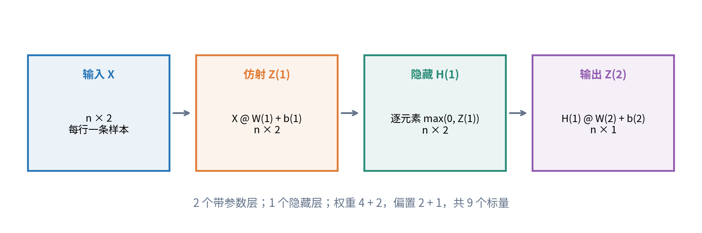
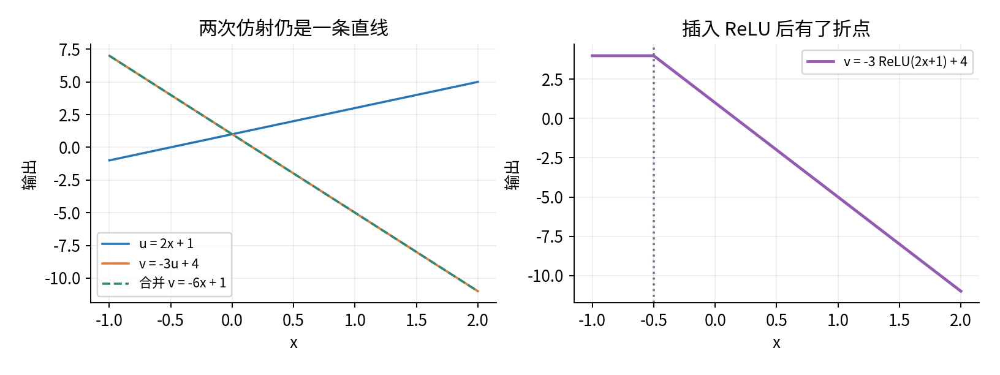
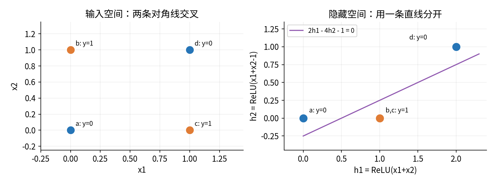
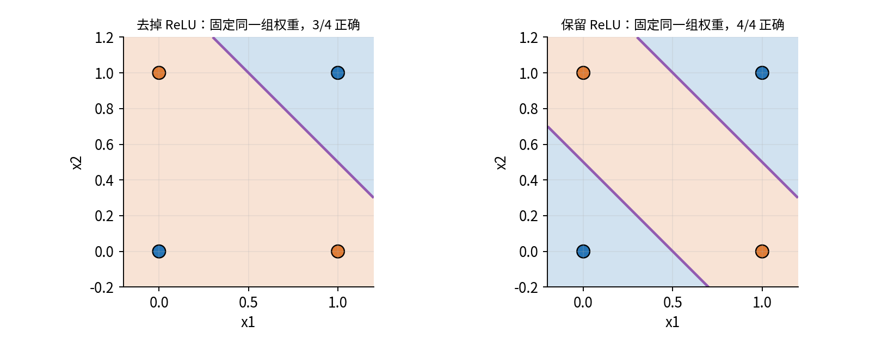
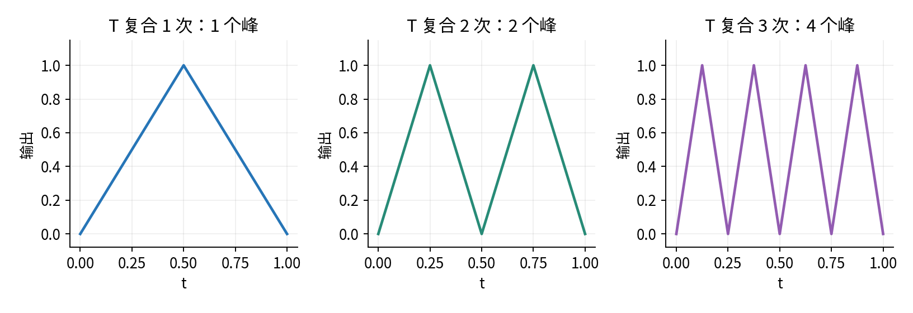
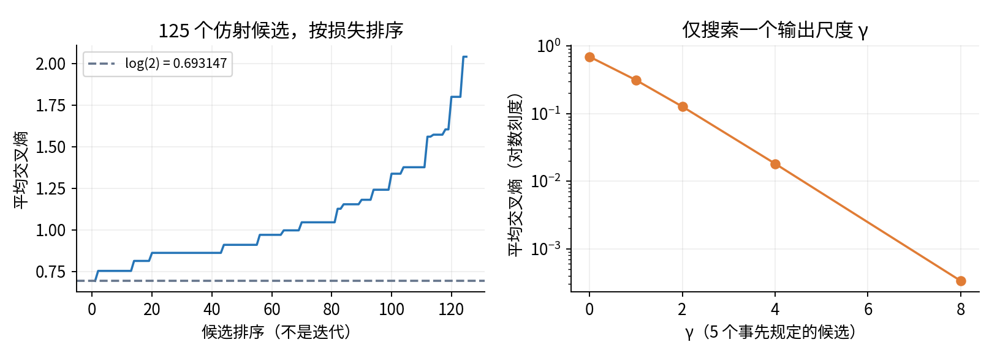
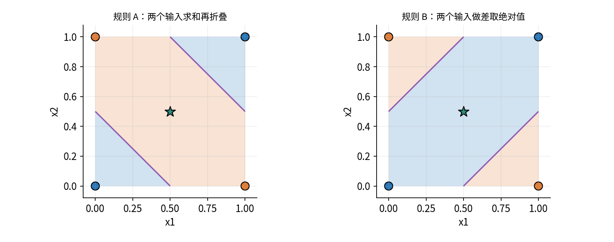

# 025 多层网络与表示

中心问题：增加非线性层怎样改变模型能表示的函数？

第024讲用一个仿射打分器产生logit，再用sigmoid或softmax解释类别概率。本讲保留这个输出接口，改变到达logit之前的计算：先让输入变成一组中间坐标，再由这些坐标打分。关键结论是，增加矩阵乘法的次数不一定增加函数种类；插在矩阵乘法之间的非线性，才可能使一个整体无法用单个仿射映射代替。

先修为024。需要用到的矩阵乘法、广播、分类概率与交叉熵会在这里重新标明形状和作用。我们不假定读者学过反向传播，不使用框架自动求导。主实验直接构造一个网络，并完整枚举很小的候选集合；它回答“某个函数能否表示、怎样验证”，不把找到一组手工参数冒充一般训练算法。

读完应能手算每一层、核对参数量、证明无隐藏非线性时的仿射复合结论、解释XOR在隐藏空间如何被分开，并区分表达能力、优化是否成功以及未见数据上的表现。全文、图和四行真值表均为原创合成教学材料。

## 一 一层到底指什么

一个**前馈网络**按既定方向依次计算，中间结果只交给后面的层；本讲没有循环状态。输入层只是接收数据，不含本讲要计数的权重。**隐藏层**产生中间结果，这些结果既不是原始输入，也不是最终预测。**输出层**产生任务需要的最终数值。把输出解释成概率的sigmoid可以单列为一个步骤，但本讲“层数”只数带权重和偏置的仿射变换。

因此“2→2→1网络”表示输入有2个特征，一个含2个单元的隐藏层，输出有1个logit。它有2个带参数层、1个隐藏层。把它叫“两层网络”时必须同时说明这个约定。有的资料把输入层也数进去，不能只凭名字推断深度。

**宽度**是某个隐藏层含多少个坐标或单元。**深度**在本讲是带参数层的数目。一个单元先将上一层各坐标加权求和，加上自己的偏置，再经过一个标量函数。这个函数叫**激活函数**。所有单元可以用同一种激活函数，但它们的权重和偏置通常不同。



“隐藏”不是“神秘的真实属性”。中间坐标可以是和、差、折线或更复杂的组合；一个坐标的意义由参数和任务共同决定。除非有额外证据，不能把第17个隐藏单元直接命名为某种现实概念。

## 二 从单个样本到整批样本

先把一条输入写成行向量$x=(x_1,\ldots,x_d)$。采用行向量只是为了与代码中“一行一条样本”一致。含$h$个隐藏单元、$q$个输出的网络为：

$$a_j=\sum_{r=1}^d x_r W^{(1)}_{rj}+b^{(1)}_j,\qquad
h_j=\phi(a_j),\qquad
z_k=\sum_{j=1}^h h_j W^{(2)}_{jk}+b^{(2)}_k.$$

$r$是输入坐标下标，$j$是隐藏坐标下标，$k$是输出下标；上标括号中的1和2是层编号，不是乘方。$a_j$是**激活前数值**，$h_j$是**激活后数值**。$\phi$表示激活函数。$z_k$是输出打分；二分类时$q=1$，这个数就是第024讲的logit。

令$n$为批次样本数，$X\in\mathbb R^{n\times d}$。把上述计算对所有行同时执行：

$$Z^{(1)}=XW^{(1)}+\mathbf1_n b^{(1)},\qquad
H^{(1)}=\phi(Z^{(1)}),\qquad
Z^{(2)}=H^{(1)}W^{(2)}+\mathbf1_n b^{(2)}.$$

这里数学偏置$b^{(1)}$是$1\times h$行向量，$b^{(2)}$是$1\times q$行向量；$\mathbf1_n$是$n\times1$全1列。故每条样本使用同一偏置，而不是为每一行学一个不同的偏置。$\phi$逐元素作用，保留形状。

| 对象 | 数学形状 | NumPy形状 | 所表达的内容 |
|---|---|---|---|
| $X$ | $n\times d$ | `(n,d)` | 输入批次 |
| $W^{(1)}$ | $d\times h$ | `(d,h)` | 输入到隐藏的权重 |
| $b^{(1)}$ | $1\times h$ | `(h,)` | 每个隐藏单元一个偏置 |
| $Z^{(1)},H^{(1)}$ | $n\times h$ | `(n,h)` | 激活前后两个不同数组 |
| $W^{(2)},b^{(2)}$ | $h\times q,1\times q$ | `(h,q)`, `(q,)` | 隐藏到输出的参数 |

输出打分$Z^{(2)}$的形状为$n\times q$，代码保留`(n,q)`。代码中的一维偏置没有“行列”方向；`X @ W + b`利用最后一轴广播，把同一组偏置加到每行。本讲坚持输出保留二维。二分类做损失前，明确用`Z[:, 0]`得到形状`(n,)`，标签也为`(n,)`。若标签为`(n,1)`而打分为`(n,)`，相减可能广播成`(n,n)`，运行成功仍是错误。[1]

所有输入、权重、偏置在本例中都是无量纲数。若输入具有物理单位，每个权重必须让送到同一加法中的项具有一致单位。ReLU两分支比较的是同一坐标下的零与输入；不同单位不能未经处理就放在一起相加。

## 三 多层前向递推与参数量

一般网络有$L$个带参数层，定义各层宽度$d_0,d_1,\ldots,d_L$，其中$d_0$为输入维数，$d_L$为输出维数。令$H^{(0)}=X$。对隐藏层$\ell=1,\ldots,L-1$，

$$Z^{(\ell)}=H^{(\ell-1)}W^{(\ell)}+\mathbf1_n b^{(\ell)},\qquad
H^{(\ell)}=\phi_\ell(Z^{(\ell)}).$$

输出层不加隐藏激活：

$$Z^{(L)}=H^{(L-1)}W^{(L)}+\mathbf1_n b^{(L)}.$$

于是$W^{(\ell)}$形状为$d_{\ell-1}\times d_\ell$，$b^{(\ell)}$有$d_\ell$个标量，$Z^{(\ell)}$有$n\times d_\ell$个数。给出输入与全部参数后，按层顺序代入即可得到唯一输出，这叫**前向传播**。它本身不包含学习。

若每个权重和偏置都是一个可独立调整的标量，没有共享或冻结参数，则总参数数为：

$$P=\sum_{\ell=1}^L(d_{\ell-1}d_\ell+d_\ell)
=\sum_{\ell=1}^L(d_{\ell-1}+1)d_\ell.$$

2→2→1网络第一层有$2\times2+2=6$个参数，第二层有$2\times1+1=3$个，共9个。2→3→2→1则为$(2+1)3+(3+1)2+(2+1)1=9+8+3=20$个。批次大小$n$不出现在参数数中：处理4条还是400条样本，复用的都是同一套参数。

激活值是由输入和参数算出的临时结果，不能再算成可学习参数。参数“现在恰好为0”也不意味着架构中没有这个参数；只要允许未来独立修改，它仍占一个位置。反过来，若明确要求多个位置永远相等，则独立可调参数数会减少，必须说明共享规则。

参数数也不是“可区别函数的数量”。例如交换两个隐藏单元的输入权重、偏置以及相应输出权重，函数完全不变。参数向量不同可以代表同一个函数。计算代价、内存、表达能力与参数数相关，却不是同一个概念。

## 四 为什么一直相乘仍然不够

先去掉隐藏激活，令$H^{(1)}=Z^{(1)}$。对一个行输入$x$，直接展开：

$$z=(xW^{(1)}+b^{(1)})W^{(2)}+b^{(2)}
=x\underbrace{(W^{(1)}W^{(2)})}_{W_*}
+\underbrace{(b^{(1)}W^{(2)}+b^{(2)})}_{b_*}.$$

矩阵乘法满足结合律，分配律把偏置项分开。$W_*$形状为$d\times q$，$b_*$有$q$个数。因此两层仍等于一个仿射映射。若偏置全为0，这才是严格意义上的线性映射；有偏置时应称仿射。为避免混淆，下面都使用“仿射”。

多层情形可以逐层合并。已有等效参数$(A,c)$，再接一层$(W,b)$，新的等效参数就是$(AW,cW+b)$。从第一层开始重复这个操作，最终仍是$xA+c$。这是数学恒等式，不依赖如何训练，也不依赖样本数。



这个结论只说“不会逃出仿射函数族”，不保证所有层宽下都能表示任意仿射映射。例如2→1→2的等效权重是一个$2\times1$列乘一个$1\times2$行，各列都是同一向量的倍数。它不能等于$2\times2$单位矩阵，因为单位矩阵的两列不是倍数。中间维数太窄会形成信息瓶颈。

还要分清输出概率的非线性与隐藏表示的非线性。$p(x)=\sigma(xw+b)$作为实值函数当然不是仿射的，但二分类以$p\geq0.5$判断类别时，等价于$xw+b\geq0$，边界仍是一条直线或高维超平面。只在末尾加sigmoid，并不会修复下面的XOR分类困难。

## 五 XOR为什么不能由一个仿射打分器全判对

XOR读作“异或”：两个输入位不同时输出1，相同时输出0。我们考察的完整定义域是四个二进制输入，不是假装从连续平面随机抽来的四个观测。

| 坐标或标签 | a | b | c | d |
|---|---:|---:|---:|---:|
| $x_1$ | 0 | 0 | 1 | 1 |
| $x_2$ | 0 | 1 | 0 | 1 |
| $y$ | 0 | 1 | 1 | 0 |

采用明确的平局规则：logit大于或等于0预测1，小于0预测0。设$z=ux_1+vx_2+b$。四点全对必须同时满足：

$$b<0,\quad v+b\geq0,\quad u+b\geq0,\quad u+v+b<0.$$

将两个正类条件相加，得$u+v+2b\geq0$，所以$u+v+b\geq-b>0$，与最后一个负类条件矛盾。因此任何参数$u,v,b$都做不到四点全对；这不是某次优化不顺利，也不是搜索网格太粗。

几何上，正类两点连线与负类两点连线在中心相交。一条直线无法把两段各自完整放在不同的两侧。这里的代数证明同时处理了“点刚好在边界上”的平局细节，比仅凭图形直觉更严谨。

当只能有一个仿射打分器时，3/4的正确率是可以达到的，例如$u=v=-2,b=3$，打分为$(3,1,1,-1)$，只把a误判为1。结合“不可能4/4”的证明，3/4就是这个四点任务的最佳仿射分类正确率。

## 六 用两个隐藏坐标重新表示四个输入

定义ReLU，即整流线性单元：

$$\operatorname{ReLU}(t)=\max(0,t)=\begin{cases}0,&t\leq0,\\t,&t>0.\end{cases}$$

它是连续函数，在0处有折点；本讲只计算数值，不在折点求导。NumPy用`np.maximum(z, 0)`逐元素实现，不能用对整列求最大值的`np.max`替代。[2]

选定参数：

$$W^{(1)}=\begin{bmatrix}1&1\\1&1\end{bmatrix},\quad
b^{(1)}=\begin{bmatrix}0&-1\end{bmatrix},\quad
W^{(2)}=\begin{bmatrix}2\\-4\end{bmatrix},\quad b^{(2)}=-1.$$

令$s=x_1+x_2$，则$h_1=\operatorname{ReLU}(s)$，$h_2=\operatorname{ReLU}(s-1)$，最终$z=2h_1-4h_2-1$。第一坐标记录输入和的非负部分；第二坐标只在输入和超过1时开始增加，用负的输出权重把上升趋势折回去。这些参数是为解释机制而构造的，没有从标签优化得到。



这里的**表示**就是映射$\Phi(x)=(h_1,h_2)$。原空间的一条直线不足以分开四点，表示空间的一条直线却足够。最终仍使用简单的仿射输出；复杂性已经移到前面的坐标变换中。若两条标签不同的样本被某层映射成完全相同的隐藏向量，后面的确定性网络就无法再把它们区分开。这说明中间表示不是越压缩越好。

## 七 把每一步真正算完

将四行输入一起代入：

$$X=\begin{bmatrix}0&0\\0&1\\1&0\\1&1\end{bmatrix},\qquad
Z^{(1)}=\begin{bmatrix}0&-1\\1&0\\1&0\\2&1\end{bmatrix},\qquad
H^{(1)}=\begin{bmatrix}0&0\\1&0\\1&0\\2&1\end{bmatrix}.$$

第一行的第二个激活前值为$0\times1+0\times1-1=-1$，经过ReLU变成0。最后一行第二个值为$1+1-1=1$，保持1。其余条目同样按行计算，不能先对一列所有样本取最大值。

$$Z^{(2)}=\begin{bmatrix}0\times2+0\times(-4)-1\\1\times2+0\times(-4)-1\\1\times2+0\times(-4)-1\\2\times2+1\times(-4)-1\end{bmatrix}
=\begin{bmatrix}-1\\1\\1\\-1\end{bmatrix}.$$

二分类概率为$p=\sigma(z)=1/(1+e^{-z})$，得到约$(0.268941,0.731059,0.731059,0.268941)$。阈值0.5把四条全部判对，但概率尚不是0或1。对每一条，正确类别的概率均为$\sigma(1)$，平均交叉熵为：

$$L=-\frac14\sum_{i=1}^4[y_i\log p_i+(1-y_i)\log(1-p_i)]
=\log(1+e^{-1})\approx0.313261688.$$

再算一个不在真值表中的连续输入$x=(0.25,0.5)$：$s=0.75$，激活前为$(0.75,-0.25)$，隐藏为$(0.75,0)$，logit为$2\times0.75-1=0.5$，概率约0.622459。我们能计算这个数，却尚未给这个连续输入规定真实标签，不能说它预测正确。

把相同参数中的ReLU去掉，则等效权重$W_* =(-2,-2)^\top$，等效偏置$b_* =3$。四条logit变成$(3,1,1,-1)$，正确率3/4，平均交叉熵约0.997093104。这个比较直接隔离“同一参数下有无ReLU”的效果；它不是已经分别优化两个模型后的公平性能比较。



## 八 分段仿射为什么能形成更复杂的边界

在本例方形$[0,1]^2$内，$s=x_1+x_2$落在$[0,2]$。第一隐藏单元一直满足$h_1=s$，第二个单元在$s=1$切换。因此：

$$z(s)=\begin{cases}2s-1,&0\leq s\leq1,\\-2s+3,&1\leq s\leq2.\end{cases}$$

两段在$s=1$都等于1，连续相接。由阈值$z\geq0$可得预测1的区域为$0.5\leq x_1+x_2\leq1.5$。两个边界来自输出等于0，而隐藏激活切换线是$x_1+x_2=1$。**激活边界与分类边界不是同一个概念。**

![图5 两个斜坡组合成先升后降的logit。隐藏切换发生在s=1，分类切换发生在s=0.5与1.5。该分段式只在本图所画s属于[0,2]的范围内使用。](figures/05_piecewise_logits.png)

更一般地，在一个区域内，如果每个ReLU单元的激活前值的正负状态都不变，正值单元等于恒等映射，负值单元等于零映射。固定这些开关后，每层都是仿射，合并起来仍是仿射。区域一换，使用的等效参数也可改变，于是整体成为**分段仿射函数**。这解释了“每一小片是平面、整体却能弯折”的结构。[3]

ReLU是非线性函数，不代表每组ReLU网络参数都产生非仿射函数。例如所有输出权重为0，输出就是常数；如果考察区域内所有单元一直为正，ReLU在这里不起折叠作用。增加一个非线性层提供新的可能性，不保证实际利用这些可能性。

有限ReLU网络的logit连续且分段仿射。经过sigmoid后，概率曲线一般不再分段仿射；分类标签又是由阈值得到的离散函数。这三个对象要分开描述。本讲的边界推理用logit完成，不把概率曲线的弯曲误当成隐藏层的贡献。

## 九 再加一层如何复用已经形成的结构

为看清深度的作用，暂用一维输入$t\in[0,1]$，构造一个两单元模块：

$$T(t)=2\operatorname{ReLU}(t)-4\operatorname{ReLU}(t-1/2)
=\begin{cases}2t,&0\leq t\leq1/2,\\2-2t,&1/2\leq t\leq1.\end{cases}$$

这个模块把区间折成一座三角形，输出仍落在$[0,1]$，所以可以把输出再次送入同一个规则。记$T^{\circ2}(t)=T(T(t))$，圆圈表示函数复合，不是平方。先算内层再算外层；例如$t=1/8$时，第一次为$1/4$，第二次为$1/2$，第三次为1。



在第一座三角形的上升半段，$T$遍历一次$[0,1]$；在下降半段又反向遍历一次。因此再复合一次会把每座峰变成两座峰，给出图中的倍增。这里展示的是通过复合重复使用结构的办法。深度分离研究会进一步比较哪些目标用深模型可以紧凑表示、浅模型需要多大宽度，但那需要精确的函数类、误差标准和资源约束，不能从这张图推出“深度永远优于宽度”。[4]

实现$k$次这种复合时，相邻模块之间连续的仿射层可以合并，得到$k$个宽度2的隐藏层和一个仿射输出。若每个位置都作为独立参数，架构计数为$4+6(k-1)+3=6k+1$。本图却固定了所有权重，未学习这$6k+1$个数。把“参数位置数”“独立共享参数数”“实际执行的层数”混在一起，会夸大或缩小模型复杂度。

## 十 怎样做一个不偷换问题的NumPy实验

核心前向只需要矩阵乘法、加法和逐元素最大值：

```python
z1 = X @ W1 + b1       # (n, 2)
h1 = np.maximum(z1, 0) # (n, 2)
z2 = h1 @ W2 + b2      # (n, 1)
logits = z2[:, 0]      # (n,)
```

脚本首先计算第七节的两条路线，随后作两个**受控搜索**。搜索意为列出事先确定的有限候选，对每个候选计算目标，再保留目标最小者；它不需要梯度，也没有隐藏的反向传播。

仿射候选规定$u,v,b\in\{-2,-1,0,1,2\}$，共有$5^3=125$组。每组依次算四条logit、四项交叉熵与平均值；同分时保留枚举次序中最早的一组。输出文件保留全部候选，不只保留赢家。最小交叉熵出现在$(0,0,0)$，为$\log2\approx0.693147181$，概率全是0.5，按本讲平局规则正确率为1/2。网格内最高正确率仍是3/4。

为什么“最小交叉熵”与“最高正确率”不是同一个候选？交叉熵也惩罚错误置信度；一条高度自信的错误可以抵消其他三条的收益。这里甚至可以证明零logit是整个仿射函数族的交叉熵最小值，而不限于网格。每条逻辑损失是凸函数；在零参数处，024给出的梯度为$\frac14\sum_i(p_i-y_i)(x_{i1},x_{i2},1)=0$。凸性来自单条二阶导$p_i(1-p_i)\geq0$与仿射代入，故零梯度处为全局最小。这段证明只针对仿射logit，不可移植为整个多层参数目标也凸。

第二个搜索固定隐藏参数，只将输出权重与偏置一起乘以$\gamma\in\{0,1,2,4,8\}$。四条logit于是为$(-\gamma,\gamma,\gamma,-\gamma)$，平均损失为$\log(1+e^{-\gamma})$。对于正$\gamma$，分类全对而置信度不同。有限候选中$\gamma=8$最佳，损失约0.000335406。这个结论只在5个规定候选中成立；若允许所有正实数，损失会随$\gamma$继续下降，趋近0但在任何有限值处都不等于0。



实现对logit直接计算稳定交叉熵，不先计算概率再取对数。`max(z,0)`、`max(-z,0)`与`log1p(exp(-abs(z)))`组合避免指数溢出，也减少正确类别大logit时的减法消去。实验先验证所有输入、计算全部记录并完成JSON/CSV序列化，然后才创建或改写输出。输入无效就报错，不能留下部分“看似成功”的新结果。[5]

## 十一 表达能力 可学习性 泛化是三个问题

**表达能力**问：允许的参数中是否存在一个函数，能满足某个精确表示或近似误差要求？本讲XOR手工构造已经给出了存在性证据。无隐藏非线性的反证则给出了不存在性证据。

**可学习性**在具体实验中至少要拆成：用什么数据、什么目标、什么算法与计算预算，能否找到满足要求的参数。候选搜索找到的是规定候选中的最优者，不保证九维连续参数空间的最优者。如果尝试一个更复杂的优化算法却失败，不能据此证明网络没有表达能力；相反，存在一组好参数也不说明这个算法一定找得到。

**泛化**问：冻结规则对未用于选择参数的数据是否仍有效？数据的来源、目标含义以及分布都进入这个问题。四个二进制角点若就是任务的全部定义域，那么穷尽检查四点可以验证该有限逻辑任务。若实际任务允许连续输入，四角点的正确率不足以确定内部任何一点的标签。

构造两个logit规则：

$$z_A(x)=2\operatorname{ReLU}(x_1+x_2)-4\operatorname{ReLU}(x_1+x_2-1)-1,$$

$$z_B(x)=2|x_1-x_2|-1
=2\operatorname{ReLU}(x_1-x_2)+2\operatorname{ReLU}(x_2-x_1)-1.$$

两者都能用两个ReLU隐藏单元表示，也都在四角点输出$(-1,1,1,-1)$。但在中心$(1/2,1/2)$，$z_A=1$而$z_B=-1$，预测正好相反。四点训练记录不能区分这两种延伸；需要新标签或额外任务假设。表示的灵活性既能解决原有限制，也会带来更多与现有数据同样相容的解释。



## 十二 通用逼近结论应该怎样读

通用逼近的一个常见形式是：对单位立方体$[0,1]^d$上一个连续的标量函数$f$，以及任意正容许误差$\varepsilon$，存在一个有限ReLU网络$N$，使整个定义域内的最大绝对误差小于$\varepsilon$。这里允许网络规模随$f$和$\varepsilon$改变；不是声称本讲固定的2→2→1架构对任意任务都足够。[3]

量词顺序很重要：先指定目标函数与误差要求，再说存在合适网络。误差比较的是函数值，不是随机样本上的正确率；定义域有边界；目标连续；输出最后允许仿射组合。不同定理可能固定宽度而增加深度，或固定隐藏层数而增加宽度，条件不能混用。本讲不使用任何精确最小宽度结论。

一维情形可以亲手看到这种可能性。将$[0,1]$分为$0=t_0<t_1<\cdots<t_m=1$，用折线连接$f(t_k)$。设第$k$段斜率为$m_k=(f(t_{k+1})-f(t_k))/(t_{k+1}-t_k)$。这条折线在区间内可以写成：

$$g(t)=f(0)+m_0\operatorname{ReLU}(t)
+\sum_{k=1}^{m-1}(m_k-m_{k-1})\operatorname{ReLU}(t-t_k).$$

在第一个区间，只有第一项斜坡活动，斜率为$m_0$。越过$t_1$，新增斜率$m_1-m_0$，合起来变成$m_1$；以后每跨过一个折点，同样把旧斜率改成新斜率。函数在各折点连续，并从正确的$f(0)$起步，所以逐段等于插值折线。这是一个明确的单隐藏层ReLU表示，输出权重可以为负。

连续函数在闭区间上一致连续：只要两点距离足够小，它们的函数值差就能统一地小于指定误差。若每个小区间足够短，线性插值是两个端点值的加权平均，而$f(t)$与两个端点值都足够接近，因此它与插值也足够接近。这个论证说明“更多折点可以降低近似误差”的来源，却要求我们知道端点的真实函数值；有限带噪训练数据不会自动提供这些值。

所以通用逼近不是训练算法成功定理，不是少量样本足够定理，不是对未见分布有效定理，也不是任意不连续函数都能被连续网络在整个区域上一致逼近的声明。一个有限连续ReLU网络不能精确表示有跳跃的不连续实值函数。分类输出经过阈值本来可以不连续，但这与逼近连续实值目标的命题不同。

## 来源与进一步阅读
[1] NumPy官方文档，[numpy.matmul](https://numpy.org/doc/stable/reference/generated/numpy.matmul.html)。用于核对二维矩阵乘法与一维数组接口语义；正文形状表独立展开。

[2] NumPy官方文档，[numpy.maximum](https://numpy.org/doc/stable/reference/generated/numpy.maximum.html)。用于核对逐元素最大值及广播语义。

[3] Boris Hanin，[Universal Function Approximation by Deep Neural Nets with Bounded Width and ReLU Activations](https://arxiv.org/html/1708.02691v3)，2017修订版，第1至2节与第5节。用于核对表达能力、连续函数近似和ReLU分段仿射的条件边界；本文未采用该文的精确宽度与深度上界。

[4] Matus Telgarsky，[benefits of depth in neural networks](https://proceedings.mlr.press/v49/telgarsky16.html)，COLT 2016。实际检查了官方论文页面摘要，作为深度分离研究入口；本讲三角复合的公式与手算独立给出，不把图示当作论文下界证明。

[5] Python官方文档，[json](https://docs.python.org/3/library/json.html)。用于核对重复键钩子与严格非有限值序列化；数据契约由本讲明确制定。

## 十三 做实验时最值得检查的细节

1. 先写“几层”和“宽度”的计数约定，再报告参数数。隐藏激活和批次中间值不是额外可学习参数。
2. 保存激活前与激活后数组。只保存最终正确率，会掩盖把ReLU放错位置、使用整列最大值或遗漏偏置等错误。
3. 同权重消融与分别选择最优参数回答不同问题。先说比较方法，再说结论。
4. 搜索必须报告候选范围、目标、平局规则和计算次数。本讲130个候选不能代表通用训练效率。
5. “真值表全对”与“连续平面泛化好”要分别验证。不要把模型画出的背景色误读为真实标签。
6. 固定图和Notebook必须先检查默认数据、配置与重算结果。若改变实验问题，另存结果并重写解释，不能复用旧图题。

## 十四 练习

1. 对批次大小7的2→3→2→1网络，列出每个权重、偏置、激活前与激活后数组的代码形状，算参数总数。
2. 已知一维仿射层$u=2x+1$、$v=-3u+4$，写出合并结果。再把第二式改为$v=-3\operatorname{ReLU}(u)+4$，分段写出关于$x$的公式。
3. 不看第七节，完整计算XOR网络四条输入的$Z^{(1)},H^{(1)},Z^{(2)}$、概率和平均交叉熵。
4. 在相同网络中代入$x=(0.25,0.5)$，解释为什么算出概率还不能评价它的正确率。
5. 推出移除ReLU的等效权重与偏置；给出全部预测并指出唯一错误样本。
6. 用不等式证明仿射logit不能按本讲平局规则全判对XOR。只画一条失败直线不算证明。
7. 在$[0,1]^2$内求隐藏激活切换线和分类边界，说明两者为什么不同。
8. 一个2→1→2纯仿射网络能表示二维恒等映射吗？用列向量关系说明，不依赖尝试训练。
9. 计算$T(1/8)$、$T^{\circ2}(1/8)$、$T^{\circ3}(1/8)$。解释圆圈为何不表示乘方。
10. 写出宽度4、单隐藏层、输入3维、输出2维网络的参数数。若批次由8增到80，参数数如何变化？
11. 为什么仿射候选中最小交叉熵对应的正确率可能低于最高正确率？用本讲具体数值回答。
12. 在XOR构造中把输出尺度从1增到8，正确率和损失各如何改变？有限候选最优与无界尺度最优有什么差别？
13. 分别算$z_A$与$z_B$在四角点和中心的值。这说明了哪一种证据的不足？
14. 取节点$0,1/2,1$，函数值$0,1,0$，用本讲折线公式写出一个ReLU表示，并核对各段斜率。
15. 有人说“存在足够大的网络逼近目标，所以用100条数据和随机初始化一定能训练好”。指出其中缺少的条件与证据。

