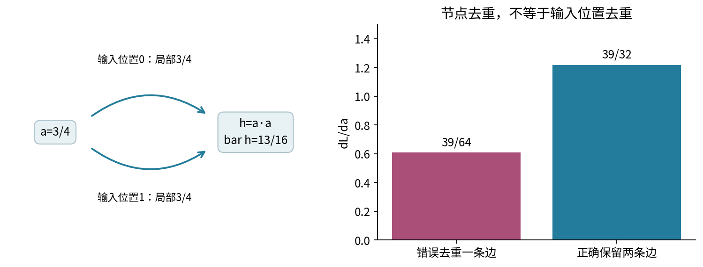
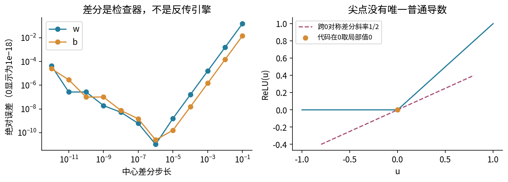

# 026 实验：亲手写出标量反向传播

## 目标、材料与可复现边界

这次实验回答同一个问题：链式法则怎样自动收集一张有共享分支的图中，每个参数对最终标量损失的影响？完成后应交出手算表、一次清空状态的Notebook运行、五份结果和一份失败诊断。不要只提交训练曲线截图。

先修011、025。核心脚本experiment.py与test_experiment.py只使用Python标准库；Notebook需要Jupyter、ipykernel、nbformat，图像重建需要matplotlib和中文字体。建议在本单元目录执行：

```bash
conda env create -f environment.yml
conda activate dl-unit-026
python experiment.py --output outputs
python test_experiment.py
jupyter lab
```

environment.yml是安装配方，不是跨平台锁文件。实际检查了Python3.12.14新进程和真实InProcessKernel逐格执行；没有验证全新Anaconda安装、浏览器界面或外部socket内核。Notebook须重启内核后从头运行，不能依赖先前残留变量。

### 数据字典与产物

data/config.json是原创合成参数：x=2、y=0.25、w=0.5、b=−0.25、40次更新、学习率0.02。它不是从任何私人样本收集的数据。没有训练/测试拆分，因为本实验只检查一条计算链的数学与程序一致性，不估计预测性能。

五份结果依次是summary.json、graph.csv、edges.csv、gradient_check.csv、training.csv。graph表记录每个可达节点的前向值和总梯度；edges表为每个输入位置保留一行；gradient_check有两参数各12个步长；training有0到40共41行，step=0表示尚未更新。

## 实验A 先不用代码，建立可核对的纸笔账本

写下$m=wx,a=m+b,h=a\cdot a,s=h+w,e=s-y,L=e^2/2$。表格至少有“节点、输入位置、前向值、局部导数、收到的贡献、最终总梯度”六列。将w的直接路径与乘法路径用不同颜色标出。

1. 前向求出所有值。检查L应为169/512。
2. 从$\bar L=1$反推。先只写每条边贡献，不急着填写w的总梯度。
3. 解释为什么h的两个输入位置都来自a，却不能删掉其中一个。
4. 把所有到w的贡献相加；最终应得到$\bar w=13/4$、$\bar b=39/32$。
5. 独立对展开式$[(wx+b)^2+w-y]^2/2$求导，对齐两条路线。



合格标准不是“总数碰巧相同”：需要逐条说明39/16和13/16分别来自哪里。若你误把局部导数当总梯度，先在自己的表中圈出被遗漏的后续目标。

## 实验B 检查实现的三条不变量

阅读Scalar的parents结构和backward循环。分别找到“节点按身份去重”“边按输入位置保留”“梯度使用加法”的代码位置。

```python
from experiment import Scalar, backward, topological
w = Scalar(2.0, name='w')
t = w * w
loss = t + t + w
g = backward(loss)
print(loss.value, g[w], len(topological(loss)))
assert loss.value == 10.0
assert g[w] == 9.0
assert len(topological(loss)) == 4
```

这里四个节点是w、t、t+t、最终loss。两项平方共享同一个t，不应把t的反向规则执行两次。下一步逐条做修改，分别预测结果再运行：

- 新建same = Scalar(2.0, name='w')，检查它不会因为名字和值相同就出现在g里
- 连续调用两次backward(loss)，检查两个返回字典相等但不是同一个字典
- 将seed设为3，检查全部可达节点梯度扩大3倍，w.value仍为2
- 把t替换成Scalar(t.value)，再构建“新叶子+w”，比较前向值与梯度

不要编辑随附核心源码来制造错误，先在Notebook的新单元中建立对照。若一定要改引擎练习，请另存文件并保留原版测试，避免污染固定教材产物。

## 实验C 用独立方法审计，不拿同一公式自证

运行test_experiment.py。它用精确分数在前向方向传播一组输入敏感度向量，再与学生引擎的反向结果比较；因此不是将同一个反向循环复制两遍。另有225个多项式参数组合和81个高精度tanh参照。

打开gradient_check.csv，对w和b分别画“步长、绝对误差”。先检查$10^{-6}$附近，再看整个步长扫描；不要选择单一最佳点后删除其余结果。对当前光滑多项式，两个参数在$10^{-6}$处的绝对误差都应小于$10^{-9}$。

再做尖点对照：令u=0，比较backward(u.relu())给出的0与ReLU中心差分给出的1/2。书面说明为什么这里不要求两者相等。最后比较tanh在20处的稳定局部公式与1−tanh²，解释“自动”没有取消数值分析。



建议记录三列：问题是什么、独立参照是什么、通过后仍没有证明什么。例如240张小图通过不意味着任意大小图、任何运算或高阶导数都正确。

## 实验D 从梯度到更新，再故意触发失败

先手算一步：w_new=0.435，b_new=−0.274375。两个值必须来自同一组旧参数的梯度。用training.csv第1行检查损失约0.14567536；再看第40行约0.000127539。

另存一份配置，在其中将iterations改为0，指定新的输出目录。此时training只应有初始一行，不应伪称训练完成40步。探索其他学习率时仍须另存结果，固定Notebook和图入口会拒绝被改变的默认文件。

```bash
python experiment.py --config custom.json --output custom_outputs
```

完成以下失败实验时使用临时复制文件，不能改原始data/config.json：

1. 把x改为文本NaN、布尔true或非零极小数1e-400，分别验证入口拒绝
2. 用旧输出目录先成功运行一次，记录五文件摘要；坏配置再次运行应保持原文件
3. 对尚不存在的新目录使用坏配置，确认目录也没有被创建
4. 设置x=w=b=10、学习率0.1，保持足够多步，观察合法范围内的配置仍可因发散触发数值拒绝
5. 检查参数值不能原地修改。更新数值后应创建新叶子，不要复用旧图

完整测试会自动完成上述新旧输出隔离，并覆盖晚期序列化失败、输出符号链接和输入/输出同路径保护。它不保证操作系统中途写失败时五个文件一起回滚。

## 提交清单与解释要求

- 手算完整图，标明最终目标、seed、所有局部规则和共享贡献
- 已重启并顺序执行的Notebook；无错误输出，三个内嵌教学图可读
- 脚本与Notebook五份结果逐字节一致的检查结果
- 至少解释一例漏加分支、一例同值不同节点、一例不可微点
- 说明单样本拟合与真实泛化无关；给出两个零损失参数解，解释非唯一性
- 保留实际运行环境及未测试安装/界面的边界

答案和诊断路线见answers.pdf。研究习惯是让一个结果始终能回答：这是哪个目标、哪个输入点、哪张依赖图、哪次实际执行得到的导数？
