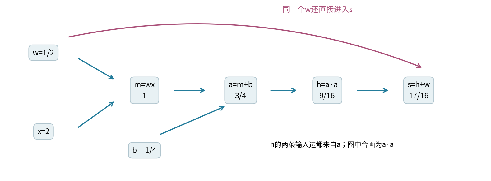
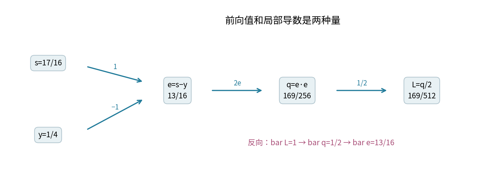
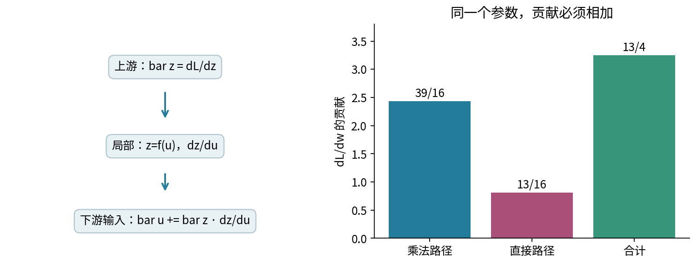
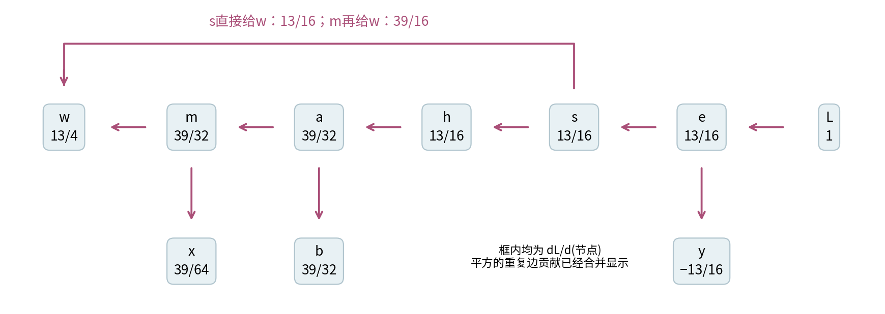
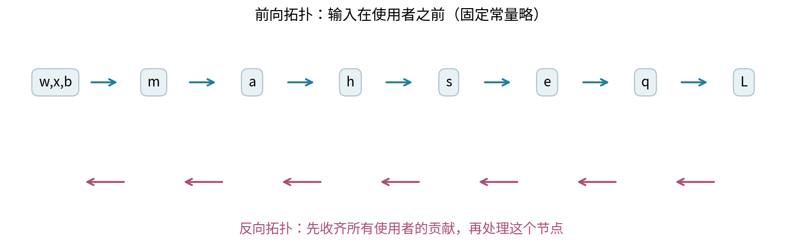
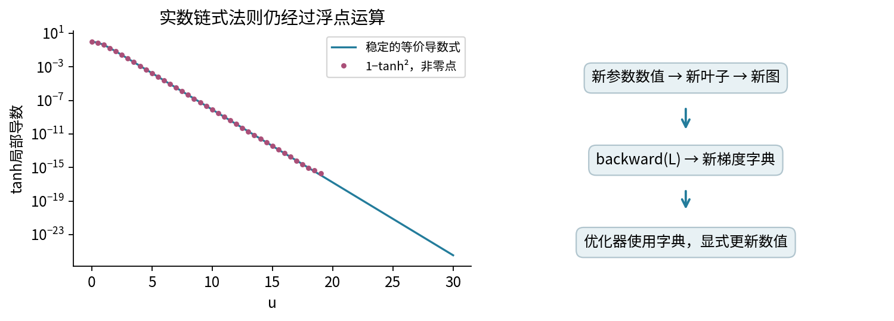
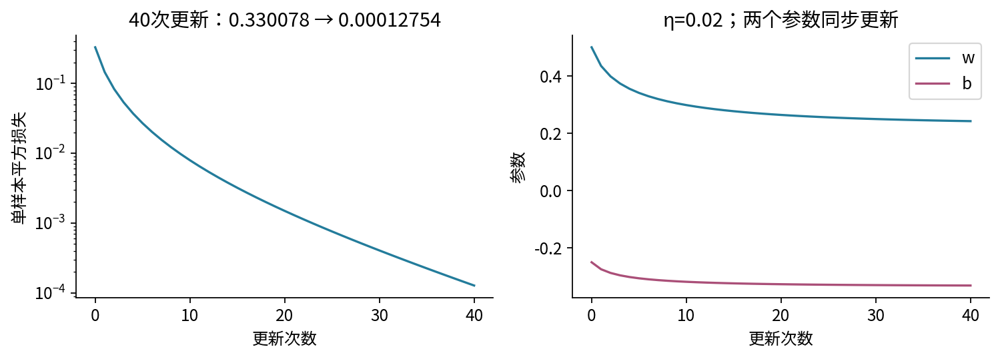
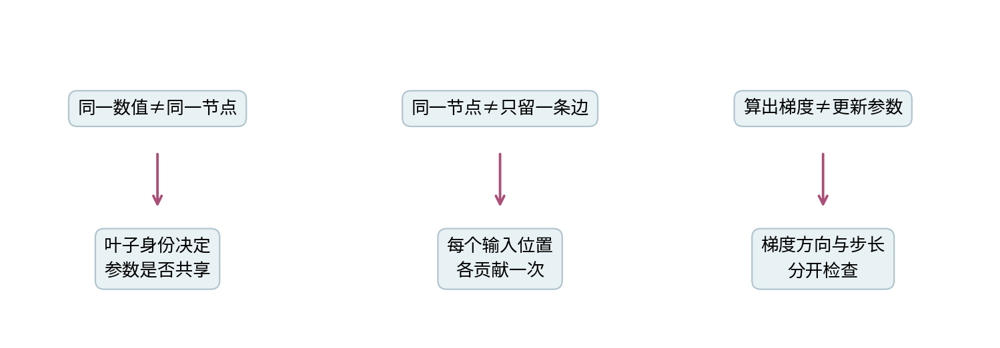

# 026 从标量计算图推导反向传播

## 1 一个问题：为什么局部导数能拼成整个网络的梯度？

第025单元把输入送进多层网络，解释了非线性怎样改变表示。本单元反过来问：最后只有一个损失数值，怎样知道每个早期参数应该往哪个方向改变？我们从一张能全部手算的标量图出发，把链式法则写成可重复的算法，再实现一个小型自动微分器。

先修011的导数、偏导与链式法则，以及025的前向计算。还会使用003中已经学过的类、实例、字典和测试。此处每个节点都是一个实数，shape为标量；没有批次轴、广播或矩阵乘法。所有教学量都按无量纲处理，避免把不同物理单位的量随意相加。027再把相同原则推广到批次张量。

学习结束应能做到三件事：给计算图的每条边写局部导数；解释共享参数为什么必须接收多份贡献；在不调用深度学习框架的情况下，写出并核验反向拓扑算法。我们不会把“导数算对”当作目标函数合理、训练成功或现实任务有效的证明。

### 1.1 先固定目标，才能谈梯度

用输入$x=2$和目标$y=1/4$，设可调参数$w=1/2,b=-1/4$。定义一个带共享参数的微型网络：

$$m=wx,\qquad a=m+b,\qquad h=a^2,\qquad s=h+w.$$

这里$w$既参与第一次乘法，又直接进入最后的加法。$s$是预测值，不是概率。最终目标取半平方损失：

$$e=s-y,\qquad L=\frac12e^2.$$

$1/2$使后续导数更简洁，并不改变这一个非负损失的最小点。训练中只更新$w,b$。我们也可以求$x,y$的形式偏导，用来检查链式法则，但这不意味着可以修改输入或标签来降低损失。



## 2 先算数值，再给依赖关系命名

前向计算必须在输入已经知道时才计算输出。依次代入：$m=1$，$a=3/4$，$h=9/16$，$s=17/16$，$e=13/16$，最后$L=169/512=0.330078125$。读者可以逐行用分数核对，暂时不需要任何程序。

|节点|定义|前向值|它回答的问题|
|---|---|---|---|
|$w,b$|可调叶子|$1/2,-1/4$|当前采用哪组参数？|
|$m$|$wx$|$1$|加偏置前的乘积是多少？|
|$a$|$m+b$|$3/4$|进入非线性前的值是多少？|
|$h$|$a\cdot a$|$9/16$|平方非线性的输出是多少？|
|$s$|$h+w$|$17/16$|共享参数还提供多少直接贡献？|
|$e$|$s-y$|$13/16$|预测与目标相差多少？|
|$L$|$e^2/2$|$169/512$|我们究竟在最小化哪个标量？|

所谓“图”，只是把这些依赖关系记录下来。边从一个输入指向使用它的运算结果；一个节点可以被多个后续节点使用，因此这是有向无环图，而不一定是一棵树。无环来自本例的构造顺序：新节点只读取已经存在的节点。

同一个数值不代表同一个变量。例如两个分别创建的、值都为$1/2$的叶子，是两个可独立变化的量。把它们设为同一个对象才是在声明参数共享。名字只是调试标签，不能用名字或数值代替节点身份。



## 3 局部导数和上游梯度是两种不同信息

对一个中间节点$u$，定义记号$\bar u=\partial L/\partial u$，读作“损失对u的敏感度”。横线不是平均，也不是复数共轭。本单元所有横线量都是相对于同一个最终标量$L$的导数。

若某一步是$z=f(u)$，局部导数$f'(u)$只描述这一步；$\bar z$则已经包含从$z$到最终损失的全部后续影响。链式法则把两者接起来：

$$\bar u=\bar z\,f'(u).$$

例如$z=3u$而$L=z^2/2$，在$u=2$时，局部导数是$3$，但$\bar z=z=6$，所以$\bar u=18$。直接把局部导数$3$当作损失梯度会漏掉后续目标的影响。

### 3.1 加法、乘法和负号的局部规则

对于$z=u+v$，固定另一个输入时，两个局部偏导均为$1$。于是这一步把$\bar z$分别加给$\bar u,\bar v$。对于$z=uv$，局部偏导分别为$v,u$，所以传回$\bar z v$和$\bar z u$。对于$z=-u$，传回$-\bar z$。

|运算|对输入位置的局部偏导|该输入收到的贡献|
|---|---|---|
|$z=u+v$|$1,1$|$\bar z,\bar z$|
|$z=uv$|$v,u$|$\bar z v,\bar z u$|
|$z=-u$|$-1$|$-\bar z$|
|$z=\tanh u$|$1-\tanh^2u$|$\bar z(1-\tanh^2u)$|
|$z=\max(u,0)$|$u>0$时1，$u<0$时0|按所在光滑分支计算；零点另订约定|

这里写“收到的贡献”，因为一个节点可能还有其他使用者。总梯度不是覆盖赋值，而是把所有合法路径贡献相加。

### 3.2 为什么输出端从1开始？

因为$\partial L/\partial L=1$。它是本次反向传播的起点，常叫seed。若把seed设为$c$，返回的是$c\,\partial L/\partial u$，即目标$cL$的导数。seed不是学习率，反向传播也不会因此自动更新参数。



## 4 把这张图完整倒着算一遍

先看损失尾部。由$L=e^2/2$得到$\bar e=e=13/16$。因为$e=s-y$，故$\bar s=13/16$、$\bar y=-13/16$。由$s=h+w$，此时$h$收到$13/16$，而$w$也先收到直接路径的一份$13/16$。

再看平方节点。$h=a^2$给出$\bar a=\bar h\,2a=(13/16)(3/2)=39/32$。由$a=m+b$，$m$和$b$各收到$39/32$。最后由$m=wx$，$w$再收到$(39/32)\cdot2=39/16$，$x$收到$(39/32)(1/2)=39/64$。

所以最终结果是：

$$\frac{\partial L}{\partial w}=\frac{13}{16}+\frac{39}{16}=\frac{13}{4}=3.25,$$

$$\frac{\partial L}{\partial b}=\frac{39}{32}=1.21875,\quad
\frac{\partial L}{\partial x}=\frac{39}{64},\quad
\frac{\partial L}{\partial y}=-\frac{13}{16}.$$

注意“先收到”的含义：不能在$w$刚拿到直接路径的贡献时，就宣称它的最终梯度为$13/16$。还有乘法路径没有走到。图3右边的两根贡献柱来自同一套参数和同一个损失，才可以合并。



### 4.1 用展开后的函数独立核对

把中间节点全部代回去：

$$L(w,b)=\frac12\left[(wx+b)^2+w-y\right]^2.$$

记$a=wx+b,e=a^2+w-y$，直接对这个表达式求偏导：

$$L_w=e(2ax+1),\qquad L_b=2ae.$$

在当前点代入，仍得到$13/4$和$39/32$。这是另一条可审计计算路线。如果程序和手算不同，应先查局部规则、共享路径和所求目标，不能只调差分容差使测试变绿。

## 5 两种“重复”需要分开处理

### 5.1 重复节点：同一对象只排进拓扑表一次

假设$t=w^2$，而$L=t+t+w$。$t$是同一中间节点，被加法的两个输入位置使用。如果把$t$整个反传过程执行两遍，同时每次都使用已经累积完成的$\bar t$，会重复计算。正确做法是每个节点执行一次反向规则。

### 5.2 重复输入位置：同一运算的两条边都要保留

另一方面，$h=a\cdot a$虽只有一个不同的父节点，却有两个输入位置。把乘法临时写为$f(u,v)=uv$，然后令$u=v=a$。对共同变化的$a$，必须把两个偏导相加：

$$\frac{dh}{da}=\frac{\partial f}{\partial u}\frac{du}{da}
+\frac{\partial f}{\partial v}\frac{dv}{da}=a+a=2a.$$

如果仅保留一条局部边，主例会给出$\bar a=39/64$，正好少一半。程序中的拓扑访问集合可以去重节点，记录局部导数的边列表却不能因输入对象相同就去重。两者负责的是不同事情。


另一个常见错误是把共享量重新包装成新叶子。例如已有$a=w*w$，写Scalar(a.value)会保留同一个前向数值，却切断从$a$到$w$的依赖。对于$w=2$，$a+w$的导数是$5$；重新包装后只剩直接路径，导数变成$1$。这不是浮点误差，而是求导对象已经改变。

## 6 反向拓扑顺序为什么足够？

拓扑顺序要求每个输入节点出现在它的使用者之前。主例可以按$w,x,b,m,a,h,s,y,e,q,L$排列，另外还要包括负号和常数等实现节点。合法顺序可能不止一个；只要所有依赖边都指向后面的节点即可。

反转这个顺序后，每个节点的所有使用者都先被处理。于是到处理$u$时，所有直接使用者$v$已经把对应贡献加入$\bar u$。我们再将完整的$\bar u$传给它自己的输入，就不会漏掉尚未到来的分支。

<p style="break-after:avoid;">更形式化地，在光滑点有递推式：</p>

$$\bar u=\sum_{\text{每个使用u的输入位置 }(v,j)}
\bar v\,\frac{\partial v}{\partial u_j}.$$

求和单位是输入位置，不是不同的数值，也不只是不同的节点。由输出$\bar L=1$开始，沿反向拓扑顺序逐点应用这个等式，便可用归纳法得到每个可达节点的总导数。这也等价于把从$u$到$L$的所有路径上的局部导数乘积相加，但算法不需要枚举可能很多的完整路径。



### 6.1 工作量与内存

若图有$V$个可达节点、$E$条输入边，每个标量局部规则耗时有界，那么前向记录、拓扑排序和一次反向扫描均为$O(V+E)$量级。保存图和梯度字典也需要$O(V+E)$存储。这里不是说训练免费，而是对一个标量目标，不必为每个参数重新走一遍完整前向差分。

本实现用显式栈进行深度优先排序，避免Python递归层数限制。灰色状态代表正在访问，黑色状态代表已经完成；如果遇到指向灰色祖先的边便报循环错误。支持的运算只连接到既有不可变节点，正常使用不会制造环，但防护检查让失败原因更清楚。

## 7 实现：让图保存依赖，让字典保存本次梯度

完整实现见experiment.py。Scalar包含value、parents、op、name。parents是有序元组，每项为“父节点、当前点的局部导数”。用不可变对象保存当前前向的数值和局部导数，避免更新参数以后误用旧图。对象按身份区分，两个同值节点不自动合并。

### 读实现前的Python桥接

003讲过类和方法，但这里还有几种新写法。`@dataclass(...)`是标准库提供的类装饰器：Python定义类后把这个类交给dataclass处理，替我们生成初始化等样板方法；它本身不计算任何导数。`value: float`等标注用于说明字段，不能代替运行时数值检查。

`frozen=True`禁止普通的属性赋值，所以创建节点后不能执行node.value=新值。`eq=False`不生成“按字段比较是否相等”的方法，而保留对象身份比较；这保证两个同值节点不会在访问集合或字典中混成一个。`slots=True`让实例只保存声明的字段、不能随意加新属性，是存储约束，不是求导规则。刻意修改私有内部状态不属于支持的用法。

自动生成的初始化方法会调用`__post_init__`，本实现在那里检查数值、parents结构和局部导数。初始化期间用`object.__setattr__`把已经检查过的数值存成float；这只是创建对象时的内部动作，不提供原地更新参数的接口。

`__mul__`等双下划线方法是Python的运算符协议：a*b调用左侧对象的乘法方法，a+b调用加法方法，-a调用负号方法。遇到0.5*q，左侧普通float不能处理Scalar时，Python再尝试右侧q的`__rmul__`；本实现将它转交q*0.5。因此半平方损失中的常数也能进入图。`as_scalar`把普通数值包装为常数叶子，已有Scalar则保持同一身份。

`parents=((self, other.value), (other, self.value))`是“元组里面装两个边元组”：每条边保存父节点引用与一个已经算好的局部偏导。元组保存顺序且允许重复，不会因两个引用相同就少记一项。节点类管理前向记录；真正的链式求导仍由后面的backward循环完成。

乘法的关键部分可写成：

```python
other = as_scalar(other)
out = Scalar(
    product(self.value, other.value),
    ((self, other.value), (other, self.value)),
    '*'
)
```

括号内有两项，即使self与other指向同一对象也保留。product除了相乘，还检查溢出和非零乘积下溢为零。加法同样记录两条局部值为1的边；负号记录一条局部值为−1的边。

### 7.1 反向传播核心

下面就是核心数据流。完整脚本还包含入口、数值和图大小检查。

```python
order = topological(root)
gradients = {node: 0.0 for node in order}
gradients[root] = seed
for node in reversed(order):
    for parent, local in node.parents:
        contribution = product(gradients[node], local)
        gradients[parent] = number(
            gradients[parent] + contribution,
            'gradient sum'
        )
return gradients
```

每次调用返回一个全新的字典。因此重复调用backward(L)不会把上次结果再加一遍。图可以只读地重复检查；但参数变动后必须重新创建叶子并重新前向。这个教学API没有.grad缓存、requires_grad开关或优化器对象，不能把其他框架的累加语义照搬过来。

字典对所有可达叶子给出形式敏感度，连常数节点也有。训练参数清单由调用者明确指定为w和b；算法不会猜哪个量应该更新。不可达的独立叶子不在字典内，对完整目标的导数可按0理解。

### 7.2 最小可运行检查

在本单元目录执行：

```python
from experiment import example, backward
nodes = example()
g = backward(nodes['L'])
print(nodes['L'].value, g[nodes['w']], g[nodes['b']])
assert g[nodes['w']] == 3.25
assert g[nodes['b']] == 1.21875
```

结果应为0.330078125、3.25、1.21875。这个例子中的分数分母都是2的幂，因此这些关键数值可由二进制浮点精确表示；不要由此推断一般网络中的计算也没有舍入误差。

## 8 自动微分与数值检查：角色不同

中心差分用两次独立的普通数值计算估计导数：

$$g_{\mathrm{FD}}(\theta;\varepsilon)=
\frac{L(\theta+\varepsilon)-L(\theta-\varepsilon)}{2\varepsilon}.$$

本实验对w、b逐坐标检查，其他量不变。程序在$10^{-1}$到$10^{-12}$之间扫描步长，同时报告绝对误差和缩放误差$|g_{\mathrm{FD}}-g|/\max(1,|g_{\mathrm{FD}}|,|g|)$。后者不是在梯度接近零时强行除以零的相对误差。

光滑且精度足够时，步长缩小先减小截断误差；太小时，两次接近的损失相减会放大舍入影响。正确梯度不必对所有步长都同样接近差分。自动微分使用解析局部规则和链式法则，不靠扰动步长求导，但仍受浮点运算精度限制。


### 8.1 ReLU零点为什么不能用同一判据？

$\max(u,0)$在$u=0$的左导数为0，右导数为1，因此普通导数不存在。本实现约定该点传回0。对称差分却始终得到1/2，两者不一致不构成代码出错的证据。复合网络在不可微点采用局部约定，也不自动保证得到某种全局广义导数；更完整边界留到028。

测试中应分别检查光滑区域、明确的零点约定，以及扰动有没有跨过激活分支。不能对一组跨尖点的样本应用光滑函数差分容差，然后声称框架求导失败。

### 8.2 tanh提醒我们：局部公式也有数值实现

这里第一次引入双曲正切函数tanh。对任意实数u，定义

$$\tanh u=\frac{e^u-e^{-u}}{e^u+e^{-u}}.$$

分母始终为正，函数值在$(-1,1)$内；把u换成−u会改变分子符号而保留分母，所以它是奇函数。令$N=e^u-e^{-u},D=e^u+e^{-u}$，则$N'=D,D'=N$。由商法则，

$$\tanh'(u)=\frac{N'D-ND'}{D^2}=\frac{D^2-N^2}{D^2}=1-\tanh^2u.$$

这也说明导数为正，输入变大时函数连续增加并逐渐饱和。但当$u=20$时，当前浮点math.tanh可能已经舍入为1，直接相减就变成0。利用$q=\exp(-2|u|)$，可改写为：

$$\tanh'(u)=\frac{4q}{(1+q)^2}.$$

这个等价式在本例保留约$1.69934\times10^{-17}$的小导数。代码限制tanh输入绝对值不超过100，并用100位Decimal独立检查81个整数输入。这里计算的是底层实数运算公式在当前数值附近的导数，不是把“每次浮点舍入组成的离散映射”当作通常可微函数。



## 9 把正确梯度接到一次明确更新

令学习率$\eta=0.02$，同步更新两个参数：

$$w_{\mathrm{new}}=0.5-0.02(3.25)=0.435,$$

$$b_{\mathrm{new}}=-0.25-0.02(1.21875)=-0.274375.$$

“同步”表示两个梯度都在同一组旧参数上求出。不能先改w，再用新w重算b的梯度，还声称这是同一次普通梯度下降。更新后重建整张图，新的损失约为0.14567536，具体数值由随附training.csv记录。

主实验事先固定40次更新，不按最漂亮的曲线挑停止点。损失从0.330078125降到约0.000127539，最终w约0.242368、b约−0.331105，预测约0.265971。它说明这个特定步长和初值下，梯度能驱动这一条合成记录的损失下降。



该目标只约束$(2w+b)^2+w=1/4$。在$w\leq1/4$时可以取$b=-2w\pm\sqrt{1/4-w}$使损失为0，因此存在一族全局最小点，不能从有限轨迹宣称找到了唯一正确参数。合法配置也可能因步长和初值导致发散；数值范围检查会拒绝失控计算，但不是收敛定理。

## 10 测试不是一句“运行成功”

测试有四层：先核对主例每个节点；再用225个分数参数组合检查代数展开；再用240张随机小图的独立Fraction前向敏感度向量核对反向算法；最后检查实际读写和失败路径。独立参照的传播方向和实现方式不同，减少两份代码共享同一错误的风险。

边界测试覆盖：相同节点的两条边、多个分支、同值不同对象、重复反传、seed缩放、切断依赖、不可变数值、3001节点非递归长链、ReLU尖点和tanh饱和区。错误输入不能仅靠assert拒绝，因为Python的优化模式可能关闭assert；实际入口使用显式异常。



### 10.1 运行与失败契约

核心接受Python内置int或float标量，拒绝bool、字符串、复数、容器及非有限值；数值和中间量绝对值限制为$10^{100}$。非零乘积若下溢成0则报错；加法舍入、小贡献被大数吸收等误差并未被彻底消除。若调用前已经把极小文本变成浮点0，接口无法恢复丢失的信息。

JSON配置则在文本转浮点时检查非零转零，拒绝重复键、错类型和越界值。x、y、w、b绝对值最多10，iterations为0至500的整数，learning_rate在$10^{-6}$至0.1。核心通用接口与固定图文入口分开：图和Notebook会先核对原始配置及五份默认输出摘要，防止把旧解释套在新实验上。

脚本先完成全部验证、计算和序列化，再开始写五份输出。输入或计算失败保留旧结果，也不创建新的结果目录；有效运行会覆盖同名输出。不宣称对操作系统故障具有多文件原子性，也不防御恶意并发替换路径。安装Anaconda、浏览器Jupyter和外部socket内核未在本次制作中验证；已实际运行的是新Python进程与真实InProcessKernel顺序执行。

### 一手资料与对照阅读

参考资料：Baydin等作者发表于[JMLR的自动微分综述](https://jmlr.org/papers/v18/17-468.html)用于进一步阅读，本次只核对其官方摘要。实际查阅了[PyTorch官方Autograd mechanics](https://docs.pytorch.org/docs/2.14/notes/autograd.html)中的计算历史、保存中间量和不可微点说明，以及[Python math文档](https://docs.python.org/3/library/math.html)的tanh与有限值接口。作者的[micrograd引擎](https://github.com/karpathy/micrograd/blob/master/micrograd/engine.py)可作实现对照；本讲采用独立编写的不可变边记录与返回字典设计，没有复制其代码，也未执行PyTorch。Python桥接另核对[dataclasses文档](https://docs.python.org/3/library/dataclasses.html)和[数字运算符协议](https://docs.python.org/3/reference/datamodel.html#emulating-numeric-types)。所有例题、证明展开、图和数据均为本课程原创。

<div style="break-before:page;"></div>

## 11 练习与继续阅读

1. 不看表格，重算主例的m、a、h、s、e和L。
2. 写出$z=uv+u$对u、v的局部合成梯度，解释共享项。
3. 主例中只保留w的直接路径，会得到多少？只保留乘法路径呢？
4. 将h=a·a错误去重成一个输入位置，重算w、b的错误梯度。
5. 对w=2，手算$L=(w^2)+(w^2)+w$，要求两项平方共享同一中间节点。
6. 两个同名同值的Scalar对象是否共享参数？怎样用实验判定？
7. 为什么反向拓扑顺序要求“所有使用者先完成”？画一个菱形图解释。
8. seed改为3时，哪些梯度变成3倍？参数值会不会改变？
9. 把a重新包装成Scalar(a.value)后，目标的前向值和梯度分别可能怎样变化？
10. 写出ReLU零点的左右导数和中心差分，解释三者关系。
11. 用q形式计算tanh在20处的导数，和直接1−tanh²比较。
12. 手算一次同步更新，并说明为何必须重新构建前向图。
13. 这个单样本问题为什么不能确定唯一的w、b？给出两个零损失解。
14. 设计一个会导致非零乘积下溢的输入，并说明抛异常意味着什么、不意味着什么。
15. 若自己的梯度检查只在一个步长通过，下一步还应检查什么？

完整解答在answers.pdf，独立实验步骤在lab.pdf。下一单元保留本讲的“局部规则、贡献相加、明确目标”三个原则，逐项推导批次仿射层与分类网络的矩阵反向传播。
