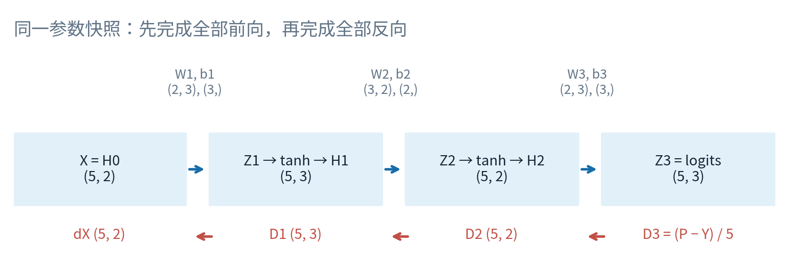
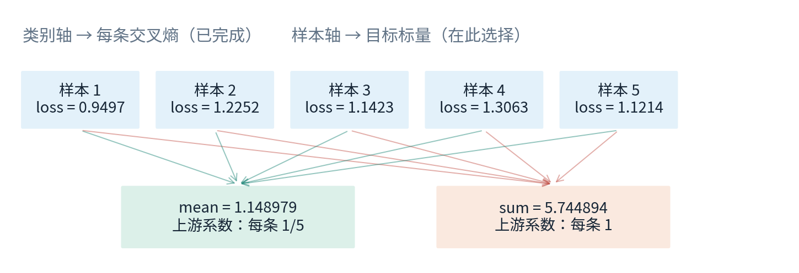
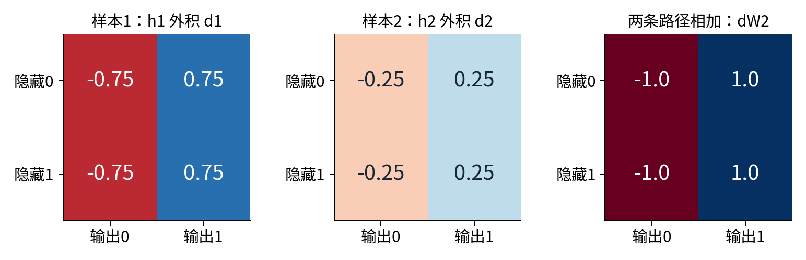
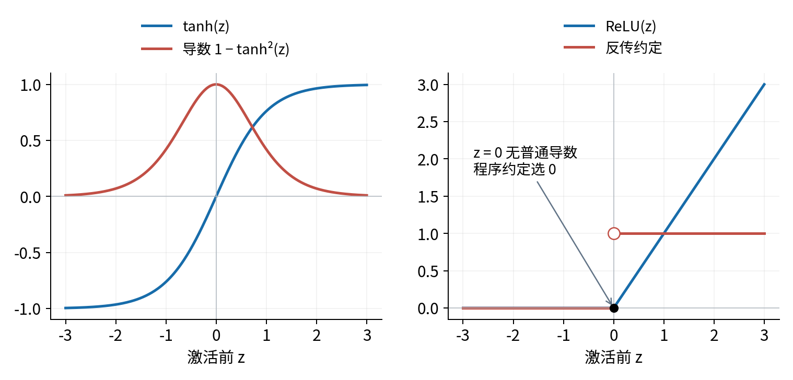
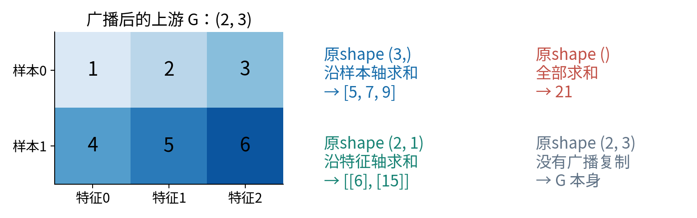
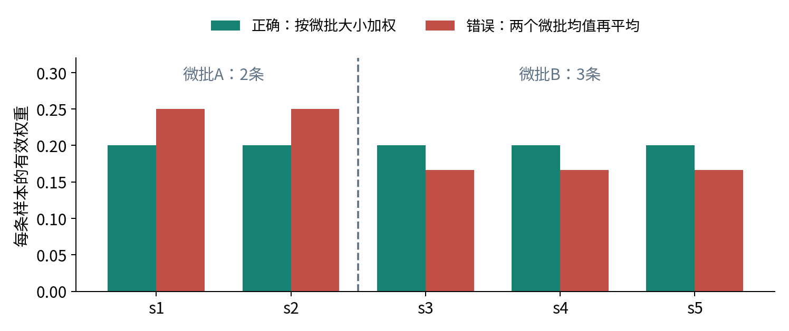
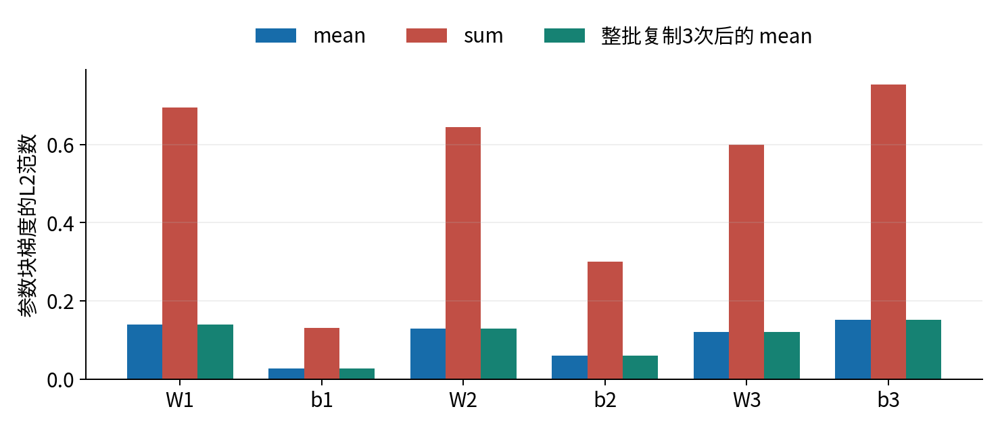
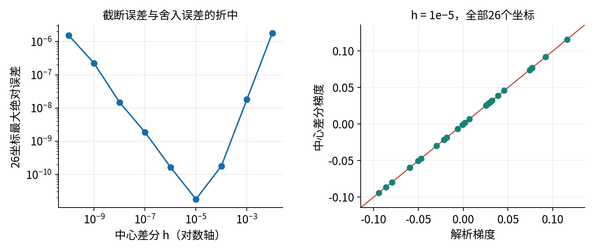

# 027 批次反向传播与损失归约

中心问题：从一个样本推广到批次时，梯度和平均因子怎样变化？

第026讲把一个标量目标沿计算图反向传播：每条边应用链式法则，一个变量影响目标的所有路径相加。本讲不另造一套法则，而是把许多同构的标量计算排成矩阵。难点不在于把循环删掉，而在于确认矩阵的每一轴代表什么、参数在哪些位置共享，以及最末端究竟求和还是平均。

先修：012雅可比与矩阵求导、024逻辑回归与softmax分类、026标量计算图。沿用行样本约定。目标是能从定义推导一整批多层网络的梯度，用NumPy写出反传，再用独立计算核对每个参数。026提供概念依赖；附带代码是独立实现，不导入026的标量自动微分器。

所有数据为原创合成无量纲数，所有实验在CPU上运行。我们只检验局部导数、形状和归约含义，没有真实任务精度、大模型训练速度或泛化证据。反向传播是一种求导算法；它没有替我们选择合理的数据、目标或学习率。

## 一 先确定那个被求导的标量

设批次有$n$条样本，输入维数$d_0$，类别数$C=d_L$。$L$表示带参数的仿射层数，隐藏层数是$L-1$。第$i$条样本标签$y_i$为$0,\ldots,C-1$中的一个整数。样本在第0轴，特征或类别在最后一轴。

定义$H^{(0)}=X$，隐藏层和输出层分别为：

$$Z^{(l)}=H^{(l-1)}W^{(l)}+\mathbf1_n b^{(l)},\quad
H^{(l)}=\phi_l(Z^{(l)}),\qquad 1\le l<L,$$

$$Z^{(L)}=H^{(L-1)}W^{(L)}+\mathbf1_n b^{(L)}.$$

数学偏置$b^{(l)}$为$1\times d_l$行向量，代码用形状`(d_l,)`的一维数组。$\mathbf1_n$是$n\times1$全1列。每行共用同一个偏置；新增样本不新增参数。最后一层输出logits，不额外加隐藏激活。

| 对象 | 形状 | 含义 |
|---|---|---|
| $H^{(l-1)}$ | $n\times d_{l-1}$ | 本层输入 |
| $W^{(l)}$ | $d_{l-1}\times d_l$ | 每个样本共享的权重 |
| $b^{(l)}$ | 数学$1\times d_l$；代码`(d_l,)` | 按行广播的偏置 |
| $Z^{(l)},H^{(l)}$ | $n\times d_l$ | 激活前、激活后 |
| $G_{Z^{(l)}}$ | $n\times d_l$ | 标量目标对每个$Z$元素的导数 |
| $G_{W^{(l)}},G_{b^{(l)}}$ | 与相应参数相同 | 所有使用路径累加后的梯度 |

为避免“梯度是行还是列”的歧义，约定$G_A$与$A$同形，且对任意小扰动$dA$，一阶变化为$dJ=\sum_{r,k}(G_A)_{rk}(dA)_{rk}$。矩阵梯度的每个元素都是普通偏导数，不是把完整雅可比塞进同一个数组。



单个样本交叉熵记作$\ell_i$。常见两个标量目标为：

$$J_{\mathrm{sum}}=\sum_{i=1}^n\ell_i,\qquad
J_{\mathrm{mean}}=\frac1n\sum_{i=1}^n\ell_i.$$

二者相差常数$n$，不是名字不同的同一个数。未归约损失向量$(\ell_1,\ldots,\ell_n)$没有指定唯一的“整体梯度”。若传入上游向量$v\in\mathbb R^n$，反传计算的是$\sum_i v_i\nabla\ell_i$。取全1得到sum，取全$1/n$得到mean。这正是012的向量雅可比积在批次上的含义。

## 二 从交叉熵启动反向传播

一行logits为$z\in\mathbb R^C$，类别概率$p_k=e^{z_k}/\sum_j e^{z_j}$。对硬标签$y$，交叉熵为：

$$\ell=-\log p_y=\log\sum_{j=0}^{C-1} e^{z_j}-z_y.$$

对第$k$个logit求导，第一个项的导数是$e^{z_k}/\sum_j e^{z_j}=p_k$，第二项导数是$\mathbf1\{k=y\}$。故$\partial\ell/\partial z_k=p_k-\mathbf1\{k=y\}$。这里没有先求一个$C\times C$的softmax雅可比再乘它的必要；合并后的公式直接给出VJP。

把标签编码成独热矩阵$Y\in\mathbb R^{n\times C}$，每行只在真实类处为1，其余为0。令$P$逐行softmax，则平均损失对应：

$$D^{(L)}:=G_{Z^{(L)}}=\frac{P-Y}{n}\in\mathbb R^{n\times C}.$$

求和损失则为$D^{(L)}=P-Y$。平均因子只需要引入一次，位置可以在最末端，也可以在最后统一缩放所有参数梯度；不能两处都除。本文选择在输出$D^{(L)}$处除$n$，之后各层只遵守局部求导规则。

类别轴上的求和$\sum_k$是单条交叉熵的定义，样本轴上的平均$\frac1n\sum_i$是批次归约。这两个轴不能混淆。对硬标签矩阵写`-(Y * logP).mean()`会同时除以$nC$，因此比本讲目标小$C$倍；正确等价写法是先`sum(axis=1)`再`mean()`。



### 数值计算不能照抄指数形式

每行先减去最大值$m_i=\max_k z_{ik}$：

$$s_{ik}=z_{ik}-m_i,\qquad
\log p_{ik}=s_{ik}-\log\sum_j e^{s_{ij}}.$$

此时所有指数参数非正，至少一个指数等于1，避免大正logit导致指数溢出。实现移除其中一个精确的1后对其余指数求和$r_i$，用`log1p(r_i)`计算对数分母。这样在几乎确信且预测正确时，微小正损失不会仅因`1 + tiny`舍入成1而消失。

真实类别的梯度也可写为$-\sum_{k\ne y_i}p_{ik}$，其余位置为$p_{ik}$。这与$P-Y$数学等价，却能避免接近1的$p_y$再减1造成抵消。例：$z=(37,0),y=0$，float64中$p_0$可能已舍入成1，但损失约$8.533\times10^{-17}$，真实类梯度约$-8.533\times10^{-17}$仍可保留。

这并不消除所有浮点限制。极小指数可能下溢为0；极小隐藏导数也可能在后续计算丢失。$z=(1000,1001,-1000),y=2$时第三类概率下溢为0，稳定的log概率形式仍给出有限损失约2001.313262。不能用`-log(p_y)`再补一个任意小常数，悄悄改变所求目标。

## 三 仿射层：共享参数为什么必须求和

暂时省略层号，设$Z=HW+\mathbf1_n b$，其中$H\in\mathbb R^{n\times d}$、$W\in\mathbb R^{d\times h}$、$b\in\mathbb R^{1\times h}$。上游梯度$D=G_Z\in\mathbb R^{n\times h}$已经包含从最终目标传来的全部比例。

逐元素写为$z_{ik}=\sum_{r=1}^d h_{ir}w_{rk}+b_k$。某个$w_{rk}$被每一行的第$k$个输出使用，所以：

$$\frac{\partial J}{\partial w_{rk}}
=\sum_{i=1}^n\frac{\partial J}{\partial z_{ik}}\frac{\partial z_{ik}}{\partial w_{rk}}
=\sum_{i=1}^n D_{ik}H_{ir}.$$

这正好是$(H^TD)_{rk}$。对$b_k$，每条使用路径的局部导数都为1，故$\partial J/\partial b_k=\sum_i D_{ik}$。对一个输入元素$h_{ir}$，它影响本行所有$h$个输出坐标，故$\partial J/\partial h_{ir}=\sum_k D_{ik}W_{rk}$。

于是三个反传公式为：

$$G_W=H^TD\;(d\times h),\qquad
G_b=\mathbf1_n^TD\;(1\times h),\qquad
G_H=DW^T\;(n\times d).$$

形状核对不能替代推导，但能迅速筛掉错误。$H^TD$的批次维$n$被收缩，保留输入与输出坐标。$DW^T$保留样本轴，收缩输出坐标。`D.sum(axis=0)`消去样本轴，返回`(h,)`，与代码偏置同形。



也可以从微分核对：$dZ=(dH)W+H(dW)+\mathbf1_n(db)$。代入$dJ=\sum_{ik}D_{ik}dZ_{ik}$，按$dH,dW,db$分别收集系数，就得到同样三个公式。这种“先展开扰动、再识别系数”的办法，能推广到更复杂的线性操作。

$G_H$需要前向计算时的$W$。若刚算完$G_W$就原地更新$W$，再用新$W$计算$G_H$，得到的已不是原前向目标的梯度。正确顺序是完整前向、完整反向、统一更新。缓存中间量时，也不要原地覆盖仍要使用的激活值。

## 四 激活层：逐元素乘法不是矩阵乘法

对逐元素激活$H=\phi(Z)$，不同位置之间没有混合。上游$G_H$与$Z$均为$n\times h$，每个元素独立应用标量链式法则：

$$G_Z=G_H\odot\phi'(Z).$$

$\odot$为逐元素乘法，对应NumPy的`*`，不是`@`。无需存储一个$(nh)\times(nh)$的对角雅可比；保存$nh$个局部导数并逐元素相乘即可。

对$t=\tanh z=(e^{2z}-1)/(e^{2z}+1)$，求商的导数可得$dt/dz=1-t^2$。因此前向已保存$H$时，可用$G_Z=G_H\odot(1-H^2)$。本讲主实验使用tanh，使有限差分不受ReLU折点干扰。tanh输出在$(-1,1)$之间；当浮点结果舍入为$\pm1$，代码中的导数会变成0，这仍是需要认识的数值限制。

对$\operatorname{ReLU}(z)=\max(0,z)$，$z>0$时导数为1，$z<0$时为0；$z=0$没有普通导数。程序明确选0作为反传约定，写成`(Z > 0)`。不能说ReLU在0处“导数证明等于0”。若中心差分跨过0，其结果可能是0.5，与约定不同并不能单独判定反传实现错误。



从输出层往前，令$D^{(l)}=G_{Z^{(l)}}$。完整递推为：

$$G_{W^{(l)}}=(H^{(l-1)})^TD^{(l)},\qquad
G_{b^{(l)}}=\mathbf1_n^TD^{(l)},$$

$$D^{(l-1)}=\bigl(D^{(l)}(W^{(l)})^T\bigr)\odot\phi'_{l-1}(Z^{(l-1)}),\qquad l>1.$$

最后还可得到$G_X=D^{(1)}(W^{(1)})^T$。求出输入梯度不意味着要把训练数据当参数更新；它只表示目标对输入扰动的局部敏感度。本讲额外核对$G_X$，是为了检查最前端的链是否完整。

## 五 一次可以完全手算的两层反传

用两条样本、两维输入、两个ReLU隐藏单元、两个输出类别。标签都为0；这是求导算例，没有训练/测试含义。参数和输入为：

$$X=\begin{bmatrix}1&2\\-1&1\end{bmatrix},\quad
W^{(1)}=\begin{bmatrix}1&1\\0&0\end{bmatrix},\quad b^{(1)}=(2,2),$$

$$W^{(2)}=\begin{bmatrix}1&-1\\-1&1\end{bmatrix},\qquad b^{(2)}=(0,0).$$

前向：$Z^{(1)}=H^{(1)}=\begin{bmatrix}3&3\\1&1\end{bmatrix}$，四个激活前数值都大于0，局部ReLU导数全1。输出$Z^{(2)}$是$2\times2$零矩阵，每行概率$(1/2,1/2)$。两个样本损失都为$\log2$，平均损失仍为$\log2$。

<p style="break-after:avoid;">从平均CE出发：</p>

$$D^{(2)}=\begin{bmatrix}-1/4&1/4\\-1/4&1/4\end{bmatrix},\quad
G_{W^{(2)}}=\begin{bmatrix}-1&1\\-1&1\end{bmatrix},\quad
G_{b^{(2)}}=(-1/2,1/2).$$

第一个样本对$G_{W^{(2)}}$的贡献为$\begin{bmatrix}-3/4&3/4\\-3/4&3/4\end{bmatrix}$，第二个为$\begin{bmatrix}-1/4&1/4\\-1/4&1/4\end{bmatrix}$。相加而不再次平均，才得到上面的权重梯度。

继续传回隐藏层：

$$G_{H^{(1)}}=D^{(2)}(W^{(2)})^T
=\begin{bmatrix}-1/2&1/2\\-1/2&1/2\end{bmatrix}
=D^{(1)}.$$

因此：

$$G_{W^{(1)}}=\begin{bmatrix}0&0\\-3/2&3/2\end{bmatrix},\quad
G_{b^{(1)}}=(-1,1),\quad G_X=\begin{bmatrix}0&0\\0&0\end{bmatrix}.$$

$G_X=0$不是整张计算图都没有梯度。此刻两个隐藏坐标对输入完全同步，输出层又取它们的差，所以改变输入不会改变logits；独立改变某个权重仍会破坏这种抵消。第一层权重的第一行恰为0也不是实现错误：两个样本的第一特征为1和−1，路径贡献正好抵消。

若把目标改为sum，以上所有梯度都乘2，损失变为$2\log2$，所有形状不变。这个算例同时检查链式法则、样本路径累加和平均因子，不依赖随机参数或浮点差分。

## 六 广播的反向：把复制路径加回来

前向广播不是增加新的独立变量。例如$b=(b_1,b_2,b_3)$被加到两行，$b_1$同时影响两个位置；反向必须把这两个位置的贡献加起来。用一个任意上游矩阵说明：

$$G=\begin{bmatrix}1&2&3\\4&5&6\end{bmatrix}.
\quad G_b=(5,7,9).$$

`G.sum(axis=1)`会得到$(6,15)$，它聚合的是同一样本的不同特征，既不是原偏置的形状，也不是偏置使用路径。更危险的是$n=h=3$时，错轴与正确轴都返回长度3，单靠shape检查会漏掉问题。



一般规则：先把原shape左边补1，使秩与广播结果一致；对原先为1而结果被扩展的轴求和并保留长度1；最后去掉前面补的轴，恢复原shape。若某个原轴既不为1，也不等于结果轴长度，它根本不是合法广播。

例如原张量形状为`(1,3,1)`，广播成`(2,3,4)`，反传对轴0与2求和，保留中间三坐标，结果为`(1,3,1)`。若原张量是标量`()`，同一结果对全部位置求和，得到标量。若原shape本来是`(2,3,4)`，则无复制，梯度原样返回。

反过来，前向沿轴求和，反向才是沿被删掉的轴广播上游梯度；前向沿轴取平均还要除以该轴长度。不要把“前向mean”与“参数在多个位置复用”混为一谈：共享路径的反向规则永远是累加，mean的系数来自目标本身。

## 七 批次大小、重复样本与微批累积

保持同一参数$\theta$，每条样本独立前向，记$g_i=\nabla_\theta\ell_i(\theta)$。由求导的线性性：

$$g_{\mathrm{mean}}=\frac1n\sum_i g_i,\qquad
 g_{\mathrm{sum}}=\sum_i g_i=n g_{\mathrm{mean}}.$$

把整个批次复制$k$遍，mean目标及梯度保持不变，sum目标及梯度乘$k$。这是一种很有效的测试；它不表示$n$增大就一定提高学习质量，也不表示来自不同数据的批次梯度应当相等。

若纯梯度下降只含这一项损失，sum搭配学习率$\eta/n$与mean搭配$\eta$可产生相同单步更新。若另加$\lambda R(\theta)$且不改变$\lambda$，数据项与正则项的相对权重已不同，不能只改学习率就保证等价。梯度裁剪、自适应优化器、舍入也需要重新分析；本讲只演示固定参数下的普通梯度。

将$n$条样本拆为不交叠微批$B_1,\ldots,B_K$，每批大小为$n_k>0$且$\sum_k n_k=n$。若各微批算自己的平均梯度$\bar g_k$，整体平均为：

$$g=\sum_{k=1}^K\frac{n_k}{n}\bar g_k.$$

当$n_k$不等时，$\frac1K\sum_k\bar g_k$不正确。默认实验把5条样本拆成2条和3条：正确权重为$2/5$和$3/5$；简单二等分会让前两条各占$1/4$，后三条各占$1/6$，改变了每条样本的影响力。



等价的实现办法是让各微批使用sum，累加全部梯度，最后除总样本数；或每个微批sum直接除以全局$n$再累加。两种做法都要求在所有微批反传结束前不更新参数。若每个微批之后更新一次，后面的$g_i$在不同$\theta$处求值，已不是原完整批次梯度。

此等价还要求样本之间的前向计算互不依赖。本讲只有仿射层和逐元素激活，满足这个条件。若以后用到依赖整批统计量的层，拆分可能改变前向函数本身；有随机层时，还须控制随机状态。对本讲模型，浮点求和顺序可导致约$10^{-17}$的差别，数学等价不要求逐位相同。[6]

有遮罩或样本权重时，应先定义分母。例如给定固定$a_i\ge0$且$S=\sum_i a_i>0$，目标$J=\sum_i a_i\ell_i/S$对应$D_i=a_i(P_i-Y_i)/S$，微批权重也应按有效权重之和分配。若$a_i$本身依赖参数，分子分母都可能需要求导，此式不能直接照用。实际框架的mean分母因标签形式和权重设置而异，应查接口定义。[5]

## 八 把公式落到NumPy，而不是把结果写死

主程序支持1至5个仿射层，隐藏激活为tanh、ReLU或恒等映射，最后一层至少两个类别。默认形状为$2\to3\to2\to3$，三层权重分别为`(2,3)`、`(3,2)`、`(2,3)`，偏置为`(3,)`、`(2,)`、`(3,)`，共$9+8+9=26$个标量参数。

前向保存`H[0]=X`、每个隐藏`H`和每层`Z`。反向先获得已经归约的`delta`，从最后一层向前循环。以下是与完整程序对应的核心运算；变量j使用从0开始的代码下标：

```python
dW = H[j].T @ delta
db = delta.sum(axis=0)
upstream = delta @ layers[j]['W'].T
# j > 0，tanh隐藏激活：
delta = upstream * (1 - H[j]**2)
```

这里`delta.sum(axis=0)`不能替换成mean。进入这一行时，`delta`已经含有目标的$1/n$。如果每经过一个隐藏层都再除$n$，越靠近输入的梯度被缩得越厉害，整体不再只是学习率选小了。

程序的`scalar_sample_oracle`另写Python列表循环，逐个样本、逐个单元、逐条标量边计算，不调用生产反传函数，不用矩阵乘法。它输出每个样本26个未平均导数，构成`(5,26)`数组。对第0轴平均，应与矩阵反传26维向量一致。另有70位Decimal前向模式求导测试，从不同方向传播导数，减少两份反向代码犯同一种错误的风险。

默认运行观察到：mean CE约1.1489788656，sum CE约5.7448943280；26维梯度范数约0.2782642896。用学习率0.1做一次完整更新，mean CE约1.1413798716。这只是该点该步下降，不能推出所有合法配置、所有步长都下降或网络已经学会分类。



## 九 有限差分：独立核验每一个参数

固定数据、目标、参数顺序和随机性，仅扰动第$r$个参数。中心差分为：

$$g_r^{\mathrm{FD}}=\frac{J(\theta+h_r e_r)-J(\theta-h_r e_r)}{2h_r},\qquad
h_r=h\max(1,|\theta_r|).$$

$e_r$是只有第$r$个位置为1的单位向量。若附近足够光滑，泰勒展开中偶次项相消，截断误差为$O(h_r^2)$；但两次函数值相减会放大舍入误差，粗略量级含$O(\epsilon/h_r)$，其中$\epsilon$表示机器舍入误差尺度。所以$h$不是越小越好。实验扫描$10^{-2}$至$10^{-10}$，不从一次不一致就宣布代码错误。

每个参数同时报告绝对误差和带地板的对称相对误差：

$$a_r=|g_r-g_r^{\mathrm{FD}}|,\qquad
q_r=\frac{a_r}{\max(10^{-8},|g_r|+|g_r^{\mathrm{FD}}|)}.$$

本讲通过判据为$a_r\le2\times10^{-8}+2\times10^{-5}\max(|g_r|,|g_r^{\mathrm{FD}}|)$，不是单独要求$q_r$很小。近零梯度的相对误差会因分母很小而失去直觉意义，必须并看绝对误差。这个门槛只用于当前float64小模型，不能当成所有深层网络的通用标准。



默认$h=10^{-5}$时，最大绝对误差约$1.80\times10^{-11}$，最大带地板相对误差约$1.86\times10^{-9}$，26个坐标全部通过。逐样本标量求和与矩阵mean的最大差约$3.47\times10^{-17}$；正确微批重建约$3.12\times10^{-17}$，错误微批平均却约0.0330774。后三个数在同一参数点比较，不能拿训练后参数代入其中一路。

有限差分通过只说明这些点附近的实现与所写目标一致。若前向和反向一起把mean写成sum，两者仍可能互相通过，因此还必须检查手算目标、批次复制、sum/mean倍率和逐样本分解。测试也不能排除所有未覆盖输入；它提供可审计证据，不是完整程序正确性的数学证明。[4]

## 十 边界、失败路径与排错顺序

主入口拒绝空批次、错标签形状、非整数标签、越界类别、错层宽、错偏置形状、布尔值、复数、NaN和无穷。数据特征和参数绝对值至多10，每层宽度1至16，输出类别至少2，批次最多128，激活/logit绝对值至多$10^6$。这些是教学程序的明确运行边界，不是神经网络理论限制。

CSV和JSON解析会拒绝非零文本转换为float64的0；数组入口也检查可检测到的扩展精度非零转0。若调用者早已把`1e-400`写成普通Python浮点0，信息在进入函数之前已经丢失，函数无法恢复。计算过程中仍允许指数或乘积下溢；极端饱和点不保证有限差分有解释力。

默认差分步长范围为$10^{-10}$至$10^{-2}$，学习率范围$10^{-6}$至0.5。合法参数不保证运行中的扰动仍在允许域内：例如恰为10的参数向上扰动会被拒绝。计算失败与输入失败一样发生在输出替换之前。已有最终输出得以保留；有效运行会替换五份结果。操作系统级多文件写入不是一个原子事务，磁盘故障可能造成部分替换。

排错时先问目标，再问shape，最后看数值：

1. 纸上写出标量目标和每一轴的归约；确定除的是$n$、$nC$还是有效权重总和。
2. 检查前向张量与反向张量一一同形，偏置回到原shape。
3. 验证一层仿射和一个激活，再接多层；在同一参数快照上完成反传。
4. 用非方形批次发现错轴，再特意用方形批次检查“同shape但错含义”。
5. 手算、逐样本、Decimal前向模式与全坐标差分交叉；出现差异先检查ReLU折点、饱和和步长。
6. 检查有意植入的“漏除n”“多除n”“微批简单平均”能被测试发现。

## 十一 练习与延伸

1. 对默认网络列出所有$H,Z,D,W,b$的shape，并算出26个参数如何分配。
2. 从$\log\sum e^{z_k}-z_y$推导单样本梯度，再写sum与mean的矩阵起点。
3. 完整复算第五节，逐项解释两个零梯度来源；把目标换sum后核对全部梯度。
4. 用指标下标推导$G_W,G_b,G_H$，解释两个不同求和轴。
5. 给定$G=\operatorname{arange}(24)$重排成`(2,3,4)`，分别求原shape`(4,)`、`(3,1)`、`(1,3,1)`和`()`的广播反传。
6. 在三类、三样本零logits、标签$(0,0,1)$下，比较偏置正确与错轴梯度。
7. 5条样本分成2+3微批。写出两个微批均值的正确组合，说明平均均值改变了什么。
8. 整批复制3次后sum和mean如何变？加同一$\lambda R$后是否仍可只改学习率？
9. 未归约损失给上游$v=(1,0,-2)$意味着什么？它是否仍是普通mean CE？
10. 解释ReLU零点的中心差分为何得到0.5；给出一个应改检查点而不应改导数约定的情况。
11. 当两个梯度都接近0时，为什么不能只看相对误差？计算$g=10^{-10},g_{FD}=0$的$a,q$及本讲判据。
12. 运行实验A至D，提交26坐标CSV、独立求和误差、三种故障定位和失败保护证据。完整解答及实验结果在独立答案文件。

下一讲将把这些局部规则放进自动微分机制中。本讲应留下的习惯是：先定义标量目标，沿每条共享路径累加，恢复原shape，最后用另一条计算路线核验。

## 参考来源与核查边界

[1] [NumPy官方：Broadcasting](https://numpy.org/doc/stable/user/basics.broadcasting.html)。核查尾轴、单例轴与多维广播。

[2] [NumPy官方：numpy.matmul](https://numpy.org/doc/stable/reference/generated/numpy.matmul.html)。核查矩阵乘法shape与@。

[3] [NumPy官方：numpy.sum](https://numpy.org/doc/stable/reference/generated/numpy.sum.html)。核查axis、keepdims及累加误差。

[4] Stanford CS231n：[反向传播](https://cs231n.github.io/optimization-2/)、[梯度检查](https://cs231n.github.io/neural-networks-3/)。链式法则、向量化与差分边界。

[5] [PyTorch：CrossEntropyLoss](https://docs.pytorch.org/docs/2.14/generated/torch.nn.CrossEntropyLoss.html)。logits、标签与mean分母；未执行框架。

[6] [PyTorch官方：Numerical accuracy](https://docs.pytorch.org/docs/2.14/notes/numerical_accuracy.html)。核查批次与逐项运算不保证逐位一致的范围说明。

2026-10-04实际读取以上7个页面正文。文档NumPy为2.5，本地实测2.3.5；详见sources.md与source-checks.json。推导、算例、图、代码均原创。
