# 028 自动微分机制与边界

## 1 自动化究竟替我们负责了哪一步？

026把标量链式法则写成图算法，027把批次网络的矩阵梯度逐项推导出来。本单元进一步追问：当一个系统自动记录运算并返回梯度时，它到底保证了什么，又遗漏了哪些必须由研究者负责的判断？

先修027及014。沿用012的约定：向量按列理解，雅可比J的行是输出坐标，列是输入坐标。数组在程序里可以有多个轴，必要时按固定顺序展平成向量；求导前后都必须保留原来的shape。本文的输入、参数、目标均为无量纲合成量，没有现实数据或性能结论。

我们把026的标量引擎扩展为一个小型NumPy张量引擎：支持广播、共享节点、显式VJP种子、按轴求和和梯度屏障。这个引擎故意保持一阶、CPU、小规模。它让机制可检查，而不是尝试复制成熟框架的全部行为。

最重要的区分是：正确执行链式规则，只回答“这张已执行的图在这个数值点，按这些局部导数约定，返回什么敏感度”。它不替你确定损失是否反映任务、不保证优化收敛，也不验证测试集、因果解释或数据许可。

## 2 三种求导方法使用不同的中间对象

设$f(x)=\frac12(x^2+x)^2$。在$x=1/2$时，函数值为$9/32=0.28125$。我们需要的是这个确定函数在这一点的导数，而不是把“能运行的程序”当作所求目标的定义。

### 2.1 符号微分：从表达式得到表达式

可以先展开$f=(x^4+2x^3+x^2)/2$，逐项求导，得到$f'=2x^3+3x^2+x$。也可以保留复合结构，用链式法则写为$(x^2+x)(2x+1)$。二者在实数数学中相等，在$x=1/2$处都为$3/2$。

符号方法返回可以再次阅读、化简和求导的表达式。表达式怎么组织会影响大小；如果把共享子表达式重复展开，可能增加计算和存储。不能把“符号微分”理解为一定很慢，也不能把计算图表达式一概视作符号系统。

### 2.2 数值差分：从邻近函数值估计变化率

中心差分计算$[f(x+\varepsilon)-f(x-\varepsilon)]/(2\varepsilon)$。它不需要知道函数内部如何计算，但需要选择扰动尺度。过大有截断误差，过小有相消与舍入误差；不可微点还可能让左右扰动走进不同分支。014已经解释了为什么更小的步长不保证更准。

### 2.3 自动微分：执行时记录局部关系

把$r=x^2+x,f=r^2/2$记录为节点。前向得到r和f的值；反向得到$\bar r=r$，再沿两次乘法输入和直接加法路径收集到x的贡献。它不通过有限扰动近似每条边的导数，也不必生成最终化简后的符号表达式。

自动微分仍使用有限精度的数值。局部公式可能溢出、相消或饱和；因此“没有差分截断误差”不等于“返回精确实数答案”。本实验沿用026中数值稳定的tanh局部导数，保留明确的输入范围。

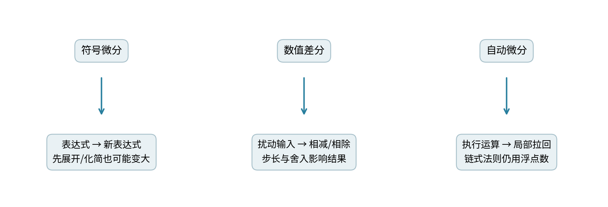

## 3 向量输出不能凭空拥有唯一“梯度”

对于$F:\mathbb R^n\to\mathbb R^m$，在某点x的雅可比为$J\in\mathbb R^{m\times n}$。它的元素$J_{ij}=\partial F_i/\partial x_j$。若给输入方向$t\in\mathbb R^n$，一阶输出变化为$Jt$，即JVP。

反向模式则先给输出一个权重向量$v\in\mathbb R^m$。定义局部标量目标$\ell=v^TF(x)$，在这次求导中把v当作固定种子，则：

$$\frac{\partial\ell}{\partial x_j}=\sum_{i=1}^m v_iJ_{ij},\qquad
\nabla_x\ell=J^Tv.$$

习惯上称它为VJP；若把上游量写成行向量，就是$v^TJ$。本课程使用列梯度，所以程序返回对应的$J^Tv$，没有改变数学含义。v并不是学习率，也不是自动从输出数值猜出来的标签。

### 3.1 一个可以全部手算的雅可比

取$F_1=x_1x_2,F_2=x_1+x_2^2$。在$(x_1,x_2)=(2,-1)$时，输出为$(-2,3)$，逐项求偏导得：

$$J=\begin{pmatrix}x_2&x_1\\1&2x_2\end{pmatrix}
=\begin{pmatrix}-1&2\\1&-2\end{pmatrix}.$$

给$v=(3,-1)^T$，反向结果是$(-4,8)^T$。给$t=(1/2,2)^T$，正向方向结果是$(3.5,-3.5)^T$。两边满足内积恒等式：

$$v^T(Jt)=(J^Tv)^Tt=14.$$

这个恒等式是有用的交叉检查，但若两边都调用同一个错误的J，仍可能一起错误。本实验的主测试同时采用独立数值差分构造小型完整雅可比，再与引擎VJP比较。

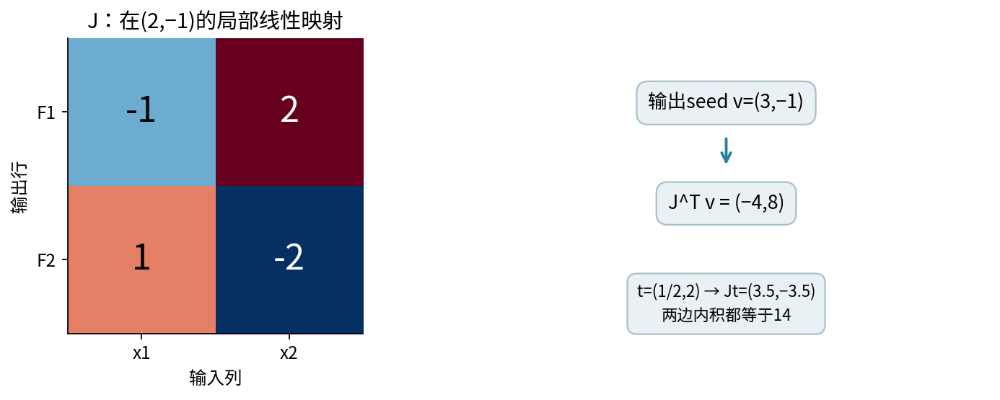

### 3.2 为什么反向模式不必保存完整J？

设$F=G\circ H$，则$J_F=J_GJ_H$。用列种子v从后往前传播：先算$u=J_G^Tv$，再算$J_H^Tu$，等于$(J_GJ_H)^Tv$。每个局部算子只需实现“输入一个上游向量，返回输入方向上的敏感度”，不必构造全局雅可比。

如果m=1000、n=100万，仅显式存储m×n个float64元素就约需8GB十进制字节，还没算图和激活。VJP省去这份完整矩阵，并不保证总内存很小：保存中间量、模型参数和反向临时量仍可能昂贵。这里是理论存储计数，不是运行基准。

## 4 广播的反向为什么是求和？

取$u\in\mathbb R^{2\times1}$、$v\in\mathbb R^{1\times3}$，前向定义$Z_{ij}=u_{i0}+v_{0j}$。广播只是让同一个输入坐标被多个输出位置使用，不是在数学上引入多个可独立调节的参数。

给上游$C\in\mathbb R^{2\times3}$，目标$\ell=\sum_{ij}C_{ij}Z_{ij}$。对$u_{i0}$求导，所有j位置都依赖它，所以：

$$\bar u_{i0}=\sum_j C_{ij},\qquad \bar v_{0j}=\sum_i C_{ij}.$$

若$C=\begin{pmatrix}1&2&3\\4&5&6\end{pmatrix}$，得到$\bar u=(6,15)^T$，shape为(2,1)；$\bar v=(5,7,9)$，shape为(1,3)。值和shape都必须正确。把u的梯度保存成(2,)会改变后续广播含义，即使这一步的数字看起来一样。

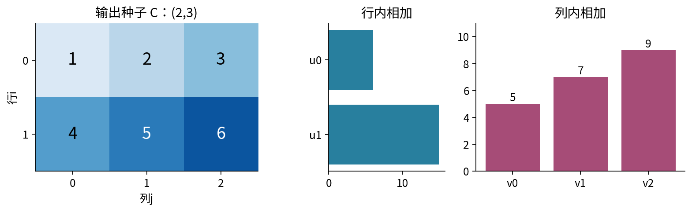

### 4.1 从二维推广到任意受支持轴

NumPy广播从右侧对齐形状；对应轴大小相同或其中一个为1才兼容，缺失的左侧轴按1处理。比如(2,1,3)与(1,4,1)得到(2,4,3)。反向时，A沿新增的axis1求和，B沿axis0和axis2求和，并保留原来的长度1轴。

通用sum_to_shape做两件事：先消去输入原来不存在的前导轴，再沿输入原本为1而输出扩展的轴求和，最后恢复精确原shape。不能简单把上游梯度reshape成输入形状，因为reshape不会把多条依赖贡献加起来。

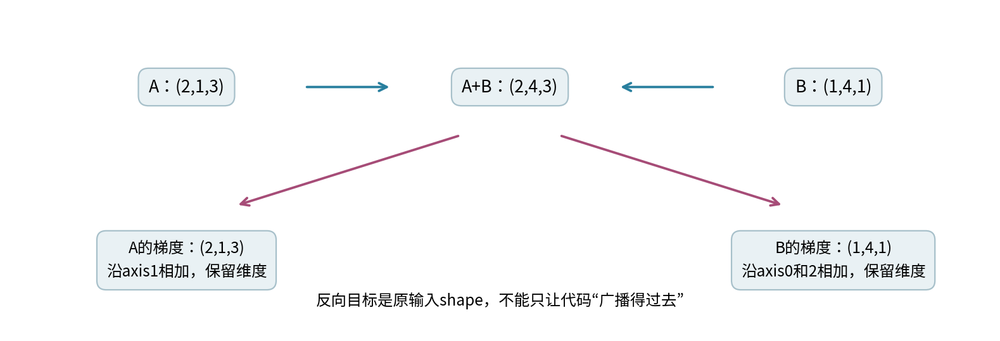

### 4.2 乘法和求和算子的局部拉回

对于$Z=A\odot B$，先逐元素得到临时贡献$G\odot B$和$G\odot A$，再分别sum_to_shape回A、B的原shape。这里$\odot$表示逐元素乘法，不是矩阵乘法。相同对象出现在两个输入位置时，两条边仍要保留，026的共享路径原则完全不变。

对于$Y=\operatorname{sum}(X,\text{axis}=k)$，前向合并了许多坐标，反向则把每个输出的上游量复制到被合并的输入位置。keepdims=False时先把被删除的轴插回为长度1，再广播回X；keepdims=True时这些轴已经保留。求和与广播互为这种线性映射意义下的转置操作，并不表示它们是互相逆运算。

## 5 一个小型引擎如何保存这些规则？

engine.py沿用026解释过的dataclass与运算符协议。Tensor保存一份自己拥有的只读float64数组，以及有序父边。每条边包含父节点和一个pullback函数；这个函数接收当前输出的上游数组，返回一个与父节点shape完全相同的数组。

类中的`__array_priority__`让左侧是NumPy数组时，把运算交给Tensor的反向运算符方法；它只控制调用分派，不产生导数。

与026每条边只保存一个标量局部偏导不同，这里某些局部雅可比包含复制、求和等结构。我们用可调用的函数表达它的转置作用，避免存稠密局部矩阵。例如乘法的一条边在概念上就是：

```python
sum_to_shape(upstream * saved_other_value, parent_shape)
```

实际代码用multiply和numeric辅助函数检查类型、有限性、范围以及一部分下溢。lambda只是“把一个短函数当作值保存”的Python语法；如lambda g: sum_to_shape(g, shape)表示接收g并返回后面的表达式。它在建图时创建，在反向时才被调用。闭包保存本次前向的父节点和局部量，不会自动跟踪下一轮参数。

### 5.1 保存快照与返回值的语义

创建Tensor时复制输入数组，因此以后修改原始NumPy数组不会悄悄改掉图。value属性返回另一个只读副本；即使调用者让这个副本可写再修改，也不会影响内部快照。这里的@property把一个只读访问方法写成node.value的外观，不是新增的求导功能。刻意改私有内部数组不属于支持用法。

反向仍先做拓扑排序，再沿反向顺序对所有父边贡献求和。vjp(root, seed)每次返回全新字典和数组，保持各节点原shape；不修改参数，也不自动进行跨调用梯度累计。只有真正shape为()的标量输出可以省略seed；shape为(1,)的单元素向量也要求显式种子。本API不允许seed自动广播，避免把目标标量化方式猜错。

### 5.2 实际能跑的共享节点例子

```python
from engine import Tensor, vjp
x = Tensor(2.0)
t = x * x
loss = t + t + x
print(float(loss.value), float(vjp(loss)[x]))
```

输出10和9。这里的加法、乘法与026同义，只是值变成可以带轴的数组。引擎没有矩阵乘法、索引求导、一般幂、GPU、混合精度、分布式或自动高阶图；这些限制使每个支持算子的契约更容易审计。

## 6 主实验：同一前向如何回答不同梯度问题？

默认配置为：

$$X=\begin{pmatrix}-1&1/2&1\\0&1&-1/2\end{pmatrix},\quad
w=(1/2,-1/4,3/4),\quad b=1/8.$$

X的shape为(2,3)，w为(3,)，b为()。定义$A=X\odot w+b$、$H=\tanh A$、$Z=H\odot H+H$，最后$L=\operatorname{sum}(Z)/6$。H被平方与直接加法重复使用。L只是一个平滑微分检查目标，不是监督分类损失；它甚至可能为负，因此不能把数值大小解释成预测误差。

前向可以手算$A=\begin{pmatrix}-3/8&0&7/8\\1/8&-1/8&-1/4\end{pmatrix}$，然后按元素取tanh。默认L约为0.1359075261。

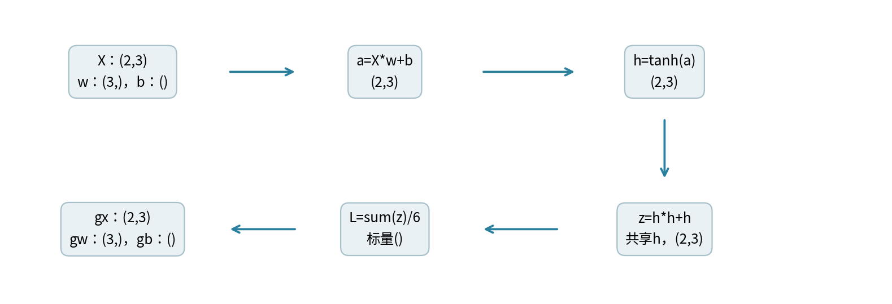

对均值目标，每个Z位置的上游量为1/6。令$Q_{ij}=\frac16(2H_{ij}+1)(1-H_{ij}^2)$，则

$$\bar X=Q\odot w,\quad \bar w_j=\sum_i Q_{ij}X_{ij},\quad
\bar b=\sum_{i,j}Q_{ij}.$$

独立的普通Python逐坐标循环给出$\bar w\approx(-0.04115095,0.20661271,0.16250020)$、$\bar b\approx0.81838672$。它不读取引擎的图或pullback，提供另一条计算路线。

再给非均匀种子$V=\begin{pmatrix}1&-2&1/2\\1/4&3/2&-1\end{pmatrix}$，对Z直接调用vjp。这次等价于$\ell=\sum V_{ij}Z_{ij}$，公式中的1/6改成对应V值，得到$\bar w\approx(-0.24690571,0.10951435,0.84717097)$、$\bar b\approx-0.20840060$。前向值没变，所求的标量化目标已经变了，所以梯度不应相同。

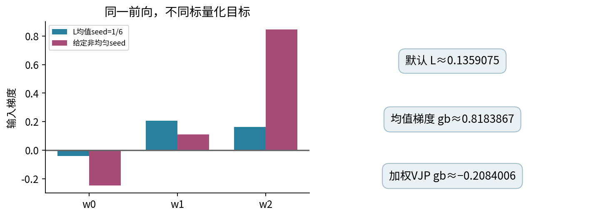

## 7 梯度检查要明确参照的函数

脚本对X的6个坐标、w的3个坐标和b的1个坐标逐一做中心差分，扫描$10^{-1}$至$10^{-9}$步长。差分调用纯NumPy表达式，不调用引擎反向循环；结果完整保存在finite_difference.csv，不只保存最好的一行。

测试另在40组固定随机种子的小输入上，构造6×10完整差分雅可比，核对$J^Tv$以及内积恒等式。这样的稠密J适用于十个输入坐标的诊断，不是建议在大型模型训练中显式构造完整J。

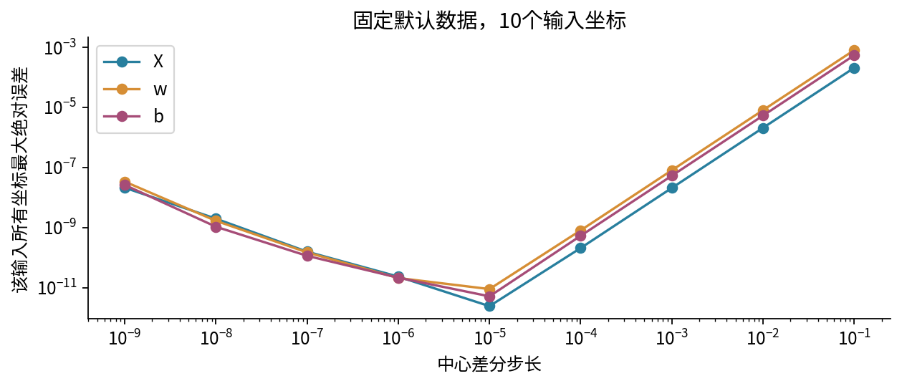

此外，360个广播图用精确Fraction逐输出索引累计贡献；14种按轴求和组合用独立索引映射核对；121个tanh点用100位Decimal局部导数作参照；49个多项式点检查一阶与手工重建后的二阶导数。测试覆盖的是声明支持的运算和范围，不等于整个自动微分领域都被验证。

## 8 不可微点：局部约定不一定能当作全局导数

026已经说明ReLU在0处没有普通导数，而本引擎约定传回0；对称差分会返回1/2。本讲再看一个更容易被忽视的复合例子：

$$f(x)=\operatorname{ReLU}(x)-\operatorname{ReLU}(-x).$$

对任意实数x，f(x)=x，因此它作为整体函数处处可微，导数恒为1。但在x=0处，两次ReLU都采用局部0规则，反向链式组合返回$0-0\cdot(-1)=0$。局部不可微规则组合，并不自动等于复合函数的普通导数，即使整体表达式恰好已经消掉尖点。

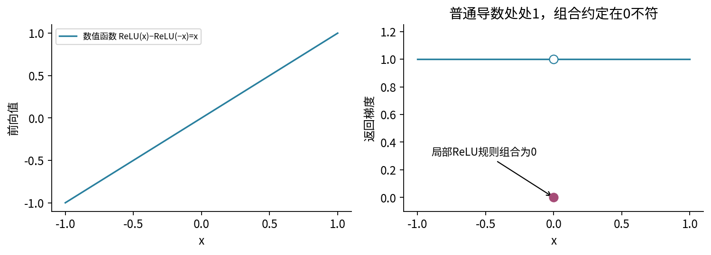

所以调试时必须明确：你要比较的是光滑点的真实导数、某个节点处的约定，还是化简后整体函数的导数。不要用一个词“梯度”把这些问题揉在一起。测试既要检查约定是否按文档执行，也要解释它在所研究模型中是否合适。

## 9 梯度屏障：相同的前向值可以带不同规则

令x=2，正常图$f=x^3$的值为8，导数为12。如果先计算a=x\*x，再执行a.detach()，得到同值4的新独立叶子；目标改写为detach(a)\*x，前向仍为8，但对原x只有最后一次乘法的直接依赖，引擎返回4。

这个4不是普通数值函数$x\mapsto x^3$的导数。它来自显式声明“这一条路径按常数处理”的自定义导数规则。梯度屏障可能是算法设计的一部分，也可能是不小心重新包装数组造成的错误；是否应该存在需要研究者决定。

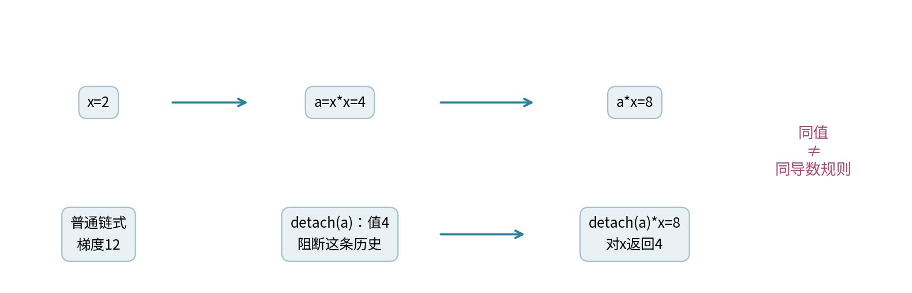

类似地，Python条件分支只记录这次实际执行的运算。若条件随输入改变，重跑可能得到另一张图；局部反向不会替你对离散分支选择求通常意义的导数。在分支边界应单独分析函数，而不是假设所有程序语句都可微。

## 10 高阶导数需要什么额外结构？

回到$f(x)=\frac12(x^2+x)^2$。前面已经得到$f'=(x^2+x)(2x+1)$。再用乘法法则：

$$f''=(2x+1)^2+2(x^2+x)=6x^2+6x+1.$$

在x=1/2处，$f'=1.5,f''=5.5$。本引擎的vjp返回普通NumPy数值数组，里面没有“这个梯度如何依赖x”的图。因此不能把返回数组再传进vjp，就声称在做自动二阶求导。

我们可以手工把已推导的$f'$重新写成Tensor运算，再对它做一次一阶VJP，得到5.5。这个实验验证了二阶公式，但重建导数表达式是人工完成的。成熟框架可以在求导时保留或构造导数计算图；这和仅保留原前向图用于再次求同一个一阶导数，是不同功能。

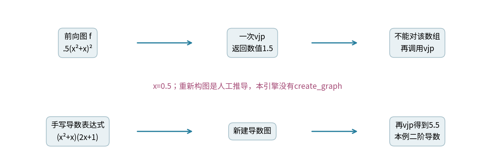

在多参数情况下，海森矩阵Hessian记录二阶偏导：$H_{ij}=\partial^2 f/(\partial\theta_i\partial\theta_j)$，其中θ是参数向量；矩阵shape为参数数目×参数数目。研究中常只需要Hessian与方向的乘积，不必保存整个矩阵。这里介绍概念与标量实算，完整高阶算子实现不在本单元引擎范围。

## 11 图生命周期与三种累计

一次前向确定当前数值与被执行的路径；局部反向可能需要保存输入、激活或局部斜率。只要仍持有输出节点，父边就使所需历史保持可达。本引擎用Python对象引用保存图，没有自动释放后禁止再次反传的框架语义；当没有对象再引用这张图时，才可由运行时回收。

参数更新后应创建新叶子并重新前向，而不是期待旧图随外部数组一起变化。我们通过复制与只读访问减少意外原地更改；这不能替代所有框架的版本计数、视图别名或内存管理机制。

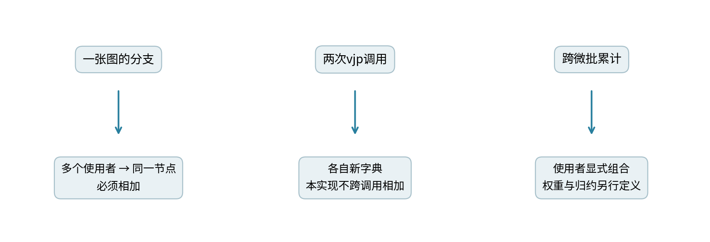

第一种累计是在同一张图内收集多个使用者的贡献，必须相加。第二种是反复调用求导API：本实现返回新字典，不跨调用累加。第三种是使用者组合多次微批梯度：必须按027推导的样本数与损失归约方式明确加权，不能把三个场景当成同一个“清梯度”问题。

## 12 运行合同与研究责任

engine.py接受有限实数标量或非空数组，转为float64；最多4个轴、100000个坐标，数值绝对值最多$10^{100}$，图最多10000节点。拒绝bool、复数、字符串、对象数组、错shape、非有限数和非零输入转float64后变0；逐元素非零乘积下溢为0也会拒绝。一般加法舍入、抵消和小量被大数吸收仍可能发生。

tanh输入绝对值最多100。sum轴必须有效、不能重复；seed与输出shape严格相同。配置只允许指定形状的X、w、b和seed，绝对值不超过3，JSON解析先检查极小文本转零。若调用前数值已经丢失，接口无法恢复原始信息。

脚本先验证所有输入、完成计算与序列化，再写五份文件；输入或计算错误保留旧结果，不创建新结果目录。有效运行会覆盖同名结果，不承诺操作系统多文件写故障时原子回滚。固定图和Notebook先检查默认配置及五结果摘要，自定义实验应另存配置和输出，避免旧图文套新结果。

实际执行使用Python3.12.14与NumPy2.3.5，新进程脚本和真实InProcessKernel逐格Notebook已对齐。Anaconda新安装、浏览器Jupyter、外部socket内核、跨平台和GPU未测试；JAX与PyTorch这里只查文档，没有执行。源文件、完整实验和详解随本单元提供。

一手资料：实际查阅了[NumPy广播规则](https://numpy.org/doc/stable/user/basics.broadcasting.html)、[JAX VJP接口](https://docs.jax.dev/en/latest/_autosummary/jax.vjp.html)、[PyTorch autograd.grad](https://docs.pytorch.org/docs/2.14/generated/torch.autograd.grad.html)中的种子、返回与高阶图参数，以及[JAX stop_gradient](https://docs.jax.dev/en/latest/_autosummary/jax.lax.stop_gradient.html)的导数屏障语义。例题、推导、图与代码为本课程独立编写，接口边界按实际代码另行定义。

<div style="break-before:page;"></div>

## 13 练习

1. 对$f=(x^2+x)^2/2$分别用展开与复合两种路线求一阶、二阶导数。
2. 主文二维F的J、$J^Tv$、Jt分别是什么shape？重算数值与内积14。
3. 对向量输出传全1种子，得到完整J还是各输出之和的梯度？
4. 广播手算例中，把C第二行换成全0，u和v梯度怎样改变？
5. (2,1,3)与(1,4,1)相加时，分别说明两个输入的梯度归约轴。
6. 为什么sum_to_shape不能用reshape替代？用6和15举例。
7. keepdims=False与True的求和，反向时有什么差别？
8. 主图中H被使用几次？说明$(2H+1)$为何包含三条输入位置贡献。
9. 对默认X第1行第2列的a=0，手算均值目标对该X坐标的梯度。
10. seed变化为什么可能使b梯度符号翻转？这能说明模型变坏吗？
11. 解释ReLU(x)−ReLU(−x)在0处的反向结果与整体导数差异。
12. 解释detach(x\*x)\*x在x=2处的前向值、引擎返回值及真实x³导数。
13. 本引擎怎样得到5.5？为什么这不能宣传为自动二阶求导？
14. 重复调用vjp与在一张图中共享节点，为什么应有不同累计语义？
15. 如果有限差分通过了，列出至少三个仍未被验证的研究结论。

答案在answers.pdf。029将在保留这些检查习惯的前提下进入真正的PyTorch张量与autograd接口。
