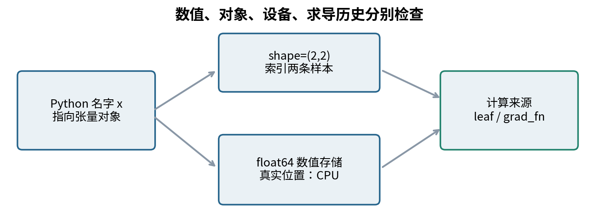
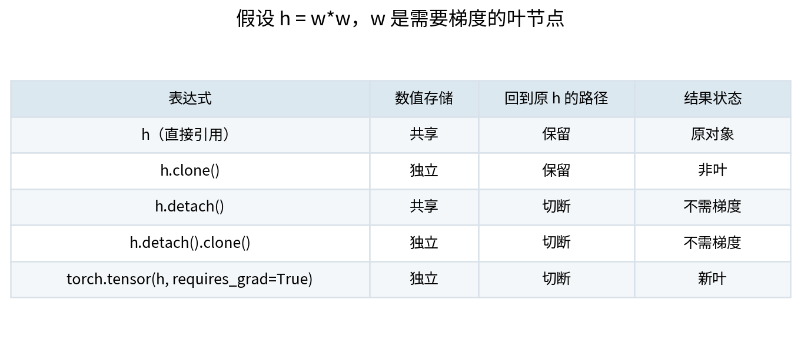
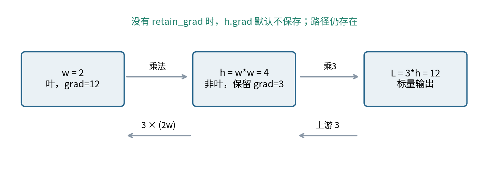
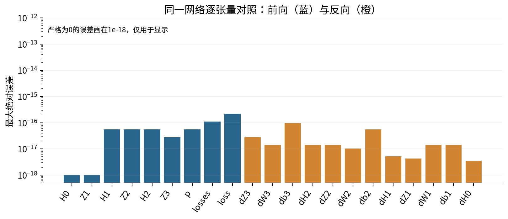
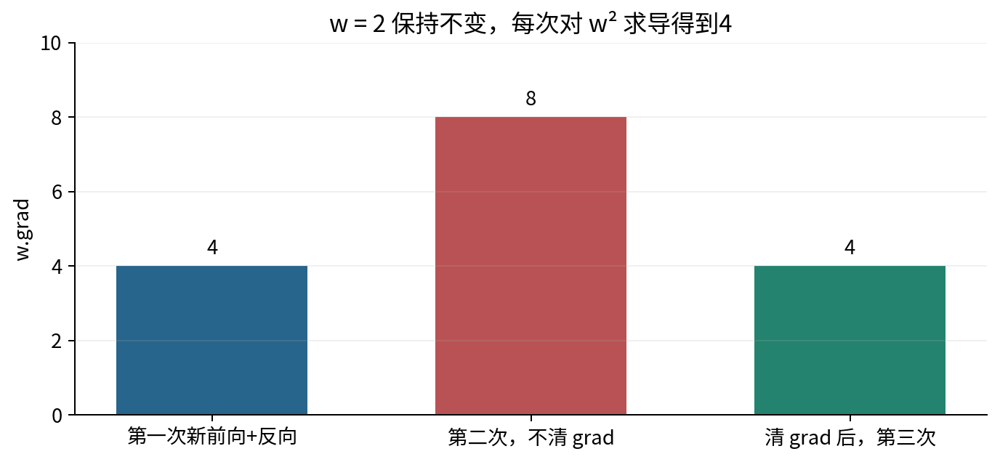
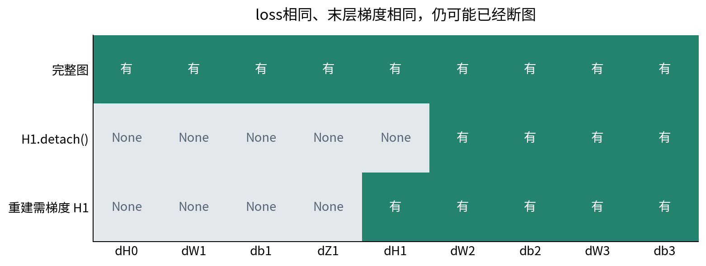
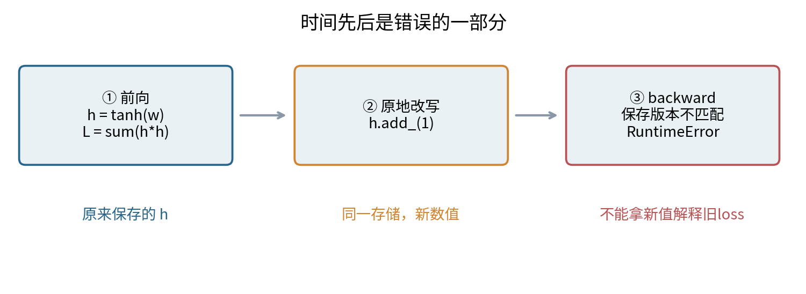
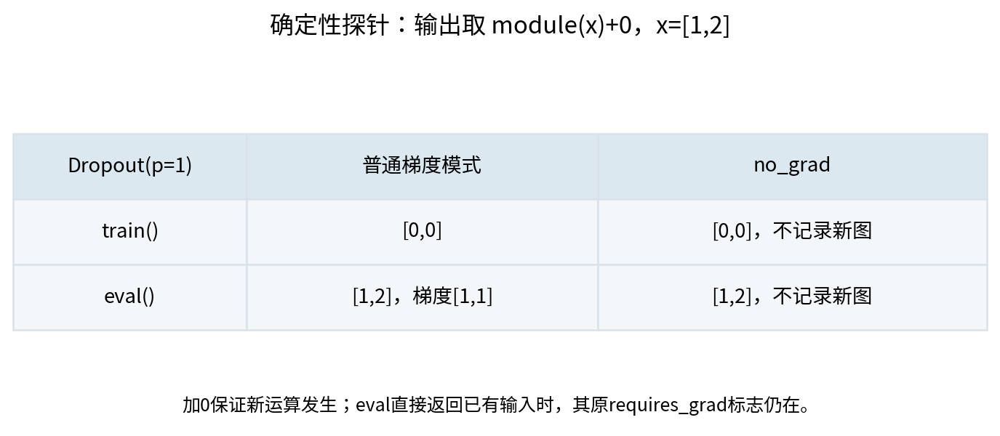

# 029 PyTorch张量与autograd

怎样把已经理解的计算迁移到框架并保留检查能力

本讲把027的同一批数据、同一组参数、同一个损失搬到PyTorch。目标不是少写几行代码，而是知道自动求导究竟沿哪些边传播、把结果放在哪里，以及怎样证明迁移没有改变数学问题。你将看到一种危险情况：损失完全正确，最后一层也有梯度，第一层却已经停止学习。

先修004的数组与广播、014的浮点数与稳定数值计算、028的计算图与向量雅可比积。027的实验在028之前已经出现；这里重述必要的层公式，并提供独立NumPy参照，不要求跨目录导入。全部案例为CPU上的小型合成机制实验；不需要显卡、模型下载或付费API。

## 1 一个张量需要回答四类问题

`torch.Tensor`同时承担数值容器和计算图节点的角色。先分开四个问题：里面有多少个数、如何解释这些位、数存在哪里、数来自哪些计算。`shape`给出各轴长度；`dtype`给出浮点或整数表示；`device`给出CPU或某个加速设备；`requires_grad`、`is_leaf`、`grad_fn`说明反向图的记录状态。Python变量名只是对象的引用，并不是独立的数值副本。



```python
import torch
x = torch.tensor([[1., 2.], [-1., 1.]],
                 dtype=torch.float64, device="cpu",
                 requires_grad=True)
print(x.shape, x.dtype, x.device)
print(x.requires_grad, x.is_leaf, x.grad_fn)
```

形状是`(2, 2)`；这里第一轴是样本，第二轴是特征。`float64`表示64位浮点数，不表示“64位精确实数”。`cpu`是本讲明确选择的设备。输入需要梯度是为了检验输入敏感度，不意味着通常必须优化训练数据。类别标签保存为`int64`，不对离散类别编号求导。

不要依赖环境的默认dtype。由Python浮点列表构造张量通常采用默认浮点dtype；`from_numpy`则继承受支持的数组dtype。显式写出dtype可避免一份参数是float32，另一份输入是float64。矩阵乘法不会替你决定哪一种精度才是实验意图；本讲实际制造混合dtype错误并检查异常。实数整数张量不能设置`requires_grad=True`，因为整数编号不是本讲求导的连续变量。

`.to(dtype=..., device=...)`返回适合目标的张量；若类型与设备已经相同且没有要求复制，可能直接返回原对象。因此`y=x.to(...)`既不保证复制，也不保证得到叶张量。本讲全部在CPU，跨设备运算和设备搬运没有实测。未来迁移到GPU时应一起检查输入、标签、参数和新建常量的设备，而不是认为`.to`会修改所有相关对象。

## 2 拷贝数值与保留历史是两个选择

设`h=w*w`。下面四种操作的数值起初都等于`h`，但后续行为不同。`clone()`分配独立存储，同时保留从克隆值回到`h`的求导路径；`detach()`切断这条历史，却共享存储。`detach().clone()`两者都隔离。`torch.tensor(h)`重新构造一个没有原历史的张量，其效果对应“分离后复制”，不是把原节点换一种写法。



```python
w = torch.tensor(2., dtype=torch.float64, requires_grad=True)
h = w * w
loss = h.clone() * w        # 完整路径，导数为12
# loss = h.detach() * w     # 只保留最后一条路径，导数为4
loss.backward()
```

这里的完整函数为$f(w)=w^3$，$f'(2)=12$。使用`detach`后，前向仍得到8，但反向把中间的$w^2$当作常量4，只沿最后一次乘法返回4。它是刻意指定的局部求导规则，不是证明普通函数$w^3$的导数变成4。若本来就要阻止某条梯度路径，分离有用；若只是想“转换类型”，它就可能悄悄改变实验。

`torch.from_numpy(a)`和受支持的NumPy数组共享CPU存储。把NumPy数值接入PyTorch，并不能让此前的NumPy计算自动成为PyTorch图。更隐蔽的是外部写入：先用$a=2$计算$t^2=4$，再通过NumPy把共享数组改成3，保存用于反向的值可能被改写而没有PyTorch版本检查。本讲隔离探针观察到梯度6，已不对应原前向点2的梯度4。这个探针只说明该运行环境中的危险，不是推荐利用的行为。

安全边界很具体：参与待执行反向的存储，在前向和反向之间不要由任何别名修改。本讲模型输入用`torch.tensor(a, ...)`复制；记录结果时用`tensor.detach().cpu().numpy().copy()`，把日志变为独立快照。`detach().numpy()`本身仍可能与原CPU张量共享数值。

## 3 叶节点不是“只有参数才算”

在通常记录梯度的模式下，用户直接创建且需要梯度的张量是叶节点，`grad_fn`为`None`；由可微运算生成的张量通常是非叶节点，`grad_fn`描述其生成运算。不需要梯度的张量按约定也被视为叶节点。因此不能只看`is_leaf`判断它是否可训练，更不能把“叶”理解为“网络第一层”。



```python
w = torch.tensor(2., dtype=torch.float64, requires_grad=True)
h = w * w
h.retain_grad()
loss = 3 * h
loss.backward()
print(w.grad, h.grad)       # 12和3
```

链式法则是$dL/dw=(dL/dh)(dh/dw)=3(2w)=12$。如果不调用`h.retain_grad()`，`h.grad`默认不会保存这份3，但反向仍然需要并使用它。看到非叶节点`.grad is None`，不能立即断言图断了。诊断需要一起检查`requires_grad`、`grad_fn`、是否执行过反向、是否请求保留中间梯度，以及节点是否真正通向损失。

另一个常见误会是先创建float64叶节点，再把它转换成float32：若转换被记录，新张量是非叶节点，梯度继续回到原float64叶。若想直接得到目标类型的叶，应在构造时选定dtype；若确实想重新开始一段图，可显式`detach().clone().requires_grad_(True)`，并接受旧路径不再连通。

## 4 先手算一个能检查全部梯度的批量层

使用两条样本、两个输入和两个输出，所有量均为无单位教学数。行样本约定下，$X\in\mathbb R^{2\times2}$，$W\in\mathbb R^{2\times2}$，$b\in\mathbb R^2$。令$Z=XW+b$，偏置广播到每一行，选择平方损失而不是分类损失，方便完整手算：

$$X=\begin{bmatrix}1&2\\-1&1\end{bmatrix},\quad W=\begin{bmatrix}1&0\\0&1\end{bmatrix},\quad b=\begin{bmatrix}1/2&-1/2\end{bmatrix}.$$

$$Z=\begin{bmatrix}3/2&3/2\\-1/2&1/2\end{bmatrix},\qquad L=\frac{1}{2n}\sum_{i=1}^{n}\sum_{j=1}^{2} Z_{ij}^2=\frac54,\quad n=2.$$

注意分母是$2n$，不是$2n$再乘输出宽度。若代码写`0.5*z.square().mean()`，会对四个元素求均值，得到$5/8$，所有梯度也少一半。正确代码为`0.5*z.square().sum()/len(x)`。

对一个元素，$\partial L/\partial Z_{ij}=Z_{ij}/n$，故上游梯度$G=Z/2$。从$Z_{ij}=\sum_k X_{ik}W_{kj}+b_j$出发，固定$W_{kj}$会影响每一行同一个输出$j$，因此必须把这些路径相加：

$$\frac{\partial L}{\partial W_{kj}}=\sum_i G_{ij}X_{ik},\qquad \frac{\partial L}{\partial b_j}=\sum_i G_{ij},\qquad \frac{\partial L}{\partial X_{ik}}=\sum_jG_{ij}W_{kj}.$$

矩阵形式是$dW=X^\mathsf{T}G$，$db=\operatorname{sum}_{i}G$，$dX=GW^\mathsf{T}$。每个结果的形状分别与$W,b,X$相同。偏置的求和是广播的伴随；损失中的$1/n$已经进入$G$，这里不能再次平均。

$$G=\begin{bmatrix}3/4&3/4\\-1/4&1/4\end{bmatrix},\quad dW=\begin{bmatrix}1&1/2\\5/4&7/4\end{bmatrix},\quad db=\begin{bmatrix}1/2&1\end{bmatrix},\quad dX=G.$$

例如$dW_{21}=2(3/4)+1(-1/4)=5/4$；$db_2=3/4+1/4=1$。本讲测试既核对这些分数，也用100个整数输入的小层，经独立有理数循环检查参数和输入梯度。这样，框架一致性不是仅靠两段可能犯同样错误的矩阵代码。

## 5 把027迁移时保持数学对象不变

固定实验为5条样本、2个输入、两层隐藏表示（宽3和2）、3个输出类别，26个参数。配置和CSV与027相同；隐藏激活为tanh，最后一层输出原始logits，没有最后的tanh或softmax。对第$l$层：

$$H_0=X,\quad Z_l=H_{l-1}W_l+b_l,\quad H_l=\tanh(Z_l)\ (l=1,2),\quad S=Z_3.$$

形状顺序为$H_0:(5,2)$，$Z_1,H_1:(5,3)$，$Z_2,H_2:(5,2)$，$Z_3:(5,3)$。权重存储采用“输入宽度×输出宽度”，所以写`H @ W`。后续学习`nn.Linear`时应注意它的weight是“输出宽度×输入宽度”，计算含转置；直接复制一个同形状矩阵不一定是同一个函数。

标签$y\in\{0,1,2\}^5$为整型向量。令$p_{ic}=\exp(S_{ic})/\sum_k\exp(S_{ik})$，本讲损失为未加权、无忽略标签、无平滑的均值交叉熵：
{: style="break-after: avoid;"}

$$L=-\frac15\sum_{i=1}^{5}\log p_{i,y_i},\qquad \Delta_3=\frac{P-Y}{5}.$$

$Y$只是推导使用的one-hot矩阵；代码给`cross_entropy`的是类别编号与logits。提前softmax会改成另一个计算图。对于本讲的无权重无忽略情形，`reduction="mean"`才等于除以5；带类别权重或忽略标签时，默认均值的分母可能改变，不能机械沿用这里的微批量权重。

```python
logits = h2 @ W3 + b3
loss = torch.nn.functional.cross_entropy(logits, y,
                                         reduction="mean")
loss.backward()
```

反向检查逐层递推：$dW_l=H_{l-1}^\mathsf{T}\Delta_l$，$db_l=\sum_i\Delta_{l,i:}$，$dH_{l-1}=\Delta_lW_l^\mathsf{T}$；对于tanh隐藏层，$\Delta_{l-1}=dH_{l-1}\odot(1-H_{l-1}^2)$。这里$\odot$是逐元素乘法，不能换成矩阵乘法。输入梯度就是$dH_0$。

### 先比较哪里才能找到第一处分歧

`comparisons.csv`逐坐标比较所有$H,Z$、概率、逐样本损失、均值损失、所有$dH,dZ,dW,db$。先检查前向，再从输出向输入检查反向。若$Z_2$就不同，通常先查数据、转置和广播；若前向一致、$dZ_3$正好相差5倍，先查reduction；若$dZ_2$一致而$db_2$不同，先查求和轴。只比较最终loss无法区分这些错误。



固定批次的均值损失约为1.1489788656；学习率0.1的一次普通梯度更新后约为1.1413798716。这只说明这个点的一次更新降低该批损失。它不证明一般收敛，也不说明未见数据上的效果。独立Python标量循环只计算前向损失，再对26个参数与10个输入坐标做中心差分，补充检查反向图。差分有截断误差和舍入误差；ReLU拐点不能用光滑点的差分判据强行验收。

## 6 梯度缓冲区和计算图有不同的寿命

对叶节点调用`backward()`通常把新梯度加到已有`.grad`中。考虑每次都重新计算$L(w)=w^2$，但参数固定为2：第一次`.grad=4`，第二次未清除便得到8。这不是导数从4变成8，而是两份梯度被累加。设$g^{(k)}$是第$k$次反向得到的梯度，缓冲区满足$B\leftarrow B+g^{(k)}$。



```python
w = torch.tensor(2., dtype=torch.float64, requires_grad=True)
(w*w).backward()            # 4
(w*w).backward()            # 8，新前向但同一个w.grad
w.grad = None
(w*w).backward()            # 4
```

这些是三次不同的前向图。如果保存`loss=w*w`，先`loss.backward()`，再对同一个loss重复反向，反向所需缓存通常已经释放，会报错。`retain_graph=True`保留反向所需图数据，不会清空`.grad`；`retain_grad()`保存某个中间节点的梯度，也不等于保留整张图。这三个操作名称相近，作用不同。

“通常释放”不意味着每一个最简单图的第二次反向必定报错；不需保存中间量的运算可能侥幸可重复。实验专门选择需要保存输入的平方，让错误稳定显现。训练中通常重新前向更清楚，不应把`retain_graph=True`当成所有错误的修补按钮。

### 梯度累加也可以是有意的

把5条样本分成2条和3条，在同一参数点计算均值损失$L_A,L_B$。完整批次目标是$L=(2/5)L_A+(3/5)L_B$，因此逐次调用`(loss_A*2/5).backward()`、`(loss_B*3/5).backward()`可以正确累加。不加权地平均两个微批均值会给前两条样本每条$1/4$的权重，后三条每条$1/6$，已经改变目标。

本讲比较所有参数梯度：正确加权与完整批次只差浮点舍入；错误等权方式的最大差异约0.0330774。两次反向之间不能更新参数，否则两份梯度不再是在同一个参数点求出的完整批次梯度。加入随机模块、批统计操作或额外正则化后还需重新分析，不能把这个简单tanh网络的等价性直接推广到所有模型。

## 7 让损失不变的断图错误

在第一隐藏表示$H_1$后加`.detach()`，前向数值没有变化，第二层和第三层仍然能对其参数求导。所以程序能完成`loss.backward()`，最后一层梯度也正常，但$W_1,b_1,X$不再通向loss。给重建的`torch.tensor(H1, requires_grad=True)`设置新梯度标志也只能产生一个新叶节点，不能追回旧历史。



定位顺序应当是：确认期望学习的叶参数；从loss向前检查各节点是否需要梯度；对关键中间量使用`retain_grad()`或明确请求`autograd.grad`；找到第一条历史消失的边；核对这里是否确实有意冻结。不要把缺失梯度替换成零来让训练循环“跑通”。零可能是有效的导数值，None则可能表示未连接、未反向、已清空，或非叶默认未保留，必须保留区别。

本讲断图探针记录：损失差为0，最后一层权重梯度差为0，第一层权重和输入梯度为None。修复是直接把`H1`用于下一层；若只是需要副本，用`H1.clone()`。若只是保存日志，把分离副本放入日志变量，不能把它重新作为下一层输入。

## 8 原地修改为何会破坏反向

`add_`、`mul_`等带下划线的方法通常原地修改存储。赋值`x=x+1`则给名字绑定一个新结果；原地操作改变的是旧对象可见的数值，包括共享存储的别名。Python中的`+=`在张量上也可能走原地路径，应当谨慎区分。

第一类错误很早出现：需要梯度的叶张量直接`w.add_(1)`，通常在操作处就被拒绝。第二类错误更晚：某次前向已经保存了反向需要的张量，然后你把它改了，直到backward才发现保存版本与当前版本不一致。



```python
w = torch.tensor([0.5], dtype=torch.float64, requires_grad=True)
h = torch.tanh(w)
loss = (h*h).sum()
h.add_(1)
loss.backward()            # 故意触发保存张量被修改的错误
```

平方需要原来的$h$计算$2h$，tanh也可能需要保存的输出计算$1-h^2$。错误说明计算历史与存储状态不再匹配；它并不说明`add_`的数学导数本身无法计算。修复为`new_h=h+1`并明确loss应使用哪个变量，或在前向开始前准备好输入，而不是在旧图上继续修改。

`h.detach().add_(1)`仍然改了共享存储；`with torch.no_grad(): w.add_(1)`只是停止记录新的运算，不能保证已存在的图安全。因此本讲也实际验证“no_grad下先改参数、再对旧loss反向”会报错。不要用`.data`绕过保护。

普通SGD的安全顺序是：清除旧梯度；完成当前前向；反向；在`no_grad`中更新参数；下一轮重新前向。更新公式$\theta\leftarrow\theta-\eta\,g$是算法步骤，通常不需要成为下一轮求导历史的一部分。本讲只演示普通一阶更新；若要对优化过程本身求导，需要另行设计可微更新，不能直接套用这个截断历史的训练循环。

## 9 eval与no_grad控制不同事情

`module.eval()`改变模块的训练模式标志。只有定义了训练/评估分支的模块才会改变数值行为，例如Dropout或BatchNorm；它不是自动关闭梯度的开关。本讲暂不展开这些模型的统计解释，只用一个`Dropout(p=1)`展示模式差别：训练模式把输入变成0，评估模式保持输入，而评估结果仍然可以对输入求导。选择$p=1$只是为了使演示完全确定，不是推荐的训练配置。



```python
module.eval()
with torch.no_grad():
    predictions = module(x) + 0
```

这里加0是为了让身份映射式模块也真正执行一次新运算。单独的Dropout在eval下可能直接返回已有输入，此时即使处于no_grad，返回对象原来的requires_grad仍可为True；这不表示新运算被记录。

这种组合常用于不需要梯度的评估，但研究者也会在eval模式下计算输入梯度，例如敏感度分析，此时不应包`no_grad`。`no_grad`不把已有参数的`requires_grad`永久改成False，也不会自动清空旧`.grad`。退出上下文后可继续记录新运算。

还有一个应当知道的例外：在`no_grad`中调用带`requires_grad`参数的工厂函数，仍可显式创建需要梯度的新叶张量。该模式主要讨论反向模式AD，不等价于关闭所有形式的自动微分。本讲不把`inference_mode`与`no_grad`混用，前者还有不同的张量使用限制，应在了解用途后另行阅读文档。

## 10 返回梯度以及继续对梯度求导

`.backward()`适合把结果累加到叶的缓冲区；`torch.autograd.grad`返回指定输入的梯度元组，默认不把结果累加到这些输入的`.grad`。它便于明确列出“我要对谁求导”，但同样需要正确图、正确seed和合适的图寿命。

设$u(w)=(w_1^2,w_2^2)$，$w=(1,2)$，上游种子$v=(3,-1)$。我们要求的不是一个没有定义方向的“向量导数”，而是标量$v^\mathsf{T}u$对$w$的梯度：

$$J_u(w)=\begin{bmatrix}2w_1&0\\0&2w_2\end{bmatrix},\qquad J_u(w)^\mathsf{T}v=(6,-4).$$

```python
w = torch.tensor([1., 2.], dtype=torch.float64, requires_grad=True)
u = w*w
v = torch.tensor([3., -1.], dtype=torch.float64)
(g,) = torch.autograd.grad(u, w, grad_outputs=v)
```

多元素输出不提供seed就调用backward会报错。对逐样本loss，均值对应每个分量seed为$1/n$，求和对应全1；这些选择改变标量目标。这里的seed是固定向量；若seed本身依赖参数，想求完整$v(w)^\mathsf{T}u(w)$的导数，应把这个标量表达式明确放进图，而不能忽略乘积法则的另一项。

028的教学引擎返回数值数组，不会自动建立高阶导数图。PyTorch提供`create_graph=True`，让计算一阶导数的过程也可被记录。仍用028的多项式：

$$f(w)=\tfrac12(w^2+w)^2,\quad f'(w)=(w^2+w)(2w+1),\quad f''(w)=6w^2+6w+1.$$

在$w=1/2$，一阶为$3/2$，二阶为$11/2$。先`g=autograd.grad(f,w,create_graph=True)[0]`，再`autograd.grad(g,w)`得到二阶导数。`retain_graph`保留已有缓存，`create_graph`记录求导计算，两者不是同义词。某个导数恰为常量时即使要求建图也可能没有可继续求导的依赖；不可微点和不支持高阶导数的运算也不会因为这个选项自动变得光滑。

## 11 精度检查与研究边界

本讲优先用float64核对数学，再展示float32与它的差异。绝对误差$|a-b|$适合接近零的量；相对误差在分母接近零时不稳定。逐坐标验收使用混合阈值：$|a-b|\leq2\times10^{-12}+2\times10^{-10}\max(|a|,|b|)$，只用于本讲温和范围的float64迁移，不是所有神经网络的统一阈值。

NumPy参照特意保留接近正确分类时的小概率补量，框架交叉熵可能采用另一条数值等价路径。极端logits、不同reduction顺序、不同库或硬件可能产生舍入差异。本讲没有宣称逐位一致；也不把“torch与numpy接近”当成定义正确的充分证据，所以另外保留分数手算、标量差分和故意失败探针。

独立测试域限制为有限实数、输入和参数绝对值不超过10、批量1至128、1至5层、每层宽度不超过16、至少2个输出类别。运行报告入口只接受固定教学输入的原始字节，修改会先失败且不生成新结果；探索新模型应通过函数并保存到新位置。浮点计算仍可能下溢；调用前已经丢掉的信息无法恢复。参考函数不承担任意规模、任意精度或生产级稳定性保证。

你可以据本讲形成一份迁移证据链：同一输入与目标；同一参数布局；逐层前向一致；逐层反向一致；独立标量差分；错误探针确实能被发现；清空内核后重跑。它证明的是这份实现及被测试范围中的对应关系。数据采样是否合理、任务是否定义正确、实验是否泄漏、模型是否泛化，仍然需要后续研究证据。

<div style="break-before: page;"></div>

## 练习

1. 不运行代码，复算第4节的$L,dW,db,dX$；再求错误写法`0.5*z.square().mean()`的结果。
2. 对`h=w*w`比较直接使用、clone、detach、重新构造tensor后的`h*w`。在$w=2$，分别列出前向值、$w$梯度及新叶节点是否产生。
3. 用$u=(w_1^2,w_2^2)$手算三种seed $(1,1)$、$(1/2,1/2)$、$(3,-1)$的VJP。解释它们各自代表什么标量目标。
4. 两次前向、同一个叶节点、参数不变，为什么第二次梯度翻倍？为什么保留图不能代替清梯度？写出2加3微批量的正确比例。
5. 把027迁移结果中的第一层梯度全部变成None，但保持loss和第三层梯度不变。说明怎样定位和修复，不能只给出“去掉detach”。
6. 解释叶张量原地错误、保存张量版本错误和NumPy别名静默改写三者的发生时点与修复方式。
7. 设计eval与no_grad的四种组合，预测Dropout探针的值和可求导性。指出“没有梯度”与“参数被冻结”为什么不等价。
8. 求第10节多项式在$w=-1$的一阶、二阶导数，并说明`create_graph`与`retain_graph`的区别。列出一次成功梯度检查不能证明的三件事。

完整推导与可运行检查在单独的实验指南和答案中；官方来源与本地验证范围见`sources.md`与`verification.json`。
