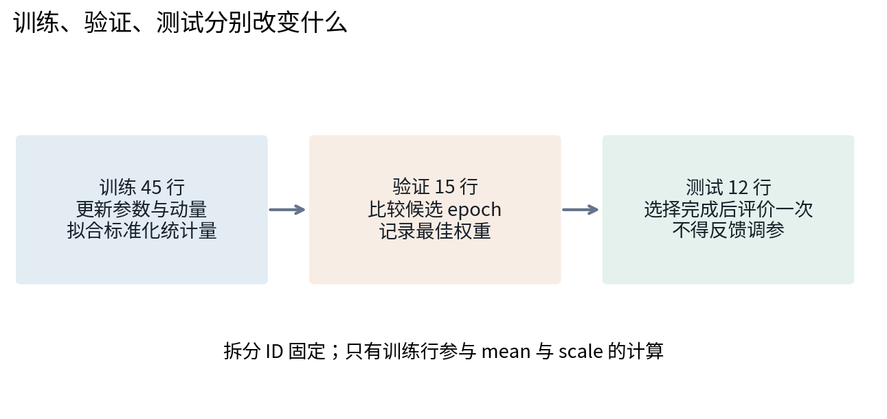
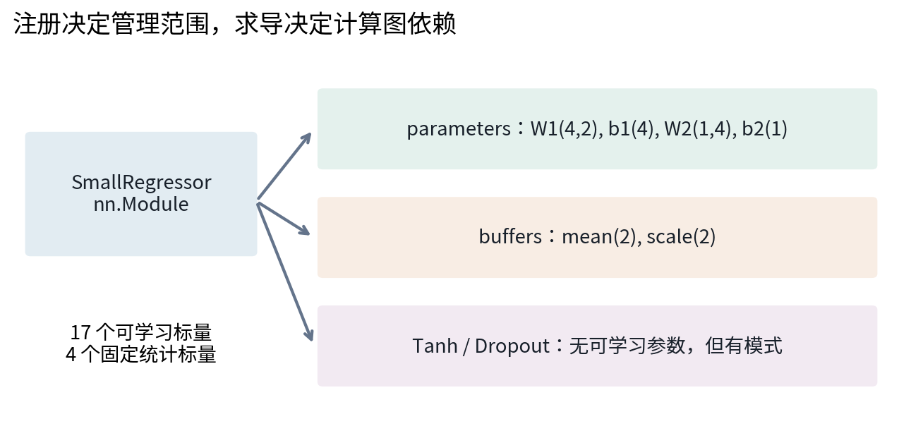
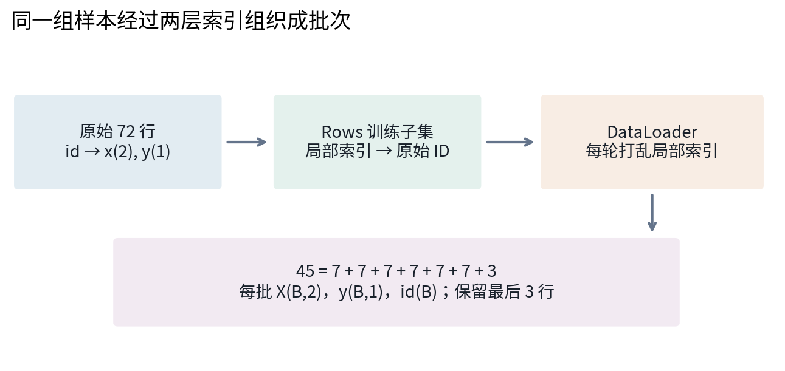
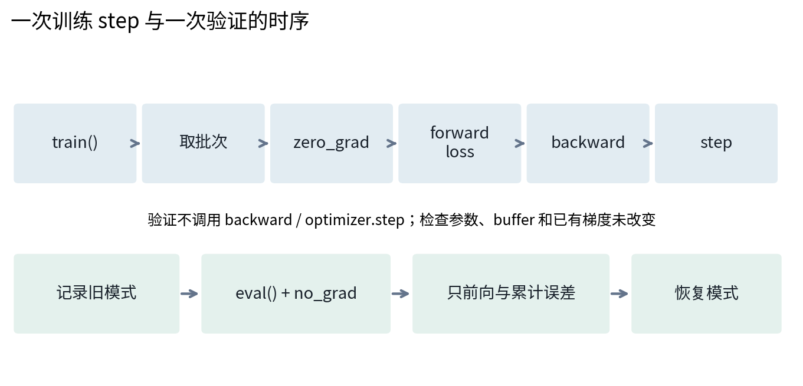
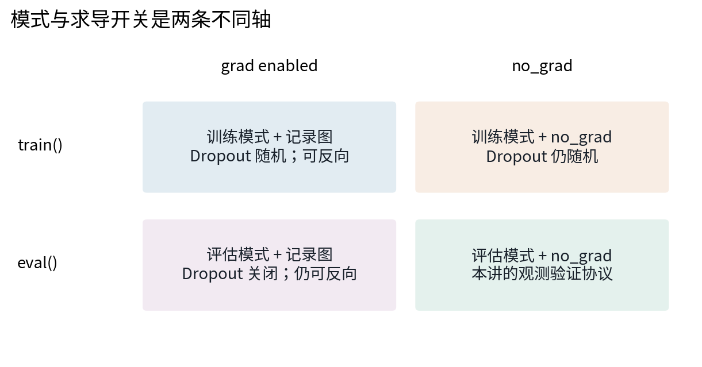
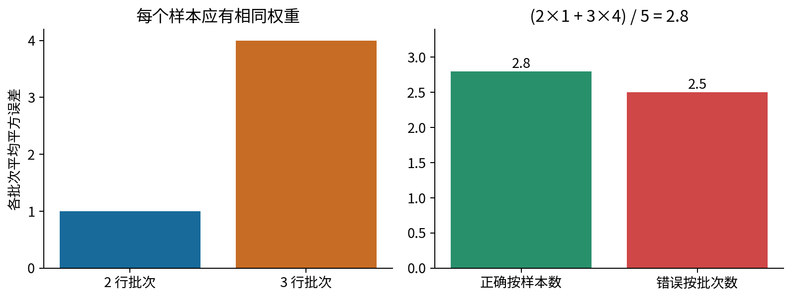
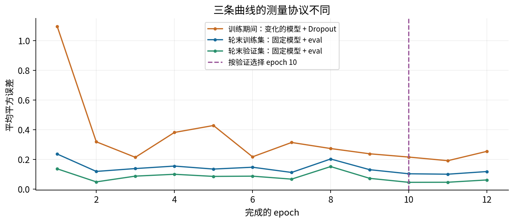
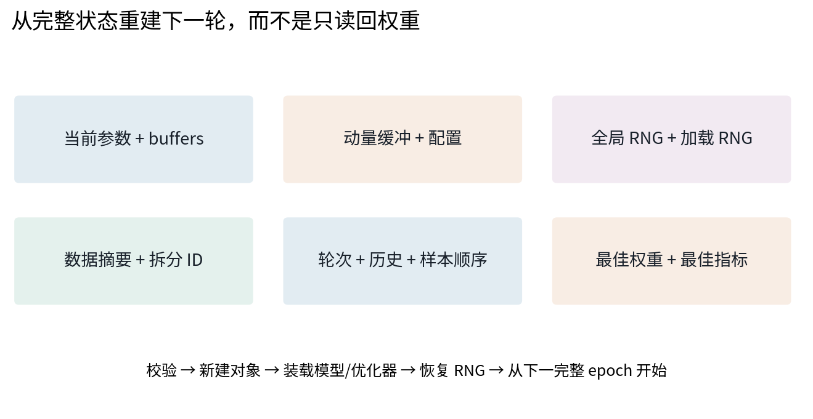
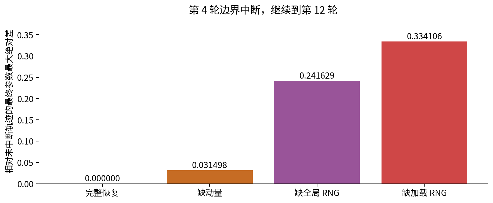
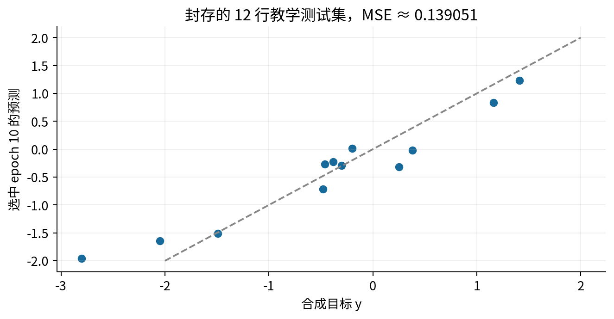

# 030 模块数据加载与训练循环

## 1 怎样让训练过程成为可检查的闭环

029回答了怎样用PyTorch记录张量运算并核对梯度。本讲继续追问：梯度已经能算出来，怎样组织数据、参数更新、验证、模型选择与中断恢复，使别人知道“这一份结果到底怎样产生”？一个可靠的训练脚本不只是若干API的串联。它需要规定每类数据能改变什么状态，也需要保存足够的信息，解释下一次更新为什么与原计划一致。

先修029及021指标拆分与可信评价。我们使用72行无量纲合成回归数据，固定45行训练、15行验证、12行测试；不下载真实数据，不调用模型服务。实验的目标是验证工程职责和恢复语义，不是证明这17个参数的小网络适合某个现实任务。全程CPU、float64、单进程加载；数值结论只对应记录的环境。

训练集用于拟合参数以及输入标准化的均值、尺度；验证集用于在事先规定的12个epoch候选中选择权重；测试集只在选择完成后评价。每个epoch完整遍历训练样本一次，每个optimizer step只更新一次参数；本例45行、batch size为7，每轮有7次更新，而不是45次或6次。



“测试只看一次”是一项实验规约，并不是文件权限带来的技术封锁。本仓库公开了合成测试数据，读者能够打开它。代码仍将测试评价放在选择之后，并用干预测试检查训练与选择是否依赖测试行。公开教学数据不等于现实评估时可以反复据测试结果调参。

## 2 参数注册与计算图是两种关系

### 2.1 从普通Python类过渡到nn.Module

一个类把数据与操作这些数据的方法组织在一起；`self`指当前对象。`__init__`负责构造对象，`forward`描述一次输入怎样变成输出。继承`nn.Module`表示我们采用PyTorch的模块管理协议。先执行`super().__init__()`，让父类初始化注册结构，再把层赋给对象属性。

```python
class SmallRegressor(nn.Module):
    def __init__(self, mean, scale, hidden=4, dropout=0.25):
        super().__init__()
        self.register_buffer('mean', mean.detach().clone())
        self.register_buffer('scale', scale.detach().clone())
        self.hidden = nn.Linear(2, hidden, dtype=torch.float64)
        self.activation = nn.Tanh()
        self.dropout = nn.Dropout(dropout)
        self.output = nn.Linear(hidden, 1, dtype=torch.float64)

    def forward(self, x):
        z = (x - self.mean) / self.scale
        h = self.activation(self.hidden(z))
        return self.output(self.dropout(h))
```

调用`model(x)`会经过Module的调用机制，最终执行forward；不要为了“更直接”而惯常写`model.forward(x)`，因为这会绕过注册的调用钩子等机制。这里没有自定义钩子，但从一开始采用正确入口，后续扩展才不容易埋下差异。[S1]

### 2.2 四种对象的不同职责

`nn.Parameter`是被模块管理为可学习参数的特殊Tensor。把它直接赋给模块属性，或把一个子Module赋给属性，都会进入相应的注册树。优化器收到`model.parameters()`后，持有这些已注册参数的引用。优化器不会在每次step时扫描程序里全部需要梯度的Tensor。

普通的`torch.tensor(..., requires_grad=True)`可以出现在计算图中，并在backward后得到梯度；但仅仅把它赋给`self.w`不会让它自动出现在模块的参数列表。普通Python列表中的子层也不因被列表包住而自动注册，应使用`nn.ModuleList`；对Parameter集合使用`nn.ParameterList`。本讲的失败探针里，漏注册模型可以前向、反向，`w.grad`也非空，但`named_parameters()`为空。这同时反驳了“有梯度就会被优化器更新”。

buffer保存属于模型、但不交给优化器学习的Tensor，例如固定的训练均值和尺度。默认持久buffer会进入state_dict，并随模块设备、dtype转换而移动。普通Python属性仍适合存标题等非Tensor信息，但它不自动成为保存状态。本讲配置另行保存，不假定state_dict含有所有属性。[S1]



### 2.3 把模型形状写清楚

输入批次$X\in\mathbb R^{B\times2}$，两个训练统计向量$\mu,s\in\mathbb R^2$按列广播，且每个$s_j>0$。PyTorch Linear把权重保存为“输出宽度×输入宽度”，所以第一层$W_1\in\mathbb R^{4\times2}$、$b_1\in\mathbb R^4$，第二层$W_2\in\mathbb R^{1\times4}$、$b_2\in\mathbb R$。沿用行样本约定：

$$\widetilde X_{ij}=\frac{X_{ij}-\mu_j}{s_j},\qquad A=\widetilde XW_1^T+\mathbf1b_1^T,\qquad H=\tanh A.$$

评估模式中$\widehat Y=HW_2^T+\mathbf1b_2$，shape为$(B,1)$。参数数目为$4\times2+4+1\times4+1=17$。把目标从$(B,1)$误写成$(B,)$，减法可能广播成$(B,B)$；数值仍然能运行，却把每个预测与所有目标交叉比较。因此batch_mse先要求两个shape精确相同，而不是依靠广播来“适配”。

## 3 标准化也是要保存的训练产物

对训练ID集合$T$，令$n=|T|=45$。本讲按总体式定义训练统计量，不使用无偏方差修正：

$$\mu_j=\frac1n\sum_{i\in T}x_{ij},\qquad
s_j^2=\frac1n\sum_{i\in T}(x_{ij}-\mu_j)^2.$$

这里标准化是在定义一个确定的输入变换，不是在估计总体方差的无偏统计量。验证与测试都使用同一份$\mu,s$，不能各自重新计算，也不能把三份数据合起来拟合。若训练某一列完全常数，本实现明确拒绝零尺度，而不是隐式除以零；真实任务可以事先规定删除常数列等其他处理。

实际均值约为$(0.00444444,-0.13333333)$，尺度约为$(1.38915731,1.29700510)$。测试用Fraction表示读取后的二进制浮点数，独立重算均值与方差，防止误把验证行算进去。模型的mean与scale随权重一起保存，重新载入时还检查它们与当前训练ID计算的统计量一致。保存数据拆分，而不仅保存一个随机种子，可以避免数据行顺序或拆分实现变化后重新抽到另一组样本。

## 4 Dataset提供样本 DataLoader组织迭代

`Dataset`不是“下载器”的同义词。这里采用map-style协议：`__len__()`返回样本数量，`__getitem__(i)`返回第i个样本。训练Rows对象有45个局部位置，但同时返回原始id，以便检查一个epoch是否遗漏或重复样本。

数据集拥有特征、标签的副本，取样时再返回副本。这样读者在调试一个取出的样本时做原地修改，不会悄悄改掉以后epoch读取的数据。这是教学中的防别名选择，会增加复制开销；不能据此主张所有大规模数据集都应逐条复制。

```python
loader = DataLoader(
    train_rows, batch_size=7, shuffle=True,
    drop_last=False, num_workers=0, generator=train_generator
)
for x, y, ids in loader:
    # x:(B,2), y:(B,1), ids:(B,)
    ...
```

for循环调用迭代器，一次返回一个批次；默认整理逻辑把多个同shape样本堆叠到新的第0轴。shuffle打乱的是训练子集的局部索引，不是破坏一行内部x与y的对应。drop_last=False让最后不足7个的批次保留下来。[S2]



num_workers=0让取样发生在当前进程；这减少了本实验需要讨论的恢复状态。多worker的预取队列、worker随机状态、持久worker和分布式sampler会扩大恢复问题，本讲没有测试这些情况。验证、训练集轮末评价与测试各自采用不打乱的独立loader generator，避免创建评价迭代器时消耗训练打乱的随机状态。

## 5 一个训练step到底改变什么

### 5.1 损失归约与手算更新

每个样本只有一个目标。令$e_i=\widehat y_i-y_i$，批次损失为：

$$L_B=\frac1B\sum_{i=1}^{B} e_i^2,\qquad
\frac{\partial L_B}{\partial\widehat y_i}=\frac{2e_i}{B}.$$

这次定义没有额外的$1/2$。假如每个样本有K个输出而对整个张量调用mean，分母将是$BK$，不是B；它与“每样本误差求和再对B求平均”差了K倍。本文只有K=1，程序仍保留明确shape保护。

为了能手算，暂时用$\widehat y=wx+b$、两行$(x,y)=(1,2),(2,3)$。在$w=1,b=0$时，预测为1和2，两个残差都为−1，$L=1$。由链式法则：

$$\frac{\partial L}{\partial w}=\frac{2}{2}[(-1)1+(-1)2]=-3,\qquad
\frac{\partial L}{\partial b}=\frac{2}{2}[(-1)+(-1)]=-2.$$

使用学习率0.1的普通SGD一次更新，得到$w=1.3,b=0.2$；新预测1.5和2.8，新损失$(0.25+0.04)/2=0.145$。本讲小网络的反向由autograd执行，但同样遵守“先根据旧参数计算完整梯度，再更新参数”的顺序。

### 5.2 五行核心代码与它们的边界

```python
optimizer.zero_grad(set_to_none=True)
prediction = model(x)
loss = batch_mse(prediction, y)
loss.backward()
optimizer.step()
```

zero_grad清理已有梯度；它不重置权重，也不清除动量。set_to_none=True使梯度变成None，能帮助发现某个注册参数根本没参与计算；真实零梯度则是一个数值全零的Tensor。backward把本次贡献累加到grad，step读取grad并更新优化器管理的参数。step之后grad通常仍在，因此本实验在下一批反向前显式清理。[S3]

训练开始调用model.train()，但这个方法本身不计算梯度、更不做参数更新。本例Dropout在训练时独立屏蔽部分隐藏激活，并把保留项除以$1-p$。若$M_{ij}$为取1概率$1-p$的随机掩码，训练激活为$\widetilde H_{ij}=M_{ij}H_{ij}/(1-p)$，在固定H条件下其期望等于H。评估时直接使用H。这里p=0.25只是固定教学配置，未进行最佳超参数搜索。[S4]



### 5.3 优化器也有记忆

为让“只保存权重”的缺陷可观测，本例使用带动量的SGD。无衰减、无dampening、无Nesterov时，本讲用到的递推是$g_t=\nabla L_t$、$v_t=\mu v_{t-1}+g_t$、$\theta_{t+1}=\theta_t-\eta v_t$。初始缓冲按首个梯度建立；这组设置等效于$v_{-1}=0$。动量的几何作用将在033展开，这里只关心v也是状态。[S3]

最简单的标量探针从$\theta_0=1$出发，$\eta=0.1,\mu=0.5$，依次提供梯度2和3。第一步$v_0=2,\theta_1=0.8$；第二步$v_1=0.5\times2+3=4,\theta_2=0.4$。若只读回0.8却丢掉v，下一步会把缓冲当作3，得到0.5。这不是舍入误差，而是执行了另一套状态递推。

### 5.4 同一真实批次的全部反向路径

现在把刚才的更新规则接回主网络，不另外换一套数据。第一个真实训练批次的ID按执行顺序为56、10、26、43、14、11、2。下面数值展示到6—9位便于手查；outputs/first-step-trace.json保存全部float64坐标、shape、更新前后参数及下一次前向。test_12用独立NumPy链式法则与17个参数的中心差分核验这同一次计算。

对第0行（原始ID56），$x=(0.8,0.75)$、$y=0.33$。用训练统计量标准化后$z=(0.572689321,0.681056177)$。第一层第0个单元的仿射值不是跳过中间量的黑盒：

$$a_0=0.564307338\times0.572689321+0.217446409\times0.681056177-0.358691325
\approx0.112574682.$$

同样计算四个单元，得到$a\approx(0.112574682,1.016275533,0.130174210,-0.517162321)$。逐元素tanh得到$h\approx(0.112101525,0.768345185,0.129443879,-0.475506917)$。这一行恰好四项都保留，Dropout局部缩放均为$4/3$，所以$d\approx(0.149468700,1.024460246,0.172591838,-0.634009223)$。

输出权重为$w_2\approx(-0.105420472,0.272024391,-0.363230817,-0.373378802)$，偏置约0.184671720。输出等于四项$d_jw_{2j}$之和再加偏置，即约0.621627763。这一行残差0.291627763，平方约0.08504675；整个批次损失还要汇总另外六行，不能把这一行的平方直接当作L。

| 批内位置与原始ID | 目标 | 预测 | 残差 | dL/d预测 |
|---|---:|---:|---:|---:|
| 0 / 56 | 0.33 | 0.621628 | 0.291628 | 0.083322 |
| 1 / 10 | 0.22 | 0.285372 | 0.065372 | 0.018678 |
| 2 / 26 | 0.55 | 0.679788 | 0.129788 | 0.037082 |
| 3 / 43 | −1.49 | 0.166026 | 1.656026 | 0.473150 |
| 4 / 14 | 1.50 | 0.468238 | −1.031762 | −0.294789 |
| 5 / 11 | 0.39 | 0.680309 | 0.290309 | 0.082945 |
| 6 / 2 | −2.02 | 0.180120 | 2.200120 | 0.628606 |

七个平方误差求和再除7，得到$L=1.2625612818920995$。最后一列逐行由$2e_i/7$计算。记它为列向量$g\in\mathbb R^{7\times1}$；接下来每一步都说明它乘了哪个局部导数。

输出是$\widehat y_i=\sum_jD_{ij}W_{2,0j}+b_2$，故对$D_{ij}$的局部导数为$W_{2,0j}$，对$W_{2,0j}$的局部导数为$D_{ij}$，对$b_2$为1。于是$\bar D=gW_2$（shape 7×4）、$\bar W_2=g^TD$（shape 1×4）、$\bar b_2=\sum_i g_i$（shape 1）。横线表示损失对该量的导数，不表示平均。

第0行$\bar D\approx(-0.008783868,0.022665676,-0.030265197,-0.031110750)$。本次实际掩码缩放矩阵记为C，保留位置为4/3，屏蔽位置为0；随机掩码在这次求导中视为已观察到的常量，所以$\bar H=\bar D\odot C$。第0行得到$(-0.011711823,0.030220901,-0.040353597,-0.041481000)$。其他行有被屏蔽的单元，它们在这一条路径的梯度为0。

由tanh局部导数$1-H_{ij}^2$，再得$\bar A=\bar H\odot(1-H^2)$。第0行约为$(-0.011564644,0.012379861,-0.039677443,-0.032101863)$。比如第0个单元的连乘是$0.083322218\times(-0.105420472)\times(4/3)\times(1-0.112101525^2)$，每个因子依次来自损失、输出仿射、Dropout与tanh。

第一层$A_{ij}=\sum_kZ_{ik}W_{1,jk}+b_{1,j}$。因此$\bar W_1=\bar A^TZ$（4×2）、$\bar b_1=\sum_i\bar A_{i,:}$（4）、$\bar Z=\bar AW_1$（7×2），再除固定尺度得到$\bar X_{ik}=\bar Z_{ik}/s_k$。第0行$\bar Z\approx(0.004523240,-0.024203017)$，$\bar X\approx(0.003256104,-0.018660696)$。训练统计量是固定buffer，不在本次图里重新从输入估计。

共享参数必须累计七条样本路径。以$W_{2,00}$为例，七项$g_iD_{i0}$分别约为0.012454064、0.003817008、0.007453441、−0.223172244、0、−0.090834929、−0.546354109；相加得−0.836636769。以$W_{1,00}$为例，七项$\bar A_{i0}Z_{i0}$分别约为−0.006622948、−0.001468198、−0.003650566、0.033693407、0、0.003289377、0.058686506；相加得0.083927578。不能拿第0行的贡献替代共享参数的整个批次梯度。

| 参数组 | 本批次全部梯度 |
|---|---|
| W1 第0行 | (0.083927578, −0.145823632) |
| W1 第1行 | (−0.128658022, 0.203235524) |
| W1 第2行 | (0.474082517, −0.479729208) |
| W1 第3行 | (0.365694705, −0.520666505) |
| b1 | (−0.132011426, 0.170880283, −0.193568937, −0.498938427) |
| W2 | (−0.836636769, 0.040806114, −0.293761518, 0.545070646) |
| b2 | 1.028994546 |

第一步没有旧动量，因此缓冲就是以上梯度，学习率0.04。比如$W_{1,00}:0.564307338-0.04(0.083927578)=0.560950235$；$W_{2,00}:-0.105420472-0.04(-0.836636769)=-0.071955001$；$b_2:0.184671720-0.04(1.028994546)=0.143511938$。其他14个标量按同一规则更新，完整前后值保存在trace的before与after字段。

为隔离更新影响，我们把同一批次再前向一次。固定使用刚才观察到的同一掩码时，新损失约1.131090430；这是一项诊断重放，不冒充下一次会重新随机抽掩码的训练前向。如果统一用eval协议，更新前同批损失约1.240806178，更新后约1.107468748。更新后第0行的新仿射值约$(0.119905126,1.006850972,0.140125790,-0.491397837)$、tanh约$(0.119333776,0.764456410,0.139215802,-0.455325173)$，新预测约0.472632809。不要把带Dropout的旧预测与无Dropout的新预测直接归因成纯参数更新效果。

以上从同一批数据、同一次随机掩码出发，走完前向、每个局部导数、路径累计、17个参数更新与下一次前向。读者可暂停在任意一量，先手算一个坐标，再查trace；完整数值文件是核对工具，不替代这里的导数连接。独立NumPy反向还逐步核对了主实验全部84次更新，最大梯度差约$8.89\times10^{-16}$。

## 6 验证不是另一次小训练

### 6.1 eval与no_grad必须分开理解

model.eval()把模块切换到评估模式，影响Dropout、BatchNorm等特定模块。它并不禁止记录计算图，所以在eval模式调用backward和step仍然可能更新参数。相反，torch.no_grad()使其作用域内通常的新运算不记录反向图，却不把Dropout切换成评估行为。[S1][S4]



本例验证同时使用eval和no_grad，不调用优化器。进入前复制参数与buffer，保存已有grad和每个子模块的training标志；退出后恢复模式，并核对状态与梯度没有变化。使用try/finally意味着即使前向抛出异常，也会执行恢复模式的代码。这个检查针对本模型与受支持loader，不意味着所有自定义模块都没有其他Python副作用。

### 6.2 先累计分子 再统一除以样本数

若第k批有$n_k$个样本、平均损失$\bar L_k$，整体每样本均值必须是：

$$\bar L=\frac{\sum_k n_k\bar L_k}{\sum_k n_k}.$$

证明只要把每批的$n_k\bar L_k$展开成该批误差之和，各个样本就恰好出现一次。直接对各批均值平均，相当于让每批的总权重相同，使小批次中的单个样本得到更大权重。



本例验证15行分成7、7、1。第4轮正确验证MSE约0.10013470，错误等权批次均值约0.16671112，差异足以改变人的直觉。实际loss.item()把只有一个元素的Tensor变成Python标量，适合累计日志；它也切断与计算图的联系，因此不能先item再试图反向。

### 6.3 三种训练曲线不能混为一谈

train_online_mse汇总每批更新前、带Dropout且参数持续变化的预测误差；train_eval_mse在轮末用同一份固定权重、关闭Dropout重新评价训练集；validation_mse用同一轮末权重评价验证集。因此第一条和后两条的差异既包含数据差异，也包含模式和测量时间差异，不能把它们的距离全部解释成泛化差距。



完整运行12轮共84次优化器更新、540次训练样本呈现。第10轮验证MSE约0.04587149；第12轮约0.06185900。最佳权重与最新权重是两份不同状态：部署评价使用最佳候选，中断续训则从最新状态继续。本例没有提前停止，所有12轮都跑完；“保存最佳候选”不等于“早停”。

## 7 保存的是哪一时刻的什么状态

### 7.1 state_dict不是自动生成的深拷贝

model.state_dict()给出名称到参数及持久buffer的映射；其中Tensor通常仍引用原存储。若写`best = model.state_dict()`，然后继续训练，best中的数值会随参数改变。应立即序列化，或对每个Tensor进行detach().clone()，或使用合适的deepcopy。detach去掉图联系，clone才建立独立存储。[S5]

本实验每次验证严格改善才复制best，平局保留先出现的轮次。checkpoint函数还深拷贝优化器状态与历史，避免“检查点对象已经建好但尚未写盘”期间后续更新改掉缓冲。保存完整模型Python对象会增加类定义和导入位置依赖，因此这里保存状态字典与显式配置。

### 7.2 完整epoch边界的最小充分状态

把本程序需要的状态写成$S_e=(\theta_e,b_e,v_e,r_e,q_e,c,d,h_e,\theta_e^{best})$。这里$\theta$为参数，b为非学习buffer，v为优化器缓冲，r为CPU全局随机状态，q为训练加载器随机状态，c为配置，d为数据摘要与拆分，h为已完成轮次、日志、样本顺序和最佳记录。b不是前文线性层偏置的专用符号，偏置已经包含在$\theta$中；此处仅是状态分类记号。



保存发生在第4轮所有批次、验证和最佳候选记录都完成之后，下次从第5轮开始。下一批会重新zero_grad，所以不需要保存旧grad；每轮明确train，因此不依赖保存时的模式。模型没有随机数据增强；Python与NumPy的随机生成器不参与训练；CPU全局RNG用于初始化和Dropout，独立Generator用于训练打乱。评价loader使用独立generator，但本例无worker、无随机变换且顺序固定，其base seed不会影响数值，所以无需为它们保存随机状态。

这些省略项都有前提。若在一个epoch中间中断，还需样本排列、当前位置、当前未完成的梯度累积等；有多进程预取、GPU、学习率调度器、混合精度scaler或其他随机源时，也要扩展状态。不能把本例的字典宣称为任何训练系统的通用精确恢复方案。[S2][S6]

### 7.3 保存恢复的具体动作

脚本把只含Tensor和基础容器的字典用torch.save写进本地字节缓冲，再写盘。加载调用torch.load的map_location='cpu'与weights_only=True。后者收窄允许反序列化的对象类型，并不意味着未知来源检查点已成为安全文件；只加载自己生成或来源可信的文件，不为绕过错误而随意设置weights_only=False。[S7]

恢复先检查配置、数据摘要、拆分、运行版本和状态shape，再创建相同模型与优化器，严格载入model，载入optimizer，恢复历史与最佳记录，最后恢复两个RNG。若提前恢复随机状态，再构造Linear层，构造期间的初始化会消耗随机数，使下一次Dropout使用错误位置。单纯重新manual_seed只能回到序列开头，不能回到第4轮之后。

若在同一确定环境里，每轮是同一个函数$S_{e+1}=F(S_e)$，恢复后$S'_4=S_4$，则$S'_5=F(S'_4)=F(S_4)=S_5$，继续归纳可得到所有后续状态相同。这个论证要求“F真的相同且确定”；固定种子并不自动保证不同设备、平台、版本或并行算法满足这个条件。[S6]

## 8 用反例检验恢复承诺

本报告从同一第4轮检查点构造完整恢复，以及分别故意漏掉动量、全局RNG、加载器RNG的三种实验。全量检查比较参数、buffer、优化器状态、随机状态、每轮指标、样本顺序与最佳权重，而不只比较最后一个loss。



缺动量的最终参数最大绝对差约0.03149809；缺全局RNG约0.24162864；缺加载器RNG约0.33410590。前两种仍保持相同的训练样本顺序，第三种改变了顺序。它们都可能得到看起来合理甚至某项误差更低的结果，但已经无法支持“继续了同一轨迹”的说法。

除同进程内重新建对象之外，还在另一个新Python进程中读入公开的checkpoint-epoch-04.pt，跑到第12轮，输出完整最终状态；与未中断版本的JSON逐字节一致。三种随机种子乘三个epoch边界的九组额外测试也逐状态一致。这些证据只覆盖本程序、同一记录环境，不构成跨平台逐位一致的承诺。

## 9 模型选择完成后再评价测试集

按照验证规则选择第10轮的快照，将它装回模型，在eval与no_grad中评价12行测试数据。本次测试MSE约0.13905110，图中每个点都是一行合成数据。样本极少、数据机制人为设定，而且没有独立重复抽样；不能从这个数字推出真实任务精度、稳定泛化能力或模型间排名。



干预检查把测试特征整体平移、测试标签改成另一组数值，再重新训练；最终训练状态、选择记录和最佳权重完全相同，测试误差则变化。另把验证标签改变，训练参数轨迹保持相同，但验证日志变化。前者检查测试没有流入训练与选择；后者说明“不参与梯度”不等于“不影响选择”。这是针对代码路径的证据，不是万能的泄漏检测器。

<div style="break-before:page"></div>

## 10 练习与下一步

1. 两批分别有7行和1行，平均平方误差为2和10。求整体均值，并解释错误地平均两个均值会给最后一个样本多大权重。
2. 延续第5节线性手算，第二步使用动量0.5、学习率0.1。求新梯度、缓冲、参数和损失；与丢失缓冲后的第二步比较。
3. 为什么一个Tensor有grad，仍可能不被optimizer.step更新？分别修复普通Tensor属性和普通列表中的Linear层。
4. 本模型的输入、两层权重、激活、预测与目标的shape是什么？说明$(B,1)$与$(B,)$相减的错误含义。
5. 列出本实验检查点的必要状态；解释为什么这一次没有保存grad与评价loader的随机状态，却不能一般化到任意程序。
6. 第10轮最好，第12轮最新。中断后继续训练应装哪一份？最终测试应装哪一份？如何避免best被继续训练改写？
7. 设计一个能区分“只恢复权重”与“完整恢复”的检查，不允许只看最后loss。说明如何把它变成新进程实验。
8. 如果在验证函数里只加no_grad却不加eval，或只加eval却继续step，会发生什么？用本讲探针解释。

完整推导、数字及代码位置见answers.pdf；实验操作与故障报告要求见lab.pdf。031会进一步把这些证据组织为最小调试顺序。本讲来源索引[S1]—[S7]及实际读取范围见sources.md；正文、图和合成实验均为本课程原创组织。
