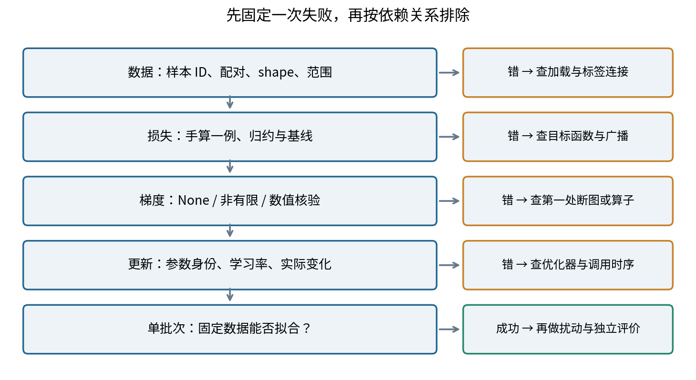
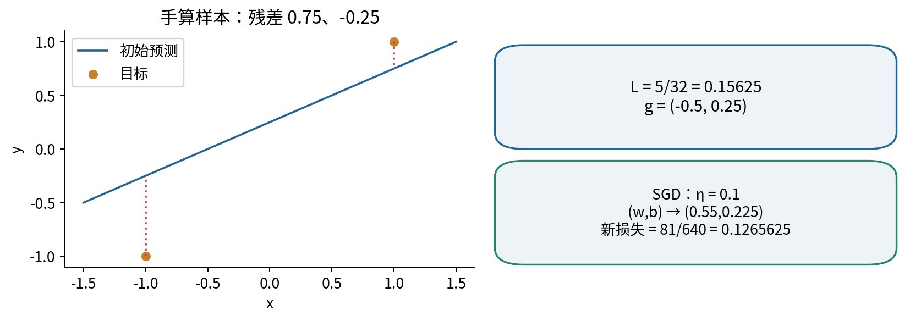
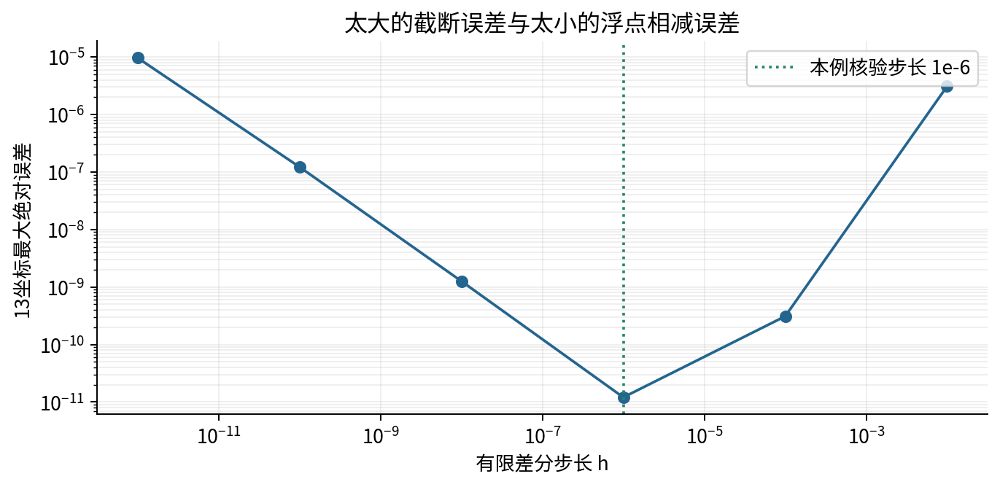
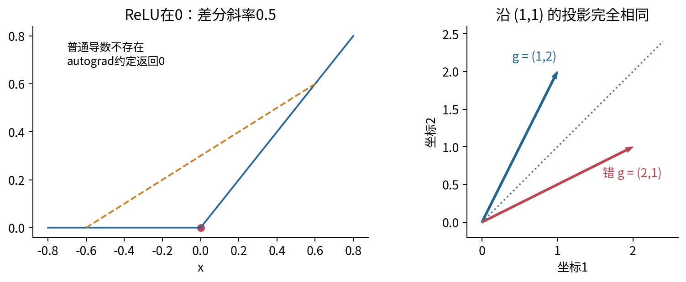
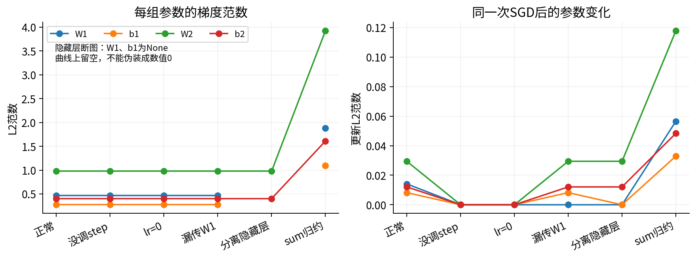
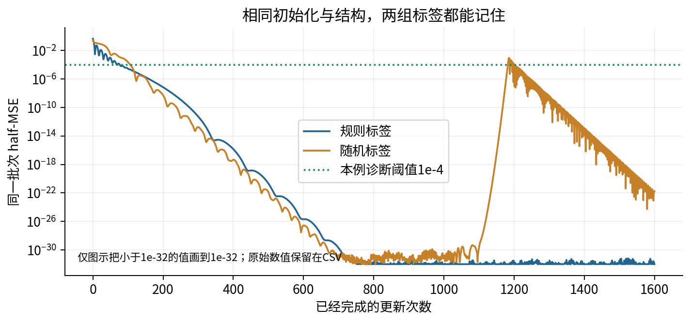
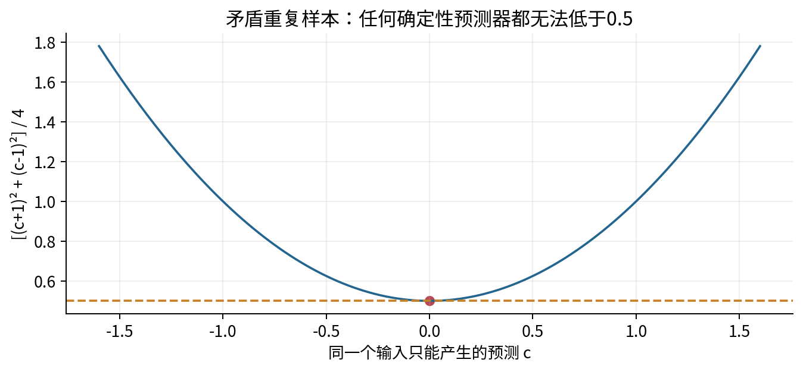
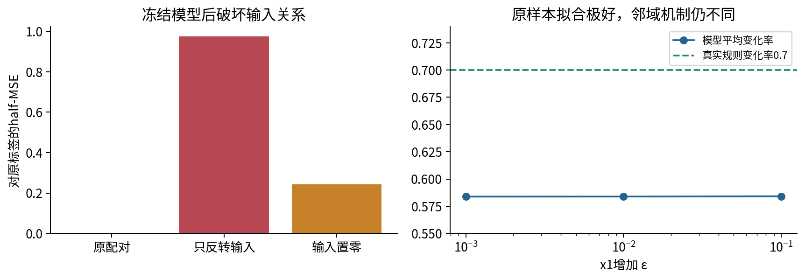
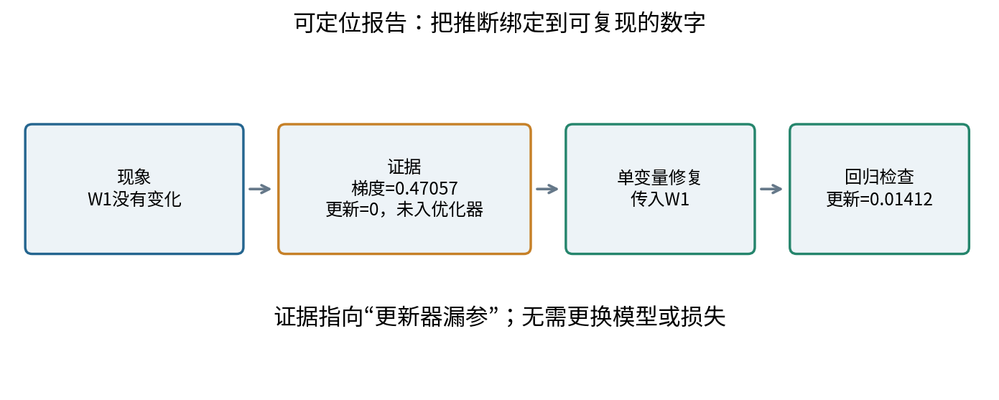

<style>table { break-inside: avoid; }</style>

# 031 梯度核验与最小调试法

训练失败时先检查哪一层证据最省时间？

损失不下降时，最容易做的事是加深网络、扩大隐藏层或换优化器。但这些操作同时改变很多条件，既可能掩盖错误，也可能制造新错误。本讲的目标是把一句“训练不行”变成一条可以被另一位同学重复验证的判断：哪一份数据、哪一步计算、哪一组参数首先偏离了预期。

先修为027“批次反向传播与损失归约”和030“模块数据加载与训练循环”。本讲重新说明所需的损失、参数注册和更新时序；实验只导入本目录代码，不依赖其他讲的文件。全部数值来自小型、无单位、人工合成的CPU回归问题。没有训练外的验证集或测试集，因此没有任何泛化性能估计。

## 1 先把问题压缩成可重复的一次失败

所谓最小调试，不是盲目把模型改小，而是尽可能减少与当前现象无关的变量。保存一小批明确的样本ID、输入、标签、初始参数、精度、运行版本和更新次数。暂时去掉数据增强、随机丢弃、复杂调度、并行加载和混合精度；这些变化只用于诊断，最终还要逐项恢复并检查。



最便宜的证据通常在最前面：读出三条样本，而不是先跑三小时。检查“样本ID与标签是否仍配对”比仅看shape更重要；合法的张量完全可能表示错误的任务。然后手算一两个预测与损失，再问梯度是否存在、是否有限、是否等于数值核验。最后检查优化器到底更新了哪个对象。

这个顺序不是普适时间最优算法。如果错误日志已经明确指向某个算子，就直接检查它；如果只是整体指标差，从低成本、依赖更早的证据开始往往更省时间。每次修改一个因素，记录修复前后的同一指标，才能说明是哪个变化起了作用。

把三类问题分开：正确性问“程序是否计算了约定的目标及导数”；优化问“给定目标能否被当前更新策略降低”；统计评价问“对未参与选择的未来样本是否有效”。三者有依赖，但不能互相替代。梯度正确并不保证优化容易，训练拟合成功也不保证目标本身正确。

## 2 第一个证据层：数据契约与可手算损失

用行表示样本。$X\in\mathbb R^{n\times d}$中，$n$是批次大小，$d$是每条样本的特征数；回归标签和预测都规定为$n\times1$。本讲$d=2$，完整批次$n=8$。标签来自已知规则：

$$y_i=0.7x_{i1}-0.4x_{i2}+0.2.$$

规则只负责构造教材数据，不代表现实数据都会线性、无噪声。输入是二维网格中除中心之外的8点。另有一列随机回归标签，由独立的Python随机数发生器`random.Random(31)`产生8个区间$[-1,1]$中的数并保留3位小数；每轮训练重复使用同一列，不每步重新抽样。

数据契约包括：两列输入的意义与顺序；8个唯一ID；标签与输入同一行；有限实数、正确dtype和设备；预测与标签的shape完全相等。不能因为广播“能算”就省去检查。若预测为`[[1.],[2.]]`，标签误压成`[1.,2.]`，减法得到$2\times2$矩阵，而非两个残差：

$$\begin{bmatrix}1\\2\end{bmatrix}-\begin{bmatrix}1&2\end{bmatrix}
=\begin{bmatrix}0&-1\\1&0\end{bmatrix}.$$

原来两个预测都完全正确，损失应为0；错误广播却产生half-MSE为$1/4$。没有异常并不等于语义正确。本讲`validate_batch`拒绝一维标签，也在转换dtype前拒绝混入数值列表的布尔值，避免`True`悄悄变成1。

### 2.1 为什么明确写出half-MSE

令$r_i=\hat y_i-y_i$为残差，采用

$$L(\theta)=\frac{1}{2n}\sum_{i=1}^{n}r_i^2.$$

$\theta\in\mathbb R^P$包含$P$个实参数；$L$是标量。因子$1/2$让平方求导中的2相消。代码`0.5*(pred-y).square().mean()`恰好对应这个式子，是因为这里只有一个输出列。如果输出有$q$列，直接`mean()`还会除以$q$；必须重新定义想要的归约。

数据、预测和参数均是无单位教学数。在真实任务中，若标签单位是米，损失单位是平方米，参数梯度的单位还取决于参数单位。因此“梯度范数超过1就爆炸”不是可靠的跨任务标准。先记录量纲、缩放和归约，再解释大小。

### 2.2 两条样本的完整手算

暂时令$d=1$，$x=(-1,1)$，$y=(-1,1)$，线性预测$\hat y=wx+b$。在$w=1/2,b=1/4$处，预测为$(-1/4,3/4)$，残差为$(3/4,-1/4)$。于是

$$L=\frac{(3/4)^2+(-1/4)^2}{4}=\frac5{32}=0.15625.$$

链式法则逐项给出$\partial r_i/\partial w=x_i$、$\partial r_i/\partial b=1$，所以

$$g_w=\frac1n\sum_i r_ix_i=-\frac12,\qquad
 g_b=\frac1n\sum_i r_i=\frac14.$$

梯度向量$g=(g_w,g_b)$的二范数为$\sqrt{(-1/2)^2+(1/4)^2}=\sqrt5/4$。用无动量、无权重衰减的SGD，学习率$\eta=0.1$，更新为$w'=0.55,b'=0.225$。此时残差$(0.675,-0.225)$，新损失为$81/640=0.1265625$。旧梯度必须与旧参数比较，新损失必须重新前向计算。



## 3 把一次反向传播翻译成可检验的数学对象

梯度核验使用更小的$2\to3\to1$平滑网络，取前4条样本。$W_1\in\mathbb R^{2\times3}$，$b_1\in\mathbb R^3$，$W_2\in\mathbb R^{3\times1}$，$b_2\in\mathbb R$，共$6+3+3+1=13$个参数。定义

$$A=XW_1+b_1,\quad H=\tanh A,\quad \hat y=HW_2+b_2.$$

$A,H$的shape是$n\times3$，$\hat y$是$n\times1$。偏置按行广播。双曲正切定义为$\tanh a=(e^{2a}-1)/(e^{2a}+1)$，在实数上平滑，导数为$1-\tanh^2a$。因此适合排除不可导点对第一次梯度核验的干扰。

令$R=(\hat y-y)/n\in\mathbb R^{n\times1}$。先对输出求导，再从后向前传播：

$$G_{W_2}=H^\mathsf{T}R,\quad G_{b_2}=\sum_iR_{i1},\quad
G_H=RW_2^\mathsf{T}.$$

逐元素相乘用$\odot$表示。激活前梯度和第一层参数梯度为

$$G_A=G_H\odot(1-H\odot H),\quad
G_{W_1}=X^\mathsf{T}G_A,\quad G_{b_1}=\sum_i(G_A)_{i,:}.$$

例如$\partial L/\partial(W_1)_{kj}=\sum_iR_{i1}(W_2)_{j1}(1-H_{ij}^2)X_{ik}$。这里的$1/n$已经在$R$中，求第一层梯度时不能再平均。这个逐索引表达式用于`scalar_reference`：Python循环逐样本、逐隐藏单元相加，不调用PyTorch求导。

参数向量按固定顺序展平：索引0–5为$W_1$逐行展开，6–8为$b_1$，9–11为$W_2$，12为$b_2$。展平只是建立每个坐标与参数位置的一一对应；不改变模型。`theta[:6].reshape(2,3)`取前6个元素恢复矩阵，切片右端不包含6。报告必须保留这个映射，否则“第7个梯度错误”无法定位。


### 3.1 同一份数据完整走一遍前向

下面不是另换一个简化例子：它就是后面13坐标有限差分实际使用的前4条数据与参数。所有表格为便于手算保留6位小数，程序保留float64全精度；不要把表中已四舍五入的数再代入，并要求复现最后十几位。每个三元素单元格都按隐藏单元1、2、3的顺序读。

$$X=\begin{bmatrix}-1&-1\\-1&0\\-1&1\\0&-1\end{bmatrix},\quad
 y=\begin{bmatrix}-0.1\\-0.5\\-0.9\\0.6\end{bmatrix}.$$

$$W_1=\begin{bmatrix}0.2&-0.3&0.4\\0.1&0.25&-0.2\end{bmatrix},\quad
 b_1=(0.05,-0.1,0.15),\quad W_2=\begin{bmatrix}0.3\\-0.4\\0.2\end{bmatrix},\quad b_2=-0.05.$$

先看s0：第一个隐藏仿射值为$(-1)(0.2)+(-1)(0.1)+0.05=-0.25$；第二个为$(-1)(-0.3)+(-1)(0.25)-0.1=-0.05$；第三个为$(-1)(0.4)+(-1)(-0.2)+0.15=-0.05$。分别取tanh后，得到约$(-0.244919,-0.049958,-0.049958)$。输出把这三个数乘以$0.3,-0.4,0.2$后相加，再减0.05，得约$-0.113484$。其余样本重复同样三步，完整结果如下。

| 样本 | A | H | prediction |
|---|---|---|---|
| s0 | -0.250000, -0.050000, -0.050000 | -0.244919, -0.049958, -0.049958 | -0.113484 |
| s1 | -0.150000, 0.200000, -0.250000 | -0.148885, 0.197375, -0.244919 | -0.222599 |
| s2 | -0.050000, 0.450000, -0.450000 | -0.049958, 0.421899, -0.421899 | -0.318127 |
| s3 | -0.050000, -0.350000, 0.350000 | -0.049958, -0.336376, 0.336376 | 0.136838 |


将预测减标签得到$r_i$，平方后乘$1/2$得到单样本损失$\ell_i=r_i^2/2$，最后把4个$\ell_i$相加除以4。这里还没有反向传播，每个数都能只用前向计算复核。

| 样本 | residual | per_sample_half_squared_error |
|---|---|---|
| s0 | -0.013484 | 0.000091 |
| s1 | 0.277401 | 0.038476 |
| s2 | 0.581873 | 0.169288 |
| s3 | -0.463162 | 0.107260 |


全精度计算得到$L=(0.0000909081+0.0384755546+0.1692881432+0.1072596052)/4\approx0.0787785527623$。不能把四个已平均过的数再平均；表中每个$\ell_i$尚未除以批次大小。

### 3.2 从损失种子1开始，列出每一段局部导数

反向起点是$\partial L/\partial L=1$。均值层给每个样本$\partial L/\partial\ell_i=1/4$；平方层给$\partial\ell_i/\partial r_i=r_i$；减法层给$\partial r_i/\partial\hat y_i=1$。三段相乘得到$R_i=\partial L/\partial\hat y_i=r_i/4$，不是$r_i$，也不是$r_i/16$。

输出仿射层的局部导数为$\partial\hat y_i/\partial H_{ij}=(W_2)_{j1}$、$\partial\hat y_i/\partial(W_2)_{j1}=H_{ij}$、$\partial\hat y_i/\partial b_2=1$。它不混合不同样本，因此跨样本的对应局部导数为0。逐元素激活给$T_{ij}=\partial H_{ij}/\partial A_{ij}=1-H_{ij}^2$，不同元素之间局部导数为0。

第一层仿射的局部导数为$\partial A_{ij}/\partial(W_1)_{kj}=X_{ik}$、$\partial A_{ij}/\partial(b_1)_j=1$、$\partial A_{ij}/\partial X_{ik}=(W_1)_{kj}$。这里$i$索引样本，$j$索引隐藏单元，$k$索引输入特征。参数被多条样本共同使用，所以稍后必须把这些路径贡献相加。

### 3.3 先传回隐藏输出，再传到仿射输入

逐条路径计算$(G_H)_{ij}=R_i(W_2)_{j1}$，再计算$(G_A)_{ij}=(G_H)_{ij}T_{ij}$。例如s0第一个单元：$R_0\approx-0.003370981$，乘0.3得到$-0.001011294$，再乘$1-(-0.244918662)^2\approx0.940014849$，得到约$-0.000950632$。以下各表覆盖全部4乘3条隐藏路径，不只展示其中一个坐标。

| 样本 | dPrediction | local_tanh_derivative |
|---|---|---|
| s0 | -0.003371 | 0.940015, 0.997504, 0.997504 |
| s1 | 0.069350 | 0.977833, 0.961043, 0.940015 |
| s2 | 0.145468 | 0.997504, 0.822001, 0.822001 |
| s3 | -0.115791 | 0.997504, 0.886851, 0.886851 |

| 样本 | dH | dA |
|---|---|---|
| s0 | -0.001011, 0.001348, -0.000674 | -0.000951, 0.001345, -0.000673 |
| s1 | 0.020805, -0.027740, 0.013870 | 0.020344, -0.026659, 0.013038 |
| s2 | 0.043640, -0.058187, 0.029094 | 0.043532, -0.047830, 0.023915 |
| s3 | -0.034737, 0.046316, -0.023158 | -0.034650, 0.041076, -0.020538 |


$R$是$(4,1)$；$T,G_H,G_A$都是$(4,3)$。有些框架日志把上游梯度统称“grad”，但$G_H$与$G_A$数值不同，因为二者之间还隔着tanh局部导数。只有形状正确还不足以把二者互换。

### 3.4 共享参数把四条样本贡献相加

对$W_1$第一行，样本贡献是$X_{i1}(G_A)_{ij}$；第二行是$X_{i2}(G_A)_{ij}$。例如$W_{1,11}$的四项约为$0.000950632,-0.020343867,-0.043531562,0$，相加得$-0.062924797$。s3的第一特征为0，所以它对这一行权重的贡献为0，但对偏置仍可有贡献。

第一层偏置每条贡献为$(G_A)_{ij}$；第二层权重每条贡献为$H_{ij}R_i$；输出偏置每条贡献为$R_i$。下一表让所有13个参数都从样本贡献走到总梯度；列内先乘局部导数，行内再累计所有路径。参数名称中的下标从1计数，最左列的向量索引从0计数。

| 索引/参数 | s0贡献 | s1贡献 | s2贡献 | s3贡献 | 总梯度 |
|---|---|---|---|---|---|
| 0: W1[1,1] | 0.000951 | -0.020344 | -0.043532 | -0.000000 | -0.062925 |
| 1: W1[1,2] | -0.001345 | 0.026659 | 0.047830 | 0.000000 | 0.073144 |
| 2: W1[1,3] | 0.000673 | -0.013038 | -0.023915 | -0.000000 | -0.036281 |
| 3: W1[2,1] | 0.000951 | 0.000000 | 0.043532 | 0.034650 | 0.079133 |
| 4: W1[2,2] | -0.001345 | -0.000000 | -0.047830 | -0.041076 | -0.090251 |
| 5: W1[2,3] | 0.000673 | 0.000000 | 0.023915 | 0.020538 | 0.045125 |
| 6: b1[1] | -0.000951 | 0.020344 | 0.043532 | -0.034650 | 0.028274 |
| 7: b1[2] | 0.001345 | -0.026659 | -0.047830 | 0.041076 | -0.032069 |
| 8: b1[3] | -0.000673 | 0.013038 | 0.023915 | -0.020538 | 0.015743 |
| 9: W2[1,1] | 0.000826 | -0.010325 | -0.007267 | 0.005785 | -0.010982 |
| 10: W2[2,1] | 0.000168 | 0.013688 | 0.061373 | 0.038949 | 0.114178 |
| 11: W2[3,1] | 0.000168 | -0.016985 | -0.061373 | -0.038949 | -0.117139 |
| 12: b2 | -0.003371 | 0.069350 | 0.145468 | -0.115791 | 0.095657 |


如果还要检查输入敏感度，$G_X=G_AW_1^\mathsf{T}$。s0的第一输入梯度约为$(-0.000950632)(0.2)+(0.001345027)(-0.3)+(-0.000672514)(0.4)=-0.000862640$；第二输入梯度约为0.000375696。完整4行依次为$(-0.000863,0.000376)$、$(0.017282,-0.007238)$、$(0.032621,-0.012387)$、$(-0.027468,0.010911)$。输入梯度只用于核验，本例不更新输入数据。

### 3.5 更新全部参数，再做一次新的前向

取$\eta=0.1$的无动量SGD，每个坐标执行$\theta'_k=\theta_k-0.1g_k$。下面列出旧值、刚才累积的梯度和新值。不要在尚未完成反向时改参数，否则保存的中间值不再对应同一个前向点。

| 索引/参数 | 旧值 | 总梯度 | 新值 |
|---|---|---|---|
| 0: W1[1,1] | 0.200000 | -0.062925 | 0.206292 |
| 1: W1[1,2] | -0.300000 | 0.073144 | -0.307314 |
| 2: W1[1,3] | 0.400000 | -0.036281 | 0.403628 |
| 3: W1[2,1] | 0.100000 | 0.079133 | 0.092087 |
| 4: W1[2,2] | 0.250000 | -0.090251 | 0.259025 |
| 5: W1[2,3] | -0.200000 | 0.045125 | -0.204513 |
| 6: b1[1] | 0.050000 | 0.028274 | 0.047173 |
| 7: b1[2] | -0.100000 | -0.032069 | -0.096793 |
| 8: b1[3] | 0.150000 | 0.015743 | 0.148426 |
| 9: W2[1,1] | 0.300000 | -0.010982 | 0.301098 |
| 10: W2[2,1] | -0.400000 | 0.114178 | -0.411418 |
| 11: W2[3,1] | 0.200000 | -0.117139 | 0.211714 |
| 12: b2 | -0.050000 | 0.095657 | -0.059566 |


用新参数重算$A'\to H'\to\hat y'$，而不是继续复用旧$H$。同样的4条输入与标签保持不变。更新后的全部前向中间结果为：

| 样本 | A_after | H_after | prediction_after |
|---|---|---|---|
| s0 | -0.251207, -0.048504, -0.050690 | -0.246053, -0.048466, -0.050646 | -0.124435 |
| s1 | -0.159120, 0.210521, -0.255202 | -0.157790, 0.207465, -0.249803 | -0.245318 |
| s2 | -0.067033, 0.469546, -0.459715 | -0.066933, 0.437833, -0.429852 | -0.350857 |
| s3 | -0.044914, -0.355818, 0.352938 | -0.044884, -0.341525, 0.338979 | 0.139196 |


新残差依次约为$(-0.024435,0.254682,0.549143,-0.460804)$，新loss为0.07241983164894575，低于旧值0.07877855276232809。s0的单样本误差反而变大，仍与批次平均目标下降相容：共享参数的一次更新不是分别为每个样本单独最优化。

### 3.6 与代码及差分报告一一对齐

`outputs/full-trace.json`保存以上所有未四舍五入数值、每个张量shape、4乘13个参数贡献，以及77个中间值/上游梯度/参数梯度/输入梯度坐标的NumPy手算路线与PyTorch对照。本次最大差约$5.55\times10^{-17}$。下一节差分使用同一个X、y、初始13参数向量，对照的正是表中的总梯度；差分时不先执行SGD。

Notebook逐格展示完整前向、局部tanh导数、两层上游梯度、所有样本贡献、全部参数梯度与新前向。后面单批次拟合改用49参数网络，属于另一个诊断任务；不能拿它的范数或loss与这张13参数表混用。


## 4 中央有限差分为什么可以检查导数

令$e_k$为第$k$个元素为1、其余为0的$P$维单位向量；$h>0$是与参数坐标相同单位的扰动。固定数据和其余参数，对单个坐标计算

$$g_k^{\mathrm{FD}}(h)=\frac{L(\theta+he_k)-L(\theta-he_k)}{2h}.$$

FD表示finite difference，即有限差分。这个计算只需要前向求值，不需要知道反向公式。假设沿该坐标三阶导数连续且附近有界，泰勒展开的前几项是

$$L(\theta\pm he_k)=L(\theta)\pm h g_k+\frac{h^2}{2}L_{kk}
 \pm\frac{h^3}{6}L_{kkk}+o(h^3).$$

$L_{kk}$和$L_{kkk}$分别是该坐标的二阶、三阶偏导。两式相减后，常数项与二阶项相消，再除以$2h$，得到$g_k+h^2L_{kkk}/6+o(h^2)$。所以在足够平滑时截断误差按$h^2$缩小。若讨论更高阶余项，还需要更强的光滑性，不能只凭一个公式默认成立。

手算例的损失恰好是二次函数$L(w,b)=((w-1)^2+b^2)/2$。固定$b=1/4,w=1/2$，取$h=0.1$，$L(0.6,b)=0.11125$，$L(0.4,b)=0.21125$，差分为$-0.5$。二次函数的三阶导数为0，实数精确算术下中央差分在任意非零步长都给出正确导数；计算机仍有舍入误差。

### 4.1 步长越小不一定越好

计算机求得的两个损失带有浮点误差。它们非常接近时，相减会丢失有效数字；除以$2h$又放大了误差。一个用于理解的模型是

$$E(h)\lesssim C_1h^2+C_2u/h,$$

其中$u$代表机器舍入误差尺度，$C_1,C_2$依赖局部曲率、损失大小和实现。该式不是所有程序的严格统一上界。平衡两项提示$h$应在合适范围，而不是趋近机器能写出的最小正数。参数尺度差异很大时，可分别考虑$h_k=\epsilon\max(1,|\theta_k|)$，但仍要做步长扫描。



本例固定输入的损失为0.07877855276232809。独立标量链式法则与PyTorch的最大梯度差约$1.39\times10^{-17}$；$h=10^{-6}$的逐坐标差分最大误差约$1.21\times10^{-11}$。这支持当前13个坐标、当前输入点附近的计算一致性，不支持“所有输入上永远正确”。测试还用36组新小网络与70位十进制差分交叉核对。

### 4.2 怎样定义通过，而不是只盯相对误差

对自动求导值$a$和数值差分值$b$，本讲使用

$$|a-b|\leq \mathrm{atol}+\mathrm{rtol}\max(|a|,|b|),\quad
\mathrm{atol}=10^{-8},\quad\mathrm{rtol}=10^{-5}.$$

`atol`是绝对容差，照顾接近零的导数；`rtol`是相对容差，随数值尺度放宽。只用$|a-b|/|a|$在$a=0$时无定义，接近0时也会夸大无关误差。不要为了“通过”不断放宽容差，先检查精度、步长、随机性、不可导点和目标函数是否一致。

逐坐标差分需要约$2P$次前向求值。大型模型可以先按层抽样坐标，或使用单位方向$v$检查$[L(\theta+hv)-L(\theta-hv)]/(2h)$与$g^\mathsf{T}v$。方向检查的成本低，但有限个方向可能漏掉与这些方向正交的错误，不能写成完整梯度证明。


### 4.3 框架gradcheck怎样接到同一个例子

下面完整代码仍使用这4条样本与13参数。`lambda q: ...`创建一个以q为输入的短函数，X和y保持固定；`(t,)`是只含一个元素的元组，末尾逗号不能省成普通括号。`requires_grad=True`让t成为核验的连续变量；标签不需要梯度。

```python
import torch
from experiment import load_inputs, flat_loss
X, y, _, cfg = load_inputs()
t = torch.tensor(cfg["theta"], dtype=torch.float64, requires_grad=True)
tx, ty = torch.tensor(X[:4]), torch.tensor(y[:4])
ok = torch.autograd.gradcheck(
    lambda q: flat_loss(q, tx, ty), (t,),
    eps=1e-6, atol=1e-8, rtol=1e-5)
print(ok)
```

`gradcheck`对比数值差分与自动求导，默认失败时抛出异常；设`raise_exception=False`可把预期失败记成False。它的allclose规则与本讲CSV采用的对称max容差不是逐字相同的实现；本例两种规则都通过正常网络、拒绝分离隐藏层。不要把通过标志当作标签正确的证明。核验输入还应拥有独立、非重叠存储，避免扰动一个坐标同时改变多个别名坐标。[S2]

trace代码另用`torch.autograd.grad`直接返回指定节点的上游梯度，它不等同于执行优化器更新，也不依赖给每个中间张量读取默认`.grad`。这让每段实际计算与正文的局部导数累计逐坐标对照。


## 5 有限差分的三类边界

第一类是不可导点。$f(x)=\max(0,x)$在0没有普通导数，左、右导数分别是0和1。中央差分却始终给出$1/2$；本环境的ReLU反向约定在0返回0。两者不一致并不足以认定框架错误。应把检查点移离折点，或者明确检验约定的广义导数规则。

第二类是状态或随机性。两次前向必须表示同一个函数，仅改变一个参数坐标。若随机增强、Dropout掩码或可变统计量不同，差分可能主要测到另一份噪声。`eval()`可以改变某些模块的训练/评价行为，但不会自动关闭求导；`no_grad()`关闭图记录，也不会替你固定随机状态。本讲的小网络没有Dropout或BatchNorm，直接把这些干扰排除。

第三类是语义。把标签全部配错后，数值差分和autograd仍会共同计算那个错误目标的正确导数。实际探针反转标签顺序，`gradcheck`仍通过。因此“导数一致”不能证明数据配对、标签定义、划分或评价指标正确。[S1–S3]



再看一个能被定位的反例：隐藏层使用`h.detach()`。前向损失完全不变，但数值扰动第一层参数仍会改变前向值；反向却把隐藏输出当常量。在本例的展平向量中，0–8号坐标全部偏离，最大误差约0.09025，而9–12号仍正确。故障范围正好覆盖第一层权重和偏置，比一句“梯度检查失败”更有帮助。若分离是算法刻意规定的操作，应检验该算法意图，不能把普通前向函数的导数作为它必然要满足的目标。

## 6 梯度范数必须与参数更新一起记录

对某组参数$\theta_\ell$，把该组梯度的所有元素展平成向量，二范数定义为

$$\|g_\ell\|_2=\sqrt{\sum_j(g_\ell)_j^2}.$$

下标$\ell$表示参数组，$j$表示组内坐标。还要记录$\|\Delta\theta_\ell\|_2$，其中$\Delta\theta_\ell=\theta_\ell^{\mathrm{after}}-\theta_\ell^{\mathrm{before}}$是同一次更新前后的差。必要时查看相对更新$\|\Delta\theta_\ell\|_2/(\|\theta_\ell\|_2+\delta)$；$\delta>0$防止零分母，数值选择必须与参数单位和尺度一起说明。

以下五种情况含义不同：未收到梯度的`None`；已计算但等于零的张量；有限非零梯度；含NaN的梯度；含无穷大的梯度。不要为了画图把`None`填成0，那会抹去关键证据。清空为`None`后执行反向，如果某个本应参与的叶参数仍是`None`，查它是否需要梯度、是否被使用、是否被分离；非叶中间张量默认不保留`.grad`，不能照搬这个判断。[S3、S4]

本讲有两个独立叶张量：$w=-1$进入ReLU，得到数值梯度0；另一个参数完全不进入损失，得到`None`。前者是连通但局部平坦，后者是没有到该损失的路径。两者下一步的排查方向不同。



对于本讲无动量、无衰减、未裁剪的SGD，$\Delta\theta=-\eta g$，因此每组应满足$\|\Delta\theta\|_2=\eta\|g\|_2$，浮点误差除外。`W1`梯度范数约0.470572594，$\eta=0.03$时更新范数约0.014117178。若梯度非零而变化为0，优先查有没有调用`step`、实际学习率、优化器里是否持有同一个参数对象。

这个等式不能直接用于Adam、动量SGD、权重衰减或裁剪后的更新。优化器可能带历史状态；即使当前梯度为0，也可能继续改变参数。反过来，单个很小的梯度并不能证明饱和，单个很大的梯度也不能证明错误：把损失乘常数就能同比缩放梯度。比较必须固定归约、单位、批次和参数位置。

## 7 最小Python桥：观察身份、梯度和时间点

`nn.Module`是模块基类；`class Tiny(nn.Module)`定义一个继承它的Python类。`__init__`在创建对象时运行，`super().__init__()`先初始化基类。把`nn.Parameter`赋给`self.W1`等属性，模块就能登记这些参数。`forward`说明输入怎样变成预测，`model(x)`触发模块调用。`model.parameters()`提供参数对象，`named_parameters()`额外给出名称。

Python的`is`检查是否同一个对象，`==`对张量通常返回逐元素比较结果。诊断优化器是否包含某个参数，要问身份，而不是问数值是否相等。`p.detach().clone()`生成不带求导历史的独立数值快照；只有`old=p`会保留同一引用，更新后“新旧”可能一起变，看不出变化。

下面是可在本目录运行的完整短例，复用已定义的本讲模块，做一步最简单SGD：

```python
import torch
from experiment import Tiny, load_inputs
X, y, _, _ = load_inputs()
model = Tiny()
opt = torch.optim.SGD(model.parameters(), lr=0.03)
model.zero_grad(set_to_none=True)
loss = 0.5*(model(torch.tensor(X))-torch.tensor(y)).square().mean()
loss.backward()
before = {name: p.detach().clone()
          for name, p in model.named_parameters()}
opt.step()
for name, p in model.named_parameters():
    g = None if p.grad is None else float(p.grad.norm())
    change = float((p.detach()-before[name]).norm())
    print(name, g, change)
```

字典推导式把名字映射到各自快照。`for name, p in ...`把一个二元组拆成名字和参数；条件表达式`a if condition else b`防止对`None`调用`.norm()`。这里清空整个模型，是为了在“优化器漏参”实验中也清掉被遗漏参数的旧梯度。正常训练可用`opt.zero_grad(set_to_none=True)`，但它只清空优化器管理的参数。

梯度在`backward()`后、下一次清空前记录；参数变化在`step()`后记录。记录的loss仍属于更新前的参数，若想要更新后的loss，就再前向一次。`.train()`和`.eval()`不负责执行`step()`，也不替代是否启用求导的上下文；把这些开关混成一个“训练按钮”会很难定位。

## 8 单批次过拟合到底能证明什么

这里的“过拟合一批”指反复优化固定少量样本，检验输入、模型、损失、反向与更新这条链能否共同工作。不要每步取新批次，也不要保留会不断改变任务的随机标签或增强。适当给足模型容量，减弱与诊断无关的正则化，但记录你暂时移除了哪些机制。

正式实验使用$2\to12\to1$的tanh网络，共$24+12+12+1=49$个参数，8条样本。两次训练从相同初始化开始，都使用CPU float64、Adam学习率0.03、1600次更新。一次拟合规则标签，一次拟合固定的随机标签。Adam的机制不是本讲的推导对象；这里把它当作固定的实验条件，梯度与更新仍分别记录，不能用SGD等式替代其实际变化。



随机标签曲线在约1150步后出现明显反弹，图中保留了这一现象。固定学习率Adam不保证每一步损失单调下降；达到过很小损失与此后始终停留在那里是两项不同主张，本讲不从这条曲线推断反弹的唯一成因。

本次规则标签half-MSE从0.44711796降到约$3.71\times10^{-33}$；随机标签从0.27654504降到约$1.76\times10^{-22}$。接近浮点极限的尾数没有实际性能意义；“低于诊断阈值$10^{-4}$”才是这个检查需要的结论。二者都能拟合说明当前结构和优化路径有能力记住这8个样本，不能据此评选真实任务模型。

随机标签实验尤其容易被误读。它是容量与训练链路的压力测试，不是有效预测的证据。标签既然独立于输入抽样，就不存在由这种构造保证的可迁移输入规律。Zhang等人的论文摘要也报告过神经网络拟合随机标签的现象；本讲仅借此区分记忆与泛化，不复现其图像分类规模或结论细节。[S6]

若单批次不能拟合，也不能立即判定代码有bug。可能是容量不足、学习率不合适、目标有矛盾、正则化不允许零误差，或预算不够。应先找能否达到的理论下界，再决定继续定位还是修改实验目标。

### 8.1 一个不能被“大模型”解决的反例

两行输入都为$(0,0)$，标签分别为$-1$和$1$。确定性模型对同一输入只能输出同一个$c$。因此

$$L(c)=\frac{(c+1)^2+(c-1)^2}{4}=\frac{c^2+1}{2}\geq\frac12.$$

在$c=0$取得最小值。无论隐藏层有12个还是12000个单元，只要没有额外区分两行的输入或随机机制，就不能让这两个误差同时为零。实际运行同一网络300步后到达约0.5，与下界一致。这个不下降是数据约束的结果，而不是反向传播坏了。



## 9 输入扰动检查：模型究竟依赖什么

完成最小拟合之后，冻结模型参数，改变输入并重新前向。这里“冻结”指不进行任何参数更新；实验用`eval()`配合`no_grad()`，且网络不含状态统计层。干预对象、保持不变的对象、比较指标必须写清楚，否则两次训练的差异会混入扰动结论。

第一项是联合行置换：输入和标签一起反转，均值损失应保持不变，因为只是改变求和顺序。第二项只反转输入、保留原标签，故意破坏配对。本例损失约为0.975。第三项把所有输入置零，仍用原标签，损失约0.243756。常数预测器使用标签均值0.2时的最优half-MSE为0.24375。置零后接近常数基线符合“输入信息被移除”的预期，但不能从任意数据集都要求同一个数值。



对于小扰动，令$e_1=(1,0)$，在每个样本上计算

$$s_i(\epsilon)=\frac{f_\theta(x_i+\epsilon e_1)-f_\theta(x_i)}{\epsilon},\qquad
\bar s(\epsilon)=\frac1n\sum_i s_i(\epsilon).$$

$\epsilon>0$是输入第一坐标的改变量，$s_i$是单样本变化率，$\bar s$是批次平均。在生成规则中它们恒为0.7。实际网络在$\epsilon=0.1,0.01,0.001$时的平均变化率约为0.58414、0.58387、0.58383。原始8点都拟合到了极小误差，邻域变化却不相同。这是一个直接可见的反例：插值约束并不唯一决定函数在点之间的行为。

还有一个容易忽略的数值陷阱：把扰动后的正确标签也按规则增加$0.7\epsilon$，得到的loss会随着$\epsilon$变小而变小，即使变化率误差没有消失。因为预测偏差大致是“斜率差乘$\epsilon$”，平方后约按$\epsilon^2$缩小。只看绝对误差变小，不能宣称模型学会了正确敏感度。

输入不变性有时是好事，有时是警报。图片亮度轻微变化不应改变类别可能是任务要求；输入整行换成别的样本却完全不变，也可能是常数模型、饱和、输入路径被忽略或泄漏标签。扰动只提供进一步定位的线索，不自动确定原因。本文只有8个训练输入上的合成干预，不是鲁棒性基准，也没有估计真实分布上的泛化。

## 10 让故障报告能被另一人复核

一份可定位的报告至少包含：预期、最小复现、实际观察、被排除的解释、根因证据、单变量修复、回归检查，以及尚未覆盖的范围。不要写“loss不行，换了Adam好了”；那无法判断原来是不是漏调`step()`。



本讲的示例报告是：“前4条固定样本，Tiny初始化seed31，float64，SGD学习率0.03。预期W1参与更新。实际W1梯度范数0.470572594、更新范数0，其他三组参数发生变化。检查对象身份发现W1未进入优化器参数列表。把W1加入后，其更新范数变为0.014117178，与学习率乘梯度范数一致；前向loss和反向梯度保持不变。”

这个修复只支持“漏传参数”这一故障已被排除，不支持整个任务已经能泛化。如果改成隐藏层分离，W1和b1在清空后都是`None`，末层仍更新；此时把W1重新加入优化器毫无作用。相似的外部症状需要不同的内部证据。

为了可追溯，实验保存逐坐标差分、逐步损失与更新范数、故障矩阵、输入干预和拟合值。固定报告入口先检查原始文件摘要，完成全部验证、计算和JSON序列化后才写结果；坏输入不会提前覆盖已有输出。替换以每文件为单位，不能声称断电时多个文件会作为一个事务同时成功。

图与Notebook在展示归档结果之前还核对固定输入及全部7份结果摘要。这个保护用于避免“改了数据却继续看旧图”，不是数据保密机制，也不替代独立重跑。想探索新数据时，调用公开函数、选新的输出位置、生成自己的图，并清楚标注不再是教材固定结论。

## 11 从最小证据回到完整训练

修好最小复现后，每次只恢复一个复杂性：更大批次、数据加载、随机增强、正则化、混合精度、多设备。每次恢复都重新记录相同观察点。若故障只在某项恢复后出现，就获得了更窄的排查范围，而不是重新面对一整个训练系统。

训练正确性检查完成之后，仍要按030的职责区分训练、验证和测试。训练数据用于参数更新；验证数据用于选超参数或方案；测试数据在方案确定后评价。任何被你反复查看并据以改模型的数据，都不再是完全独立的最终评价依据。本讲没有这样的评价集，所以主动停在正确性与小型机制证据，不替后续泛化评价抢结论。

最终的停止条件不是“曲线终于好看”，而是能说明当前主张依赖哪些证据。先固定数据与目标，再核验导数；先看真实参数变化，再问是否能拟合一个小批次；最后用反例与干预限制结论。这套顺序能减少无信息的试错，也能让错误修复成为以后不会轻易回归的测试。

## 12 练习与阅读入口

1. 对两样本线性例计算$g$、范数和一次SGD；把mean改sum会怎样？
2. 推导中央差分误差阶，解释零梯度为何需要绝对容差。
3. 报告0–8号坐标失败、loss不变、末层正确时，应先查哪里？
4. 区分`None`、数值0、非零梯度但零更新的下一步证据。
5. 随机标签能被拟合和矛盾重复标签不能被拟合，各支持什么结论？
6. 扰动loss越来越小而平均变化率仍约0.584，应如何解释？
7. 用`omit_W1`写一份最小故障报告，并设计修复后的回归检查。

实验步骤见独立的`lab.pdf`；完整推导与参考报告见`answers.pdf`。一手来源与实际查阅范围列在`sources.md`：S1为PyTorch Gradcheck mechanics，S2为gradcheck API，S3为Autograd mechanics，S4为zero_grad API，S5为Reproducibility，S6为Zhang等人论文摘要。本文的数值、图形、手算和合成反例均为本讲独立构造。
