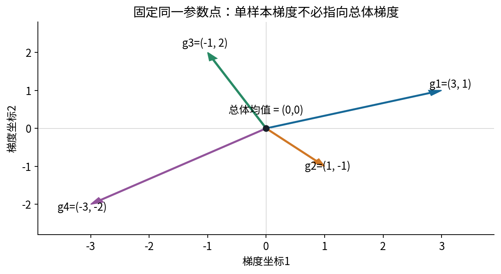
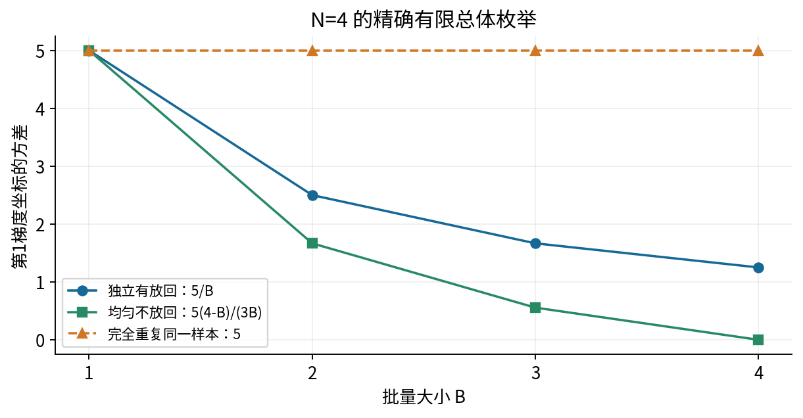
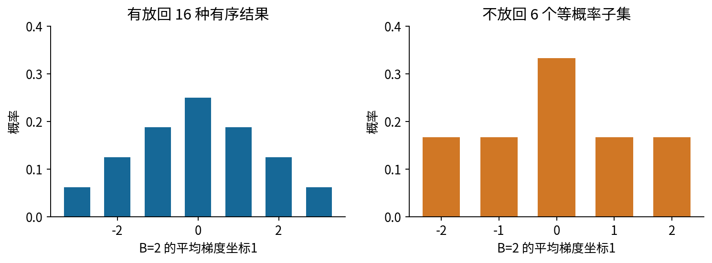
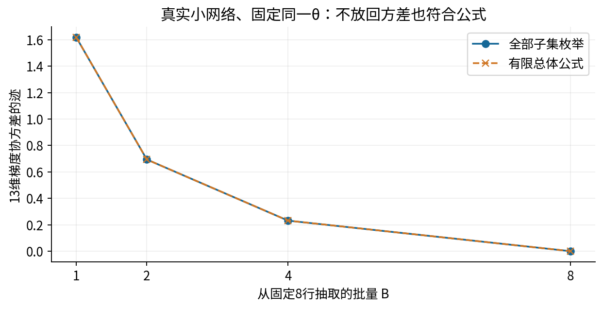
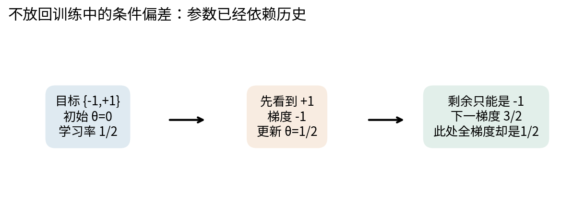
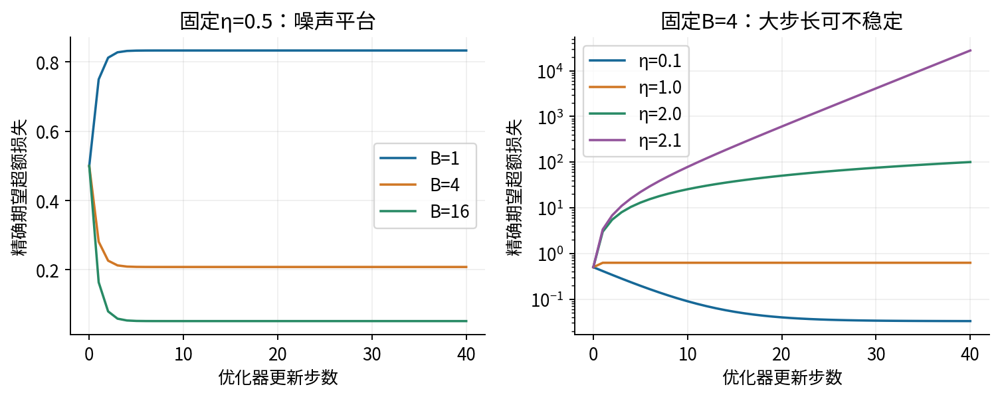
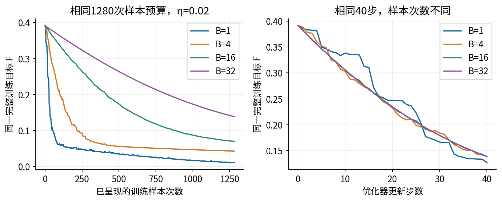
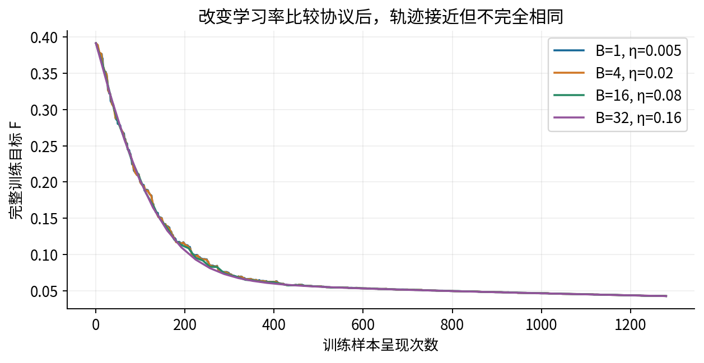
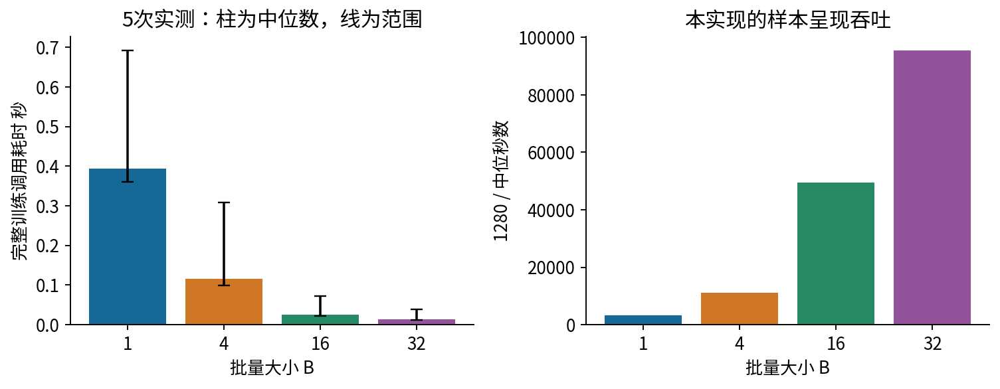

# 032 小批量随机梯度下降

## 1 少算一些样本为什么仍可能前进

031要求先确认损失和梯度确实实现了预定问题。本讲在这个前提下追问：每一步只计算少量样本的梯度，为什么还可能有效优化？代价体现在哪里？我们要同时区分三个问题：在固定参数点，梯度估计是否无偏；连续更新时，历史怎样改变抽样分布；在相同预算下，哪种实验比较才有明确含义。

先修011偏导梯度与链式法则、018期望方差与抽样误差、031梯度核验与最小调试法。向量按列理解，程序把多个样本沿第0轴堆叠。二阶几何可补读015，但本讲会说明用到的平滑性假设。数据和参数均无量纲，全为CPU合成实验；没有真实任务效果或泛化排名。

设固定训练数据有N个样本，参数$\theta\in\mathbb R^d$，第i行损失为$f_i(\theta)$。目标不是随便抽到哪几行就由哪几行决定，而是事先定义的有限平均：

$$F(\theta)=\frac1N\sum_{i=1}^Nf_i(\theta),\qquad
\nabla F(\theta)=\frac1N\sum_{i=1}^N\nabla f_i(\theta).$$

有限和的求导可以逐项进行，前提是这些项在该点可微。记$g_i=\nabla f_i(\theta)$。本节暂时把theta固定，g_i就是N个确定向量。它们相互抵消时，全梯度可能为0，但抽到的某一行梯度仍很大。

## 2 无偏说的是对哪个随机过程求平均

### 2.1 独立均匀有放回抽样

独立抽取索引$I_1,\ldots,I_B$，每次在1到N上均匀取值，允许重复。B为批量大小，批次估计为$\widehat g_B=B^{-1}\sum_{b=1}^Bg_{I_b}$。按期望的有限和定义：

$$E[g_{I_b}]=\sum_{i=1}^N\frac1N g_i=\nabla F(\theta),\qquad
E[\widehat g_B]=\frac1B\sum_{b=1}^BE[g_{I_b}]=\nabla F(\theta).$$

第二步只需各次抽样边缘均匀；独立性是后面简单方差公式的重要条件，不应偷偷合并成一个条件。无偏也不意味着每次都接近、不意味着每步都会下降，更不意味着训练目标反映了现实任务。

实际算法的theta由过去的样本与更新产生。严谨的逐步条件是：给定截至当前的历史，下一批仍按规定从全体数据独立均匀抽取，则$E[\widehat g_t\mid\text{历史}]=\nabla F(\theta_t)$。历史包含当前theta；不能在theta已经依赖抽样结果后，仍机械使用固定theta的推导。[S1][S2]

### 2.2 非均匀抽样改变了什么

若第i行以$p_i>0$抽取，且总和为1，直接用$g_I$得到的期望是$\sum_i p_i g_i$。它对应一个重新加权的目标，不一般等于原先均匀目标。若坚持优化原目标，可用$g_I/(Np_I)$：

$$E\left[\frac{g_I}{Np_I}\right]=\sum_i p_i\frac{g_i}{Np_i}=\frac1N\sum_i g_i.$$

分母抵消了选择概率，但很小的$p_i$会放大该行贡献，可能增加方差。若某个$p_i=0$而其梯度不为0，就没有这种有限权重修正；“从不看某些行”不能靠除法补回信息。

手算例：$f_i(\theta)=(\theta-a_i)^2/2$，$a=(-3,-1,1,3)$，theta=0时梯度是(3,1,−1,−3)。均匀目标梯度为0。取$p=(0.1,0.2,0.3,0.4)$，直接期望为$0.3+0.2-0.3-1.2=-1$。修正后的四个值为$(7.5,1.25,-5/6,-1.875)$，按相同p加权后恰为0。它们不是未经加权的新数据均值。

## 3 方差随批量变化需要哪些条件

### 3.1 向量的协方差写成矩阵

令$\bar g=N^{-1}\sum_i g_i$，定义总体协方差$\Sigma=N^{-1}\sum_i(g_i-\bar g)(g_i-\bar g)^T\in\mathbb R^{d\times d}$。第j个对角项是梯度坐标j的方差，非对角项描述两坐标的共同变化。这里分母为N，因为我们描述完整有限总体，不是用样本估计总体协方差。

对独立有放回的B次抽样，把误差向量相加后展开外积。交叉项期望为0，因为每项均值为0且相互独立；B个自身外积各给出Sigma。因此：

$$\operatorname{Cov}(\widehat g_B)
=\frac1{B^2}\left[B\Sigma+\sum_{a\ne b}E[(g_{I_a}-\bar g)(g_{I_b}-\bar g)^T]\right]
=\frac{\Sigma}{B}.$$

坐标标准差缩小为$1/\sqrt B$，不是$1/B$。整体平方误差期望$E\|\widehat g_B-\bar g\|^2=\operatorname{tr}(\Sigma)/B$，其中trace是对角项之和。把方差和标准差混用，会严重误判增加批量的收益。

### 3.2 均匀不放回有有限总体修正

一次从N行中均匀选择B个不同样本，参数仍固定。不同位置的索引不能相同，它们不是独立的。记中心化向量$u_i=g_i-\bar g$，有$\sum_i u_i=0$。两个不同位置的交叉外积期望为：

$$\frac1{N(N-1)}\sum_{i\ne j}u_i u_j^T
=\frac{-1}{N(N-1)}\sum_i u_i u_i^T
=-\frac{\Sigma}{N-1}.$$

中间一步来自$\sum_{i,j}u_i u_j^T=(\sum_i u_i)(\sum_j u_j)^T=0$，从全体项中减去i=j的项，就得到异索引项之和。带回B个自身项和$B(B-1)$个交叉项：

$$\operatorname{Cov}(\widehat g_B)=\frac1{B^2}\left[B\Sigma-\frac{B(B-1)}{N-1}\Sigma\right]
=\frac{N-B}{B(N-1)}\Sigma.$$

N>1且1≤B≤N。B=N时正好用全体，方差为0；B=1时回到Sigma。若采用分母N−1的样本协方差$S=\frac N{N-1}\Sigma$，同一公式也可写成$(1-B/N)S/B$；不要把两种分母混着用。

### 3.3 用全部可能结果检验公式

图1的四个梯度为$(3,1),(1,-1),(-1,2),(-3,-2)$。它们可以具体对应$f_i(\theta)=\|\theta\|^2/2+g_i^T\theta$在theta=0的梯度，因此不只是脱离函数的四个箭头。均值0，协方差为$\begin{pmatrix}5&1.5\\1.5&2.5\end{pmatrix}$。B=2时，独立有放回第1坐标方差为5/2；不放回为5/3。

不放回的六个子集在第1坐标上的均值是2、1、0、0、−1、−2，均值0，平方均值$(4+1+0+0+1+4)/6=5/3$。有放回有16种等概率有序结果，包括两次抽到同一样本；用同样有限和计算得到5/2。程序用Fraction进行这些有理数运算，不靠Monte Carlo误差“差不多相等”。

实际小网络在固定theta时，先分别计算前8行的13维单样本梯度，再枚举B=1、2、4、8的所有不放回子集，完整协方差矩阵也符合有限总体公式。固定theta很关键：不能把一次训练过程中不同theta处的梯度收在一起，再声称是在测同一个Sigma。

## 4 每轮打乱不等于每一步条件无偏

DataLoader的shuffle通常表示每个epoch重新排列样本，再逐批读取，不是在每一步独立从全体有放回抽样。[S3] 在固定theta上，一次均匀子集平均仍无偏；但真实训练在前一批后改变了theta，未读取的样本集合与历史相关，因此不能把固定theta结论直接移植到后续条件分布。

最小反例只需两行：目标$a_1=-1,a_2=1$，$f_i(\theta)=(\theta-a_i)^2/2$，初始theta=0，学习率1/2，B=1。若先看到+1，梯度为−1，更新到theta=1/2。给定这个历史，剩余只能是−1，下一梯度必为3/2；但此刻全梯度是$(1.5-0.5)/2=0.5$。二者不同，不存在“再平均两个剩余选择”，因为只剩一个。

这不表示随机重排一定不好。它只是需要对应的分析，不能冒用独立抽样推导。Shamir的原始论文专门研究不放回方案；本讲读取其设定和相关性说明，不把该文特定凸问题的收敛结论扩展到这里的非凸小网络。[S2]

其他会破坏简单估计关系的情况包括：非均匀采样却不修正、按难度选择批次、跨样本相互作用的损失、训练模式BatchNorm让同一行输出依赖同批其他行、不同batch使用不同目标归约。Dropout或数据增强还引入额外随机性，必须说明期望是否也对这些随机源求平均。本讲主网络不含它们，专门隔离样本分组影响。

## 5 噪声如何出现在一次下降的界中

设F连续可微，梯度满足$\|\nabla F(u)-\nabla F(v)\|\le L\|u-v\|$，即梯度不会随参数任意快变化。L是平滑常数，不是损失值。对位移d，沿线积分给出$F(\theta+d)-F(\theta)=\int_0^1\nabla F(\theta+td)^Td\,dt$。加减$\nabla F(\theta)$，用上述界控制余项，得到：

$$F(\theta+d)\le F(\theta)+\nabla F(\theta)^Td+\frac L2\|d\|^2.$$

取$d=-\eta\widehat g$，给定历史后假设估计无偏，协方差为C。把$E\|\widehat g\|^2=\|\nabla F\|^2+\operatorname{tr}(C)$代入，得到：

$$E[F(\theta-\eta\widehat g)\mid\text{历史}]
\le F(\theta)-\eta\left(1-\frac{L\eta}{2}\right)\|\nabla F(\theta)\|^2
+\frac{L\eta^2}{2}\operatorname{tr}(C).$$

这里前一个负项是平均梯度带来的下降，后一个正项是噪声的代价；接近驻点时梯度平方变小，固定步长下噪声可能占主导。独立均匀批次使C=Sigma/B，所以增大B可以缩小这个项；但不能不受限制地增大学习率，因为下降系数也随eta变化。[S1]

这是一次条件期望上界，不保证每一次实际下降，也不是全局最优证明。本讲没有给13参数非凸网络估计全局L，更没有将0.02宣称为理论保证的最大学习率。随机重排的条件无偏已经失效时，也不能原封不动引用这个不等式的无偏化简。

## 6 一个能完全解出的噪声平台

继续用四个目标(−3,−1,1,3)和标量模型$\widehat y=\theta$。全目标为$F(\theta)=\theta^2/2+2.5$，最优theta=0、最小值2.5。每步独立有放回抽B个目标，均值$\bar a_t$满足期望0、方差5/B：

$$\theta_{t+1}=(1-\eta)\theta_t+\eta\bar a_t.$$

由于本步抽样独立于历史，均值$m_{t+1}=(1-\eta)m_t$；方差$V_{t+1}=(1-\eta)^2V_t+\eta^2(5/B)$。从确定theta0=1出发，$m_t=(1-\eta)^t$，$V_t=\eta^2(5/B)\sum_{k=0}^{t-1}(1-\eta)^{2k}$。这两式逐步区分了均值收缩和随机波动。

若0<eta<2，几何级数收敛，$V_\infty=5\eta/[B(2-\eta)]$，期望超额损失$E[F-F^*]=(m_t^2+V_t)/2$趋于$5\eta/[2B(2-\eta)]$。所以均值到0不代表每条轨迹到0。eta=2时均值交替、方差线性增长；eta>2时收缩系数绝对值超过1，这个模型已不稳定。

把B增加若干倍并同比增加eta，在eta很小、曲率效应可忽略的近似里，可能保留某些按样本预算的变化尺度；但精确公式中还有2−eta分母，稳定性边界更不会随B无限移动。后续学习率调度将在033展开，这里只把线性缩放作为待检验的比较协议，不当普遍定律。

## 7 同一小网络的一次批次更新完整展开

主实验32行固定合成训练数据，2→3→1 tanh网络，共13参数，无Dropout或BatchNorm。设$X\in\mathbb R^{B\times2}$、$W\in\mathbb R^{3\times2}$、$b\in\mathbb R^3$、$v\in\mathbb R^{1\times3}$、c为标量。前向为$A=XW^T+b$、$H=\tanh A$、$\widehat Y=Hv^T+c$，目标是$L_B=\sum_i(\widehat y_i-y_i)^2/(2B)$。这里特意有1/2，与030定义相差常数，不能沿用未经检查的梯度因子。

参数按W逐行6项、b的3项、v的3项、c的1项打包。初始$W=\begin{pmatrix}.3&-.2\\-.4&.1\\.2&.25\end{pmatrix}$，$b=(.05,-.1,.15)$，$v=(.4,-.3,.2)$，c=.1。第一个B=4批次固定ID为25、9、6、4：

| ID | x1 | x2 | y | A的三项 | 预测 |
|---|---:|---:|---:|---|---:|
| 25 | −0.75 | 0 | −0.525 | (−0.175, 0.2, 约0) | −0.028507 |
| 9 | 1 | −1 | 0.87 | (0.55, −0.6, 0.1) | 0.481257 |
| 6 | 0 | 0 | −0.03 | (0.05, −0.1, 0.15) | 0.179661 |
| 4 | 0.75 | −0.6 | 0.675 | (0.395, −0.46, 0.15) | 0.409067 |

第0行的仿射第一项为$(-.75)(.3)+0(-.2)+.05=-.175$；tanh后$h\approx(-.173235158,.197375320,0)$；输出$0.4h_0-0.3h_1+0.2h_2+0.1\approx-.028506659$。第三个仿射值在实际float64中约−2.78e−17，不把浮点结果谎称为严格实数0。

四个残差依次为$(.496493341,-.388743446,.209660755,-.265932665)$；平方求和除以8得到$L_B=.06403811492518503$。对每个预测的局部梯度是残差除B，所以$G=\bar{\widehat Y}\approx(.124123335,-.097185862,.052415189,-.066483166)^T$，shape4×1。

输出仿射的局部导数给出$\bar v=G^TH$（1×3）、$\bar c=\sum_iG_i$、$\bar H=Gv$（4×3）；tanh的局部导数给出$\bar A=\bar H\odot(1-H^2)$（4×3）；第一层给出$\bar W=\bar A^TX$（3×2）、$\bar b=\sum_i\bar A_{i,:}$（3）、$\bar X=\bar AW$（4×2）。横线表示损失对相应量的导数。

以第0行单元0为例，反向连续乘积为$.124123335\times.4\times(1-(-.173235158)^2)\approx.048159337$。它对$W_{00}$的贡献还要乘输入−.75，约−.036119503。其他三行贡献为−.029135525、0、−.017130270；相加得到−.082385298。共享参数必须累计四条路径，而不是只用第0行。

| 参数组 | 全部梯度 |
|---|---|
| W第0行 | (−0.082385298, 0.042839741) |
| W第1行 | (0.059778121, −0.030500000) |
| W第2行 | (−0.047614007, 0.027045223) |
| b | (0.017097199, −0.014352438, 0.002829351) |
| v | (−0.092502679, 0.100061751, −0.011780831) |
| c | 0.012869496 |

学习率.02，不用动量，逐量执行$\theta'=\theta-.02\bar\theta$。例如$W'_{00}=.301647706$，$v'_0=.401850054$，$c'=.099742610$。同一四行重新前向后预测约$(−.030592170,.484284827,.179496350,.411318705)$，损失约.06332898042307092。

first-batch-trace.json和Notebook保存所有中间量、shape、13梯度及全部更新前后值，包含更新后的所有前向坐标；正文的局部导数与累计规则让这些数字可以逐项追踪。测试用独立标量循环和13坐标有限差分核验，不通过读回同一份缓存来假装独立正确。

## 8 固定顺序之后还必须固定预算定义

我们预先保存40个打乱epoch，合计1280个样本ID。所有批量方案从同一条ID序列的开头读取，只改变如何分组；没有额外的随机初始化，起始13个参数完全相同。B取1、4、16、32；都用均值损失，不把sum归约导致的倍数变化藏进学习率。[S3]

第一组固定1280次样本呈现、学习率.02。四个B分别更新1280、320、80、40步，终点训练目标约.0108465、.0428222、.0701057、.1385584。第二组固定40步，样本呈现次数变成40、160、640、1280，目标约.1267437、.1385147、.1384830、.1385584。两组回答的问题不同。

一次样本呈现指该行参与了一次批次梯度计算，重复epoch会重复计数。它不是独立样本数量，也不是新的数据。完整训练风险日志需要额外前向，报告代码每步计算它以便教学；这些额外评价不计入“训练样本呈现预算”，且在计时程序中关闭，二者都已显式说明。

第三组仍固定1280次样本呈现，但用eta=.02×B/4：四个步长为.005、.02、.08、.16，终点训练目标都约.0428，却仍不逐点完全相同。这个例子展示结论对比较协议敏感。我们没有为每种B做独立超参数搜索，没有多个初始化与数据重复，也不使用测试集，因此不能宣称某个B全局更好。[S1]

## 9 计算预算还不等于运行时间

benchmark.py独立测量相同1280次样本预算的四个固定学习率方案。每种先完整预热一次，再重复5次并轮换运行顺序；计时用单调高分辨率perf_counter_ns。固定单CPU线程，记录原始纳秒值、最小/最大、中位数。PyTorch官方基准说明强调预热、线程数与重复测量；本程序使用Python计时器并明确规定自己的测量窗口。[S4][S5]

测量包含一次train(record=False)调用的输入校验、索引展开、线程设置、Tensor初始化、取批、前向、反向、更新与保护检查；不包含导入、读取原始数据、生成顺序、每步完整风险日志、最终核对与文件写入。不能把它说成“纯矩阵乘法时间”。主报告与计时分支的最终参数完全相同。

这次共享CPU观测的中位秒数，B=1、4、16、32依次约.394、.115、.0258、.0134；原始范围明显有波动。图中吞吐只用1280除以各自中位秒数。这里小网络和Python每步开销占有重要地位；没有GPU、设备传输、异步kernel或分布式通信，不能外推大模型吞吐。

确定性数值报告与运行时间分开保存。experiment.py不重写measured-timing.json；benchmark.py要求显式给新输出路径。Notebook可以重新计时，但不要求新秒数与旧秒数逐字节一致，也不把复用旧秒数称为重新测量。

## 10 练习与诊断要求

1. 不用记忆公式，展开B个中心化梯度的外积，推导独立有放回的协方差。若B次都是同一随机索引，哪一步失效？
2. 对四个向量、B=2，列出六个不放回子集的两个坐标均值，算完整协方差并与总体修正一致。
3. 非均匀标量例中推导−1偏差与重要性修正。解释p=0为何不能修复，修正后为何仍可能高方差。
4. 把条件偏差例的第一行改为−1，逐步求theta和下一梯度。为何不能据此断言随机重排一定劣于有放回？
5. 从标量更新式推导均值、方差及稳定区间。eta=.5、B=4时，长期期望超额损失是多少？
6. 沿同一ID25追踪一次2→3→1前向和反向，累计四行得到W00梯度，再做更新后的同批前向。核对全部13坐标，不只看loss。
7. 解释为什么固定40步与固定1280样本的图不能直接支持同一种效率结论。训练风险日志开销算在何处？
8. 怎样让“批量变大就同比增大学习率”的主张在本标量问题上失效？需要报告哪些时序、预算、超参数和时间细节才能让别人复核？

答案给出完整计算，实验指南给出独立运行与失败检查。下一讲继续讨论动量和学习率调度。来源[S1]—[S5]的具体页面与实际阅读范围见sources.md；所有数据、图与数值对照均为本课程原创实验。
