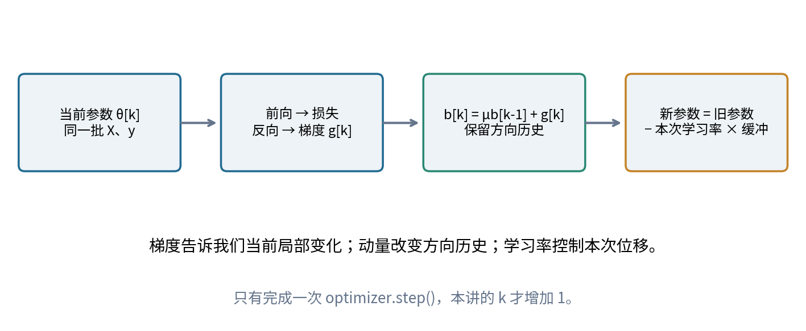
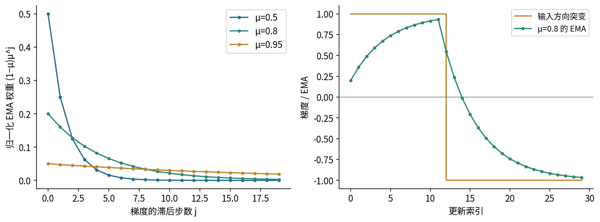
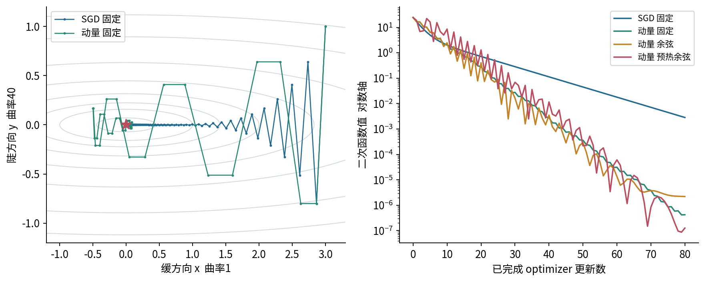
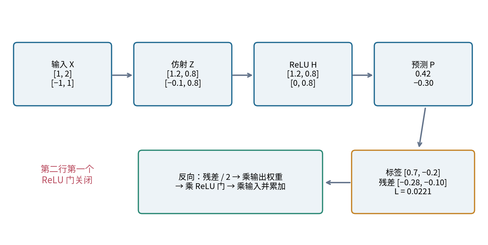
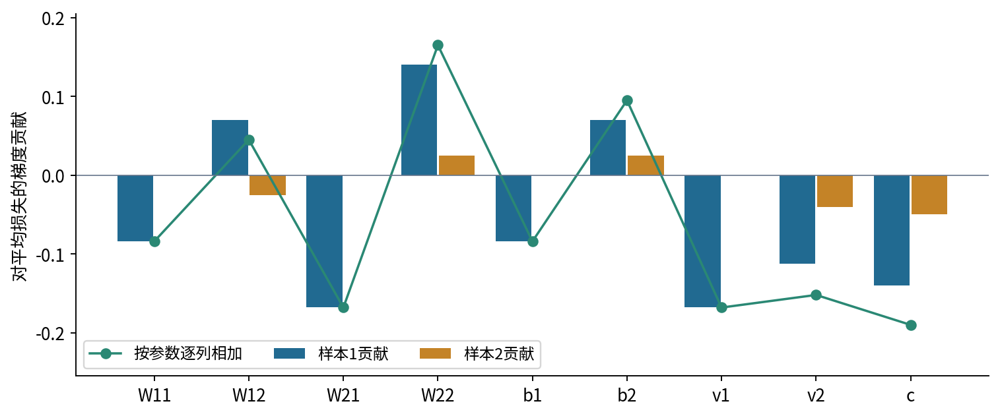
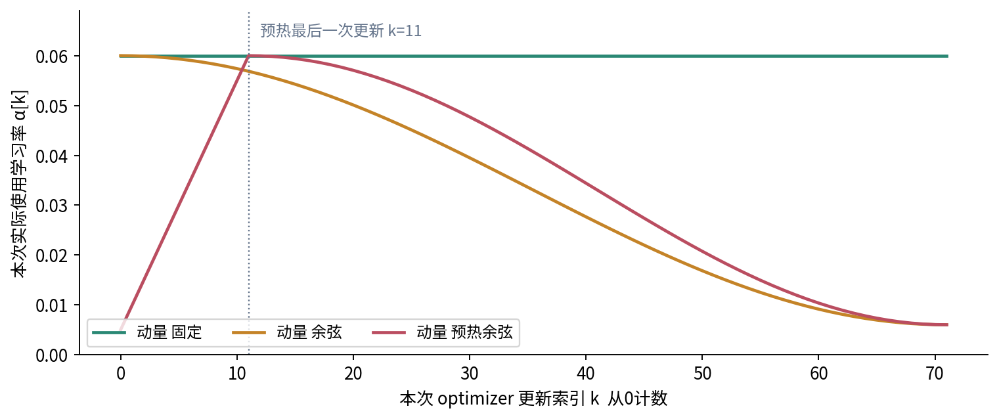
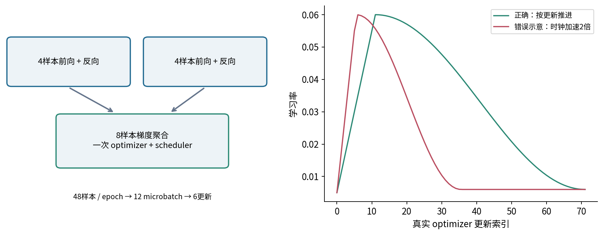
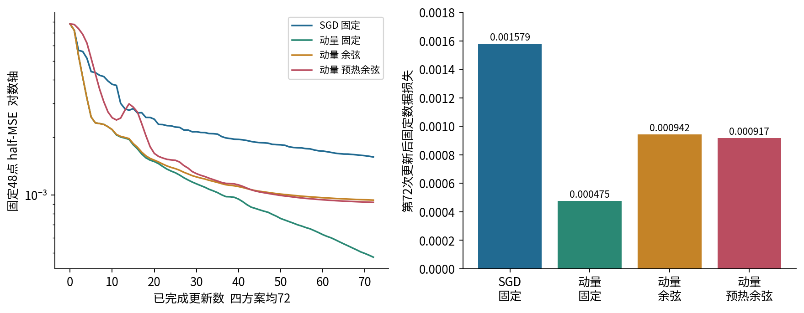
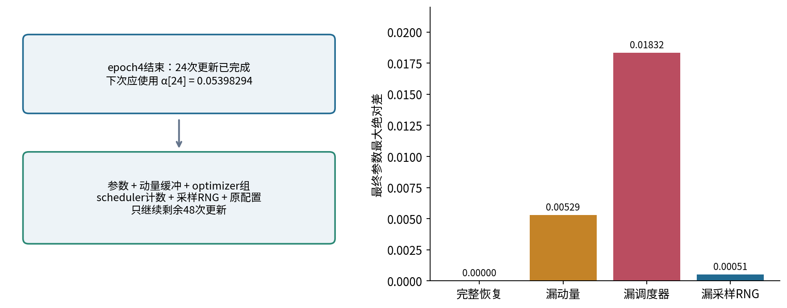

# 033 动量学习率与调度

惯性与随时间变化的步长怎样改变优化轨迹？

直接先修：[032 小批量随机梯度下降](../032/README.md)。本讲补齐需要用到的事实：批次损失先决定梯度，优化器再决定如何移动参数；累积几个微批次的梯度，不等于执行了几次参数更新。读完后，应能从同一组样本算出全部参数梯度，接上动量缓冲和学习率，解释下一次前向为什么变了，并核对恢复训练后的更新时钟。

我们先研究方向记忆，再研究步长随时间的变化。两者同时开启时，不能把损失下降简单归功于其中一个。本讲所有图和数值来自明确的CPU合成实验，不是大模型速度或泛化能力的证据。

## 1 先把梯度和更新分开

设参数向量为 $\theta_k\in\mathbb R^d$，$k=0,1,\ldots$ 表示本次参数更新的零起始索引。数据为 $(x_i,y_i)$，批次为 $B_k$。第032讲得到的梯度估计是

$$g_k=\nabla_\theta\left[\frac{1}{|B_k|}\sum_{i\in B_k}\ell_i(\theta_k)\right].$$

$g_k$ 与参数同形状。它描述当前位置附近损失怎样随参数变化，不包含“下一步该走多远”的完整决定。普通SGD使用 $\theta_{k+1}=\theta_k-\alpha_k g_k$。这里的 $\alpha_k$ 是本次实际使用的学习率，不是配置文件中永远不变的某个初值。正学习率配合负号，才表示沿梯度反方向走。

若采样满足第032讲的条件，批次梯度可能是全数据梯度的无偏估计。这个事实并不保证每一步损失都下降，也不保证连续批次彼此独立。引入动量后还会混合不同参数位置上的旧梯度，不能直接说动量缓冲仍是当前全梯度的无偏估计。

图1中的三个问题应分别检查：反向是否正确，方向历史是否正确，本次学习率是否正确。只观察loss，很难辨认哪一环出了错。下面会把这三环在一个9参数网络中逐项连接。

## 2 动量怎样形成方向记忆

### 2.1 从一次递推展开到所有历史

本讲使用经典梯度缓冲约定，关闭权重衰减、dampening和Nesterov。设 $0\leq\mu<1$，初始缓冲 $b_{-1}=0$。每次先合成缓冲，再更新参数：

$$b_k=\mu b_{k-1}+g_k,\qquad \theta_{k+1}=\theta_k-\alpha_k b_k.$$

$b_k$ 与 $g_k$ 的形状、量纲相同；$\mu$ 没有单位。$\alpha_k b_k$ 与参数同量纲。在本讲的无量纲合成例中，数值可以直接相乘，但真实参数换单位后，同一个学习率数值未必有同样含义。

逐步展开，而不是只记结论：$b_0=g_0$；$b_1=\mu g_0+g_1$；把这个表达式代回第三步，得到 $b_2=\mu^2g_0+\mu g_1+g_2$。因此

$$b_k=\sum_{j=0}^{k}\mu^j g_{k-j}.$$

新的方向权重为1，前一步方向权重为 $\mu$，更久以前的方向按几何级数衰减。若某个方向多步同号，它们会叠加；若相邻步经常反号，会部分抵消。这里没有“看见将来”的能力。方向突然改变时，历史同样可能把参数继续推向旧方向。

### 2.2 动量缓冲与指数移动平均不是同一个数

通常把带归一化因子的指数移动平均写作 $m_{-1}=0$，并使用

$$m_k=\mu m_{k-1}+(1-\mu)g_k=(1-\mu)b_k.$$

有限时刻的权重和为 $(1-\mu)\sum_{j=0}^{k}\mu^j=1-\mu^{k+1}$，不超过1；当 $0<\mu<1$ 时小于1。若输入均值恒为 $\bar g$，则 $E[m_k]=(1-\mu^{k+1})\bar g$。除以 $1-\mu^{k+1}$ 可以消除这个零初始化造成的均值缩小；本讲的SGD动量没有做这项修正。第034讲会在另一种优化器中重新遇到偏差修正。

若梯度长期恒定为 $g$，$b_k$ 趋近 $g/(1-\mu)$。因此，同样的 $\alpha$ 和 $\mu=0.8$ 最终可产生约为普通SGD五倍的位移。这只是恒定梯度下的极限，不能当作任意网络的等效学习率定理。用EMA更新 $-\eta m_k$ 要与本讲完全一致，必须令 $\eta=\alpha/(1-\mu)$，并使用相同初始化。

图2说明“平滑”和“滞后”是同一机制的两个结果。由几何权重可得到一个粗略记忆长度 $1/(1-\mu)$；它不是只保留最后这么多项的硬窗口。更精确的权重半衰期为 $\log(1/2)/\log\mu$，仅对 $0<\mu<1$ 有意义。

### 2.3 平滑噪声需要什么假设

为了隔离一个坐标的噪声，暂设 $g_k=\bar g+\varepsilon_k$，$\varepsilon_k$ 彼此独立、均值为0、方差为 $\sigma^2$。这些是假设，不是训练时自动满足的事实。独立性使交叉协方差项为0，所以

$$\operatorname{Var}(m_k)=(1-\mu)^2\sigma^2\sum_{j=0}^{k}\mu^{2j}=\sigma^2\frac{1-\mu}{1+\mu}(1-\mu^{2(k+1)}).$$

这是归一化EMA的方差。不能把它直接套到未归一化的 $b_k$；后者要再除以 $(1-\mu)^2$。实际梯度随参数改变、批次也可能相关，交叉项通常不能全删。代码用全部 $2^{10}=1024$ 个独立符号序列枚举核对这一理想公式，帮助理解假设的作用，而不是宣称真实网络已具有该方差。

## 3 狭长谷地为什么暴露优化器的差别

考虑二维函数 $f(x,y)=(x^2+40y^2)/2$。梯度是 $(x,40y)$，曲率分别为1和40。相同坐标距离在陡方向产生更大的梯度，等高线因而狭长。这里每次使用精确梯度，图中的“SGD固定”标签表示SGD更新规则，并没有额外采样噪声。

在曲率为 $\lambda>0$ 的一个特征方向上，固定步长SGD满足 $q_{k+1}=(1-\alpha\lambda)q_k$。要让误差趋近0，需要 $|1-\alpha\lambda|<1$，即 $0<\alpha\lambda<2$。对本函数两个方向都稳定，必须 $0<\alpha<0.05$。取 $\alpha=0.045$ 时，缓方向每步乘0.955，陡方向每步乘−0.8：前者慢，后者反复跨过谷底。

### 3.1 动量的二阶递推

在学习率固定且初始缓冲为0时，用 $q_{k-1}-q_k=\alpha b_{k-1}$ 消去缓冲，得到

$$q_{k+1}=(1+\mu-\alpha\lambda)q_k-\mu q_{k-1}.$$

第一次可取 $q_{-1}=q_0$。设试探解为 $q_k=r^k$，特征方程是 $r^2-(1+\mu-\alpha\lambda)r+\mu=0$。只有两个根都落在单位圆内才渐近收敛。对 $0\leq\mu<1$，条件为 $0<\alpha\lambda<2(1+\mu)$；边界不能包含。附录练习会由二阶多项式的条件逐项核对这个区间。

这允许某些比普通SGD更大的稳定步长，却不保证更快或单调。复根带来振荡，重复或接近单位圆的根可能使收敛很慢。非凸网络、更改学习率或随机梯度的情形也不能由这个二维固定系数结论直接保证。

图3从 $(3,1)$ 出发，初始函数值24.5，固定学习率0.045，动量系数0.8。固定SGD在80次更新后约为0.002843，固定动量约为 $4.236\times10^{-7}$。这个例子展示了方向记忆的可能收益；中间的反弹同样应保留在图中，不能只挑终点讲故事。

### 3.2 调度时不能随意交换两种动量公式

另一种常见写法先累积“位移”：$v_k=\mu v_{k-1}+\alpha_k g_k$，然后 $\theta_{k+1}=\theta_k-v_k$。在恒定学习率下，令 $v_k=\alpha b_k$ 可与本讲对应。学习率改变后，这个对应一般不成立。

本讲真正的位移为 $d_k=\alpha_k b_k$。若前一次学习率大于0，则

$$d_k=\mu\frac{\alpha_k}{\alpha_{k-1}}d_{k-1}+\alpha_k g_k.$$

比值说明：在梯度缓冲约定中，当前学习率会重新缩放整个历史缓冲；位移缓冲约定则已把历史学习率包进旧位移。比较两个库、复现论文或改变学习率时，必须同时确认约定。PyTorch SGD官方说明明确提醒这类差别；本讲只验证无dampening的经典动量。[1]

## 4 从同一组数据走完两次前向反向和更新

这一节不是另开一个优化任务。两次更新都使用下面同一对样本，并保留全部9个参数。用小网络，是为了能逐条看见链式法则怎样汇合。

### 4.1 数据 参数和每个张量的方向

样本按行排列，$X$ 为 $(2,2)$，标签 $y$ 为 $(2,1)$。权重 $W$ 的行对应输入坐标，列对应隐藏单元。这与某些框架的Linear权重存放方向不同，程序直接写 $XW$，不依靠隐含转置。

$$X=\begin{bmatrix}1&2\\-1&1\end{bmatrix},\quad y=\begin{bmatrix}0.7\\-0.2\end{bmatrix},\quad W=\begin{bmatrix}0.5&-0.2\\0.3&0.4\end{bmatrix}.$$

$$b=(0.1,0.2),\quad v=\begin{bmatrix}0.6\\-0.5\end{bmatrix},\quad c=0.1.$$

这里网络偏置 $b$ 与前文的动量缓冲 $b_k$ 不同。为避免本节歧义，下文把动量缓冲写成 $u_k$。网络定义是 $Z=XW+b$、$H=\operatorname{ReLU}(Z)$、$P=Hv+c$。$Z,H$ 为 $(2,2)$；$v$ 在数学式中为 $(2,1)$，程序存储为长度2再增加列轴；$P$ 为 $(2,1)$；$c$ 是标量。损失是两样本half-MSE：$L=\sum_i(P_i-y_i)^2/(2n)$，$n=2$。

### 4.2 第一次前向 每一条乘加都能追溯

逐格算隐藏层：$Z_{11}=1(0.5)+2(0.3)+0.1=1.2$；$Z_{12}=1(-0.2)+2(0.4)+0.2=0.8$；$Z_{21}=(-1)(0.5)+1(0.3)+0.1=-0.1$；$Z_{22}=(-1)(-0.2)+1(0.4)+0.2=0.8$。

因此 $H_1=(1.2,0.8)$、$H_2=(0,0.8)$。第一行预测为 $P_1=1.2(0.6)+0.8(-0.5)+0.1=0.42$；第二行为 $P_2=0(0.6)+0.8(-0.5)+0.1=-0.30$。残差分别为−0.28和−0.10。逐样本损失为0.0392和0.005，取平均得 $L_0=0.0221$。

### 4.3 先列局部导数 再把它们相乘

“局部导数”只看相邻节点。例如 $\partial P_i/\partial H_{ij}=v_j$，此时暂不把更前面的ReLU或输入也乘进来。逐层的局部规则如下。

| 相邻节点 | 局部导数 | 本例数值或形状 |
|---|---|---|
| 样本损失到均值 | $\partial L/\partial\ell_i=1/n$ | 两个都是1/2 |
| 预测到样本损失 | $\partial\ell_i/\partial P_i=P_i-y_i$ | −0.28，−0.10 |
| 隐藏激活到预测 | $\partial P_i/\partial H_{ij}=v_j$ | 每行[0.6,−0.5] |
| 输出权重到预测 | $\partial P_i/\partial v_j=H_{ij}$ | 两行[1.2,0.8]、[0,0.8] |
| 输出偏置到预测 | $\partial P_i/\partial c=1$ | 两个都是1 |
| 预激活到ReLU | $\partial H_{ij}/\partial Z_{ij}=1[Z_{ij}>0]$ | 门矩阵[[1,1],[0,1]] |
| 隐藏权重到预激活 | $\partial Z_{ij}/\partial W_{aj}=X_{ia}$ | 使用对应样本对应输入 |
| 隐藏偏置到预激活 | $\partial Z_{ij}/\partial b_j=1$ | 每个样本各贡献一次 |

所有未连接坐标的局部偏导为0。本例预激活均不为0，不涉及ReLU不可导边界；程序在恰为0时采用框架的0次梯度约定，这不把该点变成经典可导点。

先从损失传到预测：$\delta P=(-0.14,-0.05)^T$。再乘输出权重，得到

$$\delta H=\begin{bmatrix}-0.14(0.6)&-0.14(-0.5)\\-0.05(0.6)&-0.05(-0.5)\end{bmatrix}=\begin{bmatrix}-0.084&0.070\\-0.030&0.025\end{bmatrix}.$$

接着逐元素乘ReLU门：$\delta Z=[[-0.084,0.070],[0,0.025]]$。第二行第一列被门截断，虽然 $\delta H_{21}=-0.030$，它不再传到该处预激活。这个0来自局部导数，而不是人为删掉样本。

### 4.4 共享参数为什么必须累加多条路径

同一个 $W_{12}$ 同时被两个样本使用，故

$$\frac{\partial L}{\partial W_{12}}=X_{11}\delta Z_{12}+X_{21}\delta Z_{22}=1(0.070)+(-1)(0.025)=0.045.$$

其余三个隐藏权重也逐项相加：$\partial L/\partial W_{11}=1(-0.084)+(-1)(0)=-0.084$；$\partial L/\partial W_{21}=2(-0.084)+1(0)=-0.168$；$\partial L/\partial W_{22}=2(0.070)+1(0.025)=0.165$。偏置梯度是样本轴求和，所以 $\partial L/\partial b_1=-0.084+0=-0.084$，$\partial L/\partial b_2=0.070+0.025=0.095$。

输出层仍要把样本路径加起来：$\partial L/\partial v_1=1.2(-0.14)+0(-0.05)=-0.168$；$\partial L/\partial v_2=0.8(-0.14)+0.8(-0.05)=-0.152$；$\partial L/\partial c=-0.14-0.05=-0.19$。注意，$\delta P$ 已包含除以2的均值因子，此处不能再除一次。

完整矩阵式 $\nabla_W L=X^T\delta Z$ 是以上四次求和的紧凑写法，不是跳过中间过程的理由。若继续求输入梯度，$\delta X=\delta ZW^T=[[-0.056,0.0028],[-0.005,0.010]]$，它会把两个隐藏分支的路径再次合并。输入不属于本例待更新的9个参数。

### 4.5 第一次动量更新和新的前向

设 $\mu=0.8$、$u_{-1}=0$、$\alpha_0=0.1$。因此 $u_0=g_0$，第一次更新与同学习率SGD一致。按如下统一顺序列全9个参数；后面的JSON和Notebook完全使用此顺序。

| 参数 | 原值 | 完整梯度 $g_0$ | 位移 $-0.1u_0$ | 更新后值 |
|---|---:|---:|---:|---:|
| $W_{11}$ | 0.5 | −0.084 | 0.0084 | 0.5084 |
| $W_{12}$ | −0.2 | 0.045 | −0.0045 | −0.2045 |
| $W_{21}$ | 0.3 | −0.168 | 0.0168 | 0.3168 |
| $W_{22}$ | 0.4 | 0.165 | −0.0165 | 0.3835 |
| $b_1$ | 0.1 | −0.084 | 0.0084 | 0.1084 |
| $b_2$ | 0.2 | 0.095 | −0.0095 | 0.1905 |
| $v_1$ | 0.6 | −0.168 | 0.0168 | 0.6168 |
| $v_2$ | −0.5 | −0.152 | 0.0152 | −0.4848 |
| $c$ | 0.1 | −0.190 | 0.0190 | 0.1190 |

现在真的用新参数重新算同一数据：$Z_1=[[1.2504,0.753],[-0.0832,0.7785]]$，$H_1=[[1.2504,0.753],[0,0.7785]]$。两个预测分别为 $1.2504(0.6168)+0.753(-0.4848)+0.119=0.52519232$ 和 $0.7785(-0.4848)+0.119=-0.2584168$。新残差为−0.17480768、−0.0584168，故 $L_1=0.0084925618773056$。这不是用旧梯度做的近似loss，而是一次新的前向结果。

### 4.6 第二次反向 旧梯度不会直接替代新梯度

第二次仍从新的残差出发：$\delta P=(-0.08740384,-0.0292084)^T$。此时输出权重已经变为[0.6168,−0.4848]，因此

$$\delta H=\begin{bmatrix}-0.053910688512&0.042373381632\\-0.018015741120&0.014160232320\end{bmatrix}.$$

ReLU门仍是[[1,1],[0,1]]，故 $\delta Z$ 仅把第二行第一列置0。局部导数 $\partial P/\partial v$ 改用新的 $H_1$，$\partial P/\partial H$ 改用新的 $v$；输入局部导数和偏置局部导数不变。比如新的 $\partial L/\partial W_{12}=0.042373381632-0.014160232320=0.028213149312$。两个样本对 $v_2$ 的贡献为−0.065815091520与−0.022738739400，相加为−0.088553830920。

这次令 $\alpha_1=0.05$。先算 $u_1=0.8u_0+g_1$，再对整个缓冲乘当前学习率。下表显示全部新梯度、全部缓冲和全部更新后参数；显示尾数按12位小数取舍，原始float64值在trace文件中。

| 参数 | 新梯度 $g_1$ | 新缓冲 $u_1$ | 第二次更新后值 |
|---|---:|---:|---:|
| $W_{11}$ | −0.053910688512 | −0.121110688512 | 0.514455534426 |
| $W_{12}$ | 0.028213149312 | 0.064213149312 | −0.207710657466 |
| $W_{21}$ | −0.107821377024 | −0.242221377024 | 0.328911068851 |
| $W_{22}$ | 0.098906995584 | 0.230906995584 | 0.371954650221 |
| $b_1$ | −0.053910688512 | −0.121110688512 | 0.114455534426 |
| $b_2$ | 0.056533613952 | 0.132533613952 | 0.183873319302 |
| $v_1$ | −0.109289761536 | −0.243689761536 | 0.628984488077 |
| $v_2$ | −0.088553830920 | −0.210153830920 | −0.474292308454 |
| $c$ | −0.116612240000 | −0.268612240000 | 0.132430612000 |

以 $W_{11}$ 为例，历史项为 $0.8(-0.084)=-0.0672$，当前项为−0.053910688512；相加后乘−0.05，位移是0.0060555344256。因此 $0.5084+0.0060555344256=0.5144555344256$。其余参数遵循同样运算，不能把更新后的某个权重提前带入同一步其他参数的梯度。

第二次更新后的新预激活为[[1.2867332065536,0.7200719622784],[−0.0710889311488,0.7635386269888]]。ReLU仍关闭同一位置，预测变为[0.6002412459735114,−0.2297098859883156]，loss为0.00270862158258904。至此，同一数据上的“前向→损失→局部导数→路径求和→全梯度→动量更新→新前向”已经闭合两次。

`outputs/trace.json`保存两次全部张量、shape、局部导数、每样本9参数贡献、autograd梯度、缓冲、位移以及下次前向。测试用独立Fraction有理数算术核对两次结果，并对18个参数时点坐标做中心差分；因此不只是把同一PyTorch函数调用两次相互印证。

## 5 学习率调度必须先说明横轴

学习率调度就是规定 $\alpha_k$ 怎样随一个明确的时钟改变。固定、分段衰减、指数衰减、线性衰减和余弦衰减都只是可选形状。它们不改变目标函数，也不会自动修复错误梯度。

例如按更新计数的阶梯衰减可写为 $\alpha_k=\alpha_0\gamma^{\lfloor k/s\rfloor}$，$0<\gamma<1$，$s$ 的单位必须是“更新次数”。若按epoch调用调度器，同一个数值 $s$ 的含义就变成epoch数。官方StepLR文档的示例采用epoch末调用；不能只抄参数名而不抄调用位置。[2]

### 5.1 本讲的离散余弦端点

设原定总更新数为 $T\geq2$，峰值 $\alpha_{\max}>0$，下限 $0\leq\alpha_{\min}\leq\alpha_{\max}$。不预热时，使用

$$\alpha_k=\alpha_{\min}+\frac{\alpha_{\max}-\alpha_{\min}}2\left[1+\cos\left(\pi\frac{k}{T-1}\right)\right],\quad 0\leq k<T.$$

于是第0次使用峰值，第 $T-1$ 次已经使用下限。程序在 $k\geq T$ 时保持下限，但训练主循环仍在原定 $T$ 次处结束。这个离散端点约定必须明确：如果直接用CosineAnnealingLR且设T_max=T，最后一次更新前的计数通常为T−1，学习率尚未到下限。本讲以LambdaLR表达自己的函数，没有声称与所有余弦实现端点一致。[3]

### 5.2 预热改变早期步长而非创造正确梯度

预热长度 $W$ 以更新次数计，$1\leq W<T$。本讲前 $W$ 次使用 $\alpha_k=\alpha_{\max}(k+1)/W$，所以第一步不是0。这里的 $\alpha_{\min}$ 只指衰减阶段下限，预热可以更低。之后令 $q_k=(k-W+1)/(T-W)$，代入同一个余弦形状。第 $W-1$ 次恰好到峰值，下一次开始下降，最后一次到下限。$W=0$ 单独使用上一节的无预热公式。

用 $T=72,W=12$ 检查边界：$\alpha_0=0.005$，$\alpha_{11}=0.06$，$\alpha_{12}\approx0.0599629974384$，$\alpha_{71}=0.006$。先用这些值测试函数，比看一条“似乎平滑”的图更可靠。

预热常用于降低训练早期大步长的风险。Goyal等人的研究是在ImageNet大批次训练等具体条件下考察渐进预热，不是“所有网络必须预热”的定理。[4] 小步长、良好初始化或很短的预算中，预热可能没有收益，甚至消耗宝贵的有效更新。是否使用应由明确定义的比较决定，而不是把warmup当作必选开关。余弦衰减也不等于周期重启；本讲没有实现SGDR的重启部分。[5]

## 6 epoch 微批次和optimizer step不能混用

本实验48个样本，每个microbatch有4个样本，每2个microbatch累积一次梯度。因此每epoch读取12个microbatch，却只更新参数6次。12个epoch共144次微批次前后向、72次optimizer更新、576次样本呈现。三种计数都正确，只是单位不同。

每个累积窗口有8个样本，我们对每个微批次计算“该微批次的平方误差和除以 $2\times8$”，再反向。两个微批次的梯度相加，恰好是8样本half-MSE的梯度。若各微批次先取自己的均值，应再按样本数加权；尾部大小不等时不能一律除以累积次数。本讲为了聚焦时钟，要求每个窗口大小相同且完整，遇到不整除配置会拒绝。

图7右侧的错误曲线是 $\alpha_{2k}$ 的重采样示意，并非调用错误PyTorch代码产生的训练结果。它说明同一“72步”曲线若按微批次推进，两倍速度走完，在真实第36次更新时就已落到下限。真实错误循环还可能叠加先后顺序错位，必须记录实际LR来定位。

正确控制顺序是：清梯度；对本窗口各microbatch前向和反向；读取并记录optimizer当前LR；optimizer.step；scheduler.step，为下一次更新准备LR。PyTorch文档提醒，把scheduler.step放到optimizer.step之前会跳过第一个调度值。[6] 日志中的`lr_used`记录的是刚完成那次更新使用的值，`lr_next`记录的是调度器随后准备的值，两者不能混用。

若使用按epoch调度，应该在epoch末只调用一次，并用epoch为单位设置参数。若根据验证指标调整LR，则还涉及指标、评估时机和调度器自身规则；那不是本讲这种纯计数函数。分布式训练、溢出跳步或token预算也可能需要不同的有效更新时钟，本实验没有验证这些情形。

## 7 小网络比较要保留预算与不确定性

实验网络仍为2→2 ReLU→1，共9参数，初始化与手算相同。训练数据另用明确标记的48点合成网格，标签规则为

$$y=0.5\max(x_1+0.6x_2,0)-0.3\max(-0.3x_1+x_2,0)+0.1.$$

数据无下载、无噪声，生成规则在data说明中公开。每epoch用同一独立随机生成器产生排列，四方案看到完全相同的样本顺序。比较的是固定SGD、固定动量、动量加余弦、动量加预热余弦；动量系数0.8，峰值LR0.06，下限0.006，预热12次。它们均执行72次更新，不偷偷延长某个方案的预算。

每次更新后重新评估全部固定48点的half-MSE，因而曲线不是不同批次的在线loss混合。评估无Dropout或BatchNorm，不消费采样随机状态。这是训练集拟合诊断，没有独立验证/测试集，不能由曲线宣称泛化改善。

| 方案 | 第72次更新后固定数据half-MSE |
|---|---:|
| 固定SGD | 0.001579432708 |
| 固定动量 | 0.000475008974 |
| 动量加余弦 | 0.000941834813 |
| 动量加预热余弦 | 0.000916935825 |

图8不支持“调度一定胜过固定步长”。在这组峰值、初始化和短预算下，固定动量终点更低；预热余弦仅略低于不预热余弦。这是一个事先固定配置的机制演示，没有为每个方法系统调参或跨多种任务做统计比较。若要推荐真实训练方案，需给每个候选合理调参预算，用独立评价数据比较，并记录不同随机种子的波动。

## 8 恢复训练必须恢复时间和方向历史

### 8.1 本讲的恢复边界

在第4个epoch全部结束后保存，也就是完成24次optimizer更新并完成对应scheduler.step之后、生成下一个epoch排列之前。此时scheduler的`last_epoch`等于24，虽然字段名里有epoch，这里它数的是调度调用次数。下一次更新索引为24，应使用约0.05398294095933821；原总预算仍是72，所以只继续48次更新。

检查点包含：参数、动量缓冲、optimizer参数组、scheduler状态、专用采样生成器状态、配置、数据摘要、框架版本、完成epoch数、已有逐步日志和样本顺序。它是有界JSON，不加载pickle。外层摘要检查意外改动，但不是对抗性真实性保证；不能把自带校验和当作任意外来文件可信的依据。

本模型初始参数写死，训练唯一随机源是显式的采样Generator；没有Dropout、随机增强或随机初始化。因此不消费全局PyTorch/NumPy随机状态，也不声称保存了它们。加入新的随机算子后，必须重新识别和保存所有相关状态。此处在完整epoch边界恢复，下一次先zero_grad，旧梯度无需保存；若在累积窗口中间中断，这个前提就失效。

### 8.2 构造和载入顺序也要核对

先按原配置重建同一模型、optimizer和LambdaLR，再载入scheduler状态与optimizer状态，并恢复参数和采样RNG。不能只设置`last_epoch`而遗漏optimizer的当前LR，也不能让重建scheduler时的初始化把已载入的LR覆盖。LambdaLR的普通函数定义不随state_dict保存，必须保留原函数实现和原配置；只保存那个字典不足以重建任意调度。[7]

验证不是“最后loss差不多”。本讲比较全部参数、缓冲、optimizer组、scheduler状态、采样RNG、每次更新记录和全部排列，且检查最终JSON逐字节一致。另用新的Python进程从交付的epoch4检查点恢复，继续原预算后比较同一最终状态文件。

### 8.3 三个故意漏状态的反例

| 恢复方式 | 最终参数最大绝对差 | 全部样本顺序是否相同 |
|---|---:|---|
| 完整恢复 | 0 | 是 |
| 丢失动量缓冲 | 0.005287684053 | 是 |
| 丢失scheduler状态 | 0.018318295789 | 是 |
| 丢失采样RNG | 0.000507181793 | 否 |

漏scheduler的情况尤其容易误判：由于optimizer带回了当前LR，恢复后的第一步仍用正确的0.05398294；随后未恢复的调度时钟从头推进，下一步变成0.01，而正确值应约为0.05306491。因此只打印恢复瞬间的LR还不够。

漏采样RNG时，最终loss甚至略低于完整恢复。这不代表错误恢复“成功了”，更不代表泛化变好；轨迹已变，复现实验的声明不成立。完整预算已经结束时，程序会拒绝把“恢复”当作再训练12个epoch。若确实要延长预算，那是新的实验，应重新标明调度定义及与旧实验的关系。

## 9 可以迁移的检查习惯

先写下更新式和缓冲初始化，确认学习率位于递推的哪里。再写清横轴和端点，列出首步、预热结束、第一次衰减、最后一步的实际LR。随后用同一数据核对一次完整反向和更新，最后才比较训练曲线。

失败时应区分：梯度错、学习率错、计数错、状态缺失、步长在该曲率下不稳定，以及实验比较预算不一致。增大动量或延长预热不是通用修复手段。动量不能替代正确数据和正确反向；调度也不能把错误恢复变成原来的训练。

练习：1）从两步递推推导EMA权重和；2）解释图3的两方向系数并核对稳定区间；3）独立重算第4节 $W_{12}$ 两次梯度和位移；4）把48样本改为50，指出当前累积函数为什么拒绝并设计正确归约；5）写出原预算72、已完成24时应恢复的全部状态；6）解释漏scheduler时第一步正确但第二步错的原因。完整推导与数值见单独的答案，程序操作见实验指南。

## 来源与使用范围

[1] [PyTorch 2.7 SGD](https://docs.pytorch.org/docs/2.7/generated/torch.optim.SGD.html)，动量约定。[2] [StepLR](https://docs.pytorch.org/docs/2.7/generated/torch.optim.lr_scheduler.StepLR.html)，调度单位。[3] [CosineAnnealingLR](https://docs.pytorch.org/docs/2.7/generated/torch.optim.lr_scheduler.CosineAnnealingLR.html)，余弦端点。

[4] [Goyal等 2017](https://arxiv.org/abs/1706.02677)，预热的实验条件。[5] [Loshchilov与Hutter 2017](https://arxiv.org/abs/1608.03983)，SGDR背景。[6] [PyTorch优化器文档](https://docs.pytorch.org/docs/2.7/optim.html)，调用次序。[7] [LambdaLR官方源码](https://github.com/pytorch/pytorch/blob/v2.7.1/torch/optim/lr_scheduler.py)，函数保存行为。经典动量另见[Sutskever等 2013](https://proceedings.mlr.press/v28/sutskever13.html)第2节。

正文推导、手算、图与合成实验均独立编写。实际查阅范围及访问重试记录见sources.md和source-checks.json。
