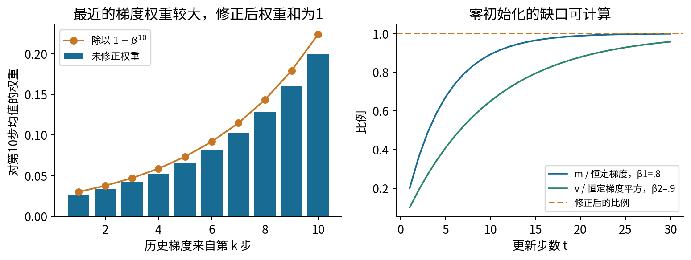
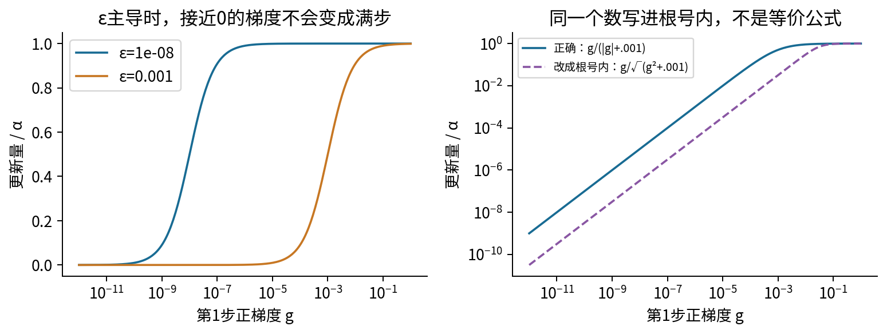
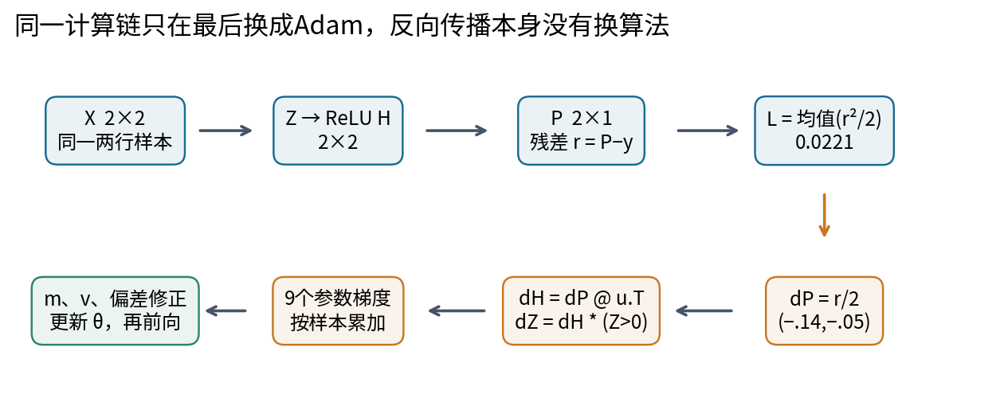
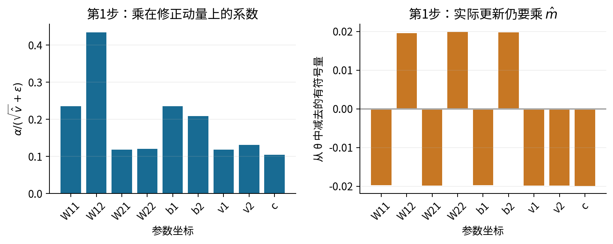
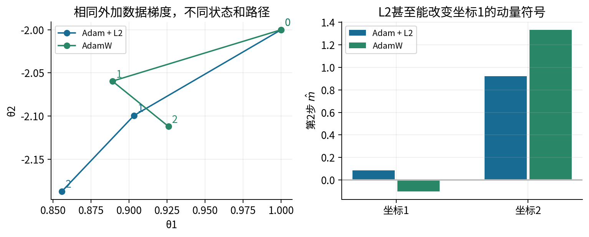
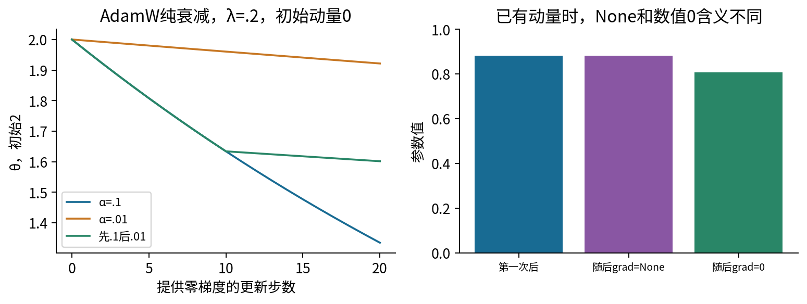
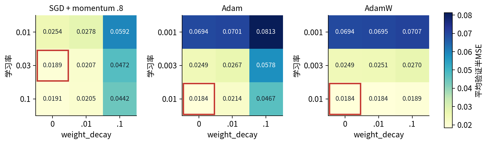
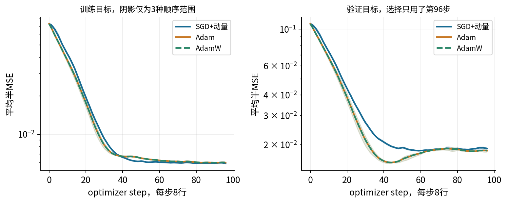
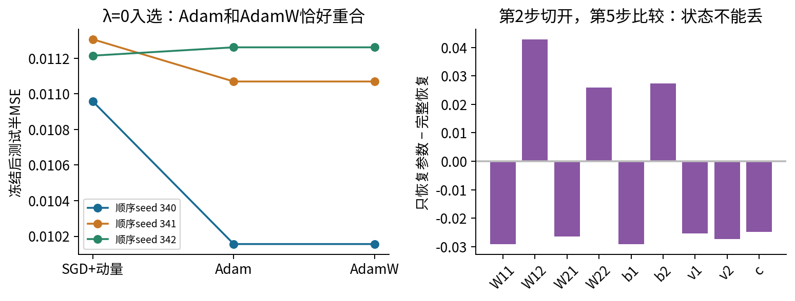

# 034 自适应优化器与权重衰减

这一讲追踪同一个问题：已经正确算出的梯度，为什么进入SGD、Adam或AdamW以后会产生不同的参数轨迹？读完应能把数据、前向计算、损失、每条反向路径、两个历史状态和参数更新连成一条完整计算链；也应能判断一次“优化器更好”的实验究竟比较了什么。

先修033中的动量、指数移动平均和optimizer step；需要027的批次链式法则和031的梯度核验。我们重新写出手算网络的全部数据，不需要从其他讲导入代码。正文公式和图均独立制作。主实验是小型合成回归，不能据此选定所有科研任务的优化器。

## 1 同一梯度还不足以决定下一步

设你已排查标签错位、损失归约、detach和梯度符号。两次训练在某一时刻参数相同、当前梯度也相同，下一步仍可能不同，因为优化器还带着历史状态。033的动量存一个方向累积量；Adam还存每个坐标过去的梯度平方大小。这个额外状态像一个逐坐标的尺度记录，不能解释为对真实曲率的完整测量。

本讲把两类问题分开处理。前半是算法正确性：公式怎样对应实际浮点更新；后半是研究比较：不同算法获得同样的训练和搜索预算后，在一个固定验证规则下发生了什么。正确实现不会自动推出泛化好；验证结果较好也不能修复错误实现。

记参数向量为$\theta\in\mathbb R^d$，第$t$次实际更新使用的学习率为$\alpha_t>0$。$g_t=\nabla_\theta L_{B_t}(\theta_{t-1})$在旧参数处计算，$L_{B_t}$是这一批的数据平均损失。以下平方、开方和除法都逐元素进行。为避免与网络输出权重混淆，网络的输出权重用$u$，优化器的二阶状态用$v_t$。

## 2 两个移动平均从哪里来

### 2.1 从一个坐标展开递推

先忘记网络，只看某一个梯度坐标。取$0\leq\beta_1<1$、$m_0=0$：

$$m_t=\beta_1m_{t-1}+(1-\beta_1)g_t.$$

第1次和第2次分别是$m_1=(1-\beta_1)g_1$，以及

$$m_2=\beta_1(1-\beta_1)g_1+(1-\beta_1)g_2.$$

再展开一次得到三项，继续代入便得到

$$m_t=(1-\beta_1)\sum_{k=1}^{t}\beta_1^{t-k}g_k.$$

最新梯度的权重是$1-\beta_1$，往前一格再乘一次$\beta_1$。权重和不是1，而是有限等比数列：

$$(1-\beta_1)(1+\beta_1+\cdots+\beta_1^{t-1})=1-\beta_1^t.$$

因此若所有$g_k$恰好恒为$a$，原始$m_t=(1-\beta_1^t)a$，起步时偏向零。除掉已知的权重缺口，定义

$$\widehat m_t=\frac{m_t}{1-\beta_1^t}.$$

这样恒定输入被原样还原。也可以把它理解为将已有历史的权重重新归一化。若各时刻梯度的期望相同且有限，利用期望的线性性可证明$E[\widehat m_t]=E[g_t]$；这一结论不需要梯度彼此独立。若参数在变、梯度分布也在变，归一化后的量仍是历史期望的加权平均，不会自动变成“当前真实梯度的无偏估计”。032对条件历史的提醒仍然适用。

### 2.2 平方的平均不是方差

第二个状态使用$0\leq\beta_2<1$：

$$v_t=\beta_2v_{t-1}+(1-\beta_2)g_t^2,\qquad v_0=0.$$

同样展开有$v_t=(1-\beta_2)\sum_{k=1}^t\beta_2^{t-k}g_k^2$，再定义$\widehat v_t=v_t/(1-\beta_2^t)$。它记录二阶原点矩，即平方的平均，不是减过均值的方差。对一个恒为2的梯度，方差为0，而二阶原点矩为4；Adam的分母并不会因此变成0。

$\beta_1$与$\beta_2$可以不同，意味着两种状态看历史的速度不同。常说的“记忆长度约$1/(1-\beta)$”只是几何权重的时间尺度直观，没有一个到点就把旧梯度全部删掉的窗口。平方会消除符号：两个坐标都有大$\widehat v$，并不说明它们最近都指向同一方向。

### 2.3 Adam把方向和尺度组合起来

基本Adam不含权重衰减时，在算完两个状态与偏差修正后，执行

$$\theta_{t,j}=\theta_{t-1,j}-\alpha_t\frac{\widehat m_{t,j}}{\sqrt{\widehat v_{t,j}}+\epsilon},\qquad\epsilon>0.$$

先读分子：它保留带符号的历史方向；再读分母：它使用历史平方的均方根尺度。$\alpha_t/(\sqrt{\widehat v_{t,j}}+\epsilon)$是乘在$\widehat m_{t,j}$上的系数，不是乘在当前$g_{t,j}$上的固定“学习率”。动量和当前梯度可以异号，因此仅观察当前梯度大小无法还原更新方向。

顺序很重要：在旧参数处得到数据梯度，更新$m,v$，用本次实际计数$t$做修正，再改变参数。$\beta^t$是幂，不是$\beta\times t$。单个参数若被框架跳过，本次计数是否增加要核对实现；第6节实际检查这个边界。

这一基本算法与偏差修正的文献入口是Kingma和Ba的[Adam论文算法1及第2至3节](https://arxiv.org/pdf/1412.6980)。本讲推导和数值例子自行展开；没有把论文的理论条件或某个基准结果当成当前非凸网络的收敛保证。

## 3 epsilon和尺度不只是防止程序报错

第1步$\widehat m_1=g_1$、$\widehat v_1=g_1^2$，所以每个非零坐标的更新为$-\alpha g/(|g|+\epsilon)$。当$|g|\gg\epsilon$，大小接近$\alpha$；当$|g|\ll\epsilon$，大小近似$\alpha|g|/\epsilon$。这说明epsilon会改变小梯度区的实际动力学。$g=0$时分子为0，不是凭空产生一个满步。

本讲和PyTorch2.7的公式把epsilon放在根号外。若把相同的数写成$\sqrt{\widehat v+\epsilon}$，就改了算法，还改变了epsilon应具有的量纲：根号外与梯度同量纲，根号内则与梯度平方同量纲。比如$g=10^{-8},\epsilon=10^{-8}$，正确的第1步归一化大小为$1/2$；写进根号内约为$10^{-4}$，相差数千倍。

如果把所有历史梯度同乘正数$c$，在同一已给定梯度序列上有$\widehat m'=c\widehat m$、$\widehat v'=c^2\widehat v$，于是比例变为

$$\frac{c\widehat m}{c\sqrt{\widehat v}+\epsilon}=\frac{\widehat m}{\sqrt{\widehat v}+\epsilon/c}.$$

只有epsilon忽略不计时才近似不变；epsilon随$c$一起缩放时才有这一步的严格代数等价。不能由此断言任意参数重参数化、混合精度、梯度裁剪、权重衰减和损失缩放都等价。它们还可能改变下一步参数、采样、溢出和历史状态。

也不要把“每次更新绝不超过$\alpha$”当通则。脚本令前999次给定梯度为0、第1000次为1，取$\beta_1=.9,\beta_2=.999,\epsilon=10^{-8}$，实际归一化更新约2.51457。不同记忆尺度加上稀疏历史足以打破这个口号。这是一个可直接核算的给定梯度序列，不是关于特定网络收敛性的反例或证明。

## 4 同一个网络的两次完整Adam更新

### 4.1 数据和形状先固定

沿用033的同一个两行、九参数ReLU例子，这次只更换优化器。将批次放在矩阵行上：

$$X=\begin{bmatrix}1&2\\-1&1\end{bmatrix},\quad y=\begin{bmatrix}.7\\-.2\end{bmatrix}.$$

$$W=\begin{bmatrix}.5&-.2\\.3&.4\end{bmatrix},\quad b=(.1,.2),\quad u=\begin{bmatrix}.6\\-.5\end{bmatrix},\quad c=.1.$$

$X$为$2\times2$，$W$为输入坐标乘隐藏坐标的$2\times2$矩阵；$b$有2个数，沿两行广播；$u$为$2\times1$；$c$是标量。参数顺序固定为$(W_{11},W_{12},W_{21},W_{22},b_1,b_2,u_1,u_2,c)$，代码中后两个输出权重名为v1和v2，但它们不是优化器状态$v_t$。

$$Z=XW+b,\quad H=\operatorname{ReLU}(Z),\quad P=Hu+c,\quad L=\frac12\sum_{i=1}^{2}\frac{(P_i-y_i)^2}{2}.$$

这里外面的$1/2$来自两行取平均，里面的$1/2$来自半平方误差。等价写法是$L=(r_1^2+r_2^2)/4$。不能把两个平均因子混成“框架总会处理”。$Z,H$均为$2\times2$，$P,y,r$均为$2\times1$，最终$L$为标量。

本手算用$\alpha=.02,\beta_1=.8,\beta_2=.9,\epsilon=.001$，且权重衰减为0。较大的epsilon便于看清数值作用；这不是推荐默认值。每次使用同一两行数据，先清梯度，再进行一次真实optimizer.step。

### 4.2 第1次前向 每个乘加都可定位

四个仿射值逐一计算：$Z_{11}=1(.5)+2(.3)+.1=1.2$；$Z_{12}=1(-.2)+2(.4)+.2=.8$；$Z_{21}=(-1)(.5)+1(.3)+.1=-.1$；$Z_{22}=(-1)(-.2)+1(.4)+.2=.8$。因此

$$Z=\begin{bmatrix}1.2&.8\\-.1&.8\end{bmatrix},\quad H=\begin{bmatrix}1.2&.8\\0&.8\end{bmatrix}.$$

$P_1=1.2(.6)+.8(-.5)+.1=.42$，$P_2=0(.6)+.8(-.5)+.1=-.30$。残差为$(-.28,-.10)$，逐行半平方误差为$.0392,.005$，平均$L_0=.0221$。

### 4.3 第1次反向 先局部导数再累加路径

逐行损失$\ell_i=r_i^2/2$满足$\partial L/\partial\ell_i=1/2$、$\partial\ell_i/\partial P_i=r_i$。相乘得到$\bar P=\partial L/\partial P=(-.14,-.05)^\top$，不是未除批量的残差。

输出层每一行的局部导数为$\partial P_i/\partial H_{ij}=u_j$，$\partial P_i/\partial u_j=H_{ij}$，$\partial P_i/\partial c=1$。所以

$$\bar H=\bar P u^\top=\begin{bmatrix}-.084&.070\\-.030&.025\end{bmatrix}.$$

ReLU在这些非零输入处的局部导数是$M=1[Z>0]=\begin{bmatrix}1&1\\0&1\end{bmatrix}$；逐元素相乘给出

$$\bar Z=\bar H\odot M=\begin{bmatrix}-.084&.070\\0&.025\end{bmatrix}.$$

只有样本2到隐藏单元1的路径被关闭，不是整个样本2都失去梯度。仿射层的局部导数$\partial Z_{ij}/\partial W_{kj}=X_{ik}$，$\partial Z_{ij}/\partial b_j=1$；输出权重的路径使用$H_{ij}$。每个共享参数收到两条样本路径，必须相加。下表把乘法和相加都展开，已经包含平均因子。

|参数|样本1路径|样本2路径|总梯度|
|---|---|---|---|
|W11|1×(−.084)=−.084|(−1)×0=0|−.084|
|W12|1×.070=.070|(−1)×.025=−.025|.045|
|W21|2×(−.084)=−.168|1×0=0|−.168|
|W22|2×.070=.140|1×.025=.025|.165|
|b1|−.084|0|−.084|
|b2|.070|.025|.095|
|u1|(−.14)×1.2=−.168|(−.05)×0=0|−.168|
|u2|(−.14)×.8=−.112|(−.05)×.8=−.040|−.152|
|c|−.14|−.05|−.19|

若要把梯度继续送向输入，也有$\bar X=\bar ZW^\top$。样本1两个值分别为$(-.084)(.5)+(.070)(-.2)=-.056$、$(-.084)(.3)+(.070)(.4)=.0028$；样本2两个值为$0(.5)+.025(-.2)=-.005$、$0(.3)+.025(.4)=.010$。形状仍是$2\times2$。本实验不更新输入，只展示完整链路。

### 4.4 第1次状态和参数更新

初始$m_0=v_0=0$，故$m_1=.2g_1,v_1=.1g_1^2$；除以$.2,.1$之后，分别得到$g_1,g_1^2$。以W11为例：$m=-.0168,v=.0007056$；修正后$\widehat m=-.084,\widehat v=.007056$；分母$.084+.001=.085$，所以新值$.5-.02(-.084)/.085=.519764706$。

以下所有参数都按同一算法处理。展示的小数舍入仅为阅读，下一步程序继续使用float64全精度。

|参数|m1|v1|分母|更新后参数|
|---|---|---|---|---|
|W11|-0.0168|0.0007056|0.085|0.519764706|
|W12|0.009|0.0002025|0.046|-0.219565217|
|W21|-0.0336|0.0028224|0.169|0.319881657|
|W22|0.033|0.0027225|0.166|0.380120482|
|b1|-0.0168|0.0007056|0.085|0.119764706|
|b2|0.019|0.0009025|0.096|0.180208333|
|u1|-0.0336|0.0028224|0.169|0.619881657|
|u2|-0.0304|0.0023104|0.153|-0.480130719|
|c|-0.038|0.00361|0.191|0.119895288|

### 4.5 第2次前向 必须使用刚更新的九个值

不能只换几个输出权重，其他仍沿用旧值。以下保留9位有效数字便于对照。四个仿射乘加为：

$$Z_{11}=.519764706+2(.319881657)+.119764706=1.279292725.$$
$$Z_{12}=-.219565217+2(.380120482)+.180208333=.720884080.$$
$$Z_{21}=-.519764706+.319881657+.119764706=-.080118343.$$
$$Z_{22}=.219565217+.380120482+.180208333=.779894033.$$

ReLU仍只关闭位置(2,1)。接着$P_1=1.279292725(.619881657)+.720884080(-.480130719)+.119895288=.566786791$；$P_2=.779894033(-.480130719)+.119895288=-.254555795$。

残差为$-.133213209,-.054555795$，逐行半平方误差为$.00887287958,.00148816736$，平均$L_1=.005180523473$。这既是第1次更新后的下一次前向，也是第2次梯度的起点。

### 4.6 第2次反向 所有局部导数随新参数重算

损失平均的局部导数仍为$1/2$；半平方的导数现在是新残差；输出层对H的导数现在是$(.619881657,-.480130719)$，不是初始$(.6,-.5)$；对u的导数是新的H；对c仍是1。ReLU掩码保持不变，只因为四个Z还没有跨过0，不是它永遠固定。

$$\bar P=\begin{bmatrix}-0.0666066047\\-0.0272778973\end{bmatrix}.$$

$$\bar H=\begin{bmatrix}-0.0412882125&0.031979877\\-0.0169090682&0.0130969565\end{bmatrix}.$$

$$\bar Z=\begin{bmatrix}-0.0412882125&0.031979877\\-0&0.0130969565\end{bmatrix}.$$

例如$\bar H_{11}=(-.0666066047)(.619881657)=-.0412882125$；$\bar H_{21}=(-.0272778973)(.619881657)=-.0169090682$，但后一项经过ReLU掩码后为0。下面再次把共享参数的两条贡献相加；W行的局部导数仍来自X的1、2、−1、1，u行的局部导数来自本次H，bias行乘1。

|参数|样本1贡献|样本2贡献|第2次总梯度|
|---|---|---|---|
|W11|-0.0412882125|0|-0.0412882125|
|W12|0.031979877|-0.0130969565|0.0188829206|
|W21|-0.082576425|0|-0.082576425|
|W22|0.063959754|0.0130969565|0.0770567105|
|b1|-0.0412882125|-0|-0.0412882125|
|b2|0.031979877|0.0130969565|0.0450768335|
|u1|-0.0852093449|-0|-0.0852093449|
|u2|-0.0480156409|-0.0212738693|-0.0692895103|
|c|-0.0666066047|-0.0272778973|-0.093884502|

两处乘加可帮助核对索引：$g_{W12}=1(.0319798770)+(-1)(.0130969565)=.0188829206$；$g_{u2}=(-.0666066047)(.720884080)+(-.0272778973)(.779894033)=-.0692895103$。其余坐标在表中用完全相同的路径规则展开，没有另一个隐含归约。

输入梯度仍为$\bar X=\bar ZW_1^\top$，注意这里W也已更新。四个结果为

$$\begin{bmatrix}-0.0284818243&-0.00105113556\\-0.00287563609&0.0049784214\end{bmatrix}.$$

例如左上元素由$(-.0412882125)(.519764706)+(.0319798770)(-.219565217)=-.0284818243$得到。右上元素则使用W的第2行：$(-.0412882125)(.319881657)+(.0319798770)(.380120482)=-.00105113556$。样本2对应两个乘加为$0(.519764706)+(.0130969565)(-.219565217)=-.00287563609$和$0(.319881657)+(.0130969565)(.380120482)=.00497842140$。

### 4.7 第2次状态不能重新从零开始

本次$m_2=.8m_1+.2g_2$、$v_2=.9v_1+.1g_2^2$，修正分母变为$1-.8^2=.36$和$1-.9^2=.19$。W11的完整代入是

$$m_{2,W11}=.8(-.0168)+.2(-.0412882125)=-.0216976425,$$
$$v_{2,W11}=.9(.0007056)+.1(-.0412882125)^2=.000805511649.$$

于是$\widehat m=-.0602712292$、$\widehat v=.00423953499$，开方再加epsilon得$.0661117117$。W11的新值是$.519764706-.02(-.0602712292)/.0661117117=.537997853$。下面给出所有坐标的原始状态，下一表继续展示修正、分母和更新，避免将关键状态藏进代码。

|参数|m2|v2|修正m2|修正v2|
|---|---|---|---|---|
|W11|-0.0216976425|0.000805511649|-0.0602712292|0.00423953499|
|W12|0.0109765841|0.000217906469|0.0304905114|0.00114687615|
|W21|-0.043395285|0.0032220466|-0.120542458|0.01695814|
|W22|0.0418113421|0.00304402366|0.116142617|0.0160211772|
|b1|-0.0216976425|0.000805511649|-0.0602712292|0.00423953499|
|b2|0.0242153667|0.00101544209|0.0672649075|0.00534443206|
|u1|-0.043921869|0.00326622325|-0.122005192|0.0171906487|
|u2|-0.0381779021|0.00255946362|-0.106049728|0.0134708612|
|c|-0.0491769004|0.00413042997|-0.136602501|0.0217391051|

|参数|旧参数|根号外加ε的分母|本次变化量|新参数|
|---|---|---|---|---|
|W11|0.519764706|0.0661117117|0.0182331474|0.537997853|
|W12|-0.219565217|0.03486556|-0.0174903323|-0.23705555|
|W21|0.319881657|0.131223423|0.0183720947|0.338253752|
|W22|0.380120482|0.127574789|-0.0182077694|0.361912713|
|b1|0.119764706|0.0661117117|0.0182331474|0.137997853|
|b2|0.180208333|0.0741056226|-0.0181537932|0.16205454|
|u1|0.619881657|0.132113114|0.0184698079|0.638351465|
|u2|-0.480130719|0.117064039|0.0181182417|-0.462012477|
|c|0.119895288|0.14844187|0.0184048478|0.138300136|

### 4.8 再前向一次闭合整条链

用第二次更新后全部九个参数，四个Z依次为：$.537997853+2(.338253752)+.137997853=1.352503210$；$-.237055550+2(.361912713)+.162054540=.648824415$；$-.537997853+.338253752+.137997853=-.0617462484$；$.237055550+.361912713+.162054540=.761022802$。

输出为$P_1=1.352503210(.638351465)+.648824415(-.462012477)+.138300136=.701907565$，$P_2=.761022802(-.462012477)+.138300136=-.213301894$。残差为$.00190756508,-.0133018944$；逐行半平方为$.00000181940227,.0000884701973$，平均$L_2=.0000451447997794$。

因此这两次更新使同批训练目标$.0221\rightarrow.00518052347\rightarrow.00004514480$。这只是两步的可核验观察，不能证明以后每步都下降。代码分别用独立标量链式法则、逐坐标中心差分和真实PyTorch autograd核对；JSON记录全精度中间量，Notebook按这条主线重算。

## 5 L2惩罚与AdamW为什么不同

### 5.1 先在普通SGD中认清相同之处

假设正则项为$\lambda\|\theta\|_2^2/2$。对坐标$j$求导，$\partial(\lambda\theta_j^2/2)/\partial\theta_j=\lambda\theta_j$。将它加入数据梯度，再做不带动量的普通SGD：

$$\theta^+=\theta-\alpha(g+\lambda\theta)=(1-\alpha\lambda)\theta-\alpha g.$$

右边可以理解为先缩小旧参数再减数据梯度。因此在这个约定、这个普通SGD算法中，L2与每步乘$(1-\alpha\lambda)$的衰减等价。若有的文献直接用$(1-\lambda_{\rm step})$，要对应$\lambda_{\rm step}=\alpha\lambda$。名字相同的weight decay不保证数值参数化相同。

加上动量后，耦合L2项也进入动量历史。若只是每步额外缩小参数却不把它放入动量，这两个递推通常从后续步骤起就不同。不能把上一行普通SGD的代数式不加说明地推广到所有“SGD”变体。

### 5.2 固定坐标缩放就足以看到区别

先考虑一个固定对角矩阵$D$乘梯度，暂时不讨论Adam的历史。把L2放进梯度，得到

$$\theta^+_{L2}=\theta-\alpha Dg-\alpha\lambda D\theta.$$

若将衰减与梯度缩放分开，则

$$\theta^+_{decoupled}=\theta-\alpha Dg-\alpha\lambda\theta.$$

取$D=\operatorname{diag}(1,10),\theta=(1,-2),g=(.1,2),\alpha=.1,\lambda=.2$。先算数据步$\alpha Dg=(.01,2)$。L2带来的附加项是$(.02,-.4)$，得到$(.97,-3.6)$；解耦附加项是$(.02,-.04)$，得到$(.97,-3.96)$。它们第1坐标一样，第2坐标不同。对于非零衰减，想用一个标量系数让两个式子对所有参数都相等，就需要$D$与单位矩阵成比例。这是理解坐标缩放的桥梁，不是将实际Adam的D视为恒定。

### 5.3 实际Adam还有状态污染这一层区别

在本讲的PyTorch2.7默认耦合Adam中，先构造$\widetilde g_t=g_t+\lambda\theta_{t-1}$，再将$\widetilde g_t$及其平方送进$m_t,v_t$。因此L2既改变当前分子，也改变未来的两个状态。

AdamW只将数据梯度$g_t$送入状态，并对旧参数单独执行

$$\theta_t=(1-\alpha_t\lambda)\theta_{t-1}-\alpha_t\frac{\widehat m_t}{\sqrt{\widehat v_t}+\epsilon}.$$

这里$m,v$没有积累显式衰减项；不表示与参数无关，因为数据梯度仍由当时参数计算。注意不能先做完自适应步，再把整个新参数乘$(1-\alpha\lambda)$，否则连梯度步也多乘了一次，出现额外$\alpha^2\lambda$项。

用给定的二维数据梯度$(.1,2)$、$(-.2,1)$隔离这个机制，初始参数$(1,-2)$、$\alpha=.1,\beta_1=\beta_2=.5,\epsilon=.01,\lambda=.2$。给定梯度序列是用于核对优化器的外部输入，并非声称来自某个已经训练的网络。第1步耦合Adam的有效梯度为$(.3,1.6)$；AdamW的状态仍接收$(.1,2)$，但参数额外加上$(-.02,.04)$的衰减变化。

|算法|第1步参数|第2步修正动量|第2步参数|
|---|---|---|---|
|Adam加L2|0.903225806, -2.09937888|0.0870967742, 0.920082816|0.855871178, -2.18716287|
|AdamW|0.889090909, -2.05950249|-0.1, 1.33333333|0.92589273, -2.11193136|

图5中第2步第1坐标的动量甚至异号：两种优化器的区别远超“多减掉一点参数”。如果需要重建每项，mechanisms.json同时给出两步的数据梯度、有效梯度、原始/修正状态、分母和两种变化量。

Loshchilov和Hutter的[AdamW论文第2节与附录A](https://arxiv.org/pdf/1711.05101)给出解耦观点与比较。它的参数约定要与具体框架对齐。本讲的实现式以[PyTorch2.7 Adam](https://docs.pytorch.org/docs/2.7/generated/torch.optim.Adam.html)和[AdamW](https://docs.pytorch.org/docs/2.7/generated/torch.optim.AdamW.html)为准，并实际运行核对，不用同名参数的字面相等代替验证。

## 6 衰减强弱还取决于步数和参数是否参与更新

### 6.1 学习率调度也在调制累计衰减

只给零数据梯度、初始两个状态也为零时，AdamW的自适应部分一直为零，剩下$\theta_t=(1-\alpha_t\lambda)\theta_{t-1}$。逐步代入得到

$$\theta_T=\theta_0\prod_{t=1}^{T}(1-\alpha_t\lambda).$$

假设各$0\leq\alpha_t\lambda<1$，这是逐步收缩；若很小，取对数并用$\log(1-z)\approx-z$得到近似$\theta_T\approx\theta_0\exp[-\lambda\sum_t\alpha_t]$。近似条件不可删。若$\alpha\lambda>1$，因子还可能变负，不能笼统称为平滑收缩。

脚本从2开始、$\lambda=.2$运行20步：固定学习率.1得到1.33521594；固定.01得到1.92150191；先10步.1再10步.01得到1.60175528。可见“解耦”指从自适应梯度变换中分开，不是从学习率、训练时长中分开。改变batch或梯度累积若改变optimizer step数量，也会改变衰减次数。假如初始$m$非零，即使当前数据梯度为0也还有动量步，以上纯衰减公式就不再描述全部变化。

### 6.2 哪些参数衰减是实验设计的一部分

本讲训练实验只衰减W与输出权重u，不衰减隐藏偏置b和输出偏置c。使用两个参数组显式表达这个选择。这样做常便于避免直接压缩平移项，但不是对所有任务的定理；本网络没有归一化层，不能说已测试“所有归一化参数都不衰减”。手算第4节则将衰减设为0，避免第一次接触Adam时混入另一个机制。

### 6.3 grad为None不等于数值为0

实际PyTorch检查：先让一个参数从1做一次有梯度的AdamW更新，得到.8809900990。随后若grad=None，它被跳过，值和状态计数仍为原样；若grad是零Tensor，计数从1到2，旧动量继续衰减且参数仍进行衰减和动量步，得到.8066182445。这个结果限定在本次PyTorch2.7实现、具体参数和已存在状态，不应凭空推广到其他框架。

公开的[zero_grad文档](https://docs.pytorch.org/docs/2.7/generated/torch.optim.Optimizer.zero_grad.html)也提示了None与0的语义差异。冻结参数、暂时未用的分支、梯度累积结束点都值得用小实验核对，不能只看一个weight_decay数字。

## 7 等预算比较必须连调参一起交代

### 7.1 在看到结果以前确定协议

合成80行，输入由seed3400的均匀分布生成，真实生成式为$y=.6x_1-.4x_2+.5\max(x_1+x_2,0)+\varepsilon$，噪声来自标准差.12的Gaussian。固定CSV为学习者的权威输入。前48行训练，随后16行验证，最后16行测试，互不交叉。没有在全体数据上拟合预处理，也没有把测试集传给训练或搜索函数。

模型仍为同一2→2→1 ReLU九参数网络；所有运行使用相同初始参数。三个seed340、341、342只改变训练行的重排次序，不重新抽数据或初始化。各次运行16个epoch，每步8行，每epoch6步，合计96次更新、768次训练样本呈现。没有早停或调度；每个候选在第96步以三个顺序的验证半MSE平均值选优，若完全同分选较小网格序号。

每个家族有3个学习率乘3个衰减，共9个配置，分别运行3个顺序，总计27次训练。SGD带动量.8，学习率为.01/.03/.1；Adam和AdamW取.001/.003/.01，betas=.9/.99，epsilon=1e-8。三个家族都搜索weight_decay=0/.01/.1；SGD和Adam为耦合惩罚，AdamW为解耦衰减。相同名字的衰减系数在不同算法中不代表同样的正则强度。

所以每家族搜索预算是2592次更新、20736次训练样本呈现，总共81个候选运行。选择完成后，只对9个已选运行计算测试损失。为了生成逐步诊断图，又额外重放3家族×3顺序的9次训练，仍各96步；这些重放不增加候选，也不重新选择。应把它们作为额外报告成本写出来。图中等步数与等样本次数，不等于等墙钟时间、内存、算术量或搜索难度；这里没有做计时比较。

### 7.2 保留完整搜索而非只贴赢家

此处有一个比“AdamW最好”更有教学价值的结果：Adam和AdamW都选到weight_decay=0，因此两者退化成同一个更新，曲线和测试结果恰好一致。不能把这种重合解释为“解耦与耦合一般等价”。非零衰减列和第5节已直接展示差异。

|家族|选中学习率|选中衰减|平均验证半MSE|冻结后平均测试半MSE|
|---|---|---|---|---|
|sgd_momentum|0.03|0|0.0189195006|0.011159442|
|adam|0.01|0|0.018355546|0.0108288327|
|adamw|0.01|0|0.018355546|0.0108288327|

Adam类选中的.01位于网格上边界，因此这份搜索不能证明已找到它们的合理最优范围。若要继续科研比较，应预先扩展候选和计算预算，只使用验证数据做新选择，再用另外保留的独立测试评估；不能看了这份测试结果后反复扩网格，还把同一测试叫作“一次性未见评价”。本讲保留原先的有限网格，忠实报告局限，不追逐更好看的排名。

训练损失和验证损失都不加惩罚项，故表中比较的是统一的数据半MSE。若把某个算法的“数据项加L2”与另一个算法的纯数据项作排名，会混入不同目标。三个顺序共享同一个测试集，不能把它们当三个独立测试人群；如此小的均值差也不构成统计显著性或普遍优越性结论。

## 8 框架实现 记录与恢复

实际代码用torch.float64、CPU单线程，Adam/AdamW显式foreach=False与fused=False。目的在于可核对实现路径，不能据此估计GPU性能。运行版本是PyTorch2.7.1+cpu，不宣称这是最新版本；官方默认参数与本讲实验配置也不是同一个东西。源代码先校验三份固定输入的SHA256，再计算全部结果、完成JSON/CSV序列化，最后写文件。每个最终文件的替换是原子的，多个文件一起更新并非断电事务。

手算函数把梯度、原始状态、修正状态、分母、衰减变化和自适应变化分别命名；训练用真正的框架优化器。15组测试覆盖独立标量前后向、两步共18坐标差分、75位Decimal的90条七步Adam序列、精确Fraction权重和、全部81候选的独立重建、9条选中轨迹逐步比对、测试隔离和错误输入保护。单元测试不是现实任务有效性的证明，但可以定位算法实现差异。

Adam状态至少包括step、exp_avg和exp_avg_sq；保存参数却重置这些状态会改变后续更新。恢复例子单独使用学习率.02、betas=.8/.9、epsilon=.001、衰减系数.1，且衰减全部九个参数；这与主训练实验的偏置排除策略不同。本讲在同一固定手算批次上，用AdamW在第2步保存参数和深拷贝的优化器状态，再继续到第5步；完整恢复与不中断参数逐位相同，只恢复参数的最大坐标偏差约.0428680。此处只验证内存中的state_dict恢复，不声称做了磁盘断点、跨版本、混合精度、分布式或随机采样恢复；更完整的训练恢复见030与033。

科研记录应能回答：数据损失的归约是什么；哪些参数进入衰减；优化器的具体版本和实现分支是什么；实际optimizer step与样本预算是多少；beta、epsilon、学习率及调度是什么；候选集与选择规则何时冻结；最终结论针对哪个数据分布。把这些问题写清楚，比记住“Adam收敛快”“AdamW泛化好”一类没有条件的口号更可靠。

## 9 自测与下一讲

1. beta=.8且两次梯度分别2、−1，算m1、m2和修正m2。它和当前梯度是否同号？
2. 给出期望从1变成3的两步梯度，说明偏差修正为何不能自动得到当前期望3。
3. 独立核对手算第2步W12和u2的两条样本路径，追到它们的最终参数。
4. 证明在固定学习率和零数据梯度、零初始状态条件下，AdamW纯衰减闭式解；指出已有动量时哪里失效。
5. 将衰减放进梯度、放在旧参数、放在完成自适应步之后，分别写出更新式，指出后两者的差。
6. 本实验Adam和AdamW完全重合，能不能说二者一样？为什么还不能宣布SGD较差？
7. grad=None与grad=0对参数和状态时钟有什么影响？把结论限定到已测试的实现。

完整答案独立放在answers.pdf；实验指南逐步打开手算、机制、网格和冻结测试结果。下一讲035回到梯度生成端：即使优化器正确，激活和初始化也可能使各层信号迅速消失或爆炸。
