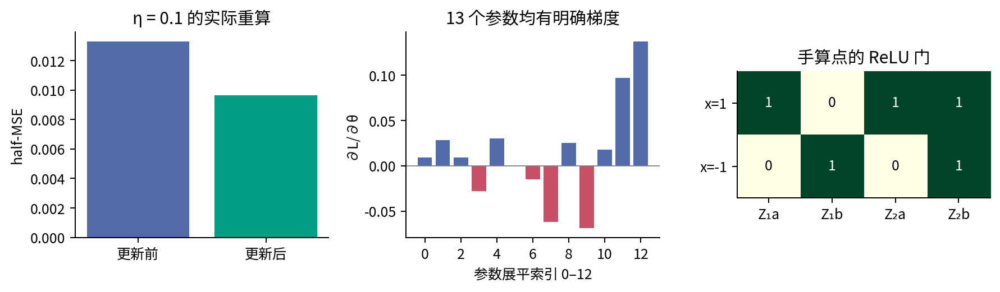
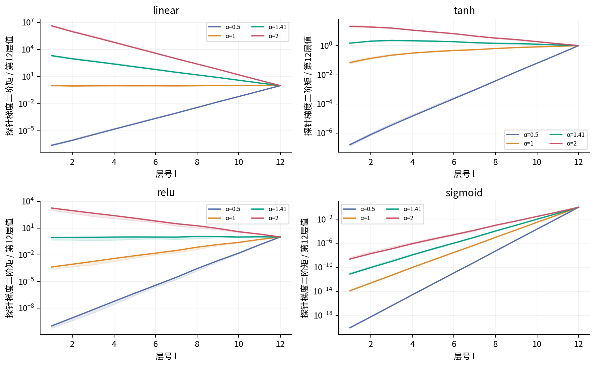

<style>table { break-inside: avoid; } figure img { max-height:112mm; }</style>

# 035 实验指南 激活初始化与信号传播

本实验让同一份数据、相同网络宽度与相同训练预算经过不同激活和初始化尺度。你要回答的不是“哪个名字最好”，而是：理论试图保持的量有没有被实际保持？哪一层先发生变化？这种初始化诊断能否预测固定学习率下的训练结果？

本指南可独立使用。先修018的均值/方差、027的批次链式法则与031的梯度核验。数据均为人工合成；实验只测训练拟合和初始化传播，不估计现实泛化性能。正文提供完整手算，不需要先运行代码才能读懂本指南。

## 1 开始前写下你的预测

四种激活分别是linear、tanh、ReLU和sigmoid。每个隐藏层权重按$W[out,in]$存储，前向为$H W^\mathsf T+b$；权重标准差为$\alpha/\sqrt{fan\_in}$，偏置初始化为0。先不打开输出文件，回答：

- 等宽linear网络的二阶矩每层预计乘多少？ReLU在对称初始化总体下又乘多少？
- ReLU的均值是0吗？如果不是，应该保持中心方差还是二阶矩来连接下一层？
- sigmoid的激活可能不接近0，而前层梯度很小吗？
- 若平均传播尺度保持，学习率0.03就一定稳定吗？

把答案连同你用到的假设写进实验记录。看到反例后修改解释，不要修改原始预测。

## 2 文件和环境

|文件|用途|
|---|---|
|experiment.py|数据校验、13参数精确手算、48配置扫描、有限宽对照|
|test_experiment.py|独立分数参考、13坐标差分、矩阵布局和错误输入保护|
|experiment.ipynb|清空内核后从上到下运行并核对完整扫描摘要|
|make_figures.py|由输出文件重建11张原创图|
|data/synthetic_regression.csv|128行16输入加1标签的冻结教学数据|
|data/hand_data.csv|正文两条手算数据|
|outputs|实际执行保存的数值，不是预填答案|
|answers.md与answers.pdf|手算、推导与实验题的解释|

提供environment.yml用于建立学习环境。该文件是环境说明，交付核验实际使用Python3.12.14、NumPy2.3.5、PyTorch2.7.1+cpu、Matplotlib3.10.8；没有声称新建Anaconda环境或GPU也已验证。Notebook另需nbformat、ipykernel与IPython。

建议先打开终端，切换至035目录。下面的相对路径命令均以该目录为起点：

```bash
python -c "import torch,numpy; print(torch.__version__,numpy.__version__)"
python test_experiment.py
python experiment.py
python make_figures.py
```

脚本用自身位置定位默认data和outputs，因此可从其他工作目录以绝对脚本路径运行。若使用`--data`或`--output`，相对参数由当前工作目录解释，这是正常命令行语义；需要完全明确时请提供绝对路径。默认重新运行会重写本单元outputs中的5个结果文件。修改协议请写到新的目录，不要把旧图与新结果混用。

## 3 先核验13参数手算

手算数据是$x=(1,-1)$、$y=(0.5,-0.5)$。网络$1\to2\to2\to1$使用两层ReLU。参数顺序为：$W_1$逐行2项、$b_1$2项、$W_2$逐行4项、$b_2$2项、$u$2项、输出偏置$c$1项。

1. 从lecture第2节抄出参数，自己算$Z_1,H_1,Z_2,H_2,\hat y,r,L$。预期损失$17/1280$。
2. 在两个隐藏层分别画门矩阵，标出哪些路径在当前样本上为0。
3. 写出$e=r/2$。先算$e u^\mathsf T$，再乘门，再乘$W_2$，再次乘门。
4. 按样本贡献求全部参数梯度。特别核查$W_{2,12}$为什么是0。
5. 用$\eta=0.1$一次性更新，再完整前向。预期新损失约0.00965099094054。

在Python中可检查独立分数参考：

```python
from experiment import hand_reference, hand_torch
r = hand_reference()
print(r['loss'], r['gradient'], r['new_loss'])
print(hand_torch())
```

Fraction参考逐标量循环计算，没有调用自动微分。测试还逐个扰动13个参数，用中央差分检验，步长$10^{-6}$。这是光滑区域内的检查，因为主例所有ReLU预激活远离0。不要把同一检查规则直接应用到$Z=0$的边界。



## 4 完整扫描的固定协议

训练输入按NumPy PCG64 seed35生成正态数组$128\times16$，再逐列中心化并按这128行的总体标准差标准化。标签为$0.6x_0-0.4x_1+0.3\sin x_2$。数据仅用于同一训练目标，不存在“训练上标准化又偷看测试”的说法，因为这里根本没有测试集；也因此不能汇报测试成绩。

|条件|固定值|
|---|---|
|网络|16输入，12个宽64隐藏层，1个线性输出|
|激活|linear、tanh、relu、sigmoid|
|隐藏层尺度|$\alpha=0.5,1,\sqrt2,2$|
|初始化重复|35、36、37，同一底数配对|
|输出头|标准差$1/\sqrt{64}$，不随$\alpha$变化|
|训练|全批次SGD，学习率0.03，100次更新|
|精度与设备|float64，单线程CPU|
|安全停止|当前损失非有限或大于$10^{10}$；候选参数非有限则不提交|

总共$4\times4\times3=48$次训练。初始状态记step0，完成第$k$次更新后再算的损失记step$k$。若某一步触发停止，曲线只保留此前可报告的点，状态单独记录。`updates_applied`可能比最后记录的step大1：那次有限参数更新已提交，但下一次前向的损失超过预算，因此没有被当成可接受损失写进曲线。这个字段不能误读为成功完成全部训练。

## 5 理解结果字段和统计轴

`outputs/results.json`包括protocol、实际环境版本、完整手算trace、解析机制反例和48个case。每个case的status为completed或明确的停止原因；last_recorded_loss不一定是第100步。

`layer_statistics.csv`共576行：48配置乘12层，全部在初始化时测量。不要把这些数据称作“训练结束的层统计”。字段前缀含义如下：

|字段或前缀|对象与定义|
|---|---|
|z_*|激活前$Z_l$的8192位置池化统计|
|h_*|激活后$H_l$的8192位置池化统计|
|task_grad_*|实际half-MSE对$Z_l$的梯度|
|probe_grad_*|合成终端探针标量$Q$对$Z_l$的梯度|
|*_variance|减去该数组均值后的平方平均，分母为元素数|
|*_second|未中心化的平方平均|
|*_q01、q50、q99|1%、50%、99%分位数|
|*_zero_fraction|浮点值精确等于0的比例|
|derivative_second|局部激活导数的平方平均|
|small_derivative_fraction|局部导数绝对值小于0.01的比例|
|inactive_fraction|ReLU的$Z\leq0$比例；其他激活记0|

`mean_unit_data_variance`按每个单元跨128条数据计算方差后平均；`variance_unit_data_means`是64个单元数据均值的方差。它们之和应等于h_variance，这是一个不依赖随机独立性的有限表恒等式。请随机选择两层自行检查。

`selected_distributions.json.gz`以无损gzip保留seed35下尺度1、$\sqrt2$、2的第1、6、12层原始池化数值，用于图8等分布图。`training_curves.csv`是所有实际记录的step与损失；`width_study.csv`另含宽度8、32、128各16个种子的初始化记录，共48行。它们与主扫描的3种子协议不同。

压缩文件没有删减数值、截断精度或改写JSON空格；解压后的完整字节与原记录一致。压缩固定level=9、mtime=0、空内部文件名，不写入本机路径。读取无需额外依赖：

```python
import gzip, json
with gzip.open('outputs/selected_distributions.json.gz',
               'rt', encoding='utf-8') as stream:
    distributions = json.load(stream)
print(len(distributions))  # 12组，每组12个8192元素数组
```

绘图和Notebook直接使用压缩文件。默认仍输出5个数值文件；解压副本如需保留，请另存到自己的目录。固定环境下压缩字节应可重现；跨压缩器版本则另核对解压后内容，不能把压缩封装变化误报为数值变化。

## 6 分开阅读前向 反向和训练

先看图6而不是训练曲线。对linear与ReLU写出理论二阶矩的递推，检查哪一种尺度使曲线近似水平。浅色带是3个初始化的最小至最大范围，不是置信区间。即使3条线很接近，也不能据此宣称统计不确定性很小。

再看图7。探针定义为$Q=\sum H_{12,ij}V_{ij}$，$V$独立随机抽取并除以$\sqrt{128\times64}$。梯度二阶矩按同次运行的第12层归一化。图形从右往左读；位于1下方表示前层相对终端缩小。它弱化了目标残差的干扰，却没有让内部门控变得独立。



最后看图9。找出两种反例：初始平均尺度稳定却训练失败；某些局部激活饱和却仍能较快拟合。固定学习率下的这些现象不代表调参后的最佳性能。不要丢弃停止的种子，只比较成功运行的均值。

## 7 观察分布 不是只观察一个方差

在图8中选ReLU的第1与第12层。回答：零质量有多大？非零梯度主要跨几个数量级？如果把零值替换为$10^{-30}$再做直方图，图形会增加怎样的人造尖峰？本课没有这样处理，而是只对非零值取log并单独标注零比例。

从单层的mean、variance、second计算$second-variance-mean^2$，检查应接近浮点舍入误差。再把池化方差拆成单元内数据变化与单元间均值差异。若后者主导，即便总方差不小，网络也可能对不同样本反应相似。

完成宽度对照。图10每种宽度16个seed均显示，报告最小、中位数、最大值；它不是独立数据集重复，也不是不同现实任务的重复。试着解释为什么宽度8中有极小值，但不能将这16个种子的极差外推成总体支持区间。

## 8 错误输入保护和复现检查

测试覆盖：布尔值、字符串、NaN、一维标签、空或非法配置；这些数据不能先被悄悄强制转换成合法测量。脚本先完成配置和数据校验，再计算，最后写结果。故意给`--steps 0`或不存在的数据文件，应报错且不覆盖已有结果。命令失败之后仍应检查目标文件是否保持原样，不能只看错误消息。

你可以从另一个工作目录运行脚本，输出到一个新的空目录，然后逐文件比较5个数值结果。再用`python -O`执行；输入校验不能依赖会被优化掉的assert。Notebook则执行“重新启动内核并全部运行”，不手动跳过慢单元或沿用已存在变量。交付时使用新Python进程中的全新InProcessKernel顺序执行并保存输出；浏览器Jupyter UI、socket传输和GPU没有经过这次验证。

## 9 你要提交的实验记录

提交一份连贯记录，而不是图的堆积：写清数据与随机性来源、损失归约、矩阵布局、固定条件、改变的条件；提供一次完整手算与13个参数梯度核对；选前向、反向和训练各一张图，给出可以从CSV重算的数值。

讨论至少三条未被实验满足或保证的假设：单网络实际数据均值不必为0；门与上游梯度并不严格独立；有限宽单元共享输入；训练后参数与表示依赖；池化位置并非独立重复。最后明确说明没有数据外评价，以及停止规则怎样影响比较。

扩展只选择一个因素：bias常数、宽度、深度或学习率。保持其他条件固定，先写预期观察和判据，再运行到新目录。本讲默认图脚本只接受完整48配置/576行协议，避免把局部试验误画成原始结果；自定义实验需相应修改绘图与报告，并保留修改说明。
