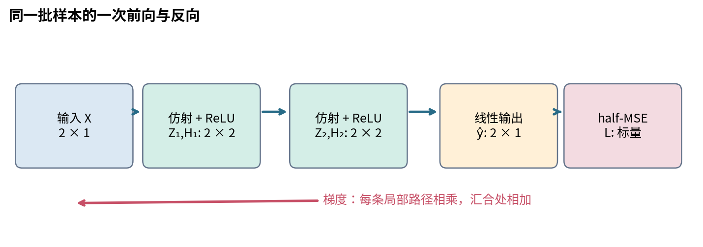
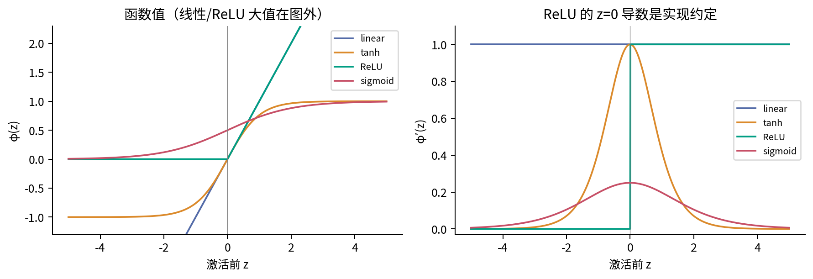
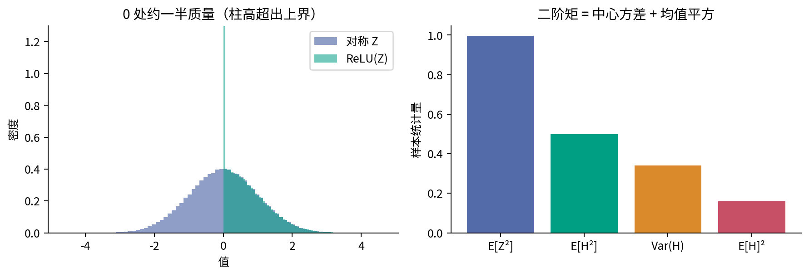
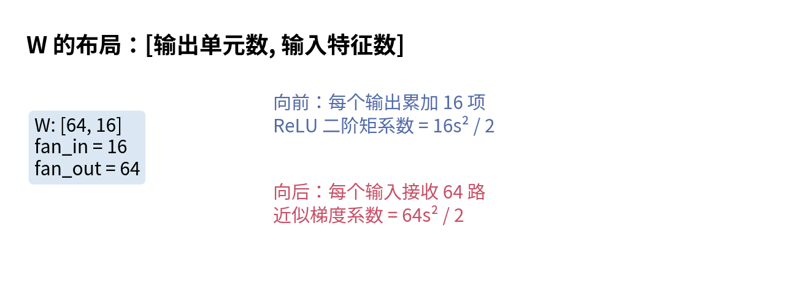
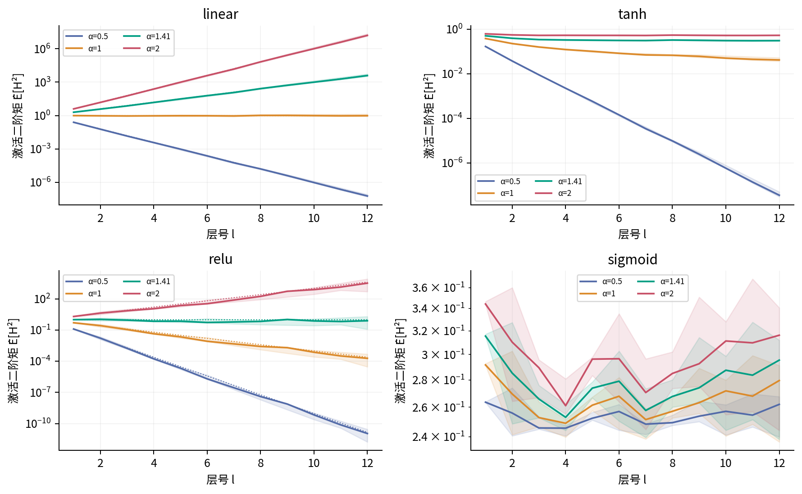
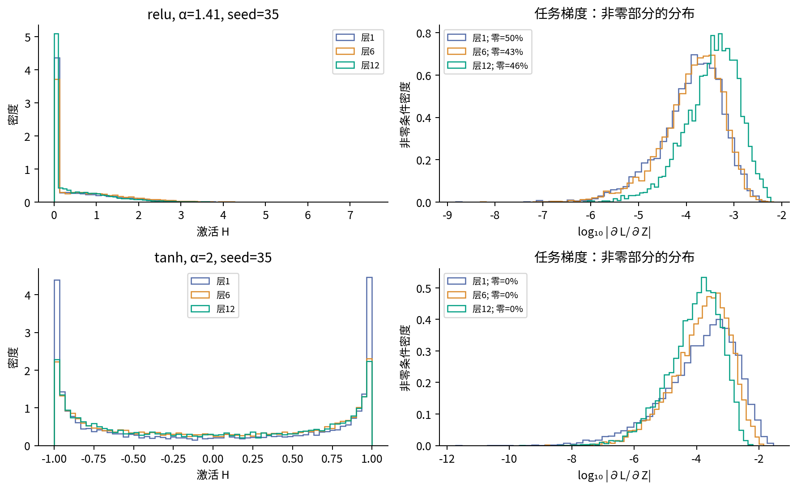
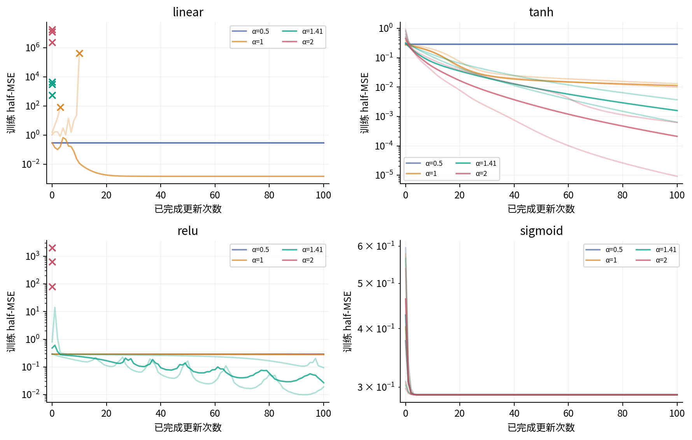
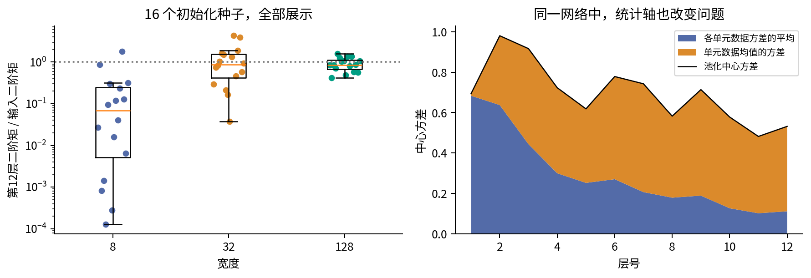
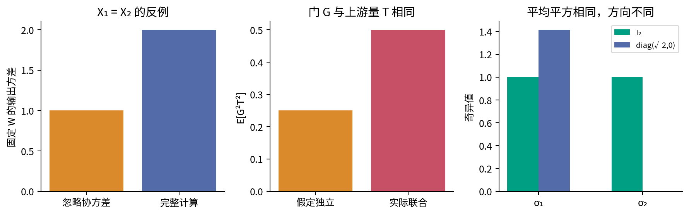

# 035 激活初始化与信号传播

网络加深时，数值为什么可能逐层变小或变大？即使输出层梯度看起来正常，最前面的层也可能几乎收不到训练信号。本讲从一个能手算的完整网络出发，把每条导数路径连起来，再问随机初始化怎样改变这些路径的尺度。目标不是背住两个标准差，而是知道它们要保持什么、依赖哪些假设、应该测量哪些量。

先修为018的期望与方差、027的批次反向传播和031的梯度核验。与034的衔接是：优化器拿到梯度以后怎样更新，与梯度到达各层以前经历了什么，是两个相互影响的问题。本讲先固定无动量SGD，暂时不让自适应缩放掩盖传播机制。所有样本、参数和损失均为无单位的人工教学数；合成CPU训练只展示有限机制，没有验证集或测试集，不能据此评价现实任务泛化能力。

## 1 先区分三个不同的故障

“梯度很小”至少有三种含义。第一，模型已经接近当前批次目标，输出残差小，因此所有梯度自然小。第二，损失采用平均而非求和，批量或输出维度的变化改变了数值单位。第三，输出端仍有信号，但经过多层矩阵和激活导数后，前层信号被衰减。本讲主要研究第三种，实验同时记录任务梯度与独立终端探针，以免把第一种误认成第三种。

类似地，激活很大不等于梯度必然很大。tanh的输出被限制在$(-1,1)$，但它的输入可以很大，导数很小。ReLU的正半轴不饱和，输出却可能因矩阵连乘而快速放大。输出范围、局部斜率和跨层乘积是三个需要分别测量的对象。

## 2 一个完整的两隐藏层手算

### 2.1 数据 形状和矩阵布局

只取两条样本，$X=[1,-1]^\mathsf T\in\mathbb R^{2\times1}$，$y=[0.5,-0.5]^\mathsf T\in\mathbb R^{2\times1}$。两层隐藏层都宽2，输出宽1。为与PyTorch的Linear存储方式一致，本讲$W$的行是输出单元，列是输入特征；因此批次前向写成$XW^\mathsf T$。031用过的另一种布局同样正确，但不能把它的shape原样搬来。

初始参数明确给定，而非本节随机抽取：

$$W_1=\begin{bmatrix}1\\-1\end{bmatrix},\quad b_1=\begin{bmatrix}0.2&0.1\end{bmatrix},\quad
W_2=\begin{bmatrix}0.5&-0.25\\0.25&0.5\end{bmatrix}.$$

$$b_2=\begin{bmatrix}0.1&0.2\end{bmatrix},\quad
u=\begin{bmatrix}1\\-0.5\end{bmatrix},\quad c=0.1.$$

$W_1$为$2\times1$，$W_2$为$2\times2$，$b_1,b_2$各有2个数，$u$为$2\times1$，$c$为标量，共13个实参数。$u$是输出列向量，因此最后写$H_2u+c$。偏置向每个样本行广播。定义$\phi(z)=\max(0,z)$，逐元素计算：

$$Z_1=XW_1^\mathsf T+b_1,\quad H_1=\phi(Z_1),\quad
Z_2=H_1W_2^\mathsf T+b_2,\quad H_2=\phi(Z_2),\quad \hat y=H_2u+c.$$

$Z_1,H_1,Z_2,H_2$都为$2\times2$。符号$Z$专指激活前数值，$H$专指激活后数值，不能在统计时混用。

### 2.2 每个中间数值到同一个标量损失

第一条样本的第一层是$[1\times1+0.2,1\times(-1)+0.1]=[1.2,-0.9]$，过ReLU成为$[1.2,0]$。第二层第一单元为$0.5\times1.2-0.25\times0+0.1=0.7$；第二单元为$0.25\times1.2+0.5\times0+0.2=0.5$。输出$0.7-0.5\times0.5+0.1=0.55$。第二条同样逐项代入，得到下表。

|样本|$Z_1$|$H_1$|$Z_2$|$H_2$|$\hat y$|$r=\hat y-y$|
|---|---|---|---|---|---|---|
|$x=1$|$(1.2,-0.9)$|$(1.2,0)$|$(0.7,0.5)$|$(0.7,0.5)$|0.55|0.05|
|$x=-1$|$(-0.8,1.1)$|$(0,1.1)$|$(-0.175,0.75)$|$(0,0.75)$|-0.275|0.225|

第二条的$Z_{2,1}=-0.25\times1.1+0.1=-0.175$被门挡住。采用一输出回归的half-MSE：

$$L=\frac1{2n}\sum_{i=1}^n r_i^2=\frac{0.05^2+0.225^2}{4}=\frac{17}{1280}=0.01328125,\qquad n=2.$$

这不是两个样本损失的和。反向起点是$e_i=\partial L/\partial\hat y_i=r_i/n$，所以$e=(0.025,0.1125)^\mathsf T$。均值归约带来的$1/n$只放在这里一次。

### 2.3 每条局部导数和反向汇合

先写一般的单样本局部规则，再填数。输出层有$\partial\hat y_i/\partial u_j=H_{2,ij}$、$\partial\hat y_i/\partial c=1$、$\partial\hat y_i/\partial H_{2,ij}=u_j$。ReLU在正数处导数为1，在负数处为0；本节所有$Z$均远离0。记门$M_{l,ij}=1[Z_{l,ij}>0]$，则$\partial H_{l,ij}/\partial Z_{l,ij}=M_{l,ij}$，不同单元间局部导数为0。

第二层仿射的三个局部规则分别是

$$\frac{\partial Z_{2,ij}}{\partial W_{2,jk}}=H_{1,ik},\quad
\frac{\partial Z_{2,ij}}{\partial b_{2,j}}=1,\quad
\frac{\partial Z_{2,ij}}{\partial H_{1,ik}}=W_{2,jk}.$$

第一层相同位置的规则是$\partial Z_{1,ij}/\partial W_{1,j1}=x_i$、$\partial Z_{1,ij}/\partial b_{1,j}=1$，以及$\partial Z_{1,ij}/\partial x_i=W_{1,j1}$。这已经列全计算图中每类局部边，不存在“让自动微分补上”的缺口。

设$G_{H_l}=\partial L/\partial H_l$，$\Delta_l=\partial L/\partial Z_l$，两者都为$2\times2$。链式法则给出：

$$G_{H_2}=eu^\mathsf T,\quad \Delta_2=G_{H_2}\odot M_2,\quad
G_{H_1}=\Delta_2W_2,\quad \Delta_1=G_{H_1}\odot M_1.$$

$\odot$表示对应位置相乘，矩阵乘法则会对汇合的路径求和。例如第一条样本到$H_{1,1}$的梯度有两条路径：$0.025\times0.5+(-0.0125)\times0.25=0.009375$。只保留其中一条，会得到错误梯度。

|样本|$G_{H_2}$|门$M_2$|$\Delta_2$|$G_{H_1}$|门$M_1$|$\Delta_1$|
|---|---|---|---|---|---|---|
|1|$(0.025,-0.0125)$|$(1,1)$|$(0.025,-0.0125)$|$(0.009375,-0.0125)$|$(1,0)$|$(0.009375,0)$|
|2|$(0.1125,-0.05625)$|$(0,1)$|$(0,-0.05625)$|$(-0.0140625,-0.028125)$|$(0,1)$|$(0,-0.028125)$|

第二条到第一层第一单元的$G_{H_1}=-0.0140625$并不为零，却被第一层负输入的ReLU门截断。必须区分激活后梯度与激活前梯度。若继续求输入梯度，两条分别为$0.009375$和$0.028125$；输入在此是给定数据，不参与参数更新。

### 2.4 全部参数梯度和同一步更新

参数被多个样本共同使用，必须把样本贡献相加：

$$g_u=H_2^\mathsf Te,\quad g_c=\sum_i e_i,\quad
G_{W_2}=\Delta_2^\mathsf TH_1,\quad g_{b_2}=\sum_i\Delta_{2,i,:},$$

$$G_{W_1}=\Delta_1^\mathsf TX,\qquad g_{b_1}=\sum_i\Delta_{1,i,:}.$$

表中“样本贡献”已经包含损失中的$1/2$批次因子，不能再除以2。统一用旧参数梯度，学习率$\eta=0.1$，无动量、无权重衰减：$\theta'=\theta-0.1g_\theta$。

|参数|旧值|样本1贡献|样本2贡献|合计梯度|新值|
|---|---:|---:|---:|---:|---:|
|$W_{1,11}$|1|0.009375|0|0.009375|0.9990625|
|$W_{1,21}$|-1|0|0.028125|0.028125|-1.0028125|
|$b_{1,1}$|0.2|0.009375|0|0.009375|0.1990625|
|$b_{1,2}$|0.1|0|-0.028125|-0.028125|0.1028125|
|$W_{2,11}$|0.5|0.03|0|0.03|0.497|
|$W_{2,12}$|-0.25|0|0|0|-0.25|
|$W_{2,21}$|0.25|-0.015|0|-0.015|0.2515|
|$W_{2,22}$|0.5|0|-0.061875|-0.061875|0.5061875|
|$b_{2,1}$|0.1|0.025|0|0.025|0.0975|
|$b_{2,2}$|0.2|-0.0125|-0.05625|-0.06875|0.206875|
|$u_1$|1|0.0175|0|0.0175|0.99825|
|$u_2$|-0.5|0.0125|0.084375|0.096875|-0.5096875|
|$c$|0.1|0.025|0.1125|0.1375|0.08625|

例如$W_{2,12}$的梯度为0，不是“这个参数没注册”：第一条对应输入$H_{1,2}=0$，第二条对应门关闭，因此两条贡献都为0。下一批或下一组参数的门变化后，它仍可能获得梯度。

### 2.5 更新后必须重新前向

更新完全部13个参数，再使用原来的两条数据。比如新第一条$Z_{1,1}=0.9990625+0.1990625=1.198125$，新第二层第一项为$0.497\times1.198125+0.0975=0.692968125$。

第一条样本：新$Z_1=(1.198125,-0.9)$，新$H_1=(1.198125,0)$；新$Z_2$与$H_2$都为$(0.692968125,0.5082034375)$。新预测为0.518980491230，新残差为0.018980491230。

第二条样本：新$Z_1=(-0.8,1.105625)$，新$H_1=(0,1.105625)$；新$Z_2=(-0.17890625,0.766528554688)$，新$H_2=(0,0.766528554688)$。新预测为-0.304440022717，新残差为0.195559977283。

$$L'=\frac{(0.018980491230\ldots)^2+(0.195559977283\ldots)^2}{4}
=0.009650990940541462\ldots.$$

此步损失下降约27.34%，是这一具体学习率和网络的重算结果，不是任意步长都下降的定理。表中保留位数不同，精确核验使用分数而不是把已四舍五入的预测继续代入。代码的独立Fraction标量循环、float64自动微分、全部13坐标中央差分相互对照。它们分别检查代数、实现和局部数值变化。

## 3 激活的斜率为什么改变传播

线性激活$\phi(z)=z$的导数恒1，它只保留矩阵乘法的影响；多层线性网络作为输入到输出的函数仍是仿射的，但不同参数化下的优化轨迹可以不同。

双曲正切$\tanh z=(e^{2z}-1)/(e^{2z}+1)$，导数$1-\tanh^2z$。它在0附近近似线性，$|z|$很大时输出接近$\pm1$，斜率趋近0，称为饱和。这里“接近0”不能改写为“数学上等于0”；浮点计算又可能把非常小的差值舍入为0。

sigmoid为$\sigma(z)=1/(1+e^{-z})$，导数$\sigma(z)(1-\sigma(z))\leq1/4$。即使$z=0$完全不处于尾部，导数也只有$1/4$。如果连续12个纯标量sigmoid局部斜率都为$1/4$，仅斜率乘积就为$4^{-12}\approx5.96\times10^{-8}$；实际网络还有权重乘积和路径求和，不能直接拿这个数当其梯度。

ReLU在正半轴斜率1，负半轴斜率0；它没有正侧饱和，但可能有大量负侧门关闭。在0处左右导数分别0和1，通常意义的导数不存在。PyTorch2.7在该点返回0，本讲实际测试这一行为；它属于实现采用的次梯度选择，不能写成“微积分证明导数等于0”。中央差分在0处得到$[\phi(h)-\phi(-h)]/(2h)=1/2$，不等于框架值并不说明框架反向有bug。[S4]

“死ReLU”应说明在哪些样本、哪些时刻都为负。一个批次里零占比50%与一个单元在全部训练样本上始终为负不是同一件事。偏置、其他层更新、新样本都有可能改变门。若某单元对当前全部数据都是负值，且输入分布与相关参数又没有其他改变来源，那么纯数据梯度不会通过它主动把这一层的门打开。

## 4 期望到底对谁取

### 4.1 三种统计实验不要混在一起

设第$l$层有$d_l$个单元，$H_0=X$。单条输入的第$j$个输出为

$$Z_{l,j}=\sum_{k=1}^{d_{l-1}}W_{l,jk}H_{l-1,k}+b_{l,j},\qquad H_{l,j}=\phi(Z_{l,j}).$$

可以固定输入并反复抽整套初始权重；也可以固定一套权重，在输入分布上取期望；还可以把样本和初始化都当随机变量。这三个概率实验不等价。理论下标省略时，本讲的传播公式默认针对独立抽取新层权重的初始化总体，可同时对输入和前层初始化平均；绝不默认某个实际网络的某批样本均值为0。

实验里的$\widehat E$则是有限数值的算术平均：默认把128条样本和64个单元合并成8192个位置。它是一份描述性摘要。这8192个值共享网络权重，也共享上游表示，不能当8192个独立重复实验来构造置信区间。独立的初始化种子才是初始化差异的重复单位，且本讲主扫描只有3个。

### 4.2 中心方差和二阶原点矩

对任意二阶矩有限的标量$A$，定义$\mu_A=E[A]$、$q_A=E[A^2]$、$v_A=E[(A-\mu_A)^2]$。018已展开过平方：

$$q_A=v_A+\mu_A^2.$$

所以“平方平均”不等于“方差”。例如恒为2的变量方差0而二阶矩4。这里的区别会直接决定ReLU初始化中的系数。代码同时保存mean、variance、second；variance用总体型分母$N$，用于描述这批值，未宣称是无偏估计总体方差的$N-1$公式。

### 4.3 从求和展开前向二阶矩

为这一推导明确约定：本层权重相互独立；$E[W_{jk}]=0$；$E[W_{jk}^2]=s_l^2$；整层$W_l$与前层$H_{l-1}$独立；偏置为确定的0；前层各坐标二阶矩有限。首先条件于已给定的向量$H=h$，有$E_W[Z_j\mid h]=0$。平方展开：

$$E_W[Z_j^2\mid h]
=\sum_k E[W_{jk}^2]h_k^2
+2\sum_{k<m}E[W_{jk}W_{jm}]h_kh_m
=s_l^2\sum_k h_k^2.$$

交叉项消失是因为新层权重独立且零均值，不是因为$h_k$恰好均值为0。再对$H$平均：

$$E[Z_j]=0,\qquad \operatorname{Var}(Z_j)=E[Z_j^2]=s_l^2\sum_kE[H_k^2].$$

若所有输入坐标共享二阶矩$q_{l-1}$，才简化为

$$v_l=d_{l-1}s_l^2q_{l-1}.$$

这条新层权重平均的恒等式甚至不需要输入坐标彼此独立。独立输入是许多入门推导方便使用的更强假设，不能把它误说成此处删除交叉项的唯一理由。若训练后本层权重已依赖表示或权重间存在相关性，刚才的分解则未必成立。

若固定一套$w$，只对数据取方差，结果是$\operatorname{Var}_X(Z_j)=w_j\Sigma_Hw_j^\mathsf T$，其中$\Sigma_H$是输入坐标的协方差矩阵。非对角项一般不为0；固定偏置不改变该方差，却会改变均值和下一步激活。若把随机偏置也平均进去，且它独立、均值0，$\operatorname{Var}(b)$还要加上。每个额外假设都对应一项是否存在，不能只背一个乘法系数。

## 5 从ReLU的非零均值推出He尺度

### 5.1 对称性给出的是二阶矩的一半

令$Z$的分布关于0对称，且二阶矩有限。$H=\max(0,Z)$，所以$H^2=Z^2 1[Z>0]$。正负两侧对$Z^2$的贡献相同；即使0有原子质量，它也不贡献平方。因此

$$E[H^2]=\frac12E[Z^2].$$

但$E[H]$通常为正。若额外假定$Z\sim\mathcal N(0,v)$，连续正态积分进一步给出

$$E[H]=\sqrt{\frac{v}{2\pi}},\qquad
\operatorname{Var}(H)=v\left(\frac12-\frac1{2\pi}\right).$$

第一条“二阶矩减半”不要求正态；后面的具体均值和中心方差常数要求正态。这一区分很重要。$v=1$时，均值约0.398942，二阶矩0.5，中心方差约0.340845，不是0.5。正态近似可由很多小项的和获得直觉，但有限宽、少数大项、相关项或重尾时不能自动保证它准确。

图4用100000个正态抽样再拼接其相反数，构造严格对称的200000个值。拼接不是增加独立样本数，而是使对称性在有限数组上精确成立。实际$\widehat E[Z^2]=0.99744456$，ReLU二阶矩0.49872228，中心方差0.33991861，均值0.39850179。前两个恰好相差一半，后两个仅近似正态公式。

### 5.2 连续乘积为什么危险

将前向仿射式与ReLU对称性连接，记$q_l=E[H_{l,j}^2]$：

$$q_l=\frac12d_{l-1}s_l^2q_{l-1},\qquad
\frac{q_D}{q_0}=\prod_{l=1}^D\frac{d_{l-1}s_l^2}{2}.$$

这里要求每层满足上述初始化条件和边际对称性。独立对称权重、零偏置可以使新层预激活在初始化总体上对称；这不是说一个有限样本表的正负恰好各半。

若每层使用$s_l=\alpha/\sqrt{d_{l-1}}$，每层系数为$\alpha^2/2$。当$\alpha=1$，12层后预测比例$2^{-12}=1/4096$；当$\alpha=2$，比例为$2^{12}=4096$。标准差再开平方，所以不要把方差倍数误报成标准差倍数。令每层系数为1，得到He的fan_in方差尺度$s_l^2=2/d_{l-1}$，即标准差$\sqrt{2/d_{l-1}}$。[S2]

这个结论保持的是这一简化总体模型的层间二阶矩。它不保证某次抽样的每个单元、每个方向、每条训练轨迹都保持数值。输入本来就很大时，保持“大”也可能是不合适的；初始化不能替代数据尺度检查。

对负半轴斜率为$a$的带泄漏ReLU，$\phi(z)=z$在正侧、$az$在负侧，对称性给出$E[\phi(Z)^2]=(1+a^2)E[Z^2]/2$。故对应的前向方差选择是$2/[(1+a^2)\,fan\_in]$。这个推广说明“2”来自激活的平方缩放，而不是某个神秘常数。$a=1$回到线性情形。

## 6 反向传播需要额外的独立近似

### 6.1 先保留精确链式法则

对单条样本，把$G_l=\partial L/\partial H_l$写成行向量，shape为$1\times d_l$。$D_l=\phi'(Z_l)$同shape。精确关系是

$$\Delta_l=G_l\odot D_l,\qquad
G_{l-1}=\Delta_l W_l.$$

所以第$k$个输入坐标得到$d_l$条路径：

$$G_{l-1,k}=\sum_{j=1}^{d_l}W_{l,jk}\,D_{l,j}\,G_{l,j}.$$

这里$fan\_out=d_l$，不是前向求和的$d_{l-1}$。批次参数梯度还要对样本求和，不能把中间量梯度的统计量直接当成参数梯度统计量。

### 6.2 方差近似的两次拆分

令$r_l=E[G_{l,j}^2]$。要从精确式得到简单标量递推，常近似把权重与反传信号独立、跨单元交叉项视为消失，再把$D_l$与$G_l$独立。于是

$$E[G_{l-1,k}^2]\approx d_ls_l^2E[D_{l,j}^2G_{l,j}^2]
\approx d_ls_l^2E[D_{l,j}^2]r_l.$$

若还满足相应的零均值近似，这也是梯度中心方差递推；一般先把它称作二阶矩递推更安全。对于连续、对称、零点无质量的ReLU预激活，$D$是0/1门且$E[D^2]=1/2$，于是

$$r_{l-1}\approx\frac{d_ls_l^2}{2}r_l.$$

为了保持这个反向尺度，得到$s_l^2=2/fan\_out$。它与前向He fan_in不同。等宽层时相同，宽度改变时不能同时逐层满足两个条件。若用fan_in，各层反向系数是$d_l/d_{l-1}$，连续相乘会望远镜化为端点宽度比；这不等于每一层都不变。

为什么这些只能是近似？门$D_l$由$W_lH_{l-1}$决定，已经含有本层权重。任务梯度$G_l$又通过后续预测和残差依赖这个门与权重。初始化时“参数独立抽样”不能推出“反传梯度与参数独立”。有限宽的路径共享更使依赖无法忽略。[S2]原文也明确陈述了用于反向分析的独立假设。

一个完全可算的反例：令$Z$等概率取$-1,1$，$D=1[Z>0]$，上游量恰为$G=D$。则$E[D^2G^2]=1/2$，而错误拆分成$E[D^2]E[G^2]$得到$1/4$。这个例子不声称任何网络都具有该关系，只证明“都是0/1量”不足以授权独立分解。

### 6.3 梯度放大和激活饱和可以同时出现

对tanh，$E[D^2]=E[(1-\tanh^2Z)^2]$随$Z$分布改变，不是固定1。把所有输入都当0附近，才有近似$D=1$。更大的权重一方面直接放大矩阵因子，另一方面把更多$Z$送入饱和区，压小斜率。最终乘积谁占主导要实际测量；“tanh输出有界，所以梯度不可能爆炸”不成立。

sigmoid满足$D^2\leq1/16$，但把权重无限放大来抵消这个因子又会改变$Z$分布，更多值进入饱和尾部。单独调大一个标准差不能保证解决传播。实验用同一输入和同一损失检查这种冲突，而不是从一条上界宣布某种激活不可使用。

## 7 Xavier为什么折中两个方向

若激活在初始化附近近似线性，或直接使用线性激活，$q_l\approx d_{l-1}s_l^2q_{l-1}$，反向近似$r_{l-1}\approx d_ls_l^2r_l$。前向希望$fan\_in\,s_l^2=1$，反向希望$fan\_out\,s_l^2=1$。两种宽度不同时无法逐层兼得。Xavier或Glorot的常用折中为

$$s_l^2=\frac{2}{fan\_in+fan\_out}.$$

它让两个尺度系数的算术平均等于1，不是保证每个系数都等于1，也不是在任何损失下自动求出的最优解。若取均匀分布$W\sim U[-a,a]$，$\operatorname{Var}(W)=a^2/3$，因此$a=\sqrt{6/(fan\_in+fan\_out)}$；若取正态分布，其标准差为$\sqrt{2/(fan\_in+fan\_out)}$。[S1]

公式里的gain乘在标准差或均匀边界上，因此方差乘gain的平方。框架的tanh推荐gain等启发式不等于刚才的线性化证明。本讲主扫描显式用$\alpha/\sqrt{fan\_in}$：在等宽隐藏层，$\alpha=1$与gain为1的Xavier正态相同；第一层$16\to64$并不相同，输出线性头另用$1/\sqrt{64}$。因此我们把整个扫描称作尺度扫描，不能把$\alpha=1$那条全网曲线不加限定地标为“完整Xavier”。

实际调用PyTorch时，`nn.init.kaiming_normal_(W, mode='fan_in', nonlinearity='relu')`按$W[fan\_out,fan\_in]$理解。若代码使用$XW$且$W[fan\_in,fan\_out]$，应把转置视图交给初始化函数。对于Xavier，两个fan相加使二维转置后数值尺度碰巧不变；对于He fan_in/fan_out，转错会实质改变尺度。[S3]

例如$W$为$64\times16$，ReLU fan_in标准差为$\sqrt{2/16}\approx0.353553$，fan_out为$\sqrt{2/64}\approx0.176777$，相差2倍。偏置一般单独初始化，本实验为0。不要看到网络层已构造成功就假定它默认采用了本讲某个公式；先检查所用框架版本与实际代码。

## 8 怎样设计可解释的传播实验

### 8.1 固定任务和配对随机性

扩展实验用128条16维合成输入，由seed=35的NumPy PCG64正态抽样产生，再在这128条数据内逐列减均值、除以总体型标准差。标签为$y=0.6x_0-0.4x_1+0.3\sin x_2$。这只是生成可复现训练任务，未用到外部数据，也没有测试集。全部128行CSV随单元提供。

网络有12个宽64的隐藏层、一个线性输出头。激活扫描linear、tanh、ReLU、sigmoid；隐藏层尺度$\alpha\in\{0.5,1,\sqrt2,2\}$；初始化种子35、36、37。共48种配置。每个种子、每种尺度复用同一组标准正态底数，激活变化也不改变初始权重，因此差异更容易定位。输出头始终保持相同的fan_in线性尺度，不随$\alpha$改变。

训练为float64、单线程CPU、全批次SGD、学习率0.03、100次更新，无动量、无衰减、无裁剪、无归一化层、无残差连接。固定学习率是有意隔离条件，不代表各配置已得到同等质量的超参数调优。若当前损失非有限或超过$10^{10}$，停止并记录原因；若候选更新非有限，则不提交该更新。终止不是早停泛化策略，也不能用最后一个有限点冒充第100步成绩。

### 8.2 每层测什么 为什么测

初始化时保存每一层$Z,H$以及任务梯度$\partial L/\partial Z_l$的均值、中心方差、二阶矩、1%/50%/99%分位数和零比例。另记录局部导数平方平均、导数绝对值小于0.01的比例；ReLU的inactive_fraction是$Z\leq0$的位置比例，不是永久死亡单元比例。

探针使用另一独立随机向量$V$，shape为$128\times64$，每项为标准正态除以$\sqrt{128\times64}$。定义标量$Q=\sum_{ij}H_{12,ij}V_{ij}$。于是$\partial Q/\partial H_{12}=V$，不受回归标签和输出残差大小控制。再计算$\partial Q/\partial Z_l$。它是同一前向映射的向量-Jacobian积诊断，不能当作训练所用梯度；内部门控和有限宽依赖仍在。

图7把探针梯度二阶矩除以同一运行第12层的值，观察相对传输。图8的任务梯度则保留实际half-MSE尺度。日志中也保留未归一化量，避免相对图隐藏所有层共同缩小的可能性。

### 8.3 描述性统计不应暗中换轴

默认池化的$H$中心方差可严格分解为

$$\operatorname{Var}_{i,j}(H_{ij})=
\frac1d\sum_j\operatorname{Var}_i(H_{ij})+
\operatorname{Var}_j\left(\frac1n\sum_iH_{ij}\right).$$

这是在均匀抽取样本索引和单元索引的有限表上展开平方得到的恒等式。右边第一项测单元随数据的变化，第二项测不同单元的数据均值差异。一层所有单元都近似常数但常数彼此不同，池化方差仍能不小，却不表示该层保留了丰富的样本区分。图10同时展示两部分。每张统计图都必须说明是按样本、按单元还是按初始化种子聚合。

## 9 真实结果和它们允许的解释

图6先看ReLU。第12层二阶矩的种子中位数在$\alpha=1$时为$1.89983\times10^{-4}$，在$\sqrt2$时为0.778172，在2时为3187.39。它们与小于1、约为1、大于1的乘积机制一致，但并未精确落在$1/4096,1,4096$上。偏差不应被“平滑到理论线”：有限宽、有限样本和仅3个初始化本就会波动。

对于当前零偏置ReLU初始化，同一种子下正的全层尺度变化还保持门不变，因为ReLU正齐次：$\phi(cz)=c\phi(z)$（$c>0$）。第$l$层$H$因此随$\alpha^l$变化。这解释了同一组底数下曲线之间有整齐尺度关系；并不证明门与梯度独立。训练后偏置和不同梯度轨迹破坏这一简单关系。

以第一层相对第12层的探针二阶矩为例，3种子中位数如下。这是平方尺度之比，若要比较RMS梯度应开平方。

|激活与尺度|第一层/第12层探针二阶矩|可支持的观察|
|---|---:|---|
|linear，1|1.03141|此探针的平均平方尺度接近保持|
|ReLU，1|$4.27840\times10^{-4}$|向前层明显衰减|
|ReLU，$\sqrt2$|0.876216|本次较接近保持，仍有种子差异|
|ReLU，2|1794.49|平均平方明显放大|
|tanh，2|20.7307|有饱和仍可出现反传放大|
|sigmoid，1|$1.26353\times10^{-14}$|激活二阶矩不小不能排除梯度消失|

分位数和分布可区分“所有值略小”与“大部分为0而少数很大”。只看方差还可能把均值变化掩盖；只看RMS又可能把大量零门掩盖。ReLU约一半位置为0并非失效的充分条件，必须连同跨样本活跃状况、传播尺度和训练目标解读。

48次运行中37次达到100次更新，11次因损失超过预算停止。其中linear的$\alpha=1$也有2个种子停止，尽管其初始化探针尺度看起来接近保持。这是关键反例：平均二阶矩稳定不保证Jacobian条件好，更不保证固定学习率对非凸参数化稳定。

完成运行的ReLU中，$\alpha=1$的第100步损失中位数0.28234，而$\sqrt2$为0.02698。sigmoid在四种尺度下大多停留在约0.28904，接近仅输出标签均值的损失；它仍可能通过输出偏置降低初始损失，所以“损失下降过”不等于早层学到了任务。

tanh在本次固定任务和学习率下，$\alpha=2$的最终损失中位数约0.000210，比$\alpha=1$的0.01126更低。这不应被删掉来迎合“权重越大越饱和越差”的口号。初始化时它同时具有非平凡的导数和更强矩阵放大；训练后的动态还会继续改变这些量。这里没有做独立学习率搜索、数据外评价或多任务重复，不能将此表转成通用激活排行榜。

## 10 哪些假设在实际网络里会失效

宽度8的16种子最后层二阶矩比例从0.000129到1.79981，中位数0.06792；宽128的范围0.41971到1.57278，中位数0.85431。这里宽网络的样本范围较集中，但16个种子不足以证明所有深度、分布或架构都如此。窄层还可能恰好大范围关门，不能用无限宽直觉抹平。

另外，训练会让权重、表示和标签共同适应，独立初始化假设很快不再适用。卷积有权重共享；注意力有数据依赖的混合权重；残差连接把路径相加；归一化层重新改变均值、尺度及样本之间的耦合。它们各有自己的Jacobian和相关项，不能只把本讲$d$替成某个“宽度”就当作证明。

左图令输入等概率为$(-1,-1)$与$(1,1)$，固定$w=(1,1)/\sqrt2$。输出是$\pm\sqrt2$，方差2；只加两项$w_k^2\operatorname{Var}(X_k)$却得到1。并不与第4节的新层权重平均恒等式矛盾：这里固定了权重，改变了取期望的对象。

右图比较$I_2$和$\operatorname{diag}(\sqrt2,0)$。两者平方奇异值的平均都是1，但后者沿第二坐标完全丢失信息。传播二阶矩只约束平均尺度，不约束每条方向。研究更深网络时可以进一步检查Jacobian谱、样本间表示相似性和秩，但本讲没有测量大模型的谱，也没有证明动力学等距性。

## 11 把理论变成诊断顺序

先按031确认数据、损失归约、计算图和全部13参数梯度检查没有错误。随后在实际初始化处记录每层$Z,H,\partial L/\partial Z$，同时记录mean、中心方差、二阶矩、零比例和分位数。发现异常时先问统计轴与单位，再查输入尺度、矩阵布局、激活和bias，最后再考虑深度、宽度与结构。

做对照时保持数据、模型宽度、训练预算、随机底数和优化器设置明确可比；改变初始化可能同时改变输出损失和合适的学习率，所以需要将“初始传播诊断”与“调好学习率后的训练比较”分开报告。若想宣称某方案更好，预先定义评价指标、搜索预算和数据边界，再增加重复和任务覆盖。

本讲可以支持的最终结论很具体：独立零均值新层权重把前层二阶矩乘以fan_in与权重方差；ReLU的对称截断引入一半系数；反向还需要门控与上游梯度等额外独立近似。Xavier与He提供有条件的尺度起点。它们都不能替代一次完整前向、逐层测量和正确的梯度核验。

## 12 练习

1. 不看答案重算手算表的$W_{2,22}$、$b_{2,2}$和$u_2$三项梯度。为什么三者不能互换？
2. 对称变量只取$-2,2$且等概率。求ReLU输出的均值、二阶矩和中心方差。正态均值公式能否使用？
3. 输入宽16、输出宽64时，计算Xavier normal gain=1与ReLU He的两种mode的标准差，并写出各自的前向与近似反向系数。
4. 证明leaky ReLU的二阶矩系数。$a=0.1$时，宽64的fan_in标准差是多少？
5. 固定$w=(1,-1)/\sqrt2$而输入仍满足$X_1=X_2\in\{-1,1\}$。实际方差与忽略协方差的结果各是多少？
6. 为什么把ReLU在0处的中央差分结果与框架0直接比较，会错误地判定反向失败？
7. 根据图6至图9，写一段同时提及sigmoid、tanh和linear反例的科研结论，不能使用“证明某激活总是最好”。
8. 设计一个只改变bias的后续实验，预先说明数据、配对随机性、测量轴和失效判据。不要先看曲线再补判据。

练习推导、数值答案与失败解释见独立answers。实验步骤、输出字段和可运行命令见lab与README。

## 来源定位

[S1] Glorot与Bengio（2010），§4.2，公式10至16。[论文](https://proceedings.mlr.press/v9/glorot10a/glorot10a.pdf)。

[S2] He等（2015），§2.2，公式5至15。[论文](https://arxiv.org/pdf/1502.01852)。

[S3] PyTorch2.7，nn.init的初始化与矩阵布局说明。[官方文档](https://docs.pytorch.org/docs/2.7/nn.init.html)。

[S4] PyTorch2.7，Autograd的不可导点处理。[官方文档](https://docs.pytorch.org/docs/2.7/notes/autograd.html)。

