# 036 归一化与训练推理状态

这一讲回答：同一个样本为什么会因为“同批次还有谁”而得到不同预测？前035讨论初始化时的信号尺度；现在把依赖当前激活的均值和方差放进计算图，追踪它怎样改变前向、反向和部署状态。读完应能指定BN与LN的归约轴，完整算出一批数据的跨样本梯度，并解释参数没有改变时预测仍会改变的原因。

先修018的均值方差、030的模块与训练循环，以及035的激活尺度。公式约定、三行数据、13个参数和全部中间量都在本讲重新给出，不要求跨讲导入程序。正文中的两步手算是可微机制；后面的CPU合成实验是状态诊断，不能推出哪种归一化在所有任务上更好。

## 1 先问谁与谁一起计算统计量

张量有形状还不够，还要给每条轴命名。用$X\in\mathbb R^{N\times T\times D}$表示N个样本、每个样本T个位置、每个位置D个特征。相同的减均值除尺度公式，用不同轴归约就会成为不同模型。

对二维$Z\in\mathbb R^{B\times C}$，训练态BatchNorm逐特征计算统计量：固定列j，跨B行。一个样本改变，其他样本的归一化结果也可能变。对三维序列，PyTorch的BatchNorm1d输入约定是$(N,C,L)$，每个通道跨N与L归约。若数据按$(N,T,D)$保存，要先把D换到通道轴，不能因为D恰好等于T就省略语义检查。

LayerNorm(D)则固定某个样本的某个位置，跨最后D个特征归约。它不会通过这次归一化引入不同样本之间的统计依赖。LayerNorm((T,D))会跨最后两轴，连不同位置也一起处理；这和LayerNorm(D)不是同一个运算。用于预测序列时，若把未来位置也放进统计组，就应重新审查信息是否泄漏。

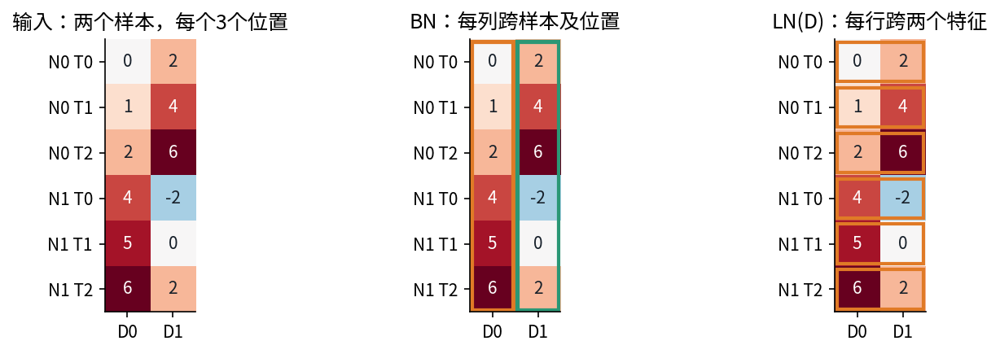

本讲使用[BatchNorm原论文](https://proceedings.mlr.press/v37/ioffe15.pdf)的按特征批统计定义，以及[LayerNorm原论文第3节](https://arxiv.org/pdf/1607.06450)的组内定义。原论文提出的动机与特定基准结果，不是本讲小实验已证明的机制解释或普遍收益；这里不把“消除内部协变量偏移”当作已确立的唯一因果解释。

## 2 从一组数推导归一化

### 2.1 均值 方差 epsilon 缩放和平移

令一个统计组有m个数$z_1,\ldots,z_m$。定义

$$\mu=\frac1m\sum_i z_i,\qquad c_i=z_i-\mu,\qquad v=\frac1m\sum_i c_i^2.$$

随后计算$s=\sqrt{v+\epsilon}$、$q_i=c_i/s$，最后$h_i=\gamma_i q_i+\beta_i$。BN同一通道的所有样本共享一个gamma与beta；LN的gamma和beta通常沿所声明的归一化特征形状分别学习。参数不会每个batch重置为1和0；初始化为1和0只是初始选择。

这里v的分母是m，目的是在当前组内执行一个确定的变换。018为估计总体方差使用的$m-1$是另一个问题。BN的训练前向与PyTorch保存运行方差采用的估计约定还不同，第6节会用数字分开。归一化逐特征处理，不会消除特征之间的协方差，因此不是完整白化。

因为$\sum_i c_i=0$，q的组内均值为0，但组内方差是

$$\frac1m\sum_iq_i^2=\frac{v}{v+\epsilon},$$

只在忽略epsilon的极限或近似下才接近1。gamma、beta之后更不能一律称为零均值单位方差。epsilon和v量纲相同；把epsilon写到根号外就改变了函数。低精度或极端幅度下仍可能溢出，添加epsilon并不是任意输入都数值安全的证明。

### 2.2 epsilon怎样改变梯度和不变性

给组内所有z加同一常数a，中心化会精确抵消a。把所有z乘正数a时，q变为$ac/\sqrt{a^2v+\epsilon}$；epsilon固定时它并不严格等于原q。对负a还要考虑符号翻转。不能把“近似尺度不变”写成所有epsilon下的精确等式。

当v=0时，所有q=0并不意味着对独立输入扰动的导数必为0。只要m大于1，扰动其中一个数会使它与均值分开。后面推导的Jacobian为$(I-\mathbf1\mathbf1^T/m)/\sqrt\epsilon$，epsilon越小，这种方向越敏感。m=1才是所有输入都被减为0，gamma无从恢复被消掉的信息，输出只有beta。

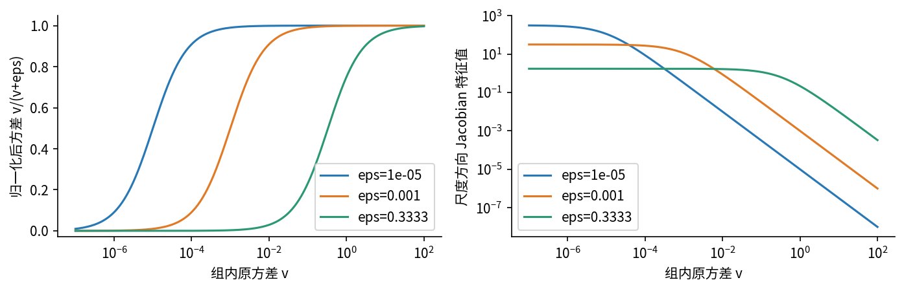

## 3 归一化为什么必须进入计算图

### 3.1 把每条局部路径写出来

下面先对一个统计组推导。上游给出$a_i=\partial L/\partial q_i$，从除法开始：

$$\frac{\partial q_i}{\partial c_i}\Big|_v=\frac1s,\qquad \frac{\partial q_i}{\partial v}\Big|_c=-\frac{c_i}{2(v+\epsilon)^{3/2}}.$$

竖线表示暂时把另一个输入当独立量固定，不是完整导数。方差分支累积为

$$\bar v=-\frac12(v+\epsilon)^{-3/2}\sum_i a_i c_i.$$

均值的上游要同时接收直接中心化和方差路径：

$$\bar\mu=-\sum_i\frac{a_i}{s}+\bar v\frac1m\sum_i(-2c_i).$$

最后的和在精确算术中为0，但保留它能看清路径来自哪里。每个输入收到三项：

$$\bar z_i=\frac{a_i}{s}+\bar v\frac{2c_i}{m}+\frac{\bar\mu}{m}.$$

三项依次是直接路径、方差路径、均值路径。若在代码里把均值与方差detach，便只留下第一项；那不再是原归一化函数的导数。

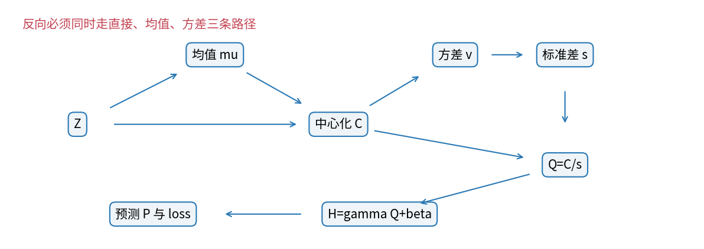

### 3.2 化成可检查的Jacobian

用$\partial\mu/\partial z_k=1/m$和$\partial v/\partial z_k=2c_k/m$，对每个$q_i$求导：

$$J_{ik}=\frac{\partial q_i}{\partial z_k}=\frac1s\left(\delta_{ik}-\frac1m-\frac{q_iq_k}{m}\right).$$

这里$\delta_{ik}$是i等于k时取1、否则取0的符号。i是归一化输出编号，k是输入编号。反向是$\bar z_k=\sum_i a_iJ_{ik}$，不是只取$J_{kk}$。BN中这些编号跨样本；LN中它们跨同一个样本内部的特征。矩阵形式可化简为

$$\bar z_i=\frac1s\left(a_i-\operatorname{mean}(a)-q_i\operatorname{mean}(aq)\right).$$

这给出两条非常有用的检查。第一，$J\mathbf1=0$，所以$\sum_i\bar z_i=0$；训练态BN之前单独加的共享偏置b，其梯度会抵消。结论假定这条BN路径是该偏置影响损失的唯一途径，不含额外惩罚或旁路。第二，$Jq=\epsilon q/s^3$，所以epsilon大于0时尺度方向一般不被完全消去。浮点计算里约$10^{-18}$的残余不应被解释为真实信号。

## 4 三个样本的13参数完整闭环

### 4.1 固定所有约定

本例有输入仿射层、BN的缩放平移、输出仿射层；暂不加激活函数，以免把归一化路径藏在别的非线性里。BN本身在训练态通过批统计产生非线性与跨样本依赖。输入和标签是

$$X=\begin{pmatrix}-1&0\\0&1\\1&2\end{pmatrix},\quad y=(0.2,-0.1,0.8)^T.$$

$Z=XW+b$，W的行对应输入坐标、列对应隐藏特征。初值

$$W=\begin{pmatrix}1&0\\0&1\end{pmatrix},\quad b=(1,-1),\quad\gamma=(1,0.5),\quad\beta=(0.25,-0.1).$$

$H=\gamma\odot Q+\beta$，$P=Hu+c$，$u=(0.6,-0.4)^T,c=0.05$。总共4+2+2+2+2+1=13个参数。取$\epsilon=1/3$、$L=\sum_i(P_i-y_i)^2/(2B)$，B=3，SGD学习率0.1，无动量、无权重衰减。参数只在全部梯度就绪后同时更新。

|量|shape|含义|
|---|---|---|
|X Z Q H|3×2|三样本 两特征|
|W|2×2|输入特征到隐藏特征|
|mu v s gamma beta b|长度2，广播时1×2|每特征一项|
|P y dP|长度3|每样本一项|
|J|2×3×3|每特征一个跨样本Jacobian|
|逐损失参数贡献|3×13|每个损失项对全部参数的贡献|

数据三行只是为精确计算构造的合成例子，输入行具有特殊线性关系。以下数值只验证算法，不借它推断训练可识别性或泛化。

### 4.2 第一次前向不能跳过均值方差

逐行乘W加b得$Z_1=(0,-1)$、$Z_2=(1,0)$、$Z_3=(2,1)$。因此$\mu=(1,0)$，两列中心化都为(-1,0,1)，各列平方和2，除以3得$v=(2/3,2/3)$。再加epsilon=1/3，开方得$s=(1,1)$。这就是本例选择epsilon的原因。

|样本|Z|Q|H|P|误差|半平方误差|
|---|---|---|---|---|---|---|
|1|(0, -1)|(-1, -1)|(-0.75, -0.6)|-0.16|-0.36|0.0648|
|2|(1, 0)|(0, 0)|(0.25, -0.1)|0.24|0.34|0.0578|
|3|(2, 1)|(1, 1)|(1.25, 0.4)|0.64|-0.16|0.0128|

例如样本1：$P_1=(-0.75)0.6+(-0.6)(-0.4)+0.05=-0.16$。它的误差为-0.36，半平方误差0.0648。三项相加为0.1354，再除3得到$L_0=0.0451333333333$。半平方误差不是最终平均损失；下面反向只在$dP=(P-y)/3$处除一次3。

### 4.3 先到H与Q 再通过三条BN路径

输出层局部导数是$\partial P_i/\partial H_{ij}=u_j$、$\partial P_i/\partial u_j=H_{ij}$、$\partial P_i/\partial c=1$。BN仿射局部导数是$\partial H_{ij}/\partial Q_{ij}=\gamma_j$、对gamma为$Q_{ij}$、对beta为1。

|样本|dP|dH=dP u|dQ=dH gamma|
|---|---|---|---|
|1|-0.12|(-0.072, 0.048)|(-0.072, 0.024)|
|2|0.113333333|(0.068, -0.0453333333)|(0.068, -0.0226666667)|
|3|-0.0533333333|(-0.032, 0.0213333333)|(-0.032, 0.0106666667)|

均值局部导数对每个输入都是1/3；方差对各输入行的局部导数为$2c_i/3$，两列均为(-2/3,0,2/3)。$\partial Q/\partial v=-c/2$在本次s=1时，两列均为(0.5,0,-0.5)。于是

$$\bar v_1=(-0.072)(0.5)+0.068(0)+(-0.032)(-0.5)=-0.02,$$

$$\bar v_2=0.024(0.5)+(-0.0226666667)(0)+0.0106666667(-0.5)=0.00666666667.$$

两列dQ求和为(-0.036,0.012)，故$\bar\mu=(0.036,-0.012)$。现在三条路径逐行相加：

|样本|直接dQ/s|方差路径|均值路径|总dZ|
|---|---|---|---|---|
|1|(-0.072, 0.024)|(0.0133333333, -0.00444444444)|(0.012, -0.004)|(-0.0466666667, 0.0155555556)|
|2|(0.068, -0.0226666667)|(0, 0)|(0.012, -0.004)|(0.08, -0.0266666667)|
|3|(-0.032, 0.0106666667)|(-0.0133333333, 0.00444444444)|(0.012, -0.004)|(-0.0333333333, 0.0111111111)|

输入梯度为$dX=dZ W^T$，初始W为单位矩阵，所以本次dX与上表dZ相同。它们不是需要更新的参数，但显示每个输入对总损失的影响，程序也逐坐标核验了这些数值。

### 4.4 不能把一行BN独立当成一个样本网络

本次每个特征的Jacobian都为

$$J=\begin{pmatrix}1/3&-1/3&0\\-1/3&2/3&-1/3\\0&-1/3&1/3\end{pmatrix}.$$

样本1损失给第1特征的上游dQ是-0.072，乘J的第1行，向三个输入行分别贡献(-0.024,0.024,0)。第2特征是0.024乘同一行，贡献(0.008,-0.008,0)。所以即使只求样本1损失，它也通过均值方差影响输入行2。样本3的对应贡献也不能漏掉。

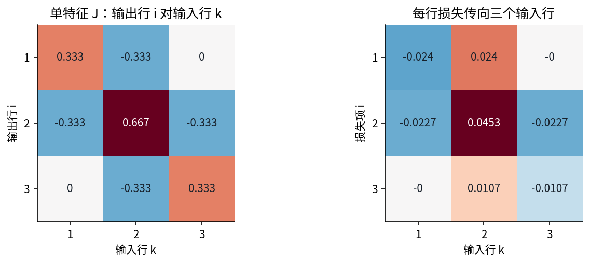

第1特征的全部跨样本损失路径如下。每行已经含平均损失的1/3：

|损失项|输入行1|输入行2|输入行3|
|---|---|---|---|
|1|-0.024|0.024|0|
|2|-0.0226666667|0.0453333333|-0.0226666667|
|3|0|0.0106666667|-0.0106666667|

第2特征的全部跨样本损失路径如下。每行已经含平均损失的1/3：

|损失项|输入行1|输入行2|输入行3|
|---|---|---|---|
|1|0.008|-0.008|0|
|2|0.00755555556|-0.0151111111|0.00755555556|
|3|0|-0.00355555556|0.00355555556|

对每个损失项i，先得到它对所有输入行的$dZ^{(i)}$，再算$dW^{(i)}=X^TdZ^{(i)}$、$db^{(i)}=\sum_kdZ^{(i)}_k$。gamma、beta、u、c的贡献分别为$dH_iQ_i,dH_i,dP_iH_i,dP_i$。下表把13项全部展开，不用“其余类似”省掉它们。

|参数|损失1贡献|损失2贡献|损失3贡献|合计梯度|
|---|---|---|---|---|
|W11|0.024|0|-0.0106666667|0.0133333333|
|W12|-0.008|0|0.00355555556|-0.00444444444|
|W21|0.024|0|-0.0106666667|0.0133333333|
|W22|-0.008|0|0.00355555556|-0.00444444444|
|b1|0|0|0|0|
|b2|0|0|0|0|
|gamma1|0.072|0|-0.032|0.04|
|gamma2|-0.048|0|0.0213333333|-0.0266666667|
|beta1|-0.072|0.068|-0.032|-0.036|
|beta2|0.048|-0.0453333333|0.0213333333|0.024|
|u1|0.09|0.0283333333|-0.0666666667|0.0516666667|
|u2|0.072|-0.0113333333|-0.0213333333|0.0393333333|
|c|-0.12|0.113333333|-0.0533333333|-0.06|

例如$\partial L/\partial W_{11}=(-1)(-0.0466666667)+0(0.08)+1(-0.0333333333)=0.0133333333$。$\partial L/\partial W_{21}=0(-0.0466666667)+1(0.08)+2(-0.0333333333)=0.0133333333$。两者相同源于这组特殊X，不是一般恒等式。b的两项为0，gamma的两项为0.04和-0.0266666667，验证了前面路径求和的含义。

### 4.5 同时更新13个参数

$$\theta_1=\theta_0-0.1\nabla L(\theta_0).$$

绝不能更新u后再用新u计算尚未计算的dH。本步所有梯度都来自同一个旧参数快照。

|参数|旧值|变化量|新值|
|---|---|---|---|
|W11|1|-0.00133333333|0.998666667|
|W12|0|0.000444444444|0.000444444444|
|W21|0|-0.00133333333|-0.00133333333|
|W22|1|0.000444444444|1.00044444|
|b1|1|0|1|
|b2|-1|0|-1|
|gamma1|1|-0.004|0.996|
|gamma2|0.5|0.00266666667|0.502666667|
|beta1|0.25|0.0036|0.2536|
|beta2|-0.1|-0.0024|-0.1024|
|u1|0.6|-0.00516666667|0.594833333|
|u2|-0.4|-0.00393333333|-0.403933333|
|c|0.05|0.006|0.056|

### 4.6 第二次前向重新计算统计量

新W与新b产生新的Z，不能继续套用旧的均值、方差或J。为了把变化看清楚，保留九位有效数字；完整浮点记录见Notebook及hand-trace.json。下表先列每个特征的统计量。

|特征|mu|v|s|
|---|---|---|---|
|1|0.998666667|0.663115852|0.998223014|
|2|0.000444444444|0.667852379|1.00059268|

|样本|Z|Q|H|P|误差|
|---|---|---|---|---|---|
|1|(0.00133333333, -1.00044444)|(-0.999108736, -1.00029603)|(-0.741512301, -0.605215473)|-0.14060953|-0.34060953|
|2|(0.998666667, 0.000444444444)|(0, 0)|(0.2536, -0.1024)|0.248212507|0.348212507|
|3|(1.996, 1.00133333)|(0.999108736, 1.00029603)|(1.2487123, 0.400415473)|0.637034544|-0.162965456|

三个半平方误差分别是0.0580074261, 0.0606259749, 0.01327887，平均损失为0.043970757。损失下降是这个有限步长实例的观察，不是任意BN网络一步必下降的保证。

### 4.7 第二次局部导数 路径累积与梯度

第二次的$\partial P/\partial H=u=(0.594833333,-0.403933333)$；$\partial H/\partial Q=\gamma=(0.996,0.502666667)$。对gamma的局部导数就是上一表Q，对u就是H，对beta和c仍为1，对W仍是X，对b仍为1。均值对每个Z仍为1/3。其余BN局部量在新中心化值与新s处重新计算：

|样本|dv/dZ|dQ/dv|dP|dH|dQ|
|---|---|---|---|---|---|
|1|(-0.664888889, -0.667259259)|(0.501334514, 0.499555687)|-0.11353651|(-0.0675353008, 0.045861181)|(-0.0672651596, 0.023052887)|
|2|(0, 0)|(0, 0)|0.116070836|(0.069042802, -0.0468848795)|(0.0687666308, -0.0235674661)|
|3|(0.664888889, 0.667259259)|(-0.501334514, -0.499555687)|-0.0543218188|(-0.0323124285, 0.0219423933)|(-0.0321831788, 0.0110297097)|

方差上游dvar=(-0.0175878078, 0.00600624658)，均值上游dmu=(0.0307363256, -0.0105089022)。除法对中心化量的直接导数是1/s，约(1.00178015,0.999407671)。对应三条路径为：

|样本|直接|经方差|经均值|总dZ|输入dX|
|---|---|---|---|---|---|
|1|(-0.0673849016, 0.0230392321)|(0.011693938, -0.00400772365)|(0.0102454419, -0.00350296739)|(-0.0454455218, 0.015528541)|(-0.0453780262, 0.0155960366)|
|2|(0.0688890457, -0.0235535064)|(0, 0)|(0.0102454419, -0.00350296739)|(0.0791344876, -0.0270564738)|(0.0790169498, -0.0271740115)|
|3|(-0.0322404697, 0.0110231765)|(-0.011693938, 0.00400772365)|(0.0102454419, -0.00350296739)|(-0.0336889658, 0.0115279327)|(-0.0336389236, 0.0115779749)|

第二次第1特征的J如下。现在不能把第一步的0随意保留：

|输出行|输入1|输入2|输入3|
|---|---|---|---|
|1|0.334521685|-0.333926717|-0.000594968589|
|2|-0.333926717|0.667853433|-0.333926717|
|3|-0.000594968589|-0.333926717|0.334521685|

第1特征按损失来源的全部路径：

|损失项|输入1|输入2|输入3|
|---|---|---|---|
|1|-0.0225016545|0.0224616339|4.00206571e-05|
|2|-0.0229630152|0.0459260305|-0.0229630152|
|3|1.91479805e-05|0.0107468232|-0.0107659712|

第二次第2特征的J如下。现在不能把第一步的0随意保留：

|输出行|输入1|输入2|输入3|
|---|---|---|---|
|1|0.332938623|-0.33313589|0.000197267698|
|2|-0.33313589|0.66627178|-0.33313589|
|3|0.000197267698|-0.33313589|0.332938623|

第2特征按损失来源的全部路径：

|损失项|输入1|输入2|输入3|
|---|---|---|---|
|1|0.00767519644|-0.00767974403|4.54758994e-06|
|2|0.0078511688|-0.0157023376|0.0078511688|
|3|2.17580544e-06|-0.00367439216|0.00367221636|

|参数|损失1贡献|损失2贡献|损失3贡献|合计梯度|
|---|---|---|---|---|
|W11|0.0225416752|0|-0.0107851192|0.011756556|
|W12|-0.00767064885|0|0.00367004055|-0.00400060829|
|W21|0.0225416752|0|-0.0107851192|0.011756556|
|W22|-0.00767064885|0|0.00367004055|-0.00400060829|
|b1|0|0|0|0|
|b2|0|0|0|0|
|gamma1|0.067475109|0|-0.0322836296|0.0351914794|
|gamma2|-0.0458747574|0|0.021948889|-0.0239258684|
|beta1|-0.0675353008|0.069042802|-0.0323124285|-0.0308049273|
|beta2|0.045861181|-0.0468848795|0.0219423933|0.0209186948|
|u1|0.0841887189|0.0294355639|-0.0678323233|0.0457919595|
|u2|0.0687140526|-0.0118856536|-0.0217512967|0.0350771023|
|c|-0.11353651|0.116070836|-0.0543218188|-0.0517874933|

### 4.8 第二次同时更新后 再做第三次前向

仍用$\theta_2=\theta_1-0.1g_2$；归一化状态与SGD参数是不同对象，第6节再给运行状态对应的具体数字。

|参数|旧值|变化量|新值|
|---|---|---|---|
|W11|0.998666667|-0.0011756556|0.997491011|
|W12|0.000444444444|0.000400060829|0.000844505274|
|W21|-0.00133333333|-0.0011756556|-0.00250898893|
|W22|1.00044444|0.000400060829|1.00084451|
|b1|1|0|1|
|b2|-1|0|-1|
|gamma1|0.996|-0.00351914794|0.992480852|
|gamma2|0.502666667|0.00239258684|0.505059254|
|beta1|0.2536|0.00308049273|0.256680493|
|beta2|-0.1024|-0.00209186948|-0.104491869|
|u1|0.594833333|-0.00457919595|0.590254137|
|u2|-0.403933333|-0.00350771023|-0.407441044|
|c|0.056|0.00517874933|0.0611787493|

第三次纯公式前向的mu=(0.997491011, 0.000844505274)，v=(0.659992816, 0.668920583)，s=(0.996657489, 1.00112632)。此诊断不更新运行buffer。

|样本|Z|Q|H|P|误差|半平方误差|
|---|---|---|---|---|---|---|
|1|(0.00250898893, -1.00084451)|(-0.998318914, -1.00056205)|(-0.734131914, -0.609834993)|-0.123673844|-0.323673844|0.0523823787|
|2|(0.997491011, 0.000844505274)|(0, 0)|(0.256680493, -0.104491869)|0.255259748|0.355259748|0.0631047445|
|3|(1.99247303, 1.00253352)|(0.998318914, 1.00056205)|(1.2474929, 0.400851255)|0.634193341|-0.165806659|0.013745924|

平均损失为0.0430776824。至此，同一三行数据完成了两轮完整前向、局部求导、所有路径累积、全部参数同时更新和下一轮前向。

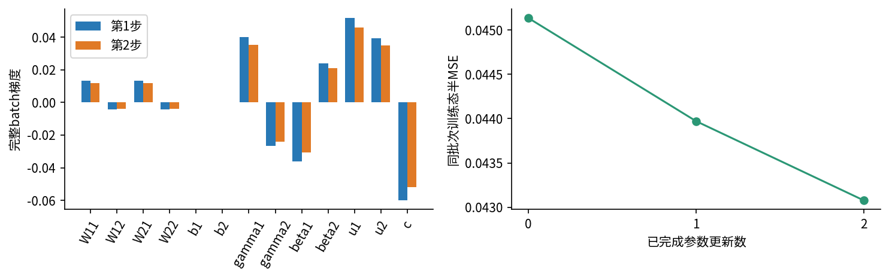

## 5 LN换的是统计组 不是一个随意替换的名称

对$Z=\begin{pmatrix}1&3\\2&2\end{pmatrix}$，LN沿每行两个特征计算。第一行mu=2、v=1，第二行mu=2、v=0。若epsilon=1，则Q的两行是$(-1/\sqrt2,1/\sqrt2)$与(0,0)。取gamma=(2,1)、beta=(0.1,-0.2)，H分别约(-1.31421356,0.507106781)和(0.1,-0.2)。更换第二个样本不会改变第一行统计量。

LN反向仍可使用第3节的J，但这里m=特征数。若各特征gamma不同，要先计算$a_j=\bar h_j\gamma_j$，再进入J。把gamma错误地移到整个VJP外面，一般不成立。D=1时层能运行，但每个位置输出只有beta；“支持batch_size1”不等于任意normalized_shape都保留有用信息。

LN减少了批组成依赖，也改变了保留的信息。对同一行加公共偏移会被消掉；在epsilon可忽略时，正比例放大也近似被消掉。如果任务标签与该行的绝对幅度有关，要判断其他路径是否保留幅度，不能只凭训练稳定就认为语义没有损失。

对序列形状(2,3,2)，附带代码分别计算BN跨(0,1)、LN跨(2)、LN跨(1,2)，再与PyTorch逐坐标比较。三种输出shape完全相同却数值不同，这是形状检查必要但不充分的例子。位置之间的连接或上游网络本身仍可能引入依赖；“LN无跨样本统计”仅指这次归一化运算。

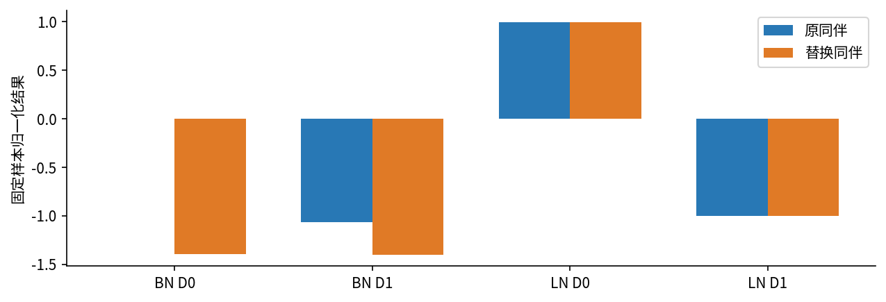

## 6 训练态与推理态需要不同的统计策略

### 6.1 运行统计不是梯度优化的参数

默认PyTorch BN在训练前向时用当前批mu和分母m的v归一化，同时更新运行均值$r_\mu$和运行方差$r_v$。它们是buffer，不由optimizer的学习率更新；gamma、beta才是可训练参数。[PyTorch2.7 BatchNorm1d文档](https://docs.pytorch.org/docs/2.7/generated/torch.nn.BatchNorm1d.html)明确区分训练前向方差与运行方差估计。m大于1时，当前批送入运行方差的数为$\widetilde v=m v/(m-1)$。

这里把BN的momentum写作a，避免与033的优化器动量混淆：

$$r_{\mu,t}=(1-a)r_{\mu,t-1}+a\mu_t,\quad r_{v,t}=(1-a)r_{v,t-1}+a\widetilde v_t.$$

a越大越偏重最新批；这与优化器中通常把beta当旧状态保留系数的记法相反。默认初始均值0、方差1。手算设a=.2，第1步mu=(1,0)，v=(2/3,2/3)，无偏批方差为(1,1)，因此运行均值变(.2,0)，运行方差仍(1,1)。第2步使用更新参数之前的激活统计，得到：

|时刻|运行均值|运行方差|计数|
|---|---|---|---|
|1|(0.2, 0)|(1, 1)|1|
|2|(0.359733333, 8.88888889e-05)|(0.998934756, 1.00035571)|2|

先前各节为了看下一次损失而调用的是不带buffer更新的纯数学函数。若直接把训练中的BN模型多前向一次，即使不反传，也可能多更新一次运行统计，不能把调试前向当作无副作用读取。

### 6.2 eval固定统计 但不关闭求导

默认track_running_stats=True时，eval用保存的$r_\mu,r_v$：

$$q_i=\frac{z_i-r_\mu}{\sqrt{r_v+\epsilon}}.$$

这时固定统计对输入的Jacobian在同一通道内为对角矩阵$1/\sqrt{r_v+\epsilon}$，没有当前batch的均值方差反向路径。与训练态计算的是不同函数；即使用同一批数据，也不保证输出完全一样。本手算训练两步后，eval使用的运行统计仍包含初始状态与旧参数时期的信息。

同一三行数据在theta2处，训练态纯前向P=(-0.123673844, 0.255259748, 0.634193341)，eval前向P=(0.252311034, 0.578808977, 0.905306921)；eval半MSE=0.0791012699。差异没有经过任何新的SGD更新。

[Module.eval官方说明](https://docs.pytorch.org/docs/2.7/generated/torch.nn.Module.html#torch.nn.Module.eval)把它定义为模块模式切换；[no_grad说明](https://docs.pytorch.org/docs/2.7/generated/torch.no_grad.html)控制自动微分记录。二者不能代替。下图在可求导输入和参数存在时实际执行四种组合：

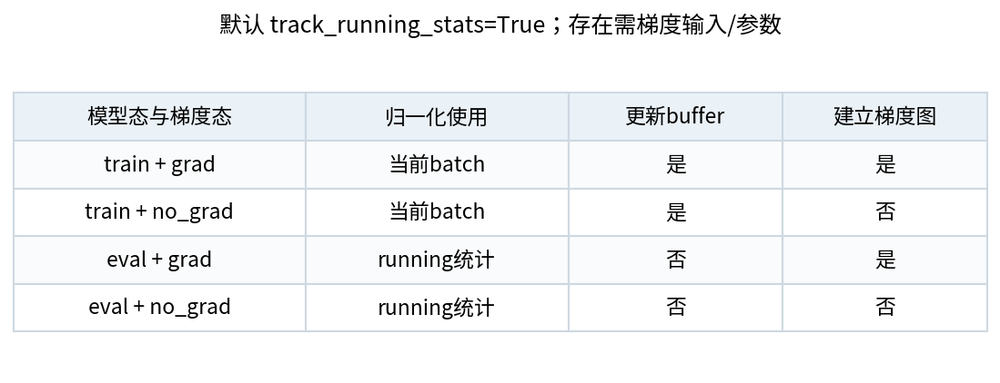

若track_running_stats=False，BN不保存这两个运行buffer，eval也继续用当前batch统计，因而batch组成仍会影响结果。LayerNorm则在train与eval都使用各自输入组内的统计，归一化这部分公式不因eval切换；整个模型中的其他层仍可能受切换影响。[PyTorch2.7 LayerNorm定义](https://docs.pytorch.org/docs/2.7/generated/torch.nn.LayerNorm.html)还规定normalized_shape决定尾部轴与仿射参数形状。

### 6.3 运行方差并不等于拼接所有历史数据的方差

即使把momentum设成None，PyTorch也累计平均每个批的统计，不自动把不同批按样本数加权。两批[0,2]与[10,10,12,12]的批均值分别1、11，累计平均为6；六个数的整体样本均值是46/6=7.66666667。两批无偏方差分别2、4/3，平均为5/3；拼接后的方差还包含批均值之间的差异，不能用5/3替代。

默认EMA更会受顺序、batch大小、最后一批和上游参数移动影响。因此不能在看到eval不佳时，悄悄把测试样本送入训练态“修复”统计。若研究确需校准或适应，应先规定允许的数据来源、模型状态、是否重置、更新规则与评价协议；本讲只演示错误造成的变化，没有进行测试时自适应。

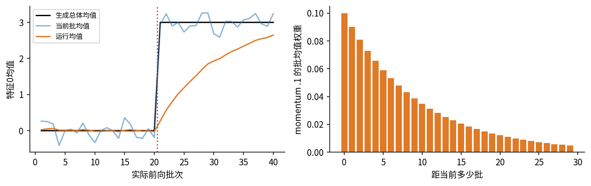

## 7 小批量还有哪些可观察后果

### 7.1 数学可定义不等于框架接受训练输入

BN训练二维输入(1,C)时，每通道只有一个数。数学式有epsilon仍能得到0，但PyTorch训练BN会拒绝这种每通道统计组只有一个元素的输入。相反(1,C,L)且L大于1时，统计组包含L个元素，单个N也可运行。相关位置不自动等价于同样多的独立样本，018的采样依赖仍要保留。

若最后一批只剩一条记录，检查数据加载器和统计轴，不能只用try/except吞掉。直接drop_last会改变哪些记录被训练；改为eval会换成另一函数；改用LN会改变信息归约方式。每个选择都需要在实验协议中说明。

### 7.2 同一个锚点 因随机同伴而波动

实验固定锚点(0.5,-0.5)，分别加入B-1个独立标准正态同伴，对B=2、4、8、32各做200次。注意整个批不是完全独立同分布，因为第一行被固定。图中箱线只描述该设计的200次观察，不是一般总体置信区间。数值全部保留在batch-sampling.csv。

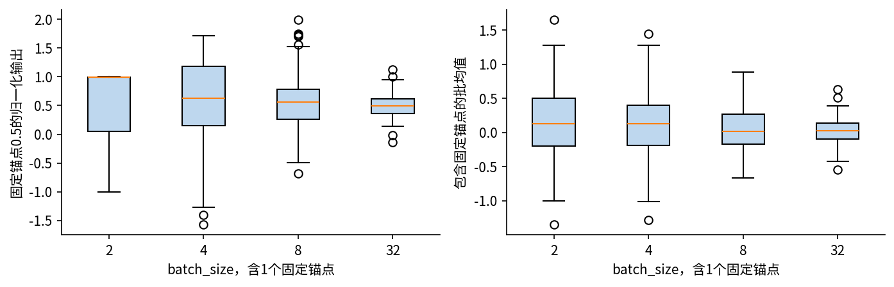

### 7.3 梯度累积不再自动等价于大batch

027中按正确样本权重累积微批梯度，可与同一个逐样本可分目标的大批计算一致。BN训练态每次前向都会重新定义统计组，所以把4行一次送入，与分成两个2行微批，即使各微批损失都乘1/2，目标也不同。

本讲另加第4行$(2,-1)$、标签0.4，仍用手算初值：一次4行损失0.162367358，两个2行正确加权损失0.235715513；13维梯度的最大坐标差0.0886953887。不是平均因子错了，而是均值方差变了。同步统计、冻结BN或其他归一化属于不同方案，需明确实现和实验边界，本讲没有执行分布式同步BN。

## 8 把模式错误放进真实训练循环

采用另外96行原创合成回归数据，前64行训练、后32行仅做诊断验证，无测试排名或选择。输入来自固定种子的二维标准正态，标签为$0.7x_1-0.4x_2+0.3\tanh(x_1+x_2)+\xi$，$\xi\sim N(0,0.08^2)$。这个定义不表示现实数据分布。

模型是2→4仿射、BN4、tanh、4→1仿射，共12+8+5=25个参数；BN另有4维运行均值、4维运行方差与计数。固定初值、学习率.03、SGD无动量，无搜索无早停。B取4与16，重排种子360/361/362，各8个epoch、512次训练样本呈现。B=4有128次更新和128次BN统计更新；B=16只有32次。相同样本预算不等于相同优化预算，也不等于时间公平。

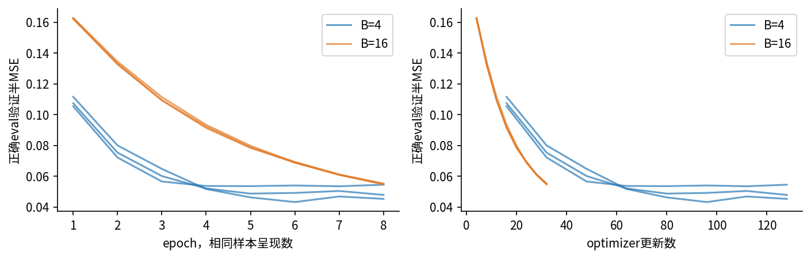

每次epoch后正确eval加no_grad计算验证损失，并逐buffer断言没有改变状态。训练结束后，另深拷贝一个模型，故意只加no_grad却保持train，将32行验证数据分成8个4行批次。这样既改变当前预测，也让运行计数增加8。之后再切eval，统计已经被污染；它的损失偶然更低也不能把这次验证称为纯观察。

|B/seed|正确eval|误用train+no_grad|污染后再eval|运行均值最大变化|
|---|---|---|---|---|
|4/360|0.0479431733|0.123422991|0.0453090134|0.110061871|
|4/361|0.0453843993|0.128343112|0.0480996149|0.124481908|
|4/362|0.0545999033|0.128758385|0.0570114013|0.130245623|
|16/360|0.0553262746|0.135290241|0.0552827801|0.106656367|
|16/361|0.0549058871|0.134956279|0.0548440552|0.109858231|
|16/362|0.0549178125|0.135315302|0.0552951587|0.110442175|

正确eval把验证数据一次处理与分成4行处理，本环境的预测逐位相同；更一般的硬件和内核下只能期望数值容差内一致，不能许诺跨平台逐位相同。这里的错误验证差异来自归一化状态和统计组变化。代码深拷贝后做错误示范，不污染用于正确报告的模型。

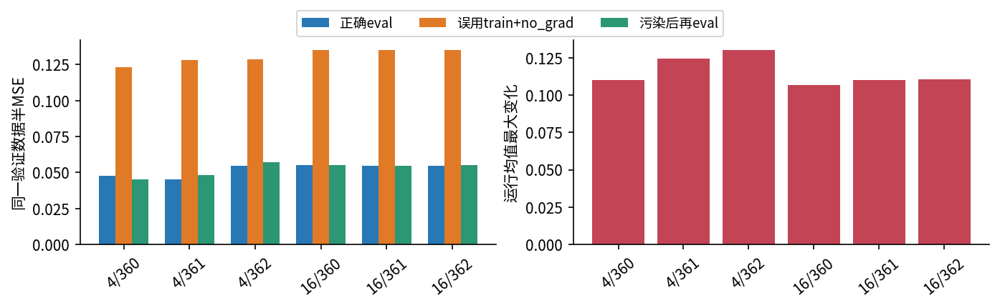

六条轨迹所有480次更新都由独立NumPy公式重建，最终25参数、运行统计和每epoch验证损失与PyTorch比较。手算两步另外用精确分数及75位Decimal差分核验，32个随机13参数网络同时检查参数和输入梯度。两类核验验证实现，不替代科研评价设计。

## 9 保存和恢复时别漏掉运行状态

只保存gamma、beta、W等参数不够，BN推理还依赖running_mean、running_var与num_batches_tracked。state_dict会包括这些buffer。但模块的training布尔开关不会通过普通state_dict自动恢复；新建模块load_state_dict之后仍应显式设置需要的train或eval。实验确实构造源train、目标eval再载入状态，目标仍保持eval。

可靠评价需要同时明确参数快照、运行buffer、数据拆分、batch组成和模型模式。若一个父模块调用train()，子BN一般也会回到训练态；冻结BN时要确认每个目标子模块的实际training值。冻结参数的requires_grad与冻结运行统计是两件事。涉及混合模式时，临时评价应逐模块记录并恢复各自模式，而不是只恢复一个根布尔值。

## 10 练习与科研检查单

1. 用三行手算数据，遮住答案重算第一次mu、v、s、P、L，再检查1/3只在何处出现。
2. 只保留直接dQ/s路径，求W11的错误梯度。与0.0133333333比较并解释差异。
3. 写出样本2损失对样本1第1隐藏输入的梯度。为什么样本1不属于该标签，也收到梯度？
4. 推导J乘全1向量以及J乘q的结果，解释epsilon与平移、尺度不变性的区别。
5. 对本讲LN两行例子手算H，说明第二行Q为0时，为什么D=2的输入导数仍可能非零。
6. 计算两次运行均值和方差；解释为什么即使第二次没有backward，训练前向仍能改变buffer。
7. 用[0,2]和[10,10,12,12]核对累计均值与拼接均值、两种方差。哪一步丢失了组间信息？
8. 解释B=1、L=2与B=1二维BN的差别，并写出数据加载最后一批的检查。
9. 重新运行4行微批反例，指出正确损失加权为什么仍无法恢复大batch梯度。
10. 阅读六次训练结果，列出不能据它宣称“B=4普遍更好”的至少四条理由，并修复错误验证代码。

做真实科研时先写清楚：归一化轴、epsilon、仿射形状、是否保存运行统计、统计更新系数与数据来源、训练与验证模式、最后一批、梯度累积、恢复状态。变更这些条件可能改变模型函数或评价协议，应当记录而不是当作无关实现细节。下一讲在此基础上讨论正则化和增强所施加的假设。
