# 037 正则化与数据增强

这一讲回答一个具体问题：怎样限制不可靠的拟合，又避免把真正的信号一起压掉？正则化给学习过程增加偏好；增强对“哪些变化不该改变答案”作出假设。两者都不是只要打开就能提高成绩的开关。我们将把数学对象、逐样本计算、模型状态和实验比较连成一条链。

先修020中的经验风险与验证边界，034中的L2和AdamW区别，以及036中的train、eval和no_grad。本讲重新给出所有手算数据与参数，无需跨讲导入程序。先用一个九参数回归网络精确核对dropout，再用独立的697参数二分类网络做有限消融。二者承担不同证据职责，手算的平方损失数值不能直接与分类交叉熵比较。

## 1 先写出你希望模型保留什么

设训练集为D={(xᵢ,yᵢ)}，参数为θ，原任务损失为ℓ。经验风险是n条训练记录的平均，真正关心的总体风险是新的目标分布上的期望。020已经说明，在训练集上选择模型后再报告训练成绩，会利用这份数据的偶然性。这里不重新把“训练损失低”当成有效性的判据。

正则化可以改变目标，例如给经验风险加参数惩罚；也可以改变算法，例如从优化轨迹中较早取一个参数快照；还可以向计算加入随机性。数据增强改变训练时呈现的输入或输入标签对，标签平滑改变目标分布。它们可能提高偏差、降低某些不稳定性，也可能丢失与任务有关的信息。

因此需要同时问两件事：施加了什么偏好；有什么独立证据表明这种偏好适合当前任务。相同训练测试差距可能对应很不同的模型。一个始终输出0.5的分类器可以很少过拟合，也可能根本没学会可用的规律。

本讲不把五种方法一次全加。主实验为固定预算基线、早停、dropout、解耦衰减、合法增强、故意错误的增强、标签平滑，共七个预先指定的处理。除该处理外，数据、结构、优化器基础配置和配对随机种子相同。组合效果及相互作用需要另一个实验设计，当前没有测试。

## 2 权重惩罚怎样进入目标与梯度

### 2.1 平均损失和参数选择必须明确

用一个对角选择矩阵S记录哪些参数受到惩罚：选中的坐标Sⱼⱼ=1，其余为0。λ≥0是强度，采用带1/2的约定：

$$J_D(\theta)=\frac1n\sum_{i=1}^n\ell(f_\theta(x_i),y_i)+\frac\lambda2\theta^\top S\theta.$$

参数有d个数，S是d×d矩阵，J是标量。对任一坐标θⱼ，平方项求导是2θⱼ，恰好与1/2抵消；S为对角0/1时得到：

$$\nabla_\theta J_D=\nabla_\theta\widehat R_D+\lambda S\theta.$$

这条惩罚路径与数据路径并行。某参数在本批数据路径上梯度为0，仍可能被惩罚移动。把λ‖θ‖²写成目标时，梯度则是2λθ，不能在公式与代码之间丢掉2。

若将平均损失改成样本求和而λ保持不变，数据梯度放大n倍，惩罚相对变弱。要保持同一个最优点，可把整个原目标乘n，因此求和版本的惩罚系数也需乘n。即使目标整体倍乘后最优点不变，优化轨迹仍受学习率、epsilon等影响；034已经解释自适应优化中的尺度边界。

### 2.2 一个可以直接求解的几何例子

单独看两个参数w₁、w₂，令数据目标为L=.5[(w₁−2)²+.2(w₂+1)²]，惩罚为λ(w₁²+w₂²)/2。令两个偏导为0，得到(w₁−2)+λw₁=0与.2(w₂+1)+λw₂=0，因此：

$$w_1^*=\frac2{1+\lambda},\qquad w_2^*=\frac{-.2}{.2+\lambda}.$$

两个方向的训练目标曲率不同，所以加入同一个惩罚后，相对收缩幅度也不同。λ从0增大，会向原点偏移，却不必沿数据最优点到原点的直线移动。图1的曲线由这两个明确公式产生，不是神经网络实测结果。

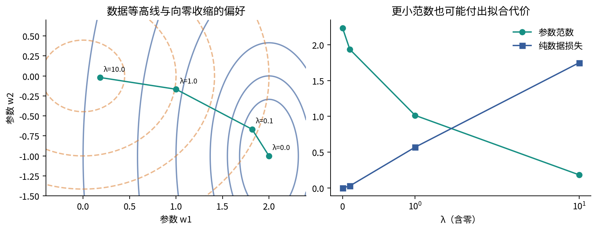

“权重小”还依赖输入单位与参数化。把一个输入从米改为厘米，同一个预测函数可用缩小100倍的对应权重表示；不处理单位就比较范数会失真。ReLU网络也可以将一层权重乘正数、下一层除以同数而保持部分函数不变，却改变惩罚。BN前权重缩放又受到036中归一化的影响。因此参数惩罚不是一个完全不依赖表示方式的“函数复杂度真值”。

### 2.3 L2与衰减只在明确条件下相同

无动量、无自适应缩放的普通SGD给出：

$$\theta^+=\theta-\eta(g+\lambda S\theta)=(I-\eta\lambda S)\theta-\eta g.$$

g是纯数据梯度，η是学习率。这时加入L2和按上述因子缩小旧参数等价。若g先经过逐坐标矩阵D缩放，耦合L2会得到−ηλDSθ，解耦衰减则是−ηλSθ，通常不同。Adam还会把耦合项积累进一阶、二阶状态。034的边界在本讲继续有效；不能把AdamW的weight_decay说成当前交叉熵里简单多了一个L2项。[AdamW原论文](https://arxiv.org/abs/1711.05101)

主实验统一使用AdamW，仅在decay处理中将三层权重矩阵的衰减系数设为.1；偏置不衰减。手算为看清并行路径，使用普通SGD和显式L2。两种设置在各自章节标出，不把手算的等价关系偷换到主实验。

## 3 Dropout先是一个明确的随机运算

### 3.1 保留概率和丢弃概率不要混用

固定当前参数、当前输入以及dropout之前的隐藏向量h∈Rᵏ。每个Mⱼ独立取0或1，P(Mⱼ=1)=q，0<q≤1。q是保留概率，p=1−q是丢弃概率。本讲采用inverted dropout：

$$\widetilde h_j=\frac{M_j}{q}h_j.$$

Mⱼ=0时输出0；Mⱼ=1时输出hⱼ/q。训练时把保留值放大，评价时直接用h。PyTorch的p参数表示丢弃概率，所以文档中的1/(1−p)与这里的1/q是同一个数。[PyTorch2.7 Dropout](https://docs.pytorch.org/docs/2.7/generated/torch.nn.Dropout.html)

期望必须说明对谁取。以下E_M是在固定h后，只对本次新采样掩码取平均，不是在对训练数据或已训练参数取平均：

$$E_M[\widetilde h_j\mid h]=q\frac{h_j}{q}+(1-q)0=h_j.$$

二阶原点矩为$E[\widetilde h_j^2\mid h]=h_j^2/q$。减掉均值平方得：

$$\operatorname{Var}_M(\widetilde h_j\mid h)=\frac{1-q}{q}h_j^2.$$

所以保持均值不等于保持数值、不等于保持方差。q越小，相同h下方差越大。q=1时没有随机变化；q=0时该除法无定义。本课程函数拒绝q=0，不能将其悄悄作为普通点带进推导。

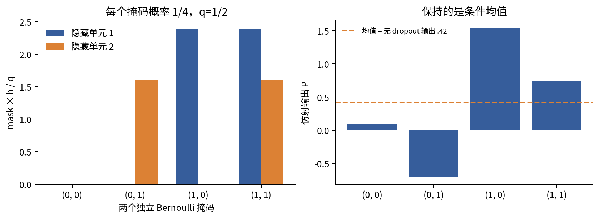

### 3.2 反向传播条件于已经抽到的掩码

在本次计算图中，M是已知的0/1常量，q是预设超参数。局部导数为$\partial\widetilde h_j/\partial h_j=M_j/q$，不同坐标之间导数为0。因此若上游梯度是$\overline{\widetilde h}$，则$\bar h=\overline{\widetilde h}\odot M/q$。

“被丢弃的路径本次没有数据梯度”不意味着该参数永久不学习。同一个共享参数还可能服务其他样本或其他保留路径；显式惩罚也可以独立更新它。反向时必须沿用这次前向的同一个掩码，不能重新抽一张再相乘。

对于固定训练集，dropout所拟合的数据目标是$E_M[\widehat R_D(\theta;M)]$。掩码分布与θ无关且枚举有限时，可以逐项求导，得到$E_M[\nabla\widehat R_D(\theta;M)]=\nabla E_M[\widehat R_D(\theta;M)]$。它并不是“关闭dropout的目标”的无偏梯度；若后者不同，两个梯度平均也会不同。更一般无限随机空间中的交换还需要相应可积性条件。本讲直接枚举有限掩码，不省略这些边界。

## 4 九个参数走完一次完整计算链

### 4.1 数据 网络 掩码与目标

沿用034的小网络数据和初始参数，新增本节明确给定的dropout及惩罚路径：

$$X=\begin{bmatrix}1&2\\-1&1\end{bmatrix},\quad y=\begin{bmatrix}.7\\-.2\end{bmatrix},\quad W=\begin{bmatrix}.5&-.2\\.3&.4\end{bmatrix}.$$

$$b=(.1,.2),\quad u=(.6,-.5)^\top,\quad c=.1,\quad M=\begin{bmatrix}1&0\\1&1\end{bmatrix},\quad q=.5.$$

X、W、Z、H、M均为2×2，样本放在行；b沿行广播，u为2×1，P和y有两行一列。本节参数顺序固定为(W11,W12,W21,W22,b1,b2,u1,u2,c)。令Z=XW+b，H=ReLU(Z)，$\widetilde H$=H⊙M/q，P=$\widetilde Hu$+c。

采用两条样本半平方误差的平均，再加仅W和u的惩罚：

$$L=\frac12\sum_{i=1}^2\frac{(P_i-y_i)^2}{2},\quad \Omega=\frac{.1}{2}(\|W\|_F^2+\|u\|_2^2),\quad J=L+\Omega.$$

矩阵Frobenius平方范数就是四个元素平方之和。外面的1/2来自样本平均，里面的1/2来自半平方，不能混为一个来源。偏置b和c不惩罚。λ=.1、学习率η=.05是本手算的教学设置，不是推荐默认值。

### 4.2 四个乘加与逐样本损失

Z11=1(.5)+2(.3)+.1=1.2；Z12=1(−.2)+2(.4)+.2=.8；Z21=(−1)(.5)+1(.3)+.1=−.1；Z22=(−1)(−.2)+1(.4)+.2=.8。因此：

$$Z=\begin{bmatrix}1.2&.8\\-.1&.8\end{bmatrix},\quad H=\begin{bmatrix}1.2&.8\\0&.8\end{bmatrix},\quad \widetilde H=\begin{bmatrix}2.4&0\\0&1.6\end{bmatrix}.$$

样本1的第二个单元被dropout关闭；样本2的第一个单元虽然掩码保留，却已被ReLU关闭。两种门控作用于不同位置，不应该只看最后都是0就混淆原因。

P1=2.4(.6)+0(−.5)+.1=1.54；P2=0(.6)+1.6(−.5)+.1=−.7。残差分别为.84与−.5，半平方误差分别为.3528与.125。L=(.3528+.125)/2=.2389。

W的平方和为.54，u的平方和为.61，所以Ω=.1(.54+.61)/2=.0575，标量总目标J=.2964。记录L与Ω两项，才能知道数值改变来自拟合还是惩罚；不能只贴一个不注明组成的loss。

### 4.3 每条局部导数和中间梯度

对每条样本损失ℓᵢ，∂J/∂ℓᵢ=1/2，∂ℓᵢ/∂Pᵢ=Pᵢ−yᵢ，乘起来得到$\bar P$=(.42,−.25)ᵀ。输出对隐藏量的局部导数是uⱼ，对uⱼ的局部导数是$\widetilde H_{ij}$，对c是1：

$$\overline{\widetilde H}=\bar Pu^\top=\begin{bmatrix}.252&-.210\\-.150&.125\end{bmatrix}.$$

再乘本次M/q，得到$\bar H$；再乘ReLU在当前Z的门控，得到$\bar Z$：

$$\bar H=\begin{bmatrix}.504&0\\-.300&.250\end{bmatrix},\quad 1[Z>0]=\begin{bmatrix}1&1\\0&1\end{bmatrix},\quad \bar Z=\begin{bmatrix}.504&0\\0&.250\end{bmatrix}.$$

本例没有Z=0，故不涉及该不可微点的取值约定。仿射层有∂Zᵢⱼ/∂Wₖⱼ=Xᵢₖ，∂Zᵢⱼ/∂bⱼ=1。每个共享参数需累加两条样本路径，然后再加入独立的λSθ路径。下表已经包含样本平均因子，不应再整体除以2。

|参数|样本1数据贡献|样本2数据贡献|惩罚贡献|总梯度|
|---|---|---|---|---|
|W11|0.504|0|0.05|0.554|
|W12|-0|-0.25|-0.02|-0.27|
|W21|1.008|-0|0.03|1.038|
|W22|-0|0.25|0.04|0.29|
|b1|0.504|-0|0|0.504|
|b2|-0|0.25|0|0.25|
|u1|1.008|-0|0.06|1.068|
|u2|0|-0.4|-0.05|-0.45|
|c|0.42|-0.25|0|0.17|

例如W12的两条数据路径为1×0+(−1)×.25=−.25，加惩罚.1(−.2)=−.02，得到−.27。u1的数据路径为.42×2.4+(−.25)×0=1.008，再加.06得到1.068。b2的数据路径为0+.25=.25，因不被惩罚，总梯度仍是.25。c收到.42−.25=.17。

若继续向输入反传，$\bar X=\bar ZW^\top$。样本1为(.504×.5+0×(−.2), .504×.3+0×.4)=(.252,.1512)；样本2为(0×.5+.25×(−.2),0×.3+.25×.4)=(−.05,.1)。输入不更新，惩罚在这里也没有到输入的直接路径。

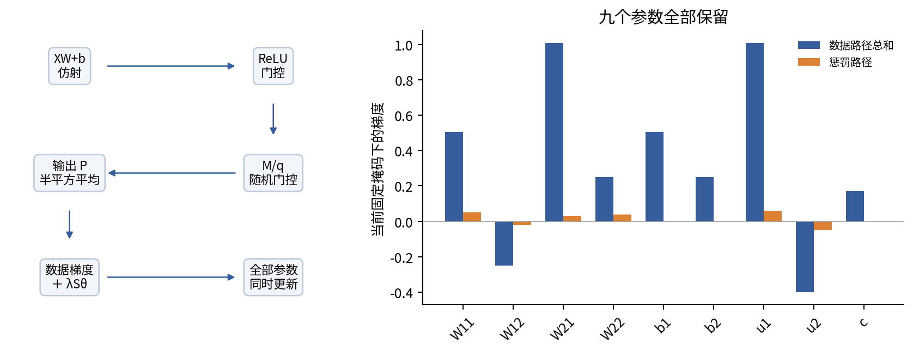

### 4.4 九个参数必须同时更新

用同一旧快照计算的总梯度，执行θ₁=θ₀−.05∇J(θ₀;M)。不能先更新u，再用新的u计算本来应属于旧图的$\bar H$。更新如下：

|参数|旧值|变化量|新值|
|---|---|---|---|
|W11|0.5|-0.0277|0.4723|
|W12|-0.2|0.0135|-0.1865|
|W21|0.3|-0.0519|0.2481|
|W22|0.4|-0.0145|0.3855|
|b1|0.1|-0.0252|0.0748|
|b2|0.2|-0.0125|0.1875|
|u1|0.6|-0.0534|0.5466|
|u2|-0.5|0.0225|-0.4775|
|c|0.1|-0.0085|0.0915|

### 4.5 下一次前向先保留同一掩码作诊断

新Z11=.4723+2(.2481)+.0748=1.0433；Z12=−.1865+2(.3855)+.1875=.772；Z21=−.4723+.2481+.0748=−.1494；Z22=.1865+.3855+.1875=.7595。ReLU门控本次恰好未改变，不代表以后永远固定。

保留原M和q=.5，$\widetilde H$的两行是(2.0866,0)与(0,1.519)。新P1=2.0866(.5466)+.0915=1.23203556；新P2=1.519(−.4775)+.0915=−.6338225。

|样本|新Z|新P|残差|半平方误差|
|---|---|---|---|---|
|1|(1.0433, 0.772)|1.23203556|0.53203556|0.141530919|
|2|(-0.1494, 0.7595)|-0.6338225|-0.4338225|0.0941009808|

新数据平均为.1178159497，惩罚为.0497395605，J=.1675555102。一次固定掩码的目标下降说明这个有限实例的这一步确实有效，不证明未来的随机训练损失每步下降。

为防止“会做一次，却不会接下一轮”，将新参数处的反向也展开。$\bar P$=(.26601778,−.21691125)，输出对$\widetilde H$的导数改为新u=(.5466,−.4775)，dropout导数仍是原M/q。新的$\overline{\widetilde H}$两行分别为(.1454053185,−.1270234900)、(−.1185636893,.1035751219)；乘两道门控后，$\bar Z$两行变(.2908106371,0)、(0,.2071502438)。

第二轮全部参数梯度如下，仍由两条样本数据路径加一条惩罚路径构成；这次只报告梯度，不继续更新，避免误以为实际训练会固定掩码不换。

|参数|样本1贡献|样本2贡献|惩罚贡献|总梯度|
|---|---|---|---|---|
|W11|0.290810637|0|0.04723|0.338040637|
|W12|-0|-0.207150244|-0.01865|-0.225800244|
|W21|0.581621274|-0|0.02481|0.606431274|
|W22|-0|0.207150244|0.03855|0.245700244|
|b1|0.290810637|-0|0|0.290810637|
|b2|-0|0.207150244|0|0.207150244|
|u1|0.5550727|-0|0.05466|0.6097327|
|u2|0|-0.329488189|-0.04775|-0.377238189|
|c|0.26601778|-0.21691125|0|0.04910653|

第二轮输入梯度为(.1373498639,.0721501191)和(−.0386335205,.0798564190)，这里用的也是新W。所有数值在calculations.json中保留足够精度；表格舍入不参与程序的下一步。

如果在θ₁处换成新掩码M′=[[1,1],[0,1]]，输入仿射值没有变化，但P变为(.49477556,−.6338225)，数据平均.0575797581，J=.1073193186。若直接关闭dropout，P则为(.29313778,−.27116125)，数据平均.0426501974。这三个值评价的是同一参数上的三个不同函数，不能把“换掩码后的下降”全部归因于刚才的参数更新。

## 5 保持隐藏均值为什么不保持最终预测

### 5.1 十六张掩码可以完整枚举

两条样本各有两个独立掩码位，总共2⁴=16种，每种概率1/16。固定θ₀、X和y，逐个重新前向，可以精确算出期望，不需要用大量随机抽样近似。单看样本1，两个掩码为00、01、10、11时，P依次为.1、−.7、1.54、.74，平均.42；样本2的输出为.1、−.7、.1、−.7，平均−.3。

这两个均值正好等于关闭dropout的P，因为dropout后只有仿射层，期望可以穿过加法与常数乘法。但两样本平均半平方的期望是.2317，关闭dropout的半平方平均只有.0221。

一般对固定h、固定输出权重u、独立掩码，P=uᵀ$\widetilde h$+c。独立性使不同坐标协方差为0，因此：

$$\operatorname{Var}_M(P)=\frac{1-q}{q}\sum_j u_j^2h_j^2.$$

把P−y写成[P−E(P)]+[E(P)−y]，平方并取期望，中心化交叉项为0：

$$E_M\left[\frac{(P-y)^2}{2}\right]=\frac{(u^\top h+c-y)^2}{2}+\frac{1-q}{2q}\sum_j u_j^2h_j^2.$$

本例样本1的P方差为(.6×1.2)²+(−.5×.8)²=.6784；样本2为0²+(−.5×.8)²=.16。两个半方差取平均，附加值(.6784+.16)/4=.2096，所以.0221+.2096=.2317。

这说明在这个特定线性输出、平方损失和独立掩码的条件下，期望目标等价于一个带特征尺度的附加项。它不是任意深层网络都等价于λ‖θ‖²；h还可能依赖可训练上游参数，附加项也随之改变。若掩码相关，方差中还会有交叉协方差项。[Dropout原论文第4至5节和第9节](https://jmlr.org/papers/volume15/srivastava14a/srivastava14a.pdf)提供随机子网络与边缘化讨论，当前数字和推导为独立实例。

### 5.2 非线性破坏可交换性

在这些固定P后面额外接sigmoid，仅用来展示非线性，不声称前面的回归网络已变成训练好的分类器。样本1有sigmoid(E[P])=.60348325，而E[sigmoid(P)]=.58931300；样本2分别为.42555748与.42839571。两种方向都可以出现，不能把某一差异方向推广到整个sigmoid定义域。

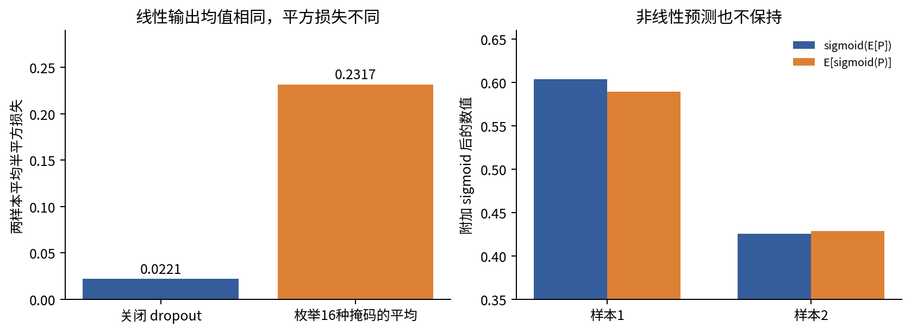

因此一般有E[f($\widetilde h$)]≠f(h)，E[ℓ(f($\widetilde h$),y)]也一般不等于ℓ(f(h),y)。较早dropout后的非线性层还会改变更深处隐藏分布。推理时关闭dropout是一种确定性计算约定，不是对所有随机子网络预测的精确平均保证。

## 6 模式与随机状态是模型的一部分

### 6.1 train与eval控制什么

对标准PyTorch Dropout，train会采样并缩放，eval为恒等映射；它没有BN那样的运行均值、运行方差buffer。no_grad控制是否记录新的求导运算，不关闭dropout。图5实际执行同一个全1张量的四种组合，训练态两次前向可得到不同结果。

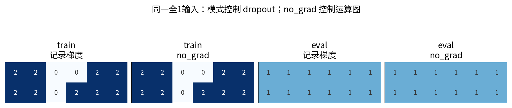

一个细节值得保留：eval的Dropout可能直接返回原输入张量，因此即使在no_grad环境中，返回张量的requires_grad属性也可能保留True。它不表示no_grad失效，而是恒等返回没有新建求导运算。不要只靠一个requires_grad标志推断整个模型是否记录了新的图。实验用真实nn.Dropout核对这一边界。

主训练网络不含BN，目的是不让036中的运行统计机制混入当前消融。若在含BN的网络上把整个模型设成train以做多次随机推理，会同时影响BN，不再只是dropout对照。若研究确需Monte Carlo dropout，应明确哪些层训练态、哪些层评价态、抽样次数和输出如何聚合；不应仅凭随机预测的离散程度就承诺概率校准或可靠不确定性。

### 6.2 种子不只有一个

复现实验至少要区分数据生成、参数初始化、样本重排、dropout掩码和增强变换。本讲固定数据不变，用seed370、371、372分别控制每次运行的初始化与后三类随机过程，并为四类过程建立独立随机流。这样启用增强不会因为多抽了几个随机数而偷偷改变样本顺序，启用dropout也不改变初值。

精确恢复随机训练还需保存参数、优化器状态、模式、随机流状态、当前数据位置；仅重设同一个初始seed并不会从中断位置继续。本讲没有做磁盘断点恢复或跨平台位级复现；记录完整协议并在当前CPU环境重跑比较，是本次实际核验范围。

## 7 早停选择的是一段轨迹中的快照

### 7.1 不需要让训练损失回升才停止

训练损失持续下降、验证损失不再改善时，继续优化可能更多适应训练中的偶然细节。早停用验证数据在参数轨迹θ₁、θ₂、…中选快照，它本身也是模型选择。验证成绩参与了选择，不能又当成未经选择的最终成绩。

本实验上限160轮，每轮结束在eval和no_grad下计算原始硬标签验证交叉熵。只允许第1轮及以后成为候选，epoch0仅诊断。新值严格小于历史最好值就复制完整参数并将等待计数清零；否则等待数加1。连续20轮未改善就停止，恢复此前最佳快照。min_delta=0，完全同分保留更早快照。

“停止轮”和“恢复轮”不同。若最好点在17轮，随后20轮都未改善，停止发生在37轮，但最终模型是17轮。保存指向参数的可变引用会让所谓“最佳快照”随后一起变化；代码使用detach().clone()逐项复制state_dict。这里没有BN，但同一保存习惯也能保留普通buffer。

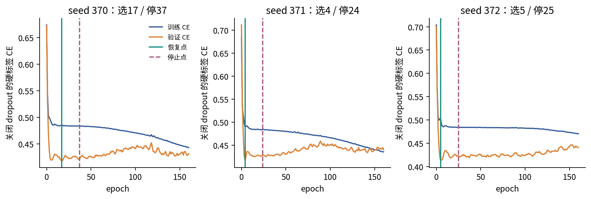

三次分别在37、24、25轮停止，恢复17、4、5轮。较晚的验证波动仍可能产生更好或更差的点，这正是patience需要事先指定的原因。看完全部轨迹再挑一条最漂亮的“早停规则”，相当于扩大了未报告的搜索。

### 7.2 为什么较早快照可能有类似收缩的作用

用一个独立的一维例子理解，不把它当成深网定理。令L(θ)=.5(aθ−b)²，a≠0，θ₀=0，普通梯度下降满足θₜ₊₁=(1−ηa²)θₜ+ηab。若0<ηa²<1，递推展开：

$$\theta_t=\left[1-(1-\eta a^2)^t\right]\frac ba.$$

有限t让θₜ在零和无惩罚最优b/a之间。加λθ²/2后的精确最优是[a²/(a²+λ)]b/a。两者都有收缩因子，但想匹配所需λ取决于a、η和t；多个不同曲率方向通常无法共享同一个匹配λ。非线性网络、非零初始化、动量与自适应优化更不能仅凭这个标量例子宣称“早停就是L2”。

早停规则还依赖验证频率、度量、patience、min_delta、快照恢复、最大预算。经典的[Prechelt早停研究](https://page.mi.fu-berlin.de/prechelt/Biblio/stop_tricks1997.pdf)讨论停止准则的效率与效果权衡。本讲不借用其具体基准收益作为当前实验的结果。

## 8 增强所声称的不变性必须属于这个任务

### 8.1 变换图像不等于自动获得正确标签

对随机变换T，最常见的标签不变增强拟合：

$$\widehat R_{aug}(\theta)=\frac1n\sum_i E_T[\ell(f_\theta(Tx_i),y_i)].$$

这里隐含“变换后仍该使用yᵢ”的判断。理想情况下，(TX,Y)与(X,Y)具有相同联合分布，增强没有改变目标总体。在更弱情形，即使同一个物体的语义标签可保留，输入频率、取景范围或难度分布也可能变化；最终要检查目标人群上的效果。[Chen等的数据增强理论](https://arxiv.org/pdf/1907.10905)明确区分精确和近似不变性，错误假设可能引入偏差。

对分割、检测、关键点和坐标回归，变换输入时往往需要相应变换标签，例如翻转图像也要翻转掩码或框坐标。这是等变关系，不是“标签文件原封不动”。文本替换也可能改变否定、数值、时间或实体关系；科研成像的颜色、方向和绝对尺度有时就是待测信号。没有一个变换能脱离任务被永远叫作合法增强。

### 8.2 本讲的两种镜像能精确审计

主实验输入X=(x₁,x₂)在[-1,1]²均匀生成，干净多数类为1{x₁>0}；再以.15概率独立翻转观测标签。于是η(x)=P(Y=1|x)在x₁>0时为.85，否则为.15。x₂不携带标签信息。

合法变换Tᵥ(x₁,x₂)=(x₁,−x₂)。均匀输入分布不变，x₁不变，条件标签机制也不变。因此把同一个观测标签带到镜像位置符合这个合成总体的联合分布不变性。某个原标签本来可能是噪声；镜像不会把它变成新的独立标签，也不会修复它。

故意错误的变换Tᵦ(x₁,x₂)=(−x₁,x₂)，仍保留原标签。除x₁=0这个概率为0的边界外，干净多数类必定翻转。若想把它作为合法的联合变换，在当前合成任务下应同时将二分类标签改为1−y；本实验故意不改，以检验违反语义假设的后果。

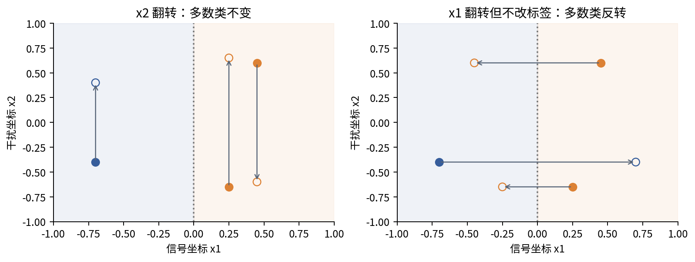

两种处理都对每次呈现的训练样本以.5概率做镜像，否则保留原输入。使用同一增强随机流，三种子下被选中次数分别为3865、3806、3781，总呈现数每次7680。合法增强的干净多数类改变次数均为0；错误增强的改变次数等于选中次数。这个审计字段指“干净规则是否改变”，不是观测标签是否原本带噪。

错误镜像与恒等变换各半时，若总体完全对称，变换后同一位置的原标签条件概率会被平均成(.85+.15)/2=.5，信号会被冲淡。有限训练还可能在x₂等方向拟合噪声，不必真的输出恒定.5。本实验的预测图将显示实际结果，而不拿这个总体推导冒充训练已收敛的事实。

### 8.3 拆分先于增强

先按原始样本、病人、实体或时间单位划分训练验证测试，再只增强训练数据。把一个原样本及其近似副本随机分到不同集合，会让评价看到训练对象的近亲。增强生成一万张副本，不会把48条原始记录变成一万个独立观测。

验证和测试采用既定的确定性评价输入。如果需要测试时增强，必须预先定义变换集合、预测聚合方法和额外计算预算；它改变了推理算法，应单独报告。本实验不使用测试时增强，也不用测试分数选增强强度。

## 9 标签平滑改变了希望模型输出的分布

### 9.1 从多类交叉熵推导

对K类，原one-hot标签是yₖ=1{k=c}。均匀标签平滑定义qₖ=(1−α)yₖ+α/K，0≤α≤1。记softmax概率pₖ=exp(zₖ)/Σⱼexp(zⱼ)，平滑交叉熵为：

$$\ell_{LS}=-\sum_{k=1}^Kq_k\log p_k=(1-\alpha)(-\log p_c)+\alpha\left(-\frac1K\sum_k\log p_k\right).$$

因为Σₖqₖ=1，代入log pₖ=zₖ−logΣⱼexp(zⱼ)，可得ℓ=−Σqₖzₖ+logΣexp(zⱼ)。对zⱼ求导：第一项为−qⱼ，第二项为pⱼ，因此∂ℓ/∂zⱼ=pⱼ−qⱼ。[原始Inception论文第7节](https://arxiv.org/pdf/1512.00567)与[PyTorch2.7交叉熵文档](https://docs.pytorch.org/docs/2.7/generated/torch.nn.CrossEntropyLoss.html)使用向均匀分布混合的约定。

二分类只用一个logit z时，目标正类概率为q=(1−α)y+α/2。α=.1且y=1给q=.95，不是.9；因为“分给所有类别”的.1中有.05又分回正确类。另一些约定只把α分给错误类别，数值不同，必须写清。

二分类交叉熵可写ℓ=log(1+exp z)−qz，其梯度为sigmoid(z)−q。对单个不受约束的logit，q=.95时最优z=log(.95/.05)=log19≈2.944，而硬标签y=1的损失随z→∞持续趋近0。真实网络参数共享，不能把这个单点解当成每条样本都能独立达到的值。

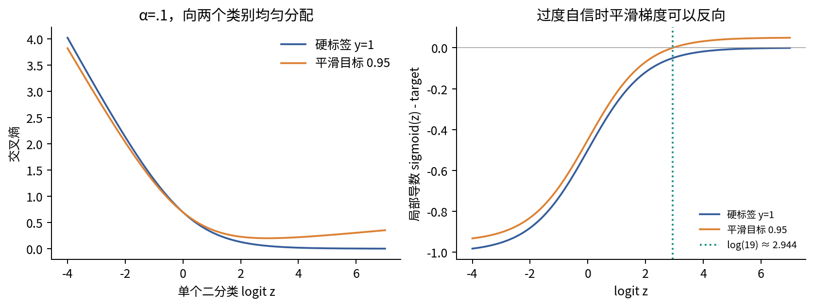

### 9.2 比较时回到同一原任务指标

一个模型报告平滑CE，另一个报告硬标签CE，这两个loss数值不能直接排名。主实验训练时只有label_smooth处理使用软目标，所有运行的训练诊断、验证选择、测试报告都计算原始硬标签交叉熵；另外记录阈值.5分类错误率与Brier平均平方误差。

Brier分数在二分类是n⁻¹Σ(pᵢ−yᵢ)²，越小越好，但它不单独隔离校准。校准关注“预测为某概率的样本，事件频率是否与之相符”，还需要有定义的分箱或其他估计与足够数据。不能把一个较低Brier值直接说成已证明完美校准。

文献[When Does Label Smoothing Help](https://proceedings.neurips.cc/paper_files/paper/2019/file/f1748d6b0fd9d439f71450117eba2725-Paper.pdf)报告过校准改善，也讨论知识蒸馏中的限制；它不是所有任务必改善的定理。甚至在无限数据、可表达真实概率的模型中，若原η已准确，平滑目标的最优值变成(1−α)η+α/2，通常偏离原η。

## 10 一组保留全部结果的CPU消融

### 10.1 任务 数据和预算

数据生成seed3700，固定保存48条训练、96条验证、384条测试，共528条。三份输入分别校验SHA-256，行ID无交集。干净标签只用于增强语义审计，拟合始终使用带噪观测标签。训练、验证、测试实际翻转数分别9、12、59，正类数为21、40、191；这些有限样本比例不必等于总体的.15噪声率与.5正类率。

网络为2→24 tanh→dropout位置→24 tanh→1 logit，参数数目72+600+25=697，不含BN。所有处理均用AdamW，学习率.01，betas=(.9,.99)，epsilon=1e-8，单线程CPU、float64，foreach=False、fused=False。基线weight_decay显式设0；不依赖AdamW可能带有的默认衰减。

每轮48条训练记录打乱后分为3批，每批16条。固定上限160轮，即480次更新、7680次训练样本呈现。dropout只放在第一层tanh之后，丢弃概率.3；decay只衰减三层权重矩阵，系数.1；两种增强概率均.5；标签平滑α=.1；早停patience20。各处理只有这一组预先指定设置，没有强度网格搜索，也没有声称它们得到同样充分的最优调参。

三种子共同改变初始化、重排和相关随机流，但数据始终同一份。它们是算法随机性的三次配对运行，不是三次独立抽样的人群。每次处理共享相同初始化及重排流；早停与基线在停止前的全部记录逐位一致。

### 10.2 公平应具体到哪一种预算

六个非早停处理各做3×480=1440次更新；早停只做111+72+75=258次，总计8898次更新、142368次训练样本呈现。相同上限是允许的计算预算相同，实际消耗并不相同。额外验证前向、测试前向、绘图网格推理和作者核验不计入optimizer更新，但同样要耗时，不能宣称墙钟或算术量完全公平。

早停在各轮验证后选择快照，其他处理固定使用最后一轮。虽然每轮都记录验证曲线用于诊断，这些曲线没有被拿来为其他处理偷偷选最低点。全部21个模型及其快照先冻结，再统一用测试数据作评价，不依据测试排名继续改变配置。

下表为三个预定种子的算术平均。完整21行、2987行逐轮记录和8064条逐样本测试预测都交付，均值不替代原始结果。

|处理|训练硬CE|验证硬CE|测试硬CE|测试错误率|
|---|---|---|---|---|
|固定预算基线|0.449597|0.437586|0.498581|0.179688|
|早停|0.491914|0.415885|0.462430|0.175347|
|dropout|0.466784|0.424631|0.472187|0.170139|
|权重衰减|0.471110|0.435558|0.475011|0.171875|
|合法增强|0.484628|0.419053|0.454029|0.162326|
|错误增强|0.609122|0.703486|0.735984|0.439236|
|标签平滑|0.455414|0.437974|0.483804|0.176215|

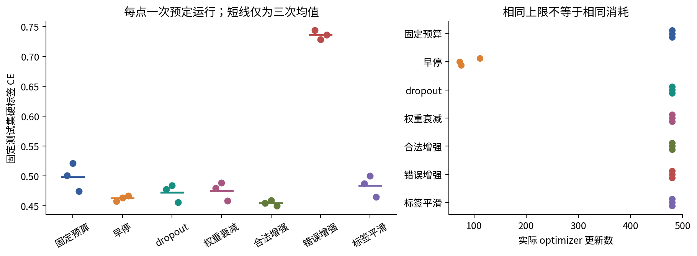

这份有限结果中，合法增强的平均测试CE最低；但结论必须保持完整：任务真值明确设计为x₂不相关，恰好给这项增强提供了正确先验；其他方法的强度未搜索，数据集没有重新抽样，也没有真实领域验证。它不是“增强普遍优于dropout”的证据。

早停的平均测试CE比固定预算基线低，但seed372的分类错误率从.174479升到.190104，即CE改善不保证阈值错误率也改善。权重衰减seed370、371的验证CE比各自基线略高；小范围的算法变化可能对不同指标及不同随机轨迹产生不同方向。

### 10.3 看预测面 才知道偏好是否合理

以下三个图组固定展示预先指定的seed370，不因测试表现选择种子。颜色范围都为0到1，黑线是预测概率.5边界，白边小点为训练观测标签；黑色空心大圈标记原始标签被生成噪声翻转的位置。圈不是算法已经识别出的错误，只有因为合成真值已知才能画出。

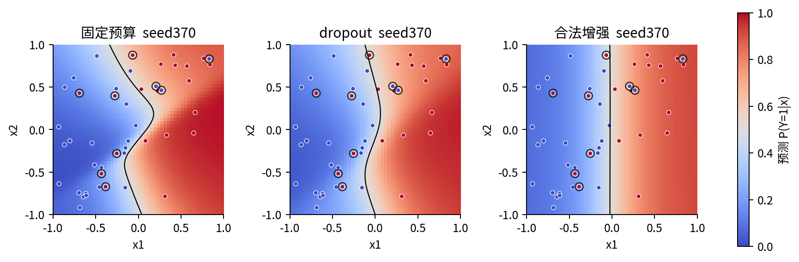

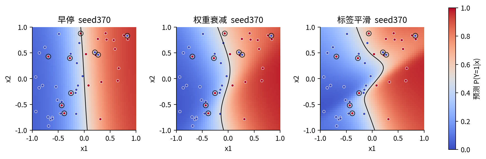

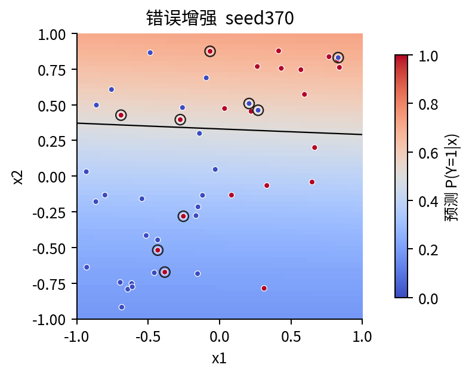

### 10.4 不把标签平滑包装成校准保证

基线三个种子的测试Brier分别为.149870929、.154287970、.144477653；标签平滑分别为.150696713、.154002353、.143931709。seed370变差，另两个略好；平均从.149545517到.149543592，仅约.000001925的差异，不能据此讲成有意义的校准提升。

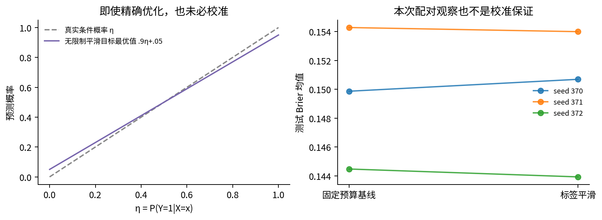

## 11 从这个小实验走向科研记录

本讲的“实现正确”证据包含精确分数手算、32个参数与掩码组合下全部九参数的中心差分和autograd、697参数网络的独立NumPy反向，以及21次训练全部8898步的独立NumPy重建。它们检查公式、随机流与更新实现。相同环境的脚本和Notebook重跑再比较六个输出文件的摘要，检查运行顺序与冻结数据。

这些核验不证明任务假设合理，也不证明现实泛化。若要扩展成科研比较，应在看新的测试结果以前决定：目标总体与采样单位、允许的不变性、所有候选强度、调参预算、随机重复来源、主要指标、统计不确定性方法以及最终独立测试。反复根据同一测试反馈换方案，会消耗它原有的独立评价角色。

至少记录：原始样本数与增强呈现数；每种变换的参数范围、概率和标签规则；损失的归约与是否平滑；受惩罚参数集合；dropout位置、保留概率与推理策略；优化器和模式；早停度量、频率、patience、快照恢复点；实际更新次数及失败运行。本实验没有丢弃失败或较差种子，也没有从不同指标中临时挑一个支持偏好的结论。

## 12 练习与检查问题

1. 对图1的二参数目标重新求偏导，计算λ=.1的最优解，并解释为何两个坐标的相对收缩不同。
2. 遮住手算表格，重算两条样本前向、两项损失、W12和u1的三条梯度贡献，再核对全部九参数。
3. 将手算掩码改成全0，哪些参数还可能移动？若λ也为0又怎样？
4. 对固定h=(1.2,.8)，枚举四种掩码求输出方差，再解释为什么半平方损失多出.2096。
5. 用一个标量ReLU反例证明E[f(dropout h)]不总等于f(h)，避免只重复“非线性”三个字。
6. 解释为什么前向抽一张掩码、反向再抽一张掩码不是当前目标的链式法则。设计最小数值检查。
7. 用验证序列(.6,.5,.51,.49,.50,.51)，patience=2、min_delta=0重建最佳点、等待数、停止点；恢复哪一轮？
8. 本合成问题若翻转x1并同时令y变成1−y，联合标签机制是否保留？现实图像任务能直接照搬吗？
9. K=4、α=.2、正确类为第2类时写出平滑目标，给p=(.1,.6,.2,.1)求全部logit梯度。
10. 读21行结果，指出早停是否对每个种子的分类错误率都改善，以及标签平滑是否对每个Brier都改善。不要只报告均值。
11. 如果将增强的所有副本随机拆入训练与测试，会在哪里破坏独立评价？应当先按什么单位拆分？
12. 设计一个只改变dropout概率的后续实验，写出候选、预算、随机流、验证选择和新测试边界，并说明它还不能回答什么。

下一讲进入《容量过参数化与理论边界》。带走的不是“正则化越多越好”，而是把每个偏好写成可检查的假设，把每项结论限制在真正完成的计算和评价范围内。
