# 038 容量过参数化与理论边界

本讲解决一个常见研究困惑：为什么增加参数，有时降低未见数据上的误差，有时反而使误差升高？上一讲讨论衰减、早停和增强如何改变学习过程；本讲把“网络有多大”“算法最后选了什么函数”“目标分布上的风险多大”分开。答案必须同时描述数据、模型、优化规则和评价对象，不能只报参数数量。

先修013的秩、奇异值与零空间，020的经验风险和总体风险，以及037的正则化。我们从同一组两样本做两次完整线性训练更新，再把它放进一个隐藏层网络，核对复制神经元前后的所有梯度。随后用1944个可重跑的合成拟合观察插值附近的风险，并保留不符合“大模型总更好”的结果。这里没有深层网络性能排名，也没有真实部署效果的证据。

读完应能：区分参数数目、训练设计矩阵的秩和函数类；证明指定线性GD的最小范数选择；解释小奇异值怎样放大噪声；准确描述双下降实验；为存在性定理、泛化上界和渐近结论写出各自的适用条件。

## 1 四个问题不要用一个数字回答

设输入为$x$，参数为$\theta\in\mathbb R^P$，模型为$f_\theta(x)$。参数数目$P$是存储坐标的数量。函数类$\mathcal F=\{f_\theta:\theta\in\Theta\}$是这些坐标能够表示的函数集合。不同参数可能给出相同函数，参数的约束也会改变集合。给定训练数据$D$，算法$A$输出$\hat\theta=A(D)$；总体风险还要对规定的新样本分布求期望。

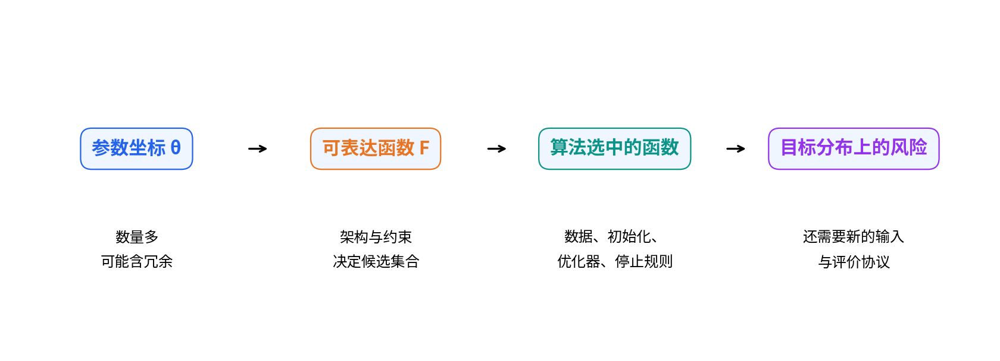

例如，把线性预测写成$f_{a,b}(x)=(a+b)x$，有两个参数，却只依赖一个有效系数$a+b$。任意实数$a,b$所表达的函数类与$f_w(x)=wx$相同。再如，在某份数据上两个特征列完全相同，训练预测只识别它们的系数之和，但在未来输入中这两列可能不再相同。前一种是整个函数参数化的冗余，后一种是这份训练数据的信息不足，不能混为一谈。

**插值**在本讲的平方损失模型中指每个训练预测都等于标签，训练MSE为零。**过参数化**必须相对某个约束说明；对一般位置的线性回归，$p>n$意味着未知系数多于标量方程。即使$p\ge n$，若设计矩阵不满行秩，任意标签也未必能被插值。对分类网络，训练分类错误为零并不意味着交叉熵为零，也不能机械地把阈值写成“参数数目等于样本数”。

本讲线性实验的$p$是使用的输入特征数量，所有这些线性系数均被拟合，没有额外截距。它与后来深网的隐藏宽度不同；符号相同或曲线相似，不代表机制完全相同。

## 2 同一两样本上的第一次完整更新

全部手算采用无单位的合成数值、列参数约定。两个样本各有三个原始特征，第三列碰巧在这两行都为1，但不是模型强制添加的截距，新的输入第三坐标可以不是1。

$$X=\begin{bmatrix}1&0&1\\0&1&1\end{bmatrix}\in\mathbb R^{2\times3},\qquad y=\begin{bmatrix}1\\2\end{bmatrix},\qquad w^{(0)}=\begin{bmatrix}0\\0\\0\end{bmatrix}.$$

前向为$\hat y_i=\sum_{j=1}^3x_{ij}w_j$。定义残差$r_i=\hat y_i-y_i$，单样本损失$\ell_i=r_i^2/2$，优化目标$L=(\ell_1+\ell_2)/2=\sum_i r_i^2/4$。这个目标是MSE的一半；后面的容量图为MSE风险，不再带$1/2$。

|样本|三个乘积$x_{ij}w_j$|预测|标签|残差|单样本$\ell_i$|对$L$的贡献$\ell_i/2$|
|---|---|---|---|---|---|---|
|1|0，0，0|0|1|-1|0.5|0.25|
|2|0，0，0|0|2|-2|2|1|

所以$L^{(0)}=1.25$。逐节点反向，而不是直接背矩阵公式：$\partial L/\partial\ell_i=1/2$，$\partial\ell_i/\partial r_i=r_i$，$\partial r_i/\partial\hat y_i=1$，$\partial\hat y_i/\partial w_j=x_{ij}$。因此样本$i$沿自己的路径传给参数$j$的是$r_ix_{ij}/2$。

|参数|样本1路径贡献|样本2路径贡献|累积梯度|$\eta=0.5$时改变量|更新后|
|---|---|---|---|---|---|
|$w_1$|$(-1)/2\times1=-0.5$|$(-2)/2\times0=0$|-0.5|0.25|0.25|
|$w_2$|$(-1)/2\times0=0$|$(-2)/2\times1=-1$|-1|0.5|0.5|
|$w_3$|$(-1)/2\times1=-0.5$|$(-2)/2\times1=-1$|-1.5|0.75|0.75|

三个梯度都基于旧参数计算，再同时更新。矩阵式$g=X^Tr/2$只是这六条路径的压缩。特别是$w_3$同时影响两个样本，必须把两条贡献相加。新参数为$(0.25,0.5,0.75)$；新预测逐项算为$0.25+0+0.75=1$及$0+0.5+0.75=1.25$。

## 3 第二次更新和第三次前向

第一次更新后的残差是$(0,-0.75)$，两个单样本半平方损失为$(0,0.28125)$，平均目标$L^{(1)}=0.140625$。这次$\partial L/\partial\hat y=(0,-0.375)$；局部导数$\partial\hat y_i/\partial w_j$仍是原来的$X$。

|参数|样本1贡献|样本2贡献|梯度|旧参数|同时更新后|
|---|---|---|---|---|---|
|$w_1$|0|$-0.375\times0=0$|0|0.25|0.25|
|$w_2$|0|$-0.375\times1=-0.375$|-0.375|0.5|0.6875|
|$w_3$|0|$-0.375\times1=-0.375$|-0.375|0.75|0.9375|

第三次前向的三个乘积分别为$(0.25,0,0.9375)$和$(0,0.6875,0.9375)$。预测$(1.1875,1.625)$，残差$(0.1875,-0.375)$，单样本损失为$(0.017578125,0.0703125)$，平均$L^{(2)}=0.0439453125=45/1024$。第一个样本在第二次更新前已经完全拟合，更新后却又产生误差：共享参数$w_3$为降低总目标而变化，单个样本不一定每步都改善。

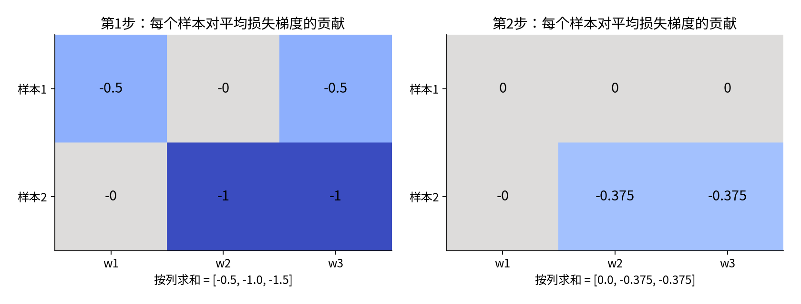

experiment.py的linear_step返回乘积、预测、残差、局部导数、贡献、累积梯度、改变量和下一前向。hand-trace.json不是只保存终点。独立测试使用Fraction的有理数运算重建两轮，而PyTorch autograd另核对第一轮；两者不会依靠同一个手写梯度公式通过检查。

## 4 拟合全部训练数据仍不决定未来预测

训练方程仅为$w_1+w_3=1$、$w_2+w_3=2$。先令$w_3=1+t$，代回得到全部解：

$$w(t)=\begin{bmatrix}0\\1\\1\end{bmatrix}+t\begin{bmatrix}-1\\-1\\1\end{bmatrix}.$$

记$z=(-1,-1,1)^T$。因为$Xz=(0,0)^T$，$z$属于$X$的零空间：沿它移动不会改变任何训练预测。三维参数中只有两个独立训练约束，秩为2，零空间维数为1。任意$t$的训练误差都等于零。

参数平方范数逐项展开为$t^2+(1-t)^2+(1+t)^2=2+3t^2$，唯一最小值在$t=0$，得到$w_*=(0,1,1)$。这是满足训练数据的最小欧氏范数解，却不证明真实系数为此值。

拿一个新输入$x_*=(1,1,0)$，预测为$w_1+w_2=1-2t$。$t=0,1,-1$分别预测1、-1、3，而训练预测完全相同。若额外假设真实系数恰为$w_*$，新输入各坐标独立且均值0、方差1，则与真函数的总体平方误差为$\|w(t)-w_*\|^2=3t^2$；这个结论利用了新分布和真实系数的假设，不能从两条训练记录推出。

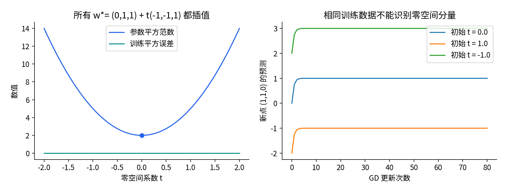

研究中的“隐式偏置”指算法即使不在目标中显式加入惩罚，也倾向或受限于某些解。它不是统计学的“偏差”一词在所有场合下的同义词。下面只证明一个可精确定义的线性例子。

## 5 为什么零初始化的线性GD选择最小范数解

对于$L(w)=\|Xw-y\|^2/(2n)$，梯度$X^T(Xw-y)/n$一定属于$X^T$的列空间，也就是$X$的行空间。取任意零空间向量$z$，$z^TX^T=(Xz)^T=0$，所以每次更新满足

$$z^Tw^{(t+1)}=z^Tw^{(t)}-\frac\eta n z^TX^T(Xw^{(t)}-y)=z^Tw^{(t)}.$$

零空间分量始终保持初始化的值。零初始化没有零空间分量，因此所有迭代都在行空间内。行空间与零空间正交；任意最小二乘解都可写成$X^+y+z_0$，且$X^+y\perp z_0$，故其范数平方为$\|X^+y\|^2+\|z_0\|^2$。其中$X^+$为Moore-Penrose伪逆，定义见下一节。只有$z_0=0$达到最小范数。

还有一个不能跳过的条件：迭代必须收敛。若非零奇异值为$s_1\ge\cdots\ge s_r>0$，Hessian的非零特征值是$s_j^2/n$。相应误差坐标每步乘$1-\eta s_j^2/n$。要让绝对值小于1，取

$$0<\eta<\frac{2n}{s_1^2}.$$

本例$XX^T=\begin{bmatrix}2&1\\1&2\end{bmatrix}$的特征值是3和1，故$s_1^2=3$，稳定范围$0<\eta<4/3$；$\eta=0.5$符合要求。非零谱方向收敛，零空间分量保持，最终

$$w_\infty=X^+y+(I-X^+X)w^{(0)}.$$

这不要求训练标签可精确拟合，但在不相容系统中终点只是最小二乘解。我们的两样本系统满行秩，因而确实插值。若初始化含$tz$，终点就含同样的$tz$，不再是最小范数解。若换成Adam、动量、非线性网络、不同坐标度量或不稳定步长，上述逐行证明不能原样套用。

## 6 坐标缩放也会改变隐式偏置

保持函数写作$f=x^Tw$，用$w=Su$重新参数化，其中$S=\operatorname{diag}(1,1,2)$。在$u$上零初始化GD倾向最小化$\|u\|^2=\|S^{-1}w\|^2=w_1^2+w_2^2+w_3^2/4$，不是原来的$\|w\|^2$。

同样的训练约束下，令$w_3=v$，目标为$(1-v)^2+(2-v)^2+v^2/4$。求导：$-2(1-v)-2(2-v)+v/2=-6+(9/2)v$。驻点$v=4/3$，于是$w=(-1/3,2/3,4/3)$；训练预测仍为$(1,2)$，新点$(1,1,0)$的预测却为$1/3$。

“最小范数”若不声明参数坐标、尺度或度量，是不完整的说法。给原始特征缩放而没有同步改正则化，或者把一层分成两层，都可能改变训练偏好；这并不与二者能表示同一函数相矛盾。

## 7 奇异值把拟合与噪声放大连接起来

设紧致SVD为$X=U_r\operatorname{diag}(s_1,\ldots,s_r)V_r^T$。$U_r$是训练样本空间中的正交方向，$V_r$是参数行空间中的正交方向。把标签投影到$u_j$上后，满足该方向训练约束需要除以$s_j$：

$$\hat w=X^+y=\sum_{j=1}^r v_j\frac{u_j^Ty}{s_j}.$$

如果标签中噪声在$u_j$方向有分量$u_j^T\epsilon$，它对系数的影响为$v_j(u_j^T\epsilon)/s_j$。$s_j$很小时，即便噪声不大，系数也可能很大。取$X=\operatorname{diag}(2,0.2)$、$y=(1,1)$，完整解是$(0.5,5)$。第二个方向需要的系数是第一个的十倍。

现在不把$1/s_j$当作唯一选择。零初始化、稳定步长GD在第$j$个坐标的递推为$a_{t+1}=(1-\eta s_j^2/n)a_t+(\eta s_j/n)u_j^Ty$。从$a_0=0$对等比数列求和：

$$a_t=\frac{1-(1-\eta s_j^2/n)^t}{s_j}u_j^Ty.$$

有限$t$时，小$s_j$的方向尚未充分拟合。这解释了此线性情形中早停的谱滤波作用。若进一步$0<\eta\le n/s_1^2$，每个乘数非负，滤波因子随$t$单调接近$1/s_j$；只有较宽的稳定条件时可能振荡，不能统称单调。

对显式Ridge目标$\|Xw-y\|^2/(2n)+(\lambda/2)\|w\|^2$求导并置零，得到$(X^TX+n\lambda I)w=X^Ty$，其谱因子为$s_j/(s_j^2+n\lambda)$。$n$来自损失平均，不能遗漏。有限步GD和Ridge都能压制小奇异值，但滤波函数不同，不存在对所有谱方向统一精确对应的“一个训练轮数等于一个λ”。

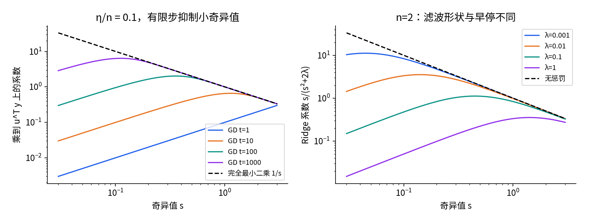

least_squares使用NumPy SVD而非显式求逆$X^TX$；后者会平方条件数。rcond=1e-12决定小于最大奇异值该比例的方向被视为数值零。数学上的非零秩与有限精度的数值秩不同。当前1944个拟合的无惩罚方向均未触发额外截断，实际秩为$\min(n,p)$；另有秩亏与极小奇异值测试专门检验截断行为。Ridge分支使用全部奇异值的稳定滤波，报告的rank仍描述同一阈值下的设计矩阵。

## 8 同一数据上的神经元复制完整链

回到第2节同一$X,y$，现在用三输入、一隐藏ReLU、一个线性输出的网络：$z_i=W x_i+b$，$h_i=\max(z_i,0)$，$\hat y_i=ah_i+c$。先设$W=(0.5,1,0)$、$b=0.5$、$a=1$、$c=0$，共6个可训练参数。两行的$z=h=(1,1.5)$，预测$(1,1.5)$，残差$(0,-0.5)$，平均半平方损失$0.0625$。

再复制这个隐藏节点两次，保持每个$W,b$相同，但将输出权重各设为$1/2$。此时11个参数，且对所有输入，$\tfrac12\operatorname{ReLU}(Wx+b)+\tfrac12\operatorname{ReLU}(Wx+b)$都等于原函数；这不只是两条训练记录上的相等。这里仅展示宽模型参数集合内的一组复制参数，不是说整个宽函数类与窄类一样大。

对于任意隐藏宽度$m$，逐节点导数是$g_i=r_i/2$、$\partial\hat y_i/\partial h_{ij}=a_j$、$\partial h_{ij}/\partial z_{ij}=1$（本例全部$z>0$），因此$d_{ij}=g_i a_j$。每个样本对参数的贡献依次为$d_{ij}x_{ik}$、$d_{ij}$、$g_i h_{ij}$、$g_i$，对应$W_{jk},b_j,a_j,c$。

样本1的$g_1=0$，对两种网络每个参数的贡献均为0。样本2的$g_2=-0.25$：窄模型$d_{21}=-0.25$；宽模型每个$d_{2j}=-0.125$。下面的梯度也就是样本2的贡献，已经把样本1的零贡献累加进去。

|参数|窄模型旧值|窄梯度|窄更新后|宽模型每个节点旧值|宽每节点梯度|宽每节点更新后|
|---|---|---|---|---|---|---|
|$W_{j1}$|0.5|0|0.5|0.5|0|0.5|
|$W_{j2}$|1|-0.25|1.05|1|-0.125|1.025|
|$W_{j3}$|0|-0.25|0.05|0|-0.125|0.025|
|$b_j$|0.5|-0.25|0.55|0.5|-0.125|0.525|
|$a_j$|1|-0.375|1.075|0.5|-0.375|0.575|
|共享输出$c$|0|-0.25|0.05|0|-0.25|0.05|

学习率均为0.2，全体参数同时更新。宽表前五行各有两个独立参数，共10个；$c$仅一个，不能复制其更新。下一前向：窄模型$z=(1.1,1.65)$，预测$1.075z+0.05=(1.2325,1.82375)$，损失$0.021280078125$。宽模型每个节点$z=(1.05,1.575)$，两个输出相加得$1.15z+0.05=(1.2575,1.86125)$，损失$0.021389453125$。

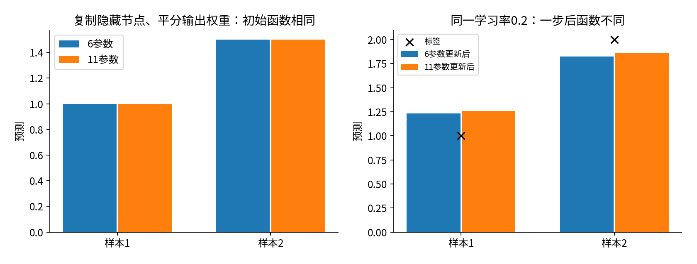

原因不是“宽模型突然不能表示原函数”，而是参数坐标的欧氏梯度不具任意重参数化不变性。这个单步例子不能推出宽模型长期更差，也不能证明深网一般选择最小欧氏范数。它说明一个研究对照若只匹配初始预测，未必匹配优化动力学。

## 9 容量实验先规定究竟改什么

我们构造总体$x\sim N(0,I_{96})$，真实系数$\beta=(1,-1,0.5,0,\ldots,0)$，干净目标$f_*(x)=x^T\beta$，训练标签$y=f_*(x)+\sigma\epsilon$，$\epsilon\sim N(0,1)$独立于$x$。每个seed生成24行96列训练输入与24个噪声，再对全部配置重用。seed固定为3800至3811，合计12组独立生成的设计和噪声。不是12次优化初始化，也不是12个测试子集。

宽度为1、2、3、4、8、12、16、20、22、23、24、25、26、28、32、48、72、96。每个模型只取训练输入前$p$列，因此宽度间嵌套，前3维已含全部真信号，后来加的特征只有零真系数。固定噪声强度0、0.2、0.8；固定Ridge系数0、0.01、0.1，没有用风险挑选λ。每个seed内噪声方向相同，只改变强度，构成成对控制。

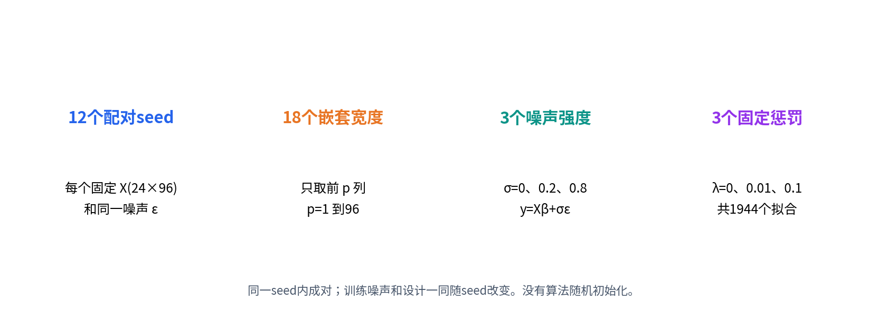

无惩罚时使用SVD最小范数最小二乘，不是只跑几个epoch的网络；因此容量曲线没有混入“更宽模型还没训练完”。Ridge是另一个明确改变目标的控制组。模型参数量只计$p$个线性系数，SVD临时数组和知道真β的评价程序都不是模型参数。

训练MSE为$\|X_p\hat w-y\|^2/n$。真正关注的是固定训练结果后，对一个新输入的**干净目标风险**：

$$R_{D,p}=\mathbb E_{x_{\rm new}}[(x_{{\rm new},1:p}^T\hat w-x_{\rm new}^T\beta)^2\mid D].$$

把$\hat w$补零到96维，记差$e=\hat w_{\rm padded}-\beta$。展开平方为$\sum_j e_j^2x_j^2+2\sum_{j<k}e_je_kx_jx_k$，独立零均值使交叉项期望为0，方差1使对角项期望为$e_j^2$。故

$$R_{D,p}=\|\hat w-\beta_{1:p}\|^2+\|\beta_{p+1:96}\|^2.$$

第二项是遗漏特征的不可表达误差，$p=1$为1.25、$p=2$为0.25、$p\ge3$为0。若评价带独立新噪声的标签，其风险再加$\sigma^2$。这是模型生成分布已知时的精确期望计算，不是有限测试集分数，也不是从真实数据估计未知β的方法。所有图都明确使用哪一种风险。

## 10 实际结果同时保留第二次下降和再次上升

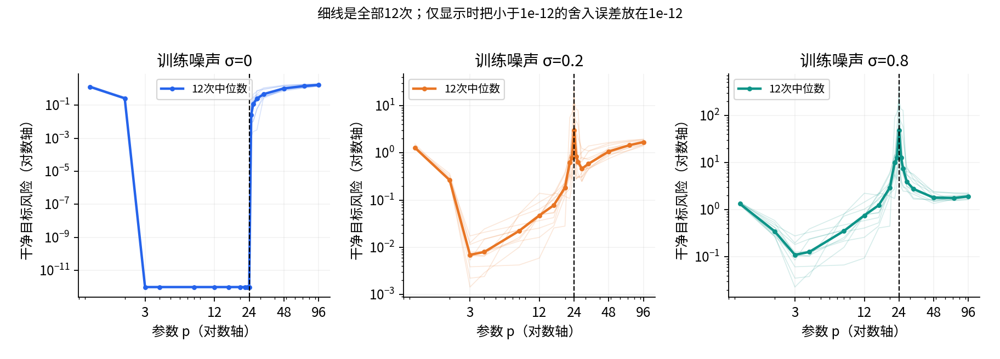

|p|σ=0的风险中位数|σ=0.2的风险中位数|σ=0.8的风险中位数|
|---|---|---|---|
|1|1.27917|1.28187|1.33586|
|3|约$5.2\times10^{-31}$|0.006890|0.110237|
|12|约$2.8\times10^{-30}$|0.047122|0.753946|
|24|约$3.2\times10^{-29}$|3.028670|48.458726|
|32|0.459401|0.586613|2.753981|
|48|1.026888|1.072975|1.789907|
|96|1.675111|1.691181|1.913704|

带噪声时，先从缺少真实特征的$p=1$下降到$p=3$，之后增加无关特征会更强地拟合噪声，插值附近风险很高，再向过参数区增加$p$出现下降。这是本实验支持的容量双下降现象。它不推翻误差分解，只是不能把整个算法族的风险强行画成单个U形。

但第二次下降不是无限单调下降：$\sigma=0.8$从$p=48$到96的中位数又上升；$\sigma=0.2$在$p=32$以后也明显上升。过参数区的最小范数投影可能丢失真信号，噪声放大减小与信号丢失增加在竞争。这里最宽模型也没有超过知道信号恰在前3维的$p=3$配置。实验把信号顺序特意公开，不能据此宣称实际任务能免费知道最优宽度。

零噪声时，$3\le p\le24$能恢复真系数到浮点精度，并无带噪声的尖峰。超过24后，最小范数解一般只是β在随机行空间中的投影，造成信号误差。图中的约$10^{-29}$是数值舍入，不是新的统计误差机制。

$\sigma=0.8,p=24$的12次风险中位数48.4587、均值107.2076、最小7.9344、最大464.5584。不能隐藏高风险样本，只报告最好seed；也不能把12次中位数当理论上的期望。小奇异值导致分布长尾，阈值附近均值尤其不稳定。这里没有据12个seed计算总体显著性结论。

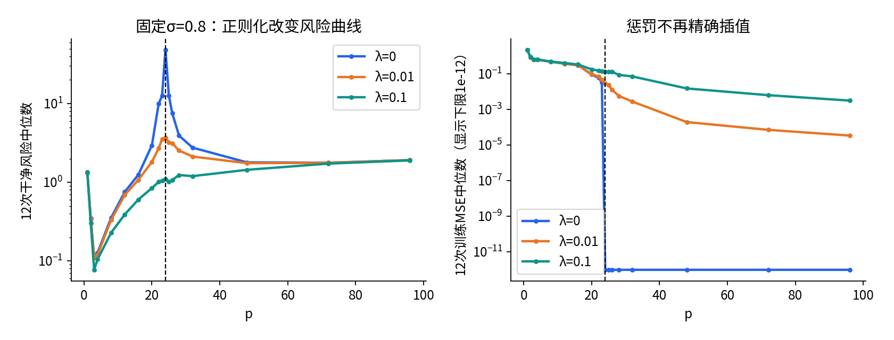

## 11 一次噪声和对噪声求平均也不同

固定设计$X$，把标签写为$y=y_{\rm clean}+\sigma\epsilon$。对于SVD/Ridge这种线性估计器，$\hat w=A y=A y_{\rm clean}+\sigma A\epsilon$。令信号误差向量$b=A y_{\rm clean}-\beta_{1:p}$，噪声响应$v=\sigma A\epsilon$，则一次实际拟合的风险为

$$R_{D,p}=\|b\|^2+\|\beta_{p+1:96}\|^2+\|v\|^2+2b^Tv.$$

代码分别记录signal_error、realized_noise_norm2和cross_term，三项相加等于clean_risk。对无惩罚且$p\ge3$的满秩情形，行空间/零空间正交会使交叉项为零；但遗漏信号或Ridge场景不能不加说明地删去一次实现中的交叉项。

若现在再对独立、均值0、协方差$I$的训练噪声求期望，则$\mathbb E[v]=0$，交叉项的期望为0。按坐标展开可得$\mathbb E\|A\epsilon\|^2=\sum_{jk}A_{jk}^2=\operatorname{tr}(AA^T)$。因此固定完整训练设计、仅平均训练噪声的风险为

$$\mathbb E_\epsilon[R_{D,p}\mid X_{96}]=\|b\|^2+\|\beta_{p+1:96}\|^2+\sigma^2\operatorname{tr}(AA^T).$$

这里固定的是完整96列训练输入，包含被模型遗漏的真信号坐标；否则条件分布还会包含那些被遗漏坐标的随机性。无惩罚时$\operatorname{tr}(AA^T)=\sum_j1/s_j^2$；Ridge时为$\sum_j[s_j/(s_j^2+n\lambda)]^2$。

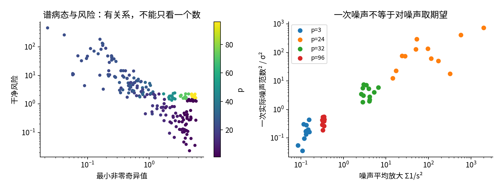

额外诊断固定$n=24,p=32$的一个设计，重复400个训练噪声：精确条件均值2.63538，Monte Carlo均值2.57610，均值标准误0.06737。误差落在约一个标准误内，但不能把一次接近说成概率定理的证明。再固定一个拟合，用独立4096个新输入检查风险公式：有限样本MSE为2.45679，精确风险2.45336，Monte Carlo标准误0.05463。此检查只核验合成评价代码，不用于选择宽度或惩罚。

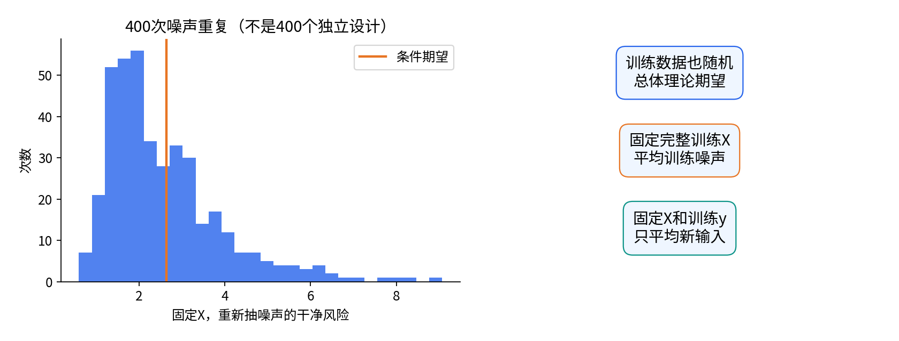

## 12 渐近公式是带条件的参照

Hastie等的原始论文研究最小范数线性回归及扩展特征模型。在最简单的正确指定各向同性情形，设噪声方差为$\sigma^2$、真系数平方范数趋于$r^2$，且$n,p$同时趋于无穷、$p/n\to\gamma\ne1$，例如取独立同分布、均值0、方差1且具有某个大于4阶有限矩的特征坐标，噪声独立、零均值且方差有限，真系数为确定性向量，则该情形的极限风险包含：$\gamma<1$时的噪声项$\sigma^2\gamma/(1-\gamma)$；$\gamma>1$时的信号项$r^2(1-1/\gamma)$加噪声项$\sigma^2/(\gamma-1)$。这里风险不含新标签的不可约噪声。

这些表达提示：接近比例1会放大噪声，而过参数区的信号项随比例增加。它们不承诺我们的$n=24$、12次抽样均值就等于这些数；也不覆盖$p<3$的遗漏信号配置。把$\gamma=1$直接代进去会得到未定义的分母，不能把它当“实际运行必定无穷大”。实际有限矩阵大多可逆，风险有限但可能非常大。定理中的极限顺序、风险是否平均训练噪声、谱条件，都必须查原文。

不能仅把神经网络线性化然后宣布这些公式适用：训练中的特征若在改变，其相关性、谱、参数路径和有效维数均可能不同。T3将讨论宽网络核视角与特征学习；本讲只建立如何读条件的习惯。

## 13 通用逼近告诉我们存在什么

Cybenko的经典结果之一针对单位立方体上的连续目标函数，以及连续sigmoid激活：给定任何正误差容限，存在足够多隐藏节点及相应权重，使一层隐藏网络在该紧域上一致逼近目标。量词的关键顺序是“给定目标和精度，存在某个有限宽度与参数”，宽度可以依赖目标和精度。

它不说当前给定宽度已经足够，不提供梯度下降一定找到这些参数的保证，也不直接给样本复杂度、训练时间或域外泛化。若目标不连续，直接套连续目标的一致逼近结论也不正确；若使用ReLU，需要查对应的另一版本定理，不能把“连续sigmoid”的原条件改掉而仍引用同一结论。本讲不证明该函数分析定理，只准确限定这一个版本的含义。

回到自己的实验，至少分别询问：函数类能否表示目标？算法能否从给定初始化找到低训练损失？有限数据能否识别有用解？目标分布是否与训练假设一致？一个存在性结果只回答第一个问题的一部分。

## 14 亲手推一个有条件的统一泛化界

为了不把抽象“泛化界”当万能预测器，先考虑一个严格简化的例子。预先固定有限函数类$\mathcal F=\{f_1,\ldots,f_M\}$，$n,M$为正整数，$0<\delta<1$。样本独立同分布，损失在$[0,1]$。对固定$f$，Hoeffding不等式给出$\Pr(|R(f)-\hat R_n(f)|>\varepsilon)\le2e^{-2n\varepsilon^2}$。这里把该独立有界变量不等式作为概率工具；下面的联合步骤可以直接推完。

令事件$E_j$表示第$j$个函数违反误差限。任意一次违反就是并集$\cup_j E_j$。概率的并集上界不要求这些事件相互独立：$\Pr(\cup_j E_j)\le\sum_j\Pr(E_j)\le2M e^{-2n\varepsilon^2}$。希望此失败概率不超过δ，取对数并整理：

$$2M e^{-2n\varepsilon^2}\le\delta\quad\Longrightarrow\quad\varepsilon\ge\sqrt{\frac{\log(2M/\delta)}{2n}}.$$

于是概率至少$1-\delta$时，每个候选都同时满足$R(f)\le\hat R_n(f)+\varepsilon$。因为事件同时覆盖全部预先固定的候选，之后用这些训练数据在该集合内选一个$f$仍可使用这个事件；不能把训练后选出的模型伪装成事前固定一个候选，从而擅自设$M=1$。

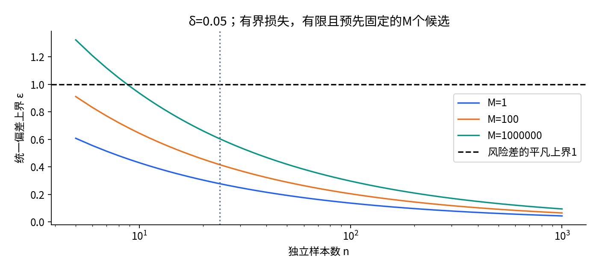

这不是我们的Gaussian平方损失实验的可直接应用上界：平方损失未限定在$[0,1]$，连续参数函数类也不是这里的有限$M$。若要推广，必须付出额外工作，如尾部条件、覆盖数、VC维或数据相关复杂度，不能简单把参数数目$p$填进$M$。神经网络VC维的原始研究本身区分权重数、层数和激活类型，也不是“VC维恰等于参数数目”。

上界大并不证明模型差；它可能只说明这个分析工具不够紧。上界是高概率最坏情形限制，也不是某次实验应达到的分数。若用测试集选择候选、数据依赖增强或相关样本，须重新检查前提。T2会继续讨论复杂度和数据依赖问题。

## 15 把理论边界写进研究报告

一个合格的报告可写：在已知各向同性Gaussian总体、24个训练样本、前3维非零真实系数、固定SVD求解规则下，12组配对设计/噪声的容量扫描在带噪声时呈现插值附近尖峰和之后的下降；无噪声曲线不同，且更大p不保证一直改善。给出全部拟合、风险定义和谱记录，允许读者重跑。

不要写“实验证明深度学习大模型泛化更好”。这里甚至没有训练一个多层特征学习模型。也不要写“用理论解释了所有峰值”：我们给出了可精确核验的线性谱分解，但每次的峰高度还依赖具体噪声方向和设计。

接下来有三种有用扩展，必须先冻结计划再看结果：把信号从前3维移到稠密方向以检验特征顺序；令输入协方差非单位阵，并把风险从欧氏平方范数改为$e^T\Sigma e$；用固定预算训练非线性网络，明确优化未收敛与表示学习造成的新差异。不要同时修改全部因素后仍把差异归因于参数量。

## 16 函数库到底替我们做了什么

- numpy.random.default_rng建立显式随机生成器。生成器只在原始fixture制作或额外诊断中使用；主1944拟合读取带哈希的固定数据。
- numpy.linalg.svd输出正交方向与奇异值，full_matrices=False只保留必要尺寸。它不决定我们的风险定义，也不会自动解释信号与噪声。
- numpy.linalg.lstsq在独立测试中使用不同求解入口；Ridge先拼接$\sqrt{n\lambda}I$与零标签，再做增广最小二乘，以核对主SVD滤波实现。
- torch.tensor和autograd.grad在微型网络中核对每个样本的全部参数导数。ReLU本例远离零点，不借助不明确的边界导数蒙混过关。
- csv与json保存完整可检查记录；hashlib检查数据与图所读数值没有被悄悄修改。散列相等说明字节相同，不等于科学结论正确。
- unittest运行18组不同职责的测试；正常和-O模式均执行，关键输入守卫使用异常，不依赖会被-O去掉的assert。

实验文件只依赖本讲目录和声明的库，不导入前一讲隐藏状态。所有输出先算完并序列化，再逐文件原子替换；这避免普通计算失败留下新旧混合结果，但不等于整个输出目录具备断电事务能力。最终Notebook重新计算数值，展示的3张机制图来自已核验的静态PNG；图脚本另行重建全部12张。

## 17 练习入口和来源

先完成独立实验指南中的手算、零空间、复制节点、容量/噪声与风险期望检查，再看answers.pdf的12题详解。至少写出两条本实验支持的结论和两条不能支持的结论。遇到不符合直觉的数据，先检查定义、数值秩和条件，再决定是否修改假说，不删除它。

本讲参考原始论文：Belkin等的双下降实验；Hastie等的最小范数插值分析；Cybenko的连续sigmoid逼近结果；Bartlett等关于分段线性网络VC维的结果。具体书目信息、实际阅读范围和NumPy/PyTorch官方接口见sources.md。推导、两样本例子、数据、全部图和实验叙事均为本讲独立制作，未复制论文图。
