# 039 损失设计失衡与校准

实际任务的代价与模型训练目标不一致时怎样处理？一个告警系统可能有很高的准确率，却漏掉大部分真正需要处理的情况；另一系统能找出更多正例，却把“告警倾向”误当成事件发生概率。训练损失、概率陈述与行动规则各自有意义，前提是没有把它们说成同一个对象。

本讲先修019的交叉熵、021的混淆矩阵与验证边界、037的训练目标和正则化。我们将自己推导加权风险的最优输出、采样等价关系、代价阈值与温度缩放；再逐条核对一个九参数网络的完整更新，最后运行一个25参数网络的九次配对实验。所有数据和机制图为原创合成教学材料，不代表任何真实行业的效果。

## 1 三个对象必须分开命名

P表示希望解释的原始总体分布，本实验也是部署分布。训练集只是从P得到的有限样本，不等于P本身。Q表示训练时实际抽取记录的分布；平衡抽样可能使Q与P不同。R表示我们用来优化的风险，即在哪个分布下、对哪种损失取期望。另用δ表示把模型输出变成行动的决策规则。

例如原始数据正例率为10%，我们将每次训练批次的正例比例提高到约50%。模型现在经常遇到正例，但这个操作没有改变部署环境中事件真正发生的频率。若又对正例损失乘9，便在采样改变之外再次改变目标，并非只做了一次“平衡”。

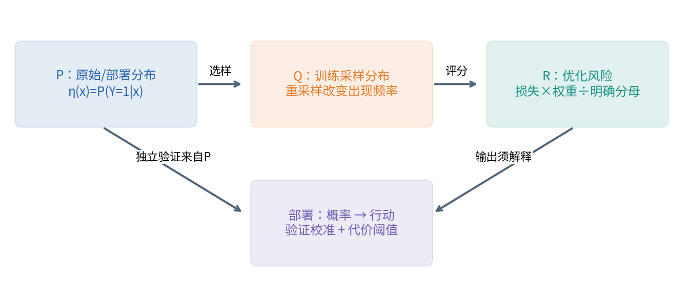

失衡本身不是必须消除的错误。罕见事件真实地罕见时，原分布的交叉熵正是按真实频率评价概率。需要额外处理的原因可能是少数类信息不足、有限预算下难以学习、误判代价不对称，或数据收集造成了选择偏差。不同原因对应不同干预，不能由“正例少”直接推得“权重一定取倒数频率”。

## 2 二分类交叉熵怎样稳定地计算

令一个样本输入为x，真实标签y∈{0,1}。网络输出实数logit s，概率形式为p=σ(s)=1/(1+exp(−s))。s不是概率；它可以为负，也不必小于1。与s对应的odds为p/(1−p)=exp(s)，因此s=ln[p/(1−p)]，称为对数优势。

二分类交叉熵为：

$$\ell(s,y)=-y\ln p-(1-y)\ln(1-p)=\log(1+e^s)-ys.$$

直接先算p、再取log，在s很大时可能得到p舍入为1，随后log(1−p)变成负无穷。稳定形式为：

$$\ell(s,y)=\max(s,0)-ys+\log(1+e^{-|s|}).$$

对本讲的硬标签，还可以分支写成y=1时softplus(−s)、y=0时softplus(s)。代码用logaddexp(0,±s)，主训练用PyTorch的binary_cross_entropy_with_logits。二者都接收logits，不应先做sigmoid再传入。[PyTorch 2.7 BCEWithLogitsLoss](https://docs.pytorch.org/docs/2.7/generated/torch.nn.BCEWithLogitsLoss.html)

局部求导可以从概率形式出发：∂ℓ/∂p=−y/p+(1−y)/(1−p)，∂p/∂s=p(1−p)。相乘并约去分母得到∂ℓ/∂s=p−y。这是数学等式；实现时使用稳定组合，避免先构造可能极大的∂ℓ/∂p。手算账本为了展示这两项局部导数，额外要求所有logit绝对值不超过30、参数绝对值不超过10⁶；超出时明确拒绝，不把无穷局部导数写成有效JSON。稳定BCE本身仍可处理下文的±1000。

稳定不等于任意非法输入都能接受。本课程拒绝NaN、无穷、空批次、非0/1标签、错位形状，并对接收标签的公开logit接口要求|s|≤10⁶以限制教学范围。±1000的正确和错误预测分别得到约0和1000的有限损失。边界拒绝是显式异常，不依赖可被Python优化模式移除的assert。输入转换为float64之后还要重新检查有限性；较宽浮点类型中有限的值，也可能在转换时溢出。

## 3 加权损失改变的究竟是什么

### 3.1 先写分母 再谈权重大小

给样本i正权重aᵢ>0。两种常见归约分别为：

$$J_{\rm count}=\frac1n\sum_i a_i\ell_i,\qquad J_{\rm weight}=\frac{\sum_i a_i\ell_i}{\sum_i a_i}.$$

对于一个固定数据集和固定权重，它们相差正常数(Σaᵢ)/n，因而无正则化时具有相同最优点，但梯度尺度和给定学习率下的更新不同。如果还有固定强度的正则项，单独缩放数据项会改变正则的相对作用，最优点也可能改变。037的目标组成在这里仍要逐项解释。

一条样本对sᵢ的总梯度是aᵢ(pᵢ−yᵢ)/D，其中D是已声明的分母。D若只由标签和固定权重组成，不是待学习变量。把这个梯度先算好后，再在别处额外除一次批大小，会悄悄改变目标。

权重归一化的代码先将全部正权重除以其最大值，再计算分子和分母，避免有限权重相加溢出；例如两个$10^{308}$权重不能直接先求和。按样本数归约若真实结果超出float64有限范围，则显式拒绝。

框架API的mean不必表示同一个分母。在PyTorch2.7中，BCEWithLogitsLoss的mean按元素数归约；pos_weight只乘正标签项。单标签CrossEntropyLoss在类别索引目标和class weight设置下，其mean通常按有效目标权重和归约；概率目标另有规则。不能仅凭两个函数都写mean便声称等价。[CrossEntropyLoss官方定义](https://docs.pytorch.org/docs/2.7/generated/torch.nn.CrossEntropyLoss.html)

本讲手算使用D=3+1=4；主实验使用除以训练样本数240，但把类别权重归一化到训练集平均恰为1。两个章节均明确约定，不把手算中的3∶1与主实验的倒数频率权重混用。

### 3.2 从条件风险推出最优输出

固定x，记真实正例概率η=P(Y=1|X=x)。假设0<η<1，负类权重a₀>0、正类权重a₁>0，候选概率q∈(0,1)。条件加权风险为：

$$r(q\mid x)=-a_1\eta\ln q-a_0(1-\eta)\ln(1-q).$$

对q求导，设为零：−a₁η/q+a₀(1−η)/(1−q)=0。两边乘正数q(1−q)并移项，有a₀(1−η)q=a₁η(1−q)。所以：

$$q^*(x)=\frac{a_1\eta(x)}{a_1\eta(x)+a_0[1-\eta(x)]}.$$

二阶导数为a₁η/q²+a₀(1−η)/(1−q)²>0，因此这是唯一最小点。η=0或1时，最小值在对应概率端点取得，有限logit只能逐渐接近。除以一个与模型无关的正归一化常数不会改变这一结论。

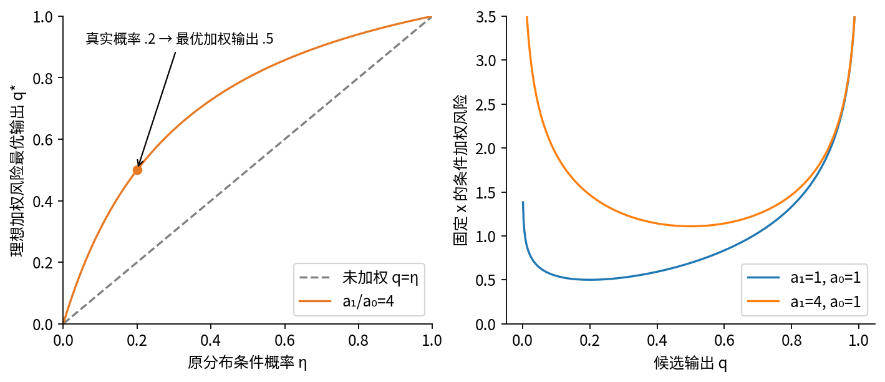

把上式改写为odds关系更清楚：q*/(1−q*)=(a₁/a₀)η/(1−η)。因此logit q*=logit η+ln(a₁/a₀)。当正例受到更大权重时，最优加权输出向正类偏移；这可能有利于某些决策，也意味着原始分布的概率解释不再直接成立。

这里要求可以在每个x独立选择q，或者模型正确表达最优条件概率，并达到相应总体风险最优。在有限网络、有限数据、有限优化和正则化下，不能保证实际输出恰好等于q*。解析关系是解释目标的基准，不是无条件修复模型的定理。

## 4 重采样与加权何时等价

在固定训练集上，普通经验分布给每条记录概率1/n。令A=Σaᵢ，改成以qᵢ=aᵢ/A有放回独立抽样，再对抽到的损失取普通平均。一次抽样I的期望为：

$$E_I[\ell_I]=\sum_iq_i\ell_i=\frac{\sum_i a_i\ell_i}{A}.$$

同理，对固定参数θ，如果抽样概率不依赖θ，则E[∇ℓᵢ]=Σqᵢ∇ℓᵢ。在有限训练集上只是交换有限和与导数。因此重采样的批次平均梯度，是归一化加权经验风险梯度的无偏估计。它不是普通原分布经验风险的无偏估计。

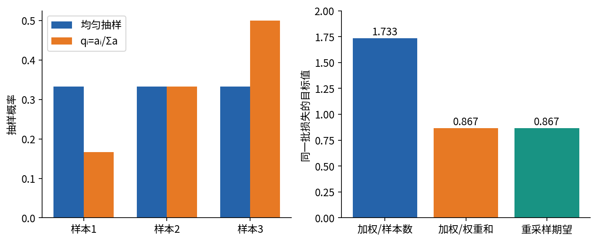

“期望梯度相同”不等于“训练轨迹相同”。重复抽到某些记录、暂时没抽到另一些记录会产生随机性；非线性参数更新之后的未来梯度不同。自适应优化器还会积累不同的状态。本实验用简单SGD，消除动量状态这一额外因素，仍能看到重采样与精确全批加权的有限差异。

### 4.1 批内自归一化是另一个随机估计量

若从原训练集均匀抽B条记录，使用(1/B)Σaᵢℓᵢ，期望是J_count。若再除以预先算好的平均权重A/n，则期望为J_weight。但每次都除以当前批的随机权重和，得到Σ_batch aᵢℓᵢ/Σ_batch aᵢ，通常不能把期望写成两个期望的比值。批大小为1时，这个比值直接退化为该条未加权损失，尤其直观地暴露问题。

### 4.2 不要重复平衡

若已经按qᵢ∝aᵢ重采样，又对抽到的损失乘aᵢ，则期望与Σaᵢ²ℓᵢ成比例。想回到普通经验风险，可以在qᵢ>0的条件下使用重要性权重1/(nqᵢ)，但权重过大可能造成高方差。若某些记录qᵢ=0，而它们在目标风险中有正质量，单靠采到的数据无法恢复被删掉的贡献。

实际工程还会用无放回抽样、每批严格指定类别数量或先重采样实体再取记录。它们的依赖结构与这里不同，不能照搬“独立有放回”的方差和预算。报告中需写抽样单位、是否放回、每轮抽多少条，而不只写“balanced sampler”。

## 5 九参数小网络的一次完整加权更新

### 5.1 固定所有输入与形状

采用两条二分类样本，样本放在矩阵行。X是2×2，W是2×2，b和u各长2，c是标量：

$$X=\begin{bmatrix}1&2\\-1&1\end{bmatrix},\quad y=\begin{bmatrix}1\\0\end{bmatrix},\quad W=\begin{bmatrix}.5&-.2\\.3&.4\end{bmatrix}.$$

$$b=(.1,.2),\quad u=(.6,-.5)^\top,\quad c=.1,\quad a=(3,1)^\top.$$

定义Z=XW+b，H=ReLU(Z)，s=Hu+c，p=σ(s)。目标J=(3ℓ₁+ℓ₂)/4，不加正则、不用dropout。参数顺序固定为(W11,W12,W21,W22,b1,b2,u1,u2,c)。学习率η_step=.1，与条件正例概率η(x)不是同一个量；下文更新直接写.1以免混淆。

### 5.2 每条样本的前向与标量目标

Z11=1(.5)+2(.3)+.1=1.2，Z12=1(−.2)+2(.4)+.2=.8；Z21=(−1)(.5)+.3+.1=−.1，Z22=(−1)(−.2)+.4+.2=.8。ReLU仅把Z21变成0，所以H两行为(1.2,.8)和(0,.8)。

s₁=1.2(.6)+.8(−.5)+.1=.42；s₂=0(.6)+.8(−.5)+.1=−.3。接着按稳定公式求损失：

|样本|y|logit s|概率p|稳定BCE ℓ|加权后对J的贡献|
|---|---|---|---|---|---|
|1|1|.42|.6034832499|.5050369938|.3787777454|
|2|0|−.3|.4255574832|.5543552445|.1385888111|

J=.5173665565。若错误地把同一加权和除以2，会得到1.0347331130，梯度也整体大2倍。这不是另一次实验“学得更差”，而是损失定义被改变。

### 5.3 每个局部导数及路径乘积

∂J/∂ℓ分别为.75和.25。∂ℓ/∂p分别为−1.6570468198与1.7408182207；∂p/∂s分别为.2392912170与.2444583117。三项相乘，或直接计算aᵢ(pᵢ−yᵢ)/4，都得到：

$$\bar s=(-.2973875626,\ .1063893708)^\top.$$

这里上横线表示J对该量的导数。输出仿射层的局部导数为∂sᵢ/∂Hᵢⱼ=uⱼ，∂sᵢ/∂uⱼ=Hᵢⱼ，∂sᵢ/∂c=1。因此：

$$\bar H=\bar s u^\top=\begin{bmatrix}-.1784325376&.1486937813\\.0638336225&-.0531946854\end{bmatrix}.$$

ReLU在Z≠0时的局部导数是1[Z>0]，本例门控为两行(1,1)、(0,1)。因此第二条样本第一条隐藏路径被截断：

$$\bar Z=\begin{bmatrix}-.1784325376&.1486937813\\0&-.0531946854\end{bmatrix}.$$

输入仿射层有∂Zᵢⱼ/∂Wₖⱼ=Xᵢₖ、∂Zᵢⱼ/∂bⱼ=1，其他不连接的坐标局部导数为0。共享参数要累加所有样本贡献，不能只取最后一条记录：

|参数|样本1路径贡献|样本2路径贡献|总梯度|
|---|---|---|---|
|W11|−.1784325376|0|−.1784325376|
|W12|.1486937813|.0531946854|.2018884667|
|W21|−.3568650751|0|−.3568650751|
|W22|.2973875626|−.0531946854|.2441928772|
|b1|−.1784325376|0|−.1784325376|
|b2|.1486937813|−.0531946854|.0954990959|
|u1|−.3568650751|0|−.3568650751|
|u2|−.2379100501|.0851114966|−.1527985534|
|c|−.2973875626|.1063893708|−.1909981918|

例如W12收到1×.1486937813+(−1)×(−.0531946854)，两个正贡献相加，而不是相减。u2收到.8×(−.2973875626)+.8×.1063893708。损失梯度中已经含分母4，表格不能再除以样本数。

若把梯度继续传到输入，$\bar X=\bar ZW^\top$。两行分别为(−.1189550250,.0059477513)、(.0106389371,−.0212778742)。本任务输入是固定数据，不更新；列出它们是为了确认每条路径的方向和矩阵形状。

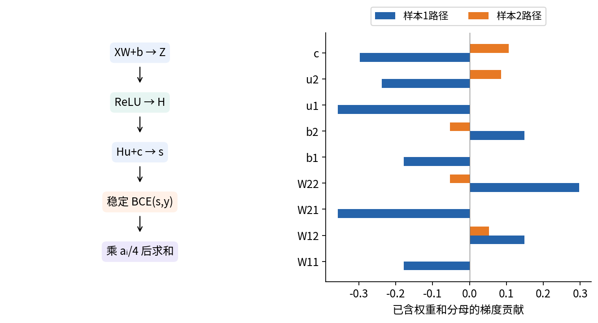

### 5.4 全部参数使用同一旧快照同步更新

执行θ⁺=θ−.1∇J(θ)。先计算完整旧梯度，再同时更新；若先改u，再用新u计算旧图中的$\bar H$，便不再是此目标在θ处的SGD。

|参数|旧值|变化量|新值|
|---|---|---|---|
|W11|.5|+.0178432538|.5178432538|
|W12|−.2|−.0201888467|−.2201888467|
|W21|.3|+.0356865075|.3356865075|
|W22|.4|−.0244192877|.3755807123|
|b1|.1|+.0178432538|.1178432538|
|b2|.2|−.0095499096|.1904500904|
|u1|.6|+.0356865075|.6356865075|
|u2|−.5|+.0152798553|−.4847201447|
|c|.1|+.0190998192|.1190998192|

### 5.5 下一次前向 不能只停在更新公式

用未四舍五入的新参数重新计算。Z⁺11=.5178432538+2(.3356865075)+.1178432538≈1.3070595225；Z⁺12=−.2201888467+2(.3755807123)+.1904500904≈.7214226683。第二行同理为(−.0643134925,.7862196494)，门控本次保持不变。

|样本|新隐藏向量|新logit|新概率|新BCE|
|---|---|---|---|---|
|1|(1.3070595225,.7214226683)|.6002918220|.6457230677|.4373845549|
|2|(0,.7862196494)|−.2619966830|.4348729428|.5707046931|

J⁺=.4707145895，比原目标小。然而样本2损失由.5543552445增加到.5707046931。加权总目标下降，并不意味着每条样本都获益。这个局部冲突正是用一个标量目标权衡不同记录的实际含义。

下一次反向时$\bar s^+$=(−.2657076992,.1087182357)，必须乘新u，而不是旧u。新总梯度依参数顺序为($-.1689067994$, $.1814917933$, $-.3378135987$, $.2048898299$, $-.1689067994$, $.0760959555$, $-.3472957785$, $-.1062111442$, $-.1569894635$)。程序保存了两次完整路径；独立Decimal标量实现、PyTorch自动微分与18个中心差分坐标均互相核对。本例在两点都远离ReLU零点，因此差分不跨不可微边界。

## 6 代价阈值从行动风险推出

设行动1为告警，行动0为不告警；正确行动代价为0，一次误报代价C_FP>0，一次漏报代价C_FN>0。若p已经表示该记录在部署分布的条件正例概率，则：

$$R(1\mid x)=C_{FP}(1-p),\qquad R(0\mid x)=C_{FN}p.$$

选择期望代价较小者。按本讲并列时告警的约定，C_FP(1−p)≤C_FN p当且仅当：

$$p\geq\tau^*=\frac{C_{FP}}{C_{FP}+C_{FN}}.$$

主实验C_FP=1、C_FN=4，所以理论阈值为.2。这个数字不是从测试集选出。比起.5，它愿意容忍更多误报来减少漏报；这不等于模型的概率估计能力变好了。

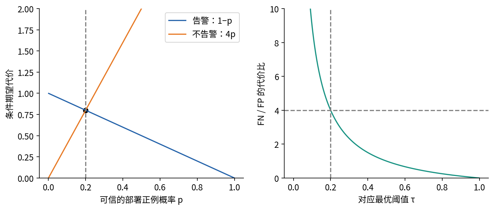

### 6.1 条件与一般化

该推导假设概率适用于部署、代价已给定且与样本无关、每条行动互不约束、没有其他效用项。若一天最多检查十台设备，就要考虑跨样本的资源约束；若误报代价随设备变化，阈值也应随x变化。若正确行动也有代价，应比较完整代价矩阵的两项条件期望，而非把公式机械套入。

原分布概率准确已是很强假设。实际模型有偏差时，可以在独立验证集上比较预先列好的阈值候选。本实验先定21个候选0,.05,…,1，比较(FP+4FN)/n，并列选较大阈值。它只是候选集中验证代价最低者，不是未知总体最优者。[Elkan，代价敏感学习基础](https://cseweb.ucsd.edu/~elkan/rescale.pdf)

### 6.2 权重与阈值不要把同一代价算两次

从q*公式可得q*≥.5当且仅当η≥a₀/(a₀+a₁)。若a₀=C_FP、a₁=C_FN，在理想条件下，加权输出用.5阈值与原始概率使用代价阈值相同。但q*仍不是η，若再对它使用C_FP/(C_FP+C_FN)，就会进一步偏向正类，相当于重复施加部分代价偏好。

主实验的类别权重来自频率，并非代价1∶4。它们承担平衡训练风险的职责；代价阈值在恢复概率解释及验证温度之后单独处理。报告应把“为什么选这些权重”和“为什么用这个行动阈值”各写一句。

## 7 先验修正：加法位移与温度乘法不同

若模型输出q确实是类别加权分布的条件概率，已知a₀、a₁，且希望返回原分布，可反解：

$$\eta=\frac{a_0q}{a_1(1-q)+a_0q},\qquad \operatorname{logit}\eta=\operatorname{logit}q-\ln\frac{a_1}{a_0}.$$

logit空间做减法通常比先除概率更稳定。对于平衡类别权重a₁=.5/π、a₀=.5/(1−π)，需减去ln[(1−π)/π]。本实验只用训练标签估计π=74/240=.3083333333；不读取测试正例率来修正预测。对uniform处理不减任何常数。

更一般地，若源分布Q与部署分布P满足类别条件不变P(X|Y)=Q(X|Y)，只有先验不同，且各类别在源中有正概率，那么Bayes公式给出二分类修正：

$$\operatorname{logit}p_P=\operatorname{logit}p_Q+\ln\frac{\pi_P}{1-\pi_P}-\ln\frac{\pi_Q}{1-\pi_Q}.$$

多分类时按p_P(k|x)∝p_Q(k|x)π_P(k)/π_Q(k)重归一化。这依赖label shift条件及可用的先验估计；若P(X|Y)也变了，公式一般不够。未知部署先验的估计是另一个研究问题，本讲没有实施BBSE，也不从测试标签偷取答案。[Lipton等，label shift定义](https://proceedings.mlr.press/v80/lipton18a.html)

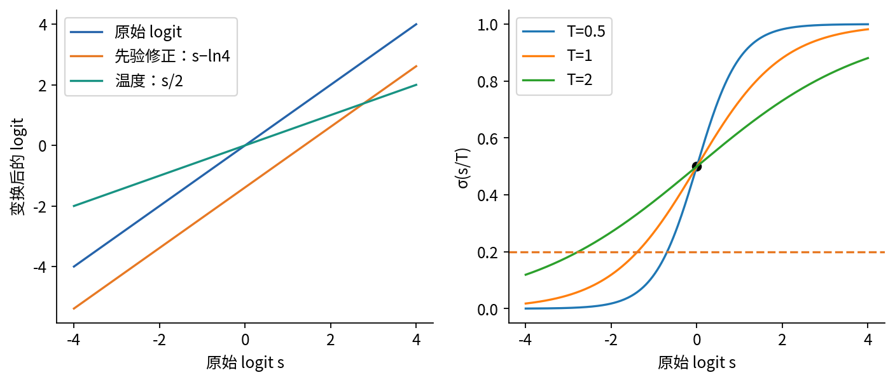

有限网络未必学到真正的q，训练样本先验也有误差。因此本实验的先验修正是有理论依据的有限操作，要继续接受独立评价，不能因为公式正确就宣称校准已经完成。先平移后缩放得到(s−d)/T，与先缩放再减d一般不同，代码和部署必须保留同一个顺序。

## 8 温度缩放：只用验证标签拟合一个数

固定已训练网络的所有参数，取未用于训练的验证logits。二分类温度缩放为p_T=σ(s/T)，T>0；多分类为softmax(z/T)，所有类别共享同一个正标量。原论文以验证NLL确定T，不能用测试标签拟合。[Guo等，2017，第4.2节](https://proceedings.mlr.press/v70/guo17a/guo17a.pdf)

### 8.1 在逆温度上看清优化

令β=1/T>0，校准验证集合有m条，logits记为sᵢ。目标与两阶导数为：

$$L(\beta)=\frac1m\sum_i[\log(1+e^{\beta s_i})-y_i\beta s_i],$$

$$L'(\beta)=\frac1m\sum_i[\sigma(\beta s_i)-y_i]s_i,$$

$$L''(\beta)=\frac1m\sum_i\sigma(\beta s_i)[1-\sigma(\beta s_i)]s_i^2\geq0.$$

因而这是β上的凸目标。若至少一个sᵢ≠0，在有限β下二阶导数严格为正；若所有sᵢ=0，目标恒为ln2，温度无法识别。该凸性不等于对T或log T都具有相同的全局凸性，选择变量时要说清楚。

代码把β限制在[.05,20]，即T∈[.05,20]，用于明确有限教学搜索范围。先检查两端导数，若最优在边界就记录边界状态；否则做90轮二分寻找L′(β)=0。全零logits时保留β=1并标flat。计算正类梯度使用−σ(−βs)，避免σ(βs)先舍入为1再减1。所有非零标签margin同为正确方向时，目标严格递减，直接取上界；全为错误方向则取下界。混合方向若两端梯度在浮点数中都为0，则保留β=1并标numerically_flat，不将数值分辨率不足冒充已确定边界。选择范围包含β=1，所以数值误差外，所拟合验证NLL不会比不缩放更差；这个结论只针对拟合数据和NLL。

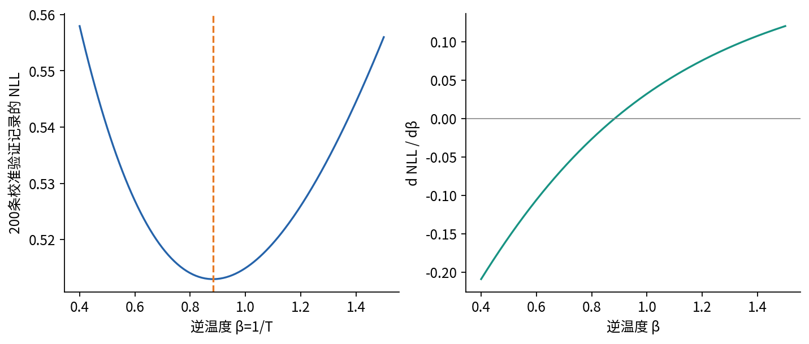

### 8.2 什么保持 什么改变

对固定s和正T，sign(s/T)=sign(s)，所以二分类.5阈值预测保持不变；多分类共同正温度保持同一条样本的logit大小顺序和argmax。因此固定规则下准确率保持。二分类所有记录的分数排序也保持，理想精确算术下基于排序的ROC-AUC保持；浮点极端饱和可能制造额外并列，应在logit上检查。

不能将这句话扩大为“多分类所有样本的置信度排名都不变”。不同记录的其他类别logits会影响softmax分母，最大概率跨记录的排序可能改变。也不能扩大为“任何阈值下的准确率都不变”：固定概率阈值.2对应s≥T logit(.2)，T改变时行动可能改变。

NLL、Brier和ECE通常会改变，未必都改善，未必在测试集改善，未必在每个分组改善。T>1使输出更接近中性概率，T<1使其更尖锐，最优温度不必大于1。温度只有一个自由度，无法学习额外特征、恢复错误排序或修复所有局部偏差。

## 9 怎样评价概率而不偷换成准确率

校准的一种二分类定义为E[Y|p(X)=t]=t，即被模型报为某个概率的人群，真实正例比例与该概率相同。连续分数时应理解为条件期望的几乎处处性质，有限数据不能逐个实数t直接验证。总体校准也不保证E[Y|p(X)=t,G=g]=t在每个组内成立。

NLL是前面的平均负对数概率，Brier在本讲指单个正类概率的均方误差：BS=(1/n)Σ(pᵢ−yᵢ)²。若把两类概率向量的平方误差相加，会得到两倍，本讲不采用那个约定。固定真实η，有E[(p−Y)²|x]=(p−η)²+η(1−η)，所以理想条件下最优p=η。NLL与Brier都评价概率质量，但不是只衡量校准的纯指标，也受到任务不确定性和辨别信息的影响。

始终输出总体正例率的模型可以总体校准，却没有个体区分能力。相反，一个高度准确的分类器可以系统性过度自信。应同时报告准确率或任务相关决策指标，以及概率指标，不能用“校准更好”替代任务目标。

### 9.1 本讲的可靠性图与ECE定义

我们对正类概率p分箱，而非对max(p,1−p)的top-label confidence分箱。K个等宽区间为[k/K,(k+1)/K)，最后一个包含1。每个非空箱Bₖ记录nₖ、平均预测p̄ₖ和实际正例率ȳₖ：

$$\widehat{ECE}_K=\sum_{k:n_k>0}\frac{n_k}{n}|\bar p_k-\bar y_k|.$$

可靠性图横轴p̄ₖ、纵轴ȳₖ，理想位置是对角线。空箱没有经验正例率，不画成0；小箱要附样本数，不能只看曲线锯齿。阈值不参与本定义，所以仅调整行动阈值时NLL、Brier和ECE完全相同。

分箱会抵消箱内方向相反的误差。四条预测(.1,.1,.9,.9)，标签(0,1,0,1)，只有一个箱时平均预测和正例率都为.5，ECE=0；两个箱时各自实际正例率为.5，ECE=.4。第一个结果没有证明完美校准。

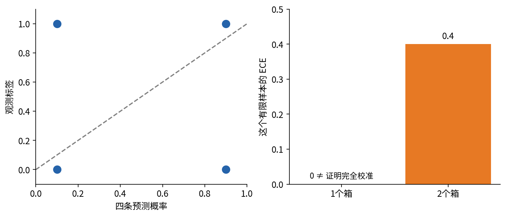

有限样本中的ECE还含估计偏差，粗箱近似和小箱随机误差方向不同，不能说分箱越细越准确。我们预先报告5、10、20等宽箱敏感性，并不从中挑最好看的一个作为唯一成绩。[Roelofs等，有限样本与分箱偏差](https://proceedings.mlr.press/v151/roelofs22a.html) 分组较小时更需谨慎，显著性或不确定区间需要另行设计。本实验不把三个算法种子当作三份独立测试人群。[Vaicenavicius等，校准评价框架](https://proceedings.mlr.press/v89/vaicenavicius19a.html)

## 10 可复现实验：先冻结选择 再读测试标签

### 10.1 数据与可观测边界

固定生成器PCG64、seed=3902026，依次产生train240、validation400、test1000条。组G以概率.25取1，基础两个输入为独立标准正态，x₁额外加.35G。真实生成logit为1.1x₁−.8x₂+.65x₁x₂−1.6+.8G，标签为相应sigmoid概率的Bernoulli抽样。

模型只输入x₁、x₂，不输入G；G仅用于审计分组。因此即使学习器最优地估计P(Y|X)，也未必对P(Y|X,G)完成组内校准。这是有意加入的模型信息边界，并不对应任何真实受保护属性或公平性结论。

|集合|条数|正例|组0条数/正例|组1条数/正例|用途|
|---|---|---|---|---|---|
|训练|240|74|181/44|59/30|训练网络、估计类别权重|
|验证|400|112|305/67|95/45|前200拟温度，后200选阈值|
|测试|1000|294|731/190|269/104|全部选择冻结后的评价|

拆分顺序与角色在数据生成时固定，没有根据最终表现重分。独立验证集内部再分两部分，使温度拟合和阈值选择不重复使用同一批标签。超参数、种子、预算、代价、阈值候选、分组和分箱数都预先规定；本实验没有搜索每种方法的最佳配置。

### 10.2 三种训练方式与同一预算

模型为2→6→1：隐藏层tanh(XW+b)，输出实数s=hu+c，共12+6+6+1=25个参数。W由N(0,.45²)、u由N(0,.35²)初始化，偏置为0。种子11、23、37在三种方法间配对，共九次。每次240轮、每轮240次样本呈现、一次SGD更新，学习率.08，无动量、无正则化、无早停。

- uniform：固定240条训练记录的普通BCE平均，每轮全部使用。
- weighted：仍使用全部240条，按a₁=.5/π、a₀=.5/(1−π)乘BCE，再除以240；π=74/240，平均权重为1。
- resampled：每轮按qᵢ=aᵢ/Σa有放回抽240次，取未再加权的BCE平均；实际每轮正例数并不严格等于120。

总计2160次更新、518400次训练样本呈现。重采样多次出现同一记录计多次呈现，不等于获得新信息。训练记录数和模型结构一致并不意味着三种优化过程的噪声相同；这正是比较对象的一部分。

### 10.3 六种输出视图

每个已训练网络都保留以下预先规定的视图，绝不从测试结果选一种才报告：raw原始输出；raw_temperature直接对原始logit拟温度；prior先验修正；prior_temperature先修正再拟温度；cost_theory沿用校准概率、阈值.2；cost_validation沿用同一概率、阈值由决策验证集选择。

uniform的prior是恒等操作，因此部分视图数值相同，这是合理对照而非遗漏。额外保留raw_temperature，是为了直接检验“温度能否代替先验修正”。测试预测共9×6×1000=54000行；每视图按全体、组0、组1计算，共162行指标；可靠性表保留1620个箱，包括空箱。

程序先在内存构造含所有模型参数、温度和阈值的frozen-plan对象，再解析测试标签。输入文件的字节摘要可提前核验，但不把摘要当标签选择信号。最后成功后写结果文件。这个顺序提供可审计证据，不是访问控制：人若看过测试后改协议，再运行也不算新独立测试。

## 11 实际结果：改善哪个对象 要逐项说

以下都是同一份1000条合成测试记录上的三个算法种子均值；没有统计显著性或真实任务推广的主张。

|训练方式/视图|准确率|NLL|Brier|10箱ECE|平均代价|
|---|---|---|---|---|---|
|等权，原始 .5|.724667|.527406|.177685|.046955|.782333|
|加权，原始 .5|.691000|.601866|.207404|.164320|.555000|
|重采样，原始 .5|.690333|.601942|.207469|.164430|.558667|
|等权，温度 .5|.724667|.527254|.177408|.032539|.782333|
|加权，修正+温度 .5|.722333|.528340|.178052|.034546|.768667|
|重采样，修正+温度 .5|.721000|.528418|.178099|.034217|.772000|
|等权，温度+阈值 .2|.585667|.527254|.177408|.032539|.530333|
|加权，修正+温度+.2|.580000|.528340|.178052|.034546|.527000|
|重采样，修正+温度+.2|.581000|.528418|.178099|.034217|.527000|

全负规则在本测试集准确率为.706，平均代价4×.294=1.176；全正规则准确率.294、平均代价.706。它们提醒我们：准确率最高的规则未必代价最低。代价单位是事先定义的教学相对单位，不能解释为节省了实际货币。

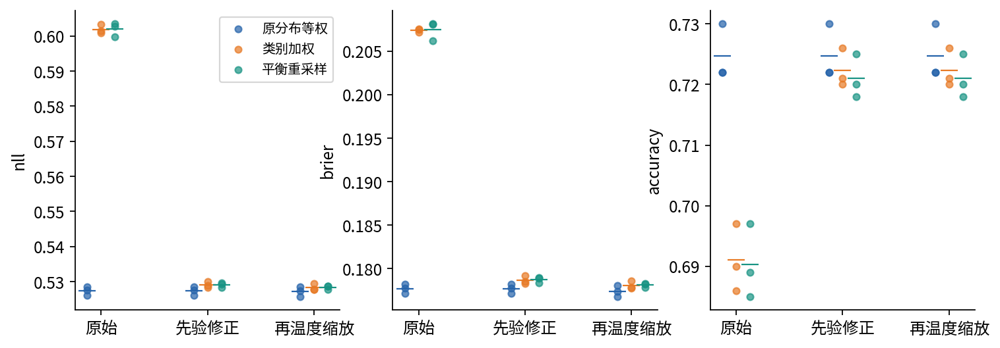

### 11.1 温度不是先验偏移的替代品

类别加权的raw_temperature平均NLL从.601866变为.597540，但10箱ECE从.164320变为.169401，反而增加；重采样也出现相近现象。温度是按验证NLL拟合，既没有针对测试ECE优化，也不能通过单一缩放消掉加性logit偏移。这个结果不支持“只要校准就让所有指标改善”。

先验修正后，三方法得到相近但不相同的概率指标。加权与重采样在这一有限设置中没有显著优于等权的证据；我们没有通过扩大超参数搜索来替某种方法找最有利条件。差异还可能来自优化轨迹、有限数据、模型未包含G和交互项拟合程度。

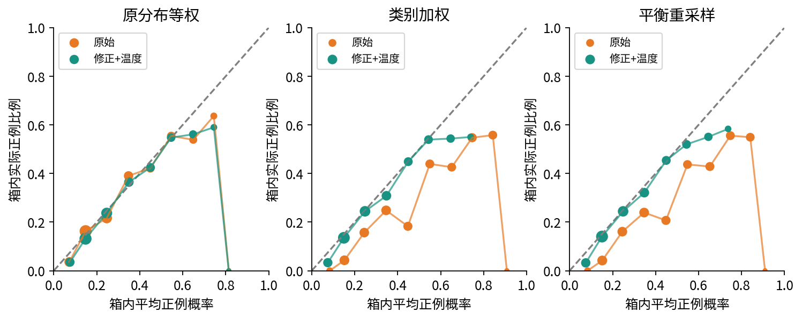

### 11.2 调阈值改变行动 不改变概率分数

九个决策验证选择都恰好得到.2，与理论候选相同，因此cost_theory与cost_validation的测试结果相同。这个相等是本次数据上的观察，不能推广成“任何有限验证集都会选理论阈值”。

等权温度模型把阈值从.5降到.2后，平均准确率从.724667降至.585667，但平均代价从.782333降至.530333，召回从.425170升至.868481。NLL、Brier、ECE完全不变，因为每条概率没有变。若论文把这一改动写成“模型概率准确性改善”，就错把决策改进归给了概率估计。

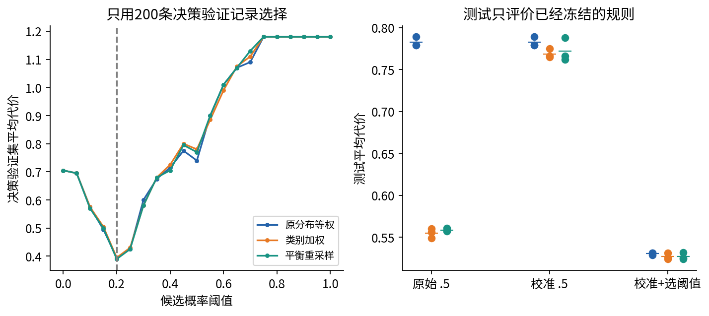

### 11.3 分组与空间边界揭示遗漏

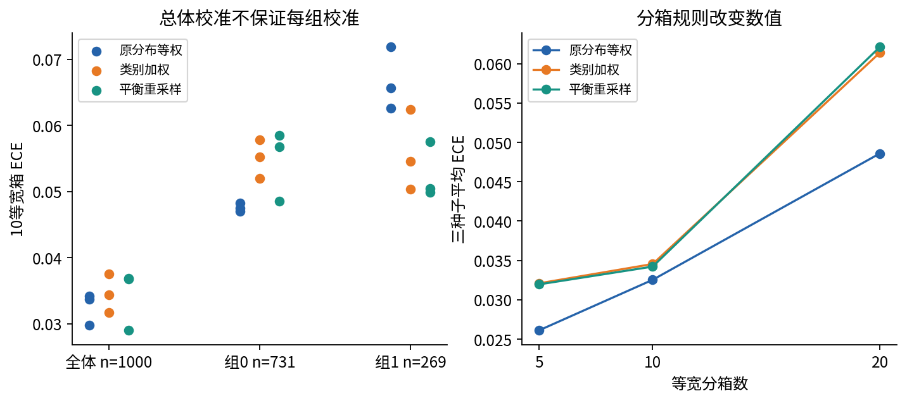

总体指标将不同组按人数混合。一个组中偏高、另一个组中偏低的预测可能相互抵消。G未作为模型输入，加上有限样本误差，使“一组温度适用于所有组”没有保证；但这也不自动授权拟合每组温度，后者需要新的验证预算与预先设计，且应考虑实际部署可否使用分组信息。

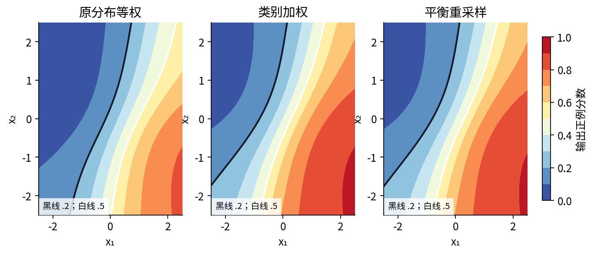

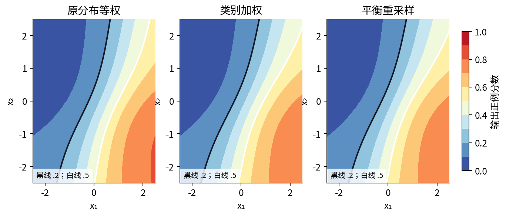

## 12 把这一讲变成科研设计

先提出一个可证伪问题，例如“在相同记录预算下，平衡重采样是否降低少数类漏报，而其原始分数是否偏离部署概率”。然后把训练分布、损失、权重分母、网络预算、验证用途、代价与评价指标写进协议。比较时保留配对初始化，并区分算法随机性与数据重复。

若要扩展，第一步可增加独立数据生成种子，报告配对差异的不确定性；第二步可改变真实先验或引入P(X|Y)漂移，检验先验修正失效的条件；第三步才考虑更灵活的校准映射。每次扩展都需要新的封存测试或明确的探索性标签，不能拿这一讲已反复阅读的测试集继续宣称独立发现。

阅读一篇失衡学习论文时，至少寻找六项信息：原始先验、实际采样规则、损失完整公式和分母、输出概率的参照分布、校准与阈值的拟合数据、带支持数的分组指标。缺任一项都可能让“更好”缺少可比较的含义。
