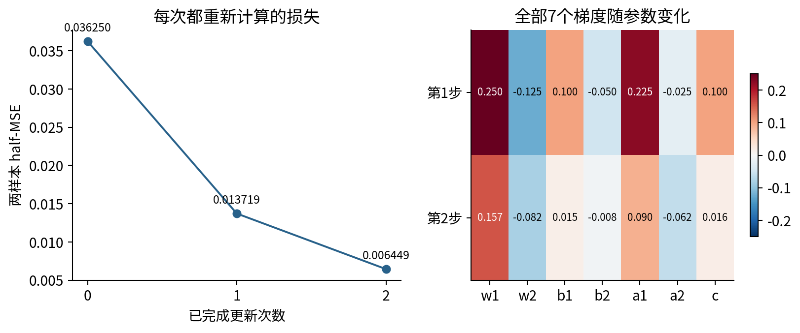
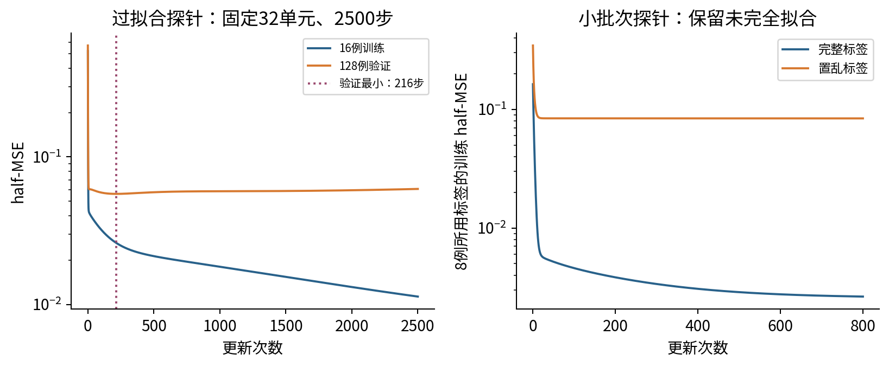

# 040 实验指南 训练诊断与调参实验

本实验要求从可核对的训练记录形成一次有限的实验决定。你会看到下降、停滞、失稳、过拟合，以及一个与常见直觉相反的饱和结果。先阅读协议并写下预测，再运行程序；不以删掉失败配置来获得好看的结论。

## 1 环境和完整入口

建议按environment.yml建立独立学习环境。交付检查实际使用Python3.12.14、NumPy2.3.5、PyTorch2.7.1+cpu、Matplotlib3.10.8；没有验证新的Anaconda安装、GPU或所有操作系统。默认脚本不下载数据，不调用外部模型，不训练大型网络。

在本单元目录执行：

```bash
python test_experiment.py
python experiment.py
python make_figures.py
```

experiment.py和make_figures.py默认根据自身位置找输入；因此也能从其他工作目录用绝对路径调用。若显式传入相对--output、--source或--destination，它们按当前工作目录解释。实验默认覆盖outputs内的6个参考数值文件，绘图覆盖figures内的13幅图。探索新的协议时另开目录，勿把不同协议的图与数值混在一起。

数据和protocol.json有固定摘要保护。直接篡改这些默认文件应在任何结果写入前失败。这是保护交付参考用法，不代表读者不能研究其他设置：可以复制单元，明确修改协议、校验契约与结果记录，重新完成全部检查。不要简单删去报错，再声称仍复现原实验。

## 2 运行前写下计划

填写以下问题：主训练目标和评价指标是什么；哪些量由训练集拟合；验证集选什么；测试集何时进入计算；每配置允许多少更新；失败如何保存；选择同分时怎么办？

默认计划的关键内容如下。

|项目|固定内容|
|---|---|
|数据|训练48、验证128、测试512，各自独立生成|
|主模型|标准化单输入，8个tanh隐藏单元，线性输出，共25参数|
|搜索|学习率0.01/0.05/0.2，L2系数0/0.001/0.01|
|重复|初始化种子4001/4002/4003，配置间配对|
|预算|每配置180次全批次更新；9配置共27次训练|
|选择|三个最终验证half-MSE的均值最小；失败配置不参选；同分按协议顺序|
|参照|学习率0.05，L2系数0.001|
|最终预测|同配置3个模型的预测均值|
|停止|拟议下一状态的目标非有限或大于10^6时不提交|
|测试比较|选出集成、参照集成、训练最小二乘直线和训练均值常数|

这是冻结的可执行教学计划，不能把它描述为已经有外部时间戳的科研预注册。诊断结果也属于开发证据；若据此扩展搜索空间，应另记新的搜索成本和验证使用历史。

## 3 从手算到程序

纸笔用$(x,y)=(-1,0),(1,1)$和七参数初值$(0.5,-0.5,1,1,1,-0.5,0.1)$。分别写出两例的两个$z$、两个$h$、预测、残差、单例损失和平均损失。注意$\partial L/\partial\widehat y_i=r_i/2$，这个平均因子只能用一次。

把每例七个参数贡献列成两行，相加后同时按学习率0.2更新。第一轮应得到损失0.03625、梯度$(0.25,-0.125,0.1,-0.05,0.225,-0.025,0.1)$。用新参数重做第二轮，最后第三次前向应得到损失约0.00644912125。

下面代码打印独立分数链；应在本单元目录运行。

```python
import experiment as e
chain = e.hand_trace()
for i, step in enumerate(chain['steps']):
    print(i, step['loss'])
    for row in step['rows']:
        print(row['prediction'], row['sample_parameter_contributions'])
    print('sum:', step['gradient'])
    print('next:', step['after'])
print('third loss:', float(chain['third_loss']))
```

再核查test_hand_per_sample_autograd确实比较两轮全部28个逐样本贡献，不能只检查总损失下降。若改到ReLU门边界，原先光滑区间的差分解释需要重新分析。



## 4 看懂六个输出文件

|文件|保存内容|
|---|---|
|results.json|完整协议、访问顺序、9个搜索分数、12个单因素对照、51次运行摘要与计数|
|hand_chain.json|完整分数和浮点手算链，含两轮贡献与第三次前向|
|training_curves.csv|12257个真实有限状态的损失、梯度范数、参数范数、拟议更新比和饱和比例|
|training_traces.json.gz|51次训练的每个参数状态、末预测、训练所用标签、失败候选和归一化参数|
|final_evaluation.json|3072个单模型测试预测、集成预测、逐组指标、2000次配对bootstrap和逐例差|
|selection_simulation.json|分数噪声实验的选择索引、验证/独立审计分数，以及Bernoulli精确反例|

大轨迹以确定性gzip封装：level9、mtime=0、空内部文件名，保留完整JSON字节。results.json记录解压长度与SHA-256。读取不需要额外包：

```python
from pathlib import Path
import gzip, json, hashlib
raw = gzip.decompress(Path('outputs/training_traces.json.gz').read_bytes())
runs = json.loads(raw)['runs']
summary = json.loads(Path('outputs/results.json').read_text())
if hashlib.sha256(raw).hexdigest() != summary['trace_storage']['uncompressed_sha256']:
    raise RuntimeError('轨迹内容摘要不同')
print(len(runs), sum(r['updates_applied'] for r in runs))
```

在同一已记录环境下，压缩字节也逐一核对；不同压缩器版本可能产生不同封装字节，因此还需区别解压内容是否相同。并未截断轨迹或浮点数来压低文件大小。

## 5 沿一条真实轨迹核对更新

挑search阶段一个run，读normalization的mean/std/input_scale，只用训练集拟合的这些数重建输入。每个parameters[t]对应curve[t]，即已经接受$t$次更新的状态。下一参数用当前目标$J$求导，再同步更新；不能把validation_data_loss对参数求导加入训练。

train_objective与train_data_loss不同，差值应为当前权重惩罚。参数顺序是输入权重$w$的8项、隐藏偏置$b$的8项、输出权重$a$的8项和输出偏置$c$。偏置梯度不加$\lambda b$或$\lambda c$。

三个unstable运行只保留0、1、2三个状态。failure里的attempted_update=3是被拒绝的候选；不能当作已提交第3步，也不能在它之后补180步恒值曲线。sample_presentations是已接受更新数乘训练例数，不包括验证、失败候选或计时成本。

## 6 诊断而不是按图贴标签

比较reference与slow的三个配对种子。解释为何一个slow种子已经接近参照，而其他两个差得多。再看linear与strong_penalty：它们都有较高训练误差，但改变的是不同对象。

检查saturated_input的初始化饱和比例，再比较第180步验证分数。把相反结果写入记录：不能因为预期“饱和就失败”而删掉它。提出两个仍未区分的解释，并为每个解释设计一个额外受控实验。

tiny_probe取前8例，overfit_probe取前16例。它们的宽度、更新预算和训练集均与主搜索不同，只用于各自诊断，不能放在一起作为等预算排名。置乱8例在800步后仍有非零训练误差，应如实报告，不将其直接等同于反向传播错误。



## 7 复算选择与全部单因素差

只用results.json中的9个search_scores重算选择，暂不读最终测试报告。逐组平均三种子验证损失，答案是lr2-l20（学习率0.2，L2=0）；参照为lr1-l21（0.05，0.001）。

随后读全部12个single_factor_contrasts。固定L2=0.001时，学习率0.05到0.2的三个差应均为负；但其他对照并非都如此。主获胜者相对参照改了两项，因此整体差不能只归因于学习率。请从完整对照中选一个正差值并解释，它为什么不是需要清理的异常文件。

主搜索更新总数4860；全部诊断与探针加入后共12206次接受更新。训练51次，48次完成各自预算，3次提前停止。测试图数量、文件大小或曲线行数不能替代这些训练预算定义。

## 8 独立测试与有条件的不确定性

默认脚本先选出配置，之后才将测试标签交给最终评价。初始文件校验读的是字节摘要，不是使用测试损失调参。公开测试文件不能阻止人为重复开发，因此复现实验时也要保留选择顺序。

比较平均单模型损失与集成预测损失，说明二者为什么不同。选出集成的测试half-MSE约0.04840490，参照约0.05093144。检查左、右组的样本数分别为269与243，再看组误差和残差，不只报总数。

自己实现$d_i=(r_{i,\rm selected}^2-r_{i,\rm baseline}^2)/2$，按同一测试ID成对重采样。2000重复的95%百分位区间约为[-0.00417487,-0.00100847]。这个区间条件于已拟合模型和已有选择过程，不包含训练数据、调参历史或分布变化的不确定性。

## 9 失败保护与复跑

Notebook首格在导入实验模块、生成结果前核对源文件、fixture、参考输出和图的摘要。其后会在临时目录实际重做51次训练，比较6个结果文件，再运行23组测试。脚本从新进程启动，Notebook在新Python进程的全新IPython InProcessKernel中清空并顺序执行。浏览器Jupyter UI、跨进程socket传输没有被本次验证覆盖。

检查错误输入时，至少保留一个已有结果文件的哨兵副本：缺失或篡改fixture应在写入前失败；绘图源的任何默认文件被改动也应在产生图片前失败。算法先算完并序列化所有文件，再逐文件原子替换；这不是“所有文件一起提交”的崩溃事务，进程若在最终写入途中被终止仍需重新完成整次运行。

最终提交一份简短实验记录：原问题、至少两个替代解释、冻结计划、完整运行清单、一个单因素配对结果、失败记录、最终测试的适用范围与下一步决定。不要把本讲合成结果包装成真实研究系统性能。
