# 040 训练诊断与调参实验

从一条下降曲线，走到一项能够被他人核对的实验决定。

## 1 本讲要解决的问题

前面的单元已把数据、反向传播、优化器、初始化、正则化和损失设计接起来。现在模型能运行了，但验证结果不好。你下一步应该增大网络、改学习率、换损失，还是先查样本？本讲不提供看图猜病的口诀，而是建立一条证据链：确认所比较的量，再提出多个解释，用尽量小的受控实验区分，最后在冻结的预算内选择方案。

先修022的配对比较、031的梯度核验、034的优化目标、037的正则化以及039的任务损失与评价区别。即使暂时不做复杂研究，也要能回答三件事：这个数字如何计算；哪个数据影响了选择；改变一项因素后，同一随机条件下发生了什么。

本讲主实验是一维合成回归。它便于把每个预测点、每次更新和每条失败曲线完整保留下来。使用回归并不表示分类诊断较不重要：若分类准确率不变而NLL改善，应先检查指标和阈值，而不能把它自动归为“模型没有学习”。039已经解释了这一点。

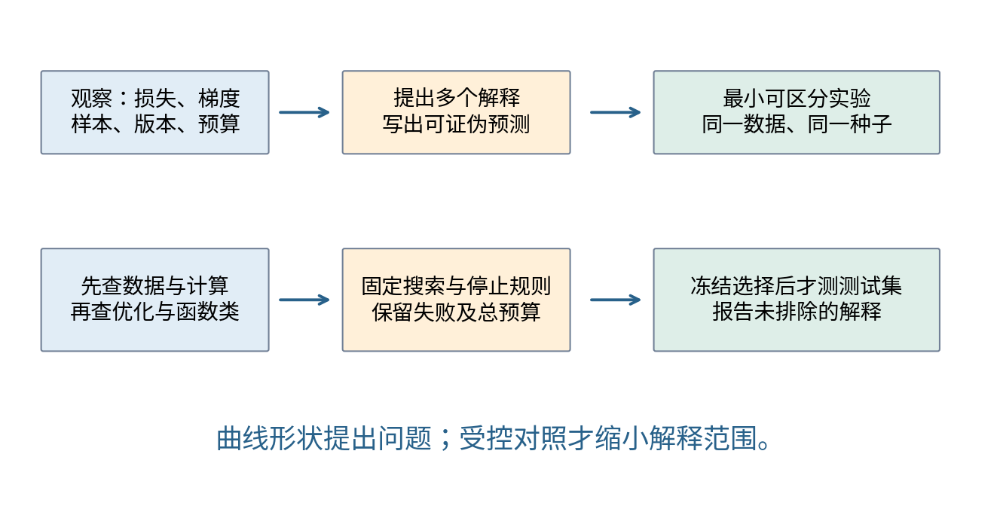

## 2 先确认你画的究竟是哪一个量

设训练集有$n$个样本，模型输出$f_\theta(x_i)$，标签是$y_i$。本讲的训练数据损失为

$$
L_{\rm data}(\theta)=\frac{1}{2n}\sum_{i=1}^{n}(f_\theta(x_i)-y_i)^2.
$$

“half-MSE”就是均方误差的一半；$1/2$用于消掉平方求导时的系数2，不是减少了样本数。RMSE则是$\sqrt{2L_{\rm data}}$。如果训练日志用求和、验证用均值，或者一边用MSE另一边用half-MSE，两条曲线的位置就不能直接比较。

主实验只对输入权重$w$和输出权重$a$加惩罚，不惩罚偏置$b,c$：

$$
J(\theta)=L_{\rm data}(\theta)+\frac\lambda2(\|w\|_2^2+\|a\|_2^2).
$$

因此日志同时保存train_data_loss与train_objective。验证曲线只算验证样本的数据损失，不加参数惩罚。把$J_{\rm train}$减去$L_{\rm val}$叫作“泛化间隙”，会把不同目标混在一起。即使统一了损失，训练与验证仍来自不同样本；小样本噪声、不同难度和预处理差异都可能使验证损失低于训练损失。

本实验没有dropout和BN，因而排除了训练模式与推理模式对曲线的干扰。真实网络还要核对train/eval状态、随机增强是否开启，以及训练曲线是在更新前、更新后还是各小批次不同参数下累计。它们不是可忽略的记录细节。

## 3 先在七个参数上看清一次诊断对象

用两个样本$(x_1,y_1)=(-1,0)$、$(x_2,y_2)=(1,1)$。它们仅用于纸笔核验，不属于稍后的48例训练数据。网络有两个ReLU隐藏单元和一个线性输出：

$$
z_{ij}=w_jx_i+b_j,\qquad h_{ij}=\max(0,z_{ij}),\qquad
\widehat y_i=a_1h_{i1}+a_2h_{i2}+c.
$$

参数固定按$\theta=(w_1,w_2,b_1,b_2,a_1,a_2,c)$排列，初值为$(0.5,-0.5,1,1,1,-0.5,0.1)$。先算各样本残差$r_i=\widehat y_i-y_i$、单样本损失$\ell_i=r_i^2/2$，再取$L=(\ell_1+\ell_2)/2$。本例不加惩罚，学习率$\eta=0.2$。

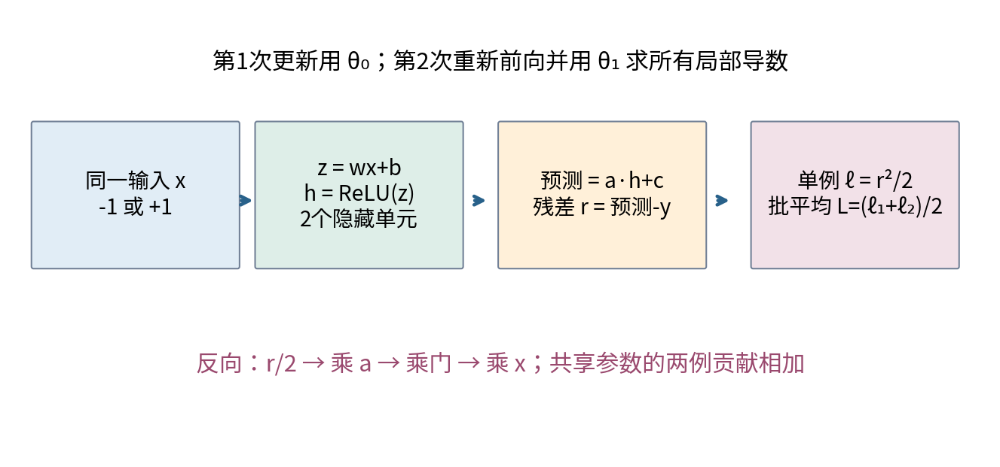

|样本|$z_1,h_1$|$z_2,h_2$|$\widehat y$|$r$|$\ell=r^2/2$|
|---|---|---|---|---|---|
|$x=-1,y=0$|0.5，0.5|1.5，1.5|-0.15|-0.15|0.01125|
|$x=1,y=1$|1.5，1.5|0.5，0.5|1.35|0.35|0.06125|

例如第一例先得到$z_1=0.5(-1)+1=0.5$与$z_2=(-0.5)(-1)+1=1.5$，再算$\widehat y=1(0.5)-0.5(1.5)+0.1=-0.15$。两例相加后，$L_0=(0.01125+0.06125)/2=0.03625=29/800$。

这里所有$z$均大于0，所以ReLU局部导数均为1。不能因为本例门都开启，就在任何输入或后续训练中省略门；在$z=0$处还要区分数学不可导和框架所采用的约定。

## 4 局部导数怎样积累成全部参数梯度

先把链拆开。对第$i$例，$\partial L/\partial\widehat y_i=r_i/2$；$\partial\widehat y_i/\partial h_{ij}=a_j$；$\partial h_{ij}/\partial z_{ij}=\mathbf1[z_{ij}>0]$；$\partial z_{ij}/\partial w_j=x_i$，$\partial z_{ij}/\partial b_j=1$。输出层还有$\partial\widehat y_i/\partial a_j=h_{ij}$与$\partial\widehat y_i/\partial c=1$。

记$u_i=r_i/2$，$v_{ij}=u_i a_j\mathbf1[z_{ij}>0]$。每例对七个共享参数的贡献依次为

$$
(v_{i1}x_i,\ v_{i2}x_i,\ v_{i1},\ v_{i2},\ u_ih_{i1},\ u_ih_{i2},\ u_i).
$$

第一例$u_1=-0.075$，传到两个隐藏输出的梯度是$(-0.075,0.0375)$，乘门后不变。第二例$u_2=0.175$，对应$(0.175,-0.0875)$。$w_1$收到第一例$(-0.075)(-1)=0.075$和第二例$0.175(1)=0.175$；同一参数的两条样本路径必须相加。

|参数|第一例贡献|第二例贡献|总梯度$g_0$|同时更新后的$\theta_1$|
|---|---:|---:|---:|---:|
|$w_1$|0.075|0.175|0.25|0.45|
|$w_2$|-0.0375|-0.0875|-0.125|-0.475|
|$b_1$|-0.075|0.175|0.1|0.98|
|$b_2$|0.0375|-0.0875|-0.05|1.01|
|$a_1$|-0.0375|0.2625|0.225|0.955|
|$a_2$|-0.1125|0.0875|-0.025|-0.495|
|$c$|-0.075|0.175|0.1|0.08|

表中最后一列统一用$\theta_1=\theta_0-0.2g_0$。计算$w,b$梯度时仍使用旧$a$；不能先更新输出层，再把新$a$用于同一步反向。那会混合不同参数点的导数。

## 5 第二轮不能沿用第一轮梯度

用刚得到的七个新参数完整重做前向。第一例两个$z$为$(0.53,1.485)$，预测$0.955(0.53)-0.495(1.485)+0.08=-0.148925$；第二例两个$z$为$(1.43,0.535)$，预测$1.180825$。门仍全部开启。单例损失分别为0.0110893278125与0.0163488403125，因此

$$
L_1=0.0137190840625=\frac{43901069}{3200000000}.
$$

新的$u$为$(-0.0744625,0.0904125)$。第一例的隐藏局部上游梯度是$(-0.0711116875,0.0368589375)$；第二例是$(0.0863439375,-0.0447541875)$。它们用了新输出权重$(0.955,-0.495)$，而不是旧权重。

|参数|第一例新贡献|第二例新贡献|总梯度$g_1$|$\theta_2=\theta_1-0.2g_1$|
|---|---:|---:|---:|---:|
|$w_1$|0.0711116875|0.0863439375|0.157455625|0.418508875|
|$w_2$|-0.0368589375|-0.0447541875|-0.081613125|-0.458677375|
|$b_1$|-0.0711116875|0.0863439375|0.01523225|0.97695355|
|$b_2$|0.0368589375|-0.0447541875|-0.00789525|1.01157905|
|$a_1$|-0.039465125|0.129289875|0.08982475|0.93703505|
|$a_2$|-0.1105768125|0.0483706875|-0.062206125|-0.482558775|
|$c$|-0.0744625|0.0904125|0.01595|0.07681|

第二次同时更新后，再做第三次前向：第一例$z=(0.558444675,1.470256425)$，第二例$z=(1.395462425,0.552901675)$，所以各门仍为1。预测分别为$-0.10939290542302063$和$1.117599648199548$，对应$L_2\approx0.006449121253386854$。这一步是重新计算，不是拿一阶近似当真实损失。

程序以Fraction保存精确分数，另用逐样本autograd核对两轮共28个参数贡献。本讲还对随机平滑网络的340个参数坐标做显式NumPy梯度与中心差分检查。通过这些检查仅说明所测计算一致，不证明数据标签正确、调参公平或模型具有现实用途。

## 6 四类解释如何区分

“训练损失高、验证也高”至少有几种解释：函数类表达不了目标，训练尚未达到较好解，正则化限制很强，输入标签有问题，或者当前损失本来就在错误刻画任务。单看两个数无法识别是哪一种。

|观察|尚不能排除的解释|优先做的可区分检查|
|---|---|---|
|损失几乎不动|步长小、梯度断开、已接近当前目标驻点|核对梯度与参数是否变化；同初值改变步长；看最小样本测试|
|损失迅速增大|步长过大、数值失稳、坏批次|先保存失败状态；检查有限值和目标归约；固定数据降低步长|
|训练低而验证高|过拟合、拆分差异、评估状态或标签错位|对齐评价方式；审计拆分；再检验正则化、容量或更多训练数据|
|训练和验证都较高|函数类不足、优化不足、噪声或错误目标|可解析/强基线；小数据拟合；单因素改变函数类或预算|
|某一组误差大|样本少、噪声高、覆盖不足、系统偏差|报告组大小和残差；查生成/采样机制；预先规定后续验证|

诊断中的“优化失败”是相对某个目标与可达参照而言。例如线性模型若已接近解析最小二乘，却仍不如非线性模型，就有证据排除“只是没有把这条直线训练好”；仍不能从而证明该非线性模型就是正确物理机制。过强惩罚让数据损失高时，也不能自动说优化器失败：它可能认真优化了你给它的另一个目标。

## 7 真实诊断实验的固定对象

三个独立随机种子4040、4041、4042分别生成48例训练、128例验证和512例测试。每个$x$独立均匀来自$[-3,3]$，条件均值和标签为

$$
f_*(x)=0.8\tanh(1.3x)+0.25\sin(3x),\qquad
Y=f_*(X)+\sigma(X)\varepsilon,\quad\varepsilon\sim N(0,1),
$$

其中$x<0$时$\sigma=0.1$，否则$\sigma=0.35$。因此右侧更嘈杂是明确的合成机制，不是模型事后发现的真实世界结论。训练归一化的均值和标准差仅用当前训练子集估计；验证和测试复用这两个数。默认主网络$1\to8\to1$使用tanh，共$8+8+8+1=25$个参数。

三个初始化种子4001、4002、4003在配置间配对。相同种子、相同宽度使用完全相同的初始参数，数据与全批次顺序也相同。每步对全部48例求梯度，没有小批次抽样噪声；种子差异只对应所记录的初始化差异，不能当作三份新数据集。

诊断参照固定$\eta=0.05,\lambda=0.001$、180步。分别只把步长改为$10^{-5}$或10、函数类改为线性、训练标签置乱、标准化输入再乘50，或把惩罚改为1。每种条件均运行3种子。线性条件改变函数类和参数数目，是模型类对照；它与其他条件的每步计算量也不同。

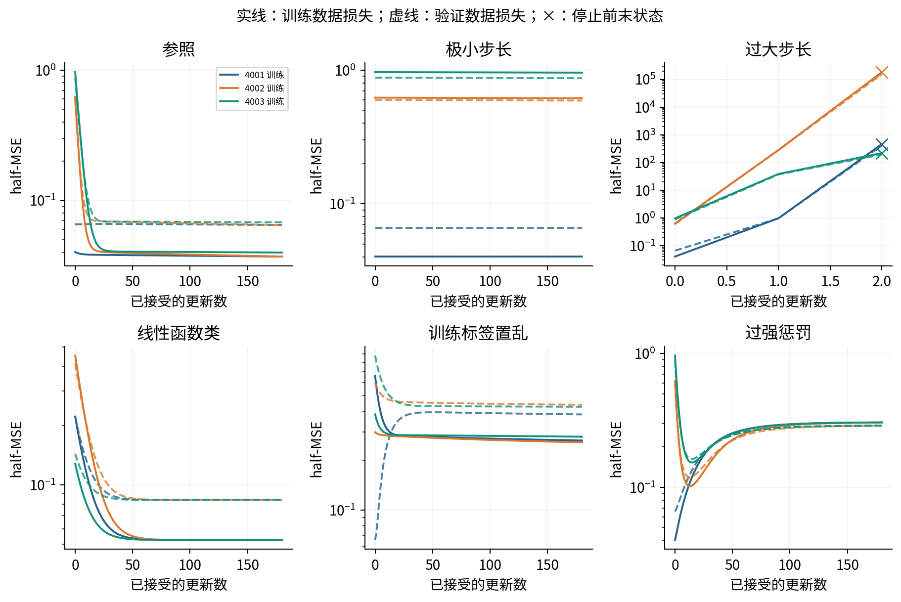

极小步长下，种子4002和4003几乎未学到足够好的函数；但4001初始状态已偶然较好，180步验证损失约0.06577，接近参照0.06484。不能只挑4002的曲线来宣称“小步长必然表现差”。线性模型三个种子最终验证损失都约0.08406；强惩罚条件约0.288。

失稳条件的拟议第3次更新使目标超过预设$10^6$上限，被拒绝提交。文件保留当前参数、拟议参数、拟议目标与已接受步数。它们不是收敛者，也不是丢失文件。总训练51次中有3次此类停止，其余48次完成各自固定预算。

## 8 诊断指标也需要反例

常见经验是tanh饱和会压小某些局部导数。但“存在饱和单元”不推出“整个任务训练失败”。本实验把标准化输入乘50后，初始化饱和比例确实升高；三个种子的验证损失却约0.04712、0.04509、0.04498，都低于参照。

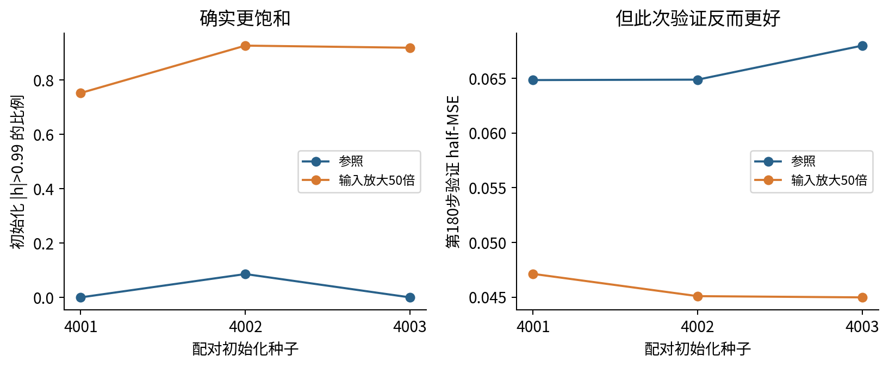

这不证明大尺度输入普遍有益。这里是一维有限任务，输出层仍可改变组合，近似门形的特征可能更贴近这份数据，隐藏权重也并非全部完全失去梯度。要区分这些解释，还需冻结特征、仅训输出层、改变目标形状等新的计划。主搜索空间未包含输入尺度，不能在看见这张图后把该诊断条件偷偷放入最终获胜者。

同样，梯度范数大不直接等于更新过大，因为更新还取决于学习率与优化器。可记录

$$
\rho_t=\frac{\|\Delta\theta_t\|_2}{\|\theta_t\|_2+\epsilon},\qquad\epsilon=10^{-12}.
$$

分母的$\epsilon$只防止零除。本讲SGD的$\Delta\theta=-\eta\nabla J$，所以该量能直接核查。但它对参数化和层尺度敏感，不存在本讲已经证明的通用“安全阈值”。有些层参数接近0会放大比值；全模型范数还可能遮住小层的异常。

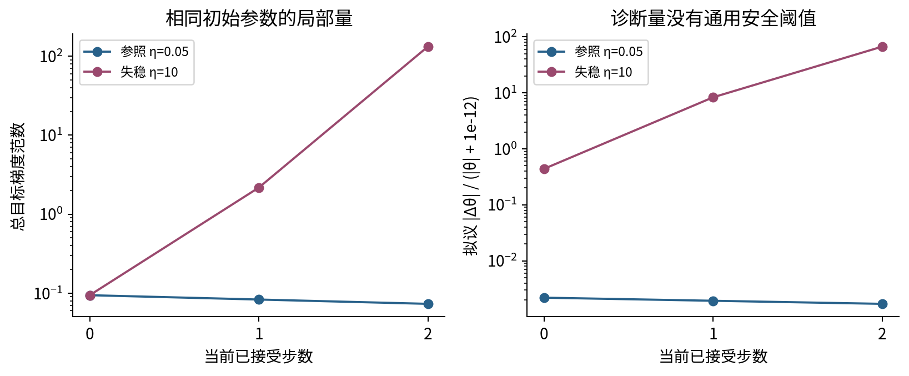

## 9 小批次拟合和过拟合各自能说明什么

最小调试探针取训练集前8例，16个tanh单元，$\lambda=0$，$\eta=0.1$，固定800步。完整标签训练损失从初值下降到约0.002642；固定置乱标签下降到约0.083834，没有接近0。置乱改变的是$x$与训练标签的对应，不是把验证/测试标签也一起改掉。

随机标签未拟合，可能由样本位置、函数类、初始化、条件数、优化预算或实现问题共同造成。已通过梯度核验也只排除所测计算错误。不能把“随机标签没到零”直接当成程序有bug，更不能增删样本或偷偷增加预算，把期望中的成功图做出来。若需要继续诊断，应明确写出下一项受控干预。

另一个独立教学探针使用前16例、32单元、2500步、无惩罚。它用于观察训练历程，不与主搜索混为同预算方法排名。验证损失在216步最低约0.056171，最终约0.060679；最终训练损失约0.011308。继续拟合训练集并未继续改善这份验证集。

要评价一种早停策略，应在验证集选择停止规则和恢复的参数，再用独立评价评估整个策略。不能把验证最小值既当选择依据又当无偏成绩。若需要研究随新训练数据变化的性能，应重做训练与选择，而不是只在固定模型上重采样测试行。

## 10 将调参写成一个有限算法

主计划仅搜索$\eta\in\{0.01,0.05,0.2\}$与$\lambda\in\{0,0.001,0.01\}$的9个组合，每组合3个配对初始化，每次180次全批次更新。所有配置宽度都为8，其余协议相同。总计27次运行、4860次被接受的更新，训练更新样本呈现数为$4860\times48=233280$。

这里“样本呈现数”只统计被接受更新所用的训练样本，不包含验证前向、拒绝的候选前向、日志计算或绘图。它不是总浮点运算数，也不是耗时。诊断21次运行、小批次2次和过拟合1次另列预算；不能把它们从总实验成本中抹去，也不能声称不同宽度等步数就等计算量。

选择规则是：取各配置第180步验证half-MSE的3种子算术平均，越小越好；任一种子未完成则该配置不可参选；同分按协议列出的先后顺序。这个规则选的是一个配置，不是最好种子。若全部配置失败，程序报错而不是挑最后一个幸存文件。

固定参照为$\eta=0.05,\lambda=0.001$。最后选择$\eta=0.2,\lambda=0$，验证均值从参照0.065901降至0.061972。这个差值来自同一验证集上的选择过程，不能直接作为未见总体改进的无偏估计。

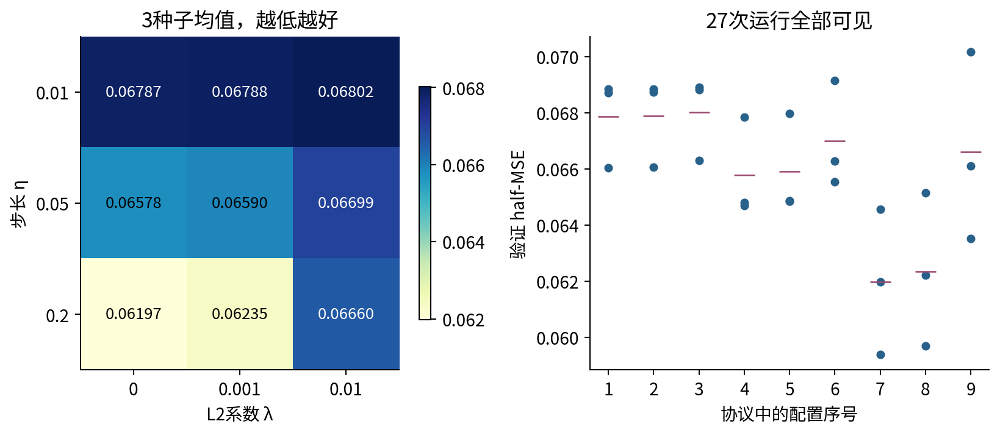

计划文件在每次运行前核验SHA，包含搜索集合、种子、预算、停止上限、选择规则和最终比较对象。它是冻结的可复现教学协议，不声称拥有外部时间戳的科研预注册。现实探索如果已经看过很多验证结果，应如实记录探索历史；把后来决定的规则写进JSON，不能追溯消除已发生的选择。

## 11 单因素比较与完整网格回答不同的问题

获胜者与参照同时改变了$\eta$和$\lambda$，所以最终差值不能全部归因于“增大学习率”。本讲自动列出网格里全部12组相邻取值的单因素比较：固定每个$\lambda$比较相邻学习率，固定每个$\eta$比较相邻惩罚。每对都按初始化种子相减，差值定义为“后者验证损失减前者”。

例如固定$\lambda=0.001$，把步长从0.05改为0.2，三个配对差分别约为$-0.00262451,-0.00518893,-0.00284079$，平均约$-0.00355141$。这支持“在当前数据、180步预算及三个初值下，这项单因素改变使验证损失下降”。它不支持任意学习率越大越好，也不是对任意数据集的统计保证。

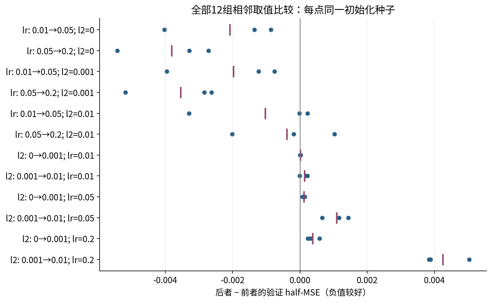

逐一改变因素有助于排除某些混杂，却不意味着因素没有交互。一个学习率在弱惩罚下有效，在强惩罚下可能不再有效。完整网格能观察这类依赖，代价是计算数随维度增加。若每轴$m$个值、$d$个维度，完整网格需要$m^d$组配置；配对种子再乘相应重复数。

正值超参数跨几个数量级时，可以令$u\sim U[\log a,\log b]$，再取$\eta=e^u$；在这个指定分布下，各等比区间得到相同概率。$0$不能取对数，因此无惩罚的$\lambda=0$须作为单独候选。若目标良好区域在搜索分布中的概率为$p$，$B$次独立随机候选至少命中一次的概率是$1-(1-p)^B$。这依赖候选独立且区域固定；不是随机搜索必胜的定理。

Bergstra与Bengio的一手研究说明，少数超参数主导表现时，随机搜索在重要方向上常能探索更多不同取值。本讲仍用二维小网格，因为它便于完整展示交互与每个相邻对照；没有用一个网格实验冒充验证了随机搜索优势。[S2]

## 12 验证集为什么也会被过拟合

最简单的精确反例不需要训练网络。假设$K$个候选本来都一样好：对独立未来样本，错误概率均为$1/2$。每个候选只用一个验证样本计0或1错误，而且为了这个反例，假设各候选验证错误彼此独立。挑验证错误最小者时，只有$K$个都错，最小错误才是1。因此

$$
E[\min_k\widehat R_k]=(1/2)^K,
$$

而被挑中者在独立新样本上的错误概率仍是$1/2$。$K=2$时，验证最小误差期望0.25，看起来优于0.5；其实没有任何候选变强。$K=8$时验证期望只有1/256。这里候选错误独立是特设条件，真实模型往往相关，不能直接套这个数值公式。

另一项模拟令所有候选真分数都为1，验证测量和独立审计各加独立$N(0,0.1^2)$噪声。固定2000次重复，比较$K=1,4,16,64$。候选越多，验证赢家越容易带着有利的测量噪声；独立审计均值仍在1附近。它是分数噪声机制实验，不是2000次神经网络训练。

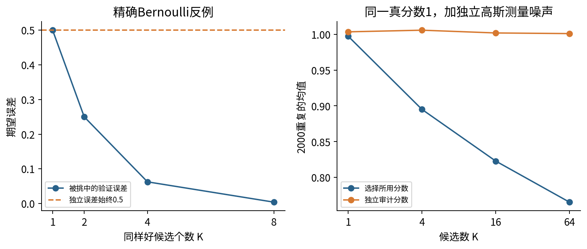

Cawley与Talbot研究了模型选择层面的过拟合及评价偏差。实际公平比较应把调参流程视为拟合算法的一部分；嵌套交叉验证的外层每次都要重新完成内层选择，而不是先用全数据调好参数，再把数据重新分成所谓“未见”测试折。[S1]

主实验采用一次独立测试集，但这也有使用条件：看完测试结果后不能继续按它挑设置；若现实工作确实这样做了，必须承认它已参与开发，并重新安排新的评价来源。给验证赢家加一个普通验证bootstrap区间，不会自动修复选择偏差。

## 13 冻结选择后的最终比较

部署对象预先规定为同一配置下3个种子模型的预测均值。注意，“先平均预测再算平方损失”与“先算3个模型损失再平均”一般不相等；本讲选择时用后者的验证分数，最终部署报告则针对前者，明确写出差别，不混用。当前选择规则不保证让集成验证损失最小；若要优化集成的验证表现，应在运行前另行规定用集成预测选择的规则。

在选择固定后，脚本才把测试标签交给final_evaluate。该函数只比较参照集成、选出集成，以及预先列出的训练均值常数和训练最小二乘直线。search的参数中没有test对象；执行记录显示先完成选择，再完成诊断，最后做固定测试比较。文件哈希校验可以提前读取测试文件字节，但不使用测试标签计算选择分数。

|固定最终对象|测试half-MSE|测试RMSE|
|---|---:|---:|
|参照：$\eta=0.05,\lambda=0.001$的3模型均值|0.05093144|0.31915965|
|选出：$\eta=0.2,\lambda=0$的3模型均值|0.04840490|0.31114274|
|训练集拟合的最小二乘直线|0.06533719|0.36148910|
|训练标签均值常数|0.31226708|0.79027474|

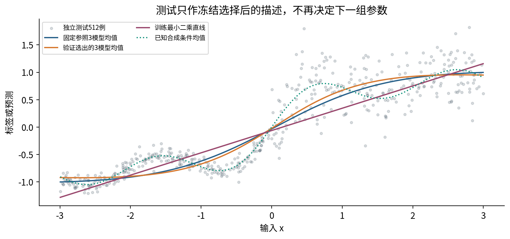

test.csv公开后，任何读者都能看见标签；代码顺序和协议可以证明默认脚本没有用它做选择，不能物理阻止后来的人反复调参。科研报告应区分可审查的流程约束与真正封存的数据治理。

## 14 分组误差和区间应支持什么结论

测试左组269例，右组243例。选出集成的half-MSE分别约0.024304与0.075085；参照分别约0.025269与0.079340。右组较大误差的一部分可由更大的条件噪声解释：若条件均值完全已知，左右组的理论不可约half-MSE分别为$0.1^2/2=0.005$和$0.35^2/2=0.06125$。模型实际误差还含估计和近似因素；有限样本的观测误差不会恰好等于期望。

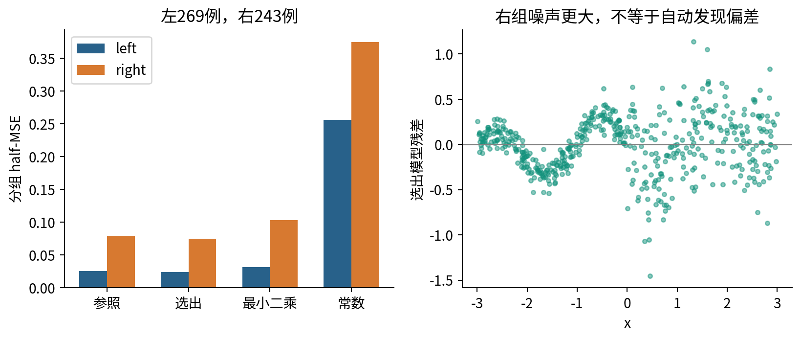

对每个测试ID$i$，定义配对差

$$
d_i=\frac{(\widehat y_{i,\rm selected}-y_i)^2-(\widehat y_{i,\rm baseline}-y_i)^2}{2}.
$$

每次有放回抽512个测试ID，用同一批ID同时取两种预测，计算平均差。固定种子4091重复2000次，用2.5%与97.5%分位数形成百分位bootstrap区间。平均差为$-0.00252654$，区间约$[-0.00417487,-0.00100847]$。

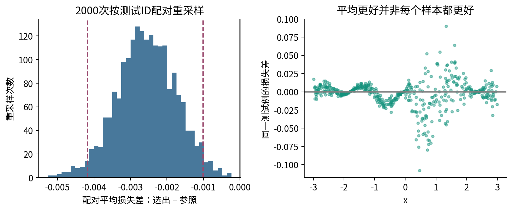

本生成器的测试行是独立抽样，因此以行作为重采样单位有明确依据。若多行来自同一人、同一设备或同一时间序列，应依022重新考虑独立单位，不能照搬按行bootstrap。3个初始化种子的变化也不是512个测试例的抽样变化，两种不确定性来源不能靠混在一张表里解决。

## 15 从日志写出下一次实验

一次好的诊断记录应包括原始现象、至少两个解释、区分它们的实验、固定项、改变项、预算、失败规则和结论边界。比如“步长很小的某些初值验证差”对应优化不足与坏初始表示两种解释；保持同一初值，比较全部相邻学习率对照，比换一个幸运种子更能区分它们。

本次没有证明饱和改善的机制，也没有证明随机标签探针的唯一失败原因；这些是清楚保留下来的开放问题。若接着研究输入尺度，应建立新的开发计划，不能再拿已经用过的512例测试来证明新结论。若要比较训练成本，应真正测量统一环境下的耗时和资源，不能把更新计数直接改名为效率。

学习到这里，应能在041迁移学习中提出更严格的问题：冻结表示是否限制了可达函数；微调是否只是增加了预算；源任务是否提供了适合目标任务的特征。040提供的是形成证据的方式，而不是一个永远正确的调参顺序。

## 16 阅读核验与练习

先独立重算两轮七参数链，再运行实验。检查任意一个训练状态的参数、目标和下一步更新是否一致；查找3次失败的停止原因；核对全部12组单因素比较，找出一个正差值；解释为什么输入饱和的反例不能被删。最后用自己的话写出bootstrap区间覆盖和不覆盖的随机性。

单独实验指南给出运行、数据和文件字段；详解逐题展示推导与数值。所有曲线均由已保存的实际运行生成，没有用预设形状替代训练。主要来源为S1模型选择偏差、S2随机搜索、S3神经网络调试建议与S4官方SGD语义；具体查阅位置与适用边界见sources.md。
