# 041 迁移学习与适配

预训练模型交给我们的是一组参数，以及这些参数保留和丢弃信息的方式。它并没有证明这些信息适合新任务。本讲沿着一个问题展开：当目标标签很少时，我们该保留旧表示、缓慢修改它，还是重新学习？结论必须依赖任务、标签、初始化、优化预算和评价分布，而不能只依赖“用了预训练”这个名称。

先修为第036讲归一化与训练推理状态、第040讲训练诊断与调参实验。读者应能计算一个小网络的梯度，区分训练和验证。我们仍从一个输入、一个表示、一个预测重新定义符号，手算同一批两条数据的完整更新，再运行一个只需CPU、没有外部权重下载的研究练习。后续第059讲讨论表示如何在没有人工标签时学习；L1才进一步展开语言模型的参数高效适配。

## 1 迁移的对象究竟是什么

把预测器拆成表示函数 $h=f_\theta(x)$ 和任务头 $\hat y=g_\phi(h)$。输入 $x\in\mathbb R^d$ 可以是数值特征、图像或词元编码；表示 $h\in\mathbb R^k$ 是中间结果；$\theta$ 是表示参数，$\phi$ 是任务头参数。任务头不一定是分类器。本讲使用回归，使每个误差项都能直接核验。

源任务先用源训练集得到 $\theta_S,\phi_S$。迁移时通常复制 $\theta_S$，重新拟合或初始化目标任务头。旧头的输出坐标有源任务的含义，不能仅因输出维数相同就认定标签意义相同。目标模型的可训练参数集合是实验设计的一部分。

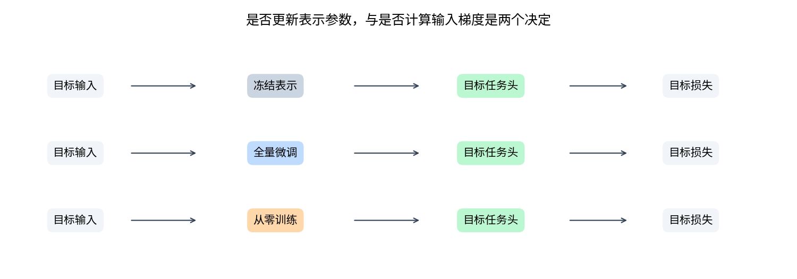

**冻结和线性探测。** 冻结是参数不更新的约束。在线性探测中，固定表示后只训练仿射头 $g_\phi(h)=w^\top h+b$。头相对于表示是线性的，输入到输出仍可以是非线性的。冻结表示后接一个多层非线性头也属于冻结迁移，但不能再称线性探测。

**全量微调。** 以预训练参数为初值，在目标损失下更新表示和头。它改变了可用特征，也引入更大的优化空间。全量描述的是哪些参数允许变化，并不要求它们采用相同步长。

**部分微调。** 只解冻最后几个表示层，是约束强度的一种选择。它需要重新核对优化器参数组、归一化状态和缓存特征是否过期。我们的小网络只有一个表示层，因此实验直接比较全冻结和全解冻，不伪造逐层解冻的证据。

## 2 域变化与任务变化分别问什么

以联合分布 $P(X,Y)$ 表示数据问题。域通常包含输入空间及其分布；任务包含输出语义和预测规则。若输入空间相同，$P_S(X)\ne P_T(X)$ 而 $P_S(Y\mid X)=P_T(Y\mid X)$，这是常见的协变量移位特例。一般域移位并不保证条件分布不变。若从预测温度改为预测故障，或标签规则从输入的第一方向改为第二方向，则任务已经改变。

这两件事可能同时发生。本讲源输入的两个坐标独立均匀分布于 $[-2,2]$。目标输入的第一坐标改为 $[-1.5,2]$，第二坐标仍为 $[-2,2]$。相关目标保持源标签规则；正交目标改用第二个坐标生成标签。相关与正交目标共享完全相同的输入记录，因此二者之间的差异是任务变化，不能解释成输入域又变了一次。

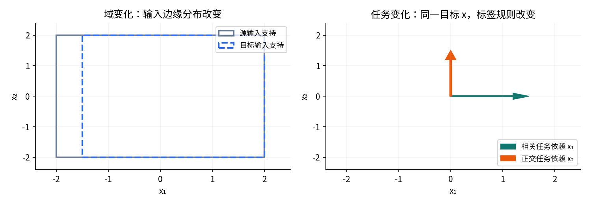

**负迁移是一个比较结论。** 固定目标评价风险 $R_T$、数据和训练协议，以从零学习为对照，定义差值

$$\Delta=R_T(\text{指定迁移方法})-R_T(\text{指定从零方法}).$$

风险越低越好时，$\Delta>0$ 表示该比较中的负迁移。不能省略“指定方法”：冻结失败不代表所有微调失败；某个小学习率失败不代表预训练参数永远无法修复。测试分数的差还可能来自抽样误差、选择偏差或优化不足。本讲保留配对种子的每个差值，不把三次初始化说成三个独立世界。

## 3 表示保留什么比参数来自哪里更重要

假设表示只保留 $h=\tanh(1.2x_1)$。预测依赖 $x_1$ 的目标时，它很合适；目标依赖独立的 $x_2$ 时，知道 $h$ 并不能恢复 $x_2$。即使任务头容量无限，也不能从相同表示中区分两个不同目标。

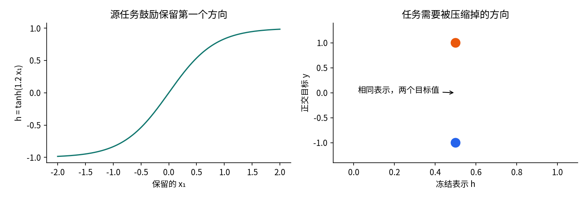

对于平方误差，在相关条件期望和二阶矩存在时，对任意只看 $H$ 的预测器 $q(H)$ 有分解

$$\mathbb E[(Y-q(H))^2]=\mathbb E[\operatorname{Var}(Y\mid H)]+\mathbb E[(\mathbb E[Y\mid H]-q(H))^2].$$

证明从 $Y-q=(Y-\mathbb E[Y\mid H])+(\mathbb E[Y\mid H]-q)$ 展开平方开始。交叉项对 $H$ 条件求期望为零，因为第一项的条件均值为零。第一项因此是给定表示时任何任务头都无法消除的误差；第二项才是头拟合不足。这里不要求神经网络训练达到这个最优值。

若 $H$ 仅依赖 $X_1$，$X_2$ 与 $X_1$ 独立，且目标是 $Y=\tanh(1.2X_2)+\epsilon$，独立噪声均值为零，那么最优表示预测器就是常数 $\mathbb E[Y]$。实际预训练的 $a_2$ 并非精确为零，所以此反例解释风险来源，不是对实际有限模型给出精确误差下界。冻结一个任务头的表现也不能直接测出互信息。

迁移研究的经典实验区分了特征的任务专用性和层间共同适应被拆开后的优化困难。它们提供了提出对照的动机，而不是任何模型都“底层通用、上层无用”的定律。见Yosinski等论文的第1至2节，本讲没有复现其ImageNet实验。[S1]

## 4 一个五参数模型把冻结说清楚

本讲所有神经实验采用同一个结构：

$$z_i=a_1x_{i1}+a_2x_{i2}+c,\qquad h_i=\tanh z_i,\qquad \hat y_i=vh_i+b.$$

表示参数 $\theta=(a_1,a_2,c)$ 有三个数，头参数 $\phi=(v,b)$ 有两个数。批量输入 $X$ 为 $N\times2$，$z,h,\hat y,y$ 均为长度 $N$ 的向量，损失必须归约成标量。所有输入、标签和参数在此合成问题中没有物理单位。

$$\ell_i=\tfrac12(\hat y_i-y_i)^2,\qquad L=\frac1N\sum_{i=1}^N\ell_i.$$

这里报告的测试MSE是 $2L$，不要把训练中半平方误差的数值和MSE直接混用。参数更新对 $L$ 求导；一旦改成直接优化MSE，相同步长的实际更新会扩大一倍。

令 $e_i=\hat y_i-y_i$，$q_i=e_i/N$。链式法则把输入、表示和参数连接起来：

$$d_i=\frac{\partial L}{\partial z_i}=q_i v(1-h_i^2).$$

$$\frac{\partial L}{\partial a_j}=\sum_i d_i x_{ij},\quad \frac{\partial L}{\partial c}=\sum_i d_i,\quad \frac{\partial L}{\partial v}=\sum_i q_i h_i,\quad \frac{\partial L}{\partial b}=\sum_i q_i.$$

输入梯度同样有意义：$\partial L/\partial x_{ij}=d_i a_j$。它可以传给更早的可训练模块，也可用于输入敏感度分析。一个参数被固定，并不会让函数对其输入的数学导数自动变成零。

## 5 同一批两样本的完整前向

取 $k=\operatorname{atanh}(0.5)=\log(3)/2$，旧参数为 $a_1=k,a_2=-k,c=0,v=2,b=0.1$。两条样本分别为 $x_1=(1,0),y_1=1$ 和 $x_2=(0,1),y_2=-0.4$。这组数只是手算例，与后面随机生成的研究数据分开。

| 样本 | $z_i$ | $h_i$ | $\hat y_i$ | $e_i$ | $\ell_i$ |
|---|---:|---:|---:|---:|---:|
| 1 | $k$ | 0.5 | 1.1 | 0.1 | 0.005 |
| 2 | $-k$ | -0.5 | -0.9 | -0.5 | 0.125 |

逐项过程为 $z_1=k\times1-k\times0+0=k$、$z_2=k\times0-k\times1+0=-k$；再计算双曲正切，乘以旧 $v=2$，加上旧 $b=0.1$。标量损失为 $L=(0.005+0.125)/2=0.065$。不是先平均残差再平方：平均残差是 $-0.2$，其半平方 $0.02$ 是另一个目标。

## 6 每条局部导数和每个参数贡献

所有局部导数在同一套旧参数上求值。下表列齐计算图的边，包括需要输入梯度时的两条输入边。

| 局部导数 | 样本1 | 样本2 |
|---|---:|---:|
| $\partial L/\partial\ell_i$ | 0.5 | 0.5 |
| $\partial\ell_i/\partial\hat y_i$ | 0.1 | -0.5 |
| $\partial\hat y_i/\partial v=h_i$ | 0.5 | -0.5 |
| $\partial\hat y_i/\partial b$ | 1 | 1 |
| $\partial\hat y_i/\partial h_i=v$ | 2 | 2 |
| $\partial h_i/\partial z_i=1-h_i^2$ | 0.75 | 0.75 |
| $\partial z_i/\partial a_1=x_{i1}$ | 1 | 0 |
| $\partial z_i/\partial a_2=x_{i2}$ | 0 | 1 |
| $\partial z_i/\partial c$ | 1 | 1 |
| $\partial z_i/\partial x_{i1}=a_1$ | $k$ | $k$ |
| $\partial z_i/\partial x_{i2}=a_2$ | $-k$ | $-k$ |

于是 $q=(0.05,-0.25)$，$d=(0.075,-0.375)$。例如样本2对 $a_2$ 的贡献是 $0.5\times(-0.5)\times2\times0.75\times1=-0.375$；它对 $a_1$ 的贡献最后乘了 $x_{21}=0$，所以为零。零来自这条输入，不代表 $a_1$ 没有连接到损失。

| 贡献来源 | $a_1$ | $a_2$ | $c$ | $v$ | $b$ |
|---|---:|---:|---:|---:|---:|
| 样本1的 $\ell_1/2$ | 0.075 | 0 | 0.075 | 0.025 | 0.05 |
| 样本2的 $\ell_2/2$ | 0 | -0.375 | -0.375 | 0.125 | -0.25 |
| 两样本相加 | 0.075 | -0.375 | -0.300 | 0.150 | -0.200 |

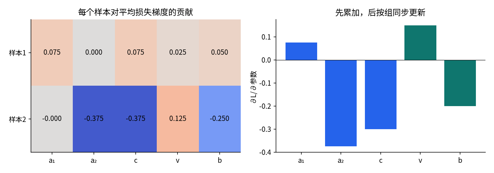

输入梯度的两行分别为 $(0.075k,-0.075k)$ 和 $(-0.375k,0.375k)$，数值约为 $(0.04119796,-0.04119796)$ 和 $(-0.20598980,0.20598980)$。它们对输入的导数仍带平均因子 $1/2$。若逐样本损失单独反传，结果会大一倍。

## 7 同步更新和下一轮完整前向

设表示学习率 $\eta_\theta=0.1$，头学习率 $\eta_\phi=0.2$。同步更新要求右侧梯度都来自旧参数：

$$a_1'=k-0.0075,\quad a_2'=-k+0.0375,\quad c'=0.03,\quad v'=1.97,\quad b'=0.14.$$

不能先改 $v$，再把新 $v$ 填入旧批次的表示梯度；那是另一种更新规则。新一轮必须重新计算每一条路径：

$$z_1'=a_1'+c'=k+0.0225,\qquad z_2'=a_2'+c'=-k+0.0675.$$

$$h_i'=\tanh z_i',\qquad\hat y_i'=1.97h_i'+0.14,\quad e_i'=\hat y_i'-y_i,\quad\ell_i'=\tfrac12(e_i')^2.$$

| 样本 | 新 $z$ | 新 $h$ | 新预测 | 新残差 | 新半平方损失 |
|---|---:|---:|---:|---:|---:|
| 1 | 0.571806144 | 0.516684484 | 1.157868434 | 0.157868434 | 0.012461221 |
| 2 | -0.481806144 | -0.447688925 | -0.741947181 | -0.341947181 | 0.058463937 |

新标量损失为 $L'=0.035462579$。展示的小数经过四舍五入；程序用float64原值继续计算。

冻结表示的对照从同一套旧参数出发，只更新 $v,b$；不是在已经微调的表示上再冻结。此时 $z=(k,-k)$，$h=(0.5,-0.5)$，新预测为 $(1.125,-0.845)$，残差为 $(0.125,-0.445)$，逐样本半平方损失为 $(0.0078125,0.0990125)$，平均为 $0.0534125$。第一条样本损失变大，但批量平均下降，这和总梯度优化的目标一致。

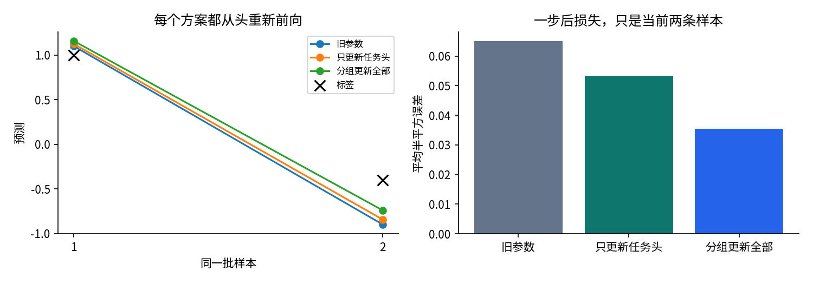

代码还在两个更新后参数点重新生成全部局部导数和所有参数贡献，并与PyTorch逐样本反传、独立标量中心差分核对。这样检查的是一段可继续运行的学习过程，而不是仅凑出一个正确的梯度数字。

## 8 冻结为什么不同于切断计算图

把 $a_1,a_2,c$ 固定，意味着不把它们当作本次需要优化的自由变量。函数 $h=\tanh(a_1x_1+a_2x_2+c)$ 对 $x$ 仍可微。如果 $x$ 来自更早的可训练模块，反向信号必须穿过固定层，才能更新更早的模块。

在PyTorch中，设置表示参数的 `requires_grad_(False)` 阻止这些叶参数累积梯度。输入若要求梯度，相关运算仍进入计算图，输入梯度继续存在。若输入和表示参数都不要求梯度，表示分支便通常没有需要记录的反向路径，任务头仍可训练。第028讲的计算图规则在此并未改变。[S2]

`h.detach()` 返回脱离原计算图的张量；它保留数值，却切断从该张量回到原输入的路径。把表示前向包进 `torch.no_grad()` 也不记录该前向路径。两者都可能适合纯冻结特征提取，但不适合需要穿过冻结模块训练前置适配器的情形。detach结果和原张量共享存储，所以脱离梯度不等于独立的数据副本。[S2,S4]

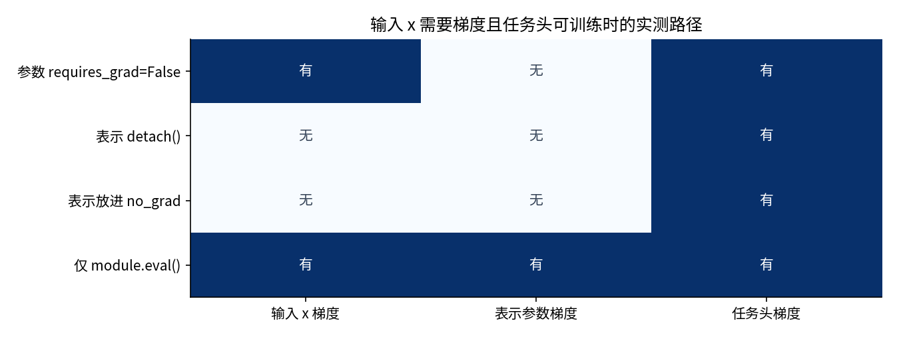

`eval()` 控制模块的训练推理行为，独立于是否求导。BatchNorm的可学习仿射参数和运行均值方差属于不同状态：冻结参数不自动冻结缓冲区。单元测试在参数全部冻结后运行一次训练态BatchNorm，验证运行均值确实改变；切换eval后再前向，运行均值不再更新。这是第036讲在迁移中的直接应用。[S2]

还要检查优化器的旧状态。如果曾经累积过梯度，后来才冻结参数，旧 `.grad` 可能仍然留着；动量和权重衰减也可能让粗心的更新逻辑产生变化。稳妥做法是清空旧梯度，并只把当前可训练参数交给新优化器，或明确管理现有参数组。本讲主实验的冻结探测采用闭式岭解，根本不对表示参数执行优化器更新。

## 9 分组学习率不是免费的保护罩

一般形式为

$$\theta_{t+1}=\theta_t-\eta_\theta\nabla_\theta L_T,\qquad\phi_{t+1}=\phi_t-\eta_\phi\nabla_\phi L_T.$$

直观上，较小表示步长保守地改动旧特征，较大头步长让新输出语义更快适应。这是一种待检验的偏好，不是保证。目标需要完全不同方向时，过小表示步长可能使有限预算内无法完成旋转。

PyTorch参数组允许为表示和头指定不同学习率；没有覆盖的选项使用优化器默认值。[S3] 本讲每个参数只出现在一个组，采用无动量SGD，因此下面的设置恰好对应上述方程：

```python
optimizer = torch.optim.SGD([
    {"params": [backbone], "lr": head_lr * 0.1},
    {"params": [head], "lr": head_lr},
])
```

注意表示梯度含因子 $v$。若线性探测在无用表示上把头斜率拟合得接近零，接着采用很小表示学习率时，表示获得的梯度也会很小。小步长、任务不匹配和头初始化可以相互作用。仅观察损失平台不能唯一判定“信息不可恢复”，还要看参数能否更新、梯度大小和更强优化对照。

本讲的LPFT表示先做线性探测，再全量微调。我们固定它的表示步长为头的十分之一；实验只评价这个具体方案。不能把该方案失败写成所有探测后微调策略都失败，也没有复现任何大模型LPFT论文。

## 10 数据来源和不可跨越的评价边界

全部数据原创合成，不使用任何预训练模型下载、付费API、用户资料或第三方图像。源标签为 $y_S=\tanh(1.2x_1)+\epsilon$；相关目标用同一公式，正交目标为 $y_T=\tanh(1.2x_2)+\epsilon$。噪声为独立的 $\mathcal N(0,0.08^2)$。每条目标输入同时具有两种标签，并共享该条记录的噪声，方便任务规则的配对对照；它不是两个独立采样的数据集。

| 数据角色 | 记录数 | 可以做什么 | 不能做什么 |
|---|---:|---|---|
| 源训练 | 512 | 每种子训练600步表示 | 读取目标标签选择源权重 |
| 目标训练池 | 64 | 用前16或全部64条拟合候选 | 把未使用的48条混入16条实验 |
| 目标验证 | 128 | 每方法从3个候选选最低最终MSE | 作为独立测试证据 |
| 目标测试 | 512 | 所有选择冻结后统一评价 | 反过来改学习率、步数或方法 |

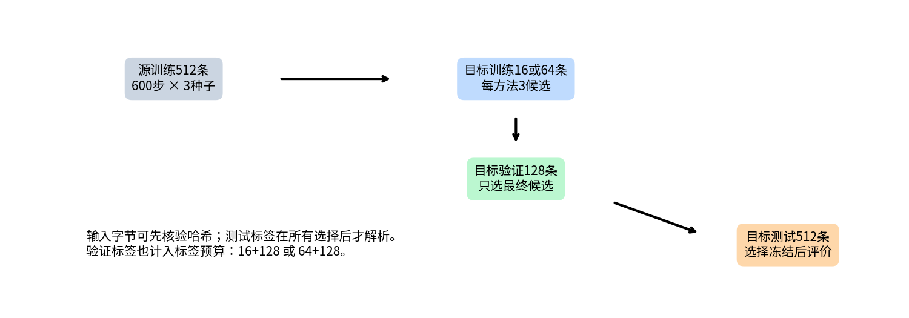

原始记录有分割前缀ID，四个固定随机种子生成四份文件。加载时先核验所有文件字节的SHA-256；但测试标签直到全部目标候选完成训练、全部验证选择冻结后才解析。读哈希不等于读取标签做选择。代码顺序可审计，也有中断测试核查；这不是加密访问控制，读者仍可以自行打开公开测试文件。

研究开始前固定两任务、两标签量、三个初始化种子11、23、37、源训练600步、目标候选160步、学习率网格和岭惩罚网格。数据生成公式、模型结构和预算本身是教学设计，不是对未知真实任务的盲测。当前测试已公开展示，若据此修改方案，必须使用新的未见测试数据评价下一项主张。

## 11 七种方法怎样构成有力对照

每个神经模型都是相同的五参数结构。每个种子先由固定NumPy生成器初始化 $a_1,a_2\sim\mathcal N(0,0.3^2)$，$c=0,v=1,b=0$。源模型训练后只复制三个表示参数，普通微调的头重置为 $v=1,b=0$。从零方法使用该种子的原始表示参数，同样的头初值。三个种子只改变初始化，数据和全批次顺序不变。

| 方法 | 目标初始化与训练 | 每组候选 |
|---|---|---:|
| 从零 scratch | 五参数全训练，表示与头等步长 | 3个学习率 |
| 随机冻结 random_probe | 固定未训练表示，拟合仿射头 | 3个岭惩罚 |
| 预训练冻结 pretrained_probe | 固定源表示，拟合仿射头 | 3个岭惩罚 |
| 小步微调 finetune_small | 复制表示，表示步长为头的0.1倍 | 3个学习率 |
| 等步微调 finetune_equal | 复制表示，两组相同步长 | 3个学习率 |
| 探测后微调 lpft | 固定惩罚0.0001先拟合头，再按0.1倍率微调 | 3个学习率 |
| RBF岭 rbf_ridge | 固定二维25个径向基加截距，直接用原输入 | 3个岭惩罚 |

学习率候选为0.03、0.1、0.3，岭惩罚候选为0.0001、0.01、0.1。固定特征矩阵为 $\Phi$ 时，岭目标是

$$J(\beta)=\frac{\|\Phi\beta-y\|^2}{2n}+\frac\lambda2\beta^\top D\beta,\qquad(\Phi^\top\Phi/n+\lambda D)\beta=\Phi^\top y/n,$$

其中 $D$ 除最后截距坐标为零外均为单位对角。线性探测只有两列：表示和全一向量。正惩罚与非空数据使本例正规方程可解；代码调用线性求解器，不显式求逆。闭式解避免把冻结失败归咎于没有把头训练好。

RBF使用固定 $5\times5$ 网格中心 $c_j\in[-2,2]^2$，特征为 $\exp(-\|x-c_j\|^2/2)$，另有截距，共26个头参数。它不使用源训练，具有更灵活的二维函数空间，是合理的非迁移基线；带宽没有搜索。它不保证胜过与生成函数结构恰好一致的五参数网络。应同时报告较强的从零神经基线，不能故意仅拿无用随机冻结作对照。

对每个方法、任务、标签量、种子，按验证集最终MSE选择候选，完全相同时选候选序号较小者。不以测试表现挑种子，不报告事后最好的某一轮，也不在验证选择后把验证标签加回训练。

## 12 预算必须分成几本账

总共有3次源训练、12个目标实验组合、84个方法结果、252个目标候选。144个神经候选每个160步，其余108个是闭式岭解。LPFT额外执行36次固定惩罚的初始化岭解，重复调用也如实计入，不隐藏在“初始化免费”里。

源预训练为1800次更新、921600次样本呈现。所有目标神经候选合计23040次更新、921600次样本呈现。两个总呈现数碰巧相同，不构成逐方法端到端等预算：源模型在多个目标场景之间共享，而从零方法不支付源成本。

对于一个指定任务和标签量，每个神经方法的三个候选共480次更新、$480n$ 次目标训练样本呈现。它们有相同目标更新数与数据使用量，但冻结和RBF使用闭式求解，计算量、墙钟、内存都不同。我们不声称严格FLOPs、时间或端到端成本匹配。主实验按更新预算比较神经适配；解析头基线回答“表示固定时，头拟合充分后仍能否解决问题”。

源训练采用固定600步，没有源验证或源测试，故不报告源任务泛化结论。测试共评估84个选定模型，每个512条，保存43008条预测。每个候选的逐步五参数、训练MSE、验证MSE和最终验证预测都被完整保留；不能只留选中的曲线。

## 13 实际结果同时保留成功和失败

下表是三个配对初始化的测试MSE均值。每一列的测试输入固定相同，任务规则和训练标签量按表头变化。更多有效数字、逐种子差和候选选择保存在结果文件。此处均值不是置信区间。

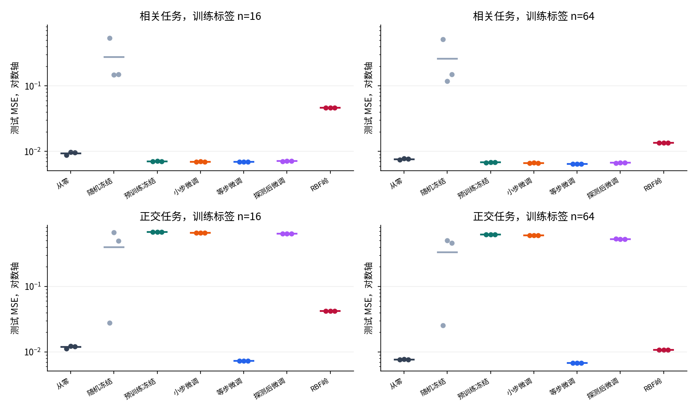

| 方法 | 相关 n16 | 相关 n64 | 正交 n16 | 正交 n64 |
|---|---:|---:|---:|---:|
| 从零 | 0.00941 | 0.00764 | 0.01193 | 0.00765 |
| 随机冻结 | 0.27763 | 0.26089 | 0.39819 | 0.33158 |
| 预训练冻结 | 0.00707 | 0.00682 | 0.68076 | 0.61644 |
| 小步微调 | 0.00698 | 0.00669 | 0.65790 | 0.59977 |
| 等步微调 | 0.00694 | 0.00646 | 0.00730 | 0.00680 |
| 探测后微调 | 0.00710 | 0.00669 | 0.63875 | 0.52694 |
| RBF岭 | 0.04642 | 0.01355 | 0.04225 | 0.01083 |

相关任务中，预训练表示保留了目标方向，冻结和微调均有较低误差。在正交任务的64条训练标签条件下，从零为0.00765，预训练冻结为0.61644，小步微调为0.59977，等步微调为0.00680。小步微调与从零采用相同结构、同一标签、相同候选数和160步预算，三个配对种子都存在较大的退化，这是具体有限协议下的真实负迁移。

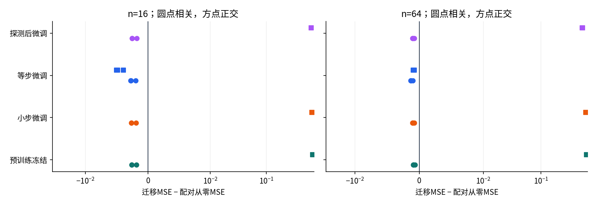

等步微调修复了这个表示方向，不能遗漏它。冻结失败更接近特征约束问题；小步微调失败还涉及有限优化预算。LPFT在当前小表示学习率方案下也没有完全恢复。三项失败并不足以断言任务不同就不应迁移。

## 14 从曲线回到梯度和表示

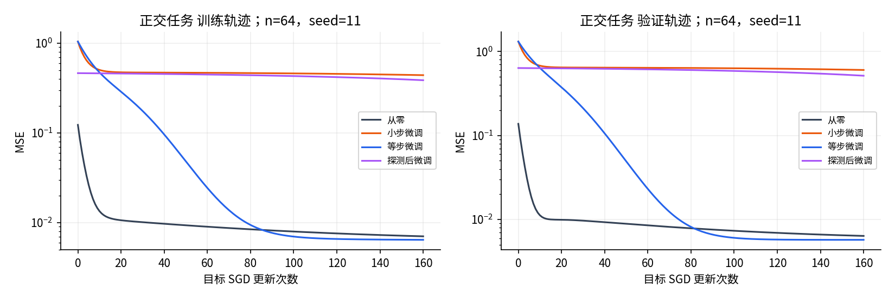

训练和验证一起停在高误差，首先提示优化或表示限制；不是典型“训练低而验证高”的过拟合形态。小步微调的表示可以更新，但160步内转动不足。等步微调的更新方向更快转向目标。这只是当前初始化、非线性、学习率网格和预算的机制证据。

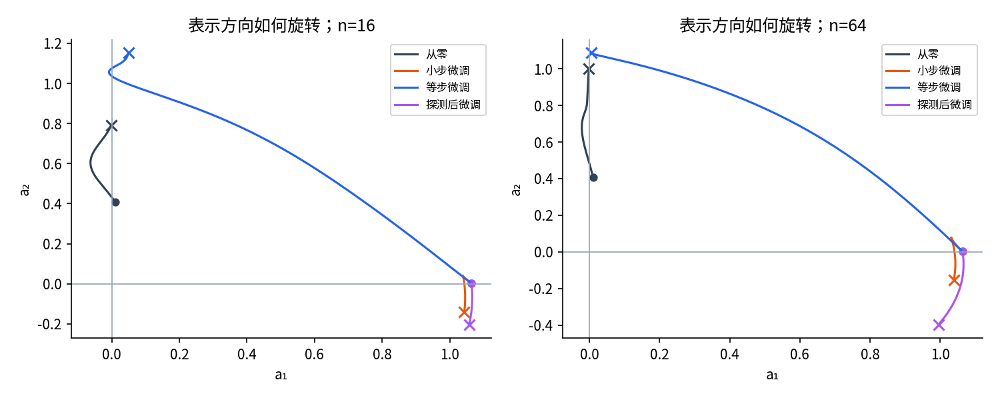

网络还存在参数符号对称性：同时把 $a_1,a_2,c,v$ 变号，输出保持不变。因此比较参数欧氏距离不等于比较函数差异。实际判断要结合表示和预测面，不能单凭权重“离预训练很近”就称知识保留。

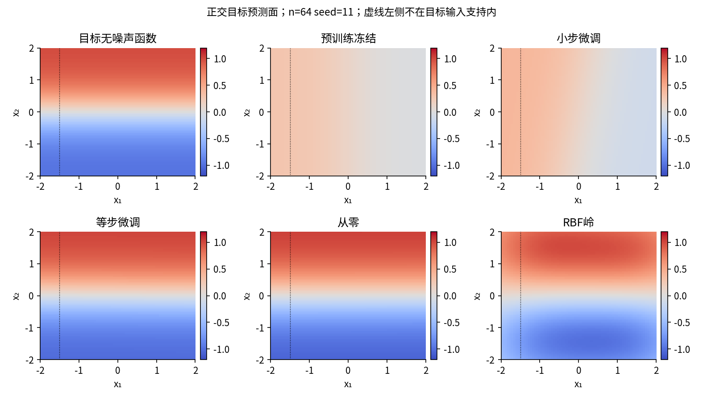

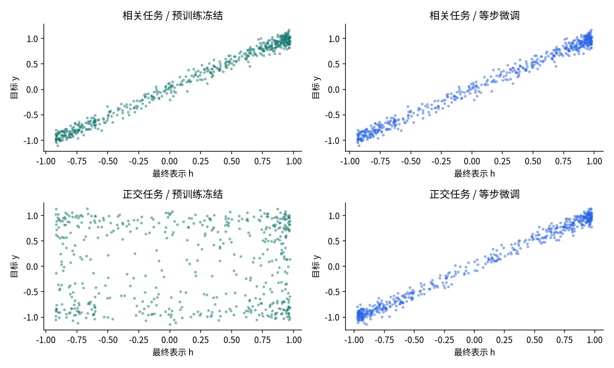

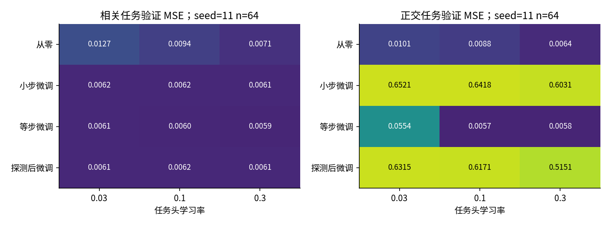

这里没有证明更长训练一定修复小步微调，也没有证明更大学习率普遍安全。下一项可检验假设是固定当前协议后，在新的开发与测试数据上联合扫描表示步长倍率和更新预算，并比较误差与成本的关系。先增加预算再宣称“同预算优势”是不成立的。

## 15 从小实验走向可信迁移研究

真实模型可能有数十亿参数、随机数据增强、类别不平衡、文本词表或图像归一化约定。应从以下顺序逐项建立证据，而不是直接全解冻。

1. 核查源权重来源、许可、训练数据已知范围和任务头语义。数据卡没有披露，不等于已经排除测试污染。
2. 保留从零基线与足够拟合的冻结头。统计总标签，尤其是验证、提示选择和人工反馈消耗的监督。
3. 固定目标拆分、选择规则和预算，使用配对种子；记录源成本、适配成本与搜索成本。
4. 单独检查参数梯度、参数值、优化器状态和归一化缓冲区。模型处于eval不代表已经冻结。
5. 查看训练、验证、分组误差和失败样本。测试集只给当前协议一次评价，不当成无限可用的导航仪。
6. 若任务目标变了，重新检查指标和代价。源准确率不是目标成功定义。

源数据与目标测试出现同一对象、近重复记录、同一患者或同一文档的不同片段，都可能制造虚假的迁移优势。对公开大规模权重，往往无法彻底排除未知预训练污染；应披露无法审计的部分，并使用时间切分、实体隔离或新收集测试等额外证据，不能写“零泄漏保证”。

本讲实验只有两维、五个神经参数、固定合成拆分和三个初始化，生成函数恰好落在神经假设类中。它支持“表示匹配和优化预算会改变迁移结论”，不支持真实视觉或语言任务的效果排名，不支持置信区间或显著性结论。GPU、新建Anaconda环境求解、Jupyter浏览器界面均未在此作者环境实测。

## 16 练习

1. 不看答案，重新算出两条样本对五个参数的贡献，解释为什么第一条样本的损失可以在冻结头更新后上升。
2. 若先更新 $v$ 再计算 $a_1$ 梯度，会得到什么不同结果？它为何不是本讲的同步SGD？
3. 已冻结中间层之前还有可训练输入适配器。选择requires_grad、detach、no_grad和eval时，分别会发生什么？
4. 推导固定表示平方损失的条件方差分解，并说明它不能直接给出实际预训练模型的精确测试误差。
5. 解释正交目标实验中哪部分是域变化，哪部分是任务变化。若输入分布完全不变，还能叫任务变化吗？
6. 写出岭头的正规方程，并说明为什么截距不惩罚。查验实际候选的正规方程残差。
7. 为“少量标签”写一份诚实的账本，计算16条训练标签的单神经方法搜索成本。
8. 用完整轨迹提出区分表示限制与优化不足的下一项实验。必须写清保留什么预算、改变什么预算、如何避免再次使用当前测试做选择。

具体操作见lab.pdf，逐题解答见answers.pdf。所有正文图为原创，由本单元代码和完整数值结果生成；原图与论文插图没有复用。来源范围和阅读记录见sources.md及source-checks.json。

## 来源索引

- S1 [Yosinski等 2014 官方论文](https://proceedings.neurips.cc/paper/5347-how-transferable-are-features-in-deep-neural-networks.pdf)，核查摘要与第1至2节
- S2 [PyTorch2.7自动微分机制](https://docs.pytorch.org/docs/2.7/notes/autograd.html)，核查计算图与局部梯度控制章节
- S3 [PyTorch2.7优化器](https://docs.pytorch.org/docs/2.7/optim.html)，核查构造、参数组与更新顺序
- S4 [PyTorch2.7 detach接口](https://docs.pytorch.org/docs/2.7/generated/torch.Tensor.detach.html)，核查完整短API正文

检查日期为2026-10-04。详细阅读范围和未读部分见sources.md。
