# 042 可靠神经网络阶段项目

把一个明确的问题，变成别人能重新计算、也能提出反驳的研究包。

## 1 从会训练走向会研究

前面各讲已经分别解释了风险、反向传播、优化、正则化和可信评价。这一讲不再增加一个听起来新颖的模型名字，而是把这些环节放进同一个问题：每个实体被测量的次数不同，直接对数据表的每一行平均，是否就是我们希望优化的目标？

这里的“实体”只是原创合成数据中的编号，可以帮助理解同一台设备、同一块材料或同一个模拟对象的重复测量；数据不代表任何真实个人或实际研究对象。部署问题先写清楚：遇到一个从未见过的新实体，在它的一次测量上预测连续目标。我们希望每个新实体对评价的贡献相同，而不是测量次数越多的实体越重要。

你将完成一个可审查的MLP研究包：七参数纸笔账本、25参数真实训练、全部候选和随机种子、一个三次多项式强基线、固定测试比较、实体配对区间及失败样本。先修040；讨论容量理论可以补038，采用预训练时才补041。本项目不依赖预训练、GPU或付费API。

本次结果值得同时记住两件事。相同神经训练预算下，按实体加权的MLP在这份测试集上优于按行加权的MLP；但两者都没有超过三次多项式ridge。前一个改进不能遮住后一个失败。我们的研究能力体现在能把二者解释清楚，而不是只保留有利于网络的一张图。

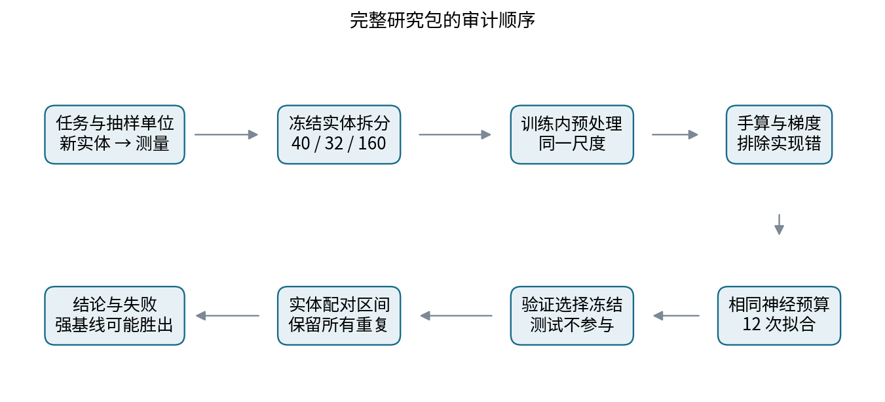

## 2 两种平均回答不同的问题

设共有$G$个实体，第$g$个实体有$m_g$次测量。第$j$次输入为$x_{gj}\in\mathbb R^2$，目标为$y_{gj}\in\mathbb R$，单行损失定义为$\ell_{gj}=(f_\theta(x_{gj})-y_{gj})^2/2$。数据表总行数是$N=\sum_gm_g$。两种经验风险分别为

$$L_{\rm row}(\theta)=\frac1N\sum_{g=1}^G\sum_{j=1}^{m_g}\ell_{gj},$$

$$L_{\rm entity}(\theta)=\frac1G\sum_{g=1}^G\frac1{m_g}\sum_{j=1}^{m_g}\ell_{gj}.$$

前者先等概率抽一行。实体$g$被抽到的概率是$m_g/N$。后者先等概率抽一个实体，再在该实体内等概率抽一次测量。每行权重变成$q_{gj}=1/(Gm_g)$，所有权重仍然加起来等于1。它们不是同一个平均数的两种实现；当重复次数和输入区域有关时，改变权重会改变训练目标。

最小例子有实体A的两行和实体B的一行。如果逐行损失是$(0,0,2)$，行平均为$2/3$，实体平均是$[0+2]/2=1$。把A的两行完整复制一遍，实体平均仍是1，行平均却降为$2/5$。这个操作没有增加独立实体信息，不能解释成模型真的改进。

如果所有$m_g$相等，两种权重完全相同。如果部署是按测量流量计费、每条测量都同等重要，那么行风险可能正是适合的目标。按实体加权不是道德标签，也不是自动提高所有任务性能的技术。首先要知道现实问题怎样产生一次预测请求。

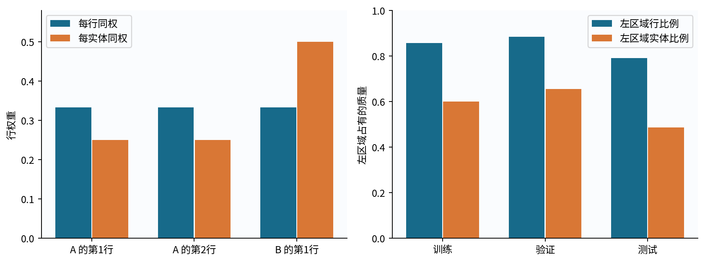

## 3 数据生成过程与信息边界

每个实体有中心$u_g\sim\operatorname{Uniform}([-2,2]^2)$和共享偏移$b_g\sim\mathcal N(0,0.25^2)$。若中心第一坐标小于0，测量8次；否则测量2次。测量输入是$x_{gj}=u_g+\epsilon_{gj}$，其中$\epsilon_{gj}\sim\mathcal N(0,0.05^2I)$。目标为

$$y_{gj}=0.7\sin(1.5x_{gj,1})+0.35x_{gj,1}x_{gj,2}+0.25x_{gj,2}^2+b_g+\xi_{gj},$$

其中$\xi_{gj}\sim\mathcal N(0,0.08^2)$；不同实体及所声明的噪声来源独立。共享的$b_g$使同一实体的残差相关。相近输入也是由同一个中心生成的，所以“788行”不等于“788个独立实体”。分组标签由潜在中心定义，少量带噪测量可以越过$x_1=0$，不能重新按观测符号改写原来的区域。

生成器分别用种子4200、4201、4202建立互不重叠的训练、验证和测试实体。行ID、实体ID、重复编号、两个输入、目标和区域全部公开。ID只用于拆分、加权和评价，绝不进入主模型特征；未观察到的中心和共享偏移也不输入模型。

|拆分|独立实体数|测量行数|左区域实体数|左区域行比例|
|---|---:|---:|---:|---:|
|训练|40|224|24|85.71%|
|验证|32|190|21|88.42%|
|测试|160|788|78|79.19%|

训练与验证左区域实体比例分别为60%和65.625%，测试为48.75%。这是固定小样本的一次抽样结果，并没有人为把验证组成改到和测试一致。协议、数据与生成种子在训练前固定；事后不能因区域结果不理想而重新抽一份更有利的数据。

完整性检查会读取所有文件的字节并比较哈希；这不等于用测试标签选择模型。程序只在选择完成后解析测试表。这个结构边界有用，但文件公开后读者仍可主动窥看标签，因此它是可重复教学实验，不是长期保密的盲测排行榜。

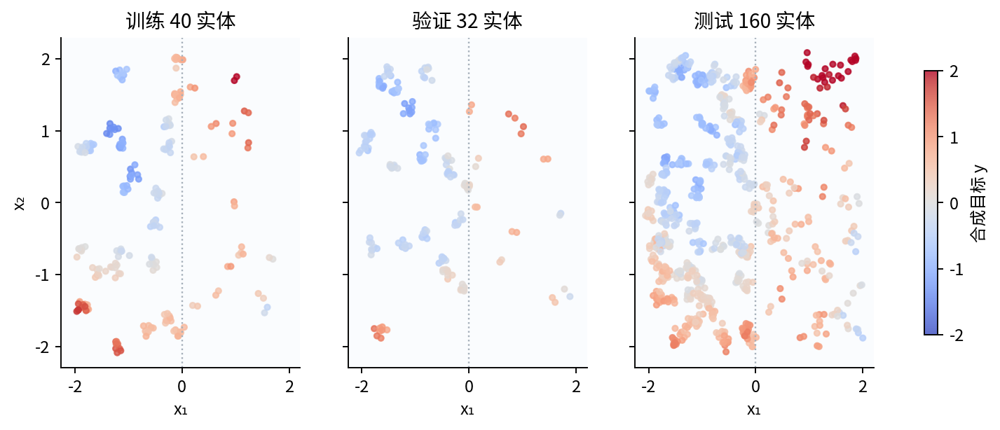

## 4 把加权目标放进同一个纸笔网络

用三行$(x,y)=(-1,0),(0,1),(1,0)$，前两行属于A，第三行属于B，所以$q=(1/4,1/4,1/2)$。这只是用于手算的一维微型例子，不混入二维主实验。网络定义为

$$z_{ij}=w_jx_i+b_j,\quad h_{ij}=\max(0,z_{ij}),\quad\widehat y_i=a_1h_{i1}+a_2h_{i2}+c.$$

参数顺序固定为$\theta=(w_1,w_2,b_1,b_2,a_1,a_2,c)$，初值为$(0.5,-0.5,1,1,1,-0.5,0)$。本段学习率$\eta=0.1$，正则系数$\lambda=0.1$，只惩罚权重，目标为

$$J(\theta)=\sum_{i=1}^3q_i\frac{(\widehat y_i-y_i)^2}{2}+\frac\lambda2(w_1^2+w_2^2+a_1^2+a_2^2).$$

主实验稍后使用tanh与更小的正则系数；纸笔实例的作用是逐节点展示链式法则、加权和惩罚的接法，不把它冒充实际25参数网络的训练日志。

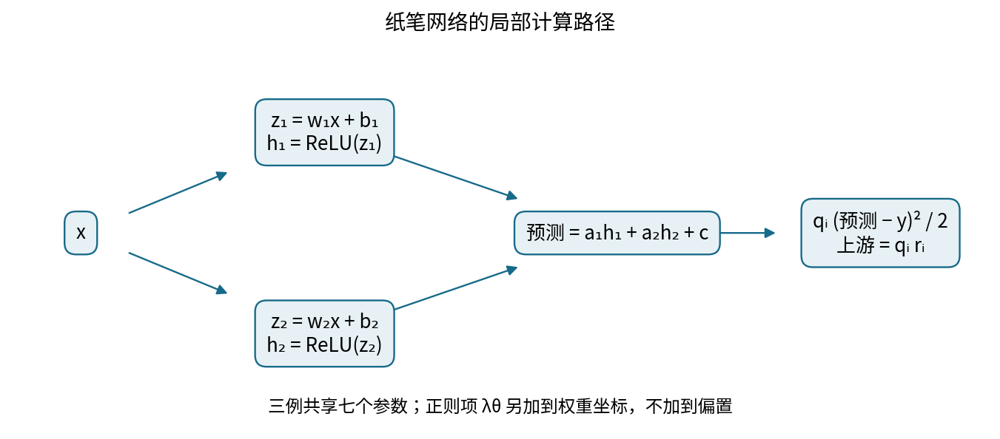

第一例$z_1=0.5(-1)+1=0.5$，$z_2=(-0.5)(-1)+1=1.5$；两个ReLU门都打开，所以$h=z$。预测为$1(0.5)-0.5(1.5)=-0.25$，残差也是$-0.25$。另外两例用同一组旧参数计算如下。

|行|$z_1=h_1$|$z_2=h_2$|预测|残差$r$|$r^2/2$|加权损失$q r^2/2$|
|---|---:|---:|---:|---:|---:|---:|
|A1|0.5|1.5|-0.25|-0.25|0.03125|0.0078125|
|A2|1|1|0.5|-0.5|0.125|0.03125|
|B1|1.5|0.5|1.25|1.25|0.78125|0.390625|

相加得到$L_0=0.4296875=55/128$。惩罚项是$0.05(0.25+0.25+1+0.25)=0.0875$，所以$J_0=0.5171875=331/640$。偏置没有被惩罚；也不能在加权求和以后再除以3，否则会偷偷改变数据项和正则项的相对尺度。

## 5 局部导数与所有共享参数的累加

平方损失对预测的局部导数是$r_i$。权重乘法再给出上游$u_i=q_ir_i$；输出到隐藏层的局部导数为$a_j$；ReLU到$z$的局部导数是$\mathbf1[z_{ij}>0]$；$z$对$w_j$和$b_j$的局部导数分别为$x_i$和1。记

$$v_{ij}=u_i a_j\mathbf1[z_{ij}>0].$$

每行对七个参数的贡献依次是

$$(v_{i1}x_i,\ v_{i2}x_i,\ v_{i1},\ v_{i2},\ u_i h_{i1},\ u_i h_{i2},\ u_i).$$

本轮$u=(-0.0625,-0.125,0.625)$，两条隐藏支路的$v$分别为$(-0.0625,0.03125)$、$(-0.125,0.0625)$、$(0.625,-0.3125)$。例如第一例对$w_1$的贡献是$(-0.0625)(-1)=0.0625$，第三例贡献是$0.625(1)=0.625$。它们流入同一参数，应当相加。

|参数|A1贡献|A2贡献|B1贡献|数据梯度|
|---|---:|---:|---:|---:|
|$w_1$|0.0625|0|0.625|0.6875|
|$w_2$|-0.03125|0|-0.3125|-0.34375|
|$b_1$|-0.0625|-0.125|0.625|0.4375|
|$b_2$|0.03125|0.0625|-0.3125|-0.21875|
|$a_1$|-0.03125|-0.125|0.9375|0.78125|
|$a_2$|-0.09375|-0.125|0.3125|0.09375|
|$c$|-0.0625|-0.125|0.625|0.4375|

惩罚导数在四个权重上为$\lambda\theta_k$，在三个偏置上为0。将它加到上表最后一列后，统一执行$\theta_1=\theta_0-0.1\nabla J(\theta_0)$。

|参数|惩罚梯度|总梯度|同步更新后的参数|
|---|---:|---:|---:|
|$w_1$|0.05|0.7375|0.42625|
|$w_2$|-0.05|-0.39375|-0.460625|
|$b_1$|0|0.4375|0.95625|
|$b_2$|0|-0.21875|1.021875|
|$a_1$|0.1|0.88125|0.911875|
|$a_2$|-0.05|0.04375|-0.504375|
|$c$|0|0.4375|-0.04375|

计算$w,b$的梯度时，仍然必须用旧的$a$。如果先更新$a$再反传到第一层，得到的就不是同一个参数点的梯度。全批量同步更新并不等于逐行更新三次。

## 6 第二轮完整重算及第三次前向

新参数重新代入三行，得到下表。所有$z$仍大于0，所以这次门导数依然为1；这只是本实例的事实，不是对所有ReLU的省略规则。

|行|新$z_1$|新$z_2$|新预测|新残差|新$u=q r$|
|---|---:|---:|---:|---:|---:|
|A1|0.53|1.4825|-0.3081921875|-0.3081921875|-0.077048046875|
|A2|0.95625|1.021875|0.312822265625|-0.687177734375|-0.171794433594|
|B1|1.3825|0.56125|0.93383671875|0.93383671875|0.466918359375|

例如A1预测为$0.911875(0.53)-0.504375(1.4825)-0.04375$。三行加权损失依次为0.011872803055、0.059026654828、0.218012754321，总数据损失为0.288912212204；权重惩罚为0.073988730469，总目标为0.362900942672。

新隐藏上游分别为$(-0.070258187744,0.038861108643)$、$(-0.156655049133,0.086648817444)$、$(0.425771178955,-0.235501947510)$。它们使用新输出权重，不沿用第一轮的$v$。乘$x$或乘$h$后，每一条参数路径都得到新贡献。

|参数|A1新贡献|A2新贡献|B1新贡献|新数据梯度|
|---|---:|---:|---:|---:|
|$w_1$|0.070258188|0|0.425771179|0.496029367|
|$w_2$|-0.038861109|0|-0.235501948|-0.274363056|
|$b_1$|-0.070258188|-0.156655049|0.425771179|0.198857942|
|$b_2$|0.038861109|0.086648817|-0.235501948|-0.109992021|
|$a_1$|-0.040835465|-0.164278427|0.645514632|0.440400740|
|$a_2$|-0.114223729|-0.175552437|0.262057929|-0.027718237|
|$c$|-0.077048047|-0.171794434|0.466918359|0.218075879|

|参数|新惩罚梯度|新总梯度|第二次更新后的参数|
|---|---:|---:|---:|
|$w_1$|0.042625|0.538654367|0.372384563330|
|$w_2$|-0.0460625|-0.320425556|-0.428582444385|
|$b_1$|0|0.198857942|0.936364205792|
|$b_2$|0|-0.109992021|1.032874202142|
|$a_1$|0.0911875|0.531588240|0.858716176013|
|$a_2$|-0.0504375|-0.078155737|-0.496559426288|
|$c$|0|0.218075879|-0.065557587891|

表中为了排版而四舍五入；程序用Fraction保存精确分数，不能用表中短小数作为后续真值。再次前向的三个$z$向量约为$(0.563979642462,1.461456646527)$、$(0.936364205792,1.032874202142)$、$(1.308748769122,0.604291757758)$。预测依次为$-0.306959219910$、$0.225630081020$、$0.758219381949$，数据损失约0.230458249555，总目标约0.295774145026。

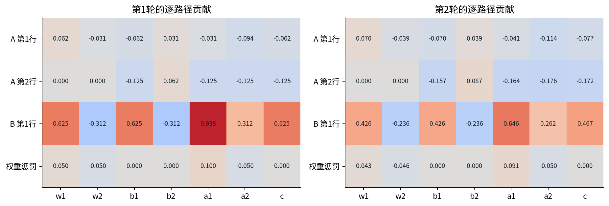

A2的预测从0.5降到0.3128再到0.2256，与标签1反而更远，而总目标持续下降。这不是反向传播错误：加权总目标可能通过改善权重更大的B1而牺牲某些样本。一个总损失数值不能保证每个实体、每个区域或每次预测都改进。

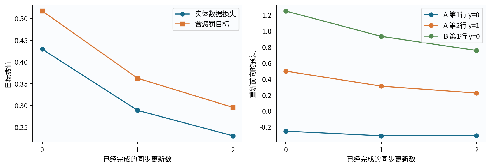

## 7 从七参数账本到25参数实际网络

真实项目用$X\in\mathbb R^{N\times2}$，先在训练实体上拟合逐特征均值与总体标准差：$\mu_k=\sum_iq_i^{\rm entity}x_{ik}$，$s_k^2=\sum_iq_i^{\rm entity}(x_{ik}-\mu_k)^2$，再令$\widetilde X_{ik}=(x_{ik}-\mu_k)/s_k$。验证和测试只应用这组尺度，不重新估计。两个MLP条件使用完全相同的实体加权尺度，因此主对照只改变训练损失权重。

网络为$H=\tanh(\widetilde XW+\mathbf1b^\top)$，$\widehat y=Hv+c\mathbf1$。形状分别是$W:2\times6$、$b:6$、$v:6$、$c:1$，共$12+6+6+1=25$个参数。tanh是平滑非线性，便于全坐标有限差分；它并不因平滑而自动消除饱和或非凸优化困难。

对任意一种已归一化权重$q$，令$r=\widehat y-y$，$u=q\odot r$，则

$$D=(uv^\top)\odot(1-H\odot H),$$

$$\nabla_WJ=\widetilde X^\top D+\lambda W,\qquad\nabla_bJ=\sum_iD_{i,:},$$

$$\nabla_vJ=H^\top u+\lambda v,\qquad\nabla_cJ=\sum_i u_i.$$

主实验$\lambda=0.002$，不惩罚$b,c$。这四式就是纸笔账本的批次形式：先产生各行上游，再沿隐藏单元路径传播，最后对共享参数累加。若$q$已经和为1，就没有另一个$1/N$。没有dropout、BatchNorm或小批次随机抽样，以免给这次“只改权重”的对照加入额外因素。

程序用PyTorch求梯度，测试另写NumPy公式并对200个随机参数坐标做中心差分。作者核验还用逐样本显式累加的实现重建全部4200次更新和105300个参数状态坐标；它避免仅把同一训练函数再调用一次就称为独立核验。通过这些检查支持实现对应公式，不证明该模型在真实任务上合适。

## 8 先冻结预算与选择规则

两种权重各有两个学习率候选0.03和0.1，每个候选使用相同的三个初始化种子4211、4212、4213，均做350次全批量同步更新。每个条件是6次拟合、2100次更新、470400行样本呈现；两条件合计12次拟合与4200次更新。

样本呈现数只计参与梯度更新的训练行，不含验证前向、记录、梯度核验和绘图。相同宽度、步数、行数并不等于已测得相同墙钟时间；权重处理也有小开销。这里匹配的是明确列出的神经训练预算，没有测量或宣称总计算优势。

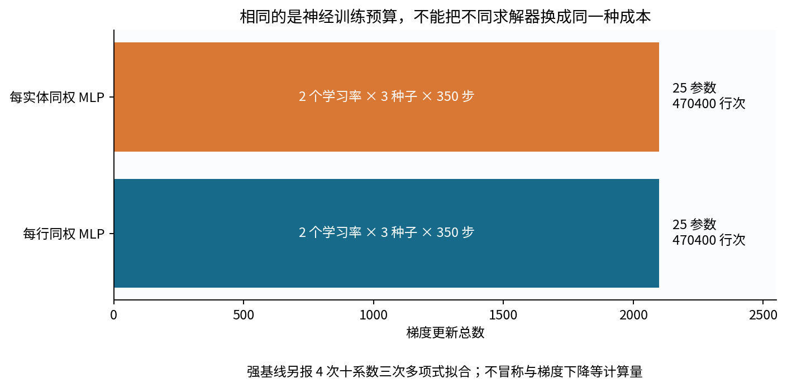

在每种权重条件内部，按三个种子的最终验证实体half-MSE平均值选择学习率，严格平局按协议中候选顺序。禁止看测试结果后改候选、换种子或改训练步数。不用早停；350步既不称作收敛，也不保证已找到该网络的最好参数。

最终部署用选中学习率的三个模型预测平均。注意“单模型损失的平均”不同于“平均预测的损失”。平方损失下，后一项不大于前一项，但本协议按前一项选配置，没有声称为集成预测直接找到了最优超参数。每个模型的预测和两种层级的结果都保留。

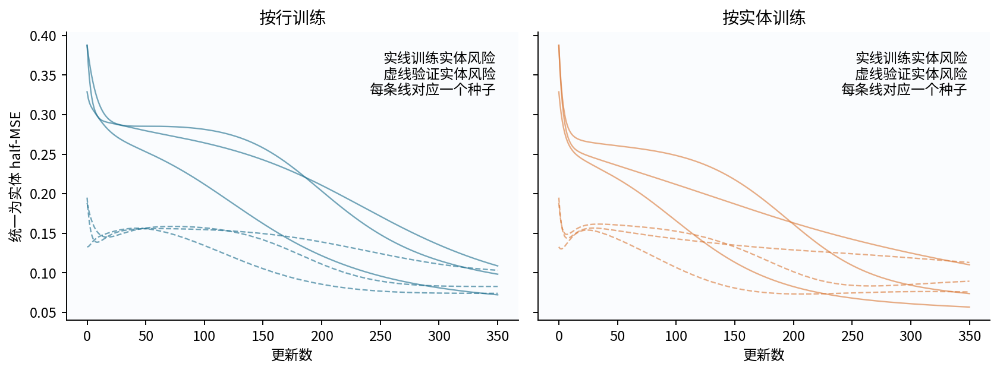

## 9 验证结果也可能和测试排序不同

|训练权重|学习率|三种子平均验证实体half-MSE|
|---|---:|---:|
|按行|0.03|0.14729935|
|按行|0.1|0.08682504|
|按实体|0.03|0.13222828|
|按实体|0.1|0.09287519|

两个条件都选0.1。在这份验证集上，按行训练的平均单模型损失还略低于按实体训练。这一点必须保留。我们预先指定比较两种条件，并在各自内部调学习率，没有在验证后只留下分数更好的一个条件。如果实际部署协议是“在所有方法中选一个最优方法”，就需要按那个协议评价，不能事后改成同时保留两者。

验证实体只有32个，且区域组成与测试不同；有限样本、初始化变化和集成方式都可能影响排序。观察到排序改变本身不能证明唯一原因。要检验哪个因素有贡献，需要新的受控实验；当前测试集不能继续充当调试反馈。

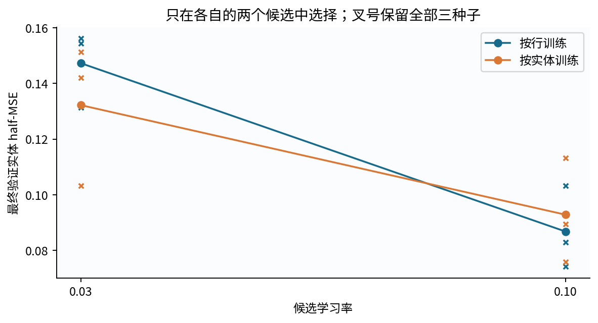

## 10 强基线为什么是项目的一部分

常数预测器取训练实体加权目标均值。线性ridge使用常数、两个标准化输入，共3个系数，固定$\lambda=0.001$。它们能说明网络学到了多少非线性，但只有线性基线仍然可能过弱。

强基线使用两个标准化输入的总次数不超过3的所有单项式：$1,z_1,z_2,z_1^2,z_1z_2,z_2^2,z_1^3,z_1^2z_2,z_1z_2^2,z_2^3$，共10个系数。训练目标为

$$\frac12\|Q^{1/2}(\Phi\beta-y)\|_2^2+\frac\lambda2\|D\beta\|_2^2,$$

其中$Q=\operatorname{diag}(q^{\rm entity})$，$D=\operatorname{diag}(0,1,\ldots,1)$使截距不受惩罚。程序求增广系统$[Q^{1/2}\Phi;\sqrt\lambda D]$与$[Q^{1/2}y;0]$的最小二乘解，不显式求逆。

候选$\lambda$为0.0001、0.001、0.01、0.1，对应验证分数约0.050787、0.050481、0.048259、0.049990，选择0.01。四次多项式求解、一次线性求解和一次常数拟合都记录在成本账本中；这些求解没有与神经网络匹配墙钟时间，不能比较“同算力效率”。强基线的作用是检验我们是否只打败了一个太弱的对手。

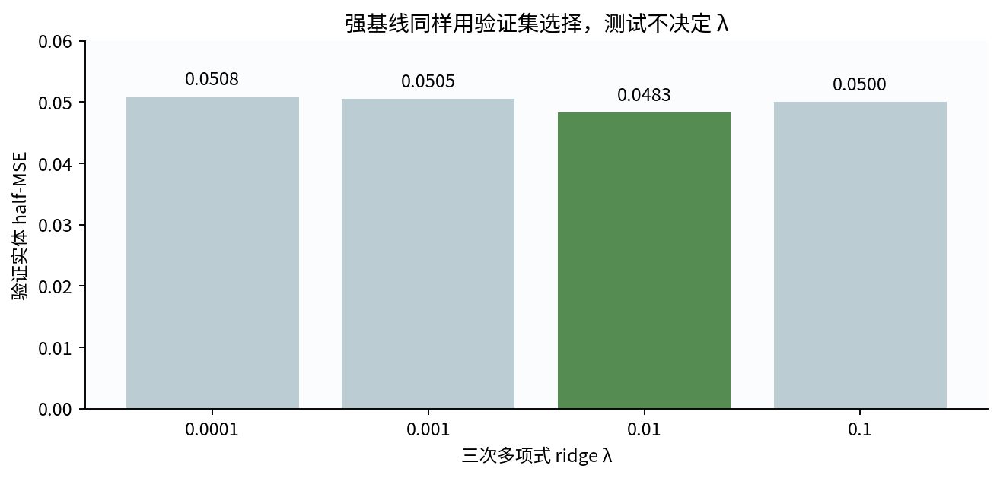

## 11 冻结后的测试结果与局部退化

固定模型后，才解析160个测试实体的788行测量。每个实体先在自己的重复测量内平均损失，再对实体平均。以下数字都不含正则惩罚。

|模型|全部实体half-MSE|左区域|右区域|
|---|---:|---:|---:|
|按行训练MLP集成|0.14053700|0.04494311|0.23146778|
|按实体训练MLP集成|0.09016470|0.05004941|0.12832314|
|三次多项式ridge|0.05247549|0.03102165|0.07288281|
|线性ridge|0.25624283|0.14179978|0.36510329|
|常数|0.33671058|0.22804165|0.44007858|

主比较的差值是$0.09016470-0.14053700=-0.05037230$，负值表示实体加权条件在主指标上更好。但左区域从0.04494311上升到0.05004941，是退化；右区域下降幅度较大，带动整体改善。因此不能写成“按实体加权对所有区域都有益”。

两者的逐行测试平均又分别为0.08376296和0.06633989，与实体平均不同。报告时必须带上指标的抽样单位，不能把0.1405和0.0663横向拼起来，夸大改进。全部区域内重复次数相同，区域内部的行均值与实体均值相等；总体的区域权重不同，才产生总体差别。

三次多项式在这次固定比较中优于两种MLP。它与合成真值中低次多项式和有界区间上的平滑正弦结构较匹配，这是一种合理解释，但尚不是对优势来源的独立消融证明。既不能因此宣称神经网络无用，也不能把这一结果从研究报告中删除。

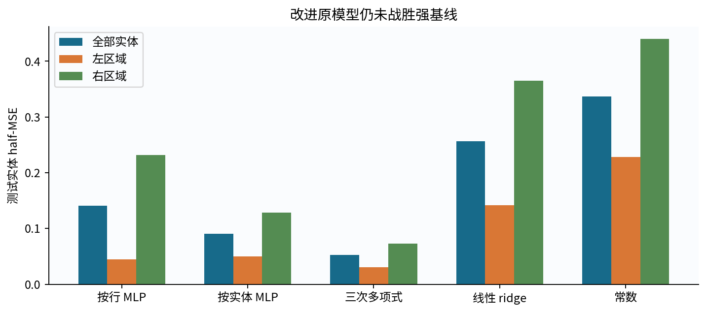

## 12 按独立实体做配对区间

对测试实体$g$计算同一批行上的两种模型损失差

$$d_g=\frac1{m_g}\sum_j\left[\frac{(\widehat y^{E}_{gj}-y_{gj})^2}{2}-\frac{(\widehat y^{R}_{gj}-y_{gj})^2}{2}\right].$$

点估计是$\bar d=\sum_gd_g/160$。每次bootstrap有放回抽160个实体索引，同一实体的全部重复测量和两种预测共同保留；然后平均所抽$d_g$。重复2000次，取均值分布的2.5%和97.5%分位数，得到约$[-0.07849288,-0.02509653]$。

这里先把每个实体压成$d_g$再重采样，与整实体复制全部重复行后重新按抽到的实体出现次数平均等价；不能按原始实体ID合并重复抽到的同一实体，那会丢失bootstrap抽样次数。也不能独立重采样两个模型，破坏配对，或把788行当788个独立实体。

这个百分位区间是近似的、条件性的：训练数据、预处理、选参和六个已训练网络保持不变，只刻画同一实体生成机制下的测试实体抽样波动。它没有覆盖重新采训练实体、重新初始化、重新选择、换生成机制等不确定性。三个初始化种子不是三个独立数据集，不能与160个实体合并成480个独立证据。

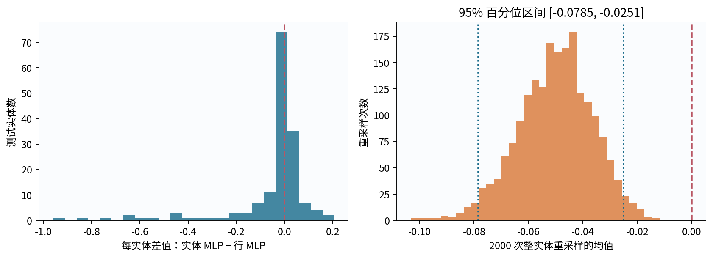

## 13 失败案例与错误拆分的独立反例

按实体MLP的实体损失从大到小排序，展示最差四个实体，同时提供完整160个实体损失。图13用于事后诊断和提出新假设，没有据此重训或回调超参数。测试标签一旦用来启发下一轮改动，就必须把下一轮视为新实验，并配置新的独立评价资料。

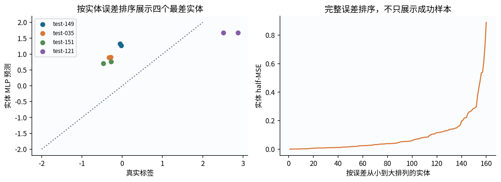

为把拆分问题和网络优化分开，我们另外构造80个身份的纯记忆例子：$y_{gj}=b_g+\epsilon_{gj}$，$b_g\sim\mathcal N(0,1)$，$\epsilon_{gj}\sim\mathcal N(0,0.1^2)$，每个身份四行。若前三行用于记住该实体均值、第四行测试，预测器已经看过该实体信息。预测误差中$b_g$抵消，理论half-MSE为

$$\frac12\left(0.1^2+\frac{0.1^2}{3}\right)=0.00666667.$$

若前60个实体全部用于训练，后20个实体完全未见，身份查表无处可查，使用训练目标总均值。该均值方差为$(1+0.1^2/4)/60$，新观测方差为$1+0.1^2$，因此理论期望为

$$\frac12\left[1+0.1^2+\frac{1+0.1^2/4}{60}\right]=0.51335417.$$

固定种子的实际损失分别是0.00682796和0.42647490。随机样本不必等于理论期望。两个方案面对的测试实体集合与预测任务不同，因此这不是主MLP的配对性能比较，也不能直接把两数相减当作某个算法的改进量。它只精确说明：同一实体的新观测与从未见过的新实体，是不同的泛化问题。

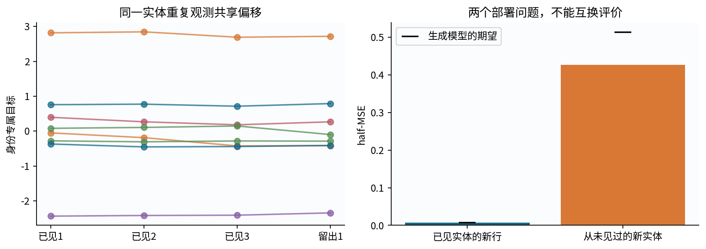

## 14 怎样交出可以被复查的研究包

本讲的六个数值产物包括结果摘要、精确手算、固定测试评价、身份反例、逐步曲线以及全部训练参数轨迹。每次接受更新前后的状态都保存，4212个状态并非只截取最佳曲线。大轨迹采用确定性gzip无损封装，记录原始字节长度与SHA；压缩改变存储方式，不减少精度、不丢种子、不抽稀步骤。

所有输出先计算并序列化成功，然后逐文件原子替换。因此遇到输入损坏、非法路径或非有限值，程序可以在写入前失败；但这不是跨六个文件的崩溃事务，机器在替换途中断电仍可能留下不同代产物。哈希检查用于发现这种不一致。不要把“没有报错”或“数值看起来相近”作为唯一验收方式。

项目报告应说明任务、独立单位、预测时点、禁止特征、目标风险、训练与选择预算、主比较、区间条件、全部失败和下一步。结果段可以写：在本次固定合成重复测量任务和冻结协议下，实体加权MLP的测试实体half-MSE低于行加权MLP，主配对区间为负；左区域有所退化，且三次多项式ridge更好。不要写成新的普遍算法、因果机制证明或真实部署保证。

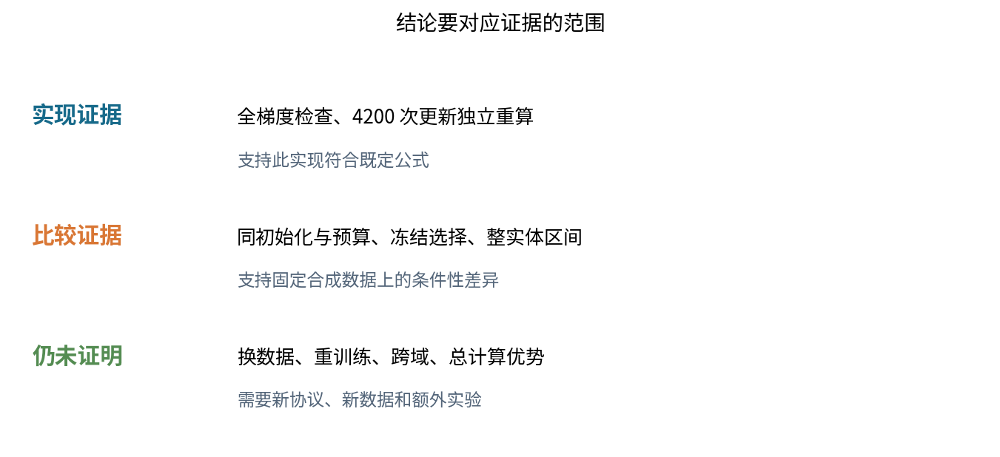

## 15 审查者如何反驳这份结果

一份研究包应当允许别人找错。先检查实体名单是否重叠，再核对权重是否与声明的风险一致；任选一个训练状态，独立重算梯度和下一状态；逐个检查全部候选是否使用相同预算；最后从固定预测重新计算实体损失和区间。如果其中一步失败，先修复证据链，不要继续讨论“为什么有效”。

有些反驳需要新实验而非修程序。例如，更多训练实体是否会改变两MLP差距、统一重复次数是否会消除权重差异、更多训练步是否足以追上强基线，这些都不是当前4200次更新能回答的问题。把它们写成可证伪预测，冻结新的数据与预算，才是从复现练习走向研究的下一步。现有公开测试可以用于复查旧结果，不能再作为新结论的独立盲测。

来源链接与实际核查范围见sources.md；本讲推导、合成数据、图和叙事独立编写。
