# 043 卷积局部性与平移结构

先看清一个滑动窗口里的每次乘法，再讨论它能保留什么对称性。

## 1 从全连接层走向空间结构

025已经说明非线性层怎样建立表示，027解释了共享参数的批次梯度，031教我们用独立参照检查实现。现在把输入从特征向量换成二维数组：一个位置附近的读数，是否应该用与另一个位置附近相同的规则处理？卷积把这个假设写进连接方式。

这里的“图像”可以是相机亮度、显微图像、规则网格上的模拟场，也可以只是一个小数字表。数组排列本身不能证明相邻位置在任务中有特殊关系。若把调查表任意排列成方格，卷积的局部性可能完全不合适；若传感器不同位置采用不同测量尺度，位置共享也要先论证。

本讲完成三件事。先从二维互相关推导形状、参数和感受野；再把同一批两幅小图从前向、局部导数、梯度累加一路算到更新后的下一次前向；最后写自己的前后向，与框架和数值差分核验，并用固定实验直接检验平移等变性的条件。另做一个十参数卷积核辨识实验，真实执行80步训练，保留尚未达到最小二乘参照的优化误差。

本讲没有声称小合成实验代表真实视觉任务。目标是把常见的“卷积天然平移不变”拆成可计算的命题：平移作用在哪个域上？边界怎样处理？步幅是多少？输出应当怎样移动？任务头是否还保留这种性质？

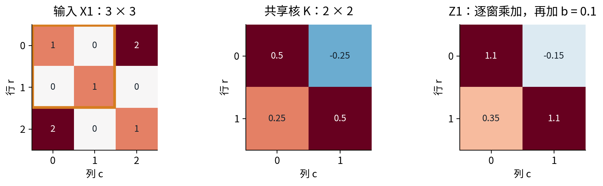

## 2 坐标、通道与互相关

先约定行向下、列向右，索引从0开始。批量输入采用NCHW：$X\in\mathbb R^{N\times C_{\rm in}\times H\times W}$。$N$是样本数，$C_{\rm in}$是输入通道数，$H,W$是空间尺寸。灰度通常有1个通道，RGB通常有3个；通道也可能是不同物理量，但这时单位和归一化必须明确。

核的形状是$K\in\mathbb R^{C_{\rm out}\times C_{\rm in}\times k_h\times k_w}$，偏置为$b\in\mathbb R^{C_{\rm out}}$。一个输出通道拥有一整组跨越所有输入通道的核，而不是只看一个输入通道。输出通道数是设计的特征数，并不要求与输入通道数相同。

先取步幅1、无填充、无膨胀。前向计算为

$$Z_{n,o,r,c}=b_o+\sum_{i=0}^{C_{\rm in}-1}\sum_{a=0}^{k_h-1}\sum_{q=0}^{k_w-1}K_{o,i,a,q}X_{n,i,r+a,c+q}.$$

每一项是同一窗口位置上的输入值与核值相乘，最后跨空间和通道相加。批次轴不进入这三个求和；样本1不应读取样本2的像素。参数$K$和$b$却由所有样本、所有输出位置共同使用。

这个定义严格说是互相关（cross-correlation）：核没有翻转。离散数学卷积常写为$(x*k)[t]=\sum_a k[a]x[t-a]$，等价于滑窗时翻转核，并相应确定坐标原点。PyTorch的Conv2d使用互相关语义；名称沿用“卷积层”。[S1] 本讲以后说卷积层时都采用上式，不会在前向中突然翻转核。

最小辨别例：窗口$(1,2)$与核$(3,4)$，互相关得到$1\cdot3+2\cdot4=11$；把核翻转后得到$1\cdot4+2\cdot3=10$。对于可以自由学习的核，翻转会重新编号参数，不减少函数族，但与固定信号处理滤波器、现成权重或手算答案对照时，约定必须一致。

## 3 局部连接与权重共享是两件事

对$3\times3$输入产生$2\times2$输出，先展平成9个输入与4个输出。全连接仿射层有$9\cdot4+4=40$个参数。若每个输出只连接它的$2\times2$窗口，但每处核与偏置互不相同，则是局部连接、不共享，参数数为$4(4+1)=20$。真正共享的卷积只有4个核参数和1个偏置，共5个。

因此“局部”回答一个输出看哪里，“共享”回答不同输出是否使用同一组系数。两者都不是训练得到的结论，而是建模时加入的约束。共享通常减少独立待估计参数，却也排除了一些位置特异的函数。若左上角表示校准参考、右下角表示目标测量，完全共享的规则未必符合任务。

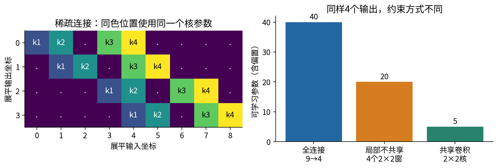

一般的标准卷积参数量为

$$P=C_{\rm out}(C_{\rm in}k_hk_w+1).$$

它不含$N,H,W$，但输出激活数量与计算量会随这些尺寸增加。前向乘法数量约为$NC_{\rm out}H_{\rm out}W_{\rm out}C_{\rm in}k_hk_w$；不能把少参数直接等同于低运行时间。实现、内存布局、设备与算法选择也影响速度。

例如输入3通道、输出8通道、$3\times3$核且有偏置，参数量为$8(3\cdot9+1)=224$。若改成$1\times1$核，参数量为$8(3+1)=32$；它在每个位置混合通道，不会把邻居像素混进来。分组和深度可分离卷积会改变连接约束，本讲给出概念边界，但从零API只支持groups=1，不假装已经实现所有Conv2d模式。

## 4 步幅、填充、膨胀与输出尺寸

步幅$s_h,s_w$决定相邻窗口起点相距多少格。填充$p_h,p_w$表示在上下各补$p_h$行、左右各补$p_w$列。膨胀$d_h,d_w$决定核相邻采样点在输入中相距多少格；它没有增加核参数，只把采样点拉开。零填充后的输入记为$\widetilde X$，则

$$Z_{n,o,r,c}=b_o+\sum_{i,a,q}K_{o,i,a,q}\widetilde X_{n,i,rs_h+ad_h,cs_w+qd_w}.$$

用原始坐标表示，窗口访问行$u=rs_h-p_h+ad_h$与列$v=cs_w-p_w+qd_w$；超出原图的值按零处理。零是我们施加的边界条件，不是额外测得的像素。

一条轴上核覆盖的包络长度是$k_{\rm eff}=d(k-1)+1$。起点可以是$0,s,2s,\ldots$，最后一个合法起点必须满足$rs+k_{\rm eff}\le H+2p$。因此

$$H_{\rm out}=\left\lfloor\frac{H+2p_h-d_h(k_h-1)-1}{s_h}\right\rfloor+1,$$

宽度完全同理。若结果不为正，当前核放不进补边后的输入，程序应当拒绝。下取整代表末尾不足一个窗口时直接舍去，并不自动补足它。

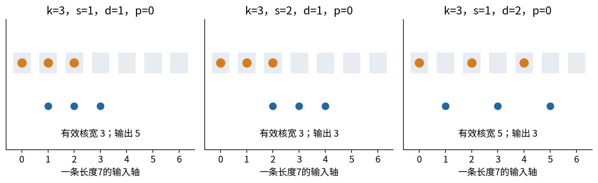

例一：$H=7,k=3,d=1,p=0,s=2$，起点为0、2、4，输出3格。例二：$H=7,k=3,d=2,p=0,s=1$，有效核宽5，仍输出3格，但第一个窗口读取0、2、4三个位置。例三：$H=6,k=3,p=1,s=2,d=1$，输出$\lfloor(6+2-3)/2\rfloor+1=3$。含边界时第一个窗口并不代表三个真实观测。

若步幅1、膨胀1且核为奇数，令$p=(k-1)/2$可保持尺寸。偶数核要保持尺寸通常需要不对称填充；不同库对“same”的定义还可能涉及步幅。本讲API只接收整数或一对整数的对称填充，不接受字符串same，也不暗中决定哪边多补一格。形状相同不意味着坐标对齐，更不意味着平移性质相同。

## 5 同一个两样本网络：四窗口到标量损失

用两个单通道$3\times3$样本，目标分别为$y_1=0.5,y_2=1$：

$$X_1=\begin{bmatrix}1&0&2\\0&1&0\\2&0&1\end{bmatrix},\qquad X_2=\begin{bmatrix}0&1&0\\1&0&1\\0&1&0\end{bmatrix}.$$

参数初值为

$$K=\begin{bmatrix}0.5&-0.25\\0.25&0.5\end{bmatrix},\qquad b=0.1.$$

使用valid互相关，得到每例$2\times2$的$Z_i$；逐点ReLU得到$H_i=\max(0,Z_i)$；对四个位置取均值得到预测$\widehat y_i=\frac14\sum_{r,c}H_{i,r,c}$。这个平均称为空间全局平均池化（GAP）。目标是

$$\ell_i=\frac12(\widehat y_i-y_i)^2,\qquad L=\frac{\ell_1+\ell_2}{2}.$$

本例没有正则化，也没有额外可学习任务头。只有四个核元素与一个偏置，共5参数。空间均值的$1/4$和样本均值的$1/2$来源不同，反传时两者都要保留。

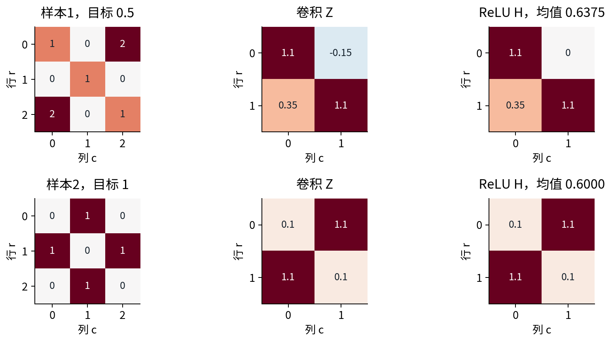

样本1四个窗口按行优先展平为$(1,0,0,1)$、$(0,2,1,0)$、$(0,1,2,0)$、$(1,0,0,1)$。因此四个卷积输出逐项是

$$Z_{1,0,0}=0.5\cdot1-0.25\cdot0+0.25\cdot0+0.5\cdot1+0.1=1.1,$$

$$Z_{1,0,1}=0.5\cdot0-0.25\cdot2+0.25\cdot1+0.5\cdot0+0.1=-0.15,$$

$$Z_{1,1,0}=0.5\cdot0-0.25\cdot1+0.25\cdot2+0.5\cdot0+0.1=0.35,$$

$$Z_{1,1,1}=0.5\cdot1-0.25\cdot0+0.25\cdot0+0.5\cdot1+0.1=1.1.$$

样本2的窗口依次是$(0,1,1,0)$、$(1,0,0,1)$、$(1,0,0,1)$、$(0,1,1,0)$，用同一个核和偏置得到$(0.1,1.1,1.1,0.1)$，四个门均打开。

|样本|ReLU后的四个值|预测|残差$r_i$|单样本损失$\ell_i$|
|---|---|---:|---:|---:|
|1|1.1，0，0.35，1.1|0.6375|0.1375|0.009453125|
|2|0.1，1.1，1.1，0.1|0.6|-0.4|0.08|

相加再除以2，$L_0=0.0447265625=229/5120$。不可先平均两个残差再平方；那会允许正负误差在平方之前抵消，改变了训练目标。

## 6 局部导数：空间路径与样本路径都要相加

把链拆成每条边：$\partial L/\partial\ell_i=1/2$，$\partial\ell_i/\partial\widehat y_i=r_i$，$\partial\widehat y_i/\partial H_{i,r,c}=1/4$，$\partial H/\partial Z=\mathbf1[Z>0]$。于是卷积输出收到的上游为

$$U_{i,r,c}=\frac{\partial L}{\partial Z_{i,r,c}}=\frac{r_i}{8}\mathbf1[Z_{i,r,c}>0].$$

样本1的$U$按行展开为$(0.0171875,0,0.0171875,0.0171875)$；样本2四处都是$-0.05$。这里没有任何位置恰好等于0；若恰好为0，ReLU数学上不可导，本代码与PyTorch采用零导数约定，中心差分在该点不应作为普通平滑梯度测试。

再向参数传播，局部导数$\partial Z_{i,r,c}/\partial K_{a,q}=X_{i,r+a,c+q}$，$\partial Z_{i,r,c}/\partial b=1$。样本1对$k_{00}$的贡献为

$$0.0171875\cdot1+0\cdot0+0.0171875\cdot0+0.0171875\cdot1=0.034375.$$

它对$k_{01}$的贡献是$0.0171875\cdot0+0\cdot2+0.0171875\cdot1+0.0171875\cdot0=0.0171875$。第二个窗口虽含有数值2，但门关闭，上游是0，不能把这条路径算进去。样本2对每个核元素的窗口输入之和都是2，所以每个贡献为$-0.05\cdot2=-0.1$。

|参数|样本1全部窗口贡献|样本2全部窗口贡献|全批次梯度|
|---|---:|---:|---:|
|$k_{00}$|0.034375|-0.1|-0.065625|
|$k_{01}$|0.0171875|-0.1|-0.0828125|
|$k_{10}$|0.034375|-0.1|-0.065625|
|$k_{11}$|0.034375|-0.1|-0.065625|
|$b$|0.0515625|-0.2|-0.1484375|

偏置在样本1的三个开门位置各收到0.0171875，样本2四处各收到-0.05。偏置梯度不是每图随便取一个残差，也不是把空间位置平均一次之后再次除以4。平均因子已经进入$U$，后面只做路径求和。

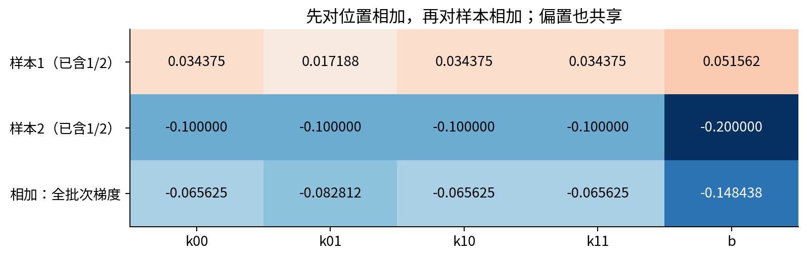

## 7 输入梯度与“覆盖多次就累加”

核参数梯度收集每个窗口里的输入；输入梯度则反过来收集所有覆盖该输入位置的窗口。一般式可用“散加”表示：每访问一次$(n,o,r,c,i,a,q)$，执行

$$\frac{\partial L}{\partial K_{o,i,a,q}}\mathrel{+}=U_{n,o,r,c}\widetilde X_{n,i,rs_h+ad_h,cs_w+qd_w},$$

$$\frac{\partial L}{\partial\widetilde X_{n,i,rs_h+ad_h,cs_w+qd_w}}\mathrel{+}=U_{n,o,r,c}K_{o,i,a,q},$$

$$\frac{\partial L}{\partial b_o}\mathrel{+}=U_{n,o,r,c}.$$

所有梯度数组初始为0，循环访问一条连接就加一次。最后把补边输入的梯度裁回原始$H\times W$；填充值是固定常数，不是要训练的新像素。

样本1中心像素被四个窗口覆盖，其输入梯度为

$$0.0171875(0.5)+0(0.25)+0.0171875(-0.25)+0.0171875(0.5)=0.012890625.$$

为什么四个核系数的次序不同？同一个输入中心在左上窗口里是右下角，在右上窗口里是左下角，在左下窗口里是右上角，在右下窗口里是左上角。只有把每个窗口的坐标写出来，才不会漏掉这一点。

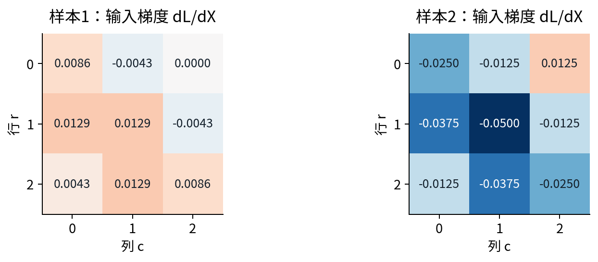

将无偏置卷积写为向量线性映射$z=Ax$，输入反传就是$A^\top u$。它是转置映射或伴随，不是求逆。下采样、多个输出通道以及窗口重叠都会影响其形状；把“转置卷积”称作自动还原原图会造成误解。本讲用内积恒等式$\langle Ax,u\rangle=\langle x,A^\top u\rangle$做独立核验，但不实现通用转置卷积API。

## 8 同步更新，再把两幅图完整重算

取学习率$\eta=0.2$，所有参数使用同一个旧参数点的梯度：

$$K'=\begin{bmatrix}0.513125&-0.2334375\\0.263125&0.513125\end{bmatrix},\qquad b'=0.1296875.$$

例如$k_{01}'=-0.25-0.2(-0.0828125)=-0.2334375$。反向全部完成后再更新；不能算完一个窗口就改核，再用新核处理同一批次的下一窗口，那是另一种算法。

更新后的第一次前向仍使用原来两幅图、原来标签与同样的归约。样本1第一窗口得到$0.513125+0.513125+0.1296875=1.1559375$，右上窗口得到$2(-0.2334375)+0.263125+0.1296875=-0.0740625$；左下窗口为$-0.2334375+2(0.263125)+0.1296875=0.4225$，右下与左上相同。

|样本|更新后的四个Z|预测|残差|单样本损失|
|---|---|---:|---:|---:|
|1|1.1559375，-0.0740625，0.4225，1.1559375|0.68359375|0.18359375|0.016853332520|
|2|0.159375，1.1559375，1.1559375，0.159375|0.65765625|-0.34234375|0.058599621582|

样本1右上仍为负，因此该门仍关闭；样本2四个值均为正。新的平均损失为$L_1=0.03772647705078125$。注意样本1变差了，样本2改善更多，所以平均损失仍下降。

还可以完全按同一规则做第二轮。两样本上游非零值分别为$0.18359375/8=0.02294921875$与$-0.34234375/8=-0.04279296875$。样本1参数贡献为$(0.0458984375,0.02294921875,0.0458984375,0.0458984375,0.06884765625)$；样本2为$(-0.0855859375,-0.0855859375,-0.0855859375,-0.0855859375,-0.171171875)$。

相加得到第二轮梯度$(-0.0396875,-0.06263671875,-0.0396875,-0.0396875,-0.10232421875)$。再同步更新得到

$$K''=\begin{bmatrix}0.5210625&-0.22091015625\\0.2710625&0.5210625\end{bmatrix},\quad b''=0.15015234375.$$

第三次前向，样本1的$Z$为$(1.19227734375,-0.02060546875,0.4713671875,1.19227734375)$；样本2为$(0.2003046875,1.19227734375,1.19227734375,0.2003046875)$。预测分别为0.71398046875与0.696291015625，平均损失为0.03450669704914093。全部精确分数与每例输入梯度保存在results.json的hand段，正文小数只用于阅读。

## 9 多层感受野：范围、间隔与空洞

某输出的理论感受野是计算图中可能影响它的输入位置集合。常用的“感受野大小”只是该集合的外接包络，不保证里面每个像素都实际连接，也不保证所有连接在当前参数与激活状态下贡献同样大。

沿单条层链定义输入格距$J_0=1$、包络宽$R_0=1$。第$l$层核宽$k_l$、膨胀$d_l$、步幅$s_l$时，逐轴有

$$J_l=J_{l-1}s_l,\qquad R_l=R_{l-1}+(k_l-1)d_lJ_{l-1}.$$

原因是：下一层相邻核采样点相隔$d_l$个上一层位置，即$d_lJ_{l-1}$个原始输入格；从第一个点到最后一个点共增加$(k_l-1)$段，再加上单个上一层位置已有的覆盖宽。填充影响对齐与边界的有效观测数，不改变这个无限格点包络公式。[S2]

如需输出中心坐标，初始像素中心取$A_0=0.5$，则$A_l=A_{l-1}+[(k_l-1)d_l/2-p_l]J_{l-1}$；第$t$个输出的中心为$A_l+tJ_l$。这解释了为什么两个同样大小的分支可能中心不对齐，不能仅因shape相同就无条件相加。044会继续讨论残差路径。

第一层$k=3,s=2,d=1$，有$R_1=3,J_1=2$；第二层$k=3,s=1,d=2$，有$R_2=3+2\cdot2\cdot2=11,J_2=2$。但第二层第一个输出实际覆盖输入$\{0,1,2,4,5,6,8,9,10\}$，位置3和7是空洞。再加第三层$k=3,s=1,d=1$，包络宽变为15，不是简单把三个核宽相乘。

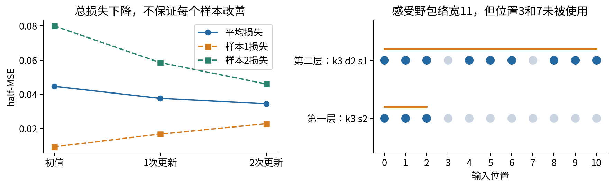

## 10 先把“平移等变”写成等式

定义整数平移$(T_\Delta x)[r,c]=x[r-\Delta_r,c-\Delta_c]$。等变表示$f(T_\Delta x)=T_\Delta f(x)$：输入移动，输出相应移动；不变表示$g(T_\Delta x)=g(x)$：标量或类别结果保持不变。二者都必须说明平移的定义域与输出对齐方式。

在无限整数格点、步幅1、空间共享核与偏置的条件下，互相关的证明只需代入：

$$f(T_\Delta x)[r,c]=b+\sum_{a,q}K[a,q]x[r+a-\Delta_r,c+q-\Delta_c]$$

$$=f(x)[r-\Delta_r,c-\Delta_c]=(T_\Delta f(x))[r,c].$$

膨胀只把$a,q$替换为$ad_h,qd_w$，不会破坏上述步幅1的代数关系。所有位置共享同一逐点非线性（例如ReLU）也与平移交换。因此“用了非线性所以不等变”并不正确。若偏置依赖绝对位置，上式中的同一个$b$就不再成立。

但电脑中的图像通常是有限数组。先平移再裁剪会丢掉像素；再对裁后的数组补零，与先在原数组外做卷积后再裁剪不是同一操作。我们的有限零填充平移不是保留全部信息的置换，也不形成有限图像上的平移群。不能直接把无限格点的等式套到整个有限输出上。

周期边界是一种干净的对照：右侧移出的值从左侧进入。循环平移是有限网格上的置换，卷积也采用相同周期边界，步幅1的等变等式可以在全图成立。这不表示真实相机图像适合首尾相接；它只是把边界假设单独控制住。

## 11 固定协议检验：边界与采样相位

实验用种子4303生成一幅$8\times8$整数图，偏置0，核固定为

$$K_{\rm probe}=\begin{bmatrix}0&1&0\\-1&2&0.5\\0&-0.5&1\end{bmatrix}.$$

输入右移1列。报告两条路径的最大绝对差与RMSE，而不是只看两幅图“差不多”。只比较预先规定的坐标，不在看见结果后挑选有利区域。

零边界的内部区域取原输出行1至6、列2至6，共30个位置。它保证两条路径涉及的原始窗口都完全位于观察范围内。全图仍报告全部64个位置，边界失败不被删掉。

|条件|比较坐标|最大绝对差|结论范围|
|---|---:|---:|---|
|零填充，步幅1，全图|64|4.5|有限裁剪边界破坏全图交换关系|
|零填充，步幅1，预定内部|30|0|本核与平移的内部等式成立|
|周期边界，步幅1|64|0|全图循环平移等变|
|周期边界，步幅2，输入移2列、输出移1列|16|0|与采样网格对齐的平移成立|
|周期边界，步幅1，再逐点ReLU|64|0|共同逐点非线性保留等变|

这些0在此整数和二进制可精确表示系数的例子中直接得到；对一般浮点输入应用容差判断，不把最后几位差异当作数学对称性失效，也不能把容差放大到掩盖明显错误。

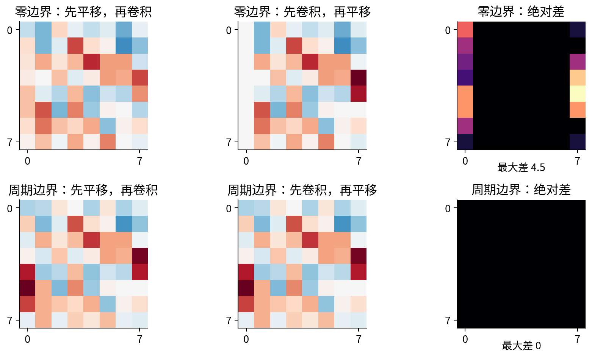

步幅2每隔两格保留一个输出。输入移动2列，相当于输出移动1列；输入只移动1列则切换了采样相位，没有一个整数输出平移准确代表“移动半格”。本实验把它硬与输出不移、输出移1列分别比较，最大差为14.5和9。后两项是错误对齐的诊断，不是宣称存在一个正确等变等式然后检验失败。

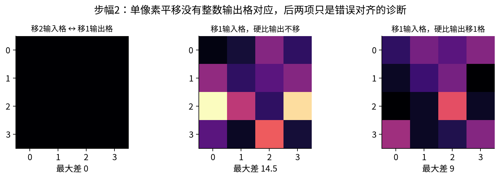

下采样前低通滤波可降低对采样相位的敏感性，是抗混叠研究的重要思路；它不自动保证任意有限数组、任意位移下完全不变。Zhang的论文提供了真实CNN中的相关研究动机，本讲没有复现其图像分类成绩，也没有训练抗混叠网络。[S3]

## 12 池化和分类头是否让输出不变

若$f$在周期网格上严格等变，对它的全部空间位置取平均$g(x)=\frac1{HW}\sum_{r,c}f(x)[r,c]$，循环平移只重新排列求和项，因此$g$不变。这个结论来自“全域置换不改变总和”，不是池化名称带来的魔法。

在同一个探针上，先卷积和ReLU，再做GAP：周期边界移前移后均为2.4765625；零边界却从2.390625变为2.1171875。后者丢失了边缘信息，不满足同一求和项置换的前提。

若任务头按固定位置赋予不同权重，即$g(x)=\sum_{r,c}w_{r,c}H[r,c]$，循环平移后特征与固定权重重新配对，通常不再不变。我们的固定权重$w_{r,c}=(8r+c)/64$使输出从86.1328125变为84.296875。展平后接全连接层就可能包含这种位置依赖。

局部最大池化也必须区分核、步幅和边界。步幅1、相同周期窗口的局部最大运算可以等变，但步幅大于1同样有采样相位问题；“max pool会产生完全平移不变”不是有效推理。对检测和分割，完全不变反而不是我们想要的：物体移动，框或掩码也应移动。

## 13 真实训练：辨识一个共享的局部生成规则

纸笔网络只用来揭示链式法则。现在用另一份独立合成数据真实学习一个$3\times3$核。每幅输入是$6\times6$单通道数组，像素独立采自$[-1,1]$均匀分布。用固定真核$K_*$、真偏置0.15做valid互相关，再给每个输出加独立均值0、标准差0.05的高斯噪声，得到$4\times4$目标图。真核为

$$K_*=\begin{bmatrix}0.2&-0.1&0\\0.1&0.5&-0.2\\0&0.1&0.3\end{bmatrix}.$$

12幅训练图使用种子4301，20幅测试图使用4302。学习模型与生成过程同属单层线性互相关，10个参数从0开始，学习率固定0.1，全批次SGD更新80次。每步损失是全部$12\cdot16=192$个输出的平均half-MSE；上游是残差除以192，再用前面自己写的反向散加。

这不是分类，也不是深层CNN实验。选择这个容易问题，是因为可把全部窗口变成设计矩阵$D\in\mathbb R^{192\times10}$，每行是9个窗口数值加一个常数1，从而用稳定最小二乘求解作为独立优化参照。生成器采用滑动窗口加einsum，训练器采用显式窗口循环，框架参照使用PyTorch Conv2d；三条路径没有调用同一个前向函数冒充独立实现。

协议在生成与训练脚本中固定，没有搜索学习率、早停、挑种子或按测试集改步数。没有单独验证集，因为没有候选选择；如果读者开始调参，就要重新安排训练与验证、并封存新的测试，而不能继续把已看过的20图叫作盲测。数据和答案公开后，它是可重复教学实验。

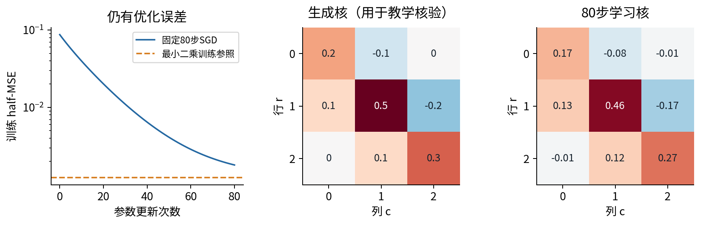

固定结果为：训练half-MSE约0.00180414，测试约0.00183973；训练目标均值构造的常数预测器测试约0.07777710。最小二乘训练参照约0.00124280，设计矩阵秩为10，80步参数与其最大绝对差约0.04305518。真实偏置0.15，学习偏置约0.15013723。

应保留两个不完美事实：有限带噪数据的最小二乘参数不必等于真参数；80步SGD又没有达到最小二乘训练最优值。前者属于抽样与噪声，后者属于优化。不能把两者混成“卷积找不到规律”，也不能为了漂亮图把参照线删掉。这里常数基线仅检查是否学到局部输入信息，不是声称击败强视觉系统。

我们报告全部20幅图的误差，不给这些小样本结果加普遍优越性的结论。图内窗口重叠，192个训练输出不等于192幅独立图像；若以后做方法区间比较，应按独立图像或真实采样单位组织分析，而不是随意重采样窗口。

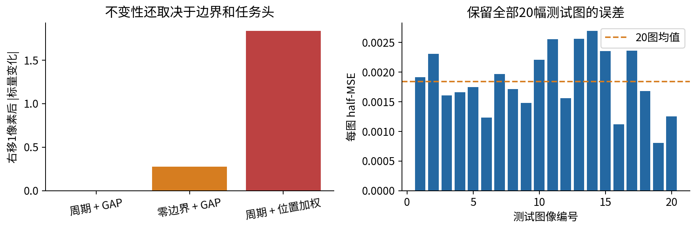

## 14 实现与核验怎样分工

experiment.py里的conv_forward明确检查NCHW、通道和偏置形状，再遍历样本、输出通道与窗口；每窗跨输入通道及核位置乘加。conv_backward拿到与输出完全同形状的上游，返回与输入、核、偏置分别同形状的三个梯度。API不自动构造损失，因而调用者负责把正确归约因子放进上游。

测试从四条独立方向核验：不同通道、非方形核、步幅、补边和膨胀组合与PyTorch前后向对齐；小平滑算子的所有输入和参数坐标用中心差分；基向量构造独立线性算子，检查转置与内积恒等式；Fraction逐项计算手算实例，再核对每次状态与梯度。还有非连续数组、只读输入、样本梯度累加和明确失败输入。

测试用unittest与显式异常，Python -O不会把它们删掉。训练80步也同时执行独立PyTorch路径，保存最大前向/梯度绝对差约$4.44\times10^{-16}$。这支持两条实现按预定公式运行，不能保证任何任务假设都正确。

支持域是CPU float64可表示的有限实数、非空数组、groups=1、对称零填充、正整数步幅与膨胀。为了避免教学循环意外占用过多资源，原始/补边/输出数组不超过一百万元素，每次算子不超过两千万个乘加位置。布尔、复数、对象数组、非有限数、错形状、无输出窗口和超出资源上限均拒绝。运算溢出抛出错误，不返回伪装正常的结果；很小数的下溢与一般浮点舍入仍受float64限制。

周期卷积只作为单通道探针的独立参考函数，不是从零API的一个可选padding_mode。没有实现groups、FFT卷积、复数卷积、GPU或所有框架选项。环境与版本变动可能造成数值末位变化，固定种子不能提供跨版本、跨设备逐字节一致保证。[S4]

## 15 从机制实验走向研究问题

先问任务希望什么变换规律。整图类别可能希望对少量位移稳定，位置回归应该跟随位移，科学坐标相关量可能根本不该平移不变。再问数据有没有相同规则的局部区域，卷积核的物理视野是多少，边界是否对应实际实验条件。

接着把假设写成可反驳的对照：固定图像与核，分别改变边界、步幅或任务头；对比时只改一个已说明的条件，记录对齐坐标与完整误差。若计划比较CNN和MLP，应匹配并报告参数、数据、优化预算和选择规则，而不是从本讲的5对40参数小例子推断真实性能。

最后区分数学、实现与经验。等变等式是带前提的数学命题；梯度测试是有限输入上的实现证据；测试集误差是固定数据上的经验结果。三个层次互相支持，却不能互相替代。能解释一个失败发生在边界、采样、梯度还是建模假设上，才是这一讲要培养的研究能力。

## 16 练习与继续学习

1. 不翻核地手算$(1,2)$与$(3,4)$，再解释翻核后的差异。
2. 推导$H=8,k=3,s=2,p=1,d=2$的输出长度和每个窗口坐标。
3. 计算3输入通道、8输出通道、$3\times3$卷积与$1\times1$卷积参数量。
4. 逐窗复算两样本的初始前向与平均损失。
5. 重建五参数的两样本贡献，解释两个平均因子的来历。
6. 单独核对样本1中心像素输入梯度，解释四条路径的核坐标。
7. 用更新后的参数重新前向，解释平均损失下降但样本1变差。
8. 求两层膨胀/步幅组合的感受野包络和实际位置集合。
9. 说明零边界内部掩码为何从列2开始，而不是全图都比较。
10. 分别说明周期GAP不变、零边界GAP失效与位置加权头失效。
11. 解释80步训练、最小二乘参照和真核为何不完全相同。
12. 为一个自己熟悉的科学网格数据提出一个可能不成立的共享假设及可检验对照。

独立实验步骤见lab，全部详解见answers。下一讲044将把多层卷积与残差路径串起来；不要在尚未弄清坐标、共享和梯度累加时，用更深的网络掩盖这些问题。

## 一手来源与阅读边界

[S1] PyTorch Conv2d官方接口与已安装2.7.1源码文档，互相关、NCHW和形状约定：[官方文档](https://docs.pytorch.org/docs/stable/generated/torch.nn.modules.conv.Conv2d.html)。动态文档可能显示更新版本，本讲真实代码固定2.7.1 CPU；详见sources.md。

[S2] Araujo、Norris、Sim，2019，[Computing Receptive Fields of Convolutional Neural Networks](https://distill.pub/2019/computing-receptive-fields/)。参考其感受野与对齐推导，本文数值例子和图独立构造。

[S3] Zhang，2019，[Making Convolutional Networks Shift-Invariant Again](https://proceedings.mlr.press/v97/zhang19a.html)。用于说明下采样与抗混叠研究背景，不作为本讲小实验的经验保证。

[S4] [PyTorch 2.7 Reproducibility](https://docs.pytorch.org/docs/2.7/notes/randomness.html)。说明固定种子与跨平台一致性的边界。
