# 044 深层卷积与残差网络

从一条额外路径出发，分清“梯度能传到”与“网络一定训得好”。

## 1 本讲要解决的真实问题

在043中，一个卷积核在不同位置反复使用；在035中，层层相乘的导数可能放大或缩小信号；在036中，归一化又使训练和推理使用的统计不同。本讲把三者接起来：相同的一组卷积层，仅增加逐元素相加的路径，会怎样改变前向、反向和实际训练？先修035、036、043。不了解卷积输出尺寸时，先回043，不能靠代码广播“补齐”形状。

学习终点不是背出“残差解决梯度消失”，而是能完成四件事：画清每一条梯度路径；在通道数和分辨率改变时正确设计投影；保持参数量、初始化和更新预算可比较；面对失败曲线，提出可以检验的解释。全讲不需要下载图像或预训练模型，CPU即可运行。

我们用六参数微型网络把两条样本、全部局部导数、路径求和和同步更新算到底，再训练真实的浅/深CNN与残差CNN。结果不会配合口号：浅层残差的平均验证交叉熵略差；深层残差在本次固定数据上更好，但深层普通网络也训练成功。大步长下两种架构都出现巨大的推理态损失尖峰，不能只凭一条曲线就归因于梯度爆炸。

## 2 一个加号究竟改变了什么

普通块把输入张量$x$映射为$F_\theta(x)$。这里$x$是整块特征图，不是一个像素，$\theta$是该块全部可学习参数。最简单的残差块定义为

$$y=x+F_\theta(x).$$

相加逐元素进行，所以两个张量的每个维度都必须一致。它不是拼接：两支各有8个通道，相加后仍为8个通道。恒等捷径不含可学习参数，但仍有逐元素加法、内存读写和激活保存成本。说“零参数”可以，说“绝对零计算”不精确。

图1采用主实验实际使用的后激活结构：先做卷积与BN，支路末端相加，再做ReLU。普通对照保留同样的卷积、BN和末端ReLU，只去掉加法。主实验没有投影，因此两种架构可学习参数完全一样。

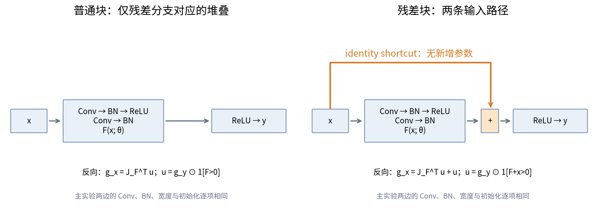

原始ResNet论文将目标映射写成输入加残差，并用视觉任务研究深度增加时的优化困难。这里沿用其问题意识，不复刻ImageNet结果，也不把本讲的小网络称为标准ResNet-18。[He等，2015，§3](https://arxiv.org/html/1512.03385v1)

“残差”在这里指学习相对于输入的修正函数，不等于监督学习的预测误差$\widehat y-t$；它也没有要求每个残差特征很小。训练可以产生很大的$F$，不能把名称当成约束。

## 3 不跳步的残差反向传播

将一个样本的特征图按固定顺序展平为$m$维列向量，定义$J_F=\partial F/\partial x\in\mathbb R^{m\times m}$，$g_y=\partial L/\partial y$。雅可比矩阵的第$(i,j)$项表示第$i$个输出对第$j$个输入的局部导数。工程实现通常不显式存储这个大矩阵，而是直接计算它与向量的乘积。

对一个输入坐标$x_j$，所有输出坐标的损失路径都要累加：

$$\frac{\partial L}{\partial x_j}=\sum_i\frac{\partial L}{\partial y_i}\left(\delta_{ij}+\frac{\partial F_i}{\partial x_j}\right).$$

$\delta_{ij}$在$i=j$时为1，否则为0；它来自捷径$y_i$中直接出现的$x_i$。把两项分开，得到

$$g_x=g_y+J_F^Tg_y,\qquad g_\theta=J_\theta^Tg_y.$$

参数只有残差支路使用，因此恒等捷径不额外产生参数梯度；输入被两条支路使用，因此输入梯度必须相加。遗漏一支的反向，前向图看起来仍然正确，训练却已经变了。

若块定义为$y=\operatorname{ReLU}(x+F(x))$，必须先经过末端门：令$s=x+F(x)$，$u=g_y\odot\mathbf1[s>0]$，再计算$g_x=u+J_F^Tu$。负的$s$会同时截断两条输入路径。本讲代码在零点采用导数0；数学上ReLU在零点不可微，中心差分不能在该点被当成唯一真导数。

多块无末端激活、同形状恒等捷径时，$x_{l+1}=x_l+F_l(x_l)$可展开成$x_L=x_l+\sum_{k=l}^{L-1}F_k(x_k)$。展开式中的$F_k$仍然通过$x_k$依赖更早输入，不能将求和项视为互相独立的常数。反向是各块$(I+J_{F_l})^T$的有序乘积。矩阵通常不可交换，不能随意调整顺序。[He等，2016，§2](https://arxiv.org/html/1603.05027v3)

## 4 为什么“多了一个1”不是不消失保证

一维反例足以推翻绝对保证。若$F(x)=-x$，则$y=0$，导数$1+F'(x)=0$；直接路径与残差路径完全抵消。若$F'(x)=1$，每块导数为2，十块乘积为1024。后激活块还可能因ReLU门关闭而得到0。输入梯度存在直接项，不等于总梯度有非零下界，更不等于所有参数都有有用梯度。

合理解释是：在某些初始化和训练区域，$J_F$的尺度较小，$I+J_F$可能比任意$J_F$更接近恒等映射，且“接近恒等的目标”可以通过让残差支路接近0实现。这是结构提供的便利，需要条件和实验证据。初始化、归一化、学习率、深度和数据都仍然重要。

深层模型训练误差更高时，应区分优化困难与泛化问题。训练误差已经下降而验证变差，可能涉及过拟合或分布差异；训练误差迟迟不降，首先检查优化与实现。训练态小批损失低、推理态整集损失高，还可能是BN运行统计问题。本讲会专门验证最后一种现象。

预激活块常将BN/ReLU放到卷积之前，使加法之后没有额外ReLU；这有利于讨论恒等路径。不能仅把一行ReLU移动后就声称复现完整预激活ResNet，首块、投影和最后分类头也需要一致设计。本讲主实验固定为后激活，预激活只作概念边界。

## 5 下采样与投影：先核对形状，再做加法

同形状块输入为$N\times C\times H\times W$，两个$3\times3$、stride 1、padding 1的卷积都保持空间尺寸。若第一层把通道改为$D$并使用stride 2，则输出高为

$$H'=\left\lfloor\frac{H+2-3}{2}\right\rfloor+1=\left\lceil\frac H2\right\rceil.$$

宽同理。原始$x$不能直接与$N\times D\times H'\times W'$相加。使用$1\times1$、stride 2、无padding的投影$P$，得到$s=P(x)$，输出尺寸也为$\lceil H/2\rceil$。输入13得到7，不是通过四舍五入随便选6或7。卷积接口采用互相关，维度约定为NCHW；参见[PyTorch 2.7.1卷积源码与接口说明](https://github.com/pytorch/pytorch/blob/v2.7.1/torch/nn/modules/conv.py)。

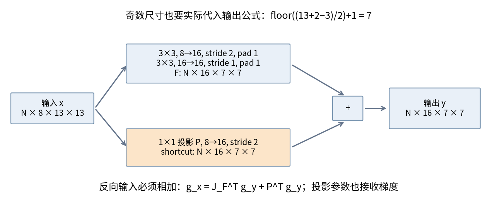

投影版本的无末端门输出是$y=F_\theta(x)+P_\phi(x)$。输入反向变为$g_x=J_F^Tg_y+J_P^Tg_y$，投影还得到$g_\phi=J_\phi^Tg_y$。$P^T$是前向线性算子的伴随，不意味着随意调用一个默认参数的转置卷积就一定恢复正确形状；stride、padding和输出尺寸必须对应。

忽略偏置和BN时，上图两层残差卷积参数分别为$16\cdot8\cdot9=1152$与$16\cdot16\cdot9=2304$；投影另有$16\cdot8=128$，合计3584。每个空间位置先做相应乘加，7×7输出总卷积MAC为$49(1152+2304+128)=175616$。若投影后有BN，还要加32个可学习缩放/平移参数；运行均值方差是缓冲区，不算可学习参数。

步幅2也改变采样结构，即使形状匹配也不保证对任意1像素平移等变，043的边界与采样结论仍有效。用广播把通道1自动扩成16并不等于学会投影。本讲独立参照明确拒绝这种形状不一致。

## 6 用六个参数算完一次训练

纸笔网络是一通道、两个空间位置的微型残差模型。两个$1\times1$卷积的共享参数为$(w,b)$和$(v,c)$，最后平均池化与仿射预测的参数为$(a,d)$。它有真实共享权重和恒等捷径，但没有BN，也没有加法后的ReLU；这是便于完整计算的独立小例子，不是后文CNN日志的缩写。

两条训练样本为$A:x=(-1,1),t=0$，$B:x=(1,2),t=1$。参数固定顺序$\theta=(w,b,v,c,a,d)$，初值$(0.5,0.25,0.4,-0.1,0.8,0.1)$。对每条样本的每个位置$j$依次计算

$$z_j=wx_j+b,\quad h_j=\max(0,z_j),\quad F_j=vh_j+c,\quad s_j=x_j+F_j,$$

$$m=(s_1+s_2)/2,\quad \widehat y=am+d,\quad L=\frac12\sum_{i=A,B}\frac{(\widehat y_i-t_i)^2}{2}.$$

最后一个式子外面的$1/2$是两样本平均；每个平方损失内部的$1/2$是为了使局部导数成为误差。两者不能漏掉，也不能多除一次。

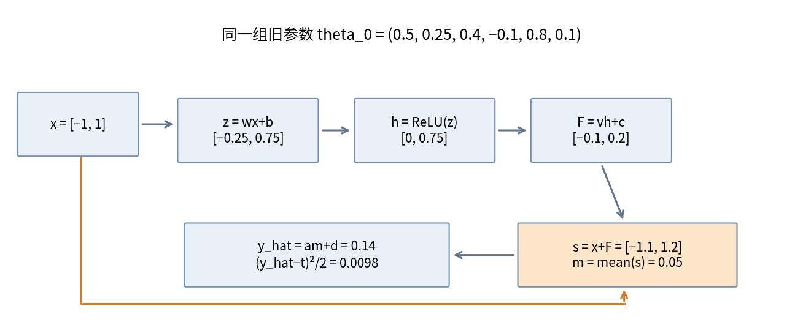

|节点|样本A|样本B|
|---|---|---|
|$z$|(-0.25, 0.75)|(0.75, 1.25)|
|$h$|(0, 0.75)|(0.75, 1.25)|
|$F$|(-0.1, 0.2)|(0.2, 0.4)|
|$s=x+F$|(-1.1, 1.2)|(1.2, 2.4)|
|$m$|0.05|1.8|
|$\widehat y$|0.14|1.54|
|误差$e=\widehat y-t$|0.14|0.54|
|单样本损失$e^2/2$|0.0098|0.1458|
|对平均损失的贡献$e^2/4$|0.0049|0.0729|

因此$L_0=0.0778=389/5000$。例如样本B的第二位置先算$z=0.5(2)+0.25=1.25$，再算$F=0.4(1.25)-0.1=0.4$，加回输入2得到2.4。两个位置使用同一组$w,b,v,c$，不是各自一套参数。

## 7 从损失逐节点倒走，两支相加

记$u_i=\partial L/\partial\widehat y_i=e_i/2$。预测节点的局部导数为$\partial\widehat y/\partial a=m$、$\partial\widehat y/\partial d=1$、$\partial\widehat y/\partial m=a$。池化对每个$s_j$的局部导数为$1/2$，故

$$g_{m,i}=u_i a,\qquad q_i=\partial L/\partial s_{ij}=u_i a/2.$$

加法节点对$x_j$和$F_j$各给出局部导数1；乘法$vh_j$对$v$的导数为$h_j$、对$h_j$为$v$；ReLU给出门$\mathbf1[z_j>0]$；仿射$wx_j+b$对$w,b,x_j$的导数分别为$x_j,1,w$。因此

$$r_{ij}=\partial L/\partial z_{ij}=q_i v\mathbf1[z_{ij}>0].$$

|反向节点|样本A|样本B|
|---|---|---|
|$u=e/2$|0.07|0.27|
|$g_m=ua$|0.056|0.216|
|每个$s$的$q=g_m/2$|0.028|0.108|
|$r=(\partial L/\partial z_1,\partial L/\partial z_2)$|(0, 0.0112)|(0.0432, 0.0432)|
|输入直接路径梯度|(0.028, 0.028)|(0.108, 0.108)|
|输入残差路径梯度$wr$|(0, 0.0056)|(0.0216, 0.0216)|
|总输入梯度$q+wr$|(0.028, 0.0336)|(0.1296, 0.1296)|

样本A第一个内部门虽然关闭，但其输入梯度仍有0.028。样本A第二个输入梯度是$0.028+0.0112(0.5)=0.0336$，不能只保留0.0056，也不能把两条路径取平均。输入不是本轮训练参数，计算输入梯度是为了审查路径，不对输入做梯度下降。

六个参数的单样本贡献按既定顺序为

$$(\sum_jr_{ij}x_{ij},\ \sum_jr_{ij},\ q_i\sum_jh_{ij},\ 2q_i,\ u_im_i,\ u_i).$$

|参数|A贡献|B贡献|批梯度|
|---|---:|---:|---:|
|$w$|0.0112|0.1296|0.1408|
|$b$|0.0112|0.0864|0.0976|
|$v$|0.021|0.216|0.237|
|$c$|0.056|0.216|0.272|
|$a$|0.0035|0.486|0.4895|
|$d$|0.07|0.27|0.34|

$w$的B贡献是$0.0432(1)+0.0432(2)=0.1296$，这是空间位置共享导致的求和；接着A与B的贡献再相加，这是样本共享导致的求和。$u$已经含有样本平均因子，因此最后一列不能再除以2。

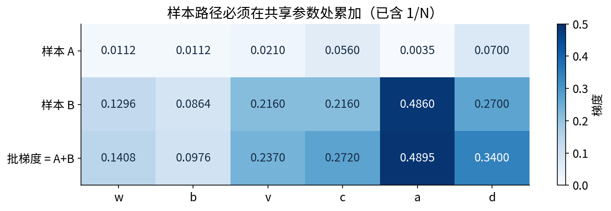

## 8 同步更新后必须重新前向

学习率取$\eta=0.1$，无正则化。先用旧参数算完全部梯度，再统一执行$\theta_1=\theta_0-0.1\nabla L(\theta_0)$。结果为

$$(w,b,v,c,a,d)_1=(0.48592,0.24024,0.3763,-0.1272,0.75105,0.066).$$

若先更新$a$再计算$w$梯度，反向中使用的新$a$与旧前向不一致，那不是同一个损失点的梯度。若每算完一条样本就更新，也已变成另一种训练算法。

|新前向节点|样本A|样本B|
|---|---|---|
|$z$|(-0.24568, 0.72616)|(0.72616, 1.21208)|
|$h$|(0, 0.72616)|(0.72616, 1.21208)|
|$F$|(-0.1272, 0.146054008)|(0.146054008, 0.328905704)|
|$s$|(-1.1272, 1.146054008)|(1.146054008, 2.328905704)|
|$m$|0.009427004|1.737479856|
|$\widehat y$|0.0730801513542|1.3709342458488|
|新平均损失贡献|0.00133517713049|0.03439805368585|

两项相加得$L_1=0.03573323081634$。例如B的新预测是$0.75105(1.737479856)+0.066$，不能使用旧的$m=1.8$。程序以Fraction进行纸笔账本的精确计算，表中小数只是显示近似。

再把同样的局部导数链作用于新节点，得到第二轮批梯度约$(0.08378858961,0.05758021980,0.14495780885,0.16673850651,0.32258985347,0.22200719860)$。第二次同步更新后，参数约为$(0.47754114104,0.23448197802,0.36180421912,-0.14387385065,0.71879101465,0.04379928014)$。第三次前向预测为$(0.03296899259,1.26583551990)$，损失$L_2=0.01793886953$。完整第二轮逐样本贡献见解答与可执行账本。

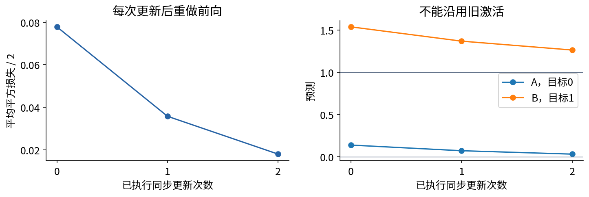

## 9 从标量账本到独立数值参照

reference.py另有纯NumPy四重滑窗参照：输入NCHW，核OIHW；前向逐位置取窗口乘核求和，反向在同一窗口累加输入梯度和核梯度。两层$3\times3$支路加恒等或$1\times1$投影，内部有ReLU，加法后无门。它与纸笔例子共同检查加法路径，但不冒充带BN的主模型。

数值检验使用double精度，与PyTorch自动微分比对输出、输入、两个卷积核和投影核的全部元素，再对全部输入与参数做中心差分。涵盖同形状4×4、奇数5×5步幅2投影和偶数4×4步幅2投影。有限差分前检查内部预激活远离0，步长$10^{-6}$，最大误差约$1.45\times10^{-9}$。中心差分是另一个数值估计，不是数学证明；浮点舍入与ReLU折点都限制它。

此教学参照只支持有限、非空实数浮点四维张量、残差3×3核、可选1×1投影、stride为1或2、dilation与groups为1、零padding。整数数组、NaN、空维度、通道不一致、上游形状不一致和广播捷径明确报错；有限但过大的数值若使float64卷积、反向或加法溢出，也拒绝继续。它不是完整卷积库；不支持的功能不静默猜测。检查使用显式异常，所以python -O不会移除它们。

## 10 真正训练的CNN对照设计

任务是将原创12×12单通道图像分为水平条纹与竖直条纹。每张图仅有一条宽1像素、长度5到7、幅度0.7到1.3的线段，加标准差0.30的独立高斯噪声，位置变化。中心行、列分别从0起编号的3至8均匀抽取，标签0为横、1为竖。训练256张、验证128张、测试512张，均类别平衡，生成种子分别4400、4401、4402。没有真实个人或外部图片。相同生成机制下的独立样本只是一个简单封闭任务，不代表自然图像识别。

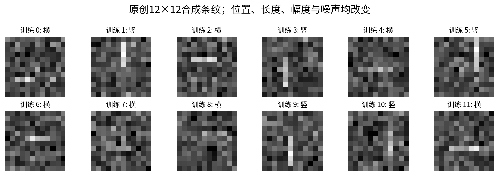

模型共同使用1→8的3×3卷积、BN、ReLU作stem；之后是2块或6块，每块含两层8→8的3×3卷积与BN；全局平均池化后由8→2线性层输出logits。所有卷积padding 1、stride 1、无偏置；BN带缩放和平移；分类头有偏置。深浅模型分别有5和13个卷积层，另加一个线性层。“2块/6块”不是总层数。

|条件|可学习参数|每样本卷积与线性前向MAC|额外捷径加法|
|---|---:|---:|---:|
|Plain，2块|2474|342160|0|
|Residual，2块|2474|342160|2304|
|Plain，6块|7210|1005712|0|
|Residual，6块|7210|1005712|6912|

stem参数为$8\cdot1\cdot9+2\cdot8=88$；每块为$2(8\cdot8\cdot9+2\cdot8)=1184$；分类头为$8\cdot2+2=18$，总数$106+1184B$。BN缓冲区不计入参数。每次乘加记作一个MAC，不等同于一个FLOP；表中不包含BN、激活、池化、反向、评估和内存成本。浅深计算量不同，所以“相同步数”不是“等计算”。

每个深度、学习率和种子下，Plain与Residual逐张量相同初始化、相同样本顺序；不同之处仅为捷径开关。卷积使用He fan-in，BN的gamma=1、beta=0，不对残差单独使用末层BN零初始化。种子11、29、47共享同一数据拆分，表示初始化/顺序扰动，不能当作三份独立新数据。

优化器固定SGD，动量0.9，无weight decay、无梯度裁剪、无调度。两个预定学习率为0.03和1.0；每次18个epoch，每批32条，8次更新/epoch，共144次更新、4608次样本呈现。总共$2\times2\times2\times3=24$次训练、3456次更新。每个架构按三个种子的最终验证交叉熵平均选择学习率；不选择最佳中间epoch，不因结果失败删除种子。

分类损失使用logits直接进入交叉熵，即单样本$\ell=-z_t+\log\sum_k\exp z_k$，批内取平均；其对logit的梯度是$(p_k-\mathbf1[k=t])/N$。不先softmax再传给CrossEntropyLoss。测试标签只在全部验证选择完成后读取，测试12个已选定最终模型。程序的文件公开，因此这是可复现的信息边界，不是外部保密盲测。

## 11 全部轨迹揭示的成功与失败

主实验每次更新保存小批损失、总参数梯度范数、stem与分类头梯度RMS；每个epoch以eval状态记录全训练集与验证集指标。另在固定32条训练样本上，以eval状态测所有卷积与分类头参数梯度RMS，测量不更新模型、不改变BN运行统计。不同层的参数化与尺度不同，梯度数值大不自动表示那层更重要。

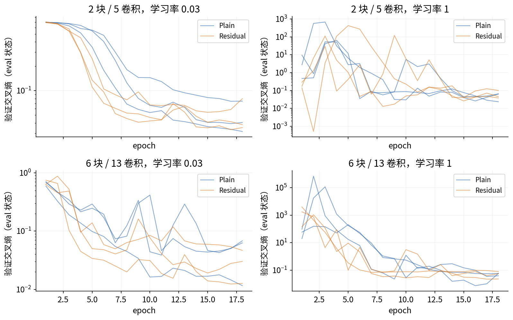

|块数与捷径|lr=0.03最终验证CE均值|lr=1.0最终验证CE均值|所选学习率|
|---|---:|---:|---:|
|2块Plain|0.048823|0.050528|0.03|
|2块Residual|0.051045|0.061254|0.03|
|6块Plain|0.047521|0.051333|0.03|
|6块Residual|0.029849|0.052045|0.03|

浅层残差的验证CE略高于普通网，因此不能声称所有比较都改善。低学习率下，6块普通网最终训练CE均值约0.002540，6块残差约0.001564；两者都能拟合。这份小任务没有重现“深层普通网必然退化”的故事，不能为了讲故事换掉不利数据。

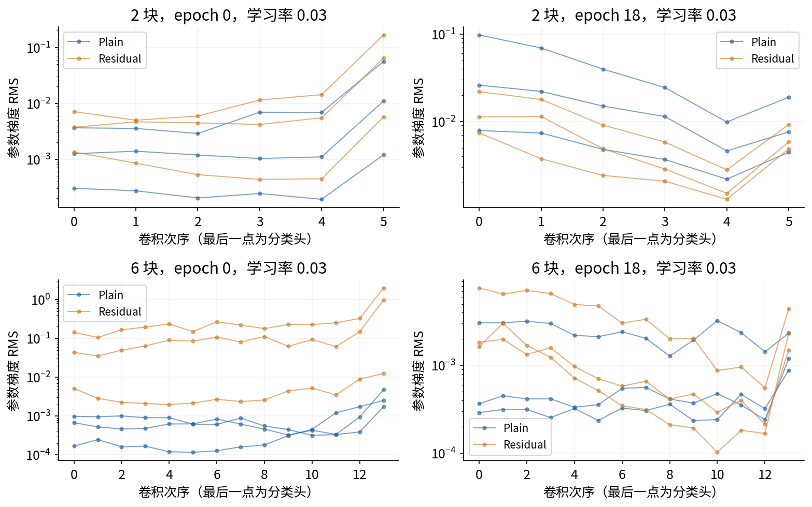

## 12 把失稳定位到可操作的机制

所有24次训练都完成，未出现非有限梯度或参数；但学习率1.0出现严重的推理态尖峰。例如6块Plain、seed47在epoch2的验证CE为694684.625，不能因最终训练恢复就删掉。这次训练的最大单批梯度总范数约7.158，与巨大的验证损失并不是同一个量。

观察到尖峰后，我们进行事后机制检查，保留每次运行验证CE最高时的检查点用于诊断。在复制的模型上做两种操作，绝不改原训练或模型选择：第一，对同一32条训练样本分别使用eval和train状态，只切换BN统计；第二，保持全部可学习权重不动，重置BN运行统计，用全部训练数据按8批重新累积，再评估验证集。

seed47上述峰值的固定训练批CE在eval状态为795868，在train状态约0.286091；仅用训练数据重估BN后，验证CE降至0.228225。这个对照直接支持“运行统计与当前权重不匹配对本次尖峰有巨大贡献”，比只说梯度爆炸更精确。重新累积不是保证，有限批统计和深层统计依赖仍会影响结果；没有把诊断后的成绩替换为正式成绩。

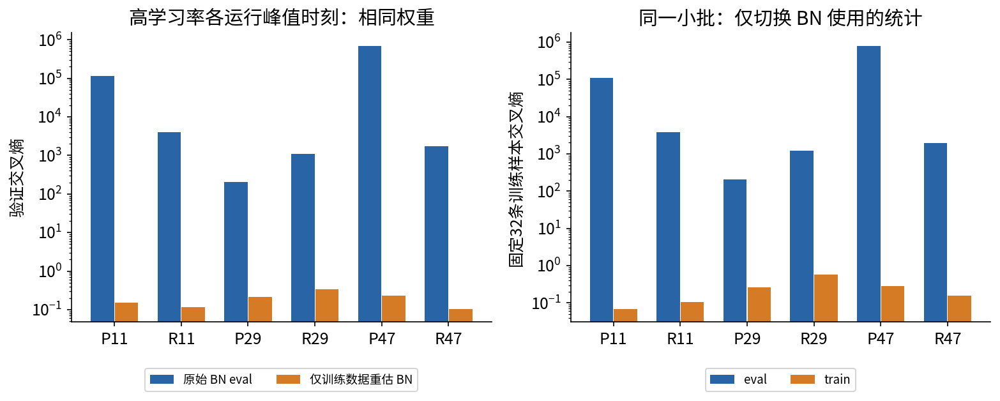

BN的运行缓冲区、状态切换与累积平均语义由[PyTorch 2.7.1官方实现](https://raw.githubusercontent.com/pytorch/pytorch/v2.7.1/torch/nn/modules/batchnorm.py)核对。这里调用train()做诊断不等于在验证集上训练：图9右边只用固定训练小批；左边重估只读训练输入。没有让验证或测试标签参与参数更新。真实部署若要使用重估BN的流程，必须预先定义数据来源、重估协议和独立验证，不能在看完测试结果后反复补救。

## 13 测试结果、错误样本与结论边界

四个架构均由验证选中学习率0.03。最终测试准确率按种子顺序11、29、47报告，避免均值遮住差异。

|架构|seed11|seed29|seed47|均值|
|---|---:|---:|---:|---:|
|Plain 2块|99.6094%|99.4141%|98.6328%|99.2188%|
|Residual 2块|99.8047%|99.4141%|99.4141%|99.5443%|
|Plain 6块|99.2188%|99.2188%|98.4375%|98.9583%|
|Residual 6块|99.2188%|99.6094%|99.0234%|99.2839%|

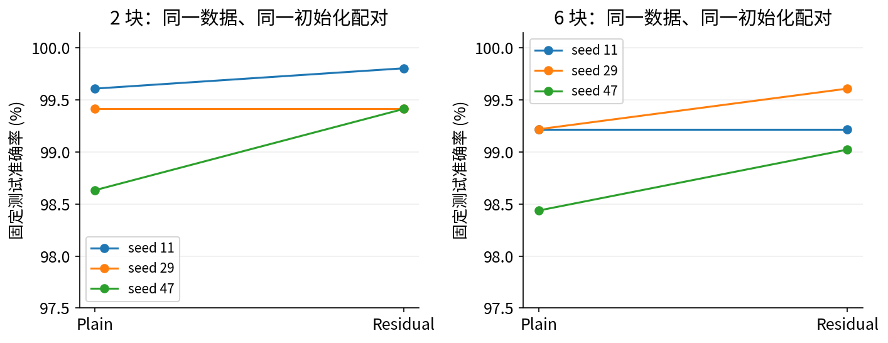

本次同深度残差平均准确率都略高，但6块残差也没有超过2块残差。小数点后的精度来自有限样本计数，不意味着总体差异被估计得如此精确。三个种子共用测试数据，不能用1536个预测当成1536条独立测试样本，也不能据此声称统计显著或因果普遍有效。更广泛结论需要多数据拆分、更多任务、合适的配对不确定性分析以及更严格计算预算对照。

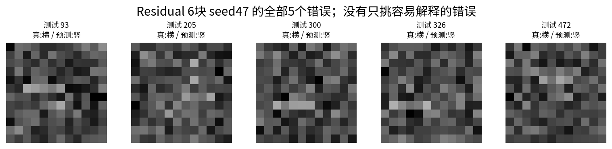

本讲可以得出的结论很具体：残差增加了一条结构化输入路径；形状改变时投影也需要训练与预算；在这份同宽同深对照中，残差的作用随深度、学习率与指标而变；归一化状态能造成看似“网络爆炸”的严重推理故障。它不能证明任何深度、任何数据上残差都更好，也没有比较预激活、瓶颈块、宽残差网、注意力或预训练模型。

## 14 阅读、复现与下一步

先独立完成lab.md，再用answers.md核对。experiment.ipynb在新Python内核完整重训24个候选并显示11张实际生成图；执行范围、环境与复现命令见README.md。

下一讲045讨论视觉输入与增强。等MAC浅宽、预激活和含投影网络都是新的实验问题，须另定协议，不能从本讲直接外推。一手来源见sources.md；本讲数据、推导与图均为原创。
